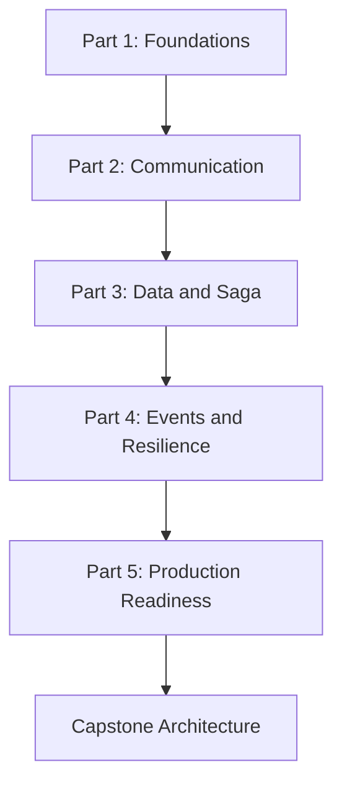
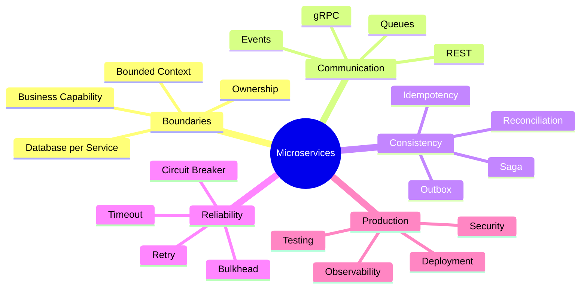
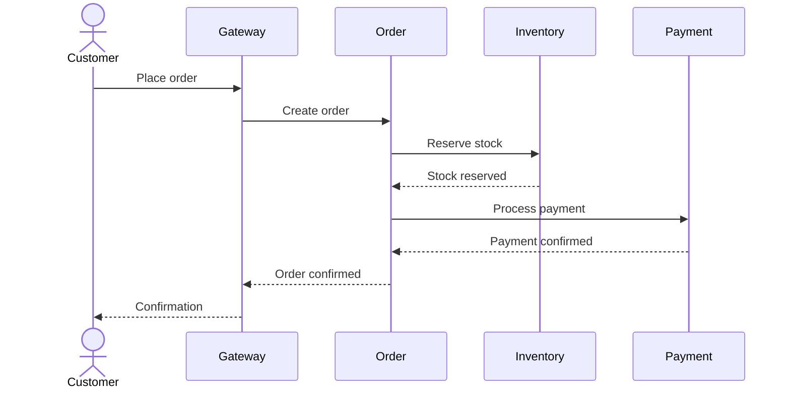

# Microservices Architecture In-Depth

## Master Course Guide and Navigation

> **One-line memory:** Microservices = Domain Ownership + Independent Lifecycle + Distributed-System Responsibility.

## 1. Course Identity

| Item | Details |
|---|---|
| Course | Microservices Architecture In-Depth |
| Duration | 10 Hours |
| Level | Intermediate to Advanced |
| Delivery | Instructor-led, demonstration-driven and hands-on |
| Learning Ratio | 30% concepts and 70% practical work |
| Audience | Developers, Senior Developers, Technical Leads, Architects, DevOps Engineers, QA Engineers and Engineering Managers |
| Prerequisites | Programming fundamentals, REST APIs, databases, Git and basic cloud/container awareness |
| Primary Case Study | Order and Payment Processing Platform |
| Architecture Approach | Vendor-neutral foundation with technology adapters |

## 2. Course Purpose

This course develops practical architectural judgment—not merely knowledge of individual patterns. Participants learn how to decide whether microservices are justified, define defensible service boundaries, manage distributed data and transactions, design for partial failure, secure and observe services, and prepare an architecture for production deployment.

The course follows three principles:

1. **KIS:** Keep architecture and explanations simple enough to understand and operate.
2. **DRY:** Reuse contracts, standards and cross-cutting practices without duplicating business ownership.
3. **SOLID:** Maintain clear responsibilities, abstractions and dependency boundaries.

## 3. Primary Learning Objectives

After completing the course, participants will be able to:

1. Compare monolith, modular monolith, SOA and microservices.
2. Decide when microservices are justified and when they are not.
3. Decompose a business domain using bounded contexts and business capabilities.
4. Define service responsibilities, contracts and data ownership.
5. Select synchronous, asynchronous or hybrid communication.
6. Design distributed workflows using Saga and compensating transactions.
7. Apply Outbox, idempotency, CQRS and Event Sourcing appropriately.
8. Protect services against partial failures and cascading failures.
9. Establish security, observability and testing controls.
10. Design a containerized delivery, deployment and rollback strategy.
11. Review an architecture for production readiness.
12. Explain architecture decisions confidently in interviews and stakeholder reviews.

## 4. Course Journey

## 5. Parts, Modules and Duration

| Part | Module | Duration |
|---|---|---:|
| Part 1 — Architecture Foundations | 1. Microservices Fundamentals and Decision-Making | 1 Hour |
| Part 1 — Architecture Foundations | 2. Domain-Driven Decomposition and Service Boundaries | 1 Hour |
| Part 2 — Communication and Integration | 3. Synchronous and Asynchronous Communication | 1 Hour |
| Part 2 — Communication and Integration | 4. API Gateway, Discovery and Configuration | 1 Hour |
| Part 3 — Data and Distributed Transactions | 5. Data Ownership and Consistency | 1 Hour |
| Part 3 — Data and Distributed Transactions | 6. Saga and Distributed Workflow Management | 1 Hour |
| Part 4 — Event-Driven and Reliable Systems | 7. Event-Driven Architecture, CQRS and Event Sourcing | 1 Hour |
| Part 4 — Event-Driven and Reliable Systems | 8. Resilience, Fault Tolerance and Performance | 1 Hour |
| Part 5 — Production Readiness | 9. Security, Observability and Testing | 1 Hour |
| Part 5 — Production Readiness | 10. Deployment, DevOps and Architecture Capstone | 1 Hour |
|  | **Total** | **10 Hours** |

## 6. Course File Navigation

| File | Purpose | Status |
|---|---|---|
| `README.md` | Master guide, standards and navigation | Current file |
| `00-Microservices-Architecture-TOC.md` | Formal Parts → Modules → Topics TOC | Planned |
| `01-Microservices-Fundamentals.md` | Architecture foundations and adoption decisions | Planned |
| `02-Domain-Driven-Service-Decomposition.md` | DDD, boundaries, ownership and migration | Planned |
| `03-Synchronous-and-Asynchronous-Communication.md` | REST, gRPC, messaging and contracts | Planned |
| `04-API-Gateway-Service-Discovery-and-Configuration.md` | Gateway, discovery, load balancing and configuration | Planned |
| `05-Distributed-Data-and-Consistency.md` | Data ownership, consistency, Outbox and CDC | Planned |
| `06-Saga-and-Distributed-Transactions.md` | Choreography, orchestration and compensation | Planned |
| `07-Event-Driven-Architecture-CQRS-and-Event-Sourcing.md` | Events, CQRS, Event Sourcing and replay | Planned |
| `08-Resilience-Fault-Tolerance-and-Performance.md` | Timeout, retry, circuit breaker, bulkhead and scaling | Planned |
| `09-Security-Observability-and-Testing.md` | Zero Trust, telemetry and testing strategy | Planned |
| `10-Deployment-DevOps-and-Architecture-Capstone.md` | Containers, Kubernetes, CI/CD and capstone | Planned |
| `11-Quick-Mind-Refresher.md` | Visual recall and interview refresher | Planned |
| `12-Practice-Assessment-and-Capstone.md` | MCQs, subjective questions, assignments and final evaluation | Planned |

## 7. Locked Module-Writing Standard

Every one-hour module must contain the following sections in this order:

1. Module identity and duration
2. Learning objectives
3. What
4. Why
5. Real-life analogy
6. How it works
7. Core concepts
8. Architecture visualization
9. Separate mind map
10. Decision or comparison table
11. Real-world enterprise scenario
12. Step-by-step hands-on lab
13. Expected lab output
14. Failure scenarios and troubleshooting
15. Best practices
16. Anti-patterns
17. Security considerations
18. Performance considerations
19. Interview preparation
20. Quick recap
21. Learning outcome
22. Twenty MCQs
23. Ten subjective or scenario-based questions
24. Assignment

No mandatory section may be silently omitted. Where a section has limited relevance, the file must explain why rather than leave the section empty.

## 8. Real-Life Analogy Map

| Module | Primary analogy | Concept recalled |
|---|---|---|
| 1. Fundamentals | Independent shops in a shopping mall | Independent ownership with shared infrastructure |
| 2. Decomposition | Departments in a hospital | Clear responsibilities and boundaries |
| 3. Communication | Phone call versus courier | Synchronous versus asynchronous communication |
| 4. Gateway and Discovery | Hotel reception and directory | Entry routing and service location |
| 5. Data | Separate bank lockers | Data ownership and controlled access |
| 6. Saga | Flight, hotel and taxi booking | Multi-step workflow and compensation |
| 7. Events and CQRS | Newspaper publisher and subscribers | Event publication and independent consumers |
| 8. Resilience | Electrical circuit breaker and ship bulkheads | Stop and isolate failures |
| 9. Security and Observability | Airport security and control tower | Verification, monitoring and traceability |
| 10. Deployment | Replacing train coaches safely | Controlled release without stopping the system |

Analogies support understanding but do not replace technical explanations or production constraints.

## 9. Visual Standard

Every module must include:

- At least one architecture, workflow or process diagram
- One separate mind map
- One decision, mapping or comparison table
- A sequence or failure-path visual where the topic requires it

Recommended visual types:

| Need | Visual |
|---|---|
| Architecture components and relationships | Flowchart |
| Request, event or transaction order | Sequence diagram |
| Failure, retry and compensation path | State or flow diagram |
| Pattern choice | Decision table |
| Concept recall | Mind map |
| Service and data ownership | Mapping table or architecture diagram |

Visuals must be technically accurate, readable and directly connected to the module's learning objective.

## 10. Separate Course Mind Map

## 11. Practical Case Study

The complete course uses one evolving Order and Payment Processing Platform so that participants can connect each architectural concept to the same business journey.

### Core Components

- Web and mobile clients
- API Gateway
- Identity Service
- Customer Service
- Product Service
- Order Service
- Inventory Service
- Payment Service
- Notification Service
- Message broker
- Service-owned databases
- Centralized observability platform
- CI/CD and container platform

### Core Business Flow

The workflow will later be extended with events, Outbox, Saga compensation, retries, tracing, security and deployment controls.

## 12. Hands-On Delivery Standard

Each practical exercise must specify:

1. Business problem
2. Starting architecture or code
3. Required tools
4. Step-by-step activity
5. Expected technical output
6. Validation method
7. Failure case
8. Troubleshooting guidance
9. Architecture decision
10. Participant evidence or deliverable

Labs may use diagrams, configuration, pseudocode or working code depending on the learning objective and available time.

## 13. Vendor-Neutral Core and Technology Adapters

The engineering concept is always taught before a framework or cloud implementation.

| Foundation | Java/Spring | AWS | Azure |
|---|---|---|---|
| REST API | Spring Boot | API Gateway or ALB | API Management or Application Gateway |
| Queue | Spring messaging client | SQS | Service Bus Queue |
| Events | Spring events or Kafka client | EventBridge, SNS or MSK | Event Grid or Event Hubs |
| Containers | Spring Boot container | ECS, EKS or Fargate | AKS or Container Apps |
| Observability | Micrometer and OpenTelemetry | CloudWatch and X-Ray | Azure Monitor and Application Insights |
| Secrets | Spring integration | Secrets Manager | Key Vault |

These mappings are examples, not mandatory architecture choices.

## 14. Assessment Framework

### Pre-Assessment

- Ten diagnostic questions
- One architecture-selection scenario

### Per-Module Assessment

- Twenty MCQs
- Ten subjective or scenario questions
- One practical assignment
- Lab validation checkpoint

### Final Assessment

- Cross-module objective assessment
- Architecture trade-off discussion
- Failure and troubleshooting scenario
- Capstone presentation
- Production-readiness review

## 15. Participant Deliverables

By the end of the course, each participant or team should produce:

1. Architecture Decision Record
2. Domain and bounded-context map
3. Service-responsibility matrix
4. API and event-contract catalogue
5. Data-ownership matrix
6. Saga workflow and compensation matrix
7. Resilience-policy matrix
8. Security checklist
9. Observability plan
10. Testing strategy
11. Deployment and rollback strategy
12. Final microservices architecture diagram
13. Production-readiness checklist

## 16. Quality Gate

A module is complete only when:

- All locked sections are present
- Concepts are technically accurate and vendor-neutral first
- The real-life analogy maps correctly to the technical concept
- Visuals render correctly and explain meaningful relationships
- The lab can be completed within the allocated time
- Expected results and validation steps are explicit
- Failure and troubleshooting paths are included
- Security, performance and operational concerns are addressed
- MCQs contain answers and explanations
- Subjective questions test reasoning rather than memorization
- The assignment connects to the shared case study
- Duplication across modules is minimized
- Terminology and links remain consistent

## 17. Scope Boundary

The 10-hour course is an architecture-intensive program with focused demonstrations and design-oriented labs. It is not intended to provide exhaustive framework coding, full Kubernetes administration or complete cloud-provider implementation.

For extensive implementation, automated testing, containerization, Kubernetes deployment and production troubleshooting, use a 15–20-hour delivery plan.

## 18. Final Memory Line

> Start with the business domain, create clear boundaries, own data, expect failure, make communication reliable, observe everything important, and introduce distributed complexity only when its business and engineering benefits justify it.
