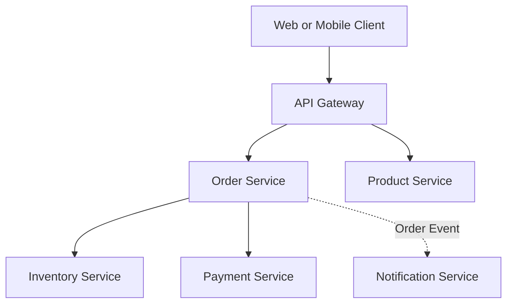
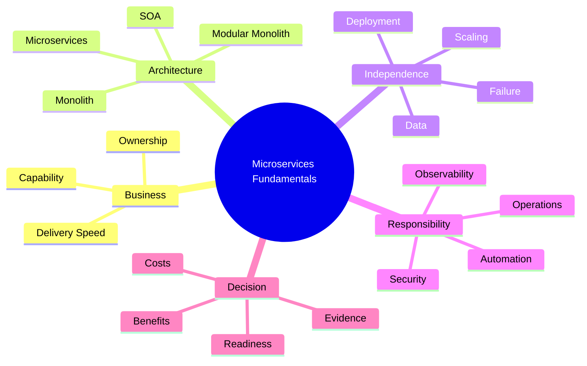

# Module 1 — Microservices Fundamentals and Decision-Making

## 1. Module Identity and Duration

| Item | Details |
|---|---|
| Course | Microservices Architecture In-Depth |
| Part | Part 1 — Architecture Foundations |
| Module | Module 1 — Microservices Fundamentals and Decision-Making |
| Duration | 1 Hour |
| Level | Intermediate to Advanced |
| Learning Ratio | 30% concepts and 70% discussion, analysis and practical work |
| Case Study | Order and Payment Processing Platform |

## 2. Learning Objectives

By the end of this module, participants will be able to:

1. Explain monolithic, modular-monolithic, SOA and microservices architectures.
2. Identify the defining characteristics of a microservice.
3. Separate genuine business drivers from technology fashion.
4. Evaluate organizational and operational readiness.
5. Recognize the Distributed Monolith anti-pattern.
6. Select an appropriate architecture using explicit evidence.
7. Record the decision in an Architecture Decision Record.

## 3. What Are Microservices?

Microservices architecture organizes a system as a set of small, independently managed services aligned with clear business capabilities. Each service owns a defined responsibility, exposes explicit contracts and can evolve through an independent lifecycle where justified.

A microservice is not defined only by codebase size. It is characterized by:

- Clear business responsibility
- Explicit ownership
- Controlled data ownership
- Well-defined contracts
- Independent change and deployment capability
- Independent scaling where required
- Failure isolation
- Operational accountability

> **Memory line:** Microservices = Domain Ownership + Independent Lifecycle + Distributed-System Responsibility.

## 4. Why Use Microservices?

Microservices may be valuable when a system needs:

- Independent delivery by multiple teams
- Different release cadences across business capabilities
- Selective scaling of high-demand workloads
- Fault isolation between critical capabilities
- Independent security or compliance boundaries
- Technology choices driven by genuinely different workloads
- Incremental replacement of a large legacy platform
- Clear business and technical ownership

Microservices should not be selected merely because:

- They are popular
- A competitor uses them
- Kubernetes is available
- The team wants multiple technologies
- The application may grow someday
- The current monolith contains untidy code

Distribution does not automatically fix weak design. It can move poor boundaries from in-process calls to unreliable network calls.

## 5. Real-Life Analogy — Independent Shops in a Shopping Mall

Imagine a shopping mall containing a supermarket, pharmacy, restaurant and cinema.

Each shop:

- Provides a distinct business capability
- Has its own employees and internal processes
- Manages its own inventory and transactions
- Can change opening hours independently
- Can become busy without every other shop becoming busy
- Follows shared mall rules for safety, access and infrastructure

The mall represents the larger platform. The shops represent services. Shared facilities such as security, electricity and directories represent platform capabilities such as identity, networking, observability and service discovery.

### Where the Analogy Stops

- Software services communicate through unreliable networks.
- Data consistency may cross service boundaries.
- One failed service may affect a complete business transaction.
- Deployment and contract compatibility require automation.

The analogy explains autonomy, but production architecture must also address distributed-system responsibility.

## 6. How Microservices Work

1. A business domain is divided into meaningful capabilities.
2. Each capability receives a clear service boundary and owner.
3. A service owns its logic and controlled data.
4. Services communicate through explicit APIs or events.
5. Each service can be built, tested and deployed independently.
6. Platform capabilities provide identity, configuration, telemetry and delivery automation.
7. Resilience patterns control network and dependency failures.
8. Teams monitor both technical health and business outcomes.

Independent deployment is meaningful only when one service can change without coordinating a simultaneous release of every other service.

## 7. Core Concepts

### 7.1 Monolithic Architecture

A monolith packages the system as one primary deployable unit. It may still contain well-designed internal modules.

**Strengths**

- Simple local development and debugging
- Straightforward transactions
- Low network complexity
- Easier end-to-end testing
- Lower initial operational cost

**Limitations at scale**

- Whole-application deployment
- Coupled release cadence
- Broad regression impact
- Coarse-grained scaling
- Increasing coordination across large teams

### 7.2 Modular Monolith

A modular monolith retains one deployment unit while enforcing strong internal boundaries between business modules.

It is often the best starting point because it offers:

- Clear domain boundaries
- Simple in-process communication
- Straightforward transactions
- Lower operational complexity
- A future path to selective service extraction

### 7.3 Service-Oriented Architecture

SOA organizes reusable enterprise services and frequently uses centralized integration or governance. It may use enterprise service buses and larger service boundaries. Microservices usually emphasize decentralized ownership, independently deployable services and lightweight contracts.

SOA and microservices are related architectural approaches, not enemies. Their practical implementation matters more than labels.

### 7.4 Microservices Architecture

A microservices system contains independently owned services connected by network contracts. It exchanges local simplicity for organizational and runtime autonomy.

### 7.5 Independent Deployability

A service should be changeable and deployable without requiring synchronized releases across the system. Backward-compatible contracts, automated tests and deployment automation are essential.

### 7.6 Business Capability Alignment

Services should represent meaningful business responsibilities rather than arbitrary technical layers. `Order Service` is usually clearer than separate `Controller Service`, `Logic Service` and `Database Service` deployments.

### 7.7 Data Ownership

A service controls its data. Other services request information through contracts rather than directly updating its tables.

### 7.8 Decentralized Governance

Teams have controlled autonomy while following shared standards for security, observability, contracts and operations.

### 7.9 Design for Failure

Network calls can be slow, duplicated, interrupted or unavailable. Every dependency needs explicit timeout, retry, fallback and recovery decisions.

### 7.10 Evolutionary Architecture

Architecture must support controlled change. Boundaries, contracts, tests and observability allow services to evolve without destabilizing the complete platform.

## 8. Architecture Visualization

Each service represents a business capability. Communication crosses explicit contracts, and a service should not directly manipulate another service's private data.

## 9. Separate Mind Map

## 10. Decision and Comparison Tables

### 10.1 Architecture Comparison

| Dimension | Monolith | Modular Monolith | Microservices |
|---|---|---|---|
| Deployment | One unit | One unit | Independent units |
| Internal boundaries | May be weak | Explicit modules | Network and ownership boundaries |
| Transactions | Simple local ACID | Mostly local ACID | Distributed consistency required |
| Scaling | Entire application | Entire application | Selective by service |
| Operational complexity | Low | Low to moderate | High |
| Team coordination | Increases with size | Controlled through modules | Distributed by ownership |
| Failure modes | Primarily process-level | Primarily process-level | Partial and network failures |
| Best fit | Small or cohesive systems | Growing domains needing structure | Complex domains with autonomy needs |

### 10.2 Decision Signals

| Signal | Favors modular monolith | Favors microservices |
|---|---|---|
| Team size | One or few teams | Multiple autonomous teams |
| Release cadence | Mostly shared | Significantly different |
| Scaling | Similar across modules | Highly uneven workloads |
| Transactions | Strong cross-module ACID need | Local ownership with acceptable eventual consistency |
| Operations | Limited automation | Mature CI/CD, monitoring and on-call capability |
| Domain clarity | Still evolving | Stable, defensible boundaries |
| Failure isolation | Limited requirement | Business-critical requirement |
| Compliance | Common controls | Distinct isolation requirements |

### 10.3 Simple Decision Rule

`Monolith → Modular Monolith → Microservices only when justified`

## 11. Real-World Enterprise Scenario

### Situation

An online learning company has one application containing catalogue, enrollment, payment, learning delivery and notifications. Eight developers work in one team. Releases occur twice a month. Payment traffic is high only during campaign launches, and most production incidents originate in notification processing.

### Initial Request

Management asks to convert everything into microservices because the company expects future growth.

### Evidence-Based Analysis

- Eight developers do not yet require many independently governed services.
- Domain areas are identifiable, but ownership is not yet separated.
- Payment needs selective scaling.
- Notification failures need isolation.
- The organization has limited distributed tracing and deployment automation.
- A complete rewrite creates high risk without immediate business value.

### Recommended Decision

1. Establish a modular monolith with enforced domain boundaries.
2. Extract Notification Service first because it has a clear asynchronous boundary and failure-isolation benefit.
3. Extract Payment Service only after defining security, consistency and operational controls.
4. Introduce contract tests, observability and deployment automation.
5. Reassess remaining modules using measurable evidence.

This is an incremental Strangler approach—not a big-bang rewrite.

## 12. Step-by-Step Hands-On Lab

### Lab Title

Choose the Right Architecture for an Order Management System

### Business Problem

A retailer operates Customer, Catalogue, Order, Inventory, Payment and Notification capabilities. The application has increasing release conflicts and notification failures. The company wants faster delivery and selective scaling.

### Required Tools

- Markdown editor
- Diagramming tool or Mermaid renderer
- Architecture Decision Record template
- Spreadsheet or table editor for scoring

### Step 1 — Capture Business Drivers

Record:

- Number and structure of teams
- Release frequency
- Scaling differences
- Availability targets
- Security and compliance boundaries
- Current operational maturity
- Expected business growth

### Step 2 — Identify Capabilities

List the primary capabilities without immediately turning each one into a service.

### Step 3 — Evaluate Architecture Options

Score monolith, modular monolith and microservices from 1 to 5 for:

- Delivery autonomy
- Operational simplicity
- Transaction simplicity
- Independent scaling
- Failure isolation
- Team readiness
- Cost
- Migration risk

### Step 4 — Identify Candidate Boundaries

Mark capabilities with:

- Distinct ownership
- Independent release need
- Independent scaling need
- Clear data ownership
- Different reliability requirements

### Step 5 — Assess Readiness

Verify the presence of:

- Automated build and test pipeline
- Versioned contracts
- Centralized logs and metrics
- Distributed tracing
- Container or deployment standards
- On-call ownership
- Security and secret-management standards

### Step 6 — Select an Architecture

Choose one:

- Monolith
- Modular monolith
- Selective service extraction
- Full microservices architecture

### Step 7 — Create the Architecture Visual

Show boundaries, ownership and communication. Do not add infrastructure components unless they support a stated requirement.

### Step 8 — Write the ADR

Use:

1. Context
2. Decision
3. Alternatives considered
4. Evidence
5. Positive consequences
6. Negative consequences
7. Risks and mitigations
8. Review date

### Step 9 — Present and Defend

Explain why the selected architecture is proportionate to the current business problem.

## 13. Expected Lab Output

Participants must produce:

- Business-driver list
- Capability map
- Architecture scoring matrix
- Readiness checklist
- Selected architecture diagram
- One completed ADR
- Three risks and mitigations
- A 90-second decision explanation

### Validation Criteria

- The decision is based on evidence.
- Boundaries reflect business responsibilities.
- Operational costs are acknowledged.
- Alternatives are evaluated fairly.
- The architecture is no more complex than required.
- Migration can proceed incrementally.

## 14. Failure Scenarios and Troubleshooting

| Failure or symptom | Likely cause | Corrective action |
|---|---|---|
| Every feature requires changes in many services | Incorrect boundaries or shared business logic | Revisit domain boundaries and ownership |
| All services must deploy together | Contract coupling and coordinated releases | Introduce backward compatibility and independent pipelines |
| One request crosses many synchronous services | Over-decomposition | Consolidate responsibilities or use asynchronous workflows |
| Teams directly query other service databases | Weak ownership or reporting shortcut | Use APIs, events or governed read models |
| Local development becomes very slow | Excessive service count and environment complexity | Provide local tooling and reconsider granularity |
| Incidents cannot be traced | Missing correlation and telemetry | Establish logs, metrics and distributed tracing |
| Infrastructure cost rises without business gain | Premature distribution | Consolidate or return suitable capabilities to modules |
| Releases frequently break consumers | Unmanaged contract evolution | Apply versioning and consumer-driven contract testing |

## 15. Best Practices

- Start with business capabilities rather than technical layers.
- Prefer a modular monolith when distribution has no measurable benefit.
- Make service ownership explicit.
- Keep data ownership aligned with business responsibility.
- Design backward-compatible contracts.
- Automate build, testing, deployment and rollback.
- Establish observability before multiplying services.
- Extract services incrementally using measurable drivers.
- Maintain shared security and reliability standards.
- Review whether each service still justifies its operational cost.

## 16. Anti-Patterns

### 16.1 Distributed Monolith

Multiple deployments remain tightly coupled and must change or release together.

### 16.2 Nano-Services

Services are divided so finely that network and operational overhead exceed business value.

### 16.3 Shared Database Everywhere

Services directly read and update the same tables, defeating autonomy and ownership.

### 16.4 Technology-Layer Services

Controllers, business logic and persistence are deployed as separate network services instead of cohesive business capabilities.

### 16.5 Big-Bang Rewrite

The existing application is replaced entirely before incremental business value is proven.

### 16.6 Microservices Without DevOps

Many services are created without automated delivery, monitoring, ownership or incident response.

### 16.7 Premature Polyglot Architecture

Teams select many languages and databases without workload-driven justification.

## 17. Security Considerations

Moving from one process to multiple services increases the attack surface.

Evaluate:

- Authentication at external boundaries
- Authorization at service and business-operation levels
- Service identities
- Least-privilege access
- Secure API and event contracts
- Encryption in transit and at rest
- Secret and certificate management
- Data classification and ownership
- Audit trails
- Dependency and container security
- Zero-Trust assumptions

Internal traffic must not be trusted automatically.

## 18. Performance Considerations

Microservices add network latency, serialization, connection management and remote failure modes.

Evaluate:

- Number of calls per user journey
- Synchronous call-chain depth
- Payload size
- Connection pooling
- Data locality
- Chatty interfaces
- Caching strategy
- Queue latency and backlog
- Selective scaling value
- Infrastructure overhead
- End-to-end business latency

A fast individual service does not guarantee a fast business transaction.

## 19. Interview Preparation

### Question 1 — What defines a microservice?

A microservice is an independently owned service aligned with a clear business capability. It controls its logic and data, communicates through explicit contracts and can evolve and deploy independently where required.

### Question 2 — When should microservices not be used?

Avoid them when the domain and team are small, boundaries are unclear, most transactions require strong cross-module consistency, or the organization lacks automation and operational maturity. A modular monolith is often safer.

### Question 3 — What is a Distributed Monolith?

It is a system split into multiple deployments that remain tightly coupled through coordinated releases, shared databases, chatty calls or shared ownership. It carries distributed-system costs without achieving autonomy.

### Question 4 — Is independent deployment mandatory?

It is a central objective. If every change requires coordinated deployment of many services, the architecture has not achieved meaningful service independence.

### Question 5 — Microservices versus SOA?

Both organize systems around services. Traditional SOA often emphasizes enterprise integration, reuse and centralized governance. Microservices typically emphasize bounded business capabilities, decentralized ownership and independent delivery. Actual constraints matter more than terminology.

### Question 6 — Why start with a modular monolith?

It enables clear domain boundaries while retaining simple local transactions, debugging and deployment. Proven boundaries can later be extracted when independent scaling, ownership or release needs justify distribution.

### Question 7 — What are the main costs of microservices?

Network latency, partial failures, distributed consistency, contract evolution, observability, deployment automation, security, testing complexity, infrastructure cost and operational ownership.

### Question 8 — How do you identify a service boundary?

Use business capabilities, bounded contexts, ownership, data consistency, change patterns, scaling needs and reliability requirements. Avoid arbitrary size-based decomposition.

## 20. Quick Recap

- Microservices are a business and operational architecture, not merely small APIs.
- Independent ownership, deployment and data boundaries are central.
- Distribution introduces network, consistency and operational complexity.
- A modular monolith is a valid and often preferable architecture.
- Extract services only for clear autonomy, scaling, isolation or compliance benefits.
- Avoid Distributed Monoliths, nano-services and shared databases.
- Capture decisions and trade-offs explicitly in an ADR.

## 21. Learning Outcome

The participant can evaluate a system's business drivers, technical constraints and organizational readiness; compare architectural options; identify premature distribution; and defend a proportionate architecture decision using explicit evidence.

## 22. Twenty MCQs

### 1. What is the strongest reason to extract a capability as a microservice?

A. The class contains many lines of code  
B. It requires independent ownership and lifecycle  
C. Kubernetes is available  
D. The team wants another programming language

**Answer:** B  
**Explanation:** A defensible service boundary is driven by business responsibility and a genuine need for autonomy.

### 2. Which architecture retains one deployment while enforcing domain boundaries?

A. Distributed Monolith  
B. Event mesh  
C. Modular monolith  
D. Nano-services

**Answer:** C  
**Explanation:** A modular monolith maintains explicit modules inside one deployment unit.

### 3. What is the clearest symptom of a Distributed Monolith?

A. Services use containers  
B. Services have separate repositories  
C. Services must be released together  
D. Services expose health endpoints

**Answer:** C  
**Explanation:** Coordinated releases show that deployments are separate but evolution remains tightly coupled.

### 4. Which factor most strongly favors a monolith or modular monolith?

A. Multiple autonomous teams  
B. Distinct compliance boundaries  
C. Small team and unclear domain boundaries  
D. Highly uneven scaling requirements

**Answer:** C  
**Explanation:** Limited team scale and evolving boundaries rarely justify distributed-system overhead.

### 5. What should primarily determine service boundaries?

A. Number of database tables  
B. Business capabilities and bounded contexts  
C. Number of API endpoints  
D. Programming language packages

**Answer:** B  
**Explanation:** Business capabilities and domain boundaries provide cohesive, durable ownership.

### 6. What does independent deployability mean?

A. Every service uses a separate cloud  
B. A service can change without synchronized release of all services  
C. Every developer deploys manually  
D. Services never communicate

**Answer:** B  
**Explanation:** Independent deployment requires compatible contracts and decoupled release processes.

### 7. Which statement about data ownership is correct?

A. All services should update shared tables  
B. Each service controls data within its responsibility  
C. Data ownership is unnecessary with APIs  
D. Every service must use a different database product

**Answer:** B  
**Explanation:** Ownership is logical and contractual; it does not require different database technologies.

### 8. Which is a valid microservices business driver?

A. Industry popularity  
B. Independent scaling of a critical workload  
C. Desire to maximize service count  
D. Preference for complex deployments

**Answer:** B  
**Explanation:** Uneven workload demand can justify selective scaling.

### 9. Why can network communication increase complexity?

A. It eliminates versioning  
B. Calls can be slow, duplicated or unavailable  
C. It guarantees consistency  
D. It removes security boundaries

**Answer:** B  
**Explanation:** Distributed calls introduce latency and partial-failure modes.

### 10. What is the purpose of an Architecture Decision Record?

A. Store source code  
B. Record context, decision, alternatives and consequences  
C. Replace automated tests  
D. Monitor service health

**Answer:** B  
**Explanation:** An ADR preserves the reasoning and trade-offs behind a significant decision.

### 11. Which strategy reduces big-bang migration risk?

A. Shared database expansion  
B. Strangler Fig pattern  
C. Synchronized deployment  
D. Nano-service decomposition

**Answer:** B  
**Explanation:** The Strangler approach replaces capabilities incrementally.

### 12. Which organizational capability is important before scaling microservices?

A. Manual production deployment  
B. Automated delivery and operational ownership  
C. One shared administrator for all services  
D. No monitoring

**Answer:** B  
**Explanation:** Service autonomy requires reliable automation and clear operational accountability.

### 13. What does selective scaling mean?

A. Scaling the complete application equally  
B. Scaling only workloads that require additional capacity  
C. Disabling low-traffic services  
D. Changing programming languages

**Answer:** B  
**Explanation:** Independently scalable services can allocate resources to actual demand.

### 14. Which service split is usually an anti-pattern?

A. Order and Payment capabilities  
B. Catalogue and Inventory capabilities  
C. Controller, Business Logic and Database services  
D. Identity and Notification capabilities

**Answer:** C  
**Explanation:** Splitting technical layers creates remote coupling instead of cohesive business capabilities.

### 15. Which outcome is not automatically provided by microservices?

A. Independent deployment opportunity  
B. Selective scaling opportunity  
C. Correct domain design  
D. Failure isolation opportunity

**Answer:** C  
**Explanation:** Distribution cannot correct poorly understood or incorrectly designed boundaries.

### 16. What is the major transaction advantage of a monolith?

A. All calls are asynchronous  
B. Local ACID transactions are simpler  
C. It requires event sourcing  
D. It removes database constraints

**Answer:** B  
**Explanation:** Operations within one process and database boundary can use straightforward local transactions.

### 17. What should happen before extracting many services?

A. Remove all modules  
B. Establish boundaries, automation and observability  
C. Adopt several databases immediately  
D. Eliminate backward compatibility

**Answer:** B  
**Explanation:** Clear boundaries and operational foundations reduce distributed-system risk.

### 18. Which metric best shows business value from service independence?

A. Number of services  
B. Number of containers  
C. Reduced lead time for independent capability changes  
D. Number of technologies used

**Answer:** C  
**Explanation:** Delivery improvement is meaningful; service count alone is not.

### 19. Why is a shared database problematic?

A. It always performs slowly  
B. It allows uncontrolled coupling through shared schemas  
C. It cannot store relational data  
D. It prevents backups

**Answer:** B  
**Explanation:** Direct schema dependency weakens ownership and independent evolution.

### 20. What is the best default progression?

A. Microservices, then monolith  
B. Nano-services, then SOA  
C. Monolith, modular monolith, then justified service extraction  
D. Kubernetes before domain design

**Answer:** C  
**Explanation:** Complexity should be introduced incrementally when evidence justifies it.

## 23. Ten Subjective and Scenario-Based Questions

1. Compare monolithic, modular-monolithic and microservices architectures using deployment, transactions, scaling and operations.
2. A six-person startup wants 25 microservices before product-market fit. Recommend an architecture and justify it.
3. Explain how poor boundaries create a Distributed Monolith.
4. Identify five measurable signals that could justify extracting a service.
5. A Payment capability needs strict security and independent scaling. Explain whether it should be extracted and what readiness checks are needed.
6. Explain why separate repositories and containers do not guarantee service autonomy.
7. Create a phased Strangler migration strategy for a legacy order system.
8. Describe the operational capabilities required before adopting microservices at scale.
9. Explain how service ownership should relate to data ownership and on-call responsibility.
10. Defend the statement: `A well-designed modular monolith is better than a poorly designed microservices system.`

### Evaluation Guidance

Strong answers should:

- Begin with business and domain context
- State assumptions explicitly
- Compare alternatives and trade-offs
- Address data, failure, security and operations
- Avoid equating service count with architectural maturity
- Recommend incremental change where appropriate

## 24. Assignment

### Title

Architecture Decision for a Growing Business Platform

### Scenario

A company has one application supporting customer onboarding, catalogue, orders, inventory, payments, reporting and notifications. It has three development teams, monthly releases, occasional notification failures and campaign-driven payment spikes. Management wants microservices within six months.

### Tasks

1. Identify the business and technical drivers.
2. List missing information and assumptions.
3. Define the primary business capabilities.
4. Compare monolith, modular monolith and microservices.
5. Recommend the target architecture.
6. Identify zero to three initial service-extraction candidates.
7. Explain why each candidate should or should not be extracted.
8. Create a current-state and target-state diagram.
9. Prepare an operational-readiness checklist.
10. Write an ADR with risks, mitigations and a review date.
11. Define three success metrics.
12. Record a two-minute stakeholder explanation.

### Required Deliverables

- Capability map
- Architecture comparison matrix
- Current-state diagram
- Target-state diagram
- Completed ADR
- Readiness checklist
- Success metrics
- Two-minute explanation script

### Assessment Rubric

| Criterion | Weight |
|---|---:|
| Business and domain reasoning | 20% |
| Architecture comparison | 15% |
| Boundary and ownership quality | 15% |
| Operational readiness | 15% |
| Risks and mitigations | 15% |
| Diagram clarity | 10% |
| Decision communication | 10% |
| **Total** | **100%** |

## Final Memory Line

> Use microservices when clear domain ownership and independent lifecycle benefits justify the additional responsibility of building and operating a distributed system.
