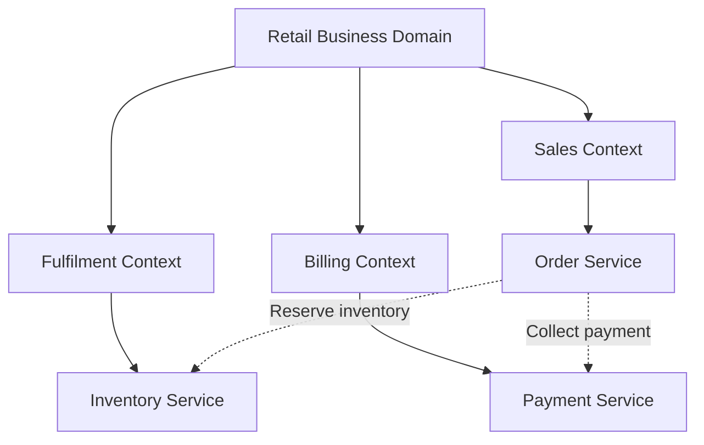
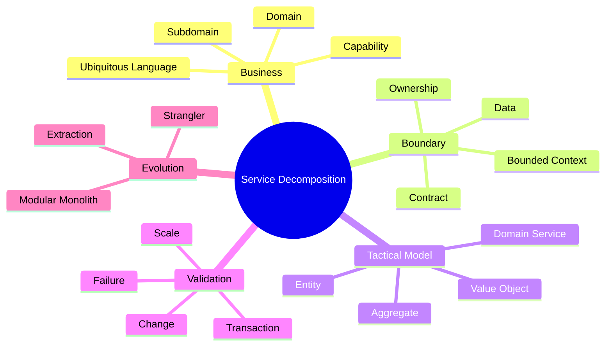

# Module 2 — Domain-Driven Service Decomposition and Service Boundaries

## 1. Module Identity and Duration

| Item | Details |
|---|---|
| Course | Microservices Architecture In-Depth |
| Part | Part 1 — Architecture Foundations |
| Module | Module 2 — Domain-Driven Service Decomposition and Service Boundaries |
| Duration | 1 Hour |
| Level | Intermediate to Advanced |
| Learning Ratio | 30% concepts and 70% analysis, modelling and lab work |
| Case Study | Order and Payment Processing Platform |

## 2. Learning Objectives

By the end of this module, participants will be able to:

1. Decompose a system using business capabilities and Domain-Driven Design.
2. Distinguish domains, subdomains and bounded contexts.
3. Identify entities, value objects, aggregates and domain services.
4. Define cohesive service responsibilities and ownership.
5. Select suitable service granularity using evidence.
6. Align service boundaries with data and transaction boundaries.
7. Identify boundary smells that create distributed monoliths.
8. Plan incremental extraction using the Strangler Fig pattern.

## 3. What Is Service Decomposition?

Service decomposition is the disciplined process of dividing a business system into cohesive, independently owned capabilities with explicit boundaries and contracts.

It answers four fundamental questions:

1. What business capability does this service own?
2. Which rules and data belong inside its boundary?
3. How does it collaborate with other capabilities?
4. Why does it need an independent lifecycle?

Decomposition is not the mechanical conversion of classes, tables, screens or technical layers into services. A good boundary groups concepts that change together and separates concepts that change for different business reasons.

> **Memory line:** High cohesion inside; explicit contracts outside.

## 4. Why Correct Boundaries Matter

Correct boundaries enable:

- Clear business and technical ownership
- Independent delivery and deployment
- Localized business rules
- Controlled data access
- Focused scaling and reliability
- Reduced coordination between teams
- Easier change-impact analysis
- Safer incremental modernization

Incorrect boundaries cause:

- Excessive network calls
- Coordinated deployments
- Shared database dependencies
- Distributed transactions everywhere
- Conflicting ownership
- Duplicate and inconsistent rules
- Slow delivery despite many services
- A Distributed Monolith

The boundary decision is more important than the framework used to implement it.

## 5. Real-Life Analogy — Departments in a Hospital

A hospital contains departments such as Registration, Emergency, Laboratory, Pharmacy, Billing and Medical Records.

Each department:

- Owns a clear professional responsibility
- Uses specialized rules and workflows
- Maintains information required for its work
- Collaborates with other departments through defined requests
- Has accountable staff and leadership

For example, a doctor requests a laboratory test. The doctor does not enter the laboratory and directly change test machinery or result records. The Laboratory owns the test process and returns a result through an agreed interaction.

### Mapping

| Hospital concept | Microservices concept |
|---|---|
| Hospital | Business platform |
| Department | Bounded context or service |
| Department responsibility | Business capability |
| Department head and staff | Owning team |
| Referral or test request | API command |
| Result notification | Event or response |
| Department records | Service-owned data |
| Hospital policies | Platform governance |

### Where the Analogy Stops

- Software boundaries must handle network failures and duplicate messages.
- One business transaction may span multiple services.
- Contract and schema evolution require automation.
- Service extraction has infrastructure and operational costs.

## 6. How Decomposition Works

1. Understand the business domain and desired outcomes.
2. Build a shared ubiquitous language with domain experts.
3. Identify business capabilities and subdomains.
4. Discover areas where language, rules and models differ.
5. Draw bounded contexts around internally consistent models.
6. Identify aggregates and local consistency requirements.
7. Align ownership and data with each candidate boundary.
8. Map relationships and contracts between contexts.
9. Test boundaries against change, transaction, scale and failure scenarios.
10. Start with the least distributed architecture that meets the need.
11. Extract services incrementally when autonomy benefits are proven.

## 7. Core Concepts

### 7.1 Domain

The domain is the business problem space in which the software operates—for example, retail ordering, banking, healthcare or logistics.

### 7.2 Subdomain

A subdomain is a meaningful area within the larger domain.

- **Core subdomain:** Creates competitive advantage.
- **Supporting subdomain:** Necessary and business-specific, but not differentiating.
- **Generic subdomain:** Common capability often served by standard solutions.

Example for online retail:

| Type | Example |
|---|---|
| Core | Dynamic fulfilment optimization |
| Supporting | Order management |
| Generic | Authentication or email delivery |

### 7.3 Ubiquitous Language

A shared language used consistently by business experts and developers inside a context. The same word may have different meanings in different contexts.

Example:

- In Sales, `Customer` may mean a buyer placing an order.
- In Billing, `Customer` may mean the legally invoiced party.
- In Support, `Customer` may mean the person associated with a service case.

Trying to force one universal model can create unnecessary coupling.

### 7.4 Bounded Context

A bounded context defines where a particular domain model, vocabulary and set of rules apply consistently.

It establishes:

- Model boundary
- Language boundary
- Rule boundary
- Ownership boundary
- Data boundary
- Contract boundary

A bounded context is a strategic design boundary. It is not automatically one microservice, but it is a strong input to service design.

### 7.5 Entity

An entity has a stable identity across changes. An `Order` remains the same order even when its status or items change.

### 7.6 Value Object

A value object is defined by its values and has no independent identity. Examples include `Money`, `Address` and `DateRange`. Value objects should normally be immutable.

### 7.7 Aggregate

An aggregate is a consistency boundary containing entities and value objects. External operations go through its aggregate root.

For an Order aggregate:

- Order may be the aggregate root.
- Order Lines belong inside the aggregate.
- Business invariants are protected by Order operations.
- Inventory and Payment are usually separate aggregates or contexts.

### 7.8 Domain Service

A domain service contains business behavior that does not naturally belong to one entity or value object. It must not become a generic dumping ground.

### 7.9 Application Service

An application service coordinates use cases and invokes domain behavior. It should not contain the core business rules that belong in the domain model.

### 7.10 Business Capability

A business capability describes what the organization can do, such as `Manage Orders`, `Collect Payments` or `Control Inventory`.

### 7.11 Service Granularity

Granularity determines how much responsibility belongs inside a service. A useful service is small enough to own and evolve independently but large enough to represent a cohesive business capability.

### 7.12 Conway's Law and Team Ownership

System structures tend to reflect communication structures. Stable ownership boundaries help architecture and teams evolve together. Shared ownership often causes slow decisions and inconsistent responsibility.

### 7.13 Context Mapping

A context map describes relationships between bounded contexts.

Common relationships include:

- Customer/Supplier
- Conformist
- Anti-Corruption Layer
- Open Host Service
- Published Language
- Partnership
- Separate Ways

### 7.14 Anti-Corruption Layer

An Anti-Corruption Layer translates an external or legacy model into the local domain model, preventing foreign concepts from polluting the new boundary.

### 7.15 Strangler Fig Pattern

The Strangler Fig pattern incrementally replaces capabilities of a legacy system. Requests are gradually routed to new implementations while the remaining legacy system continues to operate.

## 8. Architecture Visualization

The services align with bounded business contexts. Order does not directly update Inventory or Payment data.

## 9. Separate Mind Map

## 10. Decision and Comparison Tables

### 10.1 Decomposition Approaches

| Approach | Primary lens | Strength | Risk |
|---|---|---|---|
| Business capability | What the organization does | Stable business alignment | Capabilities may initially be too broad |
| Bounded context | Where a model and language are consistent | Clear semantic boundary | Requires domain understanding |
| Change coupling | What changes together | Evidence from delivery history | Historical architecture may distort results |
| Transaction boundary | What must remain consistent | Protects invariants | Can create oversized boundaries |
| Team ownership | Who owns and operates it | Clear accountability | Org chart alone may produce poor domain design |
| Scaling profile | What needs independent capacity | Efficient resource allocation | Scaling alone may create unnatural boundaries |

The strongest decisions combine multiple lenses.

### 10.2 Boundary Fitness Questions

| Question | Healthy signal | Warning signal |
|---|---|---|
| Business responsibility | One clear capability | Generic mixed responsibilities |
| Language | Internally consistent | Same terms mean conflicting things |
| Change pattern | Most changes remain local | Changes repeatedly span services |
| Data ownership | One accountable owner | Shared writes across services |
| Transactions | Most invariants are local | Distributed transaction for normal operations |
| Deployment | Can release independently | Coordinated release required |
| Team ownership | One accountable team | Many teams edit the same service |
| Communication | Purposeful contracts | Chatty field-level calls |

### 10.3 Entity vs Value Object vs Aggregate

| Concept | Identity | Mutability | Responsibility | Example |
|---|---|---|---|---|
| Entity | Yes | May change | Track a distinct business object | Order |
| Value Object | No | Prefer immutable | Represent descriptive value | Money |
| Aggregate | Root controls access | Controlled | Enforce consistency boundary | Order with Order Lines |

## 11. Real-World Enterprise Scenario

### Situation

An e-commerce monolith contains Customer, Catalogue, Cart, Order, Inventory, Payment, Shipping and Notification functionality. Teams propose one microservice per database table.

### Problem with the Proposal

- Tables are storage structures, not business capabilities.
- Order and Order Line would become separate network services.
- Basic order operations would require many remote calls.
- Transaction and ownership boundaries would be broken.
- Services would need coordinated releases.

### Domain Analysis

| Context | Responsibility | Primary aggregate/data |
|---|---|---|
| Customer | Customer identity and profile | Customer Profile |
| Catalogue | Product descriptions and commercial presentation | Product Catalogue |
| Cart | Pre-order shopping intent | Shopping Cart |
| Ordering | Order lifecycle and order rules | Order |
| Inventory | Stock availability and reservation | Stock Item/Reservation |
| Payments | Authorization, capture and refund | Payment |
| Shipping | Shipment planning and tracking | Shipment |
| Notification | Delivery of communication | Notification Job |

### Recommended Direction

1. Establish these boundaries as modules first.
2. Assign clear ownership and prevent cross-module database writes.
3. Measure change and runtime coupling.
4. Extract Notification when failure isolation is needed.
5. Extract Payment when security and scaling justify it.
6. Use an Anti-Corruption Layer during legacy integration.
7. Continue extracting only where measurable independence is achieved.

## 12. Step-by-Step Hands-On Lab

### Lab Title

Decompose an Order and Payment Platform

### Business Problem

A growing retailer has one application and shared database. Releases are slow because Customer, Product, Order, Inventory, Payment and Notification changes collide. The goal is to define defensible boundaries before choosing deployment units.

### Required Tools

- Markdown editor
- Whiteboard or Mermaid renderer
- Sample business requirements
- Boundary evaluation worksheet

### Step 1 — Build the Ubiquitous Language

Define the business meaning of:

- Customer
- Product
- Cart
- Order
- Inventory reservation
- Payment authorization
- Payment capture
- Shipment
- Notification

Record words that have different meanings in different areas.

### Step 2 — Identify Business Capabilities

Group business activities into capability candidates without discussing frameworks or databases.

### Step 3 — Classify Subdomains

Mark each capability as core, supporting or generic. Document why.

### Step 4 — Discover Bounded Contexts

For each candidate context, specify:

- Purpose
- Language
- Rules
- Owner
- Inputs
- Outputs
- Data
- Consistency boundary

### Step 5 — Identify Aggregates

Find the aggregate root and invariants inside Ordering, Inventory and Payment.

### Step 6 — Create a Context Map

Map upstream and downstream relationships. Identify where an Anti-Corruption Layer is required.

### Step 7 — Test Boundary Fitness

Apply four tests:

1. **Change test:** Do these concepts usually change together?
2. **Transaction test:** Which invariants must remain atomic?
3. **Ownership test:** Can one team own the complete responsibility?
4. **Failure test:** Can this capability fail or recover independently?

### Step 8 — Select Deployment Boundaries

Decide which bounded contexts remain modules and which, if any, should become independently deployed services.

### Step 9 — Define Contracts

For each cross-boundary interaction, record:

- Producer or provider
- Consumer
- Intent
- API, command or event
- Data exposed
- Failure behavior

### Step 10 — Plan Incremental Extraction

Choose the first extraction candidate and define:

- Business justification
- Routing change
- Data migration
- Compatibility approach
- Rollback plan
- Success metrics

## 13. Expected Lab Output

Participants must produce:

- Ubiquitous-language glossary
- Business-capability map
- Subdomain classification
- Bounded-context catalogue
- Aggregate and invariant list
- Context map
- Service-responsibility matrix
- Data-ownership matrix
- Contract catalogue
- First-service extraction plan

### Validation Criteria

- Boundaries are based on business responsibility.
- Each context has internally consistent language and rules.
- Data has one authoritative owner.
- Critical invariants remain within suitable boundaries.
- Normal use cases do not require excessive remote calls.
- Each extracted service has a measurable autonomy benefit.
- Migration is incremental and reversible.

## 14. Failure Scenarios and Troubleshooting

| Symptom | Likely boundary problem | Corrective action |
|---|---|---|
| One user request calls ten services | Boundaries are too fine | Merge chatty responsibilities or redesign interaction |
| Every release changes several services | Change coupling crosses boundaries | Revisit capability and aggregate boundaries |
| Services share and update the same tables | Data ownership is undefined | Assign an authoritative owner and expose a contract |
| One service contains unrelated business areas | Boundary is too broad | Decompose using language, change and ownership evidence |
| Teams debate the meaning of basic terms | Contexts and language are unclear | Define ubiquitous language per bounded context |
| Normal operations require distributed transactions | Aggregate or consistency boundary is split | Re-evaluate placement of invariants |
| Duplicate business rules appear in many services | Ownership is ambiguous | Assign the rule to one context and publish outcomes |
| A legacy model leaks into every new service | No translation boundary | Introduce an Anti-Corruption Layer |
| Service count grows faster than business capabilities | Technical or table-based decomposition | Consolidate into cohesive capabilities |
| Ownership changes weekly | Boundary and team topology are unstable | Stabilize ownership before extraction |

## 15. Best Practices

- Begin with business conversations and domain language.
- Combine capability, context, change, transaction and ownership evidence.
- Keep critical invariants within one aggregate where practical.
- Make one team accountable for each service.
- Assign one authoritative owner to business data.
- Expose intent-based contracts, not internal table structures.
- Keep service interfaces coarse enough to avoid chatty communication.
- Use an Anti-Corruption Layer around legacy or external models.
- Validate boundaries with real change and incident history.
- Prefer modules before network boundaries when evidence is weak.
- Extract incrementally and measure the result.
- Revisit boundaries as domain understanding improves.

## 16. Anti-Patterns

### 16.1 Entity Service

Creating one service per entity or table produces excessive calls and broken consistency boundaries.

### 16.2 Nano-Service

A service owns too little meaningful behavior to justify an independent operational lifecycle.

### 16.3 Shared Database

Multiple services update the same schema, preventing safe independent evolution.

### 16.4 Chatty Services

A normal use case requires many fine-grained remote calls because cohesive behavior was split.

### 16.5 God Service

One service owns many unrelated capabilities and becomes a new monolith.

### 16.6 Shared Business Logic Library

A library containing changing domain rules is embedded across services, creating synchronized upgrades and ambiguous ownership.

### 16.7 Premature Extraction

A boundary becomes a service before domain understanding, ownership and operational readiness are sufficient.

### 16.8 CRUD-Based Decomposition

Services are designed around Create, Read, Update and Delete operations instead of business behavior.

## 17. Security Considerations

Boundary design determines security ownership.

For every context, define:

- Data classification
- Authorized actors
- Allowed business operations
- Service identity requirements
- Secrets and keys owned
- Audit events
- Retention requirements
- Regulatory boundary
- Cross-context data minimization

Avoid exposing internal entity models directly through public contracts. A service should expose only the data required for the business interaction.

## 18. Performance Considerations

Boundary decisions affect end-to-end latency and resource use.

Evaluate:

- Frequency of interactions between candidate services
- Payload size and call volume
- Transaction path length
- Data locality
- Cache ownership
- Scaling differences
- Read-model requirements
- Event latency tolerance
- Failure amplification

If two candidate services communicate continuously at fine granularity and always scale, change and deploy together, the boundary may be artificial.

## 19. Interview Preparation

### Question 1 — How do you identify microservice boundaries?

Start with business capabilities and bounded contexts. Validate candidates using language, change patterns, aggregate invariants, data ownership, team ownership, scaling, reliability and deployment needs.

### Question 2 — Is one bounded context always one microservice?

No. A bounded context defines a model and language boundary. It may initially be one module, one service or, if carefully justified, several cohesive services.

### Question 3 — What is an aggregate?

An aggregate is a consistency boundary containing entities and value objects. The aggregate root controls changes and protects business invariants.

### Question 4 — Why is database-per-service important?

It protects ownership and independent evolution. Other services use contracts instead of coupling directly to private schemas.

### Question 5 — How do you avoid services becoming too small?

Do not split by class, table or CRUD operation. Ensure each service owns meaningful business behavior, data and an independently valuable lifecycle.

### Question 6 — What is an Anti-Corruption Layer?

It translates between external or legacy models and the local domain model so foreign concepts do not contaminate the new context.

### Question 7 — How does Conway's Law affect microservices?

Architecture tends to reflect team communication. Stable, cross-functional teams aligned with business capabilities support clear service ownership.

### Question 8 — How do you handle an incorrect boundary?

Use evidence from changes, transactions and runtime calls; adjust contracts; merge or split responsibilities incrementally; migrate data safely; and preserve compatibility during transition.

## 20. Quick Recap

- Decompose by business capability and bounded context, not tables.
- Ubiquitous language clarifies meaning inside each context.
- Aggregates protect local business invariants.
- Ownership, data and contracts must align.
- Test boundaries using change, transaction, ownership and failure evidence.
- A bounded context does not automatically require a separate deployment.
- Avoid nano-services, shared databases and chatty interactions.
- Use the Strangler pattern for incremental extraction.

## 21. Learning Outcome

The participant can transform a business domain into a defensible context and service map, align ownership and data, recognize poor granularity, and plan incremental service extraction without creating a Distributed Monolith.

## 22. Twenty MCQs

### 1. What is the primary basis for service decomposition?

A. Database tables  
B. Business capabilities and domain boundaries  
C. UI screens  
D. Source-code line count

**Answer:** B  
**Explanation:** Business capabilities and domain boundaries create cohesive ownership.

### 2. What does a bounded context define?

A. A cloud account only  
B. A boundary in which a model and language are consistent  
C. One database table  
D. One user interface

**Answer:** B  
**Explanation:** A bounded context limits where a particular model, vocabulary and rules apply.

### 3. Which subdomain creates competitive advantage?

A. Generic  
B. Supporting  
C. Core  
D. External

**Answer:** C  
**Explanation:** A core subdomain differentiates the business.

### 4. What identifies an entity?

A. Only its current attributes  
B. Stable identity across state changes  
C. Immutability only  
D. Absence of behavior

**Answer:** B  
**Explanation:** An entity remains conceptually the same object as its state changes.

### 5. Which is usually a value object?

A. Customer  
B. Order  
C. Money  
D. Shipment

**Answer:** C  
**Explanation:** Money is normally defined by its value and currency rather than identity.

### 6. What does an aggregate primarily protect?

A. Network routing  
B. Business invariants and consistency  
C. Container images  
D. User-interface state

**Answer:** B  
**Explanation:** The aggregate root controls changes inside a consistency boundary.

### 7. Which decomposition is an anti-pattern?

A. Order capability  
B. Payment capability  
C. One service per table  
D. Inventory capability

**Answer:** C  
**Explanation:** Tables are storage structures and rarely represent complete business responsibilities.

### 8. What is ubiquitous language?

A. One universal model for the enterprise  
B. Shared domain language within a context  
C. A programming language standard  
D. An API protocol

**Answer:** B  
**Explanation:** Business and technical participants use the same precise terms inside a context.

### 9. What is a key sign that a boundary is too fine?

A. Clear ownership  
B. Frequent chatty calls between services  
C. Independent scaling  
D. Local transactions

**Answer:** B  
**Explanation:** Excessive fine-grained calls often mean cohesive behavior was separated.

### 10. What is a key sign that a boundary is too broad?

A. It contains unrelated responsibilities with different change reasons  
B. It owns its data  
C. It has one owner  
D. It protects invariants

**Answer:** A  
**Explanation:** Unrelated responsibilities reduce cohesion and autonomy.

### 11. What does an Anti-Corruption Layer do?

A. Encrypts databases  
B. Translates an external model into the local model  
C. Replaces authentication  
D. Scales containers

**Answer:** B  
**Explanation:** It protects a bounded context from foreign domain concepts.

### 12. What does the Strangler Fig pattern support?

A. Big-bang replacement  
B. Incremental legacy migration  
C. Shared database access  
D. One service per entity

**Answer:** B  
**Explanation:** Capabilities are gradually redirected to new implementations.

### 13. Which condition most strongly suggests keeping two concepts together?

A. They use different class names  
B. They must protect the same immediate business invariant  
C. They appear on different screens  
D. They use different colours

**Answer:** B  
**Explanation:** Strong consistency requirements are important boundary evidence.

### 14. What should another service do with privately owned data?

A. Update its tables directly  
B. Use the owning service's API, events or governed read model  
C. Copy all schemas  
D. Share administrator credentials

**Answer:** B  
**Explanation:** Explicit contracts preserve ownership and independent evolution.

### 15. What is the main risk of a shared domain-logic library?

A. It cannot compile  
B. It may create synchronized changes and ambiguous ownership  
C. It always increases latency  
D. It prevents documentation

**Answer:** B  
**Explanation:** Rapidly changing business rules embedded across services create release coupling.

### 16. Which evidence helps validate a service boundary?

A. Change, transaction, ownership and failure patterns  
B. Logo design  
C. Number of developers' laptops  
D. File extension

**Answer:** A  
**Explanation:** These patterns reveal whether responsibilities can evolve and operate independently.

### 17. What is a context map?

A. A database backup plan  
B. A description of relationships between bounded contexts  
C. A container registry  
D. A test report

**Answer:** B  
**Explanation:** Context mapping makes integration and model relationships explicit.

### 18. What should service granularity balance?

A. Maximum service count and minimum documentation  
B. Cohesive business responsibility and justified independence  
C. UI and database technologies  
D. Coding style and naming

**Answer:** B  
**Explanation:** A service must be cohesive while owning a meaningful independent lifecycle.

### 19. Is a bounded context always independently deployed?

A. Yes  
B. No  
C. Only with REST  
D. Only with Kubernetes

**Answer:** B  
**Explanation:** A bounded context is a model boundary and may remain a module until distribution is justified.

### 20. What is the best first step in decomposition?

A. Select a message broker  
B. Understand the business domain and language  
C. Create databases  
D. Create Kubernetes namespaces

**Answer:** B  
**Explanation:** Technology decisions should follow business and domain understanding.

## 23. Ten Subjective and Scenario-Based Questions

1. Decompose an online retail platform using business capabilities and explain each boundary.
2. Explain the difference between a subdomain, bounded context and microservice.
3. A team proposes separate Order and Order-Line services. Evaluate the proposal using aggregate invariants.
4. Describe how ubiquitous language reveals hidden context boundaries.
5. Explain when a shared database becomes a threat to service autonomy.
6. Create a context map for Ordering, Inventory and Payments.
7. A new service requires eight synchronous calls for one request. Diagnose the boundary problem.
8. Explain how Conway's Law should influence team and service ownership.
9. Design a Strangler migration for Notification functionality in a legacy platform.
10. Explain how you would safely merge two incorrectly separated services.

### Evaluation Guidance

Strong answers should:

- Use business language before technology language
- Make boundaries and ownership explicit
- Identify aggregates and invariants
- Address data and contract ownership
- Consider change, transaction, scale and failure evidence
- Avoid one-service-per-table reasoning
- Recommend incremental and reversible evolution

## 24. Assignment

### Title

Domain Decomposition and Service-Boundary Blueprint

### Scenario

A digital marketplace supports buyers, sellers, product listings, carts, orders, inventory, payments, commissions, shipping, disputes and notifications. The current application and database are shared by four teams. Management wants faster releases and clearer accountability.

### Tasks

1. Build a ubiquitous-language glossary with at least 20 terms.
2. Identify business capabilities and subdomains.
3. Classify subdomains as core, supporting or generic.
4. Propose bounded contexts and explain their responsibilities.
5. Identify primary entities, value objects and aggregates.
6. Document critical business invariants.
7. Create a context map.
8. Assign team and data ownership.
9. Define at least eight cross-context contracts.
10. Run change, transaction, ownership and failure tests.
11. Identify boundaries that should remain modules.
12. Select up to three extraction candidates.
13. Design a phased Strangler migration.
14. Record risks, mitigations and success metrics.

### Required Deliverables

- Ubiquitous-language glossary
- Capability and subdomain map
- Bounded-context catalogue
- Aggregate and invariant list
- Context map
- Ownership matrix
- Contract catalogue
- Boundary-fitness assessment
- Incremental extraction roadmap

### Assessment Rubric

| Criterion | Weight |
|---|---:|
| Domain and language understanding | 15% |
| Capability and context design | 20% |
| Aggregate and invariant quality | 15% |
| Ownership and data boundaries | 15% |
| Contract and context mapping | 15% |
| Migration strategy | 10% |
| Risks and communication clarity | 10% |
| **Total** | **100%** |

## Final Memory Line

> A good service boundary encloses one coherent business model, protects its rules and data, gives one team clear ownership, and communicates through purposeful contracts.
