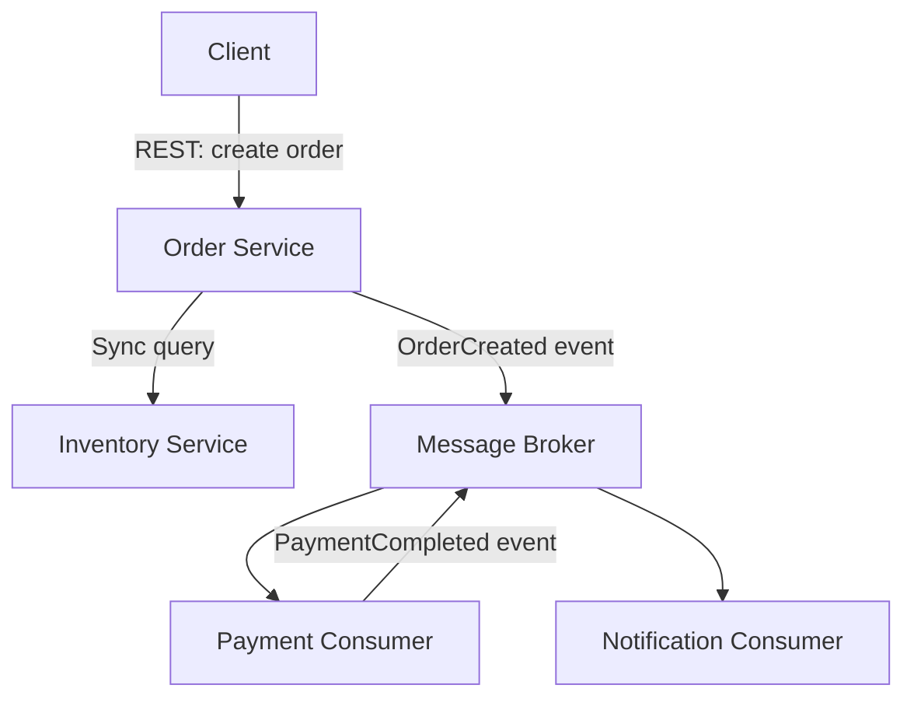
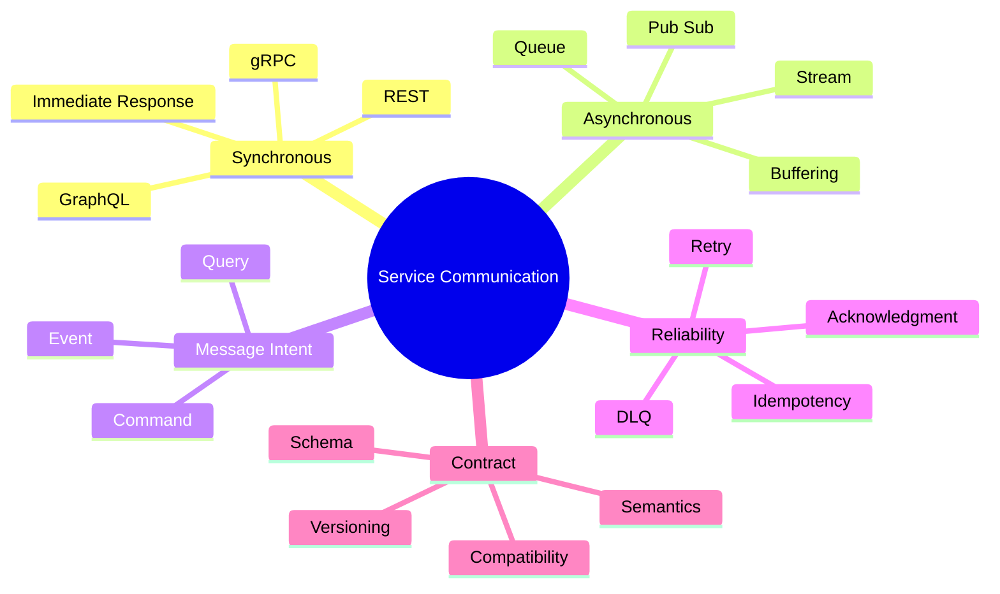

# Module 3 — Synchronous and Asynchronous Communication

## 1. Module Identity and Duration

| Item | Details |
|---|---|
| Course | Microservices Architecture In-Depth |
| Part | Part 2 — Communication and Integration |
| Module | Module 3 — Synchronous and Asynchronous Communication |
| Duration | 1 Hour |
| Level | Intermediate to Advanced |
| Learning Ratio | 30% concepts and 70% design, demonstration and lab work |
| Case Study | Order and Payment Processing Platform |

## 2. Learning Objectives

By the end of this module, participants will be able to:

1. Explain synchronous and asynchronous communication.
2. Select REST, gRPC, messaging or a hybrid interaction appropriately.
3. Distinguish commands, events and queries.
4. Evaluate temporal, runtime and data coupling.
5. Design stable API and event contracts.
6. Handle duplicate delivery using idempotency.
7. Plan backward-compatible contract evolution.
8. Identify and correct chatty synchronous call chains.

## 3. What Is Inter-Service Communication?

Inter-service communication is the exchange of requests, responses, commands, events and data between independently owned services.

Two primary interaction styles are:

- **Synchronous:** The caller waits for an immediate response.
- **Asynchronous:** The sender publishes work or information and continues without waiting for the final downstream outcome.

Communication style affects availability, latency, consistency, coupling, error handling, testing and the user experience.

> **Memory line:** Synchronous asks now; asynchronous informs or delegates for later.

## 4. Why Communication Design Matters

Poor communication design can create:

- Long synchronous dependency chains
- Cascading failures
- High end-to-end latency
- Fragile contracts
- Duplicate business actions
- Lost messages
- Inconsistent data
- Unclear ownership
- Difficult testing and troubleshooting

Good communication design enables:

- Purposeful service collaboration
- Explicit contracts
- Controlled coupling
- Failure isolation
- Independent evolution
- Workload buffering
- Scalable event consumers
- Observable business workflows

The goal is not to make everything asynchronous. The goal is to choose the simplest interaction that satisfies business timing and reliability needs.

## 5. Real-Life Analogy — Phone Call Versus Courier

### Phone Call: Synchronous

When you call a hotel to confirm a room:

- Both parties must be available at the same time.
- You wait for an immediate answer.
- The conversation is direct.
- If the hotel does not answer, the interaction fails or must be retried.

This resembles REST or gRPC request-response communication.

### Courier or Message: Asynchronous

When you send a signed document through a courier:

- The recipient need not be available when it is sent.
- The courier temporarily holds the package.
- Delivery may occur later.
- Tracking and proof of delivery are needed.
- Duplicate delivery must not create duplicate business action.

This resembles queues and event brokers.

### Where the Analogy Stops

- Software messages may be duplicated or delivered out of order.
- Acknowledgment may mean accepted, not fully processed.
- Producers and consumers may use different schema versions.
- Brokers require monitoring, retention and recovery policies.

## 6. How Communication Works

### Synchronous Flow

1. Caller resolves the destination.
2. Caller sends a request.
3. Callee validates and processes it.
4. Callee returns a response or error.
5. Caller continues or handles failure.

### Asynchronous Flow

1. Producer creates a command or event.
2. Producer publishes it to a broker.
3. Broker stores and routes the message.
4. Consumer receives and processes it.
5. Consumer acknowledges success or triggers retry/dead-letter handling.
6. Business outcome may be communicated through another event.

### Hybrid Flow

A user-facing request may begin synchronously and continue asynchronously. For example, an API accepts an order and returns `202 Accepted`, while downstream reservation, payment and notification processing continues through messages.

## 7. Core Concepts

### 7.1 Synchronous Communication

The caller waits for the callee. This provides immediate feedback but creates temporal and runtime dependency.

Use it when:

- The caller genuinely needs an immediate answer.
- The operation is a short query or validation.
- User experience requires immediate confirmation.
- The dependency is available within the required service level.

### 7.2 REST

REST commonly uses HTTP resources and methods.

- `GET` retrieves a representation.
- `POST` creates or triggers processing.
- `PUT` replaces a resource and should be idempotent.
- `PATCH` partially updates a resource.
- `DELETE` removes a resource and should be designed idempotently.

Production API design must address status codes, validation, pagination, security, idempotency, versioning and observability.

### 7.3 gRPC

gRPC uses strongly typed Protocol Buffer contracts and supports unary, client-streaming, server-streaming and bidirectional-streaming interactions.

It is useful for:

- Efficient internal communication
- Strong contract generation
- Low-latency binary payloads
- Streaming use cases

It introduces tooling, gateway, browser and contract-management considerations.

### 7.4 GraphQL

GraphQL allows clients to request required fields through a typed schema. It can reduce client over-fetching but does not automatically solve service-to-service ownership or distributed transactions. It is commonly positioned at an experience/API composition layer.

### 7.5 Asynchronous Messaging

The producer and consumer do not need to run simultaneously. A broker provides buffering and delivery capabilities.

### 7.6 Queue

A queue distributes messages for processing, normally to one consumer instance within a competing-consumer group. It is suitable for commands and work distribution.

### 7.7 Publish/Subscribe

A producer publishes information to a topic. Multiple independent subscribers can react without the producer knowing them individually.

### 7.8 Event Stream

An event stream is an ordered, retained sequence of records. Consumers track their position and may replay retained events.

### 7.9 Command

A command asks a specific owner to perform an action.

Examples:

- `ReserveInventory`
- `CapturePayment`
- `SendNotification`

A command may be rejected and normally has one logical handler.

### 7.10 Event

An event states that something has already happened.

Examples:

- `OrderCreated`
- `InventoryReserved`
- `PaymentCaptured`

Events are facts, should be named in past tense and may have multiple consumers.

### 7.11 Query

A query requests information without intending to change business state.

### 7.12 Temporal Coupling

Temporal coupling exists when communicating participants must be available at the same time. Synchronous calls normally introduce temporal coupling; brokers can reduce it.

### 7.13 Runtime Coupling

A caller depends on another service's response and behavior during execution. Deep synchronous chains increase availability and latency risk.

### 7.14 Contract

A contract defines the meaning, structure and behavior of an interaction. It includes more than fields:

- Intent
- Schema
- Validation
- Semantics
- Errors
- Security
- Timing
- Compatibility
- Ownership

### 7.15 Delivery Semantics

- **At-most-once:** A message is processed zero or one time; loss is possible.
- **At-least-once:** A message is retried until acknowledged; duplicates are possible.
- **Effectively-once business outcome:** Duplicate delivery is tolerated while idempotent handling prevents duplicate business effects.

Claims of universal exactly-once processing must be evaluated carefully across end-to-end business and external-system boundaries.

### 7.16 Idempotency

An operation is idempotent when repetition with the same intent does not create additional business effects.

Common implementation:

1. Client supplies an idempotency key.
2. Service stores the key and outcome atomically with processing.
3. A duplicate request returns the stored outcome.
4. Key scope and retention are explicitly defined.

### 7.17 Correlation

Use identifiers such as:

- Trace ID for technical tracing
- Correlation ID for related operations
- Business transaction ID such as Order ID
- Causation ID for the action that produced an event
- Message ID for duplicate detection

### 7.18 Contract Evolution

Prefer additive, backward-compatible change:

- Add optional fields.
- Preserve existing meaning.
- Allow unknown fields.
- Avoid renaming or changing field types in place.
- Deprecate with usage evidence and a transition window.

## 8. Architecture Visualization

The design uses synchronous communication only where an immediate answer is required and asynchronous events for decoupled downstream reactions.

## 9. Separate Mind Map

## 10. Decision and Comparison Tables

### 10.1 Synchronous vs Asynchronous

| Dimension | Synchronous | Asynchronous |
|---|---|---|
| Response | Immediate | Deferred |
| Availability dependency | Caller and callee available together | Broker buffers temporary unavailability |
| Coupling | Higher temporal/runtime coupling | Lower temporal coupling |
| User feedback | Direct | Accepted/pending plus later outcome |
| Failure handling | Timeout, retry, circuit breaker | Retry, acknowledgment, DLQ, replay |
| Consistency | Immediate response possible | Usually eventual consistency |
| Complexity | Simple flow, harder cascading failure | More infrastructure and workflow complexity |
| Best fit | Queries and immediate decisions | Background work, integration and events |

### 10.2 REST vs gRPC vs Messaging

| Need | REST | gRPC | Messaging |
|---|---|---|---|
| Public/client API | Strong fit | Requires client support/gateway | Usually indirect |
| Internal low-latency call | Suitable | Strong fit | Not request-response default |
| Streaming | Limited variants | Strong support | Event streams fit retained feeds |
| Temporal decoupling | No | No | Yes |
| Human readability | High | Lower binary payload | Depends on serialization |
| Strong code generation | OpenAPI optional | Built in through Protobuf | Schema tooling varies |
| Buffering | No | No | Yes |

### 10.3 Command vs Event vs Query

| Type | Meaning | Typical handler | Naming example |
|---|---|---:|---|
| Command | Please perform this action | One logical owner | `ReserveInventory` |
| Event | This fact has occurred | Zero to many consumers | `InventoryReserved` |
| Query | Return information | One provider/composed read | `GetInventoryAvailability` |

### 10.4 Communication Decision Questions

| Question | If yes | If no |
|---|---|---|
| Does the caller need an immediate result? | Consider synchronous | Consider asynchronous |
| Can the work finish later? | Consider queue/event | Synchronous may be required |
| Must multiple consumers react independently? | Publish event | Direct call may suffice |
| Is buffering valuable? | Use broker | Direct interaction may suffice |
| Can eventual consistency be accepted? | Async is possible | Keep critical decision local or synchronous |

## 11. Real-World Enterprise Scenario

### Situation

An order API performs the following synchronous calls before responding:

`Customer → Order → Inventory → Payment → Loyalty → Notification → Analytics`

Each dependency has 99.9% availability and adds latency.

### Problems

- End-to-end availability becomes lower than any individual dependency.
- Latency accumulates across the chain.
- Analytics and notifications unnecessarily block the customer.
- Retrying the request can duplicate payment.
- A notification outage prevents order completion.

### Improved Design

1. Keep immediate order validation inside Order.
2. Obtain only essential synchronous decisions before acceptance.
3. Publish `OrderCreated` through a reliable mechanism.
4. Let Notification and Analytics consume asynchronously.
5. Use an idempotency key for order creation and payment.
6. Publish explicit success or failure events.
7. Track the business workflow using Order ID and Trace ID.

### Result

The critical user path is shorter, noncritical consumers are isolated, and duplicate business effects are controlled.

## 12. Step-by-Step Hands-On Lab

### Lab Title

Design a Reliable Order Communication Flow

### Business Problem

An Order Service must reserve inventory, initiate payment, update analytics and send confirmation. The current solution uses synchronous calls for everything.

### Required Tools

- Markdown editor
- Mermaid renderer
- API and event-contract templates
- Optional REST client and message broker

### Step 1 — Classify Interactions

For each interaction, decide whether it is a command, event or query.

### Step 2 — Identify Timing Requirements

Record whether the caller needs:

- Immediate answer
- Accepted/pending response
- Eventual notification

### Step 3 — Select Communication Style

Select REST, gRPC, queue, topic or event stream. Record the reason.

### Step 4 — Define REST Contract

Create an order endpoint containing:

- Request schema
- Validation
- Idempotency key
- Success and error responses
- Correlation identifiers
- Timeout expectation

### Step 5 — Define Event Contract

Define `OrderCreated` with:

- Event ID
- Event type and version
- Occurred-at timestamp
- Producer
- Correlation and causation IDs
- Order ID
- Required business fields

### Step 6 — Design Consumer Idempotency

Choose a duplicate-detection key and atomic processing strategy.

### Step 7 — Design Failure Handling

Specify:

- Acknowledgment point
- Retry classification
- Retry limit
- Backoff
- Dead-letter behavior
- Manual recovery

### Step 8 — Design Contract Evolution

Add an optional `salesChannel` field without breaking existing consumers.

### Step 9 — Create Sequence Diagrams

Create a happy-path and duplicate-delivery sequence.

### Step 10 — Validate

Test one dependency outage and one duplicate payment command.

## 13. Expected Lab Output

Participants must produce:

- Interaction-classification table
- Communication decision matrix
- REST contract
- Event contract
- Idempotency design
- Retry and dead-letter policy
- Happy-path sequence diagram
- Failure/duplicate sequence diagram
- Contract-evolution note

### Validation Criteria

- Immediate dependencies are justified.
- Noncritical work does not block the user path.
- Commands, events and queries are semantically correct.
- Duplicate delivery cannot duplicate the business outcome.
- Contracts contain ownership and versioning information.
- Failure and recovery behavior is explicit.

## 14. Failure Scenarios and Troubleshooting

| Symptom | Likely cause | Corrective action |
|---|---|---|
| User request is slow | Deep synchronous chain | Shorten critical path and move suitable work async |
| One dependency outage fails all orders | Runtime coupling | Add isolation, async processing or controlled degradation |
| Payment is charged twice | Missing idempotency | Store request/message key with business outcome atomically |
| Messages disappear after producer commit | Database and publish are separate | Use Transactional Outbox in the data module |
| Consumer repeatedly fails | Poison message or invalid contract | Bound retries and route to DLQ |
| Events arrive out of order | Partitioning/concurrency behavior | Use entity key, version and ordering logic |
| New field breaks consumers | Rigid parsing or breaking schema change | Use additive evolution and compatibility tests |
| Queue backlog grows | Consumer capacity or downstream bottleneck | Monitor lag, scale consumers and apply backpressure |
| Producer knows every subscriber | Point-to-point event coupling | Publish domain facts without consumer-specific behavior |
| `202 Accepted` is treated as success | Acceptance confused with completion | Expose status and final outcome clearly |

## 15. Best Practices

- Use synchronous calls only for genuine immediate dependencies.
- Keep synchronous chains short and bounded.
- Name commands imperatively and events in past tense.
- Design contracts around business intent.
- Include message identity, version and correlation metadata.
- Make consumers idempotent.
- Bound retries and separate transient from permanent failures.
- Define acknowledgment and dead-letter policies.
- Prefer additive contract evolution.
- Test producer-consumer compatibility.
- Monitor end-to-end business outcomes, not only broker health.
- Document whether a response means accepted or completed.

## 16. Anti-Patterns

### 16.1 Everything Synchronous

Noncritical work blocks the user path and increases cascading-failure risk.

### 16.2 Everything Asynchronous

Simple immediate operations become difficult workflows without business value.

### 16.3 Chatty APIs

Many fine-grained calls reveal weak boundaries and increase latency.

### 16.4 Event as Remote Procedure Call

An event is shaped as a consumer-specific request instead of a business fact.

### 16.5 Dual Write

Business data is committed and a message is published separately, allowing one to succeed while the other fails.

### 16.6 Infinite Retry

Permanent failures repeatedly consume resources and block useful processing.

### 16.7 Exactly-Once Assumption

The system assumes duplicates cannot occur and produces duplicate business effects.

### 16.8 Breaking Contract in Place

Producers change meaning or remove fields before all consumers migrate.

## 17. Security Considerations

For every API or message interaction, define:

- Caller/producer identity
- Authentication mechanism
- Operation-level authorization
- Broker publish and consume permissions
- Data classification and minimization
- Encryption in transit
- Sensitive-field handling
- Schema validation
- Replay-attack protection where needed
- Audit requirements
- Secret and certificate rotation

Do not assume that an internal message or network request is trustworthy.

## 18. Performance Considerations

Evaluate:

- End-to-end latency budget
- Call-chain depth
- Serialization and payload size
- Connection pooling
- Compression trade-offs
- Broker throughput and partitioning
- Consumer concurrency
- Queue lag
- Batch processing
- Backpressure
- Ordering constraints
- Hot partition keys

Avoid optimizing one call while ignoring the complete business journey.

## 19. Interview Preparation

### Question 1 — When do you choose synchronous communication?

Use it when the caller genuinely needs an immediate result and accepts runtime dependency on the callee. Apply timeouts and failure handling.

### Question 2 — When do you choose asynchronous communication?

Use it when work can finish later, buffering is valuable, producers and consumers should be temporally decoupled, or multiple consumers react independently.

### Question 3 — Command versus event?

A command requests an action from one logical owner and can be rejected. An event records a fact that has already occurred and may have multiple consumers.

### Question 4 — How do you handle duplicate messages?

Use stable message or business-operation identifiers and record processing atomically with the business effect. Return or ignore the previous outcome for duplicates.

### Question 5 — REST versus gRPC?

REST fits broad HTTP interoperability and public APIs. gRPC fits strongly typed, efficient internal calls and streaming. Select based on consumers, tooling and operational needs.

### Question 6 — What is temporal coupling?

It means communicating participants must be available at the same time. Brokers reduce this by buffering messages.

### Question 7 — How do you evolve event contracts safely?

Prefer additive optional fields, preserve semantics, support unknown fields, version deliberately and validate producer-consumer compatibility.

### Question 8 — Can a broker guarantee exactly-once business processing?

Broker guarantees alone do not cover every database and external-system effect. Design idempotent consumers for effectively-once business outcomes.

## 20. Quick Recap

- Synchronous communication provides an immediate response but creates runtime coupling.
- Asynchronous communication supports buffering and temporal decoupling.
- REST and gRPC are request-response choices; queues and events solve different needs.
- Commands request action, events state facts and queries request information.
- At-least-once delivery requires idempotent consumers.
- Keep contracts explicit, compatible and observable.
- Avoid deep synchronous chains, infinite retry and dual writes.

## 21. Learning Outcome

The participant can classify service interactions, select appropriate protocols and messaging patterns, design stable contracts, control duplicate delivery, and reduce runtime coupling without making every interaction asynchronous.

## 22. Twenty MCQs

### 1. Which communication style requires the caller to wait?

A. Asynchronous  
B. Synchronous  
C. Event replay  
D. Batch processing

**Answer:** B  
**Explanation:** Synchronous request-response keeps the caller waiting for an outcome.

### 2. Which interaction best fits an event?

A. `ReserveInventory`  
B. `GetOrder`  
C. `OrderCreated`  
D. `ValidateCard`

**Answer:** C  
**Explanation:** An event describes a fact that has already occurred.

### 3. Which interaction best fits a command?

A. `PaymentCaptured`  
B. `CapturePayment`  
C. `OrderViewed`  
D. `InventoryReserved`

**Answer:** B  
**Explanation:** A command asks an owner to perform an action.

### 4. What does a message broker primarily add?

A. In-process transactions  
B. Buffering and temporal decoupling  
C. Shared database ownership  
D. UI rendering

**Answer:** B  
**Explanation:** The broker can retain messages while consumers are temporarily unavailable.

### 5. Which is a benefit of gRPC?

A. No contracts  
B. Strongly typed Protobuf contracts  
C. Guaranteed business success  
D. No network failures

**Answer:** B  
**Explanation:** Protobuf supports efficient serialization and generated contract code.

### 6. At-least-once delivery implies what?

A. A message can never be duplicated  
B. Consumers must tolerate duplicates  
C. A message is always lost  
D. Ordering is universal

**Answer:** B  
**Explanation:** Retries can cause repeated delivery.

### 7. What prevents duplicate payment effects?

A. Longer timeout  
B. Idempotency  
C. Larger payload  
D. More endpoints

**Answer:** B  
**Explanation:** Idempotent processing recognizes repeated intent and preserves one business outcome.

### 8. What is a query intended to do?

A. Request information without changing business state  
B. Announce a past fact  
C. Always create data  
D. Delete a message

**Answer:** A  
**Explanation:** A query asks for information.

### 9. Which change is generally backward compatible?

A. Remove a required field  
B. Change a field's meaning  
C. Add an optional field  
D. Rename every field

**Answer:** C  
**Explanation:** Additive optional fields allow older consumers to continue processing.

### 10. What is temporal coupling?

A. Services use the same database  
B. Participants must be available simultaneously  
C. Events have timestamps  
D. Containers share clocks

**Answer:** B  
**Explanation:** Direct request-response normally requires concurrent availability.

### 11. Which mechanism handles poison messages after bounded retries?

A. Shared table  
B. Dead-letter queue  
C. Browser cache  
D. Load balancer

**Answer:** B  
**Explanation:** A DLQ isolates messages requiring investigation or manual recovery.

### 12. What is a major risk of deep synchronous chains?

A. Reduced coupling  
B. Accumulated latency and cascading failure  
C. Automatic buffering  
D. Event replay

**Answer:** B  
**Explanation:** Each dependency adds latency and another failure condition.

### 13. Which identifier most directly supports duplicate detection?

A. CSS class  
B. Message or idempotency key  
C. Container name  
D. Port number

**Answer:** B  
**Explanation:** A stable operation identity enables recognition of repeated delivery.

### 14. What does `202 Accepted` normally mean?

A. Processing is fully complete  
B. Request was accepted for processing  
C. Authentication failed  
D. Resource was deleted

**Answer:** B  
**Explanation:** The final asynchronous outcome may still be pending.

### 15. Which pattern fits multiple independent consumers reacting to a fact?

A. Publish/subscribe  
B. Shared database update  
C. Direct memory call  
D. File lock

**Answer:** A  
**Explanation:** Pub/sub allows each subscriber to react independently.

### 16. What is a contract?

A. Only a JSON field list  
B. Structure, semantics and behavior of an interaction  
C. Only an endpoint URL  
D. A database backup

**Answer:** B  
**Explanation:** A reliable contract covers meaning, validation, errors, compatibility and ownership.

### 17. What is wrong with infinite retry?

A. It guarantees low cost  
B. Permanent failures consume resources repeatedly  
C. It eliminates duplicates  
D. It provides ordering

**Answer:** B  
**Explanation:** Retries must be bounded and failures classified.

### 18. Where is GraphQL commonly valuable?

A. Client-facing composition with flexible field selection  
B. Database ownership enforcement  
C. Message acknowledgment  
D. Container scheduling

**Answer:** A  
**Explanation:** GraphQL allows clients to select fields through a typed schema.

### 19. Which is the safest event name?

A. `DoPaymentNow`  
B. `CallConsumer`  
C. `PaymentCaptured`  
D. `UpdateTable`

**Answer:** C  
**Explanation:** Past-tense naming communicates an immutable business fact.

### 20. What is the best communication rule?

A. Make everything asynchronous  
B. Make everything synchronous  
C. Choose based on timing, coupling, reliability and business needs  
D. Use the newest protocol

**Answer:** C  
**Explanation:** No one interaction style fits every use case.

## 23. Ten Subjective and Scenario-Based Questions

1. Compare synchronous and asynchronous communication across latency, availability, consistency and complexity.
2. Redesign a seven-service synchronous order chain to shorten the critical path.
3. Explain the semantic difference between `CapturePayment` and `PaymentCaptured`.
4. Design idempotent handling for a payment command delivered three times.
5. Compare REST and gRPC for an internal pricing service.
6. Define a backward-compatible `OrderCreated` event evolution strategy.
7. Explain acknowledgment, retry and DLQ decisions for a notification consumer.
8. A consumer receives version 5 before version 4. Explain possible handling strategies.
9. Explain why broker-level exactly-once claims do not remove business idempotency needs.
10. Design correlation across an API request and three downstream event consumers.

### Evaluation Guidance

Strong answers should:

- Start from business timing and outcome requirements
- Distinguish commands, events and queries correctly
- Make failure, duplication and ordering assumptions explicit
- Address contract compatibility
- Limit synchronous dependency chains
- Include observability and recovery

## 24. Assignment

### Title

Communication Blueprint for an Order Workflow

### Scenario

A marketplace must create orders, reserve inventory, process payment, calculate seller commission, initiate shipping, update analytics and send customer notifications. The current implementation calls every service synchronously and occasionally creates duplicate charges.

### Tasks

1. Classify every interaction as command, event or query.
2. Identify which outcomes are immediately required.
3. Select REST, gRPC, queue, topic or stream for each interaction.
4. Draw the current synchronous sequence.
5. Draw the proposed hybrid sequence.
6. Define one REST contract and three event contracts.
7. Create an idempotency design for order creation and payment.
8. Define acknowledgment, retry, backoff and DLQ behavior.
9. Define correlation and causation metadata.
10. Demonstrate one additive contract change.
11. Document security and performance considerations.
12. Define three technical and three business success metrics.

### Required Deliverables

- Interaction inventory
- Communication decision matrix
- Current and target sequence diagrams
- API contract
- Event contracts
- Idempotency design
- Retry and DLQ policy
- Contract-evolution plan
- Security and performance checklist
- Success metrics

### Assessment Rubric

| Criterion | Weight |
|---|---:|
| Interaction classification | 15% |
| Communication decisions | 20% |
| Contract quality | 15% |
| Idempotency and delivery safety | 15% |
| Failure and recovery design | 15% |
| Security and performance | 10% |
| Diagram and explanation clarity | 10% |
| **Total** | **100%** |

## Final Memory Line

> Use synchronous communication for genuine immediate dependencies; use asynchronous communication when buffering, independence and resilience create business value—and make every repeated business action safe.
