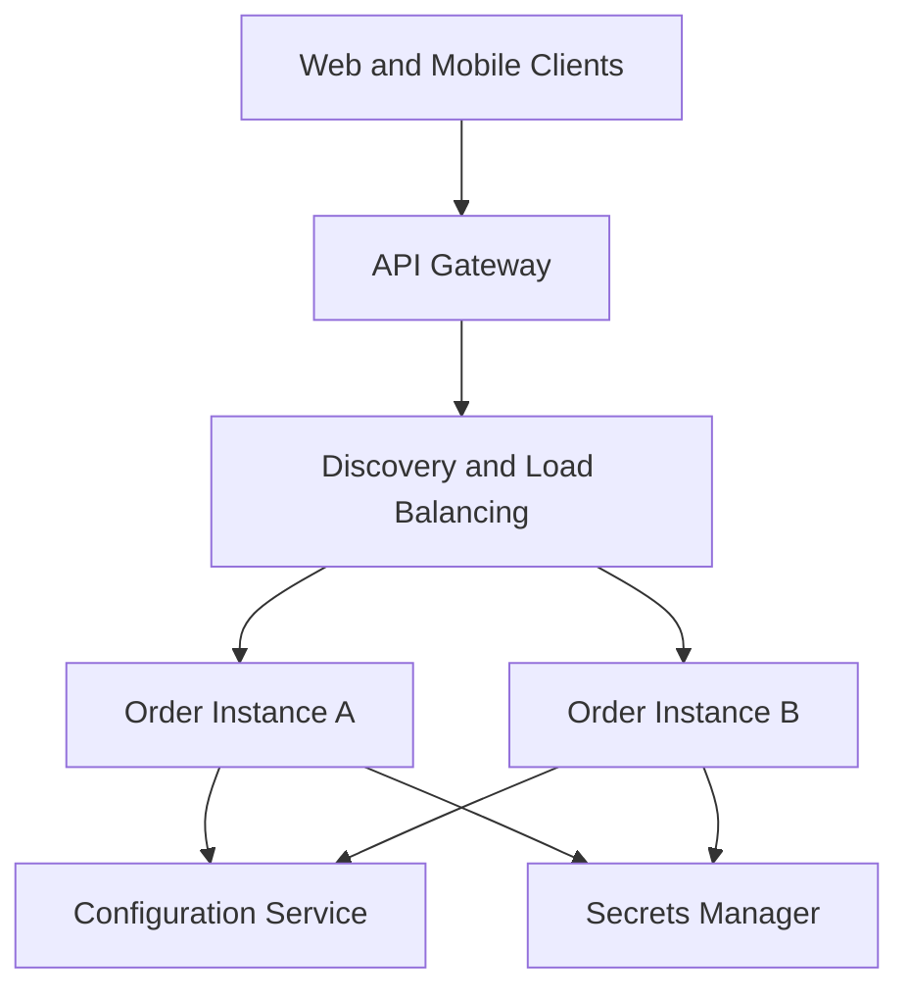
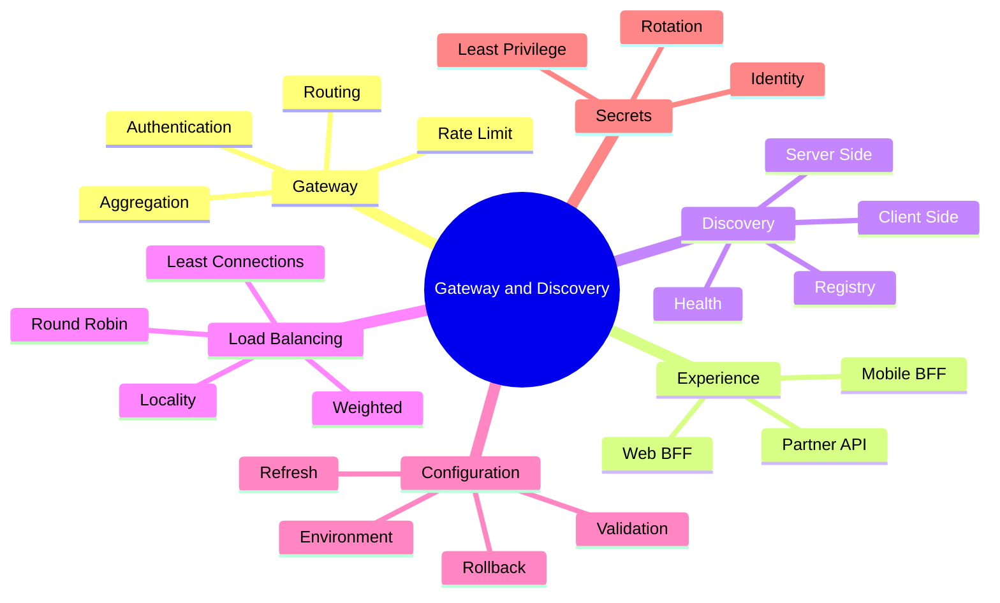

# Module 4 — API Gateway, Service Discovery and Configuration

## 1. Module Identity and Duration

| Item | Details |
|---|---|
| Course | Microservices Architecture In-Depth |
| Part | Part 2 — Communication and Integration |
| Module | Module 4 — API Gateway, Service Discovery and Configuration |
| Duration | 1 Hour |
| Level | Intermediate to Advanced |
| Learning Ratio | 30% concepts and 70% design, demonstration and lab work |
| Case Study | Order and Payment Processing Platform |

## 2. Learning Objectives

By the end of this module, participants will be able to:

1. Explain the responsibilities and limitations of an API Gateway.
2. Design routing, authentication, rate-limiting and aggregation policies.
3. Decide when a Backend for Frontend is appropriate.
4. Compare client-side and server-side service discovery.
5. Explain service registration, health checks and load balancing.
6. Design centralized configuration without exposing secrets.
7. Prevent the gateway from becoming a business-logic monolith.
8. Diagnose routing, discovery and configuration failures.

## 3. What Are Gateway, Discovery and Configuration?

An **API Gateway** is a controlled entry point that receives client requests and routes them to appropriate backend capabilities. It may enforce cross-cutting policies such as authentication, authorization support, throttling, observability and protocol transformation.

**Service discovery** enables a caller or routing component to locate healthy service instances in a dynamic environment where addresses change.

**Centralized configuration** manages environment-specific operational settings independently from application code while preserving validation, access control and auditability.

These are related platform concerns:

- The gateway answers: **Where should this external request go?**
- Discovery answers: **Which healthy instance can handle it now?**
- Configuration answers: **Which runtime settings should the component use?**

## 4. Why These Capabilities Matter

Microservice instances may be created, replaced, scaled or moved dynamically. Clients should not need to understand every service address or internal topology.

These capabilities provide:

- A stable external entry point
- Controlled exposure of internal services
- Central enforcement of selected edge policies
- Dynamic routing to healthy instances
- Load distribution
- Environment-independent application artifacts
- Safer configuration updates
- Consistent telemetry at the boundary

Poor implementation creates:

- A gateway bottleneck or single point of failure
- Business logic concentrated at the edge
- Stale service registrations
- Requests routed to unhealthy instances
- Configuration drift
- Secret leakage
- Client-specific APIs that become duplicated and inconsistent

## 5. Real-Life Analogy — Hotel Reception and Directory

Imagine a large hotel.

- Guests enter through reception rather than searching private corridors.
- Reception verifies identity and directs each request.
- The hotel directory knows which departments and staff are currently available.
- Several employees may provide the same service, and the next available one receives the request.
- Hotel policies define opening hours, access rules and emergency procedures.

### Mapping

| Hotel concept | Microservices concept |
|---|---|
| Reception desk | API Gateway |
| Guest | External client |
| Room-service request | API request |
| Department directory | Service registry |
| Available staff | Healthy service instances |
| Request distribution | Load balancing |
| Hotel operating policies | Centralized configuration |
| Special concierge for groups | Backend for Frontend |

### Where the Analogy Stops

- A gateway operates at high concurrency and must be horizontally resilient.
- Service health is imperfect and can change between discovery and invocation.
- Authentication does not eliminate service-level authorization.
- Configuration changes can destabilize many services simultaneously.

## 6. How It Works

### External Request Flow

1. A client resolves the gateway endpoint.
2. TLS protects the connection.
3. The gateway authenticates or validates the presented identity.
4. Edge policies evaluate route, quota, size and threat rules.
5. The gateway resolves a healthy backend destination.
6. The request is forwarded with controlled identity and tracing context.
7. The service performs business authorization and processing.
8. Response status and telemetry return through the gateway.

### Service Registration and Discovery Flow

1. A service instance starts.
2. It becomes ready only after dependency and initialization checks.
3. Its address is registered or supplied by the platform.
4. Health status is updated continuously.
5. A caller or proxy queries/uses the available instance set.
6. A load-balancing policy selects an instance.
7. Unhealthy or terminating instances are removed from routing.

### Configuration Flow

1. Settings are stored by application and environment.
2. Access is controlled by workload identity.
3. The service loads and validates configuration.
4. Invalid critical configuration prevents readiness.
5. Safe changes may refresh dynamically.
6. Risky changes require controlled restart or deployment.
7. Changes are audited and rollback remains possible.

## 7. Core Concepts

### 7.1 API Gateway Responsibilities

Appropriate responsibilities include:

- Request routing
- TLS termination
- Token validation
- Rate limiting and quotas
- Request/response size limits
- Correlation and trace propagation
- Protocol transformation where justified
- API version routing
- Limited response aggregation
- Caching of safe responses
- Access logging

Business rules such as order eligibility, payment decisions and inventory allocation belong to domain services.

### 7.2 Reverse Proxy

A reverse proxy receives client traffic and forwards it to backend destinations. An API Gateway is typically a policy-aware reverse proxy with API-management capabilities.

### 7.3 Routing

Common routing inputs include:

- Host name
- Path
- HTTP method
- Header
- API version
- Tenant or region
- Release cohort

Routes should be explicit, testable and observable.

### 7.4 Request Aggregation

The gateway or BFF can combine responses required by one client screen. Use carefully: aggregation can create latency, failure coupling and business logic at the edge.

### 7.5 Backend for Frontend

A BFF provides an experience-specific backend for a client category such as web, mobile or partner integration.

Use when clients have materially different:

- Data shapes
- Interaction patterns
- Latency or bandwidth constraints
- Release cadences
- Security requirements

Avoid BFFs that duplicate domain rules.

### 7.6 Rate Limiting

Rate limiting controls request volume to protect capacity and enforce fair use.

Possible keys:

- User
- Client application
- Tenant
- API key
- IP address
- Route

Policies may use fixed window, sliding window or token-bucket approaches.

### 7.7 Authentication and Authorization Boundary

The gateway may validate tokens and reject unauthenticated traffic. Domain services must still enforce authorization for business operations. Trust must be propagated in a verifiable, minimal form.

### 7.8 Service Registry

A service registry stores available instances and metadata. Registration can be:

- **Self-registration:** The service registers itself.
- **Third-party registration:** A platform component registers observed workloads.

Container orchestrators often provide discovery through platform-managed services and DNS.

### 7.9 Client-Side Discovery

The client queries the registry or receives an instance list and chooses the destination.

**Benefit:** Direct control and fewer proxy hops.  
**Cost:** Discovery and load-balancing logic enters each client stack.

### 7.10 Server-Side Discovery

The client calls a stable router, proxy or load balancer that selects an instance.

**Benefit:** Simpler clients and centralized routing.  
**Cost:** Additional infrastructure hop and dependency.

### 7.11 Load Balancing

Common algorithms:

- Round robin
- Weighted round robin
- Least connections
- Random
- Consistent hashing
- Locality-aware routing

Selection must consider health, readiness, draining and sometimes session affinity.

### 7.12 Health, Liveness and Readiness

- **Liveness:** Is the process alive or irrecoverably stuck?
- **Readiness:** Can the instance safely receive traffic?
- **Startup:** Has initialization completed?

Do not restart an otherwise healthy process merely because a temporary external dependency is unavailable.

### 7.13 Centralized Configuration

Configuration should be:

- Externalized from the build artifact
- Versioned or auditable
- Validated at startup and refresh
- Scoped by environment and service
- Protected by least privilege
- Reversible

Examples include URLs, feature controls, timeouts and non-secret operational settings.

### 7.14 Secrets Management

Passwords, tokens, private keys and certificates are secrets—not ordinary configuration. Store them in a secrets manager, control access through workload identity and support rotation without source-code changes.

### 7.15 Feature Flags

Feature flags control behavior independently from deployment. They require ownership, expiry, auditability, safe defaults and removal after use.

### 7.16 Configuration Refresh

Not every property is safe to refresh dynamically. Connection, security and structural settings may require controlled restart. Validate changes before broad rollout.

## 8. Architecture Visualization

The gateway offers a stable boundary; discovery routes to healthy instances; configuration and secrets remain controlled platform dependencies.

## 9. Separate Mind Map

## 10. Decision and Comparison Tables

### 10.1 Gateway Responsibility Test

| Capability | Gateway | Domain service |
|---|---:|---:|
| Route `/orders` | Yes | No |
| Validate access token | Yes | Defense in depth |
| Decide whether an order may be cancelled | No | Yes |
| Enforce tenant request quota | Yes | Optional additional control |
| Calculate order total | No | Yes |
| Propagate Trace ID | Yes | Yes |
| Transform public protocol | Sometimes | Sometimes |
| Own customer credit rules | No | Yes |

### 10.2 Client-Side vs Server-Side Discovery

| Dimension | Client-side | Server-side |
|---|---|---|
| Instance selection | Calling client | Proxy/load balancer |
| Client complexity | Higher | Lower |
| Language-specific integration | Often required | Minimal |
| Central policy | Harder | Easier |
| Additional hop | Usually no | Usually yes |
| Typical use | Smart internal clients | Platform/Kubernetes/cloud routing |

### 10.3 Gateway vs BFF

| Dimension | Shared API Gateway | Backend for Frontend |
|---|---|---|
| Scope | Cross-client edge policies | One client experience |
| Ownership | Platform/API team | Experience-aligned team |
| Data shaping | Limited/shared | Client-specific |
| Domain logic | Avoid | Avoid |
| Number | Usually small | One per materially different experience |

### 10.4 Configuration Classification

| Value | Store | Example |
|---|---|---|
| Non-secret runtime setting | Configuration store | Timeout |
| Sensitive credential | Secrets manager | Database password |
| Build-time constant | Source/build artifact | Stable algorithm constant |
| Temporary rollout control | Feature-flag system | New checkout enabled |

## 11. Real-World Enterprise Scenario

### Situation

Web and mobile clients directly call twelve microservices. Each client stores service URLs and performs its own retry logic. Instances autoscale, but clients continue calling terminated addresses. Authentication rules differ across services, and mobile screens need excessive requests.

### Diagnosis

- Internal topology has leaked to external clients.
- Discovery is missing or improperly exposed.
- Cross-cutting policies are inconsistent.
- The mobile experience suffers from chatty calls.
- Client retry behavior can amplify outages.

### Recommended Design

1. Introduce a highly available API Gateway.
2. Keep internal services private.
3. Validate identity and enforce quotas at the edge.
4. Retain business authorization inside services.
5. Route through platform-managed discovery and load balancing.
6. Add a mobile BFF only for genuinely distinct mobile composition.
7. Centralize configuration and separate secrets.
8. Propagate trace and business identifiers.
9. Implement readiness and connection draining.
10. Test gateway and registry failure paths.

## 12. Step-by-Step Hands-On Lab

### Lab Title

Design the Entry, Routing and Configuration Layer

### Business Problem

The Order platform supports web, mobile and partner clients. Order Service has three dynamic instances. The system needs secure routing, fair-use limits, discovery and controlled configuration.

### Required Tools

- Markdown editor
- Mermaid renderer
- Gateway policy worksheet
- Optional local reverse proxy or cloud gateway

### Step 1 — Inventory Clients and APIs

List each client, route, authentication method, data shape and performance need.

### Step 2 — Design the External Surface

Define public routes while hiding internal service names and topology.

### Step 3 — Assign Gateway Policies

For each route, specify:

- Authentication
- Allowed methods
- Request size
- Rate limit
- Timeout
- Version
- Logging and trace propagation

### Step 4 — Evaluate BFF Need

Compare web and mobile data needs. Create a BFF only if differences are material.

### Step 5 — Select Discovery Style

Choose client-side, server-side or platform-managed discovery and document why.

### Step 6 — Define Health Semantics

Design startup, liveness and readiness checks for Order Service.

### Step 7 — Select Load-Balancing Policy

Choose an algorithm and define behavior for unhealthy and terminating instances.

### Step 8 — Classify Configuration

Classify each setting as build constant, configuration, secret or feature flag.

### Step 9 — Define Change and Rollback

Specify validation, controlled rollout, audit and rollback of a timeout change.

### Step 10 — Test Failure Paths

Simulate:

- One unhealthy instance
- Registry delay
- Invalid configuration
- Gateway rate-limit exhaustion
- Expired access token

## 13. Expected Lab Output

Participants must produce:

- Client and API inventory
- Gateway route table
- Policy matrix
- BFF decision
- Discovery and load-balancing design
- Health-check contract
- Configuration classification
- Secret-access design
- Configuration rollout and rollback plan
- Failure-path test results

### Validation Criteria

- Internal topology is not exposed unnecessarily.
- Business logic remains in domain services.
- Identity and trace context are propagated safely.
- Only healthy and ready instances receive traffic.
- Secrets are not stored as ordinary configuration.
- Failure paths and rollback are explicit.

## 14. Failure Scenarios and Troubleshooting

| Symptom | Likely cause | Corrective action |
|---|---|---|
| Gateway returns 502/503 | No healthy backend or routing failure | Check readiness, endpoints, route and connectivity |
| Traffic reaches terminating instance | Stale registry or no draining | Deregister/drain before termination |
| One instance receives most traffic | Sticky sessions or poor algorithm | Inspect affinity and load-balancing policy |
| Gateway latency is high | Heavy aggregation or policy processing | Profile, simplify policies and scale gateway |
| All clients fail when gateway fails | Single gateway instance/region | Add redundancy and tested failover |
| Service starts with wrong settings | Configuration scope or validation issue | Validate schema and environment mapping |
| Secret appears in logs | Unsafe logging/config handling | Redact, rotate and investigate exposure |
| Config refresh causes outage | Unvalidated dynamic change | Use staged rollout and rollback |
| Valid user gets forbidden result | Identity propagation or authorization mismatch | Trace claims and policy decisions end to end |
| Rate limit blocks one tenant unfairly | Incorrect limiting key | Use tenant/client-aware quotas |

## 15. Best Practices

- Keep the gateway stateless and horizontally scalable.
- Expose stable, business-oriented external APIs.
- Keep domain decisions inside owning services.
- Use defense in depth for authorization.
- Propagate minimal verified identity and trace context.
- Use readiness for traffic eligibility and liveness for process recovery.
- Drain connections before removing instances.
- Prefer platform-managed discovery where suitable.
- Validate configuration before activation.
- Separate secrets from ordinary configuration.
- Audit configuration and feature-flag changes.
- Design gateway, discovery and configuration for failure.

## 16. Anti-Patterns

### 16.1 Smart Gateway, Anemic Services

Business orchestration and rules accumulate at the gateway, creating a new monolith.

### 16.2 Gateway as Single Point of Failure

All traffic depends on one instance, region or untested configuration.

### 16.3 One Gateway for Every Internal Call

Internal service traffic is forced through the external edge, adding latency and coupling.

### 16.4 Hard-Coded Service Addresses

Clients cannot adapt to scaling, replacement or failure.

### 16.5 Liveness Checks Every Dependency

A temporary downstream outage triggers unnecessary restart loops.

### 16.6 Secrets in Configuration Files

Credentials are committed, copied or logged without appropriate protection.

### 16.7 Permanent Feature Flags

Temporary branches remain indefinitely and increase testing complexity.

### 16.8 BFF Duplication

Multiple BFFs copy domain rules and evolve inconsistently.

## 17. Security Considerations

Define:

- TLS termination and internal encryption
- Token issuer, audience and signature validation
- Business authorization in services
- Header allowlist and sanitization
- Rate and size limits
- Web Application Firewall needs
- Protection from request smuggling and injection
- Service-to-service identity
- Configuration-store access
- Secret rotation
- Access logs without sensitive leakage
- Administrative API isolation

Never trust identity headers supplied directly by an external client. The gateway must remove or overwrite protected headers.

## 18. Performance Considerations

Monitor:

- Gateway request rate
- P50, P95 and P99 latency
- Upstream connection time
- Backend latency
- Error and rejection rates
- Rate-limit counts
- Instance distribution
- Discovery lookup latency
- Configuration-fetch latency
- Cache hit rate where caching is safe

Use connection pooling, keep aggregation bounded, avoid unnecessary transformations and prevent retries from exceeding the total request deadline.

## 19. Interview Preparation

### Question 1 — What does an API Gateway do?

It provides a controlled external entry point for routing and selected cross-cutting edge policies such as token validation, throttling, telemetry and limited transformation.

### Question 2 — What should not be placed in a gateway?

Core domain rules, complex business workflows and ownership-specific decisions should remain in domain services.

### Question 3 — Client-side versus server-side discovery?

Client-side discovery lets the caller select an instance but increases client complexity. Server-side discovery delegates selection to a proxy or load balancer and centralizes routing.

### Question 4 — What is a BFF?

A Backend for Frontend is an experience-specific API layer for one client category. It adapts interaction and data shape without owning domain rules.

### Question 5 — Readiness versus liveness?

Readiness determines whether an instance should receive traffic. Liveness determines whether the process needs restart because it cannot recover.

### Question 6 — How should secrets be handled?

Store them in a dedicated secrets manager, grant least-privilege access using workload identity, avoid logging them and automate rotation.

### Question 7 — How do you prevent a gateway bottleneck?

Keep it stateless, minimize transformations, scale horizontally, pool connections, monitor tail latency and test capacity and failover.

### Question 8 — How is authorization divided?

The gateway can validate identity and coarse edge policy; each service enforces business authorization for the operation and resource it owns.

## 20. Quick Recap

- The gateway is a controlled entry point, not a business-logic container.
- Discovery locates healthy dynamic instances.
- Load balancing selects among ready instances.
- BFFs are justified by materially different client needs.
- Readiness controls traffic; liveness controls restart.
- Configuration requires validation, audit and rollback.
- Secrets require dedicated protection and rotation.
- Gateway and configuration failure must be designed and tested.

## 21. Learning Outcome

The participant can design a resilient API entry layer, select an appropriate discovery model, define meaningful health and load-balancing behavior, manage configuration and secrets safely, and keep business logic within its owning domain services.

## 22. Twenty MCQs

### 1. What is the primary role of an API Gateway?

A. Own all business rules  
B. Provide controlled routing and edge policies  
C. Replace every database  
D. Store all events

**Answer:** B  
**Explanation:** A gateway controls entry and selected cross-cutting policies.

### 2. Which logic belongs in Order Service rather than the gateway?

A. Route matching  
B. Order cancellation eligibility  
C. TLS termination  
D. Request-size limit

**Answer:** B  
**Explanation:** Cancellation eligibility is an Ordering domain rule.

### 3. What does service discovery provide?

A. Source-code compilation  
B. Locations of available service instances  
C. Database transactions  
D. UI composition

**Answer:** B  
**Explanation:** Discovery resolves dynamic service destinations.

### 4. Who selects the instance in client-side discovery?

A. Database  
B. Calling client  
C. User browser cache  
D. Configuration file only

**Answer:** B  
**Explanation:** The caller receives or queries an instance list and chooses.

### 5. Who selects the instance in server-side discovery?

A. A proxy or load balancer  
B. The database schema  
C. The end user  
D. The source repository

**Answer:** A  
**Explanation:** A stable routing component performs backend selection.

### 6. What should readiness indicate?

A. The process file exists  
B. The instance can safely receive traffic  
C. Every dependency worldwide is healthy  
D. The service has never failed

**Answer:** B  
**Explanation:** Readiness governs traffic eligibility.

### 7. What should liveness indicate?

A. Whether the process requires restart  
B. Whether a user is authorized  
C. Whether a feature is popular  
D. Whether a route is public

**Answer:** A  
**Explanation:** Liveness detects unrecoverable process failure.

### 8. When is a BFF justified?

A. Every client has the same needs  
B. Client experiences have materially different interaction needs  
C. The gateway lacks business rules  
D. Every service uses one language

**Answer:** B  
**Explanation:** A BFF adapts APIs for distinct client experiences.

### 9. Where should a database password be stored?

A. Public repository  
B. Secrets manager  
C. API response  
D. Gateway access log

**Answer:** B  
**Explanation:** Sensitive credentials require controlled secret storage and rotation.

### 10. What does rate limiting protect?

A. Source formatting  
B. Capacity and fair use  
C. Database normalization  
D. Event names

**Answer:** B  
**Explanation:** It controls request volume per identity, tenant or route.

### 11. Which algorithm can account for active connections?

A. Least connections  
B. Alphabetical routing  
C. FIFO source files  
D. Random schema

**Answer:** A  
**Explanation:** Least-connections routing favors instances with fewer active connections.

### 12. What should happen before terminating an instance?

A. Route more traffic to it  
B. Drain connections and remove it from routing  
C. Publish its secrets  
D. Disable monitoring

**Answer:** B  
**Explanation:** Draining protects in-flight requests.

### 13. What is a risk of excessive gateway aggregation?

A. Reduced coupling always  
B. Added latency and failure coupling  
C. Guaranteed consistency  
D. Automatic authorization

**Answer:** B  
**Explanation:** Aggregation depends on multiple downstream calls.

### 14. What should a service do with critical configuration at startup?

A. Ignore it  
B. Validate it before becoming ready  
C. Print secrets  
D. Accept any value

**Answer:** B  
**Explanation:** Invalid critical configuration should prevent unsafe traffic handling.

### 15. What is a feature flag for?

A. Permanent duplicate logic  
B. Controlled behavior rollout independent of deployment  
C. Database ownership  
D. Service discovery

**Answer:** B  
**Explanation:** Flags support controlled release but need ownership and expiry.

### 16. Which identity header is safe to trust directly from the internet?

A. Any header named `Admin`  
B. None without verified gateway/security processing  
C. Every custom header  
D. Only long headers

**Answer:** B  
**Explanation:** External clients can forge headers; protected identity context must be verified.

### 17. What is configuration drift?

A. Intended source-code refactoring  
B. Uncontrolled differences between environments or instances  
C. Load balancing  
D. API versioning

**Answer:** B  
**Explanation:** Drift makes behavior inconsistent and difficult to reproduce.

### 18. What is the gateway anti-pattern called when business logic accumulates there?

A. Smart gateway, anemic services  
B. Database per service  
C. Event replay  
D. Bulkhead

**Answer:** A  
**Explanation:** Domain behavior at the gateway weakens service ownership.

### 19. What should configuration rollback provide?

A. A return to the last known-safe settings  
B. Permanent deletion of history  
C. Shared passwords  
D. More service names

**Answer:** A  
**Explanation:** Audited versions make recovery from harmful changes possible.

### 20. Which is the best overall design principle?

A. Put all logic in the gateway  
B. Use a stable edge, dynamic discovery and controlled configuration  
C. Hard-code every address  
D. Treat configuration as source code secrets

**Answer:** B  
**Explanation:** Each capability solves a distinct platform concern while domain ownership remains intact.

## 23. Ten Subjective and Scenario-Based Questions

1. Design a gateway route and policy model for web, mobile and partner clients.
2. Explain how a gateway can become a single point of failure and how to prevent it.
3. Compare client-side and server-side discovery in a polyglot environment.
4. Design startup, liveness and readiness checks for Order Service.
5. Explain when a BFF is justified and when it becomes duplication.
6. Diagnose intermittent 503 errors during autoscaling and instance termination.
7. Classify timeout, certificate, database password and feature rollout values.
8. Explain how authorization should be divided between gateway and service.
9. Design a safe dynamic configuration rollout and rollback.
10. Explain how to prevent forged identity headers from reaching internal services.

### Evaluation Guidance

Strong answers should:

- Keep business logic in owning services
- Address gateway and discovery failure modes
- Distinguish readiness from liveness
- Protect identity, configuration and secrets
- Include scaling, observability and rollback
- Avoid unnecessary BFF or proxy layers

## 24. Assignment

### Title

Production Gateway and Discovery Blueprint

### Scenario

A marketplace has web, mobile and partner clients calling Order, Product, Customer and Payment services directly. Instances autoscale, service URLs are hard-coded, authentication differs by service and configuration changes are performed manually.

### Tasks

1. Inventory clients, routes and trust levels.
2. Design the public API surface.
3. Create a gateway routing and policy matrix.
4. Decide whether web, mobile or partner BFFs are required.
5. Select a service-discovery model.
6. Define registration and deregistration behavior.
7. Design startup, liveness and readiness checks.
8. Select load-balancing strategies.
9. Classify configuration, secrets and feature flags.
10. Define secure identity and trace propagation.
11. Design configuration validation, rollout and rollback.
12. Create failure tests for gateway, discovery and configuration.
13. Define capacity and observability metrics.

### Required Deliverables

- Architecture diagram
- Gateway route table
- Edge-policy matrix
- BFF decision record
- Discovery and load-balancing design
- Health-check specification
- Configuration and secret classification
- Failure-test plan
- Monitoring dashboard specification
- Rollback plan

### Assessment Rubric

| Criterion | Weight |
|---|---:|
| Gateway and API design | 20% |
| Discovery and health design | 15% |
| Load balancing and scaling | 10% |
| Configuration and secrets | 15% |
| Security controls | 15% |
| Failure and recovery design | 15% |
| Visual and communication clarity | 10% |
| **Total** | **100%** |

## Final Memory Line

> Use the gateway as a resilient front door, discovery as the live directory, configuration as controlled runtime policy, and keep business decisions inside their owning services.
