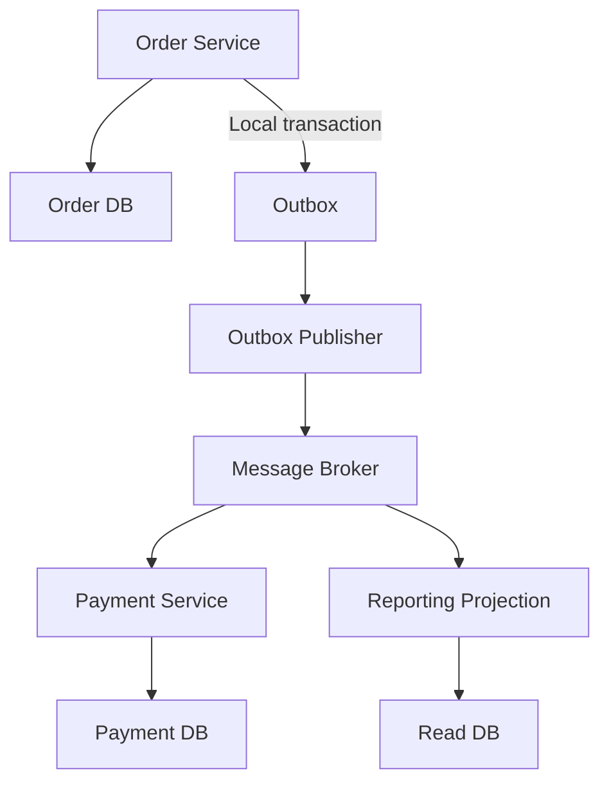
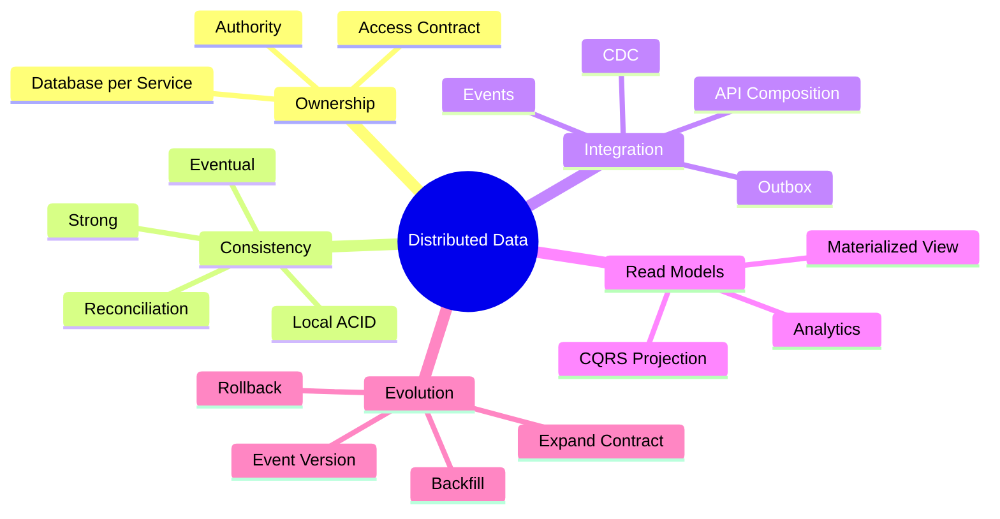

# Module 5 — Data Ownership and Distributed Consistency

## 1. Module Identity and Duration

| Item | Details |
|---|---|
| Course | Microservices Architecture In-Depth |
| Part | Part 3 — Data and Distributed Transactions |
| Module | Module 5 — Data Ownership and Distributed Consistency |
| Duration | 1 Hour |
| Level | Intermediate to Advanced |
| Learning Ratio | 30% concepts and 70% modelling, demonstration and lab work |
| Case Study | Order and Payment Processing Platform |

## 2. Learning Objectives

By the end of this module, participants will be able to:

1. Explain logical data ownership in microservices.
2. Apply the database-per-service principle appropriately.
3. Compare strong and eventual consistency.
4. Select API composition, read models or replicated data for cross-service queries.
5. Explain and design the Transactional Outbox pattern.
6. Position Change Data Capture safely.
7. Evolve database and event schemas without breaking consumers.
8. Design reconciliation for missed or inconsistent outcomes.

## 3. What Is Data Ownership?

Data ownership means one service is the authoritative controller of business data within its responsibility. Other services do not bypass that owner to modify its private schema. They collaborate through explicit APIs, commands, events or governed read models.

`Database per service` is a logical ownership rule, not necessarily a requirement to purchase one physical database server for every service. Isolation can be implemented through separate databases, schemas, accounts or other controls, provided ownership and independent evolution remain protected.

> **Memory line:** One authoritative owner; many controlled consumers.

## 4. Why Distributed Data Design Matters

Inside one database transaction, atomicity and consistency are comparatively straightforward. Across independently owned services, there may be:

- No single transaction coordinator
- Network failure between steps
- Duplicate or delayed messages
- Different schema versions
- Temporary disagreement between read models
- Separate scaling and availability requirements
- Regulatory and data-residency constraints

Good data design provides:

- Clear authority for every data element
- Independent schema evolution
- Local transaction boundaries
- Reliable event publication
- Explicit consistency expectations
- Scalable read paths
- Detectable and repairable inconsistencies

## 5. Real-Life Analogy — Separate Bank Lockers

Imagine customers using separate bank lockers.

- Each locker has a clearly authorized owner.
- Another customer cannot open and rearrange it directly.
- Information or an item is requested through an authorized process.
- The bank records access and protects custody.
- A copied statement may be useful, but the locker remains the source of truth.

### Mapping

| Bank concept | Microservices concept |
|---|---|
| Locker | Service-owned data store |
| Locker owner | Owning service/team |
| Bank authorization | API or message contract and access control |
| Official locker contents | Authoritative source of truth |
| Copied statement | Replicated read model |
| Access record | Audit log |
| Reconciliation process | Data consistency repair |

### Where the Analogy Stops

- Software copies may become temporarily stale.
- Messages can be duplicated, reordered or lost if reliability is weak.
- Ownership must include semantics, not only storage permissions.
- Distributed business transactions require explicit workflow coordination.

## 6. How Distributed Data Works

1. Define the authoritative owner of each business concept.
2. Keep business invariants local to the owning service where possible.
3. Commit local state atomically.
4. Publish relevant facts reliably.
5. Let consumers build their own local views where justified.
6. Include version and identity metadata for ordering and duplication handling.
7. Make consumers idempotent.
8. Monitor freshness and processing lag.
9. Reconcile missed or inconsistent states.
10. Evolve schemas through backward-compatible transitions.

## 7. Core Concepts

### 7.1 Database per Service

Each service owns its data and controls access to it. Other services use published contracts.

Possible physical implementations:

- Separate database server
- Separate database on a shared server
- Separate schema with restricted credentials
- Separate collection or keyspace with enforced ownership

The required outcome is autonomy, not maximum infrastructure count.

### 7.2 Shared Database Anti-Pattern

When services directly modify shared tables:

- Schema changes require coordination.
- Business rules can be bypassed.
- Ownership becomes ambiguous.
- Independent deployment becomes unsafe.
- Incidents have broad blast radius.

A shared physical platform may be acceptable temporarily, but shared write ownership is the central risk.

### 7.3 Polyglot Persistence

Services may choose data technologies suited to their workload—for example relational storage for payments and a search engine for catalogue discovery.

Use it only when workload benefits justify:

- Additional operational expertise
- Backup and recovery differences
- Security controls
- Monitoring
- Cost
- Migration complexity

### 7.4 Local ACID Transaction

A service should preserve its local invariants through an atomic transaction. For example, Order state and its Outbox record can be committed together.

### 7.5 Strong Consistency

After a successful write, readers observe the latest state according to the system's guarantee. Strong consistency is valuable for critical invariants but can reduce availability or increase coordination cost across distributed boundaries.

### 7.6 Eventual Consistency

Replicas or downstream views may temporarily differ but converge when processing completes.

Eventual consistency requires:

- Defined acceptable staleness
- Observable progress
- Idempotent processing
- Failure recovery
- Reconciliation
- User-facing status where relevant

It must not mean “we hope it becomes correct.”

### 7.7 CAP Perspective

During a network partition, a distributed system must make trade-offs between availability and strong consistency for the affected operation. CAP is not a database-product ranking and does not remove the need to reason per operation.

### 7.8 Cross-Service Query

When a view needs data from several services, common approaches include:

- API composition
- Replicated read model
- CQRS projection
- Data warehouse or lake for analytics
- Search index

Direct joins across private operational schemas undermine ownership.

### 7.9 API Composition

A composition layer calls multiple owning services and combines their results.

Use when:

- Data freshness must be high.
- Fan-out is limited.
- Dependencies meet the latency and availability budget.

Avoid large synchronous fan-out for high-volume or critical paths.

### 7.10 Materialized View

A consumer builds a local, query-optimized view from events. Reads become fast and autonomous, while freshness becomes eventual.

The design must track:

- Source event position
- Projection version
- Last successful update
- Replay capability
- Rebuild procedure

### 7.11 Transactional Outbox

The service writes the business state and an event-intent record to the same local transaction. A separate publisher reads unpublished Outbox records and sends them to the broker.

This prevents the dual-write gap where the database commit succeeds but event publication fails.

Typical steps:

1. Begin local transaction.
2. Update business aggregate.
3. Insert Outbox record.
4. Commit transaction.
5. Publisher reads pending record.
6. Publisher sends event.
7. Publisher marks or removes the record safely.
8. Consumer processes idempotently.

The publisher may send duplicates; Outbox solves reliable publication, not universal exactly-once business processing.

### 7.12 Change Data Capture

CDC reads committed database changes, commonly from a transaction log, and publishes them downstream.

Use cases:

- Publishing Outbox records
- Legacy integration
- Data replication
- Analytics feeds

Publishing raw internal tables as public business contracts creates strong schema coupling. Prefer curated events with stable meaning.

### 7.13 Idempotent Consumer

A consumer stores message identity or business-operation identity with its local effect. Reprocessing does not duplicate the outcome.

### 7.14 Optimistic Concurrency

Version numbers or conditional updates prevent one writer from silently overwriting changes based on stale state.

### 7.15 Schema Evolution

Use expand-and-contract:

1. Add new structure without removing old structure.
2. Deploy code capable of both forms.
3. Backfill or migrate incrementally.
4. Switch reads and writes safely.
5. Verify usage.
6. Remove obsolete structure later.

### 7.16 Event Schema Evolution

Prefer additive optional fields and stable semantics. Track version, producer and event type. Validate compatibility before deployment.

### 7.17 Reconciliation

Reconciliation compares expected and actual state and repairs or escalates differences.

Examples:

- Paid order without captured-payment record
- Inventory reservation without active order
- Outbox event not published within an SLO
- Read model behind its source position

### 7.18 Data Sovereignty and Compliance

Ownership must include:

- Classification
- Residency
- Retention
- Deletion
- Encryption
- Audit
- Access purpose
- Replication boundaries

## 8. Architecture Visualization

Order state and the Outbox record commit atomically. Payment and Reporting update independently and idempotently.

## 9. Separate Mind Map

## 10. Decision and Comparison Tables

### 10.1 Cross-Service Read Choices

| Approach | Freshness | Runtime dependency | Best fit | Main risk |
|---|---|---|---|---|
| API composition | Current at call time | High | Small fan-out operational view | Latency and cascading failure |
| Materialized view | Eventual | Low at read time | High-volume combined queries | Staleness and projection recovery |
| Analytics platform | Delayed/batch or streaming | Low | Historical and analytical queries | Not suitable for immediate operations |
| Direct database join | Current | Hidden strong coupling | Transitional exception only | Ownership and schema coupling |

### 10.2 Consistency Decision

| Question | Design implication |
|---|---|
| Is this a critical invariant? | Keep it inside one aggregate/service if possible |
| Can the user see a pending state? | Eventual workflow may be acceptable |
| What is acceptable staleness? | Define projection freshness SLO |
| Can the action be repeated safely? | Implement idempotency |
| How is inconsistency detected? | Add metrics and reconciliation |
| How is it repaired? | Automate correction or define manual resolution |

### 10.3 Outbox vs Direct Publish

| Dimension | Direct publish after commit | Transactional Outbox |
|---|---|---|
| Database/event atomicity | No | Local transaction covers intent |
| Lost-event risk | Present | Controlled |
| Duplicate risk | Present | Still present; consumer must be idempotent |
| Operational components | Simpler | Publisher, cleanup and monitoring required |
| Recommended for critical integration | No | Yes |

### 10.4 Physical Isolation Options

| Model | Isolation | Cost | Appropriate use |
|---|---|---|---|
| Shared schema and shared credentials | Weak | Low | Avoid for independent services |
| Separate schemas and credentials | Moderate | Low to moderate | Controlled transitional/smaller environments |
| Separate databases | Strong | Moderate | Common service ownership model |
| Separate database clusters/accounts | Very strong | High | Regulatory, blast-radius or workload isolation |

## 11. Real-World Enterprise Scenario

### Situation

Order, Inventory and Payment services use one shared database. Order directly changes stock and payment tables inside one transaction. Teams want independent deployment but every schema change requires coordination.

### Risks

- Services bypass each other's business rules.
- Ownership is unclear.
- A single transaction hides distributed workflow decisions.
- Schema changes break independent releases.
- Database load and failure affect all capabilities.

### Incremental Improvement

1. Define authoritative ownership for each table and business rule.
2. Prevent new cross-owner writes.
3. Expose intent-based APIs or commands.
4. Introduce an Outbox for reliable events.
5. Build local reporting projections.
6. Move schemas or databases incrementally.
7. Introduce Saga for the Order–Inventory–Payment workflow in Module 6.
8. Add reconciliation before removing legacy joins.

### Target Ownership

| Data | Owner |
|---|---|
| Order lifecycle | Order Service |
| Available stock and reservations | Inventory Service |
| Authorization, capture and refund | Payment Service |
| Combined order status view | Reporting projection derived from events |

## 12. Step-by-Step Hands-On Lab

### Lab Title

Design Reliable Data Ownership and Event Publication

### Business Problem

Order Service must create an order and notify Payment and Reporting reliably. Direct cross-service database writes and direct event publication currently create inconsistent results.

### Required Tools

- Markdown editor
- Mermaid renderer
- Relational database or SQL modelling tool
- Optional message broker and CDC connector

### Step 1 — Build a Data Inventory

List business data, current storage, readers, writers and sensitivity.

### Step 2 — Assign Authoritative Owners

Assign one owner for Order, Inventory, Payment and Reporting data.

### Step 3 — Identify Local Invariants

Document which rules must commit atomically inside each service.

### Step 4 — Remove Cross-Service Writes

Replace direct table updates with an API, command or event contract.

### Step 5 — Design Outbox Schema

Include:

- Outbox ID
- Aggregate type and ID
- Event type and version
- Payload
- Correlation and causation IDs
- Created timestamp
- Publication status or position

### Step 6 — Design Local Transaction

Show Order and Outbox changes committing atomically.

### Step 7 — Design Publisher

Specify polling or CDC, batching, publish acknowledgment, retry and cleanup.

### Step 8 — Design Idempotent Consumer

Store processed message identity with Payment or Reporting changes.

### Step 9 — Design Combined Read View

Choose API composition or materialized view and justify freshness expectations.

### Step 10 — Define Reconciliation

Detect an order whose Outbox event remains unpublished beyond the target time.

### Step 11 — Test Schema Evolution

Add an optional `salesChannel` field through an expand-and-contract transition.

### Step 12 — Simulate Failures

Test:

- Database commit succeeds and broker is unavailable
- Publisher sends the same event twice
- Consumer fails after local commit
- Projection is rebuilt from retained events

## 13. Expected Lab Output

Participants must produce:

- Data inventory
- Ownership matrix
- Local-invariant list
- Cross-service access replacement plan
- Outbox schema
- Transaction and publisher diagram
- Idempotent-consumer design
- Cross-service query decision
- Reconciliation rule
- Schema-evolution plan
- Failure-test evidence

### Validation Criteria

- Every business datum has one authoritative owner.
- Cross-service writes are removed or explicitly transitional.
- Business state and event intent commit atomically.
- Duplicate publication is safe.
- Read-model staleness is defined and observable.
- Reconciliation detects and repairs missed outcomes.
- Schema change is backward compatible.

## 14. Failure Scenarios and Troubleshooting

| Symptom | Likely cause | Corrective action |
|---|---|---|
| Order exists but no event was published | Dual-write failure | Use Outbox and monitor publication age |
| Consumer creates duplicate record | Missing idempotency | Persist message identity with local effect |
| Read model is stale | Consumer stopped or broker lag | Monitor position/lag, recover and replay |
| Services break after column change | Shared schema coupling | Restore compatibility and apply expand-contract |
| Reports overload operational services | Large synchronous fan-out | Build governed query projection or analytics view |
| Outbox table grows indefinitely | Missing cleanup/archival | Add retention after confirmed publication |
| Events expose internal columns | Raw CDC used as public contract | Translate into curated business events |
| Updates overwrite newer state | Missing concurrency control | Use version/conditional update |
| Deletion is incomplete across copies | Replicas not tracked | Maintain data lineage and deletion workflow |
| States never converge | No recovery/reconciliation | Add retry, DLQ, replay and reconciliation controls |

## 15. Best Practices

- Assign one authoritative owner to each business concept.
- Keep critical invariants local where possible.
- Use least-privilege credentials per service.
- Expose business contracts rather than database structures.
- Define acceptable staleness for every replicated view.
- Use Outbox for reliable event intent.
- Make publishers and consumers tolerant of duplicates.
- Track schema and event versions.
- Use expand-and-contract migrations.
- Monitor lag, unpublished records and reconciliation failures.
- Document data lineage, retention and deletion propagation.
- Choose polyglot persistence only for justified workload benefits.

## 16. Anti-Patterns

### 16.1 Shared Write Database

Multiple services directly mutate the same business data and bypass ownership.

### 16.2 Distributed Join in the Critical Path

A request depends on large fan-out or direct joins across private schemas.

### 16.3 Dual Write

The application updates its database and publishes an event as two unrelated operations.

### 16.4 Eventual Consistency Without SLO

No one defines how stale data may be or how convergence is measured.

### 16.5 Raw CDC as Domain Contract

Internal storage changes become externally coupled public messages.

### 16.6 Polyglot Persistence by Fashion

Every service selects a different technology without operational or workload justification.

### 16.7 Breaking Migration

A column or event field is removed before old code and consumers stop using it.

### 16.8 No Reconciliation

The architecture assumes retries will eventually fix every inconsistency.

## 17. Security Considerations

Define:

- Data classification and owner
- Service-specific credentials
- Least-privilege read/write permissions
- Encryption in transit and at rest
- Key rotation
- Backup encryption
- Retention and deletion rules
- Residency restrictions
- Sensitive fields in events
- Read-model access controls
- Audit trail and lineage
- Masking in logs and nonproduction environments

Replication expands exposure. Copy only required fields and track every sensitive-data destination.

## 18. Performance Considerations

Monitor:

- Query latency and throughput
- Connection-pool saturation
- Outbox backlog and oldest-record age
- Broker publish latency
- Consumer lag
- Projection freshness
- Reconciliation volume
- Hot aggregate contention
- Database storage growth
- Cross-service fan-out

Batch Outbox publishing carefully, index query paths, avoid unbounded payloads and separate analytical workloads from critical operational transactions.

## 19. Interview Preparation

### Question 1 — What does database per service mean?

One service is the authoritative owner of its data and schema. Isolation may be physical or logical, but other services must not bypass the owner to modify private data.

### Question 2 — How do you query data across services?

Use API composition for small, fresh queries; materialized views or CQRS projections for high-volume combined reads; and analytical platforms for historical analysis.

### Question 3 — What problem does Outbox solve?

It atomically stores business state and event intent in one local transaction, preventing loss between database commit and message publication.

### Question 4 — Does Outbox guarantee exactly-once delivery?

No. Publishers may send duplicates. Consumers must remain idempotent to achieve one effective business outcome.

### Question 5 — What is eventual consistency?

Distributed copies may temporarily differ but converge through a defined, observable and recoverable process within an accepted staleness target.

### Question 6 — What is CDC?

Change Data Capture observes committed database changes, often through a transaction log, and makes them available downstream. It is useful for Outbox publication and integration.

### Question 7 — How do you evolve a database safely?

Use expand-and-contract: add compatible structure, deploy tolerant code, migrate/backfill, switch usage, verify and later remove obsolete structure.

### Question 8 — Why is reconciliation necessary?

Retries and events can still fail or produce unexpected state. Reconciliation detects divergence and repairs or escalates it using authoritative records.

## 20. Quick Recap

- Data ownership is semantic and operational, not only physical.
- Other services use contracts, not private tables.
- Keep invariants and ACID transactions local.
- Eventual consistency needs a staleness target and recovery plan.
- Outbox closes the database-to-broker dual-write gap.
- CDC must not leak unstable table schemas as domain contracts.
- Replicated read models improve autonomy but need freshness monitoring.
- Schema evolution requires backward-compatible transitions.
- Reconciliation makes convergence dependable.

## 21. Learning Outcome

The participant can assign authoritative data ownership, select a cross-service query strategy, design reliable Outbox publication and idempotent consumption, define eventual-consistency expectations, and evolve or reconcile distributed data safely.

## 22. Twenty MCQs

### 1. What is the central meaning of database per service?

A. One physical server for every endpoint  
B. One authoritative service controls its data  
C. Every service uses a different vendor  
D. All services share administrator credentials

**Answer:** B  
**Explanation:** Logical ownership and controlled access are the primary requirements.

### 2. What is the main risk of shared write access?

A. Too many diagrams  
B. Business rules and schema ownership can be bypassed  
C. Fewer network calls  
D. Stronger autonomy

**Answer:** B  
**Explanation:** Direct updates create hidden coupling and ambiguous responsibility.

### 3. What does eventual consistency require?

A. No monitoring  
B. Defined convergence and recovery  
C. One global transaction  
D. No user status

**Answer:** B  
**Explanation:** Staleness, progress, failure and repair must be explicit.

### 4. Which approach best fits a high-volume combined read?

A. Large synchronous fan-out  
B. Materialized read model  
C. Cross-service writes  
D. Shared credentials

**Answer:** B  
**Explanation:** A local query projection reduces runtime dependencies.

### 5. What does API composition trade for freshness?

A. Runtime dependency and latency  
B. No network use  
C. Guaranteed availability  
D. Automatic caching

**Answer:** A  
**Explanation:** Composition calls multiple live owners and inherits their latency/failure risk.

### 6. What is stored atomically in an Outbox design?

A. Two unrelated databases  
B. Business change and event intent  
C. Gateway route and password  
D. Consumer code and image

**Answer:** B  
**Explanation:** Both records commit in the same local database transaction.

### 7. Can an Outbox publisher send duplicates?

A. No  
B. Yes  
C. Only without a database  
D. Only for REST

**Answer:** B  
**Explanation:** Failure around acknowledgment can cause republishing.

### 8. What must an Outbox consumer implement?

A. Idempotency  
B. Shared table updates  
C. Infinite retry  
D. No validation

**Answer:** A  
**Explanation:** Duplicate delivery must not duplicate business effects.

### 9. What is CDC commonly based on?

A. UI events  
B. Committed transaction log changes  
C. CSS changes  
D. DNS records

**Answer:** B  
**Explanation:** CDC tools commonly read database transaction logs.

### 10. What is risky about raw table CDC as a public contract?

A. It is too business-oriented  
B. Consumers become coupled to internal schema  
C. It always encrypts data  
D. It eliminates versioning

**Answer:** B  
**Explanation:** Internal storage changes may unintentionally break consumers.

### 11. What is expand-and-contract used for?

A. Safe schema evolution  
B. Service discovery  
C. UI scaling  
D. Token validation

**Answer:** A  
**Explanation:** Old and new forms coexist during a controlled transition.

### 12. What does optimistic concurrency prevent?

A. Event publication  
B. Silent overwrite based on stale state  
C. Database backups  
D. Read models

**Answer:** B  
**Explanation:** Version checks detect conflicting concurrent changes.

### 13. What should define projection freshness?

A. A measurable staleness SLO  
B. Developer intuition only  
C. Number of databases  
D. API colour

**Answer:** A  
**Explanation:** Consumers need an explicit target for acceptable delay.

### 14. What does reconciliation compare?

A. CSS and HTML  
B. Expected and actual business state  
C. Container names  
D. Programming languages

**Answer:** B  
**Explanation:** Reconciliation detects and repairs divergence.

### 15. When is polyglot persistence justified?

A. Every team wants a new database  
B. Workload benefits exceed operational cost  
C. No one owns operations  
D. It is fashionable

**Answer:** B  
**Explanation:** Technology diversity must provide measurable value.

### 16. Where should a critical invariant preferably live?

A. Across many services  
B. Inside one aggregate/service boundary  
C. In an API Gateway  
D. In a UI script

**Answer:** B  
**Explanation:** Local enforcement avoids unnecessary distributed coordination.

### 17. What is a read model?

A. An independently queryable projection optimized for reads  
B. A shared write database  
C. A deployment pipeline  
D. A secret store

**Answer:** A  
**Explanation:** It contains derived data shaped for query use cases.

### 18. What should deletion across replicas include?

A. No tracking  
B. Data lineage and propagation workflow  
C. Shared passwords  
D. Infinite retention

**Answer:** B  
**Explanation:** Copies must be known so retention and deletion requirements can be enforced.

### 19. Which metric reveals Outbox publication trouble?

A. Oldest unpublished record age  
B. UI font size  
C. Number of source files  
D. Browser width

**Answer:** A  
**Explanation:** Age directly measures whether event intent is stuck.

### 20. What is the best distributed-data principle?

A. Share every table  
B. Own data, publish reliably, consume idempotently and reconcile  
C. Remove all transactions  
D. Use one database technology per developer

**Answer:** B  
**Explanation:** These controls make decentralized data manageable.

## 23. Ten Subjective and Scenario-Based Questions

1. Explain logical versus physical database-per-service isolation.
2. Redesign a system where Order directly updates Inventory and Payment tables.
3. Compare API composition and a materialized read model for an order dashboard.
4. Design the local transaction and publisher behavior for a Transactional Outbox.
5. Explain how an idempotent consumer handles failure after database commit but before acknowledgment.
6. Define an acceptable eventual-consistency SLO for inventory reporting.
7. Design reconciliation for paid orders that remain unconfirmed.
8. Explain when CDC is appropriate and when it leaks internal schema.
9. Create an expand-and-contract plan for changing a customer identifier.
10. Evaluate whether separate database clusters are justified for Payment and Notification services.

### Evaluation Guidance

Strong answers should:

- Identify one authoritative owner
- Preserve local invariants
- State consistency and staleness expectations
- Address duplicate delivery and replay
- Include monitoring, reconciliation and rollback
- Protect sensitive data and schema compatibility

## 24. Assignment

### Title

Distributed Data Blueprint for Order, Inventory and Payment

### Scenario

Order, Inventory, Payment and Reporting currently share one relational database. The organization needs independent releases, reliable events and fast combined reporting without allowing services to change each other's data.

### Tasks

1. Inventory business data, readers, writers and classification.
2. Assign an authoritative owner to every data group.
3. Identify local aggregates and critical invariants.
4. Replace cross-service writes with explicit contracts.
5. Design Order and Payment Outbox schemas.
6. Design publisher retry, acknowledgment and cleanup.
7. Create idempotent-consumer algorithms.
8. Select API composition or read models for operational dashboards.
9. Define freshness and lag SLOs.
10. Design reconciliation rules and manual resolution.
11. Create an expand-and-contract database migration.
12. Define event-schema compatibility rules.
13. Document security, retention and deletion propagation.
14. Plan incremental migration from the shared database.

### Required Deliverables

- Data inventory and classification
- Ownership matrix
- Aggregate and invariant map
- Contract catalogue
- Outbox and publisher design
- Idempotent-consumer design
- Read-strategy decision
- Freshness and reconciliation plan
- Schema-evolution plan
- Shared-database migration roadmap

### Assessment Rubric

| Criterion | Weight |
|---|---:|
| Ownership and boundary quality | 20% |
| Consistency and invariant design | 15% |
| Outbox and idempotency | 20% |
| Query and read-model strategy | 10% |
| Reconciliation and recovery | 15% |
| Schema evolution and security | 10% |
| Visual and communication clarity | 10% |
| **Total** | **100%** |

## Final Memory Line

> Give every business datum one authoritative owner, keep invariants local, publish changes reliably, consume them idempotently, and reconcile what distributed failure leaves behind.
