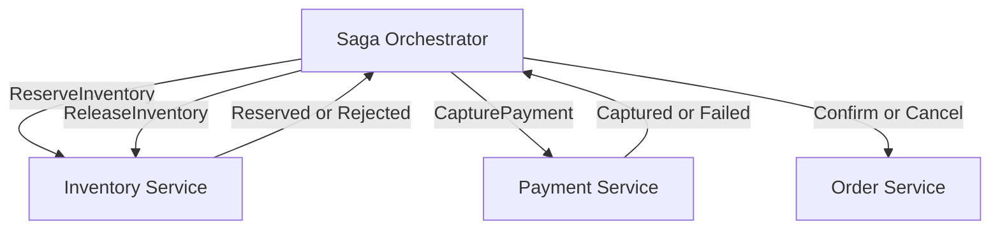
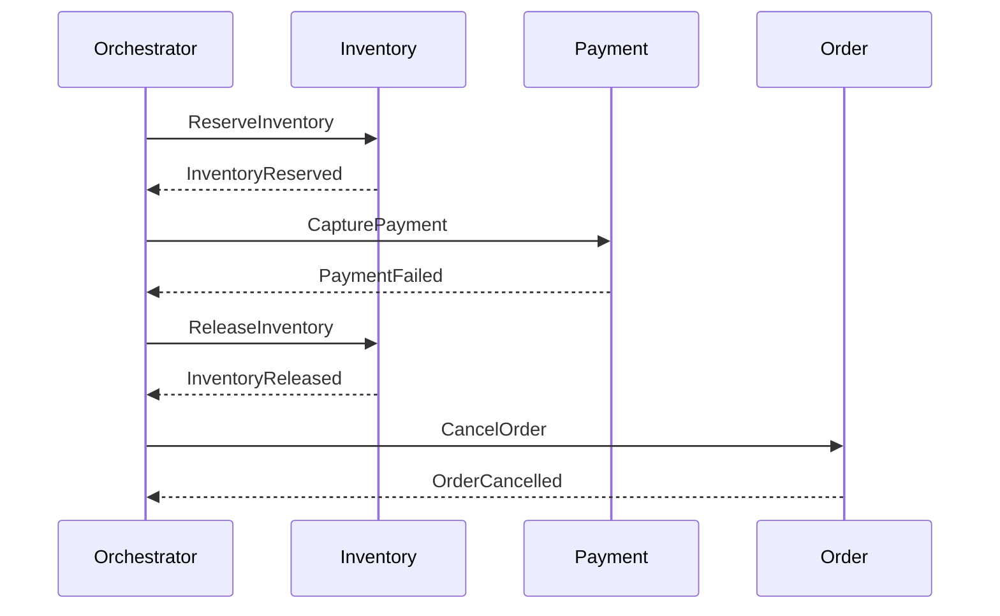
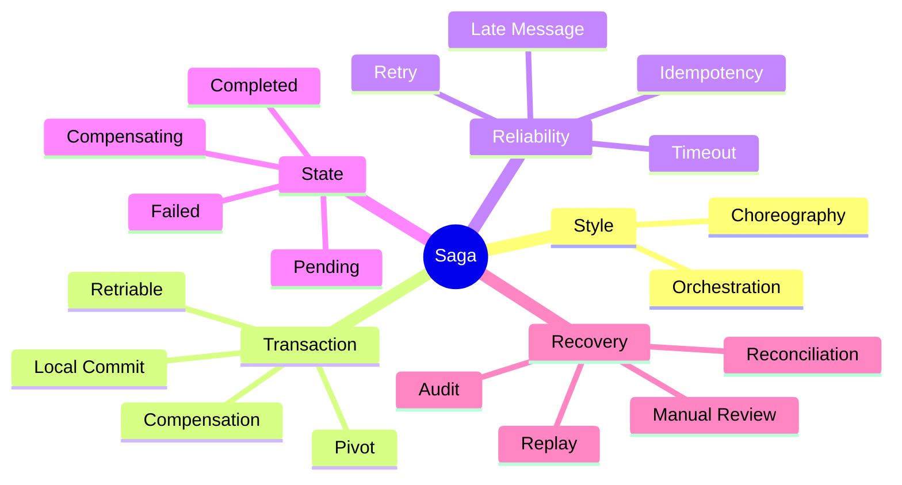

# Module 6 — Saga and Distributed Workflow Management

## 1. Module Identity and Duration

| Item | Details |
|---|---|
| Course | Microservices Architecture In-Depth |
| Part | Part 3 — Data and Distributed Transactions |
| Module | Module 6 — Saga and Distributed Workflow Management |
| Duration | 1 Hour |
| Level | Intermediate to Advanced |
| Learning Ratio | 30% concepts and 70% workflow design, failure analysis and lab work |
| Case Study | Order, Inventory and Payment Workflow |

## 2. Learning Objectives

By the end of this module, participants will be able to:

1. Explain why a local ACID transaction cannot directly protect multiple autonomous services.
2. Describe Saga as a sequence of local transactions.
3. Compare choreography and orchestration.
4. Design compensating actions using business semantics.
5. Handle retries, timeouts, duplicates and out-of-order outcomes.
6. Model Saga state and terminal outcomes.
7. Design reconciliation and manual resolution.
8. Build an observable and auditable Order Saga.

## 3. What Is a Saga?

A Saga is a distributed business workflow composed of local transactions executed by participating services. Each successful step changes local state and triggers the next step. If a later step cannot complete, compensating actions semantically counteract earlier completed work where possible.

A Saga does not create a magical global rollback. Compensation is a new business action, such as:

- Release reserved inventory
- Void an authorization
- Refund a captured payment
- Cancel a shipment request
- Mark an order as failed

> **Memory line:** Saga = local transactions + durable progress + business compensation.

## 4. Why Saga Is Required

In a monolith, Order, Inventory and Payment updates might be protected by one database transaction. In microservices:

- Each service owns its database.
- Network calls can fail after either side changes state.
- Services may be temporarily unavailable.
- Responses or messages may be duplicated or delayed.
- External providers may not support rollback.
- Long-running workflows cannot hold locks across services.

Saga provides an explicit model for:

- Workflow progress
- Local commits
- Failure transitions
- Compensation
- Retry
- Timeout
- Audit
- Recovery
- Final business outcome

## 5. Real-Life Analogy — Flight, Hotel and Taxi Booking

A traveller books a trip containing:

1. Flight
2. Hotel
3. Airport taxi

Each provider owns its system and confirms independently. There is no single database transaction across all three companies.

If the taxi booking fails:

- Try another provider.
- Continue without a taxi if business policy allows.
- Cancel the hotel and flight if the trip cannot proceed.
- Apply cancellation rules and fees.

### Mapping

| Travel concept | Saga concept |
|---|---|
| Complete trip | Distributed business transaction |
| Flight/hotel/taxi provider | Participating service |
| Individual booking | Local transaction |
| Booking confirmation | Success event/result |
| Cancellation | Compensating transaction |
| Booking reference | Saga/business transaction ID |
| Travel agent | Saga orchestrator |
| Providers reacting to confirmations | Saga choreography |
| Manual support desk | Human resolution |

### Where the Analogy Stops

- Compensation may not restore the exact previous state.
- Fees, notifications and audit records may remain.
- Messages may arrive more than once or out of order.
- A late success may arrive after a timeout and compensation has started.

## 6. How Saga Works

### Successful Flow

1. Order Service creates an order in `PENDING` state.
2. Inventory Service reserves stock in a local transaction.
3. Payment Service authorizes or captures payment locally.
4. Order Service confirms the order.
5. Notification Service informs the customer.

### Failure Flow

1. Order is created.
2. Inventory is reserved.
3. Payment fails permanently.
4. Inventory reservation is released.
5. Order becomes `CANCELLED` or `PAYMENT_FAILED`.
6. Customer is informed.

### Essential Controls

- Durable Saga state
- Stable Saga and step identifiers
- Idempotent forward and compensation operations
- Bounded retries
- Timeouts
- Explicit terminal states
- Audit history
- Reconciliation

## 7. Core Concepts

### 7.1 Local Transaction

Each participant changes only the data it owns. For example, Inventory commits a reservation and publishes `InventoryReserved` reliably.

### 7.2 Compensating Transaction

A compensation semantically counteracts a completed action. It is not a database rollback.

| Forward action | Possible compensation |
|---|---|
| Reserve inventory | Release reservation |
| Authorize payment | Void authorization |
| Capture payment | Initiate refund |
| Create shipment | Cancel shipment request |
| Award loyalty points | Reverse points |

Compensation may fail and therefore requires the same reliability, idempotency and monitoring as forward processing.

### 7.3 Choreography

Participants react to events without one central workflow controller.

Example:

`OrderCreated → InventoryReserved → PaymentCaptured → OrderConfirmed`

**Strengths**

- Decentralized interaction
- Natural for small, simple event chains
- Low central coordination

**Risks**

- Workflow becomes difficult to see
- Cyclic event dependencies
- Business state is distributed
- Error and timeout handling become harder
- Adding steps can increase coupling

### 7.4 Orchestration

An orchestrator stores workflow state and sends commands to participants. Participants return outcomes, and the orchestrator selects the next transition.

**Strengths**

- Explicit workflow
- Central progress visibility
- Clear timeout and compensation logic
- Easier reasoning for complex workflows

**Risks**

- Orchestrator can become overly intelligent
- Availability and scaling must be engineered
- Domain logic may leak from services

The orchestrator should own workflow coordination, not the internal business rules of participants.

### 7.5 Saga State Machine

Represent state transitions explicitly.

Example states:

- `STARTED`
- `INVENTORY_PENDING`
- `INVENTORY_RESERVED`
- `PAYMENT_PENDING`
- `PAYMENT_COMPLETED`
- `CONFIRMED`
- `COMPENSATING`
- `CANCELLED`
- `MANUAL_REVIEW`

### 7.6 Pivot Transaction

In Saga literature, a pivot transaction is a point after which the workflow must complete using retries or forward recovery rather than compensating all earlier work. Its exact meaning must reflect business policy.

### 7.7 Compensable Transaction

A step that can be counteracted by a defined business compensation.

### 7.8 Retriable Transaction

A step designed to eventually succeed through safe retry after the workflow passes an irreversible boundary.

### 7.9 Semantic Lock

Because a Saga exposes intermediate state, business status such as `PENDING` or `RESERVED` prevents conflicting actions while the workflow is incomplete.

### 7.10 Idempotency

Every forward command and compensation command must tolerate duplicates. A stable key may combine Saga ID, step name and attempt intent.

### 7.11 Timeout

A timeout is a business decision that a response did not arrive within the permitted interval. It does not prove the remote action failed.

After timeout, the action may be:

- Not received
- Still running
- Completed but response lost
- Completed after the deadline

Therefore, query status or use idempotent retry before compensating blindly.

### 7.12 Retry Classification

- **Transient:** Temporary network error; bounded retry may help.
- **Business rejection:** Insufficient stock; retry without changed conditions will not help.
- **Unknown outcome:** Request timed out; determine status safely.
- **Permanent technical:** Invalid contract; route to investigation.

### 7.13 Late and Out-of-Order Messages

Use Saga state, step version and transition rules. A late success must not incorrectly confirm a Saga already cancelled and refunded.

### 7.14 Isolation Anomalies

Sagas do not provide full ACID isolation. Intermediate state may be visible. Risks include dirty reads, lost updates and business decisions based on incomplete workflows.

Mitigate using:

- Semantic locks/status
- Version checks
- Commutative updates
- Reread before action
- Business reservation

### 7.15 Reconciliation

Scheduled or event-driven checks compare Saga state with participant state and repair or escalate differences.

### 7.16 Manual Resolution

Some failures require authorized human action. Manual tooling must show:

- Saga history
- Current participant states
- Available safe actions
- Audit identity
- Approval requirements
- Final resolution

## 8. Architecture Visualizations

### 8.1 Orchestrated Saga

### 8.2 Order Saga Sequence

## 9. Separate Mind Map

## 10. Decision and Comparison Tables

### 10.1 Choreography vs Orchestration

| Dimension | Choreography | Orchestration |
|---|---|---|
| Control | Distributed through event reactions | Explicit coordinator |
| Workflow visibility | Harder as steps grow | Central state and transitions |
| Coupling | Event/semantic coupling | Participants coupled to commands/contracts |
| Best fit | Short, stable, simple reaction chain | Complex workflow with branches/timeouts |
| Compensation | Distributed across handlers | Directed by orchestrator |
| Risk | Event maze | God orchestrator |

### 10.2 Failure Decision Table

| Failure type | Example | Response |
|---|---|---|
| Business rejection | Out of stock | Stop and compensate completed steps |
| Transient technical | Temporary timeout | Bounded retry with backoff |
| Unknown outcome | Payment response lost | Query status or repeat idempotently |
| Permanent technical | Invalid schema | Stop, alert and investigate |
| Compensation failure | Refund provider unavailable | Retry, reconcile and escalate |

### 10.3 Saga vs ACID

| Dimension | Local ACID transaction | Saga |
|---|---|---|
| Scope | One transactional resource | Multiple autonomous participants |
| Atomic rollback | Yes within transaction | No; business compensation |
| Isolation | Database guarantee | Intermediate state may be visible |
| Duration | Usually short | May be long-running |
| Failure handling | Rollback | State, retry, compensation, reconciliation |

### 10.4 Compensation Design

| Question | Required answer |
|---|---|
| What was committed? | Participant state and evidence |
| Can it be reversed? | Full, partial or irreversible |
| What is the business counteraction? | Named compensation command |
| Is compensation idempotent? | Duplicate-safe key and result |
| What if it fails? | Retry, reconciliation and manual escalation |
| What is visible to users? | Pending, cancelled, refund pending, etc. |

## 11. Real-World Enterprise Scenario

### Situation

An Order API reserves inventory and charges payment synchronously. The Payment request times out. Order assumes failure, releases inventory and asks the customer to retry. The original payment completes late, producing a charge without an order.

### Root Cause

- Timeout was treated as confirmed failure.
- Payment lacked idempotent status lookup.
- No durable workflow state existed.
- Late outcomes were not correlated.
- No reconciliation detected orphan charges.

### Corrected Design

1. Create a durable Saga with a stable Saga ID.
2. Send `CapturePayment` using an idempotency key.
3. On timeout, mark payment outcome `UNKNOWN`.
4. Query payment status or safely retry with the same key.
5. If capture succeeded, continue or refund according to state.
6. If capture failed, compensate inventory.
7. Reconcile provider transactions against Saga state.
8. Route unresolved cases to authorized manual review.

## 12. Step-by-Step Hands-On Lab

### Lab Title

Design an End-to-End Order Saga

### Business Problem

An order requires inventory reservation, payment capture and order confirmation. Any step may fail, time out or return late.

### Required Tools

- Markdown editor
- Mermaid renderer
- Saga state table template
- Optional workflow engine or message broker

### Step 1 — Define Business Outcome

Specify confirmed, cancelled, pending and manual-review outcomes.

### Step 2 — Identify Participants

List Order, Inventory, Payment and Notification responsibilities.

### Step 3 — Define Forward Steps

Define command, success result and business rejection for each step.

### Step 4 — Define Compensations

Map each completed step to a business counteraction.

### Step 5 — Select Saga Style

Compare choreography and orchestration. Record the choice and reason.

### Step 6 — Create State Machine

Define states, permitted transitions, terminal states and invalid late transitions.

### Step 7 — Add Idempotency

Define keys for reserve, capture, release and refund operations.

### Step 8 — Add Timeout and Retry

Classify failures and define bounded retry, status query and escalation.

### Step 9 — Handle Late Outcome

Design behavior when `PaymentCaptured` arrives after compensation began.

### Step 10 — Add Durable Messaging

Use Outbox for state changes and outgoing commands/events.

### Step 11 — Add Observability

Capture Saga ID, step, state, attempt, duration, error and business outcome.

### Step 12 — Add Reconciliation

Compare payment-provider records, reservations and Order Saga state.

### Step 13 — Simulate Scenarios

1. Complete success
2. Inventory rejection
3. Payment business rejection
4. Payment timeout with eventual success
5. Duplicate success event
6. Compensation failure

## 13. Expected Lab Output

Participants must produce:

- Participant and responsibility table
- Forward-step and compensation matrix
- Choreography/orchestration ADR
- Saga state model
- Happy-path sequence
- Failure and compensation sequence
- Idempotency-key design
- Timeout and retry policy
- Late-message rules
- Reconciliation and manual-resolution procedure
- Observability dashboard specification

### Validation Criteria

- Every completed compensable step has a counteraction.
- Forward and compensation operations are idempotent.
- Unknown outcomes are not treated as confirmed failures.
- State transitions reject invalid late events.
- Terminal states are explicit.
- Compensation failures are recoverable and visible.
- Business and technical status can be audited end to end.

## 14. Failure Scenarios and Troubleshooting

| Symptom | Likely cause | Corrective action |
|---|---|---|
| Charged but order cancelled | Late/unknown payment outcome | Query status, correlate and refund or continue safely |
| Inventory stays reserved | Compensation missing or failed | Retry idempotently and reconcile reservations |
| Saga never finishes | No timeout or stuck state | Add deadlines, stuck-Saga detector and recovery action |
| Duplicate refund | Compensation not idempotent | Use Saga-step idempotency key and stored result |
| Order confirmed twice | Duplicate/late event accepted | Enforce state version and valid-transition rules |
| Event cycle repeats | Choreography loop | Add causation guards or use orchestration |
| Orchestrator owns payment rules | God orchestrator | Move participant rules into Payment Service |
| Manual support cannot act safely | No resolution model | Provide state history and authorized commands |
| Compensation loses audit evidence | Destructive rollback thinking | Record compensation as a new business action |
| Reconciliation produces false alarms | Incorrect authority or timing | Define source of truth and grace interval |

## 15. Best Practices

- Keep invariants local whenever possible.
- Model Saga state explicitly and durably.
- Use stable workflow, message and step identifiers.
- Make every command and compensation idempotent.
- Distinguish business rejection, transient failure and unknown outcome.
- Treat timeouts as uncertainty, not proof of failure.
- Publish state transitions reliably using Outbox.
- Define terminal and manual-review states.
- Keep participant business rules out of the orchestrator.
- Expose meaningful pending and recovery status to users.
- Reconcile against authoritative participant records.
- Test failure at every boundary, including compensation.

## 16. Anti-Patterns

### 16.1 Distributed Rollback Assumption

Teams expect local commits across services to roll back automatically.

### 16.2 Timeout Equals Failure

A missing response is treated as proof that the operation did not occur.

### 16.3 Non-Idempotent Compensation

Repeated release or refund commands create additional effects.

### 16.4 Event Choreography Maze

The workflow is hidden across many consumers and becomes difficult to reason about.

### 16.5 God Orchestrator

The coordinator absorbs participant business rules and becomes a central domain monolith.

### 16.6 Infinite Retry

Permanent business or contract failures are retried without limit.

### 16.7 No Terminal State

Workflows remain ambiguously pending forever.

### 16.8 No Reconciliation

The team assumes messaging will repair every inconsistent outcome.

## 17. Security Considerations

Define:

- Identity and authorization for every command
- Service-to-service authentication
- Least-privilege broker permissions
- Protection of payment and personal data
- Integrity of Saga IDs and state transitions
- Replay protection
- Authorized compensation and refunds
- Separation of duties for manual resolution
- Immutable audit history
- Secret and key rotation
- Data minimization in events

Compensation can be financially sensitive. Refund and cancellation operations require the same or stronger authorization and audit controls as forward actions.

## 18. Performance Considerations

Monitor:

- End-to-end Saga duration
- Per-step latency
- Pending Saga count and age
- Retry rate
- Timeout rate
- Compensation rate and duration
- Stuck Saga count
- Broker lag
- Orchestrator storage contention
- Reconciliation backlog

Use partition keys that preserve required ordering without creating hot partitions. Keep state compact, archive completed history appropriately and avoid tight polling loops.

## 19. Interview Preparation

### Question 1 — What is a Saga?

A Saga coordinates a distributed business transaction as local participant transactions with durable progress and compensating actions for failure.

### Question 2 — Choreography versus orchestration?

Choreography uses participants reacting to events and suits short, simple flows. Orchestration uses an explicit coordinator and suits workflows with branching, timeout, compensation and visibility needs.

### Question 3 — Is compensation the same as rollback?

No. Compensation is a new business action that semantically counteracts earlier work. It may be partial, visible, delayed or itself fail.

### Question 4 — How do you handle payment timeout?

Treat the outcome as unknown, query status or retry idempotently using the same key, then select the next transition from verified state.

### Question 5 — How do you make a Saga reliable?

Persist state durably, use Outbox, idempotent commands, bounded retries, timeouts, valid state transitions, observability and reconciliation.

### Question 6 — What is a semantic lock?

A business state such as `PENDING` or `RESERVED` prevents conflicting operations while the Saga is incomplete.

### Question 7 — What if compensation fails?

Retry safely, track the Saga as compensating, reconcile participant state, alert operations and provide controlled manual resolution.

### Question 8 — What belongs in the orchestrator?

Workflow state and transition decisions. Internal participant rules—such as payment eligibility—remain in the owning service.

## 20. Quick Recap

- A Saga connects local transactions; it is not a global ACID transaction.
- Compensation is a business counteraction, not time travel.
- Choreography fits simple flows; orchestration improves explicit control for complex flows.
- Timeouts produce uncertainty.
- Forward and compensation operations must be idempotent.
- State, transitions and terminal outcomes must be durable.
- Reconciliation and manual resolution are part of production design.

## 21. Learning Outcome

The participant can select a Saga style, model a durable distributed workflow, design safe compensation and timeout behavior, handle duplicates and late outcomes, and provide observable reconciliation and manual recovery.

## 22. Twenty MCQs

### 1. A Saga consists primarily of what?

A. One global database transaction  
B. Local transactions and compensations  
C. UI sessions  
D. Shared table locks

**Answer:** B  
**Explanation:** Each participant commits locally and workflow failure is handled through business counteractions.

### 2. Is compensation a database rollback?

A. Always  
B. No, it is a new business action  
C. Only in REST  
D. Only with Kafka

**Answer:** B  
**Explanation:** Compensation semantically offsets prior work and may not restore identical state.

### 3. Which style uses an explicit coordinator?

A. Choreography  
B. Orchestration  
C. Shared database  
D. API composition

**Answer:** B  
**Explanation:** An orchestrator stores state and directs workflow commands.

### 4. Which style relies on participants reacting to events?

A. Choreography  
B. Two-Phase Commit  
C. Local transaction  
D. Batch import

**Answer:** A  
**Explanation:** No central coordinator directs the complete event reaction chain.

### 5. What does a timeout prove?

A. The remote action definitely failed  
B. The outcome was not received in time  
C. Payment was never captured  
D. Compensation succeeded

**Answer:** B  
**Explanation:** The remote operation may be incomplete, complete or still running.

### 6. What should happen after an unknown payment outcome?

A. Charge again with a new key  
B. Query status or retry idempotently  
C. Ignore it forever  
D. Confirm the order automatically

**Answer:** B  
**Explanation:** Determine the actual outcome without creating a duplicate charge.

### 7. Which is a compensation for inventory reservation?

A. Reserve again  
B. Release reservation  
C. Delete audit logs  
D. Create customer

**Answer:** B  
**Explanation:** Release semantically counteracts the reservation.

### 8. Why must compensation be idempotent?

A. It can be delivered more than once  
B. It never fails  
C. It uses no data  
D. It is always synchronous

**Answer:** A  
**Explanation:** Retry or duplicate messaging must not repeat refund or release effects.

### 9. Which state indicates human action may be required?

A. `MANUAL_REVIEW`  
B. `STARTED` only  
C. `HEALTHY`  
D. `CACHED`

**Answer:** A  
**Explanation:** An explicit state makes unresolved workflow visible and actionable.

### 10. What is a major choreography risk?

A. No events  
B. Workflow becomes an event maze  
C. One database transaction  
D. No autonomy

**Answer:** B  
**Explanation:** Complex business flow becomes distributed across handlers.

### 11. What is a major orchestration risk?

A. God orchestrator  
B. No workflow visibility  
C. No commands  
D. No durable state

**Answer:** A  
**Explanation:** Participant domain rules may accumulate in the coordinator.

### 12. What protects against invalid late success?

A. State and valid-transition checks  
B. Longer names  
C. Shared credentials  
D. Removing IDs

**Answer:** A  
**Explanation:** The current state determines whether an event is still applicable.

### 13. What does a semantic lock use?

A. Business state such as `PENDING`  
B. A global database lock  
C. A CSS class  
D. A DNS entry

**Answer:** A  
**Explanation:** Visible workflow status prevents conflicting business actions.

### 14. How should Saga commands be identified?

A. Random new identity on each retry  
B. Stable Saga and step identity  
C. No correlation  
D. Only timestamp

**Answer:** B  
**Explanation:** Stable identity supports idempotency, audit and troubleshooting.

### 15. What detects unresolved divergence?

A. Reconciliation  
B. UI refresh  
C. Source formatting  
D. Load balancing

**Answer:** A  
**Explanation:** Reconciliation compares authoritative participant and workflow state.

### 16. Which failure should not be retried unchanged?

A. Temporary network reset  
B. Insufficient stock business rejection  
C. Brief broker unavailability  
D. Rate-limit response with delay

**Answer:** B  
**Explanation:** A permanent business condition requires changed input or compensation.

### 17. What should the orchestrator own?

A. Payment provider's internal rules  
B. Workflow state and transitions  
C. Inventory tables  
D. Every participant database

**Answer:** B  
**Explanation:** Participant rules remain with their business owners.

### 18. What is the purpose of a terminal state?

A. Make completion or unresolved outcome explicit  
B. Restart all services  
C. Remove audit history  
D. Duplicate messages

**Answer:** A  
**Explanation:** Workflows must not remain ambiguously pending.

### 19. What should be monitored for Saga health?

A. Pending count and oldest age  
B. UI colour only  
C. File size only  
D. DNS name length

**Answer:** A  
**Explanation:** Age and count reveal stuck or slow workflows.

### 20. What is the best Saga principle?

A. Hide intermediate state  
B. Persist progress, compensate semantically and reconcile  
C. Assume timeouts mean failure  
D. Use infinite retry

**Answer:** B  
**Explanation:** Durable, explicit recovery is central to Saga reliability.

## 23. Ten Subjective and Scenario-Based Questions

1. Explain why a Saga is not equivalent to a distributed ACID transaction.
2. Compare choreography and orchestration for a five-step order workflow.
3. Design forward and compensating actions for Order, Inventory, Payment and Shipping.
4. A payment request times out and later succeeds. Design the safe state transitions.
5. Explain how idempotency should work for both payment capture and refund.
6. Design a state machine that rejects invalid late messages.
7. Explain isolation anomalies in Sagas and possible mitigations.
8. Design reconciliation for orphan payments and inventory reservations.
9. Explain how to prevent a Saga orchestrator from becoming a domain monolith.
10. Define a safe manual-resolution experience for a failed refund.

### Evaluation Guidance

Strong answers should:

- Use explicit states and transitions
- Distinguish failure from unknown outcome
- Define forward and compensation idempotency
- Address late and duplicate messages
- Include audit, reconciliation and manual recovery
- Keep participant domain rules with their owners

## 24. Assignment

### Title

Production-Ready Order Saga Blueprint

### Scenario

A marketplace order requires stock reservation, payment capture, seller confirmation and shipment booking. Providers can reject, time out, respond late or be temporarily unavailable. Financial operations must be auditable.

### Tasks

1. Define business success, pending, cancellation and manual-review outcomes.
2. Identify Saga participants and ownership.
3. Define forward commands and outcomes.
4. Define compensating commands.
5. Select choreography or orchestration and write an ADR.
6. Create the complete Saga state machine.
7. Define idempotency keys and retention.
8. Classify errors and design retry policies.
9. Define timeout and unknown-outcome resolution.
10. Handle duplicate and late messages.
11. Integrate Transactional Outbox.
12. Define observability and alerts.
13. Design reconciliation and manual resolution.
14. Produce happy-path, failure and compensation sequences.
15. Test at least six failure scenarios.

### Required Deliverables

- Participant matrix
- Forward/compensation matrix
- Saga-style ADR
- State-transition table
- Three sequence diagrams
- Idempotency design
- Retry and timeout policy
- Reconciliation specification
- Manual-resolution runbook
- Monitoring and audit plan

### Assessment Rubric

| Criterion | Weight |
|---|---:|
| Workflow and state design | 20% |
| Compensation correctness | 20% |
| Idempotency and late outcomes | 15% |
| Failure and retry strategy | 15% |
| Reconciliation and manual recovery | 15% |
| Security, audit and observability | 10% |
| Visual and communication clarity | 5% |
| **Total** | **100%** |

## Final Memory Line

> A Saga makes distributed business progress explicit: commit locally, remember every step, retry safely, compensate with business meaning, and reconcile every uncertain outcome.
