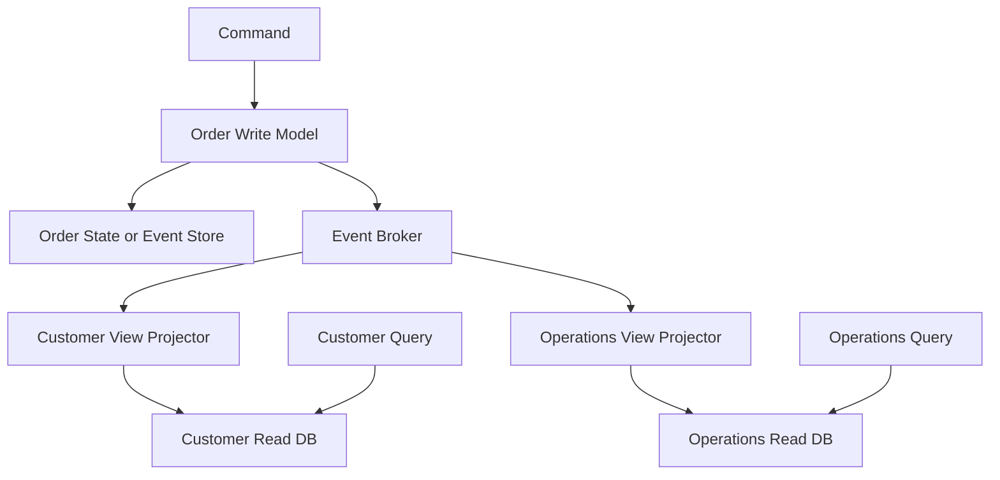
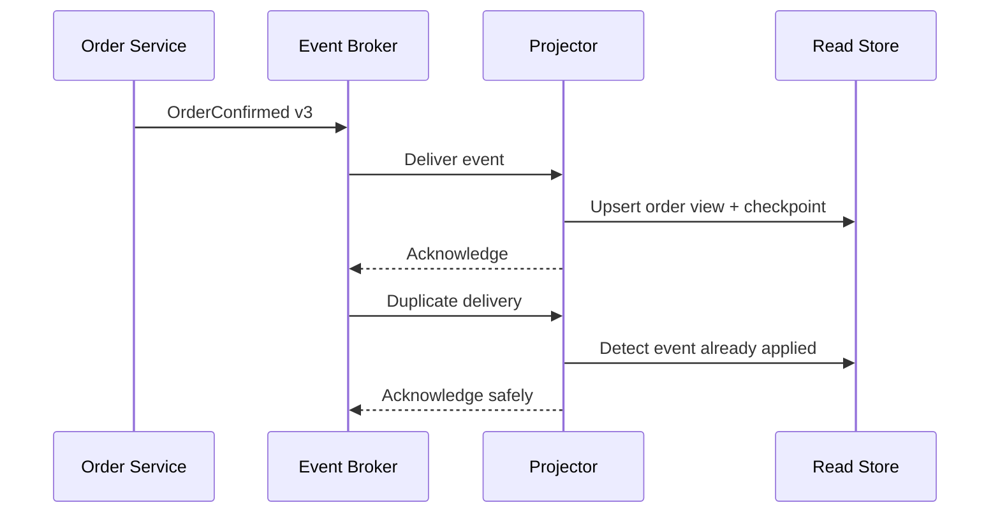
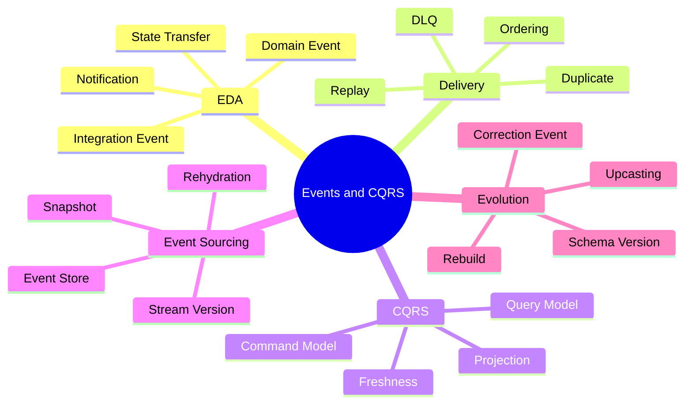

# Module 7 — Event-Driven Architecture, CQRS and Event Sourcing

## 1. Module Identity and Duration

| Item | Details |
|---|---|
| Course | Microservices Architecture In-Depth |
| Part | Part 4 — Event-Driven and Reliable Systems |
| Module | Module 7 — Event-Driven Architecture, CQRS and Event Sourcing |
| Duration | 1 Hour |
| Level | Intermediate to Advanced |
| Learning Ratio | 30% concepts and 70% modelling, demonstration and lab work |
| Case Study | Order Processing and Reporting Platform |

## 2. Learning Objectives

By the end of this module, participants will be able to:

1. Explain event-driven architecture and its principal styles.
2. Distinguish domain events from integration events.
3. Compare event notification and event-carried state transfer.
4. Design for delivery, ordering, duplication, replay and schema evolution.
5. Explain CQRS without incorrectly requiring Event Sourcing.
6. Build and rebuild a query projection.
7. Explain Event Sourcing and aggregate reconstruction.
8. Decide when CQRS or Event Sourcing is—and is not—justified.

## 3. What Are EDA, CQRS and Event Sourcing?

**Event-Driven Architecture (EDA)** enables components to publish facts about completed changes and allows other components to react independently.

**Command Query Responsibility Segregation (CQRS)** separates the model used to change state from the model used to answer queries when their responsibilities differ significantly.

**Event Sourcing** stores an ordered sequence of domain events as the authoritative history from which aggregate state is reconstructed.

These concepts can be combined, but they are not the same:

- EDA does not require CQRS.
- CQRS does not require Event Sourcing.
- Event Sourcing does not require every integration to be event-driven.

> **Memory line:** EDA distributes facts; CQRS separates write and read responsibilities; Event Sourcing stores history as truth.

## 4. Why These Patterns Matter

They may provide:

- Temporal decoupling
- Independent reactions to business facts
- Scalable asynchronous processing
- Query models optimized for specific views
- Complete change history
- Audit and temporal analysis
- Replay and projection rebuild
- Flexible downstream integration

They also introduce:

- Eventual consistency
- Duplicate and out-of-order delivery
- Schema evolution
- Projection lag
- Replay safety
- Increased storage and operational complexity
- Difficult event correction
- More demanding testing and observability

Use them because requirements justify them—not because “modern systems use events.”

## 5. Real-Life Analogy — Newspaper Publisher and Subscribers

A newspaper publishes a new edition.

- The publisher announces a completed fact: the edition is available.
- Homes, libraries and businesses subscribe independently.
- The publisher does not call each reader's internal process.
- A subscriber may receive the edition late or receive a replacement copy.
- An archive preserves old editions for historical reconstruction.

### Mapping

| Newspaper concept | Architecture concept |
|---|---|
| Published edition | Integration event |
| Publisher | Event producer |
| Distribution network | Broker/event stream |
| Subscriber | Event consumer |
| Delivery reference | Event ID/offset |
| Subscriber's index | Read projection |
| Newspaper archive | Event store |
| Rebuilding an index | Projection replay |

### Where the Analogy Stops

- Software events require machine-verifiable schemas.
- Duplicate delivery may repeat financial actions.
- Ordering may exist only within a partition or aggregate.
- Event history may contain sensitive information that cannot simply be deleted.

## 6. How It Works

### Event-Driven Flow

1. Order Service commits a business change and Outbox record.
2. An Outbox publisher sends `OrderCreated`.
3. The broker retains/routes the event.
4. Independent consumers process it.
5. Consumers store local effects idempotently.
6. Failures are retried or routed for recovery.

### CQRS Flow

1. A command reaches the write model.
2. The write model validates rules and commits state.
3. An event represents the accepted state transition.
4. A projector updates one or more read models.
5. Queries use optimized read models.
6. Freshness and projection position are observable.

### Event-Sourced Flow

1. Load events for an aggregate stream.
2. Rehydrate current state by applying events.
3. Evaluate a command using current state.
4. Produce new domain events.
5. Append events using expected stream version.
6. Publish integration events/projections reliably.

## 7. Core Concepts

### 7.1 Event

An event is an immutable statement that something meaningful happened. Use past-tense business names such as `OrderConfirmed`.

### 7.2 Domain Event

A domain event expresses a meaningful occurrence inside a bounded context. It may contain rich internal meaning and need not be exposed directly.

### 7.3 Integration Event

An integration event is a stable, intentionally published contract for other contexts. It should expose only required information and remain backward compatible.

### 7.4 Event Notification

The event announces a fact with minimal information, and consumers call the owner if additional current data is needed.

**Benefit:** Small events and authoritative reads.  
**Cost:** Runtime dependency and additional calls.

### 7.5 Event-Carried State Transfer

The event includes data consumers need to update local views.

**Benefit:** Autonomous consumers.  
**Cost:** Larger contracts, data duplication, privacy and staleness concerns.

### 7.6 Event Broker

A broker routes messages and provides buffering, delivery and operational controls. A topic commonly supports publish/subscribe; a queue commonly supports work distribution.

### 7.7 Event Stream

A retained ordered log allows consumers to track positions and replay records. Ordering guarantees are commonly scoped to a partition, not the complete system.

### 7.8 Partition Key

A key such as Order ID routes related events to one partition, supporting per-order ordering. Poor keys create hot partitions or lose required order.

### 7.9 Event Envelope

Recommended metadata includes:

- Event ID
- Event type
- Schema version
- Occurred-at timestamp
- Producer
- Aggregate/business ID
- Correlation ID
- Causation ID
- Trace context
- Payload

### 7.10 Idempotent Consumer

The consumer recognizes repeated delivery and preserves one business effect. Store event identity atomically with the projection or local transaction.

### 7.11 Ordering

Consumers should not assume global order. Use aggregate version, partition key and transition checks. Buffer, ignore or reconcile stale events based on business need.

### 7.12 Replay

Replay reprocesses retained events to rebuild a projection or correct consumer logic. Every replay must define:

- Start and end positions
- Target projection
- Side-effect suppression
- Version/upcasting behavior
- Validation and cutover

Never replay historical events into consumers that send emails, charge cards or call external systems unless side effects are explicitly controlled.

### 7.13 Dead-Letter Handling

After bounded retries, a permanently failing message is isolated with error context. DLQ is a holding area, not a completed resolution. Define triage, correction, replay and audit.

### 7.14 CQRS

CQRS separates change and read responsibilities. This may range from separate classes in one application to separate models, stores and scaling paths.

Use when:

- Write rules are complex.
- Read shapes differ significantly.
- Read and write scaling differ.
- Multiple projections serve different consumers.
- Eventual read consistency is acceptable.

Do not use it for simple CRUD without measurable benefit.

### 7.15 Command Model

The command/write model protects invariants and accepts or rejects state transitions.

### 7.16 Query Model

The query/read model is shaped for efficient retrieval and may denormalize data from several events or owners.

### 7.17 Projection

A projector consumes events and updates a read model. It requires checkpointing, idempotency, rebuild and freshness monitoring.

### 7.18 Event Sourcing

Event Sourcing stores domain events as the authoritative record instead of storing only current state.

Benefits may include:

- Complete audit history
- Temporal queries
- Aggregate reconstruction
- New projections from historical events
- Explicit domain transitions

Costs include:

- Event design and immutable history
- Schema evolution/upcasting
- Debugging unfamiliarity
- Storage growth
- Privacy/deletion complexity
- Projection operations

### 7.19 Event Store

An event store appends events to an aggregate stream. Expected-version checks prevent concurrent conflicting appends.

### 7.20 Snapshot

A snapshot stores aggregate state at a known stream version to reduce rehydration time. Events after that version are then applied. A snapshot is an optimization, not the source of truth.

### 7.21 Upcasting

Upcasting translates historical event representations into a form understood by current code without rewriting original facts.

### 7.22 Event Correction

Do not silently edit historical events. Append corrective events, protect sensitive values through suitable design, and follow legal requirements for data erasure.

## 8. Architecture Visualizations

### 8.1 Event-Driven CQRS

### 8.2 Projection Sequence

## 9. Separate Mind Map

## 10. Decision and Comparison Tables

### 10.1 EDA, CQRS and Event Sourcing

| Concept | Primary purpose | Requires the others? |
|---|---|---|
| EDA | Publish and react to facts | No |
| CQRS | Separate change and query responsibilities | No |
| Event Sourcing | Store event history as authoritative state | No, though often combined |

### 10.2 Event Notification vs State Transfer

| Dimension | Notification | Event-carried state transfer |
|---|---|---|
| Payload | Small | Contains consumer-useful data |
| Consumer autonomy | Lower | Higher |
| Additional owner calls | Often | Usually fewer |
| Data duplication | Lower | Higher |
| Privacy exposure | Lower | Must be carefully controlled |

### 10.3 CQRS Decision

| Signal | Simple shared model | CQRS may help |
|---|---|---|
| Business rules | Simple CRUD | Complex commands/invariants |
| Query shape | Similar to write model | Many specialized views |
| Scaling | Similar | Reads/writes differ greatly |
| Consistency | Immediate read required | Eventual read acceptable |
| Team maturity | Limited | Strong event/operational practices |

### 10.4 Event Sourcing Decision

| Question | Positive evidence |
|---|---|
| Is complete temporal history a core requirement? | Audit, reconstruction or temporal analysis |
| Are state transitions meaningful domain facts? | Rich behavior beyond CRUD |
| Is replay/new projection valuable? | Historical data must support new views |
| Can immutable-event evolution be operated? | Versioning, upcasting and tooling exist |
| Can privacy obligations be satisfied? | Sensitive-data strategy is proven |

## 11. Real-World Enterprise Scenario

### Situation

Operations needs a dashboard combining Order, Payment, Inventory and Shipping. The first solution performs synchronous fan-out on every refresh and becomes slow during provider outages.

### Improved Design

1. Each service publishes curated integration events through Outbox.
2. A projector builds an Operations Order View.
3. The read model contains the exact dashboard shape.
4. Event ID and aggregate version protect against duplicates and stale updates.
5. Projection position and freshness are monitored.
6. Retained events support rebuild.
7. External side effects are disabled during replay.

### CQRS Decision

CQRS is justified for this read use case because the query shape, throughput and availability differ significantly from write processing.

### Event Sourcing Decision

Event Sourcing is not automatically required. Current-state stores plus reliable integration events may meet the requirement. Adopt Event Sourcing only if authoritative temporal history and reconstruction create sufficient value.

## 12. Step-by-Step Hands-On Lab

### Lab Title

Build and Rebuild an Order Status Projection

### Business Problem

Create an operations view using `OrderCreated`, `InventoryReserved`, `PaymentCaptured`, `ShipmentCreated` and failure events.

### Required Tools

- Markdown editor
- Mermaid renderer
- Relational or document database
- Optional broker/event-stream platform

### Step 1 — Define Query Requirements

Specify columns, filters, freshness target and availability requirement.

### Step 2 — Define Event Contracts

Create envelopes and payloads with stable business meaning.

### Step 3 — Select Partition Key

Use Order ID and document the ordering scope.

### Step 4 — Design Projection Schema

Create an order-centric denormalized read model.

### Step 5 — Implement Idempotency

Store processed event ID or last aggregate version atomically with projection updates.

### Step 6 — Handle Out-of-Order Events

Define buffer, reject, defer or reconcile behavior.

### Step 7 — Store Checkpoint

Track broker offset/position and last-success timestamp.

### Step 8 — Simulate Duplicate Delivery

Verify that totals and status do not change twice.

### Step 9 — Simulate Projection Failure

Stop processing, create lag, recover and verify convergence.

### Step 10 — Rebuild Projection

Create a new projection store, replay events, validate counts and switch reads safely.

### Step 11 — Evaluate Event Sourcing

Complete the decision table and record an ADR.

## 13. Expected Lab Output

Participants must produce:

- Query requirement and freshness SLO
- Event catalogue and schemas
- Partition-key decision
- Projection schema
- Idempotency and ordering strategy
- Checkpoint design
- Duplicate-delivery evidence
- Replay and rebuild runbook
- CQRS decision
- Event Sourcing ADR

### Validation Criteria

- Events express completed business facts.
- Integration contracts do not expose internal persistence unnecessarily.
- Duplicate and out-of-order events are controlled.
- Projection lag is measurable.
- Replay cannot repeat external side effects.
- Rebuilt results reconcile with authoritative sources.
- CQRS and Event Sourcing are independently justified.

## 14. Failure Scenarios and Troubleshooting

| Symptom | Likely cause | Corrective action |
|---|---|---|
| Projection total doubles | Non-idempotent handler | Store event ID/version atomically |
| Status moves backward | Out-of-order event applied | Enforce aggregate version/transition rules |
| Projection remains stale | Consumer lag or poison event | Monitor checkpoint, recover and handle DLQ |
| Replay sends old emails | Side effects not isolated | Use replay-safe projectors and suppress integrations |
| One partition is overloaded | Hot partition key | Revisit partitioning while preserving needed order |
| New producer breaks consumers | Incompatible schema change | Restore compatibility and use additive evolution |
| Rebuild differs from production | Non-deterministic projector | Remove time/external dependencies and reconcile |
| Event contains excessive PII | State-transfer payload copied blindly | Minimize, tokenize or redesign contract |
| Aggregate load becomes slow | Very long event stream | Add verified snapshots and optimize rehydration |
| DLQ grows silently | No operational ownership | Alert, triage, repair and controlled replay |

## 15. Best Practices

- Publish business facts, not table-change noise.
- Separate internal domain events from stable integration contracts.
- Include identity, version, correlation and causation metadata.
- Make consumers idempotent.
- Define ordering scope explicitly.
- Monitor projection lag and freshness.
- Make projectors deterministic and replay-safe.
- Rebuild into a new store before cutover.
- Evolve schemas additively.
- Apply CQRS at the smallest justified scope.
- Treat Event Sourcing as a major storage decision.
- Provide DLQ ownership and replay procedures.

## 16. Anti-Patterns

### 16.1 Event Soup

Many poorly named events exist without ownership, semantics or workflow clarity.

### 16.2 Database Row as Event

Internal storage changes are published as public contracts.

### 16.3 CQRS Everywhere

Simple CRUD services receive separate models and infrastructure without benefit.

### 16.4 Event Sourcing by Default

Immutable event history is introduced without temporal or audit requirements.

### 16.5 Replay with Side Effects

Historical processing repeats emails, payments or external calls.

### 16.6 Global Ordering Assumption

Consumers assume all events have one total order across partitions.

### 16.7 DLQ as Permanent Storage

Failed messages are moved aside with no resolution process.

### 16.8 Mutable Event History

Historical facts are silently edited, damaging audit and reconstruction.

## 17. Security Considerations

Define:

- Producer and consumer identity
- Topic/stream permissions
- Schema validation
- Encryption in transit and at rest
- Sensitive-field minimization
- Tenant isolation
- Replay authorization
- Audit of administrative reprocessing
- Event retention and deletion strategy
- Integrity and tamper evidence where required
- Secret rotation
- Nonproduction data controls

Event retention can preserve sensitive data for long periods. Privacy and deletion requirements must be designed before adopting immutable event history.

## 18. Performance Considerations

Monitor:

- Producer throughput
- Broker latency
- Consumer lag
- Projection update latency
- Partition skew
- Event size
- Event-store stream length
- Aggregate rehydration time
- Snapshot frequency
- Replay throughput and duration
- Read-model query latency

Keep payloads purposeful, choose partition keys carefully, batch projection writes safely and scale consumers only within ordering constraints.

## 19. Interview Preparation

### Question 1 — Domain event versus integration event?

A domain event expresses an occurrence within a bounded context. An integration event is an intentionally published, stable contract for external consumers.

### Question 2 — What is CQRS?

CQRS separates change and query responsibilities when business rules, models or scaling needs differ. It does not inherently require separate services or Event Sourcing.

### Question 3 — What is Event Sourcing?

Event Sourcing stores an ordered event stream as authoritative history and reconstructs current aggregate state by applying those events.

### Question 4 — Does CQRS require Event Sourcing?

No. A conventional write database can publish events used to update separate query projections.

### Question 5 — How do you handle duplicates and ordering?

Use event IDs for idempotency, aggregate versions and partition keys for ordering scope, valid transition checks and reconciliation.

### Question 6 — How do you rebuild a projection safely?

Replay retained events into a new versioned store, suppress side effects, validate against authoritative totals and then switch traffic.

### Question 7 — What is a snapshot?

A snapshot is aggregate state at a known stream version used to accelerate rehydration. Events after that version remain authoritative.

### Question 8 — When should Event Sourcing be avoided?

Avoid it for simple CRUD or when the team cannot operate immutable history, schema evolution, replay, privacy and projection recovery reliably.

## 20. Quick Recap

- EDA, CQRS and Event Sourcing solve different problems.
- Events describe completed facts.
- Integration events require stable contracts.
- Consumers must handle duplicates and scoped ordering.
- CQRS separates write and read responsibilities only when useful.
- Event Sourcing makes event history authoritative.
- Replay requires deterministic, side-effect-safe processing.
- Projection lag, DLQ and rebuild need operational ownership.

## 21. Learning Outcome

The participant can design an event-driven integration, create a reliable CQRS projection, control duplicates, ordering and replay, and make an evidence-based decision about whether Event Sourcing is justified.

## 22. Twenty MCQs

### 1. What does an event represent?

A. A future request only  
B. A fact that has occurred  
C. A database password  
D. A UI component

**Answer:** B  
**Explanation:** Events communicate completed, meaningful occurrences.

### 2. Which event is correctly named?

A. `DoOrder`  
B. `CallPayment`  
C. `OrderConfirmed`  
D. `UpdateRow`

**Answer:** C  
**Explanation:** Past-tense business names express completed facts.

### 3. What distinguishes an integration event?

A. It is an intentionally published external contract  
B. It contains every database column  
C. It has no owner  
D. It is always synchronous

**Answer:** A  
**Explanation:** Integration events are stable contracts between contexts.

### 4. What does event-carried state transfer improve?

A. Consumer autonomy  
B. Global transactions  
C. Shared writes  
D. Password rotation

**Answer:** A  
**Explanation:** Consumers can update local views without calling the producer.

### 5. What is the cost of event-carried state transfer?

A. No data duplication  
B. Larger contracts and privacy exposure  
C. Guaranteed fresh data  
D. No schema evolution

**Answer:** B  
**Explanation:** More data is copied and must be governed.

### 6. What does CQRS separate?

A. UI and CSS  
B. Command and query responsibilities  
C. Network and disk  
D. Users and passwords

**Answer:** B  
**Explanation:** Write and read models can evolve for different needs.

### 7. Does CQRS require Event Sourcing?

A. Yes  
B. No  
C. Only with REST  
D. Only in Java

**Answer:** B  
**Explanation:** CQRS can use conventional persistence and events.

### 8. What is authoritative in Event Sourcing?

A. Current-state row only  
B. Ordered event history  
C. API Gateway  
D. Read cache

**Answer:** B  
**Explanation:** State is reconstructed from stored domain events.

### 9. What protects concurrent event appends?

A. Expected stream version  
B. UI token  
C. DNS cache  
D. DLQ only

**Answer:** A  
**Explanation:** Version comparison detects competing aggregate updates.

### 10. What is a projection?

A. A query-oriented view built from events  
B. A secret  
C. A reverse proxy  
D. A container image

**Answer:** A  
**Explanation:** A projector transforms event history into a read model.

### 11. What must a projector be?

A. Non-deterministic  
B. Idempotent and replay-safe  
C. A payment processor  
D. A shared writer

**Answer:** B  
**Explanation:** Duplicate delivery and rebuild must produce correct state.

### 12. What commonly determines event ordering scope?

A. Partition key  
B. File extension  
C. User colour  
D. Secret name

**Answer:** A  
**Explanation:** Related aggregate events should use a key supporting required order.

### 13. Why is global ordering dangerous to assume?

A. Brokers commonly guarantee order only within a partition  
B. Events have no time  
C. Consumers cannot read events  
D. Databases never order rows

**Answer:** A  
**Explanation:** Parallel partitions trade global order for scale.

### 14. What is a snapshot?

A. The only source of truth  
B. Rehydration optimization at a known version  
C. A mutable event  
D. A gateway route

**Answer:** B  
**Explanation:** It reduces the number of events applied during load.

### 15. What is upcasting?

A. Translating historical event representation for current code  
B. Deleting all old events  
C. Scaling a gateway  
D. Changing DNS

**Answer:** A  
**Explanation:** Upcasters preserve immutable history while supporting new models.

### 16. What should replay never do accidentally?

A. Rebuild a view  
B. Repeat external side effects  
C. Read retained events  
D. Validate totals

**Answer:** B  
**Explanation:** Old events must not resend emails or repeat financial actions.

### 17. What does projection lag measure?

A. Delay between source events and read-model application  
B. Source-code length  
C. Password age  
D. UI latency only

**Answer:** A  
**Explanation:** Lag shows read-model freshness.

### 18. What is a DLQ?

A. Final resolution automatically  
B. Isolation for messages requiring recovery  
C. A source database  
D. A user interface

**Answer:** B  
**Explanation:** Operational processes must still triage and resolve messages.

### 19. When is CQRS least justified?

A. Complex write rules and specialized reads  
B. Simple CRUD with identical read/write model  
C. Different scaling profiles  
D. Several projections

**Answer:** B  
**Explanation:** Extra models and infrastructure add little value for simple CRUD.

### 20. What is the safest adoption principle?

A. Use all three patterns everywhere  
B. Select each pattern independently from requirements  
C. Publish raw tables  
D. Assume global ordering

**Answer:** B  
**Explanation:** EDA, CQRS and Event Sourcing have separate benefits and costs.

## 23. Ten Subjective and Scenario-Based Questions

1. Explain the difference between domain and integration events.
2. Compare event notification and event-carried state transfer for customer data.
3. Design an event envelope for `OrderConfirmed`.
4. Explain how a consumer handles duplicate and out-of-order order events.
5. Design a CQRS projection for an operations dashboard.
6. Describe a safe projection rebuild and cutover.
7. Explain why CQRS does not require Event Sourcing.
8. Evaluate Event Sourcing for a bank ledger versus a simple product catalogue.
9. Design a snapshot and upcasting strategy for a long aggregate stream.
10. Explain privacy challenges created by immutable event history.

### Evaluation Guidance

Strong answers should:

- Separate the three patterns accurately
- Use stable business event semantics
- Define ordering and idempotency
- Include lag, replay, DLQ and recovery
- Justify complexity through business requirements
- Address security, privacy and schema evolution

## 24. Assignment

### Title

Event-Driven Order Operations and CQRS Projection

### Scenario

Operations needs a reliable dashboard combining Order, Inventory, Payment and Shipping. Current synchronous fan-out is slow and fails whenever a provider is unavailable. The team is also considering Event Sourcing for every service.

### Tasks

1. Define domain and integration events.
2. Select notification or event-carried state transfer per event.
3. Design event envelopes and compatibility rules.
4. Choose partition keys and ordering guarantees.
5. Design idempotent consumers.
6. Create a CQRS command and query model.
7. Design the operations projection schema.
8. Define checkpoint, lag and freshness monitoring.
9. Create DLQ triage and controlled replay procedures.
10. Design a new-store rebuild and cutover.
11. Evaluate Event Sourcing independently for Order and Payment.
12. Define snapshot/upcasting needs if selected.
13. Address security, privacy and retention.
14. Test duplicates, disorder, poison events and replay.

### Required Deliverables

- Event catalogue
- Event schemas and envelopes
- Partition and ordering decision
- Command/query responsibility map
- Projection schema
- Idempotency design
- Replay and rebuild runbook
- DLQ process
- CQRS ADR
- Event Sourcing ADR
- Security and privacy checklist

### Assessment Rubric

| Criterion | Weight |
|---|---:|
| Event semantics and contracts | 20% |
| Delivery, ordering and idempotency | 15% |
| CQRS and projection design | 20% |
| Replay and operational recovery | 15% |
| Event Sourcing judgment | 15% |
| Security and privacy | 10% |
| Visual and communication clarity | 5% |
| **Total** | **100%** |

## Final Memory Line

> Publish stable business facts, consume them idempotently, build read models only where they add value, and make event history authoritative only when its benefits justify its permanent complexity.
