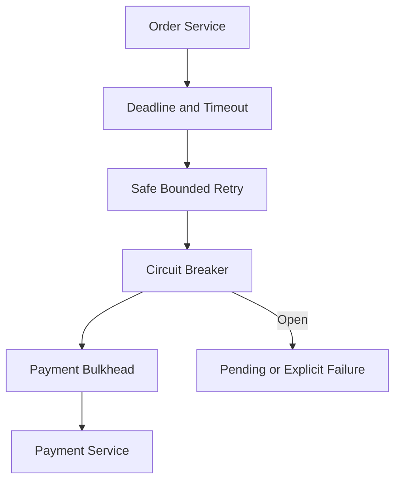
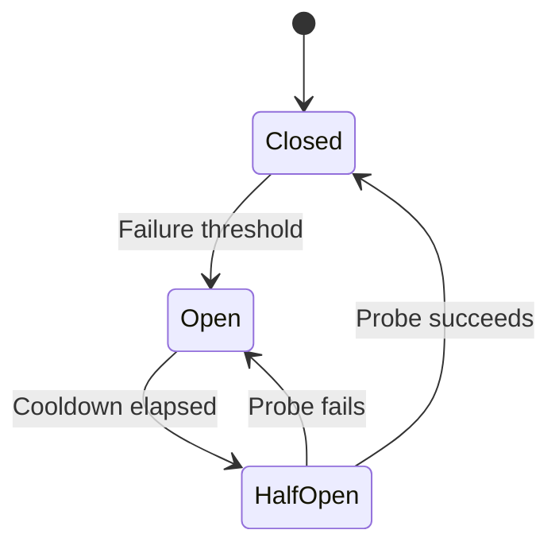
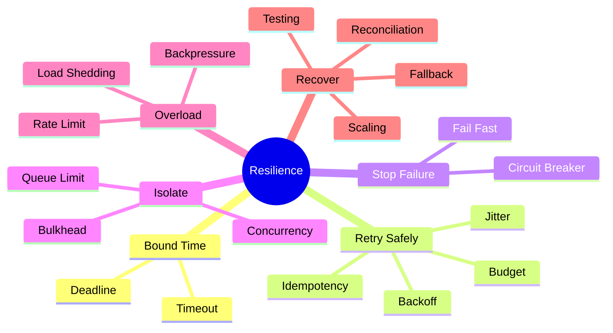

# Module 8 — Resilience, Fault Tolerance and Performance

## 1. Module Identity and Duration

| Item | Details |
|---|---|
| Course | Microservices Architecture In-Depth |
| Part | Part 4 — Event-Driven and Reliable Systems |
| Module | Module 8 — Resilience, Fault Tolerance and Performance |
| Duration | 1 Hour |
| Level | Intermediate to Advanced |
| Learning Ratio | 30% concepts and 70% failure modelling, configuration and lab work |
| Case Study | Order and Payment Processing Platform |

## 2. Learning Objectives

By the end of this module, participants will be able to:

1. Explain partial and cascading failure in distributed systems.
2. Define end-to-end deadlines and per-dependency timeouts.
3. Apply safe bounded retries with exponential backoff and jitter.
4. Design circuit-breaker and bulkhead policies.
5. Use rate limiting, load shedding and backpressure.
6. Design fallback and graceful degradation without hiding failure.
7. Evaluate caching and horizontal scaling safely.
8. Create resilience tests and measurable recovery objectives.

## 3. What Are Resilience and Fault Tolerance?

**Resilience** is the ability of a system to continue delivering acceptable business outcomes, degrade safely and recover when failures occur.

**Fault tolerance** is the ability to continue operating despite specific component failures, usually through redundancy, isolation and controlled recovery.

**Performance engineering** ensures the system meets latency, throughput and resource-efficiency targets under normal and stressed conditions.

Resilience is not “never failing.” It is knowing:

- What may fail
- How failure is detected
- Which functionality continues
- What is rejected or deferred
- How recovery happens
- How business impact is measured

> **Memory line:** Bound waiting, retry safely, stop repeated failure, isolate resources and degrade deliberately.

## 4. Why Resilience Design Matters

In microservices, a single user transaction may cross several networks and services. Even when every service is highly available, the combined journey can be less reliable because all required dependencies must succeed.

Without deliberate resilience:

- Threads wait indefinitely.
- Retries amplify overload.
- Connection pools become exhausted.
- One slow dependency consumes all resources.
- Cascading failures cross service boundaries.
- Users repeat uncertain actions.
- Duplicate financial effects occur.
- Recovery takes longer than the original incident.

Good resilience design protects the business journey rather than merely keeping processes alive.

## 5. Real-Life Analogies

### 5.1 Electrical Circuit Breaker

An electrical circuit breaker interrupts current when a circuit becomes unsafe. It prevents repeated damage and can later be reset after the condition improves.

| Electrical concept | Software concept |
|---|---|
| Excess current | Repeated dependency failures |
| Breaker opens | Calls fail fast |
| Protected wiring | Caller resources |
| Reset/test | Half-open probe |
| Normal operation | Closed circuit |

### 5.2 Watertight Compartments in a Ship

A ship is divided into sealed compartments. If one compartment floods, bulkheads limit water from spreading through the vessel.

| Ship concept | Software concept |
|---|---|
| Compartment | Isolated resource pool |
| Bulkhead wall | Concurrency/connection boundary |
| Flooding | Slow or failing dependency |
| Ship remains afloat | Other workloads remain available |

### Where the Analogies Stop

- Software thresholds require measurement and tuning.
- A dependency may be partially slow rather than fully failed.
- Retries can increase damage if poorly designed.
- Business correctness must still be preserved during degradation.

## 6. How Resilience Works

For every remote dependency:

`Deadline → Timeout → Retry? → Circuit Breaker → Bulkhead → Fallback? → Observe → Recover`

For every overloaded workload:

`Measure → Queue/Buffer → Backpressure → Rate Limit → Shed Load → Scale → Recover`

Typical request flow:

1. Caller receives an end-to-end deadline.
2. It allocates a smaller dependency timeout.
3. Only safe transient failures are retried.
4. Backoff and jitter spread retry load.
5. A circuit breaker opens when failure threshold is exceeded.
6. A bulkhead caps resources consumed by the dependency.
7. A safe fallback or explicit failure is returned.
8. Telemetry records technical and business impact.
9. Controlled probes determine recovery.

## 7. Core Concepts

### 7.1 Partial Failure

One component or network path can fail while the rest of the system remains available. The caller cannot always know whether the remote operation started, completed or failed.

### 7.2 Cascading Failure

A slow or unavailable dependency causes callers to wait, exhaust resources and fail, spreading the incident upstream and sideways.

### 7.3 Deadline

A deadline is the maximum time allowed for the complete operation. Each downstream call must fit within the remaining budget.

### 7.4 Timeout

A timeout limits waiting for connection, response, read or write activity. It must be based on latency objectives and dependency behavior—not arbitrary large defaults.

A timeout indicates uncertainty, not confirmed remote failure.

### 7.5 Retry

Retry repeats an operation after a transient failure.

Retry only when:

- The operation is idempotent or safely deduplicated.
- The error is likely transient.
- Time remains in the deadline.
- Additional load will not worsen the incident.
- Attempts are bounded.

### 7.6 Exponential Backoff

Delay increases between attempts, reducing immediate pressure on a recovering dependency.

Conceptually:

`delay = base × 2^attempt`

Apply a maximum cap.

### 7.7 Jitter

Jitter adds randomness to retry delay so many clients do not retry simultaneously. This reduces the thundering-herd effect.

### 7.8 Retry Budget

A retry budget limits additional retry traffic relative to normal traffic. It prevents retries from overwhelming useful requests.

### 7.9 Circuit Breaker

Common states:

- **Closed:** Calls flow; failures are measured.
- **Open:** Calls fail fast without reaching the unhealthy dependency.
- **Half-open:** Limited probes test recovery.

Circuit breakers protect caller resources; they do not repair the dependency.

### 7.10 Bulkhead

Bulkheads isolate capacity using separate:

- Thread pools
- Connection pools
- Queues
- Concurrency limits
- Worker groups
- Resource quotas

One workload cannot consume all shared resources.

### 7.11 Rate Limiting

Rate limiting restricts accepted request volume by user, tenant, route or client. Common algorithms include token bucket, leaky bucket, fixed window and sliding window.

### 7.12 Throttling

Throttling slows or rejects work to protect capacity or enforce policy. Responses should communicate retry expectations where appropriate.

### 7.13 Load Shedding

The system deliberately rejects lower-priority or excess work before resource exhaustion. Early controlled rejection is safer than universal collapse.

### 7.14 Backpressure

Backpressure signals producers to slow down when consumers cannot keep pace. It may use bounded queues, flow control, demand signals or rejection.

Unbounded queues hide overload until memory, storage or latency becomes unacceptable.

### 7.15 Fallback

A fallback provides an alternate response such as cached catalogue data. It must be:

- Business-safe
- Clearly bounded
- Observable
- Honest about staleness

Never fabricate payment or inventory success.

### 7.16 Graceful Degradation

The system preserves essential capabilities while temporarily reducing optional functionality.

Examples:

- Order checkout continues while recommendations are hidden.
- Notification is queued for later.
- Read-only catalogue uses a recent cache.
- Payment failure returns pending rather than false success.

### 7.17 Health Checks

- **Startup:** Initialization complete.
- **Readiness:** Safe to receive traffic.
- **Liveness:** Process can recover without restart.

### 7.18 Caching

Caching may reduce latency and dependency load. Define:

- Ownership
- Key
- Time to live
- Invalidation
- Staleness tolerance
- Failure behavior
- Stampede protection

Do not cache sensitive or correctness-critical data without explicit rules.

### 7.19 Horizontal Scaling

Adding service instances increases capacity only when bottlenecks are parallelizable. Database contention, hot partitions or serialized work may remain.

### 7.20 Autoscaling

Scale using signals aligned with workload:

- CPU/memory
- Request concurrency
- Queue depth
- Consumer lag
- Business workload

Autoscaling is not immediate; resilience must cover the time before new capacity becomes ready.

### 7.21 Availability Budget

An end-to-end journey inherits failure from required dependencies. Optional dependencies should not reduce critical-path availability unnecessarily.

### 7.22 Resilience Testing

Test realistic failures:

- Latency injection
- Connection reset
- Partial response
- Dependency outage
- Broker delay
- Resource exhaustion
- Instance termination
- Regional disruption

Validate business outcome, not only HTTP status.

## 8. Architecture Visualizations

### 8.1 Dependency Protection

### 8.2 Circuit-Breaker State

## 9. Separate Mind Map

## 10. Decision and Comparison Tables

### 10.1 Resilience Pattern Selection

| Problem | Primary pattern | Important caution |
|---|---|---|
| Remote call waits too long | Timeout/deadline | Timeout does not prove failure |
| Brief transient failure | Bounded retry | Operation must be duplicate-safe |
| Dependency repeatedly fails | Circuit breaker | Tune and observe half-open probes |
| One dependency consumes all capacity | Bulkhead | Size pools from measured load |
| Traffic exceeds capacity | Rate limit/load shedding | Prioritize critical work |
| Producer exceeds consumer speed | Backpressure/bounded queue | Avoid unbounded buffering |
| Optional dependency unavailable | Fallback/degradation | Never return false business success |

### 10.2 Retry Decision

| Condition | Retry? |
|---|---|
| Idempotent read with transient connection reset | Usually yes, bounded |
| Payment capture with no idempotency key | No |
| Validation error | No |
| Rate-limit response with `Retry-After` and budget | Possibly |
| Deadline already exhausted | No |
| Dependency overloaded | Usually reduce retries/load |

### 10.3 Circuit Breaker vs Bulkhead

| Dimension | Circuit breaker | Bulkhead |
|---|---|---|
| Purpose | Stop calls to unhealthy dependency | Limit resource blast radius |
| Trigger | Failure/latency threshold | Concurrency or capacity boundary |
| Result | Fail fast | Other workloads retain capacity |
| Repairs dependency? | No | No |

### 10.4 Fallback Safety

| Operation | Safe fallback example | Unsafe fallback |
|---|---|---|
| Product recommendations | Hide recommendations | Invent products |
| Catalogue view | Recent labelled cache | Claim stale price is guaranteed |
| Notification | Queue for later | Mark delivered without sending |
| Payment | Pending/explicit failure | Return successful charge without proof |
| Inventory | Unavailable/pending | Claim stock exists without authority |

## 11. Real-World Enterprise Scenario

### Situation

Payment Service becomes slow. Order Service waits 60 seconds and retries three times immediately. Hundreds of request threads and connections become blocked. Users retry checkout, creating more requests. Order, Gateway and unrelated catalogue traffic begin failing.

### Root Cause

- No end-to-end deadline
- Excessive timeout
- Immediate retry without jitter
- No idempotency guarantee
- Shared resource pool
- No circuit breaker
- No load shedding
- User outcome unclear

### Corrected Design

1. Set a business-aligned checkout deadline.
2. Allocate a smaller Payment timeout.
3. Use a stable payment idempotency key.
4. Retry only selected transient failures with backoff and jitter.
5. Limit retries with a budget.
6. Open a circuit on sustained failure/latency.
7. Isolate Payment calls in a bulkhead.
8. Return `PAYMENT_PENDING` for uncertain outcomes.
9. Reconcile payment-provider state.
10. Shed lower-priority work and protect catalogue capacity.

## 12. Step-by-Step Hands-On Lab

### Lab Title

Protect Order Service from Payment Failure

### Business Problem

Order Service calls a Payment dependency that may respond normally, slowly, fail transiently, reject payment or complete after timeout.

### Required Tools

- Markdown editor
- Mermaid renderer
- HTTP stub/fault-injection tool
- Metrics dashboard or log viewer
- Optional resilience library

### Step 1 — Define Service-Level Objectives

Set end-to-end latency, success and recovery targets.

### Step 2 — Create Latency Budget

Allocate time across gateway, Order, Payment and response processing.

### Step 3 — Classify Operations

Mark reads and writes as idempotent, deduplicated or unsafe to retry.

### Step 4 — Configure Timeout

Set connection and response timeouts within the deadline.

### Step 5 — Configure Retry

Select transient errors, attempt limit, backoff, jitter and total budget.

### Step 6 — Configure Circuit Breaker

Define sample window, failure threshold, open duration and half-open probes.

### Step 7 — Configure Bulkhead

Limit Payment concurrency and queue size separately from other dependencies.

### Step 8 — Define Fallback

Return explicit pending/failure status without inventing success.

### Step 9 — Add Observability

Record attempts, timeouts, circuit state, bulkhead rejection and business outcome.

### Step 10 — Inject Failures

Test:

1. Normal response
2. Transient connection failure
3. Slow response
4. Sustained outage
5. Late payment success
6. Traffic spike

### Step 11 — Verify Recovery

Confirm half-open probes, circuit closure, queue drain and payment reconciliation.

## 13. Expected Lab Output

Participants must produce:

- SLO and latency-budget table
- Operation retry-safety matrix
- Timeout configuration
- Retry/backoff/jitter policy
- Circuit-breaker state and thresholds
- Bulkhead capacity design
- Fallback decision table
- Failure-injection results
- Metrics and alert specification
- Recovery and reconciliation evidence

### Validation Criteria

- Total retries remain within the business deadline.
- Payment operations are duplicate-safe.
- Sustained failure opens the circuit.
- Payment slowdown does not exhaust unrelated capacity.
- Fallback communicates truthful business state.
- Recovery is automatic where safe and observable.
- Late outcomes are reconciled.

## 14. Failure Scenarios and Troubleshooting

| Symptom | Likely cause | Corrective action |
|---|---|---|
| CPU/network spikes during outage | Retry storm | Reduce attempts, add backoff/jitter and retry budget |
| All request threads blocked | Missing timeout/bulkhead | Bound waits and isolate concurrency |
| Circuit never opens | Wrong threshold or failure classification | Inspect metrics and configure slow-call failures |
| Circuit never closes | Dependency still unhealthy or probes fail | Verify recovery path and half-open settings |
| Duplicate charge | Unsafe retry | Add idempotency key and unknown-outcome handling |
| Queue latency grows indefinitely | Unbounded buffering | Bound queue, apply backpressure and shed load |
| Cache causes incorrect price | Undefined staleness/invalidation | Define TTL, ownership and validation |
| Autoscaling does not help | Bottleneck is database/hot partition | Measure and remove actual constraint |
| Health check causes restart loop | Liveness depends on temporary downstream | Separate liveness and readiness |
| Fallback hides outage | Success returned for uncertain action | Return degraded/pending status and alert |

## 15. Best Practices

- Start with business SLOs and end-to-end deadlines.
- Configure every remote call with bounded waiting.
- Retry only transient, duplicate-safe operations.
- Use exponential backoff, jitter and a retry budget.
- Keep circuit-breaker policy specific to a dependency and operation class.
- Isolate critical dependencies and workload classes.
- Bound every queue and resource pool.
- Shed excess load before total collapse.
- Make degradation truthful and observable.
- Use readiness to stop traffic and draining for shutdown.
- Scale using workload-appropriate signals.
- Test late success, duplicate delivery and recovery—not only outage.

## 16. Anti-Patterns

### 16.1 Retry Storm

Many callers retry immediately and multiply pressure on an unhealthy dependency.

### 16.2 Infinite Timeout

Resources remain blocked indefinitely and spread failure.

### 16.3 Timeout Equals Failure

The caller assumes the remote side performed no action and repeats an unsafe command.

### 16.4 Shared Resource Pool

One slow dependency consumes all threads or connections.

### 16.5 Unbounded Queue

Overload is converted into memory growth and extreme latency.

### 16.6 Fake Fallback

The system returns business success without authoritative confirmation.

### 16.7 Circuit Breaker Everywhere

Breakers are added without measured failure modes or meaningful policy.

### 16.8 Autoscaling as Universal Fix

More instances are added while the true bottleneck remains shared or serialized.

## 17. Security Considerations

Resilience controls must not bypass security.

Define:

- Authentication and authorization during retry
- Idempotency-key scope and unpredictability
- Rate limiting by tenant/user/client
- Protection against resource-exhaustion attacks
- Cache isolation and sensitive-data policy
- Fallback authorization
- Administrative circuit/limit controls
- Audit of manual overrides
- Secure health endpoints
- Secret rotation during degraded operation

Attack traffic and legitimate spikes may look similar. Rate and load policy must preserve fairness and critical business operations.

## 18. Performance Considerations

Monitor:

- P50, P95 and P99 latency
- Throughput
- Error and timeout rate
- Retry amplification factor
- Circuit state and rejected calls
- Bulkhead concurrency and rejection
- Queue depth and age
- Cache hit rate and staleness
- Saturation of CPU, memory, threads and connections
- Autoscaling delay
- Business transaction success rate

Use load, stress, spike, soak and failure tests. Tail latency matters because one slow dependency can dominate the whole journey.

## 19. Interview Preparation

### Question 1 — Timeout versus circuit breaker?

A timeout bounds one call's waiting time. A circuit breaker uses recent failures or latency to stop repeated calls to an unhealthy dependency.

### Question 2 — Why use jitter with retries?

Jitter prevents many clients from retrying at the same moment and creating a thundering herd.

### Question 3 — What is a bulkhead?

A bulkhead isolates resource capacity so one failing dependency or workload cannot consume everything.

### Question 4 — When should a request be retried?

Only for likely transient errors when the operation is idempotent/deduplicated, deadline remains and additional load will not worsen failure.

### Question 5 — What is backpressure?

It is a mechanism that slows or rejects producers when consumers cannot keep pace, preventing unbounded backlog.

### Question 6 — What is graceful degradation?

It preserves essential business functionality while reducing optional capabilities and communicating truthful status.

### Question 7 — Why may autoscaling fail to solve overload?

The bottleneck may be a shared database, external provider, hot partition or serialized operation. New instances also take time to become ready.

### Question 8 — How do you test resilience?

Inject realistic latency, failures, termination and overload; verify technical controls, business outcomes, observability and recovery against SLOs.

## 20. Quick Recap

- Distributed systems experience partial and cascading failure.
- Bound all waiting with deadlines and timeouts.
- Retry only safe transient failures with backoff, jitter and budget.
- Circuit breakers fail fast; bulkheads isolate resources.
- Rate limiting, backpressure and load shedding control overload.
- Fallbacks must never fabricate business success.
- Caches and scaling need explicit correctness and bottleneck analysis.
- Resilience requires failure testing and measurable recovery.

## 21. Learning Outcome

The participant can create an end-to-end resilience policy, prevent retry storms and resource exhaustion, design safe degradation and scaling, and prove recovery through observable failure testing.

## 22. Twenty MCQs

### 1. What does a timeout indicate?

A. Confirmed remote failure  
B. Outcome was not received within the limit  
C. Automatic rollback  
D. Successful completion

**Answer:** B  
**Explanation:** The remote operation may still have completed or be running.

### 2. When is retry safest?

A. For any permanent error  
B. For a transient error on an idempotent operation  
C. After the deadline  
D. Without attempt limits

**Answer:** B  
**Explanation:** Retry needs both probable recovery and duplicate safety.

### 3. Why use exponential backoff?

A. Increase immediate load  
B. Give a dependency time to recover  
C. Guarantee ordering  
D. Replace idempotency

**Answer:** B  
**Explanation:** Increasing delay reduces pressure during recovery.

### 4. Why add jitter?

A. Synchronize clients  
B. Spread retry attempts over time  
C. Remove timeouts  
D. Increase queue size

**Answer:** B  
**Explanation:** Randomness reduces simultaneous retry waves.

### 5. What does an open circuit do?

A. Sends every call  
B. Fails calls quickly without reaching dependency  
C. Restarts database  
D. Increases retries

**Answer:** B  
**Explanation:** It protects caller resources during sustained failure.

### 6. What is half-open state for?

A. Unlimited production traffic  
B. Limited probes of dependency recovery  
C. Disabling telemetry  
D. Deleting failures

**Answer:** B  
**Explanation:** Controlled test calls determine whether to close or reopen.

### 7. What does a bulkhead protect?

A. One workload's resources from another's failure  
B. Event schemas  
C. UI design  
D. Database names

**Answer:** A  
**Explanation:** Separate pools limit failure propagation.

### 8. What is load shedding?

A. Accept all work  
B. Deliberately reject excess/low-priority work  
C. Remove monitoring  
D. Increase payload size

**Answer:** B  
**Explanation:** Controlled rejection protects essential capacity.

### 9. What is backpressure?

A. Signal producers to slow when consumers cannot keep up  
B. A database backup  
C. An authentication method  
D. A UI refresh

**Answer:** A  
**Explanation:** It prevents unbounded accumulation.

### 10. Which fallback is unsafe?

A. Hide recommendations  
B. Queue notification  
C. Return payment success without confirmation  
D. Label cached catalogue data

**Answer:** C  
**Explanation:** A fallback must not invent a financial outcome.

### 11. What is a retry budget?

A. Limit on added retry traffic  
B. Cloud invoice only  
C. Database size  
D. Number of developers

**Answer:** A  
**Explanation:** It prevents retries from dominating useful work.

### 12. Why are unbounded queues dangerous?

A. They remove latency  
B. They hide overload until resources or delay become extreme  
C. They guarantee recovery  
D. They prevent messages

**Answer:** B  
**Explanation:** Backlog must be bounded and observable.

### 13. What should readiness control?

A. Whether an instance receives traffic  
B. Source-code version  
C. Password length  
D. User interface

**Answer:** A  
**Explanation:** Unready instances should be removed from routing.

### 14. What should liveness control?

A. Whether an unrecoverable process is restarted  
B. Whether a dependency is temporarily slow  
C. Feature pricing  
D. Event naming

**Answer:** A  
**Explanation:** Temporary downstream failure should not necessarily restart a healthy process.

### 15. Which metric reveals retry amplification?

A. Attempts divided by original requests  
B. Number of diagrams  
C. File length  
D. Colour count

**Answer:** A  
**Explanation:** The ratio shows load created by retries.

### 16. Why can caching be unsafe?

A. Data may be stale or incorrectly shared  
B. It never improves latency  
C. It always deletes data  
D. It prevents scaling

**Answer:** A  
**Explanation:** TTL, invalidation, ownership and tenant isolation are required.

### 17. Which signal suits queue-worker autoscaling?

A. Queue depth/age or consumer lag  
B. UI font size  
C. Repository name  
D. Token length

**Answer:** A  
**Explanation:** Scale should align with outstanding workload.

### 18. What is cascading failure?

A. Failure spreads through dependent resource exhaustion  
B. One isolated error only  
C. Successful replay  
D. A deployment strategy

**Answer:** A  
**Explanation:** Upstream callers fail as slow dependencies consume capacity.

### 19. What should resilience testing validate?

A. Only HTTP status  
B. Business outcome, controls and recovery  
C. Only container count  
D. Only source formatting

**Answer:** B  
**Explanation:** Technical survival is insufficient if business state is wrong.

### 20. What is the best resilience sequence?

A. Wait forever and retry forever  
B. Bound, retry safely, isolate, degrade and recover  
C. Scale without measuring  
D. Hide all failures

**Answer:** B  
**Explanation:** Controlled resource use and truthful recovery protect the system.

## 23. Ten Subjective and Scenario-Based Questions

1. Explain how a slow Payment Service can cause cascading failure.
2. Design an end-to-end deadline and timeout budget for checkout.
3. Decide which failures should be retried and justify each decision.
4. Configure conceptually a circuit breaker for a high-latency dependency.
5. Design bulkheads for Payment, Notification and Catalogue calls.
6. Explain retry amplification and how a retry budget controls it.
7. Design truthful graceful degradation for an e-commerce checkout.
8. Explain when caching improves resilience and when it risks correctness.
9. Analyze why CPU-based autoscaling may not solve a queue backlog.
10. Create a resilience-test plan including late success and recovery.

### Evaluation Guidance

Strong answers should:

- Begin with business SLOs
- Treat timeout as uncertainty
- Require duplicate safety before retry
- Bound time, attempts, queues and concurrency
- Protect critical work through isolation
- Include observability, recovery and reconciliation

## 24. Assignment

### Title

Resilience Blueprint for the Order-to-Payment Journey

### Scenario

Checkout depends on Inventory, Payment, Tax, Loyalty and Notification. Payment sometimes becomes slow, Notification experiences outages and campaign traffic creates five-times normal load. The system currently has long default timeouts and immediate retries.

### Tasks

1. Define business SLOs and critical/optional dependencies.
2. Create an end-to-end latency budget.
3. Classify operations by retry safety.
4. Define timeout, retry, backoff, jitter and budgets.
5. Design circuit-breaker policies.
6. Design dependency and workload bulkheads.
7. Define rate limits, load shedding and backpressure.
8. Create safe fallback and degradation behavior.
9. Define cache rules and stampede protection.
10. Select autoscaling signals.
11. Define technical and business metrics and alerts.
12. Build a failure-injection matrix.
13. Test sustained outage, spike and recovery.
14. Document late-outcome reconciliation.

### Required Deliverables

- SLO and dependency classification
- Latency-budget table
- Retry-safety matrix
- Resilience-policy matrix
- Circuit and bulkhead design
- Overload-control plan
- Fallback table
- Scaling decision
- Observability dashboard
- Failure-test and recovery evidence

### Assessment Rubric

| Criterion | Weight |
|---|---:|
| SLO and latency design | 15% |
| Retry and timeout safety | 20% |
| Circuit breaker and bulkhead | 15% |
| Overload and degradation | 15% |
| Performance and scaling | 10% |
| Testing and recovery | 15% |
| Security and communication clarity | 10% |
| **Total** | **100%** |

## Final Memory Line

> Resilience means protecting the business journey: bound every wait, repeat only what is safe, stop repeated failure, isolate scarce resources, reject overload early and prove recovery under realistic faults.
