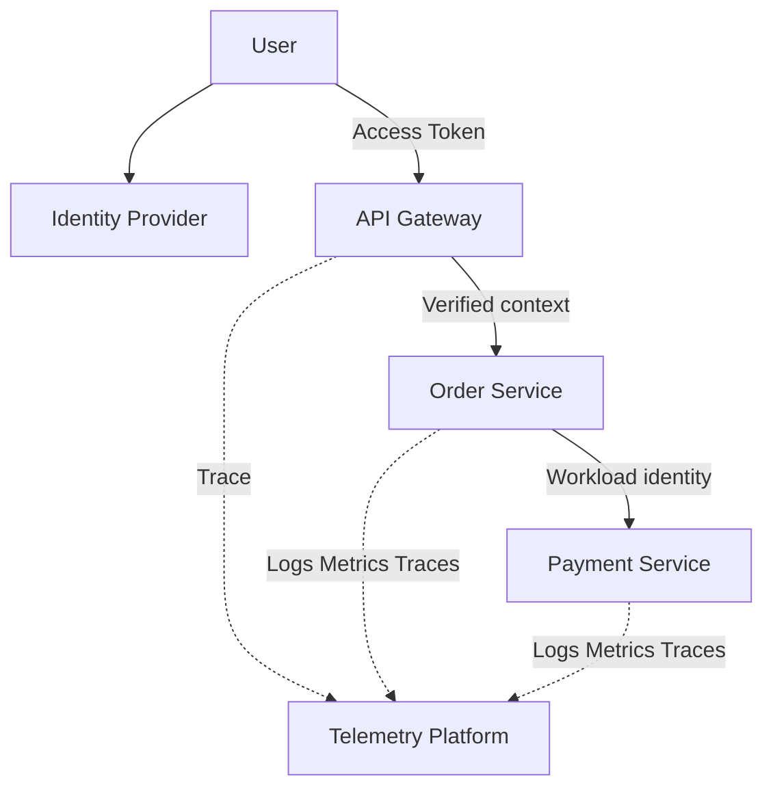
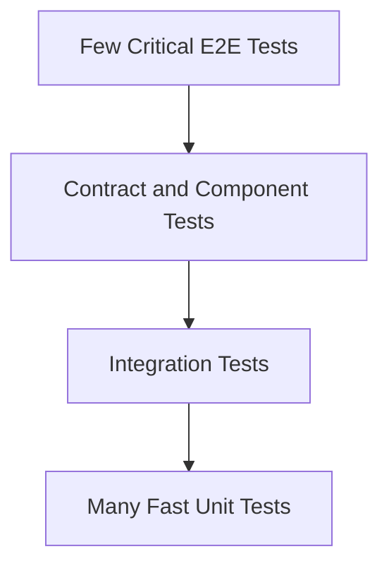
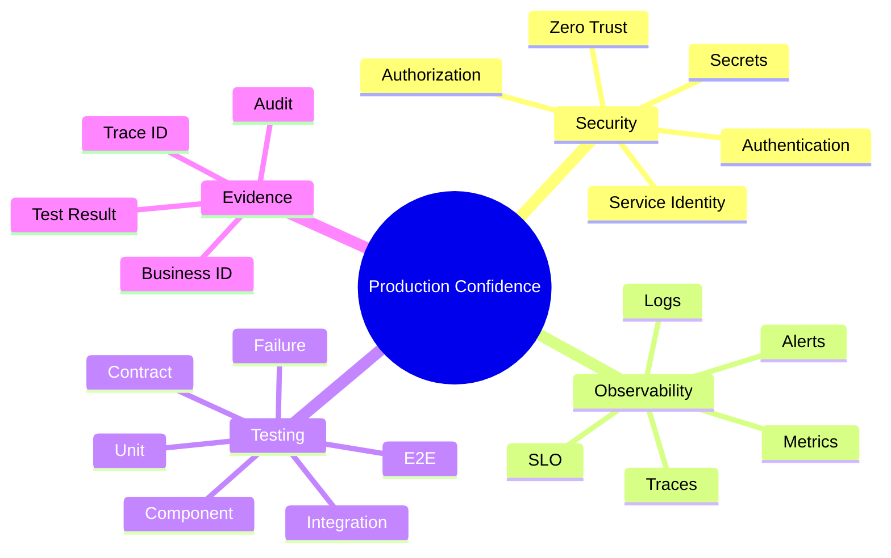

# Module 9 — Security, Observability and Testing

## 1. Module Identity and Duration

| Item | Details |
|---|---|
| Course | Microservices Architecture In-Depth |
| Part | Part 5 — Production Readiness |
| Module | Module 9 — Security, Observability and Testing |
| Duration | 1 Hour |
| Level | Intermediate to Advanced |
| Learning Ratio | 30% concepts and 70% threat modelling, telemetry and test-design work |
| Case Study | Order and Payment Processing Platform |

## 2. Learning Objectives

By the end of this module, participants will be able to:

1. Apply Zero-Trust principles across service boundaries.
2. Distinguish authentication, authorization and service identity.
3. Position OAuth 2.0, OpenID Connect, JWT and mTLS correctly.
4. Protect secrets, sensitive data and audit trails.
5. Correlate logs, metrics and traces with business transactions.
6. Define SLIs, SLOs, alerts and diagnostic context.
7. Design a balanced microservices testing strategy.
8. Use contract, integration, E2E, security and failure testing appropriately.

## 3. What Are Security, Observability and Testing?

**Security** protects identities, services, data and business operations from unauthorized access, misuse and compromise.

**Observability** is the ability to understand a system's internal state and business behavior from the telemetry it produces.

**Testing** provides evidence that components, contracts and complete workflows behave correctly under expected, edge and failure conditions.

These concerns reinforce one another:

- Security controls must be testable and observable.
- Telemetry must not leak sensitive data.
- Tests must validate business outcomes, authorization and recovery.
- Incident investigation requires trustworthy audit and trace evidence.

> **Memory line:** Verify every identity, observe every important journey and test every risky boundary.

## 4. Why These Capabilities Matter

Microservices increase:

- Network entry points
- Service identities
- Authorization decisions
- Secrets and certificates
- Logs and event copies
- Deployment combinations
- Contract versions
- Partial-failure paths

Without integrated controls:

- Internal calls may be trusted incorrectly.
- Users may access another tenant's data.
- Secrets may leak through configuration or logs.
- Incidents cannot be traced across services.
- CI may pass while the business journey fails.
- E2E tests become slow and unreliable.
- Breaking contract changes reach production.

Production readiness requires security, observability and testing by design—not as final-stage add-ons.

## 5. Real-Life Analogy — Airport Security and Control Tower

An airport combines security checkpoints with continuous operational monitoring.

- A passenger proves identity.
- A boarding pass authorizes a particular flight, not every aircraft.
- Staff have role-specific access.
- Baggage and passenger movement are tracked.
- The control tower observes flights, routes, delays and unsafe conditions.
- Drills verify emergency procedures before a real incident.

### Mapping

| Airport concept | Microservices concept |
|---|---|
| Identity document | Authentication credential |
| Boarding pass | Scoped authorization/token |
| Staff badge | Workload/service identity |
| Restricted zone | Protected resource/service |
| Flight identifier | Trace/correlation ID |
| Control tower | Observability platform |
| Flight record | Audit log |
| Emergency drill | Failure/security test |

### Where the Analogy Stops

- Tokens and service credentials can be copied or replayed.
- Telemetry is sampled, delayed and sometimes incomplete.
- A successful technical request may still produce a wrong business outcome.
- Distributed tests must control unstable dependencies and data.

## 6. How It Works

### Security Flow

1. A trusted identity provider authenticates the user.
2. The client obtains a scoped token.
3. The gateway validates issuer, audience, signature and expiry.
4. Verified identity context reaches the target service.
5. The service authorizes the operation and resource.
6. Service identity protects downstream calls.
7. Sensitive actions generate audit evidence.

### Observability Flow

1. A request receives or propagates trace context.
2. Each service creates spans around meaningful operations.
3. Structured logs include trace and business identifiers.
4. Metrics aggregate service and business behavior.
5. Telemetry is exported through controlled pipelines.
6. Dashboards and alerts evaluate SLOs.
7. Engineers drill from alert to trace to relevant logs.

### Testing Flow

1. Unit tests protect local logic.
2. Component tests validate a service boundary.
3. Contract tests protect producer-consumer compatibility.
4. Integration tests validate real infrastructure adapters.
5. A small E2E suite validates critical business journeys.
6. Security, performance and failure tests validate production risks.

## 7. Core Concepts

### 7.1 Zero Trust

Zero Trust assumes network location alone does not establish trust. Every access is evaluated using verified identity, authorization, context and least privilege.

### 7.2 Authentication

Authentication answers: **Who or what is making the request?**

### 7.3 Authorization

Authorization answers: **May this identity perform this operation on this resource?**

Authorization must be enforced by the service that owns the business resource. Gateway validation alone is insufficient.

### 7.4 OAuth 2.0

OAuth 2.0 is an authorization framework for delegated access. It defines roles and token flows; it is not itself a user-authentication protocol.

### 7.5 OpenID Connect

OpenID Connect adds an identity layer over OAuth 2.0 and supports user authentication through an ID token and standardized endpoints.

### 7.6 JWT

A JWT is a token format. Validate:

- Signature and approved algorithm
- Issuer
- Audience
- Expiration and not-before time
- Required claims
- Key rotation behavior

Do not place unnecessary sensitive data in a bearer token.

### 7.7 Service Identity

Workloads require verifiable identities for service-to-service calls. Options include short-lived workload credentials and certificates. Avoid shared long-lived credentials.

### 7.8 mTLS

Mutual TLS authenticates both ends of a connection and encrypts traffic. It supports workload identity at the transport layer but does not replace business authorization.

### 7.9 Least Privilege

Grant only the operations, topics, data and environments required. Separate read, write, publish and consume permissions.

### 7.10 Secrets Management

Secrets must be stored, accessed, rotated and audited through a dedicated mechanism. They must not appear in source code, images, logs or error responses.

### 7.11 Threat Modelling

Identify:

- Assets
- Actors
- Trust boundaries
- Entry points
- Threats
- Existing controls
- Residual risk

STRIDE can structure analysis: spoofing, tampering, repudiation, information disclosure, denial of service and elevation of privilege.

### 7.12 Structured Logging

Logs should use consistent fields rather than unstructured messages.

Recommended fields:

- Timestamp
- Severity
- Service and version
- Environment
- Trace and span ID
- Correlation ID
- Business transaction ID
- Event/error code
- Outcome and duration

Never log credentials, full tokens, payment details or unnecessary personal data.

### 7.13 Metrics

Use technical and business metrics.

Technical signals:

- Rate
- Errors
- Duration
- Saturation

Business signals:

- Order-confirmation rate
- Payment-success rate
- Saga completion time
- Refund backlog
- Projection freshness

### 7.14 Distributed Tracing

A trace represents one distributed operation. Spans represent individual steps. Propagate standard trace context through HTTP and messaging.

### 7.15 OpenTelemetry

OpenTelemetry provides vendor-neutral APIs, SDKs and protocols for traces, metrics and logs. It standardizes instrumentation and export, while the selected backend stores and analyzes telemetry.

### 7.16 Correlation Identifiers

- **Trace ID:** Technical request trace.
- **Span ID:** One operation within a trace.
- **Correlation ID:** Related activity grouping.
- **Business ID:** Order, payment or Saga identity.
- **Message ID:** Delivery identity.
- **Causation ID:** Prior action that caused an event.

### 7.17 SLI, SLO and SLA

- **SLI:** Measured indicator, such as successful checkout ratio.
- **SLO:** Internal target for the SLI.
- **SLA:** External commitment with defined consequences.

### 7.18 Alerting

Alerts should indicate actionable risk or user impact. Prefer symptoms and SLO burn over noisy infrastructure thresholds alone.

### 7.19 Unit Testing

Validates small logic units quickly. It is ideal for domain rules and edge cases.

### 7.20 Component Testing

Runs one service as a complete component with controlled external dependencies. It validates APIs, persistence and application flow without the full environment.

### 7.21 Integration Testing

Validates real infrastructure boundaries such as database, broker or identity integration. Use production-like versions and deterministic data.

### 7.22 Consumer-Driven Contract Testing

Consumers express required interactions; providers verify compatibility. This gives fast evidence that independent changes do not break known consumers.

Contract tests complement, not replace, semantic governance and selected E2E tests.

### 7.23 End-to-End Testing

E2E tests validate complete critical journeys through deployed services. Keep the suite small because it is slower, harder to diagnose and more environmentally sensitive.

### 7.24 Security Testing

Include:

- Static analysis
- Dependency and image scanning
- Secret scanning
- Dynamic API security testing
- Authentication/authorization tests
- Tenant-isolation tests
- Threat-based abuse tests

### 7.25 Failure and Chaos Testing

Inject controlled latency, errors, instance loss and dependency outage. Define steady state, blast radius, abort conditions and recovery evidence.

## 8. Architecture Visualizations

### 8.1 Security and Telemetry Path

### 8.2 Test Layers

## 9. Separate Mind Map

## 10. Decision and Comparison Tables

### 10.1 Authentication vs Authorization

| Question | Authentication | Authorization |
|---|---|---|
| Purpose | Verify identity | Permit operation/resource access |
| Example | Validate user token | Can user cancel this order? |
| Typical location | Identity provider/gateway/service | Owning service |
| Failure | 401 commonly | 403 commonly |

### 10.2 Logs vs Metrics vs Traces

| Signal | Best for | Example |
|---|---|---|
| Logs | Detailed event/context | Payment provider returned code X |
| Metrics | Aggregation, trends and alerts | Payment failure rate |
| Traces | End-to-end dependency path | Checkout latency across services |

### 10.3 Testing Layer Selection

| Need | Test type |
|---|---|
| Business rule edge cases | Unit |
| Whole service API and persistence | Component |
| Real broker/database behavior | Integration |
| Producer-consumer compatibility | Contract |
| Critical deployed business journey | E2E |
| Unauthorized access and abuse | Security |
| Behavior during dependency outage | Failure/chaos |

### 10.4 Test Pyramid for Microservices

| Layer | Quantity | Speed | Diagnostic value |
|---|---:|---|---|
| Unit | High | Very fast | High/local |
| Component | High to medium | Fast | High/service |
| Contract | Medium | Fast | High/boundary |
| Integration | Targeted | Medium | Infrastructure-specific |
| E2E | Small | Slow | Broad but harder to isolate |

## 11. Real-World Enterprise Scenario

### Situation

A customer reports a duplicate charge. Gateway logs show `200`, Order logs contain no shared identifier, Payment logs expose the last four card digits, and traces stop at the message broker. CI passed because only unit and E2E happy-path tests exist.

### Problems

- Business success was inferred from gateway status.
- Trace/message context was not propagated.
- Sensitive data entered logs.
- No idempotency failure test existed.
- E2E coverage missed a timeout-after-commit path.
- No payment reconciliation alert existed.

### Corrected Design

1. Redact sensitive data and rotate anything exposed.
2. Propagate trace, message, causation and Payment IDs.
3. Record structured outcome codes.
4. Add consumer contract and component tests.
5. Test timeout after provider success and duplicate command delivery.
6. Alert on duplicate-prevention conflicts and orphan payment state.
7. Reconcile Payment and Saga records.
8. Use SLOs based on confirmed business outcomes.

## 12. Step-by-Step Hands-On Lab

### Lab Title

Trace, Secure and Test One Order Journey

### Business Problem

An order passes through Gateway, Order, Inventory and Payment and then publishes an event. The team must prove identity, traceability and correctness under failure.

### Required Tools

- Markdown editor
- Mermaid renderer
- API client
- OpenTelemetry-compatible instrumentation or trace mock
- Test framework and service stubs

### Step 1 — Draw Trust Boundaries

Identify user, gateway, services, broker, database and telemetry boundaries.

### Step 2 — Define Identity Flow

Specify user token validation and workload identity for downstream calls.

### Step 3 — Define Authorization

Create tests for owner, non-owner, support role and service identity.

### Step 4 — Create Correlation Standard

Define trace, span, correlation, message and business identifiers.

### Step 5 — Define Structured Logs

Create safe fields and redaction rules.

### Step 6 — Define Metrics and SLO

Measure request rate, errors, latency, saturation and order-confirmation success.

### Step 7 — Instrument Trace

Create spans for Gateway, Order, Inventory, Payment and event publication.

### Step 8 — Design Test Portfolio

Add unit, component, integration, contract and E2E cases.

### Step 9 — Inject Failure

Test Payment timeout after provider success and duplicate message delivery.

### Step 10 — Verify Evidence

Use one Order ID to locate trace, logs, metrics and test outcome.

## 13. Expected Lab Output

Participants must produce:

- Trust-boundary diagram
- Identity and authorization matrix
- Secure logging schema
- Correlation standard
- Trace diagram
- SLI/SLO definitions
- Dashboard and alert specification
- Test strategy and coverage matrix
- Contract test cases
- Failure-test evidence
- Security and privacy checklist

### Validation Criteria

- Internal access requires verified identity.
- Business authorization is enforced by the owner.
- No sensitive data appears in telemetry.
- One business ID links logs and traces across boundaries.
- Alerts represent actionable business or SLO risk.
- Contract tests protect independent releases.
- Failure tests validate final business state.

## 14. Failure Scenarios and Troubleshooting

| Symptom | Likely cause | Corrective action |
|---|---|---|
| 401 for valid token | Issuer/audience/key mismatch | Inspect validation configuration and key rotation |
| User accesses another tenant | Missing object/tenant authorization | Enforce ownership in service queries and commands |
| Trace breaks after broker | Trace context not injected/extracted | Propagate standard message headers |
| Logs cannot find one order | Missing business identifier | Include Order/Saga ID consistently |
| Telemetry cost explodes | Unbounded logs/cardinality | Apply sampling, levels and label governance |
| Alert fatigue | Non-actionable static thresholds | Alert on symptoms/SLO burn with ownership |
| E2E tests are flaky | Shared data/environment dependencies | Reduce suite, isolate data and shift tests downward |
| Contract passes but behavior fails | Syntax checked, semantics changed | Govern meaning and add semantic scenarios |
| Secret appears in logs | Unsafe exception/config logging | Redact, rotate and investigate |
| Security scanner blocks unexpectedly | Untriaged policy/finding | Verify severity, exploitability and documented exception process |

## 15. Best Practices

- Verify identity at every trust boundary.
- Enforce business authorization in owning services.
- Use short-lived workload credentials.
- Store and rotate secrets centrally.
- Minimize sensitive data in tokens, events and logs.
- Standardize structured telemetry fields.
- Propagate trace and business context through HTTP and messaging.
- Define business SLIs and SLOs.
- Keep alerts actionable and owned.
- Prefer many fast local tests and a small critical E2E suite.
- Add contract tests to independent delivery pipelines.
- Test failure, recovery, authorization and tenant isolation.

## 16. Anti-Patterns

### 16.1 Trust the Internal Network

Any internal caller can access services without verified identity or authorization.

### 16.2 Gateway-Only Authorization

Services accept propagated claims without enforcing resource-level business access.

### 16.3 Secrets in Code or Logs

Credentials become copied, indexed and difficult to revoke.

### 16.4 Log Everything

Sensitive information, high cardinality and cost grow without diagnostic value.

### 16.5 Dashboard Without SLO

Many charts exist but no target defines acceptable business health.

### 16.6 E2E Ice-Cream Cone

Most confidence depends on slow, flaky full-environment tests.

### 16.7 Mock Everything

Tests never validate real serialization, database, broker or identity behavior.

### 16.8 CI Passed Means Production Ready

Build success is treated as proof of security, architecture and business correctness.

## 17. Security Considerations

Minimum security checklist:

- Asset and data classification
- Threat model and trust boundaries
- OAuth/OIDC flow selection
- JWT validation
- Resource/tenant authorization
- Workload identity
- mTLS where justified
- Secrets and certificate rotation
- Encryption in transit and at rest
- API/message schema validation
- Rate and size limits
- Audit trail
- Dependency/image/secret scanning
- Incident-response evidence

## 18. Performance Considerations

Observability and testing must themselves be efficient.

Control:

- Trace sampling
- Log levels and payload size
- Metric label cardinality
- Export batching
- Telemetry backpressure
- Test-suite parallelism
- Environment provisioning time
- Synthetic-check frequency

Never attach unbounded user, URL or Order IDs as metric labels. Keep high-cardinality identifiers in traces or logs.

## 19. Interview Preparation

### Question 1 — OAuth 2.0 versus OpenID Connect?

OAuth 2.0 provides delegated authorization. OpenID Connect adds standardized user authentication and identity information.

### Question 2 — Does JWT mean the token is trustworthy?

No. Validate signature, algorithm, issuer, audience, expiry and required claims using trusted keys.

### Question 3 — Does mTLS replace authorization?

No. It authenticates connection participants and encrypts transport; business authorization remains necessary.

### Question 4 — Logs versus metrics versus traces?

Logs provide detailed records, metrics show aggregated trends and alerts, and traces show one request across dependencies.

### Question 5 — What is OpenTelemetry?

It is a vendor-neutral observability framework for generating and exporting traces, metrics and logs.

### Question 6 — Why use contract testing?

It provides fast evidence that a provider change remains compatible with consumer expectations, supporting independent delivery.

### Question 7 — Why keep E2E tests small?

They are slow, environmentally sensitive and difficult to diagnose. Critical journeys belong there; most behavior should be proven lower.

### Question 8 — What is an SLO?

An SLO is a target for a measurable SLI, such as 99.9% of checkout attempts reaching a known outcome within a defined time.

## 20. Quick Recap

- Internal network location does not establish trust.
- Authentication proves identity; authorization permits action.
- Gateway validation does not replace service-level authorization.
- Logs, metrics and traces solve different diagnostic needs.
- Trace and business IDs must cross synchronous and asynchronous boundaries.
- SLOs connect telemetry to expected service quality.
- Contract and component tests protect independent delivery.
- Critical E2E, security and failure tests validate system risk.

## 21. Learning Outcome

The participant can design a Zero-Trust identity and authorization flow, create safe and correlated telemetry, define actionable SLOs, and establish a balanced test portfolio that validates contracts, critical journeys, security and failure recovery.

## 22. Twenty MCQs

### 1. What does authentication answer?

A. What may this identity do?  
B. Who or what is making the request?  
C. How fast is the request?  
D. Which database is used?

**Answer:** B  
**Explanation:** Authentication establishes identity.

### 2. What does authorization answer?

A. Whether the identity may perform the operation  
B. Which token format is shortest  
C. How logs are stored  
D. Which container starts first

**Answer:** A  
**Explanation:** Authorization evaluates permission for a resource and action.

### 3. What does Zero Trust reject?

A. Encryption  
B. Automatic trust based on network location  
C. Service identity  
D. Least privilege

**Answer:** B  
**Explanation:** Every request requires explicit verification.

### 4. What is OAuth 2.0 primarily?

A. Authorization framework  
B. Logging format  
C. Test runner  
D. Database protocol

**Answer:** A  
**Explanation:** OAuth 2.0 enables delegated authorization.

### 5. What does OpenID Connect add?

A. User authentication/identity layer  
B. Queue storage  
C. Database transactions  
D. Container scanning

**Answer:** A  
**Explanation:** OIDC standardizes authentication over OAuth 2.0.

### 6. Which JWT check is required?

A. Font style  
B. Signature, issuer, audience and expiry  
C. Database row count  
D. Container name only

**Answer:** B  
**Explanation:** Token claims and cryptographic validity must be verified.

### 7. What does mTLS not replace?

A. Transport encryption  
B. Business authorization  
C. Peer authentication  
D. Certificates

**Answer:** B  
**Explanation:** An authenticated service may still lack permission for an action.

### 8. Which telemetry is best for aggregated alerting?

A. Metrics  
B. Source comments  
C. Screenshots  
D. Database passwords

**Answer:** A  
**Explanation:** Metrics efficiently represent rates, latency and errors.

### 9. Which telemetry shows one request across services?

A. Trace  
B. Static config  
C. CSS  
D. Backup

**Answer:** A  
**Explanation:** Spans connect the distributed request path.

### 10. What should never be logged?

A. Safe error code  
B. Full access token or password  
C. Service version  
D. Trace ID

**Answer:** B  
**Explanation:** Credentials and sensitive tokens must be redacted.

### 11. What is an SLI?

A. Measured service indicator  
B. External legal commitment only  
C. Secret value  
D. API route

**Answer:** A  
**Explanation:** An SLI quantifies behavior such as success rate or latency.

### 12. What is an SLO?

A. Target for an SLI  
B. Source-code file  
C. Token claim  
D. Broker queue

**Answer:** A  
**Explanation:** It defines the acceptable objective for measured behavior.

### 13. What does a contract test protect?

A. Producer-consumer compatibility  
B. UI colour  
C. Database backup  
D. Cloud invoice

**Answer:** A  
**Explanation:** It verifies provider behavior against consumer expectations.

### 14. Which test best validates a domain rule?

A. Unit test  
B. Full regional failover only  
C. UI screenshot only  
D. Load balancer test

**Answer:** A  
**Explanation:** Domain rules should have fast, focused tests.

### 15. Which test validates a real database adapter?

A. Integration test  
B. Formatting test  
C. Mock-only unit test  
D. CSS test

**Answer:** A  
**Explanation:** Integration tests exercise actual infrastructure behavior.

### 16. Why should E2E suites be small?

A. They are slow and harder to diagnose  
B. They cannot test anything  
C. They replace security  
D. They require no environment

**Answer:** A  
**Explanation:** Use them for critical journeys and shift most coverage downward.

### 17. What connects an asynchronous message to its cause?

A. Causation and trace context  
B. UI theme  
C. Database password  
D. File extension

**Answer:** A  
**Explanation:** These identifiers preserve diagnostic relationships.

### 18. What is high-cardinality metric risk?

A. Excessive series count and cost  
B. Missing source code  
C. Weak encryption automatically  
D. No tracing

**Answer:** A  
**Explanation:** Unique IDs as labels can create huge metric-series volume.

### 19. What should a chaos test define?

A. Steady state, blast radius and abort conditions  
B. No monitoring  
C. Unlimited impact  
D. Production secrets

**Answer:** A  
**Explanation:** Controlled experiments require safety and expected behavior.

### 20. What is the best confidence model?

A. CI build success alone  
B. Security, observability and layered tests tied to business outcomes  
C. One E2E test only  
D. Logging every payload

**Answer:** B  
**Explanation:** Production confidence needs complementary evidence.

## 23. Ten Subjective and Scenario-Based Questions

1. Design authentication and authorization for a user cancelling an order.
2. Explain service identity and whether mTLS removes the need for authorization.
3. Create a threat model for Gateway, Order, broker and Payment boundaries.
4. Define a safe structured-log schema for financial workflows.
5. Design trace propagation from REST request through asynchronous events.
6. Define technical and business SLIs/SLOs for checkout.
7. Create a layered test strategy for Order Service.
8. Explain what contract tests can and cannot prove.
9. Diagnose a flaky E2E suite and shift appropriate coverage downward.
10. Design a controlled Payment-outage experiment with recovery evidence.

### Evaluation Guidance

Strong answers should:

- Identify trust and ownership boundaries
- Separate authentication and authorization
- Minimize sensitive data
- Connect technical telemetry to business outcomes
- Use the lowest effective test layer
- Include failure, recovery and actionable alerting

## 24. Assignment

### Title

Production Confidence Blueprint for the Order Journey

### Scenario

A marketplace uses Gateway, Order, Inventory, Payment, Notification and a message broker. Teams lack consistent authorization, trace propagation and contract testing. Incidents require manual log searching and CI relies heavily on flaky E2E tests.

### Tasks

1. Create a trust-boundary and data-flow diagram.
2. Define user and workload identity flows.
3. Create operation/resource authorization matrices.
4. Define secret and certificate management.
5. Create secure structured logging and redaction standards.
6. Define trace, correlation, message and business IDs.
7. Specify RED/USE and business metrics.
8. Define SLIs, SLOs and actionable alerts.
9. Build unit, component, integration, contract and E2E coverage matrices.
10. Add authentication, authorization and tenant-isolation tests.
11. Design Payment-timeout and duplicate-message tests.
12. Define telemetry sampling and retention.
13. Create an incident investigation workflow.
14. Define CI quality gates.

### Required Deliverables

- Threat model
- Identity and authorization design
- Secrets plan
- Logging and redaction standard
- Telemetry/correlation specification
- SLI/SLO and alert catalogue
- Test strategy and coverage matrix
- Contract-test plan
- Failure-test plan
- CI quality gates
- Incident investigation runbook

### Assessment Rubric

| Criterion | Weight |
|---|---:|
| Identity, authorization and Zero Trust | 20% |
| Secrets and data protection | 10% |
| Logs, metrics and tracing | 20% |
| SLOs and alerting | 10% |
| Layered test strategy | 20% |
| Failure/security testing | 10% |
| Visual and communication clarity | 10% |
| **Total** | **100%** |

## Final Memory Line

> Production confidence comes from verified identity, least-privilege authorization, safe telemetry, measurable business health and layered tests that prove both success and recovery at every important boundary.
