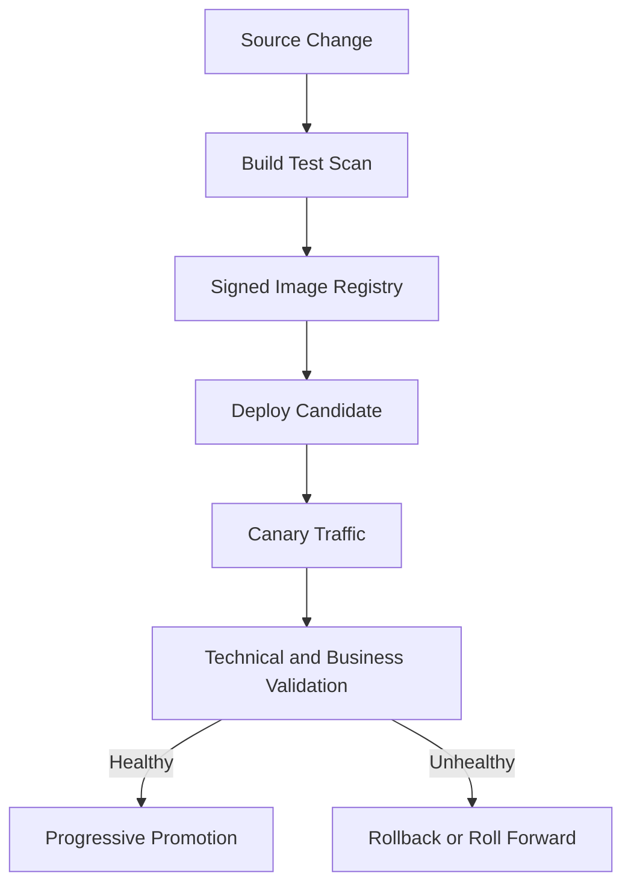
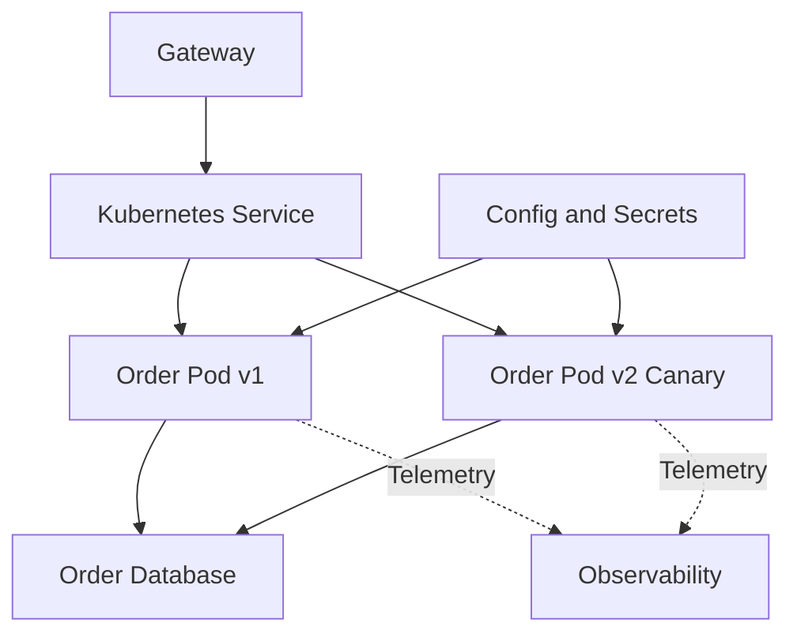
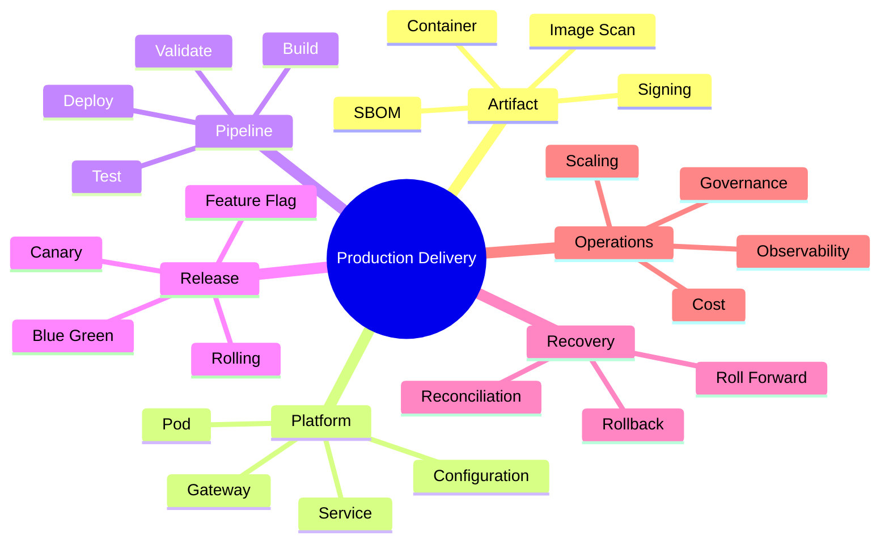

# Module 10 — Containers, Kubernetes, DevOps and Architecture Capstone

## 1. Module Identity and Duration

| Item | Details |
|---|---|
| Course | Microservices Architecture In-Depth |
| Part | Part 5 — Production Readiness |
| Module | Module 10 — Containers, Kubernetes, DevOps and Architecture Capstone |
| Duration | 1 Hour |
| Level | Intermediate to Advanced |
| Learning Ratio | 30% concepts and 70% deployment design, review and capstone work |
| Case Study | Production-Ready Order and Payment Platform |

## 2. Learning Objectives

By the end of this module, participants will be able to:

1. Package services as secure, reproducible container images.
2. Explain core Kubernetes workload, networking and configuration concepts.
3. Design independent CI/CD pipelines with quality gates.
4. Plan backward-compatible application and database releases.
5. Compare rolling, blue-green and canary deployments.
6. Define rollback and roll-forward strategies.
7. Position autoscaling and service mesh capabilities correctly.
8. Review the complete microservices architecture for production readiness.

## 3. What Are Cloud-Native Deployment and DevOps?

**Containerization** packages an application with its runtime dependencies into a consistent, immutable image.

**Container orchestration** schedules, connects, scales and replaces container instances. Kubernetes is a widely used orchestrator, but it is not mandatory for every microservices system.

**DevOps delivery** combines engineering ownership, automation and operational feedback so a service can move safely from source change to production outcome.

**Production readiness** is evidence that the service can be deployed, secured, observed, scaled, recovered and operated within defined business objectives.

> **Memory line:** Build once, verify continuously, release gradually, observe outcomes and recover safely.

## 4. Why Deployment Design Matters

Independent services create value only when they can be delivered and operated independently. Manual, synchronized release processes recreate monolithic coupling.

Poor deployment design causes:

- Environment drift
- Vulnerable or oversized images
- Coordinated service releases
- Breaking API and database changes
- Traffic sent before readiness
- Lost in-flight requests during shutdown
- Slow or unsafe rollback
- Uncontrolled infrastructure cost
- Operational burden that exceeds business benefit

Good delivery design provides:

- Reproducible artifacts
- Automated quality and security evidence
- Progressive exposure
- Backward compatibility
- Observable business validation
- Fast recovery
- Clear ownership and auditability

## 5. Real-Life Analogy — Replacing Train Coaches Safely

Imagine a train operator replacing coaches while maintaining a reliable service.

- A new coach is built and inspected before use.
- It is tested against required safety standards.
- Only a limited route or passenger group may use it first.
- Operators watch performance and incidents.
- If it fails, passengers are moved to a known-safe coach.
- Old coaches remain available until the new version proves stable.

### Mapping

| Train concept | Deployment concept |
|---|---|
| Standardized coach | Container image |
| Safety inspection | CI quality/security gates |
| Railway network | Container platform |
| Limited first route | Canary deployment |
| Parallel old/new coaches | Blue-green deployment |
| Passenger transfer | Traffic shifting |
| Known-safe coach | Previous deployable version |
| Operations monitoring | Telemetry and release validation |

### Where the Analogy Stops

- Application versions may share evolving databases.
- Old and new contracts can run concurrently.
- Automated scaling may create many instances quickly.
- Rollback may be unsafe after irreversible data changes.

## 6. How Deployment Works

### Build-to-Production Flow

1. Developer commits a focused change.
2. CI validates formatting, build, unit and component tests.
3. Contract, integration, security and dependency checks run.
4. Pipeline builds one immutable container image.
5. Image is scanned, signed and stored in a registry.
6. The same image is promoted across environments.
7. Configuration and secrets are injected at runtime.
8. Database changes use backward-compatible migration.
9. Deployment begins with health/readiness controls.
10. Traffic shifts gradually according to release strategy.
11. Technical and business signals are evaluated.
12. Pipeline continues, rolls forward or rolls back.

## 7. Core Concepts

### 7.1 Container Image

A container image is an immutable application package. It should be:

- Reproducible
- Minimal
- Versioned by immutable digest
- Free of embedded secrets
- Scanned for known vulnerabilities
- Run as a non-root user where practical
- Configured with explicit resource needs

### 7.2 Multi-Stage Build

A build stage compiles/tests the application, while a smaller runtime stage contains only what is required to run it. This reduces image size and attack surface.

### 7.3 Image Registry and Supply Chain

A registry stores approved images. Protect the supply chain through:

- Dependency pinning
- Software Bill of Materials
- Vulnerability scanning
- Provenance/attestation
- Signing and verification
- Restricted publishing permissions

### 7.4 Kubernetes Pod

A Pod is the smallest Kubernetes scheduling unit and contains one or more tightly coupled containers. Most application services run one primary application container per Pod.

### 7.5 Deployment

A Deployment manages replicated stateless Pods and supports controlled updates. It is distinct from the business concept of deployment.

### 7.6 Service

A Kubernetes Service provides a stable network identity and routes traffic to selected ready Pods.

### 7.7 Ingress or Gateway

Ingress or Gateway resources control external HTTP routing. Cloud load balancers or API gateways may participate at the edge.

### 7.8 ConfigMap and Secret

- ConfigMap contains non-sensitive configuration.
- Secret holds sensitive values in a Kubernetes object, but additional encryption, access control and external secret-management integration may still be required.

### 7.9 Resource Requests and Limits

- **Request:** Capacity used for scheduling and guaranteed allocation decisions.
- **Limit:** Maximum enforced resource boundary where applicable.

Incorrect values cause poor scheduling, throttling, eviction or wasted cost.

### 7.10 Health and Lifecycle

- Startup probe protects slow initialization.
- Readiness probe controls traffic.
- Liveness probe detects unrecoverable process failure.
- Graceful shutdown stops new traffic and completes or safely hands off in-flight work.

### 7.11 CI Pipeline

Continuous Integration should provide fast evidence for every change:

- Build
- Unit tests
- Component tests
- Contract tests
- Static analysis
- Dependency and secret scans
- Image build and scan
- Artifact publication

### 7.12 CD Pipeline

Continuous Delivery/Deployment promotes a verified immutable artifact through environments with approvals and automated checks appropriate to risk.

### 7.13 Independent Pipeline

Each service should be deployable independently. Shared platform templates can keep standards consistent without forcing coordinated releases.

### 7.14 Rolling Deployment

Instances are replaced gradually.

**Benefits:** Resource-efficient and built into many platforms.  
**Risks:** Old and new versions coexist; contracts and database changes must be compatible.

### 7.15 Blue-Green Deployment

Old and new environments run in parallel. Traffic switches from blue to green.

**Benefits:** Fast traffic rollback and clean separation.  
**Risks:** Higher cost, data/state complexity and migration coordination.

### 7.16 Canary Deployment

A small portion of traffic receives the new version before broader rollout.

**Benefits:** Limits blast radius and provides production evidence.  
**Risks:** Requires reliable routing, metrics and cohort interpretation.

### 7.17 Feature Flags

Flags separate code deployment from feature exposure. They require ownership, audit, safe defaults, test combinations and expiry.

### 7.18 Database Migration

Database changes must support old and new application versions during rollout.

Use expand-and-contract:

1. Add compatible schema.
2. Deploy code supporting both forms.
3. Backfill safely.
4. Switch reads/writes.
5. Validate.
6. Remove old structure later.

### 7.19 Rollback

Rollback redeploys a previous application artifact. It is safe only if contracts and data remain compatible.

### 7.20 Roll Forward

Roll forward deploys a corrective version. It is often safer after irreversible or widely used data changes.

### 7.21 Horizontal Autoscaling

Increase or decrease replicas using workload-aligned signals such as CPU, concurrency, queue depth or consumer lag. Scaling cannot repair a shared bottleneck.

### 7.22 Pod Disruption and Availability

Spread replicas across failure zones/nodes, define disruption budgets and test voluntary and involuntary termination.

### 7.23 Service Mesh

A service mesh may provide workload identity, mTLS, traffic policy and telemetry through infrastructure proxies.

Use when platform-wide needs justify operational complexity. It does not fix poor boundaries, unsafe retries or missing business authorization.

### 7.24 Infrastructure as Code

Infrastructure, policies and environment configuration should be version-controlled, reviewed, tested and reproducible.

### 7.25 GitOps

GitOps uses declarative desired state and automated reconciliation for environment changes. Access control, secret handling and emergency procedures remain essential.

### 7.26 FinOps and Cost

Measure:

- Cost per service/team
- Cost per business transaction
- Idle capacity
- Data transfer
- Logging/tracing cost
- Database and broker utilization
- Scaling efficiency

Architecture must create business value greater than its operational cost.

### 7.27 Architecture Governance

Govern through lightweight automated guardrails:

- API and event standards
- Security baselines
- Observability requirements
- Resource policies
- Approved images/dependencies
- Ownership metadata
- Production-readiness checklist

## 8. Architecture Visualizations

### 8.1 Delivery Pipeline

### 8.2 Runtime Platform

## 9. Separate Mind Map

## 10. Decision and Comparison Tables

### 10.1 Release Strategies

| Dimension | Rolling | Blue-Green | Canary |
|---|---|---|---|
| Parallel versions | During replacement | Full environments | Selected traffic |
| Extra capacity | Low/moderate | High | Moderate |
| Blast radius | Gradual but broadens automatically | Controlled switch | Small initial cohort |
| Fast traffic rollback | Moderate | Strong | Strong if routing supports it |
| Best fit | Routine compatible releases | Critical switch with capacity | Risk-managed evidence-based rollout |

### 10.2 Rollback vs Roll Forward

| Condition | Preferred action |
|---|---|
| Stateless code defect with compatible data | Rollback may be safe |
| Irreversible database transformation | Roll forward usually safer |
| Contract consumed by new clients | Assess compatibility before rollback |
| Security exposure | Disable/contain immediately, then safest fix path |

### 10.3 Kubernetes Decision

| Signal | Simpler managed containers | Kubernetes may be justified |
|---|---|---|
| Service count/platform needs | Small/simple | Many teams/services with shared orchestration needs |
| Operational skills | Limited | Dedicated platform capability |
| Scheduling/network policy | Basic | Advanced |
| Portability/control | Lower priority | Strong requirement |
| Cost of complexity | Exceeds value | Offset by scale and standardization |

### 10.4 Production Readiness Gate

| Area | Required evidence |
|---|---|
| Ownership | Named team and on-call path |
| Build | Reproducible immutable artifact |
| Security | Threat model, scans, identity and secrets |
| Contracts | Compatibility tests |
| Data | Migration, backup and restore |
| Reliability | SLO, timeout, retry and recovery |
| Observability | Logs, metrics, traces and alerts |
| Deployment | Progressive strategy and abort criteria |
| Recovery | Rollback/roll-forward runbook |
| Cost | Resource sizing and cost owner |

## 11. Real-World Enterprise Scenario

### Situation

Ten services are deployed manually from developer laptops. Teams use mutable `latest` image tags. A Payment release changes a database column in place, removes the old field and fails under production load. Rolling back the application does not work because the old version cannot read the new schema.

### Root Causes

- Non-reproducible deployment
- Mutable artifact identity
- No compatibility gate
- Breaking database migration
- No staged production exposure
- No technical/business abort criteria
- Rollback assumed without data analysis

### Corrected Design

1. Build one signed image per commit and reference its digest.
2. Promote the same artifact across environments.
3. Use expand-and-contract database migration.
4. Run unit, component, contract, integration and security gates.
5. Deploy Payment as a small canary.
6. Monitor payment success, duplicates, latency and errors.
7. Stop promotion automatically on threshold breach.
8. Roll forward or roll back only after checking data compatibility.
9. Preserve auditable deployment evidence.

## 12. Step-by-Step Hands-On Capstone Lab

### Lab Title

Production-Ready Order and Payment Architecture

### Business Problem

Design a deployable platform integrating every course module while preserving simplicity and explicit trade-offs.

### Required Tools

- Markdown editor
- Mermaid renderer
- Container and Kubernetes design templates
- CI/CD workflow template
- Production-readiness checklist

### Step 1 — Confirm Domain Boundaries

Review Customer, Product, Order, Inventory, Payment and Notification responsibilities and ownership.

### Step 2 — Confirm Communication

Define REST/gRPC, commands and events. Remove unjustified synchronous dependencies.

### Step 3 — Confirm Data and Saga

Assign databases, Outbox, Order Saga, compensation and reconciliation.

### Step 4 — Add Resilience

Define deadlines, timeouts, retry, circuit breaker, bulkhead, rate limit and backpressure.

### Step 5 — Add Security

Define user/workload identity, authorization, secrets and audit.

### Step 6 — Add Observability and Testing

Define telemetry, SLOs, alerts and layered test evidence.

### Step 7 — Design Container Image

Specify base image, non-root user, health endpoints, resource needs, SBOM, scan and signing.

### Step 8 — Design Kubernetes Runtime

Define Deployment, Service, configuration, secrets, probes, resource requests/limits, disruption and scaling.

### Step 9 — Design CI/CD

Map change through build, test, scan, publish, deploy, validate and promote.

### Step 10 — Design Database Release

Create an expand-and-contract migration compatible with old and new versions.

### Step 11 — Select Release Strategy

Choose rolling, blue-green or canary and define traffic stages and evidence.

### Step 12 — Define Recovery

Specify abort criteria, rollback, roll-forward and data reconciliation.

### Step 13 — Review Cost and Governance

Right-size resources, assign cost ownership and validate guardrails.

### Step 14 — Present Architecture

Deliver a five-minute stakeholder explanation covering benefits, risks and operations.

## 13. Expected Lab Output

Participants must produce:

- Final architecture diagram
- Service and data ownership matrix
- API/event contract catalogue
- Saga and resilience matrix
- Security and observability plan
- Container specification
- Kubernetes deployment design
- CI/CD pipeline
- Database-migration plan
- Release and traffic-shifting plan
- Rollback/roll-forward runbook
- Production-readiness review
- Cost and governance checklist

### Validation Criteria

- Every component has justified responsibility.
- Services can deploy independently.
- Old and new versions coexist safely.
- Database and contract changes are backward compatible.
- Traffic reaches only ready instances.
- Release health includes business metrics.
- Recovery accounts for data changes.
- Platform complexity is proportionate.

## 14. Failure Scenarios and Troubleshooting

| Symptom | Likely cause | Corrective action |
|---|---|---|
| `latest` deploys unexpected code | Mutable image reference | Use immutable digest/version |
| Pod restarts repeatedly | Bad liveness/resource/config | Inspect events/logs and separate probes |
| Traffic reaches uninitialized Pod | Missing/incorrect readiness | Validate readiness before endpoints join |
| Requests fail during termination | No draining/graceful shutdown | Stop new traffic and complete safe shutdown |
| Rollback fails after migration | Breaking/irreversible schema | Use expand-contract or roll forward |
| Canary looks healthy but users fail | Only infrastructure metrics checked | Add business outcome metrics |
| Autoscaling oscillates | Poor signal/threshold and delays | Tune stabilization and use workload signal |
| Container scan blocks release | Vulnerability/policy failure | Assess, update dependency or document governed exception |
| One zone loss removes service | Replicas not spread | Add topology constraints and disruption planning |
| Cost grows without traffic growth | Oversized requests/telemetry/idle capacity | Profile, right-size and assign cost ownership |

## 15. Best Practices

- Build one immutable artifact and promote it.
- Pin trusted base images and dependencies.
- Run containers with minimum privilege.
- Keep secrets outside images and source.
- Define realistic resource requests and limits.
- Separate startup, readiness and liveness.
- Drain traffic gracefully.
- Make API, event and database changes backward compatible.
- Use progressive delivery with explicit abort criteria.
- Validate business and technical metrics.
- Test rollback and roll-forward before incidents.
- Automate guardrails and keep service ownership clear.

## 16. Anti-Patterns

### 16.1 Mutable Latest Tag

The deployed artifact cannot be identified or reproduced confidently.

### 16.2 Rebuild per Environment

Different artifacts reach test and production, invalidating evidence.

### 16.3 Kubernetes by Fashion

Platform complexity is adopted without sufficient scale, skills or need.

### 16.4 Big-Bang Database Migration

Old and new application versions cannot coexist safely.

### 16.5 Rollback Without Data Plan

Teams assume code rollback reverses data and external effects.

### 16.6 CPU-Only Autoscaling

Scaling ignores queue lag, concurrency or the true bottleneck.

### 16.7 Feature-Flag Cemetery

Expired flags remain and multiply behavior combinations.

### 16.8 Service Mesh as Architecture Fix

Infrastructure policy is expected to correct poor boundaries or business behavior.

## 17. Security Considerations

Define:

- Minimal trusted base image
- Non-root runtime
- Read-only filesystem where practical
- Image/SBOM/provenance scanning
- Signing and admission verification
- Workload identity
- Network policy
- Secrets injection and rotation
- Deployment permissions
- Environment separation
- Audit of release actions
- Emergency access procedure

Do not bake credentials into image layers or deployment manifests.

## 18. Performance and Cost Considerations

Measure:

- Startup and readiness time
- CPU and memory utilization
- Throttling and out-of-memory events
- Replica count and idle capacity
- Request concurrency
- Queue depth/lag
- Network and cross-zone traffic
- Image-pull time
- Deployment duration
- Telemetry volume and cost
- Cost per successful business transaction

Right-sizing requires load and soak evidence. Very low limits can cause throttling; very high requests waste schedulable capacity.

## 19. Interview Preparation

### Question 1 — Why use containers for microservices?

They package the service and runtime dependencies consistently, enabling reproducible promotion and isolated resource/process execution.

### Question 2 — Is Kubernetes mandatory?

No. Use it when orchestration scale, policy, portability and platform capabilities justify its operational complexity. Managed container services may be simpler.

### Question 3 — Readiness versus liveness?

Readiness controls traffic eligibility; liveness determines whether an unrecoverable process should restart.

### Question 4 — Rolling versus blue-green versus canary?

Rolling replaces instances gradually, blue-green switches between complete environments, and canary exposes a small traffic cohort before promotion.

### Question 5 — How do you deploy database changes safely?

Use expand-and-contract so old and new application versions remain compatible throughout rollout and rollback windows.

### Question 6 — Rollback versus roll forward?

Rollback restores an older artifact when data/contracts remain compatible. Roll forward applies a corrective version and is often safer after irreversible changes.

### Question 7 — What belongs in a microservice CI/CD gate?

Build, unit/component/contract tests, targeted integration tests, static/dependency/secret/image scans, artifact signing and deployment validation.

### Question 8 — What does a service mesh solve?

It can standardize workload identity, mTLS, traffic policy and telemetry. It does not replace domain design, authorization or application resilience decisions.

## 20. Quick Recap

- Containers provide reproducible immutable service artifacts.
- Kubernetes is a choice, not a microservices requirement.
- Independent services need independent pipelines and compatible contracts.
- Progressive delivery limits release blast radius.
- Database migration determines whether rollback is safe.
- Readiness, graceful shutdown and disruption controls protect traffic.
- Scaling must use the true workload signal.
- Production readiness includes ownership, security, observability, recovery and cost.

## 21. Learning Outcome

The participant can design a secure container and runtime platform, create an independent evidence-driven delivery pipeline, select a progressive release strategy, plan compatible data migration and recovery, and defend a complete production-ready microservices architecture.

## 22. Twenty MCQs

### 1. What should identify a production image?

A. Mutable `latest` only  
B. Immutable version or digest  
C. Developer laptop name  
D. Runtime password

**Answer:** B  
**Explanation:** Immutable identity makes the artifact reproducible and auditable.

### 2. What is the value of a multi-stage build?

A. Embed source secrets  
B. Separate build tools from minimal runtime  
C. Increase final image size  
D. Remove testing

**Answer:** B  
**Explanation:** Only required runtime content reaches the final image.

### 3. What does a Kubernetes Deployment manage?

A. Replicated application Pods and updates  
B. User passwords  
C. Domain events only  
D. Database schema ownership

**Answer:** A  
**Explanation:** A Deployment maintains desired stateless Pod replicas.

### 4. What does a Kubernetes Service provide?

A. Stable routing to selected Pods  
B. Source compilation  
C. Database transaction  
D. JWT issuance

**Answer:** A  
**Explanation:** It abstracts dynamic Pod endpoints.

### 5. What does readiness determine?

A. Whether a Pod receives traffic  
B. Whether source code compiles  
C. Whether an event is immutable  
D. Whether a user is authenticated

**Answer:** A  
**Explanation:** Only ready endpoints should receive requests.

### 6. What is an image SBOM?

A. Software component inventory  
B. Load balancer  
C. Business event  
D. Database view

**Answer:** A  
**Explanation:** An SBOM documents included software components.

### 7. Which strategy runs two full environments?

A. Blue-green  
B. Retry  
C. Bulkhead  
D. CQRS

**Answer:** A  
**Explanation:** Traffic switches between old and new environments.

### 8. Which strategy first exposes a small traffic cohort?

A. Canary  
B. Big-bang  
C. Shared database  
D. Event replay

**Answer:** A  
**Explanation:** Canary limits initial release impact.

### 9. Which migration supports old and new versions?

A. Expand-and-contract  
B. Immediate destructive rename  
C. Delete-first  
D. Manual overwrite

**Answer:** A  
**Explanation:** Compatible stages preserve coexistence.

### 10. When may rollback be unsafe?

A. After incompatible data changes  
B. Before any deployment  
C. With immutable images  
D. With logging

**Answer:** A  
**Explanation:** Old code may not understand transformed data.

### 11. What does roll forward mean?

A. Deploy a corrective new version  
B. Delete production  
C. Remove audit logs  
D. Retry a message

**Answer:** A  
**Explanation:** A fix advances the system from its current data state.

### 12. What should a canary gate monitor?

A. Only Pod count  
B. Technical and business outcomes  
C. File name only  
D. Developer presence

**Answer:** B  
**Explanation:** A healthy process can still produce incorrect business results.

### 13. Why promote the same artifact?

A. Environment evidence applies to production artifact  
B. Rebuilds are always identical  
C. Secrets belong in image  
D. Testing becomes unnecessary

**Answer:** A  
**Explanation:** Rebuilding per environment invalidates prior verification.

### 14. What should resource requests represent?

A. Scheduling capacity need  
B. Image version  
C. User role  
D. Database schema

**Answer:** A  
**Explanation:** The scheduler uses requests to place workloads.

### 15. Why drain a terminating instance?

A. Protect in-flight work  
B. Increase new traffic  
C. Remove telemetry  
D. Change event schema

**Answer:** A  
**Explanation:** Traffic should stop before graceful completion and shutdown.

### 16. Which signal suits message-consumer scaling?

A. Consumer lag or queue age  
B. UI colour  
C. Source filename  
D. Certificate name

**Answer:** A  
**Explanation:** Scale should reflect pending workload.

### 17. What can a service mesh provide?

A. mTLS and traffic telemetry  
B. Correct domain boundaries automatically  
C. Business authorization automatically  
D. Database ownership

**Answer:** A  
**Explanation:** It provides infrastructure capabilities, not domain design.

### 18. What is Infrastructure as Code?

A. Versioned declarative infrastructure definition  
B. Manual server memory  
C. Business event history  
D. UI testing

**Answer:** A  
**Explanation:** Infrastructure changes become reviewable and reproducible.

### 19. What is a useful FinOps metric?

A. Cost per successful business transaction  
B. Number of colours  
C. Filename length  
D. Interview count

**Answer:** A  
**Explanation:** It connects platform spending to delivered value.

### 20. What is the best release principle?

A. Deploy everything at once  
B. Release gradually, observe and recover safely  
C. Skip compatibility  
D. Assume rollback always works

**Answer:** B  
**Explanation:** Progressive evidence limits impact and supports controlled decisions.

## 23. Ten Subjective and Scenario-Based Questions

1. Design a secure, minimal container image for Order Service.
2. Explain when Kubernetes is justified and when a managed container platform is simpler.
3. Design startup, readiness, liveness and graceful-shutdown behavior.
4. Compare rolling, blue-green and canary deployment for Payment Service.
5. Create an expand-and-contract migration for renaming a payment-status field.
6. Explain why application rollback may be unsafe after data migration.
7. Design a CI/CD pipeline with architecture, security and contract gates.
8. Select autoscaling signals for HTTP APIs and message consumers.
9. Explain what a service mesh can and cannot solve.
10. Define technical and business canary abort criteria.

### Evaluation Guidance

Strong answers should:

- Use immutable artifacts and reproducible promotion
- Preserve version and schema compatibility
- Include security, readiness and graceful termination
- Connect release gates to business outcomes
- Define tested rollback/roll-forward decisions
- Avoid infrastructure complexity without justification

## 24. Assignment

### Title

Final Production-Ready Microservices Capstone

### Scenario

Design the complete Order and Payment platform for web and mobile clients. It must support independent delivery, reliable transactions, security, observability, scaling and safe recovery under partial failure.

### Tasks

1. Finalize bounded contexts and service ownership.
2. Define synchronous, asynchronous and gateway interactions.
3. Assign data ownership and Outbox publication.
4. Design the Order Saga and compensations.
5. Define CQRS/read-model needs.
6. Create resilience policies.
7. Design identity, authorization and secret handling.
8. Define logs, metrics, traces, SLOs and alerts.
9. Create the layered test strategy.
10. Specify secure container images.
11. Design Kubernetes or justified alternative runtime.
12. Create independent CI/CD pipelines.
13. Plan backward-compatible database and contract changes.
14. Select progressive release and traffic gates.
15. Define rollback, roll-forward and reconciliation.
16. Review capacity, cost and governance.
17. Complete the production-readiness checklist.
18. Present and defend the architecture.

### Required Deliverables

- Final architecture and deployment diagrams
- Context, service and data ownership matrices
- API and event contracts
- Saga and resilience design
- Security and threat model
- Observability and SLO catalogue
- Testing strategy
- Container and runtime specifications
- CI/CD pipeline
- Migration and progressive-release plan
- Recovery runbook
- Cost model
- Production-readiness assessment

### Assessment Rubric

| Criterion | Weight |
|---|---:|
| Domain and service boundaries | 10% |
| Communication, data and Saga | 15% |
| Reliability and recovery | 15% |
| Security and privacy | 10% |
| Observability and testing | 10% |
| Container and runtime design | 10% |
| CI/CD, migration and release | 15% |
| Cost, governance and simplicity | 5% |
| Architecture communication | 10% |
| **Total** | **100%** |

## Final Memory Line

> Production-ready microservices are not defined by containers or Kubernetes; they are defined by independent, secure and observable delivery with compatible change, controlled release, measurable outcomes and tested recovery.
