# Pack 01 — Resume Defence & Interview Introduction

> **Target:** VRIZE — Senior Fullstack Developer, Round 1  
> **Candidate:** Deepak Kumar  
> **Interview:** 20 August 2026, 11:00 AM–11:30 AM  
> **Priority:** P0 — Must Complete  
> **Timebox:** 60 minutes study + 20–30 minutes speaking/mock practice  
> **Method:** KIS + DRY + SOLID | Evidence First | No Bluff | One Pack at a Time

---

## Readiness Gate

Do **not** move to Pack 02 until you can:

- Deliver a natural 60–90 second introduction without reading.
- Explain your career progression clearly and consistently with the submitted resume.
- Explain your current consulting role, Bechtel role, and one end-to-end full-stack project.
- Answer: **“Are you still hands-on?”** and **“Why Senior Fullstack Developer after architecture work?”**
- Defend at least two major resume metrics with a real engineering story.
- Handle at least two follow-up questions on each major claim without contradiction.

---

## 1. Objective

The first 5–10 minutes are not a formality. A senior interviewer is deciding:

1. **Can I trust this resume?**
2. **Is the candidate still hands-on?**
3. **Can the candidate explain complex work simply?**
4. **Does this senior profile fit the role without title/level confusion?**
5. **Which technical area should I drill into next?**

Your submitted resume positions you as a **Solution Architect / Technical Lead / Principal-level Engineer / AI & Cloud Consultant** with **16+ years** across full stack, backend, mobile, cloud, distributed systems, architecture, security, performance, observability, and leadership.

### Pack 01 Goal

> **Make the interviewer trust that your experience is real, relevant, current, hands-on, and defendable.**

---

## 2. Real-Life Analogy — The Building Journey

Think of your career as learning to build a large building.

- **Developer:** learned to build individual rooms correctly.
- **Full-Stack Engineer:** learned how the rooms connect through plumbing, electricity, access, and structure.
- **Technical Lead:** started reviewing how the team builds and helping others make better decisions.
- **Architect:** learned how the entire building must fit together for scale, safety, reliability, and long-term maintenance.

For this interview, your message is **not**:

> “I became an architect, so development is behind me.”

Your message is:

> **“I understand the whole building, but I still know how to build the rooms.”**

That is the correct positioning for a senior full-stack role.

---

## 3. Visualization — Career Progression

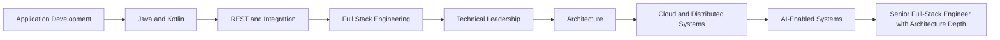

### What to remember

You are **not moving backwards** from Architect to Developer.

You are bringing architecture maturity **into a hands-on senior engineering role**.

---

## 4. Mind Map — What the Interviewer Sees

```mermaid
flowchart TD
    DK[Deepak Kumar]

    DK --> S[Story]
    DK --> T[Technology]
    DK --> A[Architecture]
    DK --> R[Reality]
    DK --> H[Human Leadership]

    S --> S1[16+ Years]
    S --> S2[Bechtel]
    S --> S3[Virtusa]
    S --> S4[Independent Consulting]

    T --> T1[Node.js and TypeScript]
    T --> T2[React.js]
    T --> T3[Java and Kotlin]
    T --> T4[Spring Boot]
    T --> T5[Azure and Data Stores]

    A --> A1[APIs]
    A --> A2[Scalability]
    A --> A3[Distributed Systems]

    R --> R1[Performance]
    R --> R2[Security]
    R --> R3[Production Support]
    R --> R4[CI/CD and Observability]

    H --> H1[Code Reviews]
    H --> H2[Mentoring]
    H --> H3[Stakeholders]
```

### Five memory anchors

**Story → Technology → Architecture → Production Reality → Leadership**

Do not memorize your entire resume line by line. Remember these anchors and connect answers back to real projects.

---

## 5. Simple Explanation — Your Positioning

Use this as your internal one-line identity:

> **I am a senior full-stack engineer whose hands-on engineering experience expanded into architecture and technical leadership.**

Avoid positioning yourself as:

- “An architect applying for a developer job.”
- “An expert in every technology listed on the resume.”
- “Someone who only designs and reviews while others code.”

### Recruiter Intent

A senior recruiter/panel may see three risks:

| Risk | What they may wonder | What you must demonstrate |
|---|---|---|
| Overqualification | “Will he accept this role/title?” | Genuine interest in hands-on senior engineering |
| Hands-on recency | “Does he still code/debug?” | Recent implementation, review, troubleshooting, performance, production involvement |
| Broad resume | “Is he truly deep in all these technologies?” | Honest differentiation between recent depth, long-term depth, and exposure |

---

## 6. Engineering Explanation — Role Alignment

### 6.1 What the VRIZE invite tells us

The interview invitation is for **Senior Fullstack Developer — Round 1**, with a 30-minute discussion.

The Naukri opportunity shown with the invite uses a broad stack including **Kotlin, React, Java, PHP, Laravel, KMP, Python, and Node.js**.

### 6.2 What VRIZE's official careers page confirms

VRIZE currently lists related **Full Stack Developer – React / Java** and **Senior Java Full Stack Developer** roles. Those descriptions emphasize:

- React.js / Redux / JavaScript on the frontend.
- Java / Spring Boot / Microservices on the backend.
- REST, SQL/NoSQL, troubleshooting, performance, unit testing, code reviews, and design discussions.

This is **related company-level evidence**, not proof that your exact Round 1 will use the same question set.

### 6.3 Your safest alignment

Your submitted resume strongly supports recent experience with:

- Node.js
- TypeScript
- React.js
- MongoDB
- Microsoft Azure
- Architecture and engineering standards
- Security remediation
- Performance optimization
- Code reviews
- Requirement translation
- Production support

It also supports earlier **Java/Kotlin** application experience and lists **Spring Boot** in your technology leadership profile.

### Important evidence boundary

The submitted resume **does not explicitly identify a recent Bechtel Spring Boot project**.

Therefore:

**Safe:**

> “Java, Kotlin, and Spring Boot are part of my broader backend engineering background.”

**Do not claim unless personally true and defendable:**

> “My latest Bechtel backend was built with Spring Boot.”

---

## 7. Project Mapping — Only Three Stories

KIS rule: **three strong stories beat ten shallow stories**.

---

### Story 1 — Bechtel: Recent Enterprise Engineering

#### Use this story for

- Recent experience
- React / Node.js / TypeScript
- Azure
- Architecture
- Security
- Performance
- Code reviews
- Mentoring
- Requirement translation

#### Bechtel story visualization

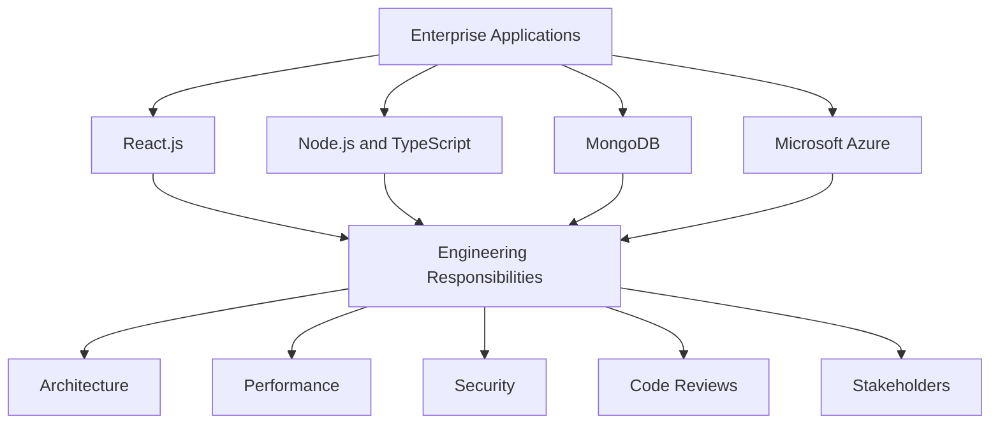

#### 30–45 second answer

> At Bechtel, I worked across enterprise applications using Node.js, TypeScript, React, MongoDB, and Microsoft Azure. My responsibilities included architecture and engineering standards, security remediation, performance optimization, requirement translation, code reviews, and mentoring. So the role combined full-stack engineering with broader technical leadership and production-quality responsibilities.

#### Bechtel likely follow-ups

- Explain the application architecture.
- What did you personally implement?
- What Azure services did you use?
- Give one performance problem.
- Give one security issue.
- What did you look for in code reviews?

**Rule:** Answer only from a real project you can defend.

---

### Story 2 — DEP: End-to-End Full-Stack Platform

Your resume describes the **DEP – EPC Process Digitalization Platform** with Node.js, TypeScript, React.js, MongoDB, Neo4j, Python, OpenAI, Azure, Android, and Google Maps, with involvement across architecture, feature design, implementation, testing, deployment, security, vulnerability management, and production support.

#### Visualization

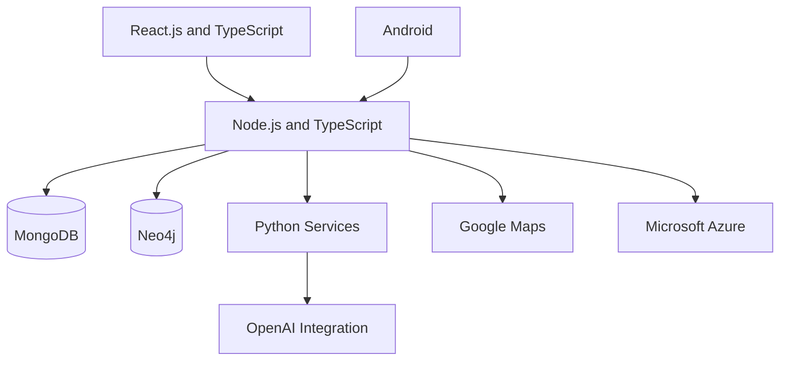

#### 45–60 second answer

> One strong example of my end-to-end experience is an EPC process digitalization platform. It combined React and TypeScript on the frontend, Node.js and TypeScript on the backend, MongoDB and Neo4j for data requirements, and integrations involving Python, OpenAI, Azure, Android, and Google Maps. My involvement covered architecture, feature design, implementation, testing, deployment, security, vulnerability management, and production support. The important part for me was not the number of technologies, but making the components work together as a maintainable production system.

#### DEP likely follow-ups

- Why MongoDB and Neo4j together?
- How did frontend and backend communicate?
- What did you personally implement?
- How was authentication handled?
- What was deployed on Azure?
- What was the hardest production issue?

If you cannot defend a detail, do not volunteer it.

---

### Story 3 — Independent Consulting: Current Architecture and Production Focus

Your resume states that since January 2026 you have directed architecture/delivery across **10+ AI-enabled, cloud, backend, and full-stack engagements**, including solution blueprints covering applications, APIs, data stores, AI services, infrastructure, security, observability, and deployment.

#### Project answer model — PCDIR

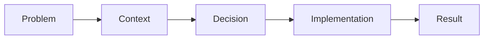

Before using any consulting engagement, prepare these five facts:

1. **Problem:** what had to be solved?
2. **Context:** what system/domain/environment?
3. **Decision:** what important engineering decision did you make?
4. **Implementation:** what did **you** actually do?
5. **Result:** what changed and how was it measured?

#### Evidence boundary

The submitted resume does **not** identify client names, exact team sizes, commercial terms, or detailed engagement-by-engagement technology mappings.

Do not invent them.

---

## 8. Interview-Ready Answers

The answers below are **memory scaffolds**, not scripts to memorize word-for-word.

---

### Q1. Tell me about yourself

#### 90-second version

> Good morning, and thank you for the opportunity. I'm Deepak Kumar, and I have over 16 years of software engineering experience across full-stack development, backend engineering, mobile, cloud, and solution architecture.
>
> In my recent role at Bechtel, I worked on enterprise applications using Node.js, TypeScript, React, MongoDB, and Azure. Along with engineering, I was involved in architecture decisions, performance optimization, security remediation, code reviews, stakeholder requirements, and mentoring.
>
> Before that, at Virtusa, I worked as a Senior Software Engineer – Full Stack, where my responsibilities expanded into solution design, CI/CD, engineering quality, and technical mentoring.
>
> My broader engineering background includes Java, Kotlin, Spring Boot, REST APIs, and mobile development. Currently I'm working independently across AI, cloud, backend, and full-stack consulting engagements.
>
> I would describe myself today as a senior full-stack engineer who can contribute hands-on while also bringing architecture, production, and technical-leadership experience.

#### Memory route

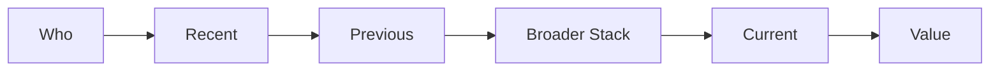

Do **not** memorize sentences. Memorize the route.

---

### Q2. Are you still hands-on?

> Yes. As my responsibilities expanded into architecture and technical leadership, I remained connected to implementation through feature design, API decisions, code reviews, debugging, performance optimization, testing, deployment, and production support. I believe architecture decisions are stronger when they remain grounded in actual engineering constraints.

#### Interviewer intent

They are testing whether “architect” means **hands-off**.

#### Follow-up survival

Be ready with one real example of:

- something you implemented,
- something you debugged,
- something you optimized.

---

### Q3. Why Senior Fullstack Developer after architecture work?

> I don't see full-stack engineering and architecture as separate tracks. My architecture experience grew from hands-on engineering. When I work on a feature today, I naturally think not only about implementation but also maintainability, scalability, security, performance, and production behaviour. So I'm comfortable with a Senior Fullstack Developer role where I can remain hands-on and also contribute that broader engineering perspective.

#### Memory cue

> **Senior engineer with architecture depth — not an architect stepping down into development.**

---

### Q4. What are you doing currently?

> Since January 2026, I've been working independently across AI, cloud, backend, and full-stack consulting engagements. My responsibilities include solution architecture, APIs, data stores, infrastructure, deployment, security, observability, and performance, while remaining involved in engineering decisions and implementation where required.

#### Current-role follow-up survival

Immediately be ready to explain **one** real current engagement using PCDIR.

---

### Q5. What did you do at Bechtel?

> At Bechtel, I worked across enterprise applications using Node.js, TypeScript, React, MongoDB, and Azure. My responsibilities included architecture and engineering standards, performance optimization, security remediation, requirement translation, code reviews, and mentoring. The role combined hands-on full-stack engineering with technical leadership and production-quality responsibilities.

---

### Q6. Why VRIZE?

> The opportunity interests me because it combines areas where I've spent much of my career: full-stack engineering, backend development, frontend development, troubleshooting, code quality, and scalable system design. VRIZE's current related full-stack openings also emphasize React, Java, Spring Boot, microservices, performance, troubleshooting, code reviews, and design discussions. I believe I can contribute hands-on while also bringing senior experience around architecture, production reliability, performance, and team quality.

##### Do not use generic filler

Avoid:

> “VRIZE is a reputed company and I want to grow.”

Make the answer about **role + company engineering direction + your contribution**.

---

### Q7. Why should we hire you?

Use three points only:

> I think I bring three things. First, end-to-end engineering breadth across frontend, backend, APIs, data, and cloud. Second, senior engineering judgment around architecture, performance, security, and production systems. Third, the ability to strengthen a team through code reviews, mentoring, and technical decision-making while still remaining hands-on. That combination fits a senior full-stack role well.

---

### Q8. Which technologies are you genuinely strongest in today?

> I would separate recent depth from broader long-term experience. My recent strongest full-stack work has been around Node.js, TypeScript, React, MongoDB, and Azure. Java and Kotlin are long-standing parts of my engineering background, and Spring Boot is part of my broader backend technology profile. I prefer to be precise about depth rather than claim the same level of expertise across every technology on my resume.

#### Why this answer matters

Credibility is stronger than pretending every keyword has equal depth.

---

## 9. Likely Follow-Ups — Resume Defence

## Follow-Up Survival Model

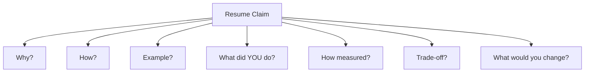

A major claim is interview-ready only when you can survive at least **two follow-up levels**.

---

### 9.1 High-Risk Claim — 16+ Years

#### Resume evidence

The headline states **16+ years**, but the two-page professional-experience section shown to the panel begins in **November 2015**.

#### Recruiter risk

> “I see 16+ years, but the visible chronology is shorter. Walk me through the earlier part of your career.”

#### Your action

Prepare a clean pre-2015 chronology:

```text
Company / Organization:
Role:
Dates:
Primary responsibility:
Main technology:
One-line outcome:
```

Do not improvise the chronology during the interview.

---

### 9.2 High-Risk Claim — 99.9% Availability

The resume claims that distributed platforms maintained **99.9% availability**.

Before volunteering the number, know:

```text
System:
Availability definition:
Measurement period:
Monitoring source:
Baseline / target:
Your contribution:
```

#### Interviewer may ask

- Was this SLA, SLO, or observed uptime?
- Over what period?
- What caused downtime?
- How did you measure it?
- What architectural changes improved reliability?

If you cannot answer those, **do not lead with 99.9%**.

---

### 9.3 High-Risk Claim — 30% Latency Reduction

Your resume connects latency reduction to caching, asynchronous processing, optimized data access, resilient integration, and performance tuning.

#### Memory visualization

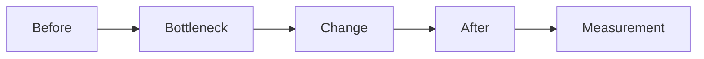

Prepare:

```text
Before latency:
After latency:
Metric type: average / p95 / p99 / other
Bottleneck:
Change:
Measurement tool:
Your contribution:
```

Never defend a percentage with another percentage. Defend it with the **engineering story**.

---

### 9.4 High-Risk Claim — Sub-200 ms Response Time

The resume states service response times **below 200 milliseconds** for scalable real-time workloads.

Be ready for:

- Which service or endpoint?
- Average, p95, or p99?
- Under what load?
- Which monitoring/profiling tool?
- What was your role in reaching the target?

Do not invent RPS, percentile, or load-test figures.

---

### 9.5 High-Risk Claim — 60% Release-Cycle Reduction

The resume links this to CI/CD, validation, versioning, deployment, monitoring, and rollback practices.

Prepare:

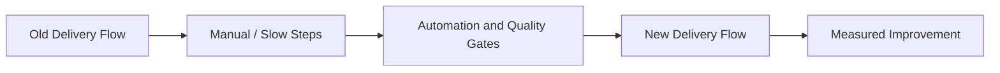

Know the real **before → engineering change → after** story.

---

### 9.6 High-Risk Claim — 60% to 90% Automated Coverage

The Bechtel section states automated coverage increased from **60% to 90%**, with post-release defects reduced by **40%**.

Prepare:

- What type of tests?
- Which tool measured coverage?
- What critical flows were added?
- How did quality gates change?
- How was defect reduction measured?

#### Senior insight

> **Coverage percentage is not the same as test quality.** Meaningful assertions, critical-path coverage, and failure detection matter more than chasing 100%.

---

### 9.7 High-Risk Claim — 120+ Code Reviews Monthly

The Bechtel section states **120+ code reviews monthly**.

#### Code-review mind map

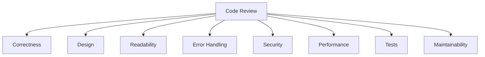

#### 30-second answer

> I don't treat code review as syntax checking. I first verify that the change solves the requirement correctly, then look at design boundaries, readability, error handling, security, performance, and tests. For APIs or production-critical changes I also consider backward compatibility, logging, observability, and failure behaviour.

---

## 10. Practical / Mini Mock

Do this **aloud**. Reading silently does not count.

### Round A — Opening

1. Tell me about yourself.
2. Walk me through your experience.
3. What are you currently doing?

### Round B — Role Fit

4. You describe yourself as an architect. Why Senior Fullstack Developer?
5. Are you still hands-on?
6. Why VRIZE?
7. Why should we hire you?

### Round C — Resume Pressure

8. What exactly did you do at Bechtel?
9. Explain one application where you worked end to end.
10. You claim 30% latency reduction. Walk me through the measurement.
11. You mention 120+ code reviews monthly. What do you check?
12. Which technologies on your resume are genuinely strongest today?
13. Your resume says 16+ years, but the visible chronology begins in 2015. Walk me through the earlier years.

### Round D — Senior Pressure

14. What is one technology on your resume where your experience is not as recent?
15. Describe one architecture decision you would change today.
16. If this role requires daily coding, are you comfortable?
17. Give me one production issue you personally helped resolve.
18. Give me one example where you disagreed with a technical decision.

---

### Mock Scoring

| Dimension | Score |
|---|---:|
| Resume consistency | /10 |
| Communication clarity | /10 |
| Hands-on credibility | /10 |
| Project evidence | /10 |
| Senior engineering judgment | /10 |
| Follow-up survival | /10 |
| Role alignment | /10 |
| **Total** | **/70** |

#### Pack 01 pass mark

- **Below 49:** Not ready
- **49–55:** Needs correction
- **56–62:** Interview ready
- **63–66:** Strong
- **67–70:** Excellent

Do not move to Pack 02 until you reach at least **56/70** and no major resume contradiction remains.

---

## 11. Quick Revision

### One-minute memory map

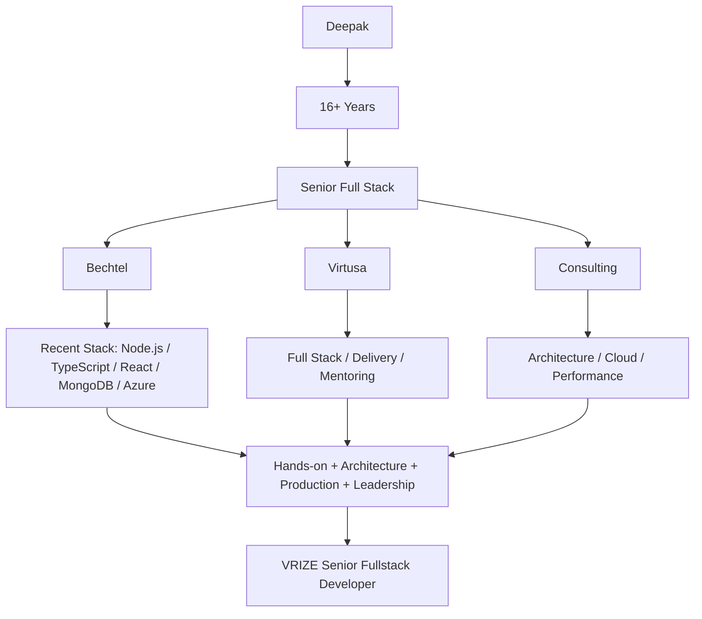

### Remember only these five things

1. **Who am I?**  
   Senior full-stack engineer with architecture depth.

2. **Strongest recent enterprise story?**  
   Bechtel.

3. **Strongest end-to-end platform story?**  
   DEP.

4. **Biggest interview risks?**  
   Broad stack, recent Java/Spring Boot depth, strong metrics, and the 16+ year chronology gap in the two-page resume.

5. **How do I answer?**  
   **What → How → Example → Senior Insight**

---

## Final Memory Card

### Do

- Answer the question first.
- Speak from real projects.
- Separate **“we”** from **“my responsibility.”**
- Explain measurements when quoting metrics.
- Admit differences between recent depth and older experience.
- Stop when the question is answered.

#### Don't

- Recite the entire technology list.
- Pretend every technology has equal depth.
- Invent client, team, metric, Azure-service, load, or project details.
- Hide behind architecture terminology.
- Give five-minute answers to one-minute questions.
- Claim recent Spring Boot work unless you can map it to a real project.

---

## Pack 01 Final Principle

> **Your goal is not to convince the interviewer that you know everything. Your goal is to make the interviewer trust what you say you know.**

---

## Verification Notes

This pack intentionally separates three evidence levels:

1. **Submitted-resume evidence** — treated as panel-visible facts.
2. **Interview-invite evidence** — role, round, timing, and broad stack shown in the supplied invite/Naukri screenshot.
3. **Official VRIZE web evidence** — used only to understand related current company hiring direction; it is not treated as the exact JD for your Round 1.

### Resume facts verified before finalizing this file

- 16+ years headline.
- Independent Technology Consultant: Jan 2026–Present.
- Bechtel: Jul 2023–Jan 2026.
- Virtusa: Nov 2019–Jul 2023.
- Recent Bechtel stack: Node.js, TypeScript, React.js, MongoDB, Microsoft Azure.
- Java/Kotlin experience in earlier mobile/application roles.
- Spring Boot appears in the technology leadership profile, but a recent Spring Boot project is not explicitly identified in the employment bullets.
- 10+ consulting engagements.
- 99.9% availability claim.
- 30% latency-reduction claim.
- sub-200 ms response-time claim.
- 60% release-cycle improvement claim.
- Bechtel automated coverage 60% → 90%.
- Bechtel post-release defect reduction 40%.
- Bechtel 120+ code reviews monthly.
- DEP technology stack and lifecycle involvement.

### Important unresolved items to validate personally before the mock

- Exact pre-November-2015 career chronology supporting the 16+ year headline.
- Exact recent production use of Spring Boot, if any.
- The measurement basis for 99.9% availability.
- Before/after values and metric type behind the 30% latency reduction.
- Measurement basis for sub-200 ms response time.
- Exact CI/CD before/after story behind the 60% release improvement.
- Test tooling and measurement method behind 60% → 90% coverage.
- Two consulting engagements you can discuss safely and specifically.

---

## Sources

### Candidate source

- `Naukri_DeepakKumar.pdf` — the resume supplied in this interview-preparation conversation and described as the candidate resume available to the panel.

### Official VRIZE sources checked on 19 August 2026

- [VRIZE Careers](https://www.vrize.com/careers)
- [VRIZE Home](https://www.vrize.com/)

---

**End of Pack 01**
