# VRIZE Interview Preparation — Pack 02  
## Core Java + OOP + Collections

**Target Role:** Senior Fullstack Developer — Round 1  
**Candidate:** Deepak Kumar  
**Priority:** P0 — Must Know  
**Timebox:** 75–90 minutes study + later practice  
**Approach:** KIS + DRY + SOLID | Mind-Friendly | Interview-First | No Bluff  
**Depth:** Level 1 Must Know → Level 2 Follow-Up → Level 3 Deep Dive only where useful

---

## Readiness Gate

Before this pack is considered ready, you should be able to:

- Explain the JVM/JRE/JDK relationship without notes.
- Explain stack vs heap with a simple example.
- Explain String immutability and why it matters.
- Explain `==`, `equals()`, and `hashCode()` correctly.
- Explain Java pass-by-value correctly.
- Explain the four OOP pillars with engineering examples.
- Explain composition vs inheritance and when to prefer each.
- Explain SOLID at interview level.
- Choose the right Java collection for a given scenario.
- Explain how `HashMap` works internally at a senior-engineer level.
- Explain `ArrayList` vs `LinkedList`, `HashSet` vs `TreeSet`, and `HashMap` vs `ConcurrentHashMap`.
- Connect Java concepts to a real project example without inventing unsupported details.
- Handle at least two follow-up questions on each major topic.

---

# 1. Objective

This pack is not about memorizing Java definitions.

The objective is to make you comfortable answering:

> “Do you actually understand Java as an engineer, or have you only used frameworks around it?”

For a senior full-stack interview, the interviewer usually uses Core Java to test:

- fundamentals,
- clarity of thought,
- object design,
- collection selection,
- performance awareness,
- code quality,
- and depth behind framework knowledge.

The interviewer may start with a simple question such as:

> “What is the difference between `==` and `equals()`?”

and then move quickly to:

> “Why does `HashMap` require a correct `hashCode()` implementation?”

That is why our learning sequence is:

**Simple → Internal Working → Engineering Decision → Interview Answer**

---

# 2. Real-Life Analogy

Think of Java as a **large office building**.

- **JDK** = the complete construction and maintenance toolkit.
- **JRE** = everything required to operate the building.
- **JVM** = the engine room that actually runs the building.
- **Objects** = employees working inside the building.
- **Stack** = each employee's temporary desk.
- **Heap** = shared storage where larger reusable objects live.
- **Collections** = different storage systems:
  - ArrayList = numbered shelf,
  - LinkedList = chain of connected boxes,
  - HashMap = indexed locker system,
  - TreeMap = sorted filing cabinet,
  - Set = entry register that allows no duplicates.

The analogy is not the final answer.

It is only the mental hook that helps you remember the engineering model.

---

# 3. Visualization

## 3.1 Java Execution Flow

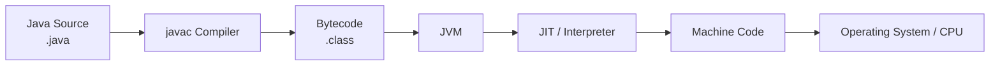

### What to remember

Java source is compiled into **bytecode**.

The JVM executes that bytecode on the target machine, which gives Java its platform-independent model:

> **Compile once to bytecode; run wherever a compatible JVM exists.**

---

## 3.2 Java Memory — Simplified View

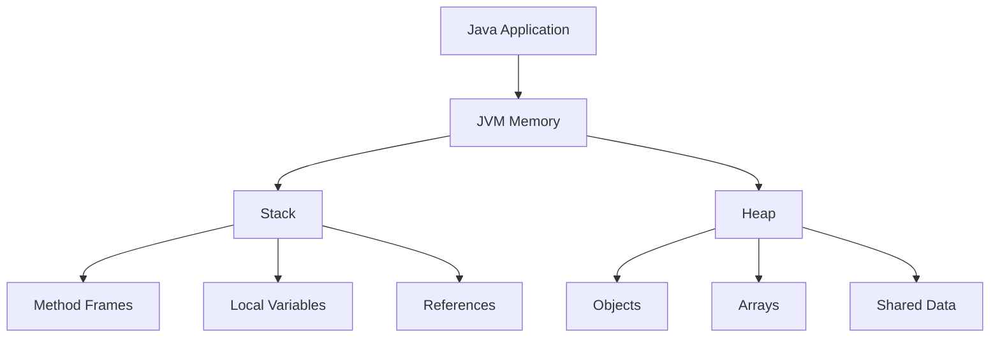

This is intentionally simplified for interview recall.

We will go deeper into JVM memory and garbage collection in Pack 03.

---

## 3.3 OOP Relationship

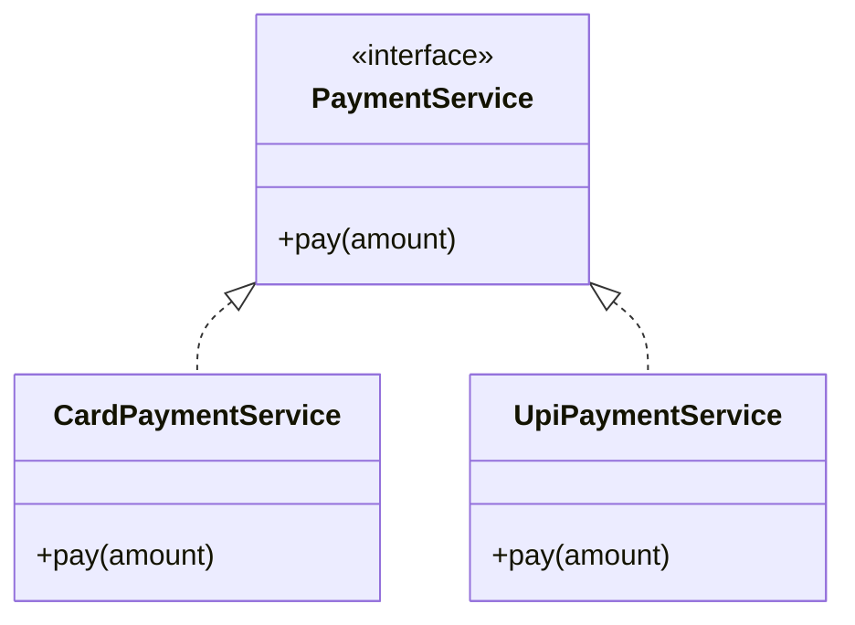

This single diagram gives you:

- abstraction,
- polymorphism,
- interface-based design,
- loose coupling.

---

## 3.4 Collections — Choosing the Right Tool

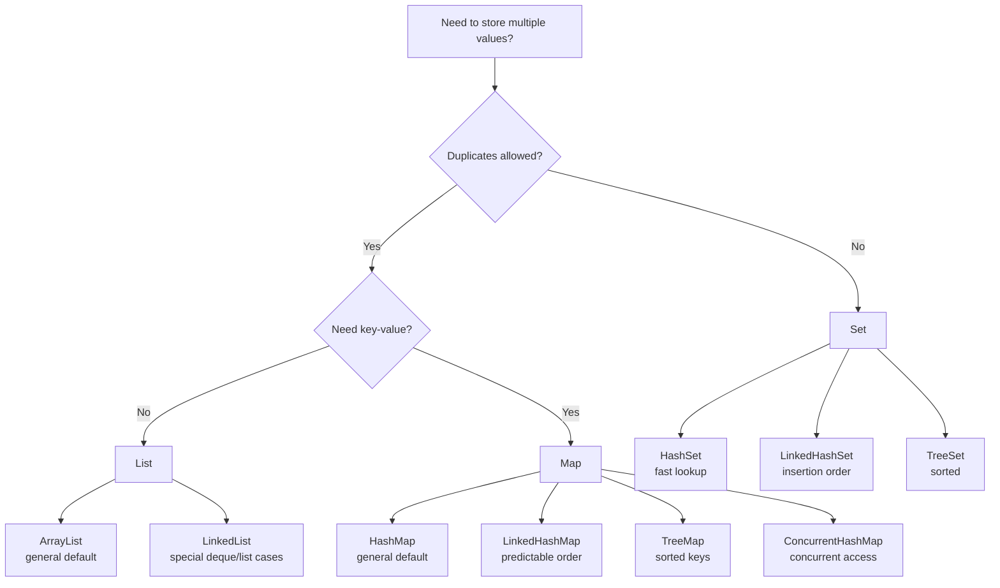

---

# 4. Mind Map

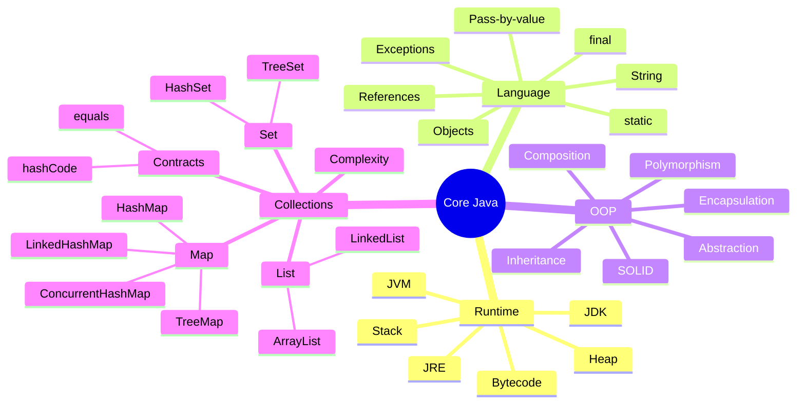

The mind map tells you how the topics connect.

The interview usually moves across these branches rather than staying inside only one.

---

# 5. Simple Explanation

# 5.1 JDK, JRE, JVM

## JDK

**Java Development Kit**

Used to develop Java applications.

It includes development tools such as:

- compiler,
- debugger,
- packaging tools,
- runtime components.

Think:

> **JDK = build + run**

---

## JRE

**Java Runtime Environment**

Conceptually, it contains what is needed to run Java applications.

Think:

> **JRE = run**

For interview purposes, focus on the concept rather than packaging differences between specific Java distributions.

---

## JVM

**Java Virtual Machine**

The JVM executes Java bytecode and provides runtime services such as:

- memory management,
- garbage collection,
- class loading,
- bytecode execution,
- runtime optimization.

Think:

> **JVM = execution engine**

---

## Interview-Ready Answer

> The JDK is the development toolkit used to build Java applications. Java source code is compiled into bytecode, and the JVM executes that bytecode. The JRE is the runtime concept containing the environment needed to run Java applications. The important engineering point is that Java bytecode targets the JVM rather than a specific operating system, which gives Java its portability.

---

# 5.2 Stack vs Heap

## Simple Understanding

### Stack

Used mainly for:

- method calls,
- method frames,
- local variables,
- object references.

Each thread has its own stack.

### Heap

Used mainly for:

- objects,
- arrays,
- shared runtime data.

Objects on the heap can be referenced by multiple parts of the application.

---

## Visualization

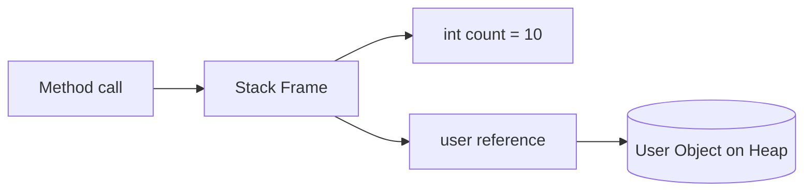

Example:

```java
User user = new User("Deepak");
```

Conceptually:

- `user` reference belongs to the method's local frame.
- the `User` object is allocated on the heap.

---

## Interview-Ready Answer

> The stack is thread-specific and mainly stores method frames, local variables and references. The heap is shared memory where objects and arrays are generally allocated. Stack allocation is tied to method execution, while heap objects remain available as long as they are reachable. Garbage collection primarily manages heap objects.

---

## Senior Insight

Avoid saying:

> “Primitive variables always live on the stack.”

That is an oversimplification.

For interview purposes, discuss stack frames and heap objects at a conceptual level unless the interviewer explicitly wants JVM implementation details.

---

# 5.3 Java Is Pass-by-Value

This is a common trap.

Java is **always pass-by-value**.

For an object, Java passes the **value of the reference**.

---

## Visualization

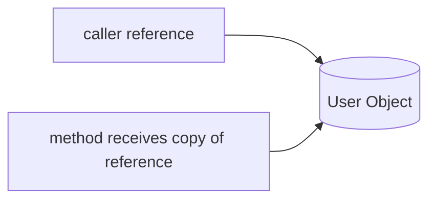

Both references can point to the same object.

But reassigning the method's copied reference does not reassign the caller's reference.

---

## Example

```java
static void changeName(User user) {
    user.setName("Updated");
}
```

The method receives a copy of the reference value.

The object can be modified through that copied reference.

But:

```java
static void replace(User user) {
    user = new User("New User");
}
```

does not replace the caller's reference.

---

## Interview-Ready Answer

> Java is always pass-by-value. For primitives, the primitive value is copied. For objects, the value being copied is the reference. That is why a method can modify the object through the copied reference, but reassigning that local reference does not change the caller's reference.

---

# 5.4 `==` vs `equals()`

## `==`

For primitives:

> compares values.

For object references:

> compares whether two references point to the same object.

## `equals()`

Used for logical equality when the class defines it appropriately.

---

## Example

```java
String a = new String("VRIZE");
String b = new String("VRIZE");

System.out.println(a == b);       // false
System.out.println(a.equals(b));  // true
```

---

## Interview-Ready Answer

> For objects, `==` compares reference identity, while `equals()` is intended for logical equality. Classes such as String override `equals()` to compare their content. If I create a domain object that will be compared logically or used in hash-based collections, I need to implement `equals()` and `hashCode()` consistently.

Notice how the answer naturally connects to `HashMap`.

---

# 5.5 `equals()` and `hashCode()` Contract

## Core Rule

If:

```java
a.equals(b) == true
```

then:

```java
a.hashCode() == b.hashCode()
```

must also be true.

The reverse is not required.

Two different objects may have the same hash code.

That is called a **collision**.

---

## Visualization

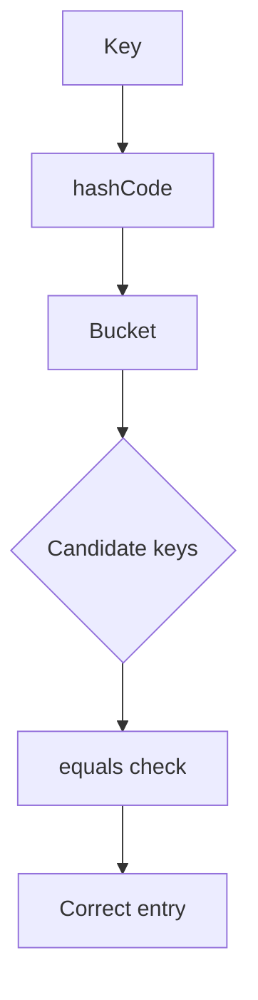

`hashCode()` helps identify the likely bucket.

`equals()` helps find the correct logical key within matching candidates.

---

## Interview-Ready Answer

> Hash-based collections use `hashCode()` to narrow down where an object should be stored or searched, and `equals()` to determine logical equality. If two objects are equal, they must produce the same hash code. If that contract is broken, a HashMap or HashSet may fail to retrieve logically equal objects correctly.

---

# 5.6 String Immutability

A Java `String` cannot be changed after creation.

Operations that appear to modify a String create a new String value.

---

## Example

```java
String name = "Deepak";
name = name + " Kumar";
```

The original String object is not modified.

The variable is assigned a reference to a new resulting String.

---

## Why Immutability Matters

String immutability supports:

- safe sharing,
- predictable behavior,
- String pool usage,
- hash-code stability,
- security-sensitive usage,
- easier concurrency reasoning.

---

## Visualization

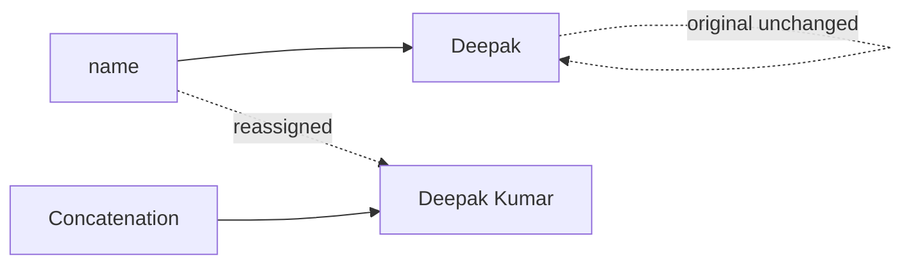

---

## Interview-Ready Answer

> String is immutable, which means its value cannot be changed after creation. An operation such as concatenation creates a new value rather than mutating the original String. Immutability makes Strings safe to share, gives stable hash behavior, supports pooling, and simplifies concurrent use.

---

# 5.7 String vs StringBuilder vs StringBuffer

## String

Use when the value is naturally immutable.

## StringBuilder

Use for repeated string modification in normal single-threaded code.

## StringBuffer

Provides synchronized methods and is generally only relevant when that synchronization behavior is specifically required.

---

## Example

```java
StringBuilder builder = new StringBuilder();

builder.append("Senior");
builder.append(" ");
builder.append("Developer");

String result = builder.toString();
```

---

## Interview-Ready Answer

> String is immutable. For repeated string construction, I would normally use StringBuilder because it modifies an internal mutable buffer instead of creating many intermediate String objects. StringBuffer is synchronized, so I would only choose it when its thread-safety behavior is specifically required.

---

# 5.8 `static`

`static` associates a member with the **class**, rather than a specific object instance.

---

## Common Uses

- constants,
- utility methods,
- factory methods,
- shared class-level state.

Example:

```java
public class MathUtil {
    public static int square(int value) {
        return value * value;
    }
}
```

Call:

```java
int result = MathUtil.square(5);
```

No object instance is required.

---

## Senior Insight

Shared mutable static state can create:

- concurrency problems,
- testability problems,
- hidden coupling.

Use static deliberately.

---

# 5.9 `final`, `finally`, `finalize`

## `final`

Language keyword.

Can apply to:

- variable,
- method,
- class.

Examples:

```java
final int maxRetries = 3;
```

A final reference cannot be reassigned, but the referenced object can still be mutable.

```java
final List<String> names = new ArrayList<>();
names.add("Deepak");   // allowed
```

---

## `finally`

Block used with exception handling.

```java
try {
    // work
} finally {
    // cleanup
}
```

---

## `finalize`

Historical Object cleanup mechanism.

Do not recommend it for modern resource management.

Use deterministic resource-management constructs such as try-with-resources where appropriate.

---

## Interview-Ready Answer

> `final` is a language keyword used to restrict reassignment, overriding or inheritance depending on where it is applied. `finally` is part of exception handling and is used for cleanup logic. `finalize` was an old object-finalization mechanism and should not be treated as a normal resource-management strategy.

---

# 5.10 Checked vs Unchecked Exceptions

## Checked Exceptions

The compiler requires them to be:

- caught,
- or declared.

Example:

```java
IOException
```

## Unchecked Exceptions

Subclasses of `RuntimeException`.

Examples:

```java
NullPointerException
IllegalArgumentException
IllegalStateException
```

---

## Senior Engineering View

Do not answer only with inheritance hierarchy.

Discuss intent.

Checked exceptions can communicate recoverable conditions at API boundaries, but excessive checked-exception propagation can make APIs noisy.

Unchecked exceptions are commonly used for programming errors, invalid state, and many application-layer failures.

---

# 6. OOP

# 6.1 Real-Life Analogy

Imagine an online payment platform.

A customer only cares that a payment succeeds.

They do not need to know every implementation detail of:

- card processing,
- UPI,
- bank integration,
- tokenization.

That gives us:

- **Encapsulation** — keep internal state protected.
- **Abstraction** — expose only the necessary behavior.
- **Inheritance** — specialized type relationship where appropriate.
- **Polymorphism** — same contract, different implementations.

---

# 6.2 Encapsulation

Encapsulation means bundling data and behavior together and controlling access to internal state.

Bad design:

```java
public class BankAccount {
    public double balance;
}
```

Better:

```java
public class BankAccount {

    private BigDecimal balance;

    public void deposit(BigDecimal amount) {
        if (amount.signum() <= 0) {
            throw new IllegalArgumentException("Amount must be positive");
        }

        balance = balance.add(amount);
    }

    public BigDecimal getBalance() {
        return balance;
    }
}
```

The object protects its own invariants.

---

## Interview-Ready Answer

> Encapsulation is not simply making fields private. It is about protecting an object's valid state and exposing behavior through a controlled API. A well-encapsulated object prevents callers from bypassing business rules.

---

# 6.3 Abstraction

Abstraction exposes **what a component does** without forcing the caller to understand **how it does it**.

Example:

```java
public interface NotificationService {
    void send(String recipient, String message);
}
```

Implementations:

```java
EmailNotificationService
SmsNotificationService
PushNotificationService
```

The caller depends on the contract.

---

# 6.4 Inheritance

Inheritance represents an **is-a** relationship.

Example:

```java
class Employee { }
class Developer extends Employee { }
```

Use inheritance when the subtype genuinely satisfies the parent's behavioral contract.

Do not use inheritance only for code reuse.

---

# 6.5 Polymorphism

Different implementations can be used through the same abstraction.

```java
NotificationService service = new EmailNotificationService();
service.send(...);
```

Later:

```java
NotificationService service = new SmsNotificationService();
```

The caller can work with the same contract.

---

# 6.6 Composition vs Inheritance

This is a senior-level question.

## Inheritance

```text
Car IS-A Vehicle
```

## Composition

```text
Order HAS-A PaymentService
```

Composition allows behavior to be assembled from collaborating objects.

---

## Visualization

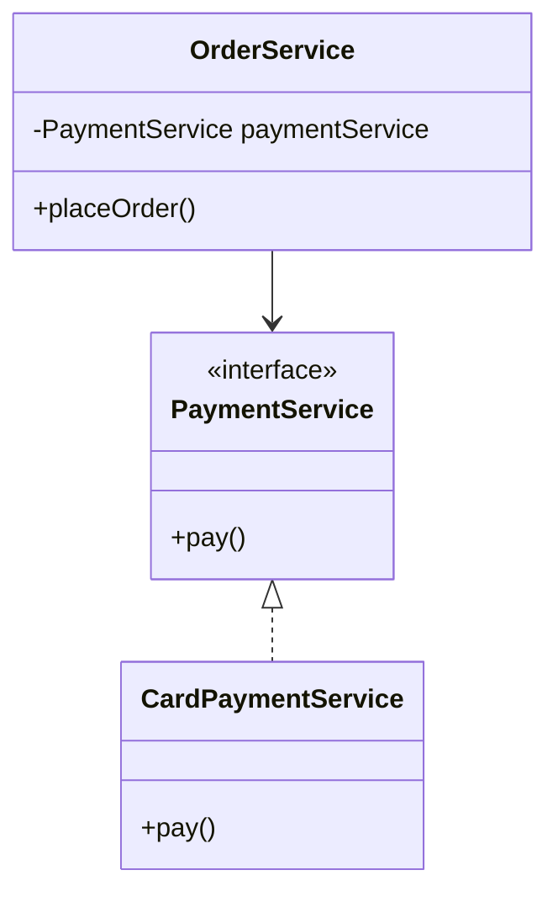

---

## Interview-Ready Answer

> I prefer composition when I need flexible behavior and loose coupling because an object can delegate responsibilities to collaborators rather than inheriting implementation. Inheritance is appropriate when there is a true is-a relationship and the subtype can honor the parent's contract. I do not use inheritance merely to reuse code.

---

# 6.7 SOLID — Interview Level

Do not turn SOLID into a five-minute lecture.

Use this map.

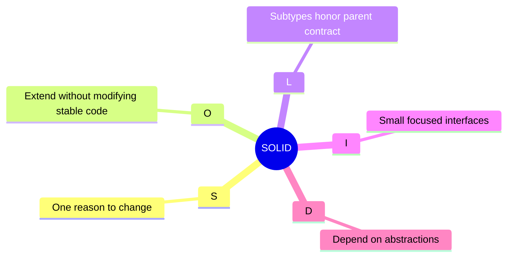

---

## S — Single Responsibility Principle

A class should have one clear responsibility / reason to change.

Bad:

```text
InvoiceService
- calculate invoice
- save database
- send email
- generate PDF
```

Better:

```text
InvoiceCalculator
InvoiceRepository
InvoiceMailer
InvoicePdfGenerator
```

---

## O — Open/Closed Principle

Software should be open for extension but closed for unnecessary modification.

Example:

Instead of:

```java
if (paymentType.equals("CARD")) { ... }
else if (paymentType.equals("UPI")) { ... }
```

use a common payment strategy interface.

---

## L — Liskov Substitution Principle

A subtype should be usable where its parent abstraction is expected without breaking expected behavior.

---

## I — Interface Segregation Principle

Do not force clients to depend on methods they do not need.

Prefer focused interfaces.

---

## D — Dependency Inversion Principle

High-level modules should depend on abstractions rather than concrete implementations.

Example:

```java
class OrderService {
    private final PaymentService paymentService;

    OrderService(PaymentService paymentService) {
        this.paymentService = paymentService;
    }
}
```

This naturally connects to Spring dependency injection.

---

## Interview-Ready SOLID Answer

> SOLID is a set of design principles for keeping object-oriented code maintainable and loosely coupled. In practice, I use it to keep responsibilities focused, depend on abstractions, avoid rigid inheritance, and make behavior easier to extend and test. For example, instead of hard-coding a payment implementation inside an order service, I would depend on a PaymentService abstraction and inject the required implementation.

---

# 7. Collections Framework

# 7.1 Collection Categories

## List

- ordered,
- index-based,
- duplicates allowed.

Examples:

```java
ArrayList
LinkedList
```

---

## Set

- unique elements,
- no duplicate logical values.

Examples:

```java
HashSet
LinkedHashSet
TreeSet
```

---

## Map

- key-value pairs,
- unique keys.

Examples:

```java
HashMap
LinkedHashMap
TreeMap
ConcurrentHashMap
```

`Map` is part of the collections framework conceptually, but it is not a subtype of `Collection`.

---

# 7.2 ArrayList

## Mental Model

A dynamically resizable array.

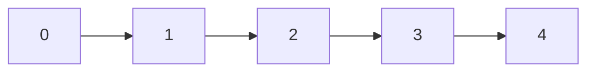

---

## Strengths

- fast indexed access,
- good cache locality,
- common default List implementation,
- append is generally efficient amortized.

## Cost

Insertion/removal in the middle may require shifting elements.

---

## Complexity — Typical Interview Model

| Operation | ArrayList |
|---|---:|
| Get by index | O(1) |
| Append | O(1) amortized |
| Search | O(n) |
| Insert middle | O(n) |
| Remove middle | O(n) |

---

# 7.3 LinkedList

A doubly linked sequence of nodes.

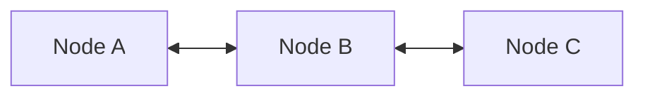

---

## Interview Trap

A common weak answer is:

> “LinkedList is better for insertion and deletion.”

That is incomplete.

If you must first traverse to the position:

> traversal itself is O(n).

LinkedList has additional node-allocation and memory-locality costs.

For most general application list usage:

> **ArrayList is usually the default choice.**

---

## Interview-Ready Answer

> ArrayList is generally my default List because it provides O(1) indexed access, good memory locality, and efficient append behavior. LinkedList can be useful when I already have the relevant node position or need deque-style behavior, but random access is O(n) and the node overhead often makes it a worse general-purpose list.

---

# 7.4 HashSet

A Set optimized for fast membership testing.

Example:

```java
Set<String> emails = new HashSet<>();

emails.add("a@example.com");
emails.add("b@example.com");
emails.add("a@example.com");
```

The logical duplicate is not added again.

HashSet depends on:

- `hashCode()`,
- `equals()`.

---

# 7.5 TreeSet

Maintains elements in sorted order.

Operations are typically:

```text
O(log n)
```

because it is tree-based.

Use it when:

- uniqueness is required,
- and sorted order matters.

Do not pay the sorting cost when you do not need sorting.

---

# 7.6 HashMap — Internal Working

This is one of the most important questions in this pack.

## Real-Life Analogy

Imagine a large office with many lockers.

Instead of searching every locker:

1. compute a locker group from the key,
2. go directly to that bucket,
3. compare candidate keys,
4. retrieve the correct value.

---

## Visualization

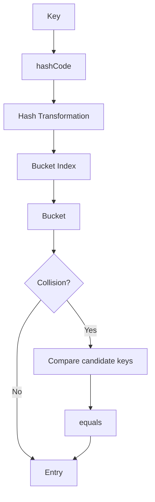

---

## Simplified Flow

```java
map.put(key, value);
```

Conceptually:

1. calculate hash information,
2. derive bucket location,
3. inspect bucket,
4. compare candidate keys,
5. update existing entry or insert new one.

Lookup:

```java
map.get(key);
```

follows a similar path.

---

## Collision

Different keys may map to the same bucket.

That is a collision.

The map must then distinguish keys using equality checks.

---

## Java 8+ Treeification Concept

When a bucket becomes heavily populated under specific conditions, HashMap can transform its collision structure into a balanced tree representation to improve worst-case lookup behavior.

For interview purposes:

- normal average lookup: **O(1)**
- heavily colliding bucket with tree structure: **O(log n)**

Do not memorize implementation thresholds unless the interviewer explicitly asks.

---

## Interview-Ready Answer

> HashMap stores key-value entries in buckets. It uses the key's hash information to determine the relevant bucket and then uses equality checks to find the exact key within that bucket. Multiple keys can map to the same bucket, which is a collision. In modern Java, heavily populated buckets can use a tree-based representation under specific conditions to avoid long linear chains. Average put and get operations are O(1), assuming a reasonable hash distribution.

---

# 7.7 Why Mutable Keys Are Dangerous

Suppose a key's fields are used by `equals()` and `hashCode()`.

You insert the key:

```java
map.put(key, value);
```

Then you modify the key field affecting its hash.

Now:

```java
map.get(key);
```

may search a different logical bucket.

---

## Visualization

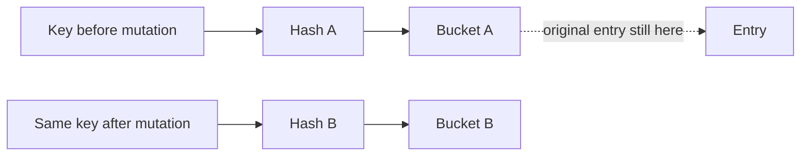

---

## Senior Insight

Prefer immutable key objects where possible.

---

# 7.8 LinkedHashMap

Provides predictable iteration order.

Common uses:

- insertion-order iteration,
- access-order based structures,
- LRU-style cache implementations.

Only choose it when order behavior matters.

---

# 7.9 TreeMap

Maintains keys in sorted order.

Typical operation complexity:

```text
O(log n)
```

Use when:

- sorted keys are required,
- range-style navigation is useful.

If ordering is unnecessary, `HashMap` is usually more efficient for general lookup.

---

# 7.10 HashMap vs ConcurrentHashMap

## HashMap

- not designed for safe concurrent modification,
- general single-threaded / externally synchronized usage.

## ConcurrentHashMap

Designed for concurrent access with better concurrency characteristics than synchronizing an entire normal HashMap externally.

---

## Interview-Ready Answer

> HashMap is not thread-safe. If multiple threads need to read and update a shared map concurrently, I would consider ConcurrentHashMap because it is designed for concurrent access rather than applying one coarse lock around the entire map. The exact choice still depends on the required atomic operations and consistency guarantees.

We go deeper into concurrency in Pack 03.

---

# 7.11 Fail-Fast Iteration

Many standard collection iterators are fail-fast.

If a collection is structurally modified unexpectedly during iteration, the iterator may throw:

```java
ConcurrentModificationException
```

Do not describe fail-fast behavior as a synchronization mechanism.

It is primarily a bug-detection behavior.

---

# 7.12 Comparable vs Comparator

## Comparable

Natural ordering defined by the class.

```java
class Employee implements Comparable<Employee> {
    @Override
    public int compareTo(Employee other) {
        return this.id.compareTo(other.id);
    }
}
```

## Comparator

External/custom ordering.

```java
Comparator<Employee> byName =
        Comparator.comparing(Employee::getName);
```

---

## Interview-Ready Answer

> Comparable defines a type's natural ordering, while Comparator allows separate or multiple ordering strategies without modifying the class's natural comparison logic. I prefer Comparator when different contexts need different sort orders.

---

# 8. Engineering Explanation — How the Concepts Connect

A senior Java answer should connect concepts rather than treating them independently.

Example:

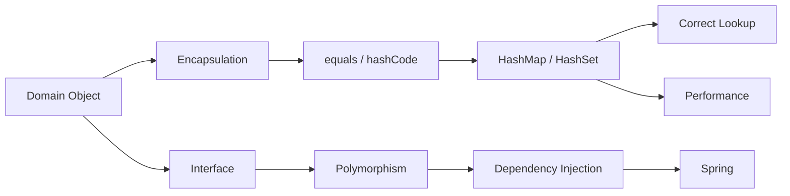

This is the engineering connection:

- OOP defines how objects behave.
- equality defines how objects compare.
- equality affects collection correctness.
- abstraction enables loose coupling.
- loose coupling enables dependency injection.
- dependency injection connects naturally to Spring.

That is how a senior engineer should think.

---

# 9. Project Mapping

This section is intentionally evidence-first.

The résumé available to the interview panel supports Java and Kotlin application development in earlier mobile engineering work, including REST APIs, MVP, Retrofit, Gson, geolocation, notifications and automated testing.

It also lists Java, Kotlin and Spring Boot among broader technology competencies.

However, the résumé does **not** specify:

- a recent Bechtel Java backend,
- a specific recent Spring Boot production project,
- the exact Java collections used in each project.

Therefore we do not invent those details.

---

## Safe Project Connection — Java/Kotlin Application Work

You can safely say:

> Earlier in my career, Java and Kotlin were core parts of my application-development work, particularly in Android applications with REST integration, MVP-style architecture, Retrofit and related application components. That gave me practical experience with object-oriented design, interfaces, collections, application state and API models.

Use a more specific collection example only if you personally remember the real implementation.

---

## Candidate Validation Required

Before the interview, identify one real example for each:

| Topic | Your Real Example |
|---|---|
| Interface / abstraction | __________________ |
| Composition | __________________ |
| HashMap | __________________ |
| Set / duplicate elimination | __________________ |
| List | __________________ |
| equals/hashCode | __________________ |
| SOLID improvement | __________________ |

Do not manufacture examples just to fill this table.

A truthful simple example is better than a sophisticated fictional one.

---

# 10. Interview-Ready Answers

These are the answers worth rehearsing.

---

## Q1. Why is Java platform independent?

> Java source is compiled into bytecode rather than directly into operating-system-specific machine code. A compatible JVM on the target platform executes that bytecode, so the same compiled application can run across different environments, subject to the runtime and external dependencies being compatible.

---

## Q2. Stack vs Heap?

> The stack is thread-specific and mainly contains method frames, local variables and references. The heap is shared memory where objects and arrays are generally allocated. Stack lifetime follows method execution, while heap objects remain until they are no longer reachable and can be reclaimed by garbage collection.

---

## Q3. Is Java pass-by-reference?

> No. Java is always pass-by-value. For an object, the value copied into the method is the reference value. That allows the method to modify the same object, but reassigning the method's local reference does not change the caller's reference.

---

## Q4. `==` vs `equals()`?

> For object references, `==` checks identity—whether both references point to the same object. `equals()` is used for logical equality when the class implements it appropriately. For domain objects used in hash collections, `equals()` and `hashCode()` must be implemented consistently.

---

## Q5. Why is String immutable?

> String cannot be modified after creation. Operations that appear to change it produce a new value. Immutability gives stable behavior for hashing, supports safe sharing and pooling, reduces concurrency concerns, and is useful because Strings are widely used in security-sensitive and configuration-related contexts.

---

## Q6. Abstract class vs interface?

> I use an interface to define a capability or contract that multiple unrelated implementations can provide. I use an abstract class when related types genuinely share state or reusable behavior in addition to a common contract. In modern application design I generally prefer interfaces for dependency boundaries because they reduce coupling, but I do not avoid abstract classes when shared implementation is genuinely part of the model.

---

## Q7. Overloading vs overriding?

> Overloading means multiple methods have the same name but different parameter signatures, and resolution happens at compile time. Overriding means a subtype provides its own implementation of an inherited method, enabling runtime polymorphism.

---

## Q8. Composition vs inheritance?

> Composition means building behavior through collaborating objects, while inheritance models an is-a relationship. I generally prefer composition for flexibility and loose coupling. I use inheritance when the subtype genuinely satisfies the parent contract, not simply to reuse code.

---

## Q9. What is SOLID?

> SOLID is a set of object-design principles that help keep code modular, maintainable and loosely coupled. In practical terms, I use it to keep responsibilities focused, depend on abstractions, avoid forcing classes to implement irrelevant behavior, and make features easier to extend and test.

---

## Q10. ArrayList vs LinkedList?

> ArrayList is my default List for most application code because it gives O(1) indexed access, good memory locality and efficient append behavior. LinkedList has O(n) random access and additional node overhead, so I use it only when its linked/deque behavior genuinely fits the problem.

---

## Q11. How does HashMap work?

> HashMap uses the key's hash information to determine a bucket. Within that bucket it uses equality checks to identify the exact key. Multiple keys can map to the same bucket, which creates a collision. Modern Java can use a tree-based representation for heavily populated buckets under specific conditions. Average put and get operations are O(1) when hash distribution is healthy.

---

## Q12. Why must `equals()` and `hashCode()` be consistent?

> Hash-based collections first use hash information to locate the relevant bucket and then equality to identify the logical object. Therefore, objects considered equal must have the same hash code. Breaking that contract can make logically equal keys behave incorrectly in HashMap and HashSet.

---

## Q13. HashSet vs TreeSet?

> HashSet is generally used when I need uniqueness and fast membership checks without ordering. TreeSet maintains sorted order and typically has O(log n) operations, so I choose it only when sorted unique values are required.

---

## Q14. HashMap vs TreeMap?

> HashMap is the normal choice for fast unordered key-value lookup, with average O(1) access. TreeMap maintains keys in sorted order and operations are typically O(log n). I choose based on whether ordering or range navigation is actually required.

---

## Q15. HashMap vs ConcurrentHashMap?

> HashMap is not thread-safe for shared concurrent updates. ConcurrentHashMap is designed for concurrent access and provides atomic operations useful in multithreaded applications. I would choose it when multiple threads genuinely share and mutate the map rather than simply using it because the application happens to be server-side.

---

# 11. Likely Follow-Ups

## JDK / JVM

- What is bytecode?
- What is JIT?
- What is class loading?
- What memory areas exist in the JVM?
- What does garbage collection do?

**Pack 03 handles JVM depth.**

---

## String

- Why can String be used safely as a HashMap key?
- What is the String pool?
- `StringBuilder` vs `StringBuffer`?
- What happens during repeated concatenation?

---

## OOP

- Give a practical example of polymorphism.
- Why prefer composition?
- Can an interface have implementation?
- When would you still use an abstract class?
- Which SOLID principle does dependency injection support?

---

## Collections

- Why is ArrayList faster than LinkedList for many real workloads?
- How does HashMap handle collisions?
- What happens if a HashMap key is mutable?
- What happens if `hashCode()` always returns the same value?
- Why isn't HashMap thread-safe?
- When would you choose LinkedHashMap?
- Comparable vs Comparator?
- What is ConcurrentModificationException?
- How would you remove duplicates but preserve insertion order?

---

# 12. Senior Follow-Up Survival

For any important Java answer, be ready for:

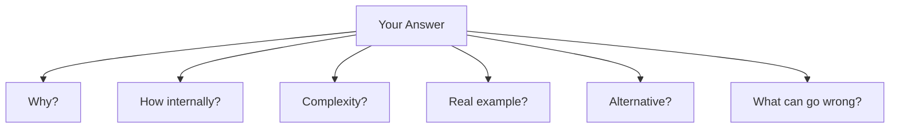

Do not automatically answer all six.

Answer the question asked.

But be ready when the interviewer goes deeper.

---

# 13. Practical Coding Patterns

These are small patterns a senior full-stack interviewer can easily ask.

---

## 13.1 Frequency Count with HashMap

Problem:

> Count how many times each word appears.

```java
Map<String, Integer> frequency = new HashMap<>();

for (String word : words) {
    frequency.merge(word, 1, Integer::sum);
}
```

### Engineering Point

This is a natural `HashMap` problem because:

```text
key   = word
value = occurrence count
```

Typical complexity:

```text
O(n)
```

assuming average O(1) map operations.

---

## 13.2 Remove Duplicates While Preserving Order

```java
List<String> input = List.of("A", "B", "A", "C", "B");

Set<String> unique = new LinkedHashSet<>(input);

System.out.println(unique);
```

Result:

```text
[A, B, C]
```

Why `LinkedHashSet`?

- Set → uniqueness.
- LinkedHashSet → preserves insertion order.

---

## 13.3 Sort Objects Using Comparator

```java
List<Employee> employees = new ArrayList<>();

employees.sort(
    Comparator.comparing(Employee::getName)
);
```

For descending salary:

```java
employees.sort(
    Comparator.comparing(Employee::getSalary).reversed()
);
```

---

## 13.4 Group Values by Key

Classic interview pattern:

```java
Map<String, List<Employee>> byDepartment = new HashMap<>();

for (Employee employee : employees) {
    byDepartment
        .computeIfAbsent(
            employee.getDepartment(),
            key -> new ArrayList<>()
        )
        .add(employee);
}
```

This checks understanding of:

- Map,
- List,
- `computeIfAbsent`,
- grouping logic.

---

# 14. Common Interview Traps

## Trap 1

> “Java passes objects by reference.”

**Wrong.**

Correct:

> Java passes the reference value by value.

---

## Trap 2

> “`==` compares memory address.”

Too implementation-specific.

Better:

> For objects, `==` compares reference identity.

---

## Trap 3

> “LinkedList insertion is always O(1).”

Incomplete.

Finding the insertion location may cost O(n).

---

## Trap 4

> “HashMap is O(1).”

Better:

> Average-case lookup is O(1) with a reasonable hash distribution.

---

## Trap 5

> “HashSet prevents duplicates automatically.”

Senior answer:

> It relies on equality/hash semantics, so domain equality must be implemented correctly.

---

## Trap 6

> “final makes an object immutable.”

Wrong.

A final reference cannot be reassigned.

The referenced object can still be mutable.

---

## Trap 7

> “SOLID means every class must have only one method.”

Wrong.

Single responsibility means one coherent reason to change.

---

## Trap 8

> “Interface is always better than abstract class.”

Wrong.

Choose according to the model and design requirements.

---

# 15. Interviewer Intent

| Question | What the interviewer is really testing |
|---|---|
| JDK/JRE/JVM | Java foundation |
| Stack vs Heap | Runtime understanding |
| `==` vs `equals()` | Object semantics |
| String immutable | Language design understanding |
| Pass-by-value | Precision |
| OOP pillars | Design fundamentals |
| Composition vs inheritance | Senior design judgment |
| SOLID | Maintainability mindset |
| ArrayList vs LinkedList | Data structure selection |
| HashMap internals | Core Java depth |
| equals/hashCode | Correctness |
| HashMap vs ConcurrentHashMap | Concurrency awareness |
| Comparator | Practical collection usage |

---

# 16. Practical / Mini Mock Content

This section is for later practice. Do not execute it yet.

## Level 1 — Must Know

1. Explain JDK, JRE and JVM.
2. Explain stack vs heap.
3. Is Java pass-by-value or pass-by-reference?
4. `==` vs `equals()`.
5. Why is String immutable?
6. Abstract class vs interface.
7. Explain the four OOP principles.
8. Composition vs inheritance.
9. ArrayList vs LinkedList.
10. Explain HashMap internally.

---

## Level 2 — Follow-Up

11. Why do `equals()` and `hashCode()` need a contract?
12. What happens if `hashCode()` always returns the same value?
13. Why can mutable HashMap keys cause problems?
14. HashSet vs TreeSet.
15. HashMap vs TreeMap.
16. Comparable vs Comparator.
17. Why is LinkedList often slower in real applications despite O(1) node insertion?
18. What is `ConcurrentModificationException`?
19. Why isn't HashMap thread-safe?
20. Give a real example of Dependency Inversion.

---

## Level 3 — Engineering Deep Dive

21. What happens when HashMap has many collisions?
22. Why does memory locality matter for ArrayList?
23. Explain the relationship between immutability and hash-based collections.
24. How does object equality affect Set behavior?
25. How would poor `hashCode()` implementation affect performance?
26. What is the design problem with a “God class”?
27. When can inheritance violate LSP?
28. When would an abstract class be a better choice than an interface?
29. What issues can shared mutable `static` state cause?
30. When would you choose ConcurrentHashMap over an immutable snapshot?

---

# 17. Quick Revision

## One-Page Memory Map

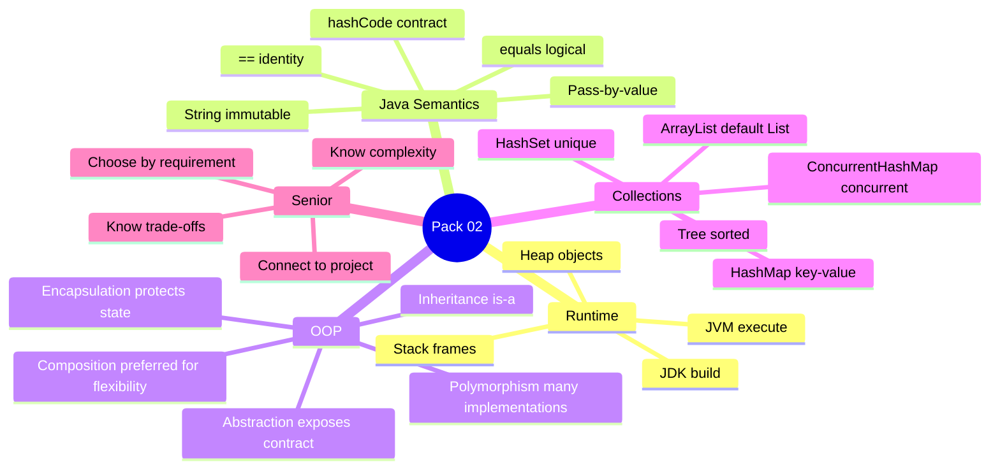

---

# 18. 60-Second Rapid Revision

Before the interview, remember:

```text
JDK = build
JVM = execute

Stack = method/thread-local execution state
Heap = objects/shared runtime memory

Java = always pass-by-value

== = identity for object references
equals = logical equality
equal objects => same hashCode

String = immutable

OOP:
Encapsulation
Abstraction
Inheritance
Polymorphism

Prefer composition when flexibility matters.

ArrayList = default general-purpose List
HashSet = unique values
HashMap = fast key-value lookup
TreeMap/TreeSet = sorted
ConcurrentHashMap = concurrent map

HashMap:
hash -> bucket -> equals -> entry

Senior answer:
What -> How -> Example -> Senior Insight
```

---

# 19. Pack 02 Evidence Boundary

## Safe from the submitted résumé

You can safely discuss:

- Java as part of your engineering background.
- Kotlin as part of your engineering background.
- Android application development.
- REST API integration.
- MVP-style application architecture.
- Retrofit/Gson usage.
- code quality, reviews, architecture and maintainability as broader experience.

## Validate personally before claiming

- exact Java version used in a specific project,
- exact collection used in a named project,
- exact Spring Boot project architecture,
- specific HashMap/ConcurrentHashMap production incident,
- specific Java performance metric,
- specific Java concurrency implementation.

The interview objective is credibility, not keyword coverage.

---

# 20. Final Pack 02 Mental Model

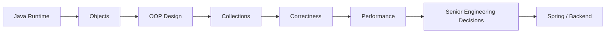

This is the bridge to the next technical packs.

You are not learning Java as isolated syntax.

You are building the foundation needed to reason about:

- Spring,
- REST APIs,
- microservices,
- concurrency,
- performance,
- and system design.

---

## Golden Rule

> **Do not answer Java questions like a certification exam.**

Answer like an engineer:

> **What is it? → How does it work? → Why would I choose it? → What can go wrong?**

That is the level expected from a senior candidate.
