# VRIZE Interview Preparation — Pack 03
## Modern Java + Concurrency + JVM

**Target Role:** Senior Fullstack Developer — Round 1  
**Candidate:** Deepak Kumar  
**Priority:** P0 — Must Know  
**Timebox:** 75–90 minutes study + later practice  
**Approach:** KIS + DRY + SOLID | Mind-Friendly | Interview-First | No Bluff  
**Depth:** Level 1 Must Know → Level 2 Follow-Up → Level 3 Engineering Deep Dive

---

## Readiness Gate

Before this pack is considered ready, you should be able to:

- Explain lambdas and functional interfaces in simple language.
- Use `Predicate`, `Function`, `Consumer`, and `Supplier`.
- Explain how a Stream pipeline works.
- Explain `map`, `filter`, `flatMap`, `reduce`, and `collect`.
- Explain when `Optional` is useful and when it is not.
- Explain thread vs process and the Java thread lifecycle.
- Explain race condition, synchronization, visibility, and atomicity.
- Explain `synchronized` vs `volatile`.
- Explain `ExecutorService`, thread pools, `Callable`, `Future`, and `CompletableFuture`.
- Explain deadlock and practical prevention strategies.
- Explain `AtomicInteger`, locks, and concurrent collections at interview level.
- Explain JVM execution, class loading, JIT, stack, heap, and garbage collection at senior-interview level.
- Explain how to investigate a Java performance or memory problem.
- Connect concurrency/JVM concepts to a real engineering scenario without inventing project details.

---

## 1. Objective

Pack 02 established the Java foundation.

Pack 03 answers the next senior-level question:

> **“Can you reason about modern Java, asynchronous work, concurrency, memory, and runtime behavior?”**

A senior interviewer may start with:

> “What is a lambda?”

and quickly move to:

> “Would you use parallel streams here?”

or:

> “What is the difference between `volatile` and `synchronized`?”

or:

> “How would you investigate a Java service whose memory keeps increasing?”

The goal is not to memorize APIs.

The goal is to understand:

```text
Data processing
→ execution
→ concurrency
→ memory
→ runtime
→ production behavior
```

---

## 2. Real-Life Analogy

Think of a busy restaurant.

- **Thread** = one worker performing tasks.
- **Thread pool** = a fixed team of workers.
- **Task queue** = pending orders waiting to be handled.
- **Race condition** = two workers update the same order sheet at the same time.
- **Lock** = only one worker may enter a restricted preparation area at a time.
- **volatile** = an always-visible notice board; everyone sees the latest posted value.
- **Atomic operation** = one indivisible action, such as incrementing a counter safely.
- **Deadlock** = Worker A holds the oven key and waits for the freezer key, while Worker B holds the freezer key and waits for the oven key.
- **CompletableFuture** = place an order, continue other work, and react when the result becomes available.
- **Garbage collector** = staff periodically remove items that are no longer reachable or useful.
- **JIT** = the kitchen notices frequently repeated work and optimizes how it is performed.

The analogy is only the memory hook.

The engineering model comes next.

---

## 3. Visualization

## 3.1 Modern Java Data Flow

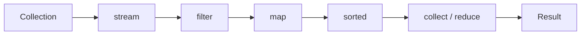

Think:

> **Source → intermediate operations → terminal operation**

---

## 3.2 Thread Pool Model

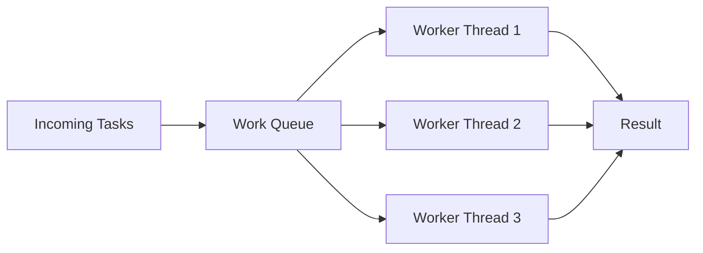

The key idea:

> We normally submit **tasks** to an executor rather than creating uncontrolled threads manually.

---

## 3.3 Race Condition

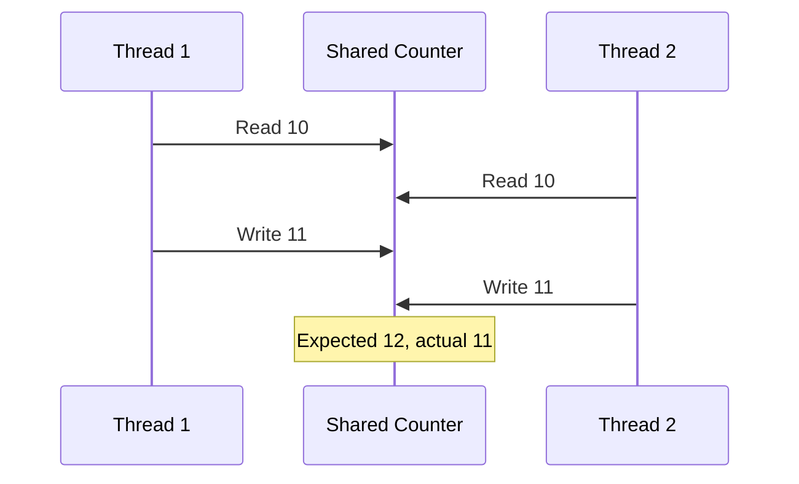

That is a lost update.

---

## 3.4 CompletableFuture Flow

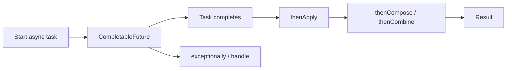

---

## 3.5 Simplified JVM Execution

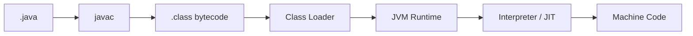

---

## 3.6 JVM Runtime — Simplified

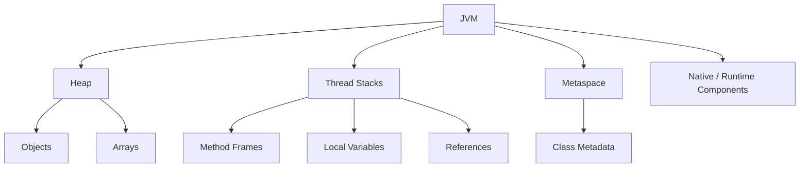

This is an interview-friendly model, not a complete JVM specification diagram.

---

## 4. Mind Map

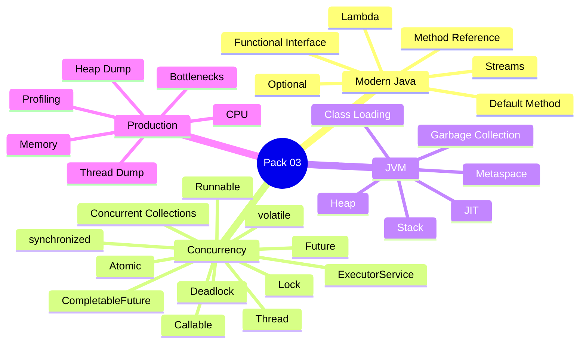

Remember the four anchors:

> **Modern Java → Concurrency → JVM → Production**

---

## 5. Simple Explanation — Modern Java

### 5.1 Lambda Expression

A lambda is a concise way to provide behavior where a functional interface is expected.

Before:

```java
Comparator<String> comparator = new Comparator<String>() {
    @Override
    public int compare(String a, String b) {
        return a.compareTo(b);
    }
};
```

With lambda:

```java
Comparator<String> comparator =
        (a, b) -> a.compareTo(b);
```

---

## Real Meaning

Do not think:

> “Lambda is shorter syntax.”

Think:

> **“Lambda lets me pass behavior as a value through a functional interface.”**

---

## Interview-Ready Answer

> A lambda is a concise representation of behavior that can be supplied where a functional interface is expected. It helps make operations such as filtering, mapping, callbacks, comparators, and asynchronous pipelines more expressive without creating unnecessary anonymous classes.

---

### 5.2 Functional Interface

A functional interface has one abstract method.

Example:

```java
@FunctionalInterface
public interface Calculator {
    int calculate(int a, int b);
}
```

Usage:

```java
Calculator add = (a, b) -> a + b;

int result = add.calculate(10, 20);
```

---

## Common Functional Interfaces

| Interface | Input | Output | Mental Model |
|---|---|---|---|
| `Predicate<T>` | T | boolean | Test |
| `Function<T,R>` | T | R | Transform |
| `Consumer<T>` | T | void | Consume / perform action |
| `Supplier<T>` | none | T | Produce |
| `UnaryOperator<T>` | T | T | Same-type transform |
| `BinaryOperator<T>` | T,T | T | Combine same type |

---

## Memory Hook

```text
Predicate → Should I keep it?
Function  → What should it become?
Consumer  → What should I do with it?
Supplier  → Give me one.
```

---

### 5.3 Method Reference

A method reference is a concise way to refer to an existing method when its signature fits the required functional interface.

Lambda:

```java
names.forEach(name -> System.out.println(name));
```

Method reference:

```java
names.forEach(System.out::println);
```

Use it when it improves readability.

Do not force it when the lambda is clearer.

---

### 5.4 Stream

A Stream represents a pipeline for processing data.

A Stream is **not** a collection.

It does not primarily exist to store data.

It expresses computation over a source.

---

## Visualization


Example:

```java
List<String> names =
        employees.stream()
                .filter(Employee::isActive)
                .map(Employee::getName)
                .sorted()
                .toList();
```

---

## Stream Pipeline

### Source

```java
employees.stream()
```

### Intermediate Operations

Examples:

```java
filter
map
flatMap
sorted
distinct
limit
```

They build the pipeline.

### Terminal Operations

Examples:

```java
toList
collect
reduce
forEach
count
findFirst
anyMatch
```

They trigger processing.

---

### 5.5 Lazy Evaluation

Intermediate Stream operations are generally lazy.

This means:

```java
employees.stream()
         .filter(...)
         .map(...);
```

does not perform the full computation until a terminal operation is invoked.

Example:

```java
long count =
    employees.stream()
             .filter(Employee::isActive)
             .count();
```

`count()` triggers execution.

---

## Senior Insight

Laziness allows the runtime to process operations as a pipeline and enables short-circuiting for operations such as:

```java
findFirst()
anyMatch()
limit()
```

---

### 5.6 `map()` vs `flatMap()`

## `map()`

One input becomes one output.

```text
Employee → name
```

Example:

```java
employees.stream()
         .map(Employee::getName)
```

---

## `flatMap()`

One input may contain multiple nested values, and the result is flattened.

Suppose:

```text
Department
  → List<Employee>
```

We want:

```text
Stream<Employee>
```

Example:

```java
departments.stream()
           .flatMap(department ->
               department.getEmployees().stream()
           );
```

---

## Visualization

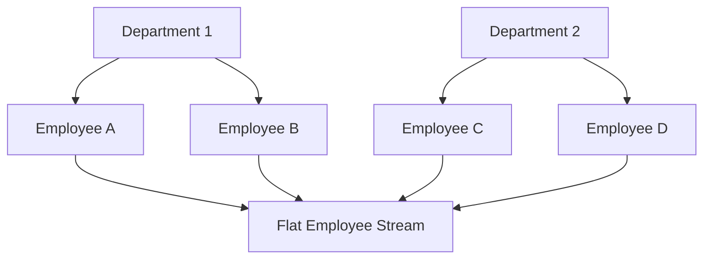

---

### 5.7 `reduce()`

`reduce()` combines multiple values into one.

Example:

```java
int total =
    numbers.stream()
           .reduce(0, Integer::sum);
```

Think:

> **Many → One**

Examples:

- sum,
- product,
- maximum,
- custom aggregation.

---

### 5.8 `collect()`

`collect()` performs mutable reduction into a result structure.

Examples:

```java
List<String> names =
    employees.stream()
             .map(Employee::getName)
             .collect(Collectors.toList());
```

Grouping:

```java
Map<String, List<Employee>> byDepartment =
    employees.stream()
             .collect(
                 Collectors.groupingBy(
                     Employee::getDepartment
                 )
             );
```

---

### 5.9 Streams — When Not to Use Them

Do not use Streams automatically.

A normal loop may be clearer when:

- logic has complex branching,
- mutation is central to the algorithm,
- debugging a pipeline becomes difficult,
- performance behavior must be very explicit,
- the Stream version is harder to read.

Senior answer:

> **Choose the clearest correct abstraction, not the most fashionable syntax.**

---

### 5.10 Parallel Streams

A parallel stream may execute work across multiple threads.

Example:

```java
items.parallelStream()
     .map(this::process)
     .toList();
```

Do not answer:

> “Parallel stream makes code faster.”

It may not.

---

## Ask First

- Is the workload CPU-bound?
- Is the dataset large enough?
- Is each operation sufficiently expensive?
- Is the operation stateless?
- Is ordering important?
- Is shared mutable state involved?
- Is the common pool appropriate for this workload?
- Have we measured the result?

---

## Interview-Ready Answer

> I would not use a parallel stream simply because the API makes it easy. It is useful only when the workload is suitable for parallel execution and measurement shows a benefit. I would consider workload size, CPU cost, ordering, shared state, and the impact of using the underlying shared execution resources.

---

### 5.11 Optional

`Optional<T>` represents:

> a value that may or may not be present.

Example:

```java
Optional<User> user =
        repository.findById(id);
```

Usage:

```java
String name =
    user.map(User::getName)
        .orElse("Unknown");
```

---

## Good Uses

- return type where absence is meaningful,
- chaining transformations,
- avoiding some explicit null-handling branches.

---

## Avoid

Do not automatically use Optional:

- as every entity field,
- as every DTO field,
- as a replacement for all validation,
- just to avoid understanding null semantics.

---

## Interview-Ready Answer

> Optional makes absence explicit in an API. I find it most useful as a return type when a value may legitimately be missing. I avoid treating it as a universal replacement for null or placing it everywhere in domain models without a clear reason.

---

### 5.12 Default Methods

Interfaces can provide default method implementations.

Example:

```java
public interface AuditService {

    void audit(String message);

    default void info(String message) {
        audit("INFO: " + message);
    }
}
```

Why useful?

They allow an interface to evolve with behavior while preserving compatibility for existing implementers in appropriate cases.

---

## 6. Concurrency Fundamentals

### 6.1 Process vs Thread

## Process

Independent running program with its own process resources.

## Thread

A unit of execution inside a process.

Multiple threads in the same Java process can share heap objects.

Each thread has its own execution stack.

---

## Visualization

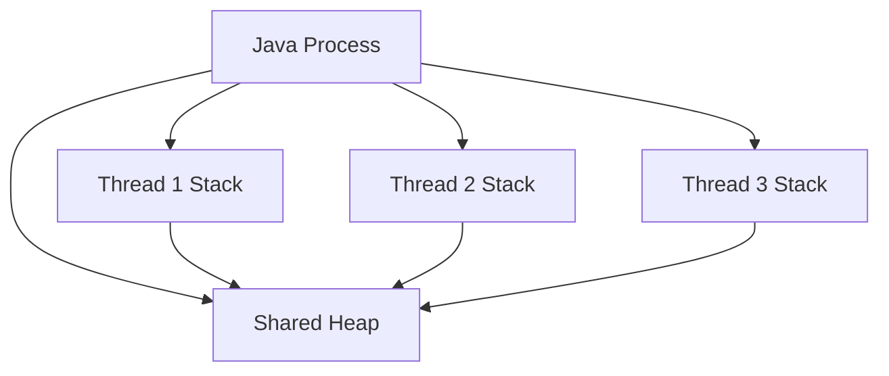

Shared data is exactly why concurrency correctness matters.

---

### 6.2 Thread Lifecycle — Interview Model

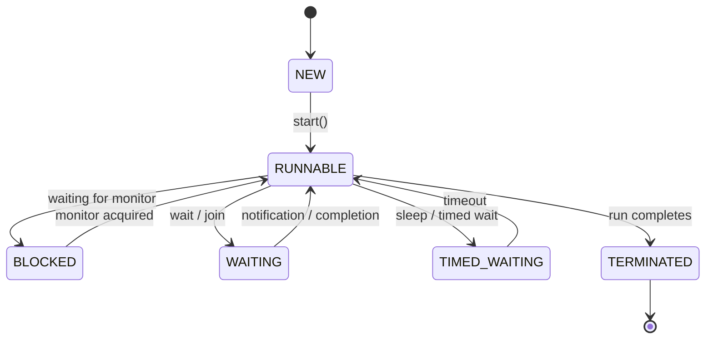

Do not overcomplicate state names unless asked.

---

### 6.3 Runnable vs Callable

## Runnable

```java
Runnable task = () -> doWork();
```

- does not directly return a result,
- `run()` does not declare checked exceptions.

## Callable

```java
Callable<Integer> task = () -> calculate();
```

- returns a value,
- may throw checked exceptions.

---

## Interview-Ready Answer

> Runnable represents work that does not return a result, while Callable can return a value and throw checked exceptions. In modern application code I normally submit these tasks to an ExecutorService rather than manually managing thread creation.

---

### 6.4 Why Thread Pools?

Creating an unbounded number of threads is expensive and dangerous.

Thread pools provide:

- controlled concurrency,
- thread reuse,
- task queueing,
- lifecycle management,
- resource protection.

---

## Basic Example

```java
ExecutorService executor =
        Executors.newFixedThreadPool(4);

Future<Integer> future =
        executor.submit(() -> calculate());

Integer result = future.get();

executor.shutdown();
```

---

## Senior Insight

Do not select pool size by guesswork.

Ask:

- CPU-bound or I/O-bound?
- expected concurrency?
- task duration?
- blocking behavior?
- downstream capacity?
- latency requirements?
- queue behavior?
- rejection strategy?

Thread pools are also **back-pressure and resource-control decisions**.

---

### 6.5 CPU-Bound vs I/O-Bound

## CPU-Bound

Work spends most time computing.

Examples:

- encryption,
- image transformation,
- heavy calculations.

Too many threads can increase context switching rather than improve throughput.

---

## I/O-Bound

Work spends significant time waiting.

Examples:

- database,
- remote API,
- file/network I/O.

A greater degree of concurrency may be useful because threads often wait.

But downstream capacity still matters.

---

### 6.6 Race Condition

A race condition occurs when the result depends on unpredictable timing between concurrent operations.

Example:

```java
count++;
```

looks simple but conceptually involves:

```text
read
→ increment
→ write
```

Two threads can interleave these steps.

---

### 6.7 Atomicity, Visibility, Ordering

These three words are important.

## Atomicity

An operation appears indivisible.

## Visibility

When one thread changes data, when can another thread see the change?

## Ordering

Can compiler/runtime optimizations reorder operations while preserving single-thread semantics?

The Java Memory Model defines rules around these concerns.

For interview purposes:

> Concurrency is not only “two threads writing at the same time.”  
> It also involves visibility and ordering guarantees.

---

### 6.8 `synchronized`

`synchronized` provides mutual exclusion around a monitor and establishes important memory-visibility guarantees around lock acquisition/release.

Example:

```java
public synchronized void increment() {
    count++;
}
```

or:

```java
synchronized (lock) {
    count++;
}
```

---

## Use When

You need to protect a critical section involving shared mutable state.

---

## Cost / Trade-Off

Poor locking design may cause:

- contention,
- reduced throughput,
- deadlock risk,
- long wait times.

Keep critical sections small and well-defined.

---

### 6.9 `volatile`

`volatile` is mainly about visibility and ordering for reads/writes of that variable.

Example:

```java
private volatile boolean running = true;
```

One thread:

```java
while (running) {
    // work
}
```

Another:

```java
running = false;
```

---

## Critical Trap

`volatile` does **not** make compound operations such as this atomic:

```java
count++;
```

because increment is read-modify-write.

---

## Interview-Ready Answer

> `volatile` is useful when threads need visibility of the latest value and the operation does not require a larger atomic critical section. `synchronized` provides mutual exclusion as well as visibility guarantees. I would not use volatile to protect a compound update such as incrementing a shared counter.

---

### 6.10 `AtomicInteger`

For simple atomic operations:

```java
AtomicInteger count =
        new AtomicInteger();

count.incrementAndGet();
```

This avoids using an explicit synchronized block for that simple counter operation.

---

## Senior Insight

Atomic classes are excellent for certain state transitions and counters.

They do not automatically solve complex multi-variable invariants.

If multiple values must change together consistently, you need an appropriate synchronization/design strategy.

---

### 6.11 Lock API

Example:

```java
Lock lock = new ReentrantLock();

lock.lock();

try {
    // critical section
} finally {
    lock.unlock();
}
```

Why use explicit locks?

They can provide capabilities such as:

- timed acquisition,
- interruptible acquisition,
- multiple condition variables,
- explicit lock management.

---

## Interview-Ready Answer

> `synchronized` is usually simpler and should remain the default when it solves the problem clearly. Explicit Lock implementations are useful when I need capabilities such as `tryLock`, interruptible acquisition, or more flexible coordination. I would choose based on the concurrency requirement rather than because one API appears more advanced.

---

### 6.12 Deadlock

Deadlock occurs when threads wait indefinitely for resources held by each other.

---

## Visualization

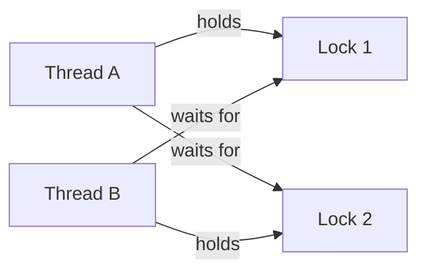

---

## Classic Example

Thread A:

```text
lock(accountA)
→ wait for accountB
```

Thread B:

```text
lock(accountB)
→ wait for accountA
```

---

## Prevention

Prefer:

- consistent lock ordering,
- fewer nested locks,
- smaller critical sections,
- timeout / `tryLock` where appropriate,
- immutable data,
- message-based or partitioned designs where possible.

---

## Interview-Ready Answer

> A deadlock occurs when threads form a circular wait for resources. A practical prevention technique is to establish a consistent lock-acquisition order. I also try to minimize nested locks and reduce shared mutable state because the best deadlock prevention is often simpler concurrency design.

---

### 6.13 ConcurrentHashMap

Use when multiple threads genuinely share and update a map concurrently.

Example:

```java
ConcurrentHashMap<String, Integer> counts =
        new ConcurrentHashMap<>();

counts.merge("SUCCESS", 1, Integer::sum);
```

Do not write fragile logic such as:

```java
if (!map.containsKey(key)) {
    map.put(key, value);
}
```

when a single atomic map operation can express the intent.

Prefer appropriate atomic APIs:

```java
putIfAbsent
computeIfAbsent
compute
merge
```

---

## 7. CompletableFuture

### 7.1 Why It Exists

`Future` allows retrieving an asynchronous result, but composing multiple asynchronous steps with plain Future becomes awkward.

`CompletableFuture` supports pipelines and composition.

---

### 7.2 Basic Example

```java
CompletableFuture<String> future =
        CompletableFuture.supplyAsync(
            () -> loadUser()
        );

CompletableFuture<Integer> length =
        future.thenApply(String::length);
```

---

### 7.3 `thenApply`

Transform a completed value.

```text
T → R
```

Example:

```java
future.thenApply(User::getName);
```

---

### 7.4 `thenCompose`

Use when the next operation itself returns a `CompletableFuture`.

Without composition you may get:

```text
CompletableFuture<CompletableFuture<Result>>
```

With `thenCompose`:

```text
CompletableFuture<Result>
```

Think:

> asynchronous `flatMap`.

---

### 7.5 `thenCombine`

Combine two independent asynchronous results.

```java
CompletableFuture<User> userFuture = ...;
CompletableFuture<List<Order>> orderFuture = ...;

CompletableFuture<UserSummary> summary =
    userFuture.thenCombine(
        orderFuture,
        UserSummary::new
    );
```

---

### 7.6 Exception Handling

Options include:

```java
exceptionally(...)
handle(...)
whenComplete(...)
```

Example:

```java
future.exceptionally(ex -> fallback());
```

---

### 7.7 Senior Insight — Executor Choice

Do not blindly use:

```java
supplyAsync(...)
```

everywhere.

For production systems, understand:

- which executor runs the task,
- whether tasks block,
- pool capacity,
- queueing,
- downstream limits,
- timeouts,
- cancellation,
- observability.

Asynchrony does not create infinite capacity.

---

### 7.8 Interview-Ready Answer

> CompletableFuture is useful for building asynchronous pipelines and composing dependent or independent tasks. I use `thenApply` for synchronous transformation of a completed value, `thenCompose` when the next step is itself asynchronous, and `thenCombine` when independent asynchronous operations can be combined. In production I also pay attention to executor selection, timeouts, exception handling and downstream capacity.

---

## 8. JVM Fundamentals

### 8.1 Class Loading

Simplified flow:

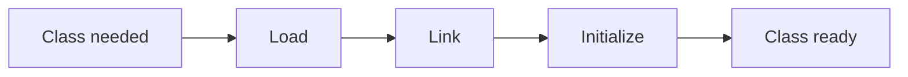

Interview-level explanation:

- **Loading** — class bytes are located and loaded.
- **Linking** — verification/preparation/resolution activities.
- **Initialization** — static initialization executes as required.

Do not go into class-loader hierarchy unless asked.

---

### 8.2 Stack

Each thread has its own stack.

A method call creates a frame containing execution-related data such as:

- local variables,
- intermediate values,
- return information.

When the method returns, that frame is removed.

---

### 8.3 Heap

The heap stores objects and arrays in the normal interview model.

The heap is managed by the JVM and garbage collector.

Multiple threads can reference the same heap object.

---

### 8.4 Metaspace

Metaspace stores class metadata.

It replaced the older PermGen model in modern Java.

For interview purposes:

> Heap problems and metaspace problems are different categories.

---

### 8.5 JIT

The JVM can identify frequently executed code and compile/optimize it into native machine code.

Think:

```text
Bytecode
→ observe execution
→ identify hot code
→ compile / optimize
```

---

## Interview-Ready Answer

> Java initially works from bytecode through the JVM runtime, and the JIT compiler can optimize frequently executed code into native machine code based on runtime behavior. That is one reason JVM applications may behave differently during warm-up compared with steady-state execution.

---

### 8.6 Garbage Collection

Garbage collection reclaims memory occupied by objects that are no longer reachable.

Do not say:

> “GC deletes objects with null values.”

Reachability is the important concept.

---

## Visualization

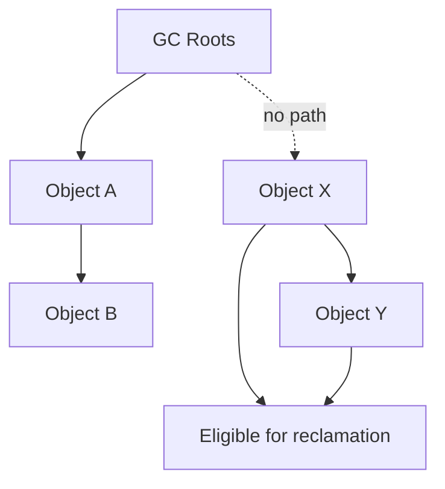

If an object is no longer reachable from relevant roots, it can become eligible for collection.

---

### 8.7 Can Java Have Memory Leaks?

Yes.

Garbage collection does not prevent all memory leaks.

A Java application can retain references to objects it no longer logically needs.

Examples:

- unbounded cache,
- static collection retaining objects,
- listeners never removed,
- thread-local retention,
- queues growing indefinitely,
- application-level reference cycles that remain reachable.

---

## Visualization

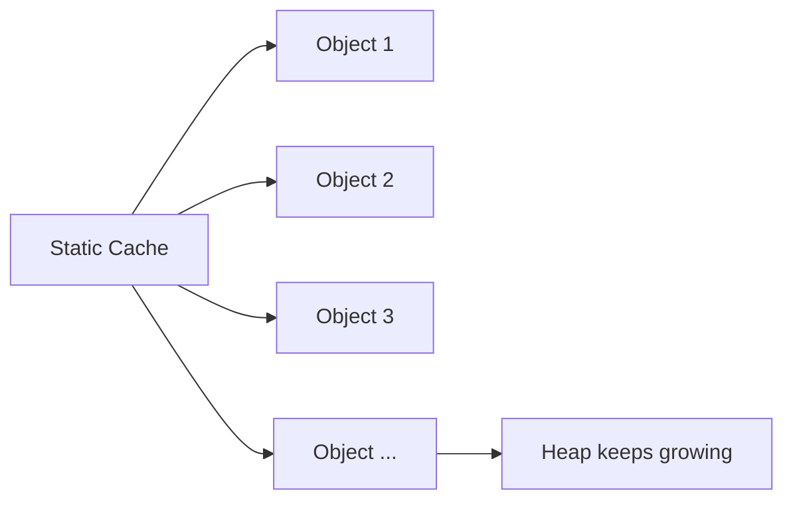

The GC sees those objects as reachable.

Therefore it cannot reclaim them.

---

### 8.8 StackOverflowError vs OutOfMemoryError

## StackOverflowError

Commonly caused by excessive/deep recursion or exhausted thread stack.

## OutOfMemoryError

The JVM cannot satisfy a memory allocation requirement.

Possible categories include:

- heap exhaustion,
- metaspace exhaustion,
- inability to create native threads,
- other resource-related cases.

Do not reduce every OOM to:

> “Heap full.”

---

## 9. Production Troubleshooting

### 9.1 Scenario — CPU Is High

Ask:

1. Which process?
2. Which threads?
3. Is CPU consistently high or spiking?
4. Is there a tight loop?
5. Excessive serialization?
6. Heavy computation?
7. Excessive GC?
8. Lock contention?
9. Traffic increase?
10. External retry storm?

---

## Investigation Mental Model

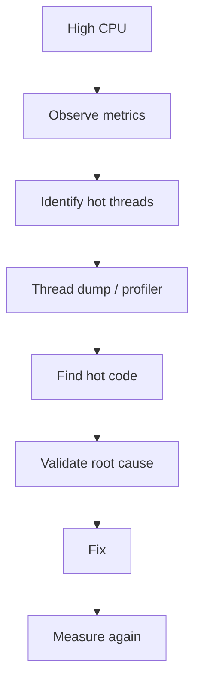

---

### 9.2 Scenario — Memory Keeps Growing

Think:

```text
Metric
→ heap trend
→ GC behavior
→ heap dump
→ retained objects
→ reference path
→ root cause
→ fix
→ verify
```

Potential causes:

- cache without eviction,
- collection growth,
- retained listeners,
- object accumulation,
- queue backlog,
- large payload retention.

---

### 9.3 Scenario — Application Is Slow but CPU Is Low

Possible causes:

- waiting on database,
- waiting on external API,
- blocked threads,
- lock contention,
- exhausted connection pool,
- thread-pool starvation,
- slow disk/network,
- downstream timeout.

Senior engineers do not equate:

> **slow = high CPU**

---

### 9.4 Thread Dump vs Heap Dump

## Thread Dump

Useful for:

- deadlock,
- blocked threads,
- waiting states,
- thread-pool starvation,
- high CPU thread analysis.

## Heap Dump

Useful for:

- memory retention,
- object counts,
- dominant object graphs,
- leak investigation.

---

## 10. Project Mapping

This section is evidence-first.

The résumé supplied to the interview panel supports:

- performance optimization,
- production support,
- distributed systems,
- caching,
- asynchronous processing,
- resilient integration,
- observability,
- Node.js/TypeScript/React/Azure work,
- earlier Java/Kotlin application development.

It does **not** explicitly prove a named recent Java multithreading implementation or a specific CompletableFuture production use case.

Therefore:

## Safe Connection

> My broader engineering work has involved asynchronous processing, performance optimization, production troubleshooting and distributed systems. In Java-specific discussions I can explain the concurrency mechanisms and their engineering trade-offs, while I would only map them to a named project where I actually used that mechanism.

That answer is credible.

---

## Candidate Validation Table

Before using a specific project story, verify your real experience:

| Topic | Real Project / Example |
|---|---|
| ExecutorService | __________________ |
| CompletableFuture | __________________ |
| synchronized | __________________ |
| volatile | __________________ |
| ConcurrentHashMap | __________________ |
| Thread pool tuning | __________________ |
| Memory issue | __________________ |
| High CPU issue | __________________ |
| Deadlock / blocked thread investigation | __________________ |
| Stream optimization | __________________ |

Leave a row blank rather than inventing an example.

---

## 11. Interview-Ready Answers

### Q1. What is a functional interface?

> A functional interface has one abstract method and can therefore be represented using a lambda expression. Common examples are Predicate, Function, Consumer and Supplier. It lets us pass behavior cleanly without unnecessary anonymous-class boilerplate.

---

### Q2. What is the difference between `map` and `flatMap`?

> `map` transforms one element into one result. `flatMap` is useful when each element produces a nested stream or collection and I want one flattened result. I think of map as T to R, and flatMap as T to Stream of R that becomes one combined Stream of R.

---

### Q3. Are Streams faster than loops?

> Not inherently. Streams provide a declarative processing model and can improve readability, but performance depends on the workload, allocations, pipeline operations and execution mode. I would choose the clearer implementation first and measure if performance matters.

---

### Q4. Would you use parallel streams for performance?

> Only after validating that the workload is suitable and measuring the result. I would consider dataset size, CPU cost, ordering, shared state and the execution resources being used. Parallelism can create overhead or resource contention, so it is not an automatic optimization.

---

### Q5. When should I use Optional?

> I use Optional mainly when an API needs to express that a return value may legitimately be absent. It makes that absence explicit to the caller. I avoid putting Optional everywhere in fields and DTOs without a specific design reason.

---

### Q6. Runnable vs Callable?

> Runnable represents work that does not return a value, while Callable can return a result and throw checked exceptions. I normally submit either to an executor rather than creating unmanaged threads manually.

---

### Q7. Why use ExecutorService?

> ExecutorService separates task submission from thread management. It lets us control concurrency, reuse threads, queue tasks and manage shutdown instead of creating a new thread for every request or task. The important production decision is choosing pool and queue behavior according to the workload.

---

### Q8. `synchronized` vs `volatile`?

> `volatile` provides visibility and ordering guarantees for reads and writes of that variable, but it does not make compound operations such as increment atomic. `synchronized` provides mutual exclusion around a critical section and also establishes visibility guarantees. I choose volatile for simple visibility state and synchronization when a larger invariant must be protected.

---

### Q9. What is a race condition?

> A race condition occurs when correctness depends on unpredictable timing between concurrent operations. A common example is two threads performing a read-modify-write on the same counter and losing an update. The solution depends on the invariant and may involve synchronization, atomic operations, immutability or redesigning shared state.

---

### Q10. What is deadlock?

> Deadlock occurs when threads form a circular wait for resources and none can make progress. A common prevention strategy is consistent lock ordering. I also try to minimize nested locking and shared mutable state because simpler concurrency design reduces the opportunity for deadlock.

---

### Q11. AtomicInteger vs synchronized counter?

> AtomicInteger is useful for simple atomic operations such as incrementing a shared counter without writing an explicit synchronized block. If multiple variables or a larger business invariant must change together, an atomic counter alone is not enough and I would use an appropriate synchronization or design strategy.

---

### Q12. What is CompletableFuture?

> CompletableFuture supports asynchronous pipelines and composition. I use `thenApply` to transform a completed result, `thenCompose` when the next operation is also asynchronous, and `thenCombine` to combine independent asynchronous results. In production I also consider executor choice, timeout, failure handling and downstream capacity.

---

### Q13. Stack vs heap in JVM?

> Each thread has its own stack containing method frames and local execution state, while objects are generally allocated on the shared heap. Heap objects are managed by the garbage collector and may be referenced by multiple threads.

---

### Q14. What is JIT?

> The JIT compiler allows the JVM to optimize frequently executed bytecode into native machine code based on runtime behavior. This means hot code can become more optimized as the application runs.

---

### Q15. Can Java have a memory leak?

> Yes. Garbage collection removes unreachable objects, but an application can keep references to objects it no longer logically needs. Examples include unbounded caches, static collections, listener retention or queues that continuously grow. Those objects remain reachable, so the GC cannot reclaim them.

---

### Q16. How would you investigate a memory problem?

> I would first confirm the memory trend and GC behavior rather than immediately changing heap size. Then I would capture appropriate runtime evidence such as a heap dump, identify dominant retained objects and reference paths, find why those references remain reachable, fix the retention issue and verify the result under comparable load.

---

### Q17. How would you investigate a deadlock?

> I would capture a thread dump and inspect blocked threads, owned monitors or locks, and circular waiting relationships. After confirming the lock cycle, I would fix the locking design—often through consistent lock ordering, reducing nested locks or eliminating unnecessary shared mutable state.

---

## 12. Likely Follow-Ups

## Streams

- Intermediate vs terminal operation?
- What does lazy evaluation mean?
- `map` vs `flatMap`?
- `reduce` vs `collect`?
- Stateful vs stateless operation?
- Why can side effects in Streams be dangerous?
- When is a loop clearer?
- Why can parallel streams be risky?

---

## Concurrency

- What is a context switch?
- What is thread starvation?
- What is livelock?
- What is a daemon thread?
- What is `wait()` vs `sleep()`?
- Why must `wait()` be used with monitor ownership?
- What is a semaphore?
- What is `CountDownLatch`?
- What is `CyclicBarrier`?
- What is thread-local storage?
- What is the Java Memory Model?
- What does happens-before mean?
- Why is double-checked locking associated with `volatile`?

These are Level 2/3 questions.

Do not study all of them at equal depth unless the interviewer signals that direction.

---

## JVM

- What is class loading?
- What is Metaspace?
- What triggers GC?
- What are GC roots?
- What is a stop-the-world pause?
- StackOverflowError vs OutOfMemoryError?
- Heap dump vs thread dump?
- What is JIT warm-up?
- Can increasing heap size solve a memory leak?
- How do you identify excessive GC?

---

## 13. Common Interview Traps

## Trap 1

> “Streams are always faster than loops.”

Wrong.

---

## Trap 2

> “Parallel streams use multiple threads, therefore they are faster.”

Wrong.

Measure.

---

## Trap 3

> “volatile makes variables thread-safe.”

Too broad.

It gives visibility/order guarantees for the variable but does not make compound operations atomic.

---

## Trap 4

> “synchronized is slow, so never use it.”

Wrong.

Correctness first.

Use the simplest synchronization mechanism that satisfies the requirement, then measure contention if relevant.

---

## Trap 5

> “AtomicInteger solves concurrency.”

Only specific atomic state operations.

It does not solve arbitrary multi-object invariants.

---

## Trap 6

> “More threads means more throughput.”

Wrong.

It can mean:

- context switching,
- queue growth,
- database overload,
- downstream saturation,
- memory pressure.

---

## Trap 7

> “CompletableFuture means non-blocking.”

Not automatically.

The supplied task may still perform blocking I/O.

Asynchronous orchestration and non-blocking I/O are different concepts.

---

## Trap 8

> “GC prevents memory leaks.”

Wrong.

GC prevents manual deallocation of unreachable objects.

Reachable-but-unneeded objects can still leak memory.

---

## Trap 9

> “If memory is high, increase `-Xmx`.”

That may only delay failure.

Find the cause first.

---

## Trap 10

> “High CPU means we need more servers.”

Maybe.

First identify the cause.

---

## 14. Interviewer Intent

| Question | What the interviewer is really testing |
|---|---|
| Lambda | Modern Java fluency |
| Functional interface | Abstraction of behavior |
| Stream | Data-processing model |
| Parallel stream | Performance judgment |
| Optional | API design maturity |
| Runnable vs Callable | Concurrency basics |
| ExecutorService | Resource management |
| synchronized vs volatile | Memory-model understanding |
| Race condition | Correctness |
| Deadlock | Production awareness |
| CompletableFuture | Async composition |
| JIT | JVM understanding |
| Memory leak | Runtime maturity |
| Heap/thread dump | Troubleshooting ability |

---

## 15. Practical / Mini Mock Content

This section is for later practice only.

## Level 1 — Must Know

1. Explain lambda expressions.
2. What is a functional interface?
3. Predicate vs Function vs Consumer vs Supplier?
4. Explain a Stream pipeline.
5. `map` vs `flatMap`.
6. `reduce` vs `collect`.
7. When would you use Optional?
8. Runnable vs Callable.
9. Why use ExecutorService?
10. `synchronized` vs `volatile`.
11. What is a race condition?
12. What is deadlock?
13. What is CompletableFuture?
14. Stack vs heap.
15. Can Java have a memory leak?

---

## Level 2 — Follow-Up

16. Why can parallel streams make performance worse?
17. What does Stream laziness mean?
18. What is thread-pool starvation?
19. How would you size a thread pool?
20. Why isn't `count++` safe with volatile?
21. AtomicInteger vs synchronized?
22. Lock vs synchronized?
23. ConcurrentHashMap vs HashMap?
24. `thenApply` vs `thenCompose`.
25. `thenCombine` use case?
26. How would you detect a deadlock?
27. What is Metaspace?
28. What does JIT do?
29. Heap dump vs thread dump?
30. How would you investigate increasing heap usage?

---

## Level 3 — Engineering Deep Dive

31. Explain atomicity, visibility and ordering.
32. What is happens-before?
33. What can happen with an unbounded task queue?
34. Why can blocking calls inside a shared pool be dangerous?
35. How do executor choice and downstream capacity interact?
36. How can a cache produce a Java memory leak?
37. How could too many threads cause an OutOfMemoryError?
38. Why is GC tuning not the first step for every latency problem?
39. How can lock contention produce low CPU but high latency?
40. How would you validate that a concurrency optimization actually helped?

---

## 16. Quick Revision

## One-Page Memory Map

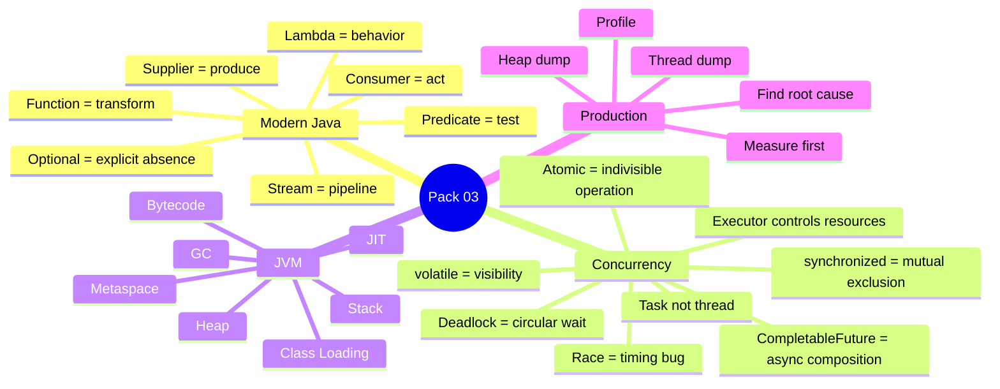

---

## 17. 90-Second Rapid Revision

```text
LAMBDA
behavior through functional interface

PREDICATE
test

FUNCTION
transform

CONSUMER
use

SUPPLIER
produce

STREAM
source -> intermediate -> terminal

PARALLEL
not automatically faster

OPTIONAL
explicit possible absence

THREAD POOL
control concurrency and resources

RUNNABLE
no result

CALLABLE
returns result

RACE
timing breaks correctness

synchronized
mutual exclusion + visibility

volatile
visibility / ordering, not compound atomicity

AtomicInteger
simple atomic counter/update

DEADLOCK
circular wait

CompletableFuture
compose async work

STACK
per-thread execution state

HEAP
objects / shared runtime memory

JIT
optimizes hot code

GC
reclaims unreachable objects

JAVA MEMORY LEAK
reachable but no longer needed

PRODUCTION RULE
observe -> evidence -> root cause -> fix -> measure
```

---

## 18. Candidate Answer Mapping

Use this only with real evidence.

| Topic | Safe Claim | Project Example | Risk |
|---|---|---|---|
| Modern Java fundamentals | Safe as Java competency | Validate actual project | Low |
| Streams | Safe as knowledge | Validate production use | Medium |
| Async processing | Supported broadly by résumé | Consulting/distributed platform | Low |
| Performance optimization | Supported by résumé | Consulting / Bechtel | Low |
| CompletableFuture | Validate specific use | __________________ | Medium |
| ExecutorService | Validate specific use | __________________ | Medium |
| Java thread tuning | Validate specific use | __________________ | High if invented |
| Deadlock troubleshooting | Validate specific incident | __________________ | High if invented |
| Memory investigation | Validate specific incident | __________________ | Medium |
| JVM tuning | Validate hands-on depth | __________________ | Medium |

---

## 19. Final Visualization

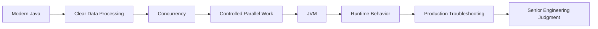

---

## 20. Golden Rules

> **Do not create a thread when what you really need is to submit a task.**

> **Do not add parallelism before measuring the workload.**

> **Do not use concurrency primitives without identifying the shared invariant you are protecting.**

> **Do not blame the garbage collector before collecting runtime evidence.**

> **Do not tune by intuition when production behavior can be measured.**

For a senior engineer:

> **Correctness → Resource Control → Measurement → Optimization**
