# VRIZE Interview Preparation — Pack 04
## Spring Boot + Spring Data JPA + Security

**Target Role:** Senior Fullstack Developer — Round 1  
**Candidate:** Deepak Kumar  
**Priority:** P0 — Must Know  
**Timebox:** 75–90 minutes study + later practice  
**Approach:** KIS + DRY + SOLID | Mind-Friendly | Interview-First | Evidence-First | No Bluff  
**Depth:** Level 1 Must Know → Level 2 Follow-Up → Level 3 Engineering Deep Dive

---

## Readiness Gate

Before this pack is considered ready, you should be able to:

- Explain Spring, Spring Boot, IoC, and Dependency Injection in simple language.
- Explain how a Spring Boot request moves from controller to database and back.
- Explain bean creation, component scanning, constructor injection, and scopes.
- Explain what Spring Boot auto-configuration does without calling it “magic”.
- Explain `@Component`, `@Service`, `@Repository`, `@RestController`, `@Configuration`, and `@Bean`.
- Explain configuration, profiles, validation, and global exception handling.
- Explain Spring Data JPA, entity state, repositories, transactions, lazy/eager loading, and the N+1 problem.
- Explain when `@Transactional` works and common proxy/self-invocation traps at interview level.
- Explain authentication vs authorization and a normal JWT request flow.
- Explain CORS vs CSRF without mixing them up.
- Explain how to make a Spring Boot service production-ready.
- Connect Spring concepts to a real project only where your actual experience supports the claim.

---

## 1. Objective

Pack 04 answers a critical senior-backend question:

> **“Can you build and reason about a production Spring Boot service, not just remember annotations?”**

The interviewer may start with:

> “What is Dependency Injection?”

and then move to:

> “Why constructor injection?”

> “How does Spring Boot auto-configuration work?”

> “Why is my JPA endpoint generating 300 queries?”

> “Where should `@Transactional` live?”

> “How would you secure this REST API?”

The mental flow for this pack is:

```text
Request
→ Spring container
→ application layers
→ data access
→ transaction
→ security
→ production behavior
```

---

## 2. Real-Life Analogy

Think of a well-run hotel.

- **Spring Container** = hotel management system that knows which staff/services exist.
- **Bean** = a managed staff member or service.
- **Dependency Injection** = management assigns the required staff instead of each employee hiring their own helpers.
- **Controller** = reception desk receiving requests.
- **Service** = operations team applying business rules.
- **Repository** = records desk interacting with stored data.
- **Spring Boot** = a ready-to-operate hotel setup with sensible defaults, embedded infrastructure, and configuration conventions.
- **Transaction** = “all steps of this booking succeed together, or the operation is rolled back.”
- **Security filter chain** = security desk checking identity and permissions before access.
- **Actuator/health checks** = operations dashboard showing whether the hotel is healthy.

The analogy gives us the mental picture.

Now map it to engineering.

---

## 3. Visualization

### 3.1 Spring Boot Request Flow

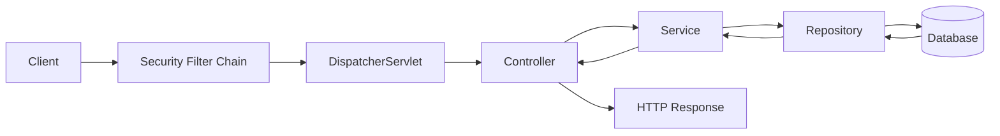

Remember:

> **Security → Web → Business → Data**

---

### 3.2 Dependency Injection

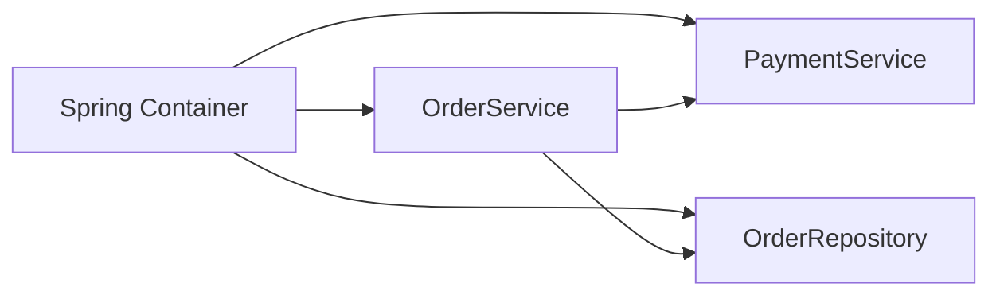

`OrderService` does not create its own dependencies.

The container supplies them.

---

### 3.3 Bean Creation — Simplified

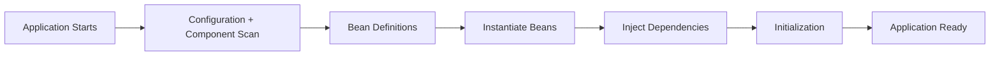

---

### 3.4 JPA Request Path

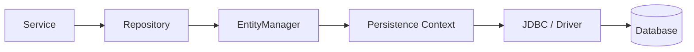

---

### 3.5 JWT Request Flow

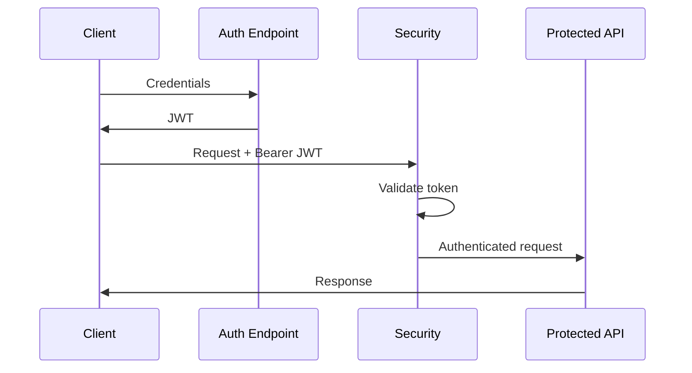

---

## 4. Mind Map

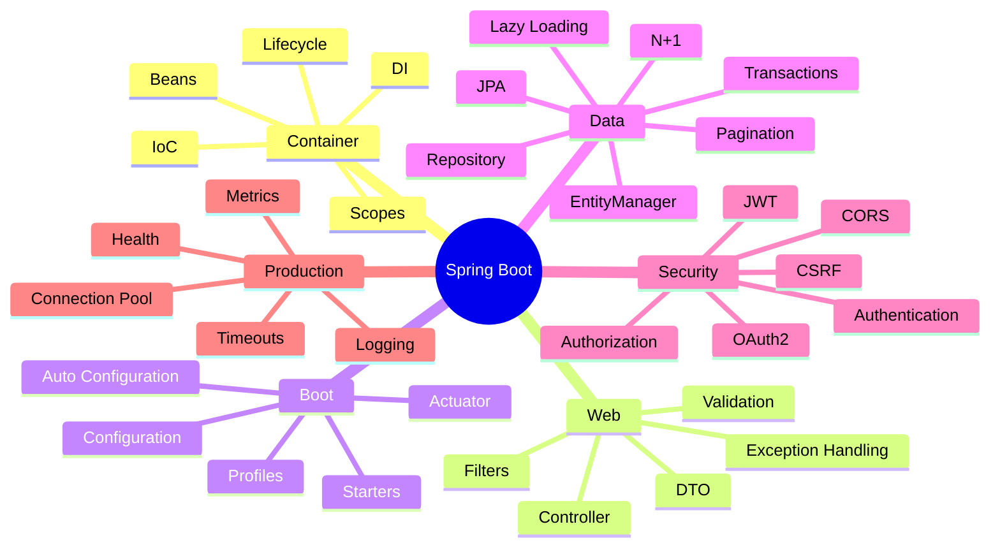

Five anchors:

> **Container → Web → Data → Security → Production**

---

## 5. Simple Explanation

### 5.1 Spring vs Spring Boot

**Spring Framework** provides the core programming model and infrastructure:

- IoC / Dependency Injection,
- web MVC,
- data access,
- transactions,
- security integration,
- testing support.

**Spring Boot** makes Spring applications easier to start and operate by providing:

- auto-configuration,
- starter dependencies,
- embedded server support,
- externalized configuration,
- production features.

### Interview-Ready Answer

> Spring is the broader application framework and programming model. Spring Boot builds on Spring and reduces setup by applying sensible auto-configuration, starter dependencies, embedded server support, and production conventions. Spring Boot does not replace Spring; it makes Spring applications faster to configure and operate.

---

### 5.2 IoC and Dependency Injection

**IoC — Inversion of Control**

Instead of application classes controlling object creation, that responsibility is moved to the framework/container.

**Dependency Injection**

The container supplies the dependencies required by an object.

Bad:

```java
public class OrderService {
    private final PaymentService paymentService =
            new CardPaymentService();
}
```

Better:

```java
@Service
public class OrderService {

    private final PaymentService paymentService;

    public OrderService(PaymentService paymentService) {
        this.paymentService = paymentService;
    }
}
```

### Why this is better

- loose coupling,
- easier testing,
- replaceable implementations,
- clearer dependencies,
- better adherence to Dependency Inversion.

### Interview-Ready Answer

> IoC means the framework takes responsibility for creating and wiring application components instead of each class constructing its own dependency graph. Dependency Injection is the mechanism through which those dependencies are supplied. In Spring I prefer constructor injection because required dependencies are explicit, testable, and can be kept final.

---

### 5.3 Why Constructor Injection?

Preferred:

```java
@Service
public class UserService {

    private final UserRepository repository;

    public UserService(UserRepository repository) {
        this.repository = repository;
    }
}
```

Benefits:

- dependencies are explicit,
- object can be valid immediately after construction,
- supports immutability with `final`,
- easy unit testing,
- avoids hidden field injection.

### Interview-Ready Answer

> I prefer constructor injection for required dependencies because it makes dependencies explicit, allows fields to remain final, supports straightforward unit testing, and avoids creating partially initialized objects. Setter injection can still be useful for genuinely optional dependencies.

---

### 5.4 Core Stereotype Annotations

| Annotation | Typical Responsibility |
|---|---|
| `@Component` | Generic managed component |
| `@Service` | Business/service layer |
| `@Repository` | Data access layer |
| `@Controller` | MVC controller |
| `@RestController` | REST controller |

`@Service` and `@Repository` improve semantic clarity.

`@Repository` also participates in persistence exception translation.

---

### 5.5 `@Configuration` and `@Bean`

Use when bean creation needs explicit configuration.

```java
@Configuration
public class AppConfig {

    @Bean
    public Clock clock() {
        return Clock.systemUTC();
    }
}
```

This is useful for:

- third-party classes,
- explicit infrastructure setup,
- configurable component creation.

---

### 5.6 Bean Scopes

Common scope:

**singleton**

One bean instance per Spring application context by default.

Other scopes include:

- prototype,
- request,
- session.

### Senior Insight

Singleton Spring beans are commonly shared across concurrent requests.

Therefore:

> avoid unsafe mutable request-specific state inside singleton services.

---

### 5.7 Spring Boot Auto-Configuration

Do not say:

> “Spring Boot automatically knows everything.”

A better model:

```text
Dependencies on classpath
+ application configuration
+ existing beans
+ conditional rules
→ auto-configured beans
```

### Visualization

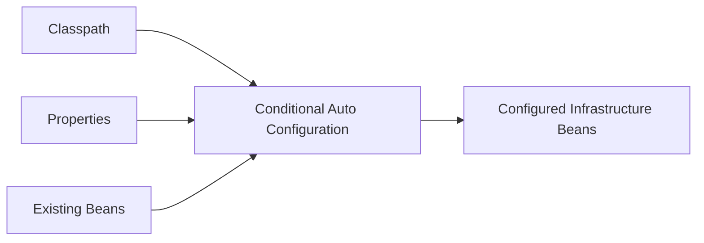

### Interview-Ready Answer

> Spring Boot auto-configuration uses conditional configuration to create common infrastructure beans based on the libraries available, configured properties, and beans already defined by the application. It gives useful defaults while allowing the application to override or replace configuration where needed.

---

### 5.8 Starter Dependencies

A starter groups commonly required dependencies.

Example:

```xml
<dependency>
    <groupId>org.springframework.boot</groupId>
    <artifactId>spring-boot-starter-web</artifactId>
</dependency>
```

The engineering value is dependency convenience and compatible ecosystem setup.

---

### 5.9 Configuration and Profiles

Typical configuration:

```yaml
server:
  port: 8080

spring:
  datasource:
    url: jdbc:postgresql://localhost:5432/app
```

Profiles allow environment-specific configuration:

```text
dev
test
staging
prod
```

Avoid storing secrets directly in source-controlled configuration.

Use an appropriate secrets-management mechanism.

---

## 6. Web Layer

### 6.1 Controller

```java
@RestController
@RequestMapping("/api/orders")
public class OrderController {

    private final OrderService service;

    public OrderController(OrderService service) {
        this.service = service;
    }

    @GetMapping("/{id}")
    public OrderResponse get(@PathVariable Long id) {
        return service.get(id);
    }
}
```

Controller responsibility:

- HTTP mapping,
- request parsing,
- validation boundary,
- response mapping.

Do not place core business logic in the controller.

---

### 6.2 DTO vs Entity

Avoid exposing persistence entities directly as API contracts by default.

Use DTOs when you need:

- API stability,
- validation boundaries,
- security control,
- response shaping,
- decoupling from persistence.

### Visualization

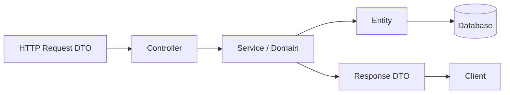

---

### 6.3 Validation

Example:

```java
public record CreateUserRequest(
        @NotBlank String name,
        @Email String email
) {}
```

Controller:

```java
@PostMapping
public ResponseEntity<UserResponse> create(
        @Valid @RequestBody CreateUserRequest request) {
    return ResponseEntity.ok(service.create(request));
}
```

Validation belongs at clear boundaries.

Business invariants still belong in the business/domain layer.

---

### 6.4 Global Exception Handling

```java
@RestControllerAdvice
public class GlobalExceptionHandler {

    @ExceptionHandler(UserNotFoundException.class)
    ResponseEntity<ApiError> handle(UserNotFoundException ex) {
        return ResponseEntity
                .status(HttpStatus.NOT_FOUND)
                .body(new ApiError("USER_NOT_FOUND", ex.getMessage()));
    }
}
```

Benefits:

- consistent error contract,
- controller stays clean,
- easier observability,
- centralized mapping from domain/application error to HTTP response.

### Senior Insight

Do not expose:

- stack traces,
- internal SQL errors,
- sensitive implementation details.

---

## 7. Spring Data JPA

### 7.1 Repository

```java
public interface UserRepository
        extends JpaRepository<User, Long> {

    Optional<User> findByEmail(String email);
}
```

Spring Data can generate implementations for many repository patterns.

But:

> repository convenience does not remove the need to understand SQL and database behavior.

---

### 7.2 Entity

```java
@Entity
@Table(name = "users")
public class User {

    @Id
    @GeneratedValue(strategy = GenerationType.IDENTITY)
    private Long id;

    private String name;

    private String email;
}
```

An entity represents persisted state managed through the persistence context.

Do not treat it as “just a DTO with annotations.”

---

### 7.3 Persistence Context

Think of the persistence context as a managed workspace for entity instances.

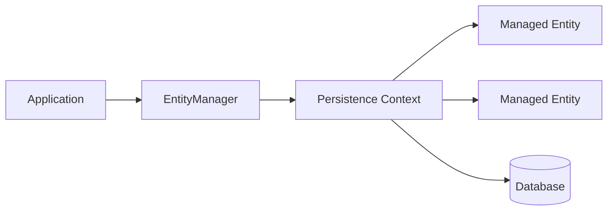

Within a persistence context, JPA tracks managed entities and can synchronize changes with the database.

---

### 7.4 Entity States — Interview Model

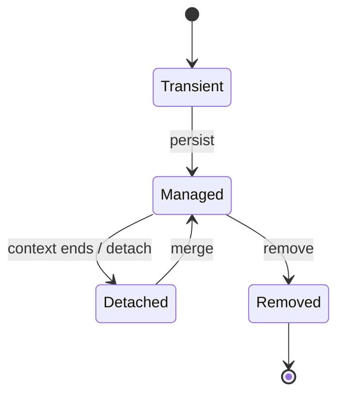

You do not need to turn this into a JPA specification lecture.

---

### 7.5 Lazy vs Eager Loading

**Lazy**

Related data is loaded when needed.

**Eager**

Related data is loaded immediately as part of the access pattern.

### Senior Rule

Do not answer:

> “Lazy is always better.”

The correct answer is:

> choose loading according to the use case and query shape.

Poor loading strategy can create:

- unnecessary data retrieval,
- N+1 queries,
- large object graphs,
- serialization problems.

---

### 7.6 N+1 Query Problem

Suppose we load 100 orders:

```text
1 query → orders
100 queries → customer for each order
```

Total:

```text
101 queries
```

### Visualization

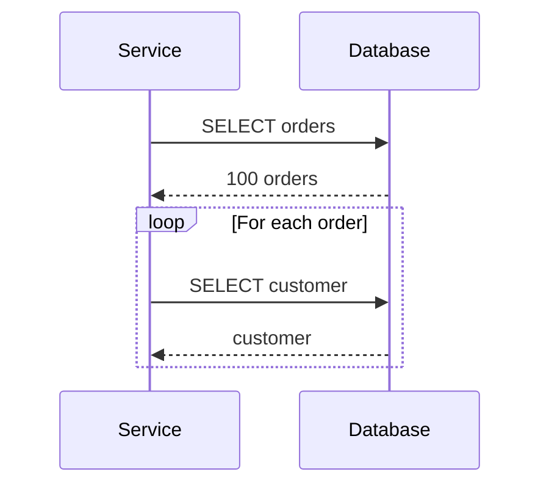

### Fix Options

Depending on use case:

- fetch join,
- entity graph,
- projection,
- batch fetching,
- redesign query.

### Interview-Ready Answer

> The N+1 problem occurs when one query loads a parent collection and then additional queries are issued for each related object. I confirm it through SQL/query metrics rather than guessing. The fix depends on the use case and can include a fetch join, entity graph, projection, or batch strategy. I avoid solving it by globally changing everything to eager loading.

---

### 7.7 Pagination

Repository:

```java
Page<User> findByActive(
        boolean active,
        Pageable pageable
);
```

For large datasets, avoid returning everything.

Senior considerations:

- stable sorting,
- indexes matching filtering/order,
- offset cost for deep pages,
- cursor/keyset pagination for appropriate high-scale cases.

---

## 8. Transactions

### 8.1 Transaction Mental Model

Bank transfer:

```text
Debit A
+
Credit B
=
both succeed
or
neither succeeds
```

---

### 8.2 `@Transactional`

```java
@Service
public class TransferService {

    @Transactional
    public void transfer(
            Account from,
            Account to,
            BigDecimal amount) {

        debit(from, amount);
        credit(to, amount);
    }
}
```

### What it gives conceptually

Spring creates a transaction boundary around the proxied method.

If the operation fails according to the configured rollback rules, the transaction can roll back.

---

### 8.3 Where Should Transactions Live?

Usually around a **business use case**, often in the service layer.

Bad mental model:

> “Every repository method needs `@Transactional`.”

Better:

> “Which operations must succeed or fail as one unit?”

---

### 8.4 Transaction Proxy Trap

A common interview trap:

```java
public void outer() {
    inner();
}

@Transactional
public void inner() {
    ...
}
```

If `inner()` is invoked through `this.inner()` inside the same proxied object, the call may bypass the proxy behavior expected for the transaction interceptor.

Interview message:

> understand that many Spring features such as transactions are applied through proxies/interceptors.

---

### 8.5 Keep Transactions Focused

Avoid holding a database transaction open while doing slow unrelated remote calls where possible.

Why?

- locks remain longer,
- connections stay occupied,
- contention increases,
- rollback scope becomes harder.

Design the business workflow carefully.

---

## 9. Spring Security

### 9.1 Authentication vs Authorization

**Authentication**

> Who are you?

**Authorization**

> What are you allowed to do?

Do not mix them.

---

### 9.2 Security Filter Chain

Security generally runs before the controller.

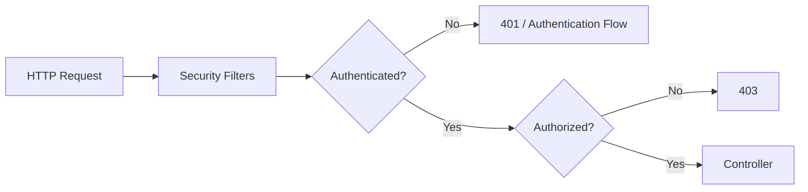

---

### 9.3 JWT

JWT is a token format often used for stateless API authentication.

Typical flow:

```text
authenticate
→ issue signed token
→ client sends Bearer token
→ validate signature/claims
→ establish authenticated principal
→ authorize request
```

### Important

Do not say:

> “JWT is encrypted.”

A normal signed JWT is not necessarily encrypted.

Sensitive data should not be placed in the token just because the token is signed.

---

### 9.4 401 vs 403

**401 Unauthorized**

Despite the name, typically means:

> authentication is missing/invalid.

**403 Forbidden**

Means:

> identity is known, but access is not allowed.

---

### 9.5 CORS

CORS is a browser-enforced cross-origin policy mechanism.

Example scenario:

```text
Frontend:
https://app.example.com

API:
https://api.example.com
```

The API can define which origins/methods/headers are permitted.

### Important

CORS is not an authentication mechanism.

---

### 9.6 CSRF

CSRF is an attack where a browser is induced to send an unwanted authenticated request using credentials that are automatically included.

It is especially relevant to cookie/session-based authentication.

### CORS vs CSRF

```text
CORS
→ which cross-origin browser requests are allowed?

CSRF
→ can an attacker cause the browser to perform an unwanted authenticated action?
```

Do not say:

> “Disable CSRF because REST.”

Security decisions depend on the authentication mechanism and application architecture.

---

### 9.7 Passwords

Passwords should not be stored in plaintext.

Use a suitable adaptive password hashing approach and framework-supported password encoders.

Do not log:

- passwords,
- access tokens,
- secrets.

---

## 10. Production-Ready Spring Boot

A service is not production-ready because:

```text
mvn package
```

succeeds.

### Production Mind Map

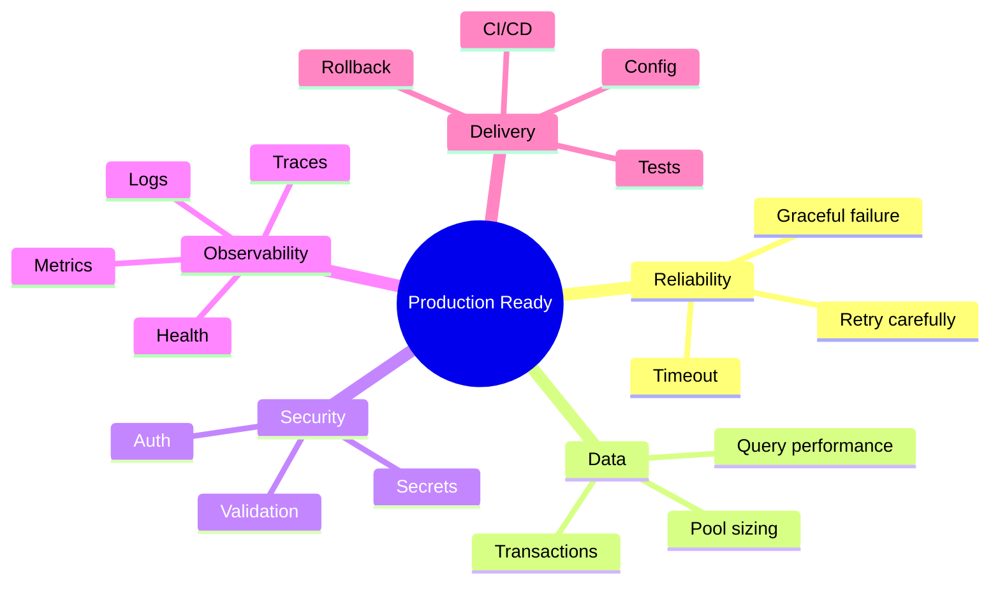

---

### 10.1 Actuator

Spring Boot Actuator can expose operational endpoints such as:

- health,
- metrics-related integration points,
- application information.

Do not expose sensitive operational endpoints publicly without security controls.

---

### 10.2 Logging

Useful production logs should help answer:

- what failed?
- where?
- for which request?
- why?
- how often?

Use correlation/request identifiers where appropriate.

Do not log sensitive data.

---

### 10.3 Connection Pool

Database connections are limited resources.

Poor configuration can cause:

- waiting,
- timeouts,
- database overload.

A larger pool is not automatically better.

Pool sizing must respect:

- application concurrency,
- query latency,
- database capacity,
- number of application instances.

---

### 10.4 Timeouts

Every remote dependency can become slow.

Use appropriate timeouts for:

- HTTP calls,
- database operations,
- messaging interactions where relevant.

Avoid infinite waiting.

---

## 11. Project Mapping

This section follows **Evidence First**.

The résumé available to the interview panel explicitly lists **Java, Kotlin, and Spring Boot** among your technology leadership competencies.

It also supports:

- REST API work,
- application architecture,
- security remediation,
- code review,
- performance optimization,
- CI/CD,
- production support,
- databases,
- cloud-native engineering.

However, the submitted employment bullets do **not clearly identify a recent named Spring Boot production project**.

Therefore:

### Safe Positioning

> Spring Boot is part of my backend technology background. My recent enterprise work has been stronger around Node.js, TypeScript, React, MongoDB and Azure, while my broader backend experience includes Java and Spring Boot concepts such as layered API design, dependency injection, persistence, transactions and security.

Use a stronger claim only if you can map it to a real project.

---

### Candidate Validation

Before naming a project, fill these from actual experience:

| Topic | Real Project / Evidence |
|---|---|
| Spring Boot service | __________________ |
| REST controller | __________________ |
| Dependency Injection | __________________ |
| JPA/Hibernate | __________________ |
| Transaction | __________________ |
| N+1/query tuning | __________________ |
| JWT/Spring Security | __________________ |
| Production incident | __________________ |
| Performance tuning | __________________ |
| CI/CD/deployment | __________________ |

Blank is safer than invented.

---

## 12. Interview-Ready Answers

### Q1. Spring vs Spring Boot?

> Spring is the broader framework providing dependency injection, web, data, transactions, security and other application infrastructure. Spring Boot builds on Spring and reduces configuration through starters, conditional auto-configuration, embedded server support and production conventions.

---

### Q2. What is Dependency Injection?

> Dependency Injection means an object's required collaborators are supplied from outside rather than created internally. In Spring the container manages that wiring. It reduces coupling, improves testability and makes implementation replacement easier.

---

### Q3. Why constructor injection?

> Constructor injection makes required dependencies explicit, allows them to remain final, avoids partially initialized objects and makes unit testing straightforward. I use setter injection only when a dependency is genuinely optional.

---

### Q4. `@Component` vs `@Service` vs `@Repository`?

> All represent Spring-managed components, but the specialized stereotypes communicate intent. `@Service` identifies business-layer components, while `@Repository` identifies persistence components and participates in persistence exception translation. I use the most meaningful stereotype rather than treating them as interchangeable labels.

---

### Q5. What is Spring Boot auto-configuration?

> Auto-configuration conditionally creates common infrastructure beans based on the classpath, configuration properties and beans already defined in the application. It provides sensible defaults but backs off where the application supplies its own configuration.

---

### Q6. What is a Spring bean?

> A bean is an object whose lifecycle is managed by the Spring container. The container creates it, injects its dependencies and applies relevant framework behavior around it.

---

### Q7. Why not put business logic in controllers?

> Controllers should primarily handle HTTP concerns. Keeping business logic in service/domain components improves reuse, testability and separation of concerns, and prevents transport-level details from becoming mixed with business rules.

---

### Q8. DTO vs Entity?

> An entity represents persistence state, while a DTO represents data crossing an application boundary. I avoid exposing entities directly by default because API contracts, validation, security and persistence design should be able to evolve independently.

---

### Q9. What is the N+1 problem?

> It occurs when one query loads a set of parent records and then additional queries are executed for related data for each parent. I confirm it through query evidence and fix it according to the use case using approaches such as fetch joins, entity graphs, projections or batching rather than globally switching everything to eager loading.

---

### Q10. Lazy vs eager loading?

> Lazy loading delays fetching related data until needed, while eager loading fetches it immediately. Neither is universally better. I choose based on the use case and query shape because poor loading decisions can cause N+1 queries or unnecessarily large object graphs.

---

### Q11. What does `@Transactional` do?

> It defines a transaction boundary around a Spring-managed operation. Through Spring's transaction infrastructure, the work can commit as one unit or roll back according to configured rules. I normally place the boundary around a business use case rather than scattering transactions without understanding the unit of consistency.

---

### Q12. Why can `@Transactional` fail on self-invocation?

> Spring commonly applies transactional behavior through a proxy. A method call from one method to another on the same object can bypass that proxy interception, so the expected transactional behavior may not be applied. The important point is understanding the proxy boundary rather than assuming the annotation itself changes the method.

---

### Q13. Authentication vs authorization?

> Authentication establishes who the caller is. Authorization determines what that authenticated caller is allowed to do.

---

### Q14. How does JWT authentication work?

> The user authenticates and receives a signed token. The client sends that token with subsequent requests, typically as a Bearer token. The server validates the signature and relevant claims, establishes the caller's identity, and then applies authorization rules. I also consider expiration, key management, token storage and revocation strategy where required.

---

### Q15. 401 vs 403?

> 401 normally means authentication is missing or invalid. 403 means the caller is authenticated but does not have permission for the requested operation.

---

### Q16. CORS vs CSRF?

> CORS controls which cross-origin browser requests are permitted by the server/browser policy. CSRF is about preventing an attacker from causing a browser to perform an unwanted authenticated action, especially where credentials such as cookies are sent automatically. They solve different security problems.

---

### Q17. How would you make a Spring Boot API production-ready?

> I look beyond the controller code: validation, consistent errors, authentication and authorization, secrets management, database/query behavior, connection-pool limits, timeouts, observability, health checks, automated tests, configuration by environment, secure deployment and rollback strategy.

---

## 13. Likely Follow-Ups

### Spring Core

- Bean lifecycle?
- Singleton vs prototype?
- What happens with multiple implementations of one interface?
- `@Primary` vs `@Qualifier`?
- Circular dependency?
- What is AOP?
- How do proxies work?
- JDK dynamic proxy vs class-based proxy?

### Spring Boot

- How do you override auto-configuration?
- What does `@SpringBootApplication` combine?
- How are properties bound?
- Profiles vs configuration properties?
- How do you externalize secrets?
- What is Actuator?

### JPA

- `save()` behavior?
- Persistence context?
- Dirty checking?
- `persist` vs `merge`?
- First-level cache?
- Optimistic vs pessimistic locking?
- `@Version`?
- JPQL vs native SQL?
- Projection?
- Fetch join?
- Pagination at scale?

### Transactions

- Propagation?
- Isolation?
- Checked exception rollback?
- Transaction across microservices?
- Why not keep a DB transaction open during a remote API call?

### Security

- OAuth2 vs JWT?
- Access token vs refresh token?
- Where do you store JWT in browser applications?
- How do you rotate signing keys?
- Method-level authorization?
- Password hashing?
- What is a security filter chain?

Do not study all Level 3 topics equally unless the interviewer goes there.

---

## 14. Common Interview Traps

### Trap 1

> “Spring Boot replaces Spring.”

Wrong.

Spring Boot builds on Spring.

---

### Trap 2

> “Dependency Injection means `@Autowired`.”

Too shallow.

DI is a design/runtime principle; `@Autowired` is one Spring mechanism.

---

### Trap 3

> “Field injection is easiest, so it is best.”

Prefer explicit constructor dependencies for required collaborators.

---

### Trap 4

> “Singleton bean means thread-safe.”

Wrong.

A singleton bean can still contain unsafe mutable state.

---

### Trap 5

> “JPA means we don't need SQL.”

Wrong.

Senior backend engineers must understand generated SQL and database behavior.

---

### Trap 6

> “Eager loading fixes N+1.”

It may replace N+1 with over-fetching or huge joins.

Fix the query for the use case.

---

### Trap 7

> “`@Transactional` works whenever the annotation is present.”

Wrong.

Understand proxy/interception boundaries and transaction configuration.

---

### Trap 8

> “JWT is encrypted.”

Not necessarily.

Signed and encrypted tokens are different concepts.

---

### Trap 9

> “CORS secures my API.”

CORS is not authentication or authorization.

---

### Trap 10

> “A bigger connection pool improves performance.”

Not necessarily.

It can overload the database.

---

## 15. Interviewer Intent

| Question | What is being tested |
|---|---|
| Spring vs Boot | Framework understanding |
| IoC / DI | Design fundamentals |
| Constructor injection | Maintainability/testability |
| Bean scope | Runtime/concurrency awareness |
| Auto-configuration | Spring Boot depth |
| Controller/service/repository | Layering |
| DTO vs entity | API design maturity |
| N+1 | ORM + SQL awareness |
| `@Transactional` | Consistency understanding |
| Self-invocation | Proxy knowledge |
| JWT | API security |
| CORS vs CSRF | Security precision |
| Actuator | Production awareness |
| Connection pool | Performance judgment |

---

## 16. Practical / Mini Mock Content

This is content for later practice. Do not execute it yet.

### Level 1 — Must Know

1. Explain Spring vs Spring Boot.
2. What is IoC?
3. What is Dependency Injection?
4. Why constructor injection?
5. What is a Spring bean?
6. Explain `@Component`, `@Service`, and `@Repository`.
7. What does auto-configuration do?
8. Explain controller → service → repository.
9. DTO vs entity?
10. What is JPA?
11. Lazy vs eager loading?
12. Explain N+1.
13. What does `@Transactional` do?
14. Authentication vs authorization?
15. Explain JWT.
16. 401 vs 403?
17. CORS vs CSRF?

### Level 2 — Follow-Up

18. What happens if two beans implement the same interface?
19. Bean scopes?
20. Why can singleton mutable state be dangerous?
21. What is persistence context?
22. How does dirty checking work conceptually?
23. `persist` vs `merge`?
24. How do you fix N+1?
25. Where should a transaction boundary live?
26. Why is self-invocation a problem with transaction proxies?
27. How would you secure actuator endpoints?
28. How would you design consistent API errors?
29. How do you manage environment-specific config?
30. How would you investigate a slow JPA endpoint?

### Level 3 — Engineering Deep Dive

31. Explain optimistic locking.
32. When would pessimistic locking be justified?
33. How do transaction isolation levels affect behavior?
34. What happens when a remote API call occurs inside a DB transaction?
35. How would you prevent connection-pool exhaustion?
36. How would you design JWT refresh?
37. How would you rotate signing keys?
38. How would you trace one request across services?
39. How would you make a Spring Boot API resilient to a slow dependency?
40. How would you prove a query optimization helped?

---

## 17. Quick Revision

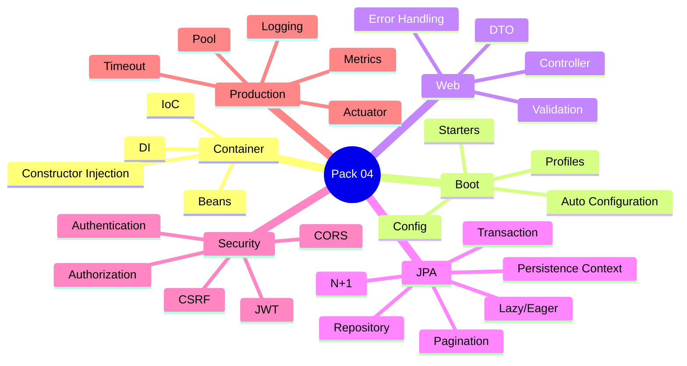

---

## 18. 90-Second Rapid Revision

```text
SPRING
framework

SPRING BOOT
Spring + auto-configuration + starters + production conventions

IoC
container controls object creation

DI
dependencies supplied from outside

CONSTRUCTOR INJECTION
explicit + final + testable

BEAN
container-managed object

CONTROLLER
HTTP boundary

SERVICE
business/use-case logic

REPOSITORY
data access

DTO
API contract

ENTITY
persistence state

JPA
ORM/persistence abstraction — still understand SQL

LAZY / EAGER
choose by query use case

N+1
1 parent query + many child queries

TRANSACTION
business work succeeds/fails as one unit

AUTHENTICATION
who are you?

AUTHORIZATION
what may you do?

JWT
signed token commonly used for stateless API auth

401
not authenticated

403
authenticated but forbidden

CORS
browser cross-origin policy

CSRF
unwanted authenticated browser action

PRODUCTION
security + data + timeout + observability + health + deployment
```

---

## 19. Candidate Answer Mapping

| Area | Safe Claim | Evidence / Mapping | Risk |
|---|---|---|---|
| Spring Boot knowledge | Safe as listed competency | Resume technology section | Low |
| Java backend concepts | Safe as broader background | Resume + prior Java/Kotlin work | Low |
| Recent Bechtel Spring Boot service | Not established | Validate personally | High if claimed |
| JPA production use | Validate project | __________________ | Medium |
| Transaction debugging | Validate incident | __________________ | Medium |
| Spring Security/JWT | Validate implementation | __________________ | Medium |
| N+1 optimization | Validate real example | __________________ | Medium |
| API/security/performance mindset | Supported broadly | Bechtel/consulting experience | Low |
| Production support | Supported | Resume | Low |
| CI/CD/observability | Supported broadly | Resume | Low |

---

## 20. Final Visualization

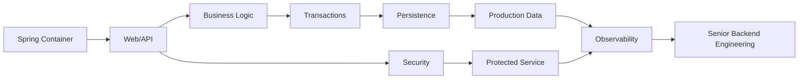

---

## Golden Rules

> **Do not explain Spring as a collection of annotations. Explain the container and runtime behavior.**

> **Do not use JPA as an excuse to ignore SQL.**

> **Do not make every relationship eager to solve one query problem.**

> **Do not put a transaction around more work than the consistency boundary requires.**

> **Do not call JWT, CORS, and CSRF the same security problem.**

> **Do not claim a Spring Boot project that you cannot defend.**

For a senior engineer:

> **Design boundary → framework behavior → database behavior → security → production evidence**
