# VRIZE Interview Preparation — Pack 05
## REST APIs + Microservices

**Target Role:** Senior Fullstack Developer — Round 1  
**Candidate:** Deepak Kumar  
**Priority:** P0 — Must Know  
**Timebox:** 75–90 minutes study + later practice  
**Approach:** KIS + DRY + SOLID | Mind-Friendly | Interview-First | Evidence-First | No Bluff  
**Depth:** Level 1 Must Know → Level 2 Follow-Up → Level 3 Engineering Deep Dive

---

## Readiness Gate

Before this pack is considered ready, you should be able to:

- Explain REST in simple engineering language.
- Choose correct HTTP methods and status codes.
- Explain idempotency and why it matters in retries.
- Design a clean request/response contract.
- Explain pagination, filtering, sorting, and versioning.
- Explain validation and consistent API error responses.
- Explain authentication/authorization boundaries at API level.
- Explain rate limiting, caching, timeout, retry, and circuit breaker.
- Explain monolith vs microservices without treating microservices as automatically better.
- Explain service boundaries and database-per-service.
- Explain synchronous vs asynchronous service communication.
- Explain eventual consistency and distributed transaction challenges.
- Explain API Gateway and service-to-service failure handling.
- Connect API/microservice answers to a real project only where your actual experience supports the claim.

---

## 1. Objective

This pack answers a core senior full-stack question:

> **“Can you design APIs and service boundaries that remain reliable in production?”**

An interviewer may start with:

> “What is REST?”

and quickly move to:

> “What happens if a client retries a POST after a timeout?”

> “How do you version APIs?”

> “How do microservices communicate?”

> “What if one downstream service is unavailable?”

> “How do you avoid tight coupling between services?”

The mental flow is:

```text
Client
→ API contract
→ validation
→ business service
→ data
→ downstream services
→ failure handling
→ observability
```

---

## 2. Real-Life Analogy

Think of a restaurant chain.

### REST API

The **menu** is the contract.

The customer does not need to know how the kitchen is organized.

They only need to know:

- what can be ordered,
- how to order it,
- what response to expect.

### Microservices

Instead of one huge kitchen doing everything, there may be separate specialized stations:

- orders,
- payments,
- inventory,
- delivery,
- notifications.

Each station owns its responsibility.

But specialization creates a new problem:

> the stations now have to coordinate.

That is exactly the trade-off with microservices.

---

## 3. Visualization

### 3.1 REST Request Flow

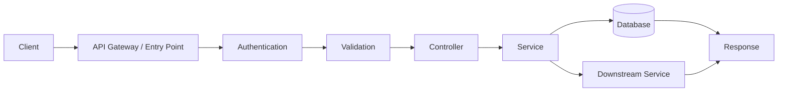

---

### 3.2 Resource-Oriented API

```mermaid
flowchart TD
    A[/orders] --> B[GET list orders]
    A --> C[POST create order]
    D[/orders/{id}] --> E[GET one order]
    D --> F[PUT/PATCH update order]
    D --> G[DELETE order]
```

---

### 3.3 Microservice Architecture — Simplified

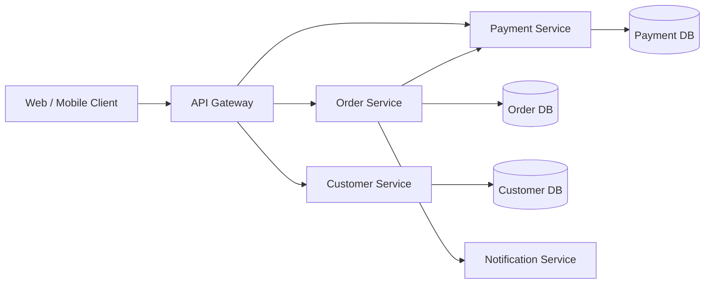

---

### 3.4 Failure Handling

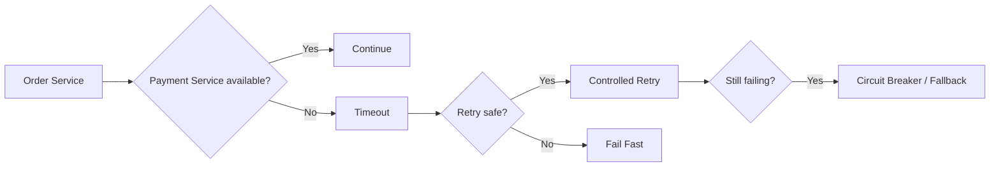

---

## 4. Mind Map

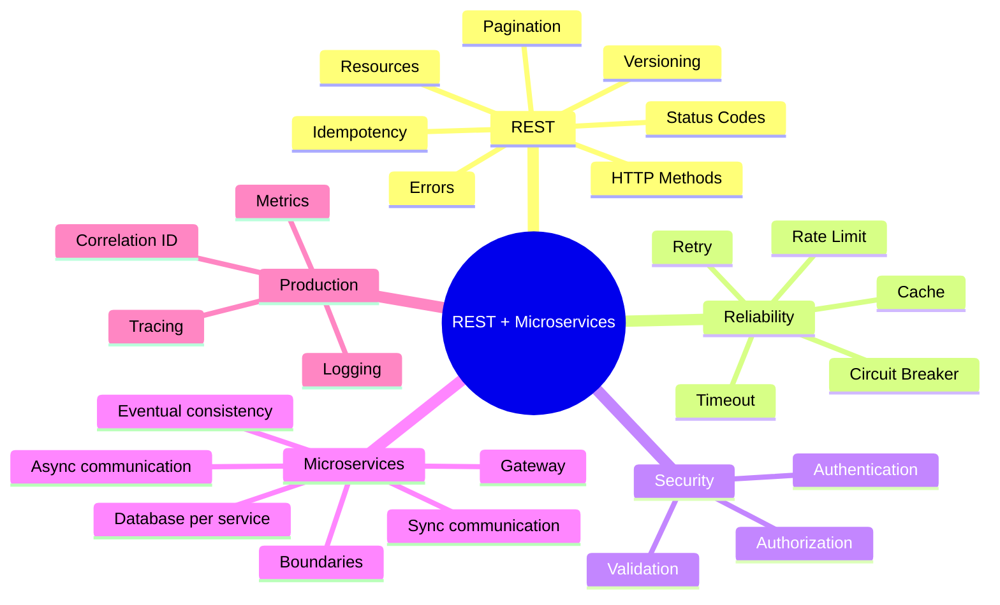

Five anchors:

> **Contract → Reliability → Security → Service Boundaries → Production**

---

## 5. Simple Explanation — REST

### 5.1 What Is REST?

REST is an architectural style for building networked systems around **resources** and standard HTTP semantics.

Example resource:

```text
/orders/123
```

The API should communicate clearly through:

- URI,
- HTTP method,
- status code,
- headers,
- request body,
- response body.

### Interview-Ready Answer

> REST is an architectural style where APIs expose resources through standard HTTP semantics. I focus on clear resource modeling, correct methods and status codes, stateless requests, consistent contracts, and predictable error behavior rather than treating REST as simply “JSON over HTTP”.

---

## 6. HTTP Methods

### GET

Read a resource.

```http
GET /orders/123
```

Should not change server state as part of normal semantics.

---

### POST

Create a resource or trigger a non-idempotent command.

```http
POST /orders
```

---

### PUT

Replace/update a resource at a known URI.

Usually treated as idempotent.

---

### PATCH

Partially update a resource.

Whether a specific PATCH operation is idempotent depends on how it is designed.

---

### DELETE

Delete a resource.

HTTP semantics treat DELETE as idempotent even if the first call changes state and later calls find nothing left to delete.

---

## 7. Safe and Idempotent

### Safe

A safe method should not intentionally change server state.

Typical example:

```text
GET
```

### Idempotent

Repeating the same request has the same intended effect as performing it once.

Typical idempotent methods:

```text
GET
PUT
DELETE
```

POST is not inherently idempotent.

---

## 8. Idempotency — Senior Interview Topic

### Real-Life Analogy

You click **Pay**.

The network times out.

Did the payment fail?

Or did the server process it but the response never reach you?

If you retry blindly, you may charge twice.

---

### Visualization

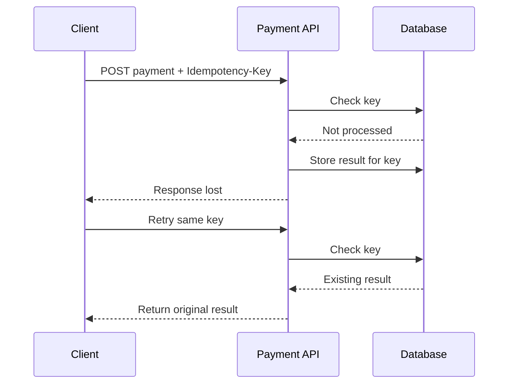

### Interview-Ready Answer

> Idempotency is critical when clients or infrastructure may retry requests. For naturally non-idempotent operations such as payment creation, I can use an idempotency key so repeated requests with the same logical operation do not create duplicate side effects.

---

## 9. HTTP Status Codes

Do not memorize every status code.

Know the common ones clearly.

| Status | Meaning |
|---|---|
| `200 OK` | Successful request |
| `201 Created` | Resource created |
| `202 Accepted` | Accepted for asynchronous processing |
| `204 No Content` | Success with no response body |
| `400 Bad Request` | Invalid request |
| `401 Unauthorized` | Authentication missing/invalid |
| `403 Forbidden` | Authenticated but not allowed |
| `404 Not Found` | Resource not found |
| `409 Conflict` | Request conflicts with current state |
| `422 Unprocessable Content` | Semantically invalid request in APIs that use it |
| `429 Too Many Requests` | Rate limit exceeded |
| `500 Internal Server Error` | Unexpected server failure |
| `502 Bad Gateway` | Upstream/downstream gateway failure |
| `503 Service Unavailable` | Service temporarily unavailable |
| `504 Gateway Timeout` | Upstream did not respond in time |

### Senior Rule

Status code is only one part of the contract.

The error body should still be consistent and useful.

---

## 10. Request and Response Design

Bad response:

```json
{
  "data": "error"
}
```

Better:

```json
{
  "code": "ORDER_NOT_FOUND",
  "message": "Order was not found",
  "traceId": "abc-123"
}
```

Do not expose:

- stack traces,
- database exceptions,
- secrets,
- internal infrastructure details.

---

## 11. Validation

Think in two layers.

### Boundary Validation

Examples:

- required field,
- format,
- length,
- numeric range.

### Business Validation

Examples:

- account has enough balance,
- order cannot be cancelled after shipment,
- coupon is still valid.

Do not put all business rules into annotation-based field validation.

---

## 12. Pagination

Avoid:

```http
GET /orders
```

returning 5 million rows.

### Offset Pagination

```http
GET /orders?page=2&size=50
```

Simple and familiar.

But deep offsets can become expensive on large datasets.

### Cursor/Keyset Style

Example idea:

```http
GET /orders?after=12345&limit=50
```

Useful when:

- dataset is large,
- stable ordering exists,
- continuous scrolling is common,
- deep pagination matters.

---

### Senior Insight

Pagination is not only an API concern.

Database indexing and sort order must support it.

---

## 13. Filtering and Sorting

Example:

```http
GET /orders?status=PAID&sort=createdAt,desc
```

Consider:

- allowed fields,
- validated sort columns,
- index support,
- query cost.

Never concatenate unchecked user values into SQL.

---

## 14. API Versioning

Common approaches:

### URI Versioning

```text
/api/v1/orders
```

### Header/Media-Type Versioning

Version information is carried in headers.

---

### What Actually Matters

The most important question is not:

> “Which versioning style is perfect?”

It is:

> **How do we evolve contracts without breaking clients?**

Strategies:

- additive changes where possible,
- deprecation policy,
- compatibility tests,
- clear migration path,
- version only when necessary.

---

### Interview-Ready Answer

> I prefer backward-compatible evolution whenever possible. If a breaking contract change is unavoidable, versioning provides a controlled migration path. The style can be URI- or header-based, but the real engineering requirement is contract governance, deprecation, observability of old versions, and a clear client migration plan.

---

## 15. Caching

Caching can reduce:

- latency,
- repeated computation,
- database load,
- downstream calls.

Possible layers:

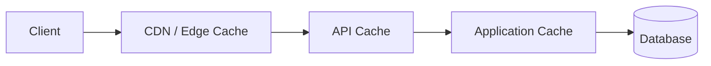

### Important Questions

- What data?
- How long?
- What is the TTL?
- How is cache invalidated?
- Can stale data be tolerated?
- Is cache local or distributed?

### Senior Rule

> Cache invalidation and consistency are often harder than adding the cache.

---

## 16. Rate Limiting

Rate limiting protects:

- service capacity,
- downstream systems,
- fairness,
- abuse prevention.

Possible strategies:

- fixed window,
- sliding window,
- token bucket,
- leaky bucket.

Do not go deep unless asked.

### Interview-Ready Answer

> Rate limiting controls how much traffic a caller can send within a defined policy. I use it to protect service and downstream capacity, prevent abuse, and provide predictable behavior under load. A good API also returns clear retry information where appropriate.

---

## 17. Timeout

Every remote call should have a deliberate timeout.

Without a timeout:

```text
Caller
→ waits
→ thread/connection remains occupied
→ queue grows
→ service becomes unhealthy
```

### Visualization

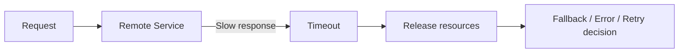

---

## 18. Retry

Retry only when:

- failure may be transient,
- operation is safe to retry,
- retry will not amplify overload.

Use:

- limited attempts,
- backoff,
- jitter where appropriate.

Avoid synchronized retry storms.

---

### Retry Trap

If 1,000 requests fail and all retry immediately:

```text
1,000 failures
→ 1,000 retries
→ downstream becomes even more overloaded
```

Retry can make an outage worse.

---

## 19. Circuit Breaker

### Real-Life Analogy

If an elevator is broken, do not let every person keep pressing the button forever.

Temporarily stop sending traffic and periodically check whether it has recovered.

---

### Visualization

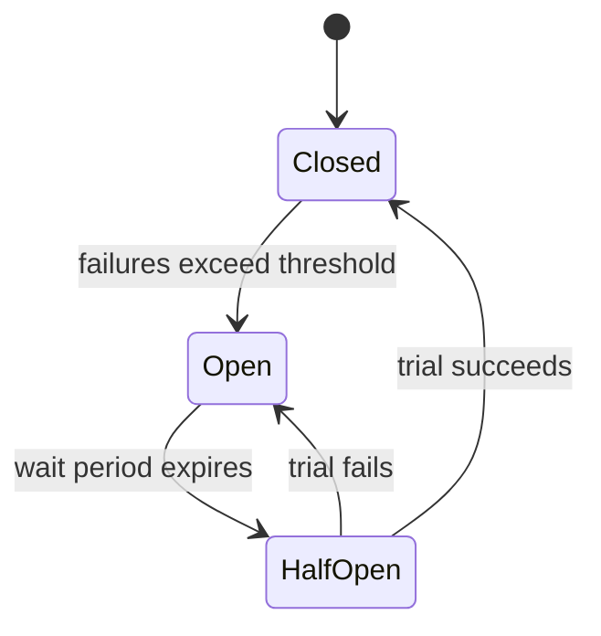

### Interview-Ready Answer

> A circuit breaker prevents continuous calls to a failing dependency. It stays closed during normal operation, opens after a failure threshold, and later allows controlled trial calls in a half-open state. It protects resources and gives the downstream service time to recover.

---

## 20. Microservices — Simple Explanation

A microservice architecture divides a system into independently deployable services aligned to meaningful business capabilities.

But:

> **small service does not automatically mean good microservice.**

A good service boundary should have:

- clear responsibility,
- high internal cohesion,
- controlled dependencies,
- independent ownership/deployment where practical.

---

## 21. Monolith vs Microservices

### Monolith

Advantages:

- simpler deployment,
- simpler transactions,
- easier local debugging,
- fewer network boundaries.

Challenges at scale:

- coupling,
- release coordination,
- scaling everything together,
- large-team ownership.

### Microservices

Advantages:

- independent deployment,
- independent scaling,
- team/service ownership,
- technology flexibility where justified.

Costs:

- network failure,
- distributed transactions,
- observability complexity,
- deployment complexity,
- data consistency,
- operational overhead.

---

### Interview-Ready Answer

> I do not treat microservices as automatically better. A modular monolith can be the right choice when the domain and operational scale do not justify distributed complexity. I move toward microservices when independent ownership, scaling, deployment, or domain boundaries provide enough value to justify the additional operational and consistency cost.

---

## 22. Service Boundary

Bad decomposition:

```text
UserNameService
UserAddressService
UserPhoneService
```

This creates chatty coupling.

Better:

> align services to meaningful business capabilities.

Examples:

```text
Customer
Order
Payment
Inventory
Shipping
```

Use domain boundaries, not arbitrary table boundaries.

---

## 23. Database per Service

A common microservice principle is:

> each service owns its data.

Do not let every service directly query every other service's tables.

Why?

Direct shared-database access creates:

- schema coupling,
- deployment coupling,
- hidden dependencies,
- unclear ownership.

---

### Visualization

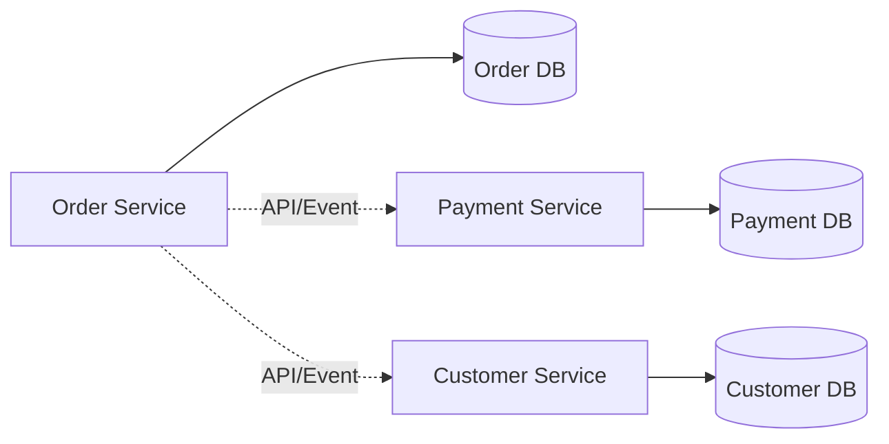

---

## 24. Synchronous Communication

Examples:

```text
REST
gRPC
```

Advantages:

- immediate response,
- simple request-response model.

Risks:

- temporal coupling,
- cascading latency,
- cascading failure.

---

## 25. Asynchronous Communication

Examples:

```text
message broker
event bus
queue
```

Advantages:

- loose temporal coupling,
- buffering,
- decoupled processing.

Costs:

- eventual consistency,
- duplicate handling,
- ordering,
- operational complexity.

We go deeper into Kafka/event-driven architecture in Pack 06.

---

## 26. Eventual Consistency

In a distributed system, all services may not reflect the latest state at exactly the same instant.

Example:

```text
Order created
→ payment confirmed
→ inventory updated
→ notification sent
```

These may complete at different times.

### Senior Insight

The business must define:

- which states are acceptable,
- which operations require strong consistency,
- how failures are recovered.

---

## 27. Distributed Transactions

A single ACID database transaction does not naturally span independent services.

Bad idea:

> pretend multiple remote services behave like one local database call.

Instead, distributed workflows may use:

- local transactions,
- events/commands,
- compensation,
- saga-style coordination.

Pack 06 goes deeper into Saga and event-driven patterns.

---

## 28. API Gateway

An API Gateway can provide a controlled entry point.

Common responsibilities:

- routing,
- authentication integration,
- rate limiting,
- request policy,
- observability,
- aggregation in selected cases.

### Visualization

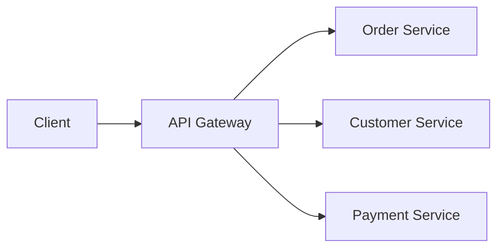

### Senior Trap

Do not put all business logic into the gateway.

Gateway should handle cross-cutting edge concerns, not become the new monolith.

---

## 29. Service Discovery

In dynamic environments, service instances can change.

Service discovery helps services or infrastructure locate healthy instances.

In Kubernetes-style environments, platform networking/service abstractions often provide much of this capability.

Do not overcomplicate unless asked.

---

## 30. Correlation ID and Distributed Tracing

One user request may pass through:

```text
Gateway
→ Order
→ Payment
→ Inventory
→ Notification
```

Without correlation, logs become difficult to connect.

### Visualization

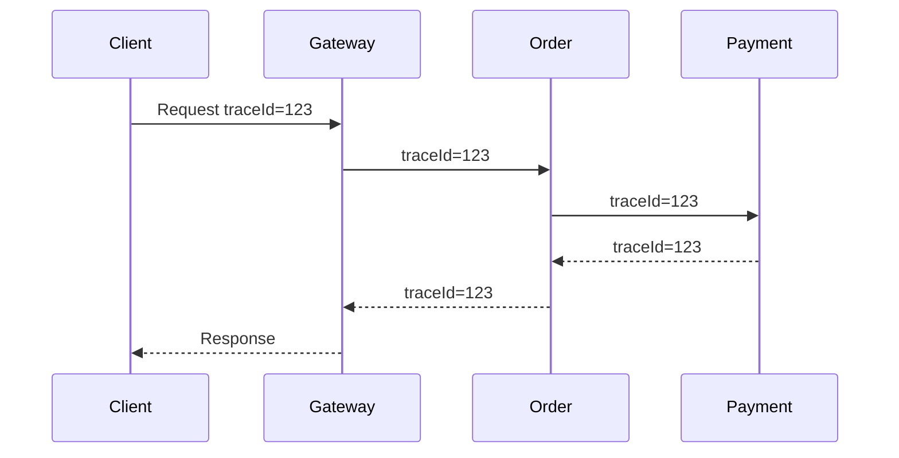

Use:

- correlation/trace identifiers,
- structured logs,
- metrics,
- distributed tracing.

---

## 31. Production Failure Scenario

### Question

> Order Service calls Payment Service. Payment is slow. What do you do?

Do not answer with one tool.

Think:

```text
Timeout
→ retry only if safe
→ backoff
→ circuit breaker
→ fallback/business response
→ metrics
→ tracing
→ capacity analysis
```

### Interview-Ready Answer

> I would first make the dependency boundary explicit with a finite timeout. If the failure is transient and the operation is safe to retry, I would use a limited retry policy with backoff rather than immediate unlimited retries. Repeated failure should trigger circuit-breaker behavior where appropriate. I would also make the business outcome explicit—for example pending, failed, or compensating—and instrument the dependency with latency, error, and trace data.

---

## 32. Project Mapping

This section follows **Evidence First**.

The résumé available to the interview panel supports:

- REST API experience,
- application and integration architecture,
- microservices/distributed-system competency,
- Node.js/TypeScript/React/Azure enterprise work,
- MongoDB/Neo4j/MySQL/Redis,
- performance optimization,
- asynchronous processing,
- caching,
- production support,
- security,
- observability,
- the DEP platform integrating multiple application/data/cloud components.

### Safe Positioning

> My recent enterprise and consulting work has involved API architecture, integration, distributed-system concerns, performance, security, and production support. I can map the concepts in this pack to those real systems, but I would only claim a specific pattern—such as a circuit breaker, saga, or gateway product—where I actually used it.

---

### Candidate Validation

| Topic | Real Project / Evidence |
|---|---|
| REST API design | __________________ |
| API versioning | __________________ |
| Pagination | __________________ |
| Idempotency | __________________ |
| Rate limiting | __________________ |
| Cache | __________________ |
| Timeout/retry | __________________ |
| API Gateway | __________________ |
| Microservice boundary | __________________ |
| Distributed tracing | __________________ |

Do not invent a tool or pattern.

---

## 33. Interview-Ready Answers

### Q1. What is REST?

> REST is an architectural style for exposing resources using standard HTTP semantics. I focus on clear resource modeling, correct methods and status codes, stateless requests, predictable contracts, and consistent error behavior.

---

### Q2. PUT vs PATCH?

> PUT is generally used to replace or fully update a resource representation and is defined with idempotent semantics. PATCH represents a partial modification. A PATCH operation can be idempotent if designed that way, but it is not guaranteed simply because the method is PATCH.

---

### Q3. What is idempotency?

> Idempotency means repeating the same logical request produces the same intended effect as doing it once. It matters in distributed systems because clients and infrastructure may retry after timeouts. For non-idempotent operations such as payments, I can introduce an idempotency key to prevent duplicate side effects.

---

### Q4. How do you design API errors?

> I use consistent machine-readable error codes, safe human-readable messages, appropriate HTTP status codes, and a trace or correlation identifier. I avoid exposing stack traces, SQL errors, secrets, or internal implementation details.

---

### Q5. How would you version an API?

> I first try to evolve the API backward-compatibly. When a breaking change is unavoidable, I introduce controlled versioning, communicate deprecation, monitor usage of older versions, and provide a migration path. URI and header versioning are both viable; contract governance matters more than the syntax.

---

### Q6. Offset vs cursor pagination?

> Offset pagination is simple and works well for many applications, but deep offsets can become expensive and can behave poorly with rapidly changing data. Cursor or keyset pagination is useful for large ordered datasets and continuous navigation when a stable sort key exists.

---

### Q7. Why use rate limiting?

> Rate limiting protects service and downstream capacity, improves fairness, and reduces abuse. I choose a policy according to caller identity, endpoint cost, traffic pattern, and business requirements rather than applying one global number blindly.

---

### Q8. Timeout vs retry?

> Timeout limits how long I am willing to wait for a dependency. Retry is a separate decision made after a failure. I retry only when the failure may be transient and the operation is safe to repeat, and I limit retries with backoff so I do not amplify an outage.

---

### Q9. What is a circuit breaker?

> A circuit breaker stops repeatedly calling a dependency that is already failing. It opens after a defined failure condition, waits, and later allows controlled trial calls. It protects threads/connections and helps avoid cascading failures.

---

### Q10. Monolith vs microservices?

> A monolith is operationally simpler and can be an excellent architecture when modular boundaries are strong. Microservices add independent deployment, scaling and ownership, but also introduce network failure, consistency and observability complexity. I choose based on domain and operational needs rather than architecture fashion.

---

### Q11. How do you define microservice boundaries?

> I align services to meaningful business capabilities with high internal cohesion and clear ownership. I avoid decomposing services around individual tables or tiny technical functions because that creates chatty, tightly coupled distributed systems.

---

### Q12. Database per service — why?

> Service-owned data preserves autonomy and prevents hidden schema coupling. Other services should interact through contracts such as APIs or events instead of directly reading another service's tables.

---

### Q13. Sync vs async communication?

> Synchronous communication is useful when the caller needs an immediate response, but it creates temporal coupling and can propagate latency or failure. Asynchronous messaging decouples timing and can buffer work, but introduces eventual consistency, duplicate handling and operational complexity. I choose based on the business workflow.

---

### Q14. What is eventual consistency?

> Eventual consistency means different parts of a distributed system may temporarily hold different views of state, but they converge as updates propagate. The key design question is whether the business can tolerate that temporary difference and how failures or compensations are handled.

---

### Q15. What does an API Gateway do?

> An API Gateway provides a controlled entry point for clients and can centralize cross-cutting concerns such as routing, authentication integration, rate limiting and observability. I avoid putting domain business logic into the gateway because that would recreate tight coupling at the edge.

---

### Q16. How do you trace one request across microservices?

> I propagate a trace or correlation identifier across service boundaries, use structured logs, metrics and distributed tracing, and ensure downstream calls preserve the context. That lets us reconstruct one request path instead of searching unrelated logs manually.

---

## 34. Likely Follow-Ups

### REST

- Safe vs idempotent methods?
- `201` vs `202`?
- `400` vs `422`?
- `409` use case?
- How do you design bulk APIs?
- File upload?
- Partial failure?
- How do you validate sort/filter input?
- OpenAPI/Swagger?
- API contract testing?

### Reliability

- Exponential backoff?
- Jitter?
- Retry storm?
- Bulkhead?
- Fallback?
- How do timeout values interact across service chains?
- How do you prevent duplicate message/API processing?

### Microservices

- Service discovery?
- Centralized vs decentralized configuration?
- Shared database?
- Distributed lock?
- Saga?
- CQRS?
- Event sourcing?
- Service mesh?
- CAP theorem?
- How do you deploy backward-compatible service changes?

Pack 06 handles the deeper distributed/event-driven topics.

---

## 35. Common Interview Traps

### Trap 1

> “REST means JSON.”

Wrong.

JSON is a representation format.

---

### Trap 2

> “POST is never idempotent.”

POST is not inherently idempotent, but application design can implement idempotent behavior for a POST operation.

---

### Trap 3

> “Retry everything three times.”

Wrong.

Retry policy depends on failure type and operation safety.

---

### Trap 4

> “Circuit breaker fixes a slow service.”

It protects callers.

It does not fix the downstream root cause.

---

### Trap 5

> “Microservices are more scalable than monoliths.”

Too simplistic.

A poorly designed microservice system can be less reliable and harder to scale.

---

### Trap 6

> “Every service should call every other service directly.”

This creates coupling and cascading failure.

---

### Trap 7

> “Database per service means one physical database server for every service.”

Not necessarily.

The important principle is data ownership and isolation of schema/access boundaries.

---

### Trap 8

> “Eventual consistency means data can be wrong.”

Better:

> different parts may temporarily reflect different valid points in the propagation process.

---

### Trap 9

> “API Gateway should contain all common business rules.”

Wrong.

Cross-cutting edge concerns belong there; domain logic should remain in domain services.

---

### Trap 10

> “More logs solve observability.”

Logs are one signal.

Use metrics and tracing too.

---

## 36. Interviewer Intent

| Question | What is really being tested |
|---|---|
| REST | API fundamentals |
| HTTP methods | Protocol precision |
| Idempotency | Distributed reliability |
| Status codes | Contract quality |
| Pagination | API + DB awareness |
| Versioning | Compatibility thinking |
| Timeout/retry | Failure engineering |
| Circuit breaker | Resilience |
| Monolith vs microservices | Architectural judgment |
| Service boundary | Domain design |
| Database per service | Coupling/data ownership |
| Sync vs async | Trade-off awareness |
| Eventual consistency | Distributed-systems maturity |
| Gateway | Edge architecture |
| Correlation ID | Production troubleshooting |

---

## 37. Practical / Mini Mock Content

This is content for later practice only.

### Level 1 — Must Know

1. What is REST?
2. GET vs POST vs PUT vs PATCH?
3. What is idempotency?
4. Explain common HTTP status codes.
5. How do you design API errors?
6. How do you paginate?
7. How do you version APIs?
8. What is caching?
9. Timeout vs retry?
10. What is a circuit breaker?
11. Monolith vs microservices?
12. How do you define service boundaries?
13. Why database per service?
14. Sync vs async communication?
15. What is eventual consistency?
16. What is an API Gateway?

### Level 2 — Follow-Up

17. How would you make POST payment idempotent?
18. `201` vs `202`?
19. How do you handle duplicate client retries?
20. How do you choose cache TTL?
21. How do you prevent retry storms?
22. How do you choose timeout values?
23. What if Payment Service is down?
24. Why can shared DB break microservice autonomy?
25. How would you trace one request across five services?
26. How do you deploy an API change without breaking old clients?
27. How do you handle partial failure in a distributed workflow?
28. Why can too many synchronous service calls hurt latency?
29. How would you rate-limit different customers differently?
30. When would you stay with a modular monolith?

### Level 3 — Engineering Deep Dive

31. How do idempotency keys expire safely?
32. How do you avoid duplicate side effects across retries?
33. How would you design a bulk API with partial success?
34. How do you prevent cache stampede?
35. How do timeout budgets work across chained services?
36. What is a bulkhead pattern?
37. How would you migrate from shared DB to service-owned data?
38. How would you handle cross-service consistency?
39. How do you detect a distributed retry storm?
40. How would you prove a resilience change improved the system?

---

## 38. Quick Revision

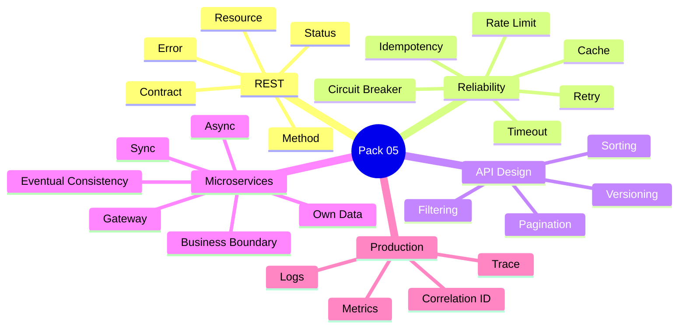

---

## 39. 90-Second Rapid Revision

```text
REST
resource + HTTP semantics

GET
read

POST
create/command

PUT
replace/update, idempotent semantics

PATCH
partial update

IDEMPOTENCY
safe retries without duplicate effect

API ERROR
status + code + safe message + traceId

PAGINATION
limit data; DB must support sort/index

VERSIONING
prefer backward compatibility

CACHE
latency/load improvement; invalidation matters

RATE LIMIT
protect capacity

TIMEOUT
stop waiting

RETRY
only safe/transient + limited + backoff

CIRCUIT BREAKER
stop hammering failing dependency

MICROSERVICES
business-aligned independent services

BOUNDARY
domain capability, not table

DATABASE PER SERVICE
data ownership

SYNC
simple but coupled in time

ASYNC
decoupled but eventual consistency

GATEWAY
edge routing/policy, not business monolith

OBSERVABILITY
logs + metrics + traces
```

---

## 40. Candidate Answer Mapping

| Area | Safe Claim | Evidence / Mapping | Risk |
|---|---|---|---|
| REST API experience | Supported | Resume / multiple roles | Low |
| Integration architecture | Supported | Resume | Low |
| Microservices/distributed systems | Supported as competency | Resume | Low |
| Performance/latency work | Supported | Consulting/Bechtel | Low |
| Caching/asynchronous processing | Supported | Consulting architecture | Low |
| API Gateway product/tool | Validate actual use | __________________ | Medium |
| Circuit breaker implementation | Validate actual use | __________________ | Medium |
| Idempotency-key implementation | Validate actual use | __________________ | Medium |
| Distributed tracing tool | Validate actual tool | __________________ | Medium |
| Saga implementation | Pack 06 + validate | __________________ | Medium |

---

## 41. Final Visualization

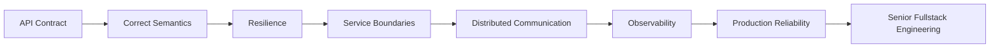

---

## Golden Rules

> **Design APIs as contracts, not controller methods.**

> **A retry without idempotency can create duplicate business effects.**

> **A timeout protects resources; a retry is a separate decision.**

> **Microservices are a trade-off, not a badge of seniority.**

> **Own your data boundary; do not create hidden coupling through shared tables.**

> **Observability is part of the design, not something added after production fails.**

For a senior engineer:

> **Contract → Failure Mode → Trade-Off → Evidence**
