# VRIZE Interview Preparation — Pack 06
## Kafka + Event-Driven Architecture + Distributed Systems

**Target Role:** Senior Fullstack Developer — Round 1  
**Candidate:** Deepak Kumar  
**Priority:** P1 — High Value Follow-Up  
**Timebox:** 70–85 minutes study + later practice  
**Approach:** KIS + DRY + SOLID | Mind-Friendly | Interview-First | Evidence-First | No Bluff  
**Depth:** Level 1 Must Know → Level 2 Follow-Up → Level 3 Engineering Deep Dive

---

## Readiness Gate

Before this pack is considered ready, you should be able to:

- Explain event-driven architecture in simple language.
- Explain Kafka topic, partition, broker, producer, consumer, consumer group, and offset.
- Explain why partitions provide scalability and what they mean for ordering.
- Explain at-most-once, at-least-once, and exactly-once concepts carefully.
- Explain idempotent consumers and duplicate-message handling.
- Explain retries, dead-letter topics/queues, and poison-message handling.
- Explain consumer lag and why it matters.
- Explain eventual consistency and CAP at interview level.
- Explain why distributed transactions are difficult.
- Explain Saga and Outbox patterns at a practical level.
- Explain how schema evolution can break consumers.
- Explain when messaging is better than synchronous REST and when it is not.
- Connect Kafka/distributed-system answers to a real project only where actual experience supports the claim.

---

## 1. Objective

Pack 05 covered REST APIs and microservices.

Pack 06 answers the next question:

> **“What happens when services must communicate reliably without depending on each other being available at the same moment?”**

A senior interviewer may ask:

> “Why Kafka?”

and quickly move to:

> “How do partitions affect ordering?”

> “What happens if a consumer processes a message and crashes before committing the offset?”

> “How do you avoid duplicate business effects?”

> “How would you implement a distributed order workflow?”

The mental model is:

```text
Event
→ Broker
→ Partition
→ Consumer
→ Business Processing
→ Offset
→ Retry / Recovery
→ Consistency
```

---

## 2. Real-Life Analogy

Think of a **postal distribution system**.

- **Producer** = person posting a letter.
- **Topic** = destination/category of mail.
- **Partition** = separate conveyor lane.
- **Broker** = postal sorting center.
- **Consumer** = delivery worker.
- **Consumer group** = team of workers sharing delivery responsibility.
- **Offset** = last successfully handled position in the delivery sequence.
- **Replication** = backup copies at other sorting centers.
- **Retry** = attempt delivery again.
- **Dead-letter queue/topic** = special desk for mail that repeatedly fails delivery.
- **Idempotency** = receiving the same invoice twice does not charge the customer twice.
- **Eventual consistency** = different departments may update at slightly different times, but eventually reflect the same business event.

The analogy gives a simple mental hook.

The engineering behavior comes next.

---

## 3. Visualization

### 3.1 Kafka Basic Flow

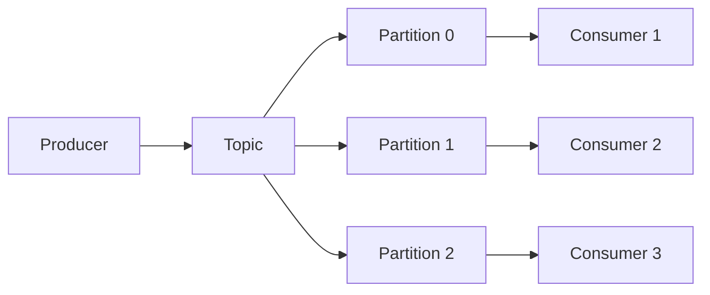

---

### 3.2 Consumer Group

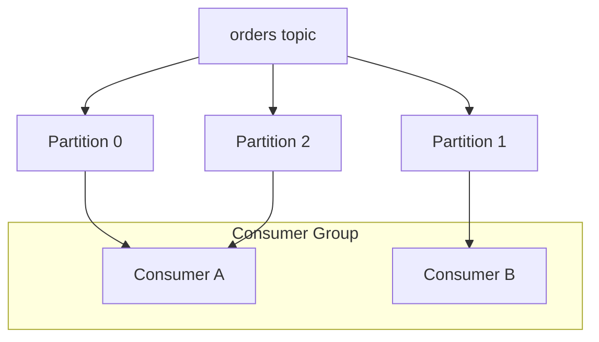

Within one consumer group:

> one partition is assigned to at most one consumer at a time.

---

### 3.3 Offset Flow

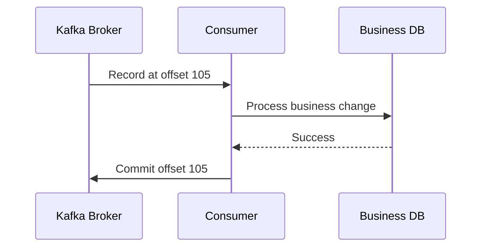

The order of **process** and **offset commit** is important.

---

### 3.4 Event-Driven Order Flow

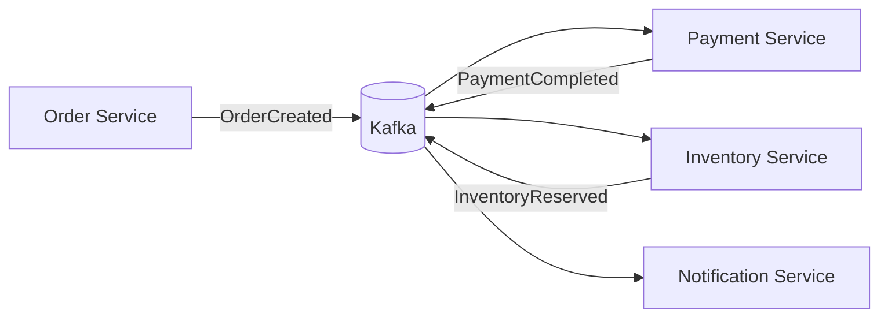

---

### 3.5 Retry and Dead Letter Flow

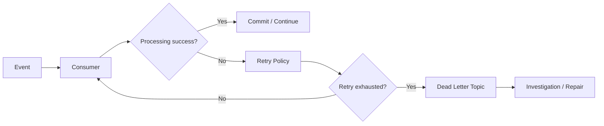

---

## 4. Mind Map

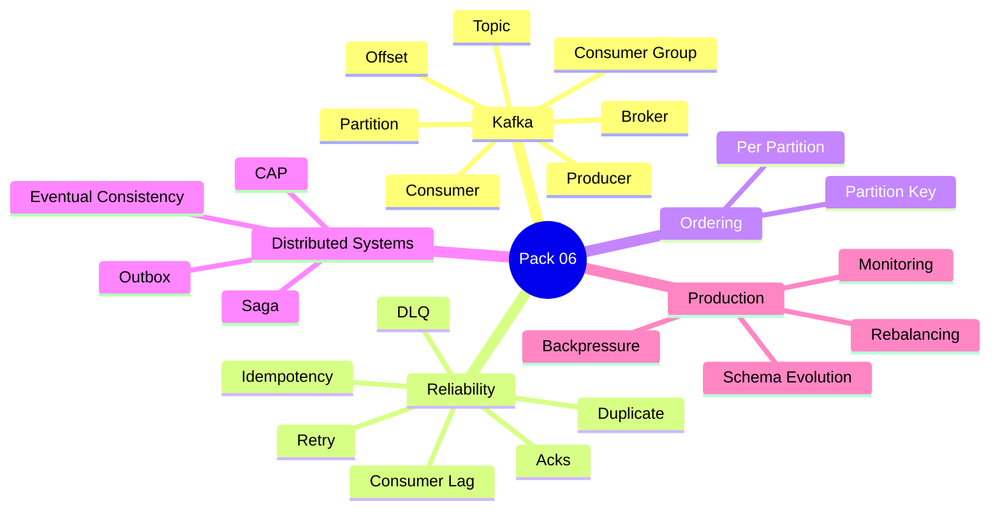

Five anchors:

> **Partition → Consumer Group → Delivery → Consistency → Recovery**

---

## 5. Simple Explanation — Event-Driven Architecture

In a synchronous flow:

```text
Order Service
→ calls Payment Service
→ waits
→ calls Inventory Service
→ waits
```

In an event-driven flow:

```text
Order Service
→ publishes OrderCreated
→ interested services react independently
```

### Benefits

- looser temporal coupling,
- better buffering,
- independent processing,
- easier fan-out,
- resilience to temporary consumer unavailability.

### Costs

- eventual consistency,
- duplicate handling,
- ordering concerns,
- more difficult debugging,
- message/schema governance,
- operational complexity.

### Interview-Ready Answer

> Event-driven architecture lets services communicate by publishing events instead of requiring every participant to be available synchronously. It reduces temporal coupling and supports scalable asynchronous workflows, but it introduces eventual consistency, duplicate handling, ordering, schema evolution, and observability challenges.

---

## 6. Kafka Core Concepts

### 6.1 Broker

A Kafka broker is a server that stores partitions and serves producer/consumer requests.

A Kafka cluster typically consists of multiple brokers.

Think:

> **Broker = Kafka node**

---

### 6.2 Topic

A topic is a named stream/category of records.

Examples:

```text
orders
payments
notifications
```

Do not think of a topic as a normal database table.

It is an append-oriented event stream.

---

### 6.3 Partition

A topic is divided into partitions.

Why?

- scalability,
- parallelism,
- distributed storage.

### Key Rule

Kafka ordering is guaranteed **within a partition**, not across the entire topic.

---

### 6.4 Producer

Producer publishes records to a topic.

A record commonly includes:

- key,
- value,
- headers,
- timestamp.

Example mental model:

```text
key = orderId
value = OrderCreated event
```

---

### 6.5 Consumer

A consumer reads records from partitions.

Consumers usually run as part of a **consumer group**.

---

### 6.6 Consumer Group

Consumers in the same group share the work.

If a topic has:

```text
6 partitions
```

and the group has:

```text
3 consumers
```

then each consumer can process multiple partitions.

If the group has:

```text
10 consumers
```

for 6 partitions, some consumers will be idle.

### Interview-Ready Answer

> A consumer group lets multiple consumers share a topic's partitions for parallel processing. Within one group, a partition is owned by only one consumer at a time, so practical parallelism is bounded by the number of partitions.

---

## 7. Partition Key and Ordering

Suppose all events for one order must remain in order:

```text
OrderCreated
PaymentStarted
PaymentCompleted
OrderShipped
```

Use a stable key such as:

```text
orderId
```

so events for the same order map to the same partition.

### Visualization

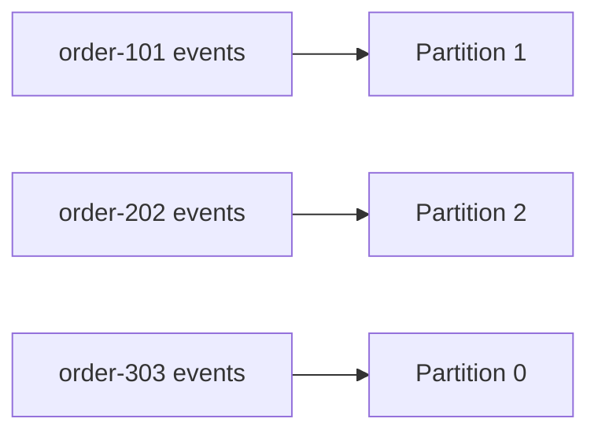

### Senior Insight

Ordering requirements influence partition-key design.

Poor key choice can create:

- hot partitions,
- uneven load,
- broken ordering expectations.

---

## 8. Offset

An offset identifies a record's position within a partition.

Example:

```text
Partition 2:
offset 100
offset 101
offset 102
```

A consumer tracks how far it has progressed.

### Important

Offset is not:

> “global message ID across Kafka.”

It is relative to a partition.

---

## 9. Delivery Semantics

### 9.1 At-Most-Once

Potential behavior:

```text
commit
→ then process
```

If processing fails after commit:

> message may be lost from the application's perspective.

Think:

> **No duplicate, but possible loss.**

---

### 9.2 At-Least-Once

Common model:

```text
process
→ then commit
```

If business processing succeeds but the consumer crashes before committing:

> the message may be delivered again.

Think:

> **No intentional loss, but duplicates possible.**

---

### 9.3 Exactly-Once

Be careful.

Do not say:

> “Kafka exactly once means the entire business process can never happen twice.”

Exactly-once guarantees depend on:

- Kafka producer/transactional configuration,
- what systems participate,
- how side effects are handled.

An external database/API is not magically part of the Kafka transaction.

### Interview-Ready Answer

> I treat delivery semantics carefully. At-least-once delivery is common and means consumers must tolerate duplicates. Kafka supports stronger exactly-once processing patterns within appropriate Kafka transaction boundaries, but external side effects still require idempotent business design or coordinated transaction patterns.

---

## 10. Idempotent Consumer

Suppose the same event arrives twice:

```text
PaymentCompleted(order-101)
PaymentCompleted(order-101)
```

You should not:

```text
ship twice
```

### Common Approach

Store/process a unique event or business operation identifier.

Concept:

```text
eventId seen?
  yes → ignore/reuse result
  no  → process + record eventId
```

### Visualization

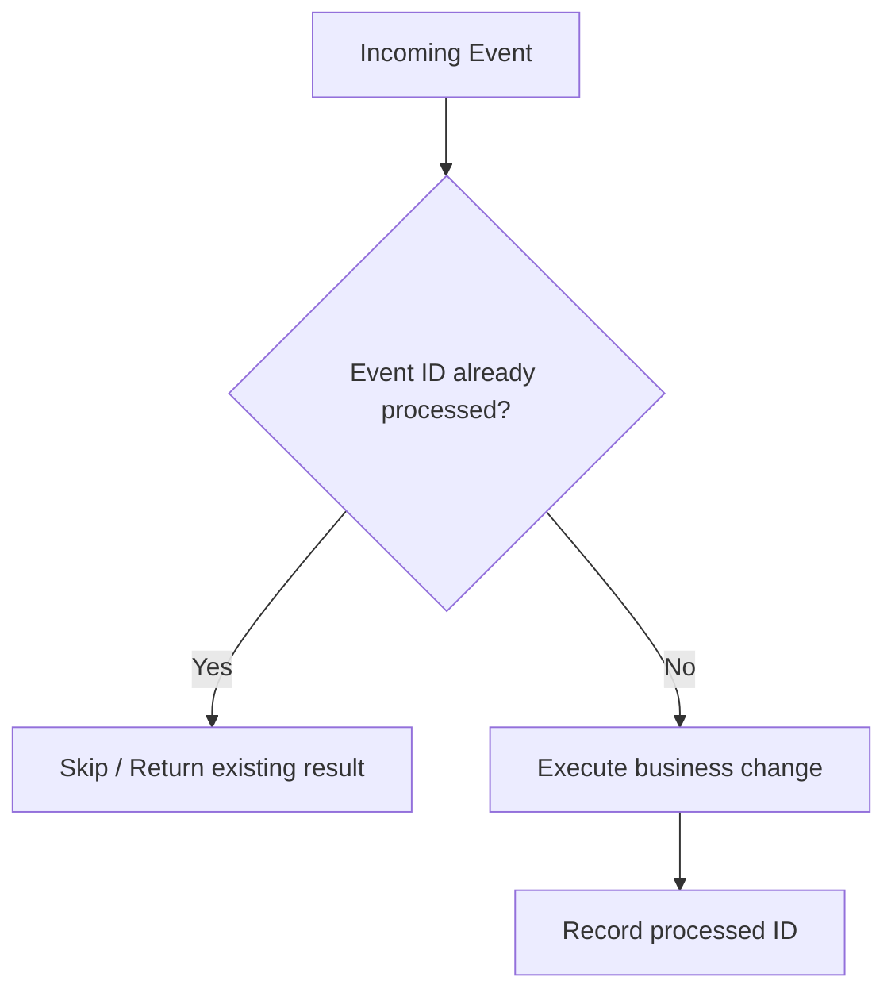

### Senior Rule

> If you choose at-least-once delivery, idempotency is not optional for side-effecting consumers.

---

## 11. Producer Acknowledgment — Conceptual

A producer can be configured with different durability expectations around acknowledgment.

The exact configuration details vary by setup, but the engineering trade-off is:

```text
lower acknowledgment requirement
→ lower latency
→ lower durability assurance

stronger acknowledgment requirement
→ higher durability assurance
→ potentially more latency
```

Do not memorize configuration flags without understanding the trade-off.

---

## 12. Replication — Simple Model

Partitions can have replicas across brokers.

One replica acts as leader for client operations, while followers replicate the partition.

Purpose:

- fault tolerance,
- availability.

### Visualization

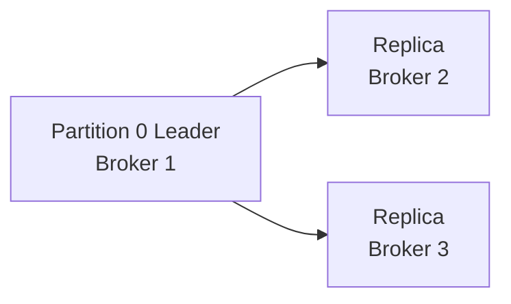

---

## 13. Consumer Lag

Consumer lag is roughly:

> how far the consumer is behind the latest available record.

If producers create faster than consumers process:

```text
incoming rate > processing rate
→ lag grows
```

### Causes

- slow business processing,
- downstream database/API latency,
- insufficient partitions/consumers,
- rebalance churn,
- large messages,
- failures/retries.

### Interview-Ready Answer

> Consumer lag is a key operational signal showing whether consumers are keeping up with produced records. Growing lag means I investigate processing time, downstream dependencies, partition distribution, consumer capacity, retries, and rebalancing rather than simply adding consumers blindly.

---

## 14. Rebalancing

When group membership or partition assignments change, Kafka may redistribute partitions among consumers.

Triggers can include:

- consumer joins,
- consumer leaves,
- partition-count change,
- failed/unhealthy consumer.

### Cost

During rebalancing:

- processing may pause or shift,
- assignment changes,
- poor configuration can cause churn.

Senior takeaway:

> frequent rebalances can become a performance/reliability problem.

---

## 15. Retry Strategy

Retry can happen:

- immediately,
- with delay,
- through retry topics,
- using application/framework retry mechanisms.

### Ask First

- Is the error transient?
- Is the operation idempotent?
- Will retry overload the dependency?
- Should the message be isolated?

### Good Pattern

```text
few controlled retries
→ backoff
→ dead letter
→ alert/investigate
```

Do not retry malformed business data forever.

---

## 16. Dead-Letter Topic / Queue

A dead-letter destination stores events that could not be processed after the allowed recovery policy.

Use it for:

- investigation,
- manual repair,
- controlled replay.

Do not treat DLQ as:

> “where errors disappear.”

A DLQ needs:

- monitoring,
- ownership,
- replay procedure,
- retention policy.

---

## 17. Poison Message

A poison message repeatedly fails because the message itself is invalid or incompatible.

Examples:

- malformed payload,
- missing mandatory field,
- unsupported schema,
- business invariant impossible.

Infinite retry only blocks useful work.

Isolate it.

---

## 18. Schema Evolution

Events outlive deployments.

Producer version A may publish:

```json
{
  "orderId": "101",
  "amount": 100
}
```

Later version B adds:

```json
{
  "orderId": "101",
  "amount": 100,
  "currency": "USD"
}
```

### Good Evolution

Prefer backward-compatible changes where practical:

- add optional/defaulted fields,
- avoid silently changing field meaning,
- version contracts deliberately,
- validate compatibility.

### Senior Insight

An event contract is an API contract.

Changing it carelessly can break multiple consumers.

---

## 19. Event vs Command

### Event

Something that happened:

```text
OrderCreated
PaymentCompleted
```

### Command

Request for action:

```text
ReserveInventory
ChargePayment
```

### Mental Rule

```text
Event = past-tense fact
Command = intent/request
```

Do not mix semantics casually.

---

## 20. Eventual Consistency

Distributed services do not always update simultaneously.

Example:

```text
Order = CREATED
Payment = COMPLETED
Inventory = still processing
```

For a short period, the system may expose different intermediate states.

### Interview-Ready Answer

> Eventual consistency means services may temporarily reflect different stages of the same distributed workflow, but converge as events are processed. The important design work is defining valid intermediate states, recovery behavior, and which business operations truly require immediate consistency.

---

## 21. CAP — Interview Level

CAP applies when a distributed system experiences a network partition.

You cannot simultaneously guarantee both:

- strong consistency,
- availability

for every operation during that partition.

### Keep It Simple

```text
P = network partition exists

then system must make a trade-off between:
C = consistent response
A = available response
```

### Do Not Say

> “Every system chooses two out of three all the time.”

That is an oversimplification.

### Interview-Ready Answer

> CAP is mainly about behavior during a network partition. When communication between nodes is broken, the system must choose whether to preserve strong consistency by rejecting/delaying some operations or preserve availability by allowing operations that may temporarily diverge.

---

## 22. Distributed Transactions — Why Hard?

Within one database:

```text
BEGIN
debit
credit
COMMIT
```

Across independent services:

```text
Order DB
Payment DB
Inventory DB
```

there is no simple shared local transaction.

Failures can happen between steps.

Example:

```text
payment succeeds
→ inventory reservation fails
```

Now business compensation is required.

---

## 23. Saga Pattern

Saga coordinates a distributed business transaction through multiple local transactions.

Two broad coordination styles:

### Choreography

Services react to events.

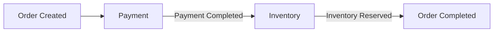

### Orchestration

A central saga coordinator directs each step.

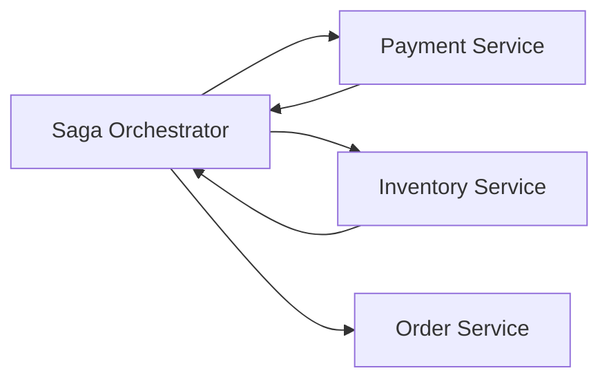

---

### Compensation

If a later step fails:

```text
Charge Payment
→ Reserve Inventory fails
→ Refund Payment
```

A compensation action is a business action.

It is not a database rollback across services.

---

### Interview-Ready Answer

> Saga handles a distributed business workflow as a sequence of local transactions with compensating actions for failures. Choreography uses events between services, while orchestration uses a coordinator. I choose based on workflow complexity, coupling, visibility, and operational requirements.

---

## 24. Transactional Outbox Pattern

Classic problem:

```text
save order to DB
publish OrderCreated event
```

What if:

```text
DB commit succeeds
Kafka publish fails?
```

Now the database says the order exists, but the event is missing.

### Outbox Idea

Write both:

- business data,
- outbox record

inside the same local database transaction.

Then a separate publisher reliably publishes outbox records.

### Visualization

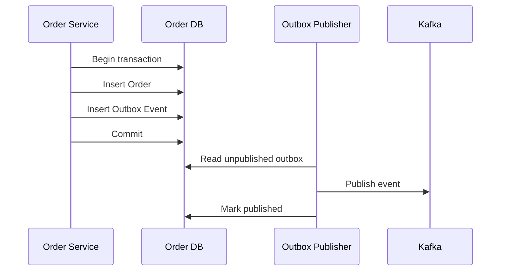

### Interview-Ready Answer

> The Outbox pattern solves the dual-write problem between a service database and a broker. The service stores the business change and an outbox event in the same local transaction, then a separate publisher sends the event to Kafka. Consumers still need idempotency because publication may be retried.

---

## 25. Backpressure

If:

```text
producer rate > consumer capacity
```

the backlog grows.

Messaging provides buffering, but buffering is not infinite.

### Backpressure Thinking

- consumer lag,
- queue/topic retention,
- processing capacity,
- downstream capacity,
- admission control,
- scaling.

Do not say:

> “Kafka solves overload.”

Kafka helps absorb bursts, but sustained overload still needs capacity planning.

---

## 26. Kafka vs REST

Use Kafka when:

- asynchronous processing fits,
- fan-out is valuable,
- producer/consumer timing should be decoupled,
- event history/replay matters,
- buffering is useful.

Use REST/gRPC when:

- caller needs immediate result,
- request-response is natural,
- workflow is simple,
- operational complexity of messaging is not justified.

### Interview-Ready Answer

> I do not replace REST with Kafka automatically. REST is natural for synchronous request-response interactions. Kafka is valuable when temporal decoupling, fan-out, buffering, replay, or event-driven workflows matter. Many production systems use both.

---

## 27. Observability

For event-driven systems, monitor:

- producer failures,
- publish latency,
- consumer lag,
- processing latency,
- retry count,
- DLQ volume,
- rebalance frequency,
- partition skew,
- end-to-end trace/correlation IDs.

### Visualization

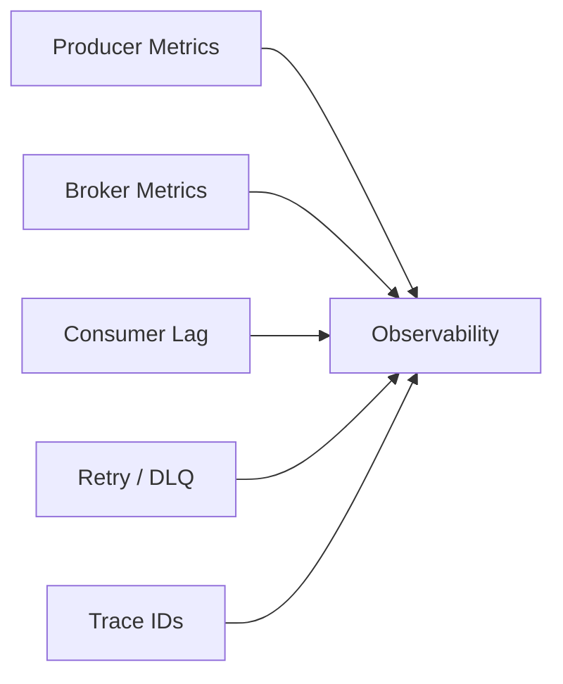

---

## 28. Production Scenario — Duplicate Processing

### Question

> The same payment event was processed twice. What do you do?

Think:

```text
identify delivery semantics
→ inspect offset/commit timing
→ check retry/rebalance
→ protect business side effect with idempotency
→ verify event identity
→ monitor duplicates
```

### Strong Answer

> I would not start by assuming Kafka is broken. With at-least-once processing, duplicates are expected under some failure conditions. I would inspect the processing/offset sequence and consumer retries, but the business side effect should also be protected with an idempotency strategy using a unique event or business operation identifier.

---

## 29. Production Scenario — Consumer Lag Growing

Strong reasoning:

```text
Is producer rate higher?
→ Is one partition hot?
→ Is processing slow?
→ Is DB/API downstream slow?
→ Are retries high?
→ Are rebalances happening?
→ Enough partitions?
→ Enough healthy consumers?
```

Do not answer only:

> “Add more consumers.”

If partition count is the bottleneck, extra consumers may sit idle.

---

## 30. Project Mapping

This section follows **Evidence First**.

The résumé available to the interview panel supports:

- microservices/distributed-system competency,
- event-driven systems as an architecture competency,
- asynchronous processing,
- resilient integration,
- Azure Service Bus/Queue experience in the broader profile context,
- API architecture,
- performance optimization,
- production support,
- observability.

However, the submitted résumé bullets do **not explicitly establish a production Kafka implementation**.

Therefore:

### Safe Positioning

> I understand Kafka and event-driven architecture at system-design and backend-engineering level. My real project background includes asynchronous processing, queues/event-driven integration and distributed-system concerns. I would only claim specific production Kafka ownership if I can map it to an actual project I worked on.

That is stronger than bluffing.

---

### Candidate Validation

| Topic | Real Project / Evidence |
|---|---|
| Kafka producer | __________________ |
| Kafka consumer | __________________ |
| Azure Service Bus / Queue | __________________ |
| Consumer group | __________________ |
| Retry/DLQ | __________________ |
| Duplicate handling | __________________ |
| Idempotency | __________________ |
| Saga | __________________ |
| Outbox | __________________ |
| Event schema/versioning | __________________ |
| Consumer lag incident | __________________ |

Leave unsupported rows blank.

---

## 31. Interview-Ready Answers

### Q1. Why Kafka?

> Kafka is useful when I need durable asynchronous communication, high-throughput event streams, consumer decoupling, fan-out, buffering, or replay. I would not use it for every service call; if immediate request-response behavior is simpler, REST may be the better choice.

---

### Q2. Topic vs partition?

> A topic is the logical event stream, while partitions divide that stream for storage and parallel processing. Ordering is maintained within a partition, so partition-key design matters when related events must remain ordered.

---

### Q3. What is a consumer group?

> A consumer group lets multiple consumer instances share the partitions of a topic. Within a group, one partition is processed by at most one consumer at a time, so the number of partitions limits useful parallelism.

---

### Q4. What is an offset?

> An offset is the position of a record within a specific partition. Consumers track committed offsets to know how far they have progressed. It is not a global message identifier across the topic.

---

### Q5. At-least-once vs at-most-once?

> At-most-once can lose processing if progress is committed before the business work completes. At-least-once processes before committing progress, which avoids intentional loss but can deliver duplicates after failures. Therefore side-effecting consumers should be idempotent.

---

### Q6. What does exactly-once mean in Kafka?

> Kafka can provide exactly-once processing guarantees within appropriate Kafka transactional boundaries, but I do not translate that into “the entire business world happens exactly once.” External databases or APIs still need idempotent or coordinated design.

---

### Q7. How do you preserve order?

> Kafka preserves ordering within a partition. If all events for one business entity must remain ordered, I use a stable key such as orderId so those events route to the same partition. I also watch for hot-key imbalance.

---

### Q8. What is consumer lag?

> Consumer lag shows how far consumers are behind the latest records. Growing lag indicates the processing pipeline is not keeping up, so I investigate processing latency, downstream dependencies, retries, partition skew, consumer capacity, and rebalancing.

---

### Q9. What is a DLQ?

> A dead-letter destination isolates records that repeatedly fail after the normal retry policy. It should be monitored and have a defined investigation/replay process; it is not a place to silently hide errors.

---

### Q10. What is eventual consistency?

> It means different services may temporarily reflect different stages of a distributed workflow but converge as updates propagate. The important design work is defining valid intermediate states and recovery behavior.

---

### Q11. Explain CAP.

> CAP matters during a network partition. When nodes cannot communicate, the system must choose whether to preserve strong consistency by rejecting or delaying some operations, or preserve availability by allowing operations that may temporarily diverge.

---

### Q12. What is Saga?

> Saga models a distributed business transaction as a sequence of local transactions with compensating actions. Choreography uses events between services; orchestration uses a coordinator. The choice depends on workflow complexity, coupling and operational visibility.

---

### Q13. What is the Outbox pattern?

> The Outbox pattern solves the dual-write problem between a service database and the message broker. The service stores the business change and event record in one local transaction, then a separate publisher reliably sends the event. Consumers still need duplicate tolerance.

---

### Q14. Kafka vs REST?

> REST is natural for synchronous request-response interactions. Kafka is useful when asynchronous processing, buffering, replay, fan-out, or temporal decoupling matters. They are complementary rather than mutually exclusive.

---

### Q15. How do you handle duplicate events?

> I design side-effecting consumers to be idempotent using a unique event or business-operation identifier. I record or enforce whether the operation has already been applied so redelivery does not create a duplicate business effect.

---

## 32. Likely Follow-Ups

### Kafka

- Leader/follower replica?
- What is ISR?
- What happens when a broker fails?
- What is retention?
- Compacted topic?
- Rebalancing?
- Producer acknowledgments?
- Batch/compression?
- How are partitions selected?
- Can one consumer read multiple partitions?
- Can two consumers in one group read the same partition simultaneously?

### Reliability

- Offset commit before vs after processing?
- Auto commit vs manual commit?
- What if DB commit succeeds but offset commit fails?
- What if event publish succeeds but DB commit fails?
- Retry topic vs DLQ?
- How do you replay safely?

### Distributed Systems

- Saga choreography vs orchestration?
- Outbox vs two-phase commit?
- CAP?
- Event sourcing?
- CQRS?
- Strong consistency vs eventual consistency?
- How do you prevent duplicate commands?
- How do you evolve event schemas?

Do not study every Level 3 area equally unless the interviewer goes deeper.

---

## 33. Common Interview Traps

### Trap 1

> “Kafka guarantees global ordering.”

Wrong.

Ordering is per partition.

---

### Trap 2

> “More consumers always improve throughput.”

Wrong.

Useful parallelism is bounded by partitions and downstream capacity.

---

### Trap 3

> “Exactly once means duplicate business effects are impossible.”

Wrong.

Be precise about the boundary.

---

### Trap 4

> “DLQ fixes failed messages.”

Wrong.

It isolates them.

Someone still owns recovery.

---

### Trap 5

> “Retry forever until it works.”

Wrong.

Permanent failures need isolation.

---

### Trap 6

> “Kafka makes the system strongly consistent.”

Wrong.

Event-driven workflows commonly use eventual consistency.

---

### Trap 7

> “Saga is a distributed rollback.”

Too simplistic.

Compensation is a new business action.

---

### Trap 8

> “Outbox eliminates duplicates.”

Wrong.

It solves reliable DB + event publication; consumers still need duplicate tolerance.

---

### Trap 9

> “Kafka replaces all REST APIs.”

Wrong.

Use the interaction style that matches the workflow.

---

### Trap 10

> “Consumer lag means Kafka is slow.”

Not necessarily.

The bottleneck may be the consumer or its downstream dependency.

---

## 34. Interviewer Intent

| Question | What is really being tested |
|---|---|
| Why Kafka? | Architecture judgment |
| Topic/partition | Core Kafka understanding |
| Consumer group | Scalability |
| Ordering | Partition-key design |
| Offset | Processing semantics |
| Delivery semantics | Reliability maturity |
| Idempotency | Business correctness |
| Lag | Production operations |
| Retry/DLQ | Failure handling |
| CAP | Distributed-system precision |
| Saga | Cross-service workflow design |
| Outbox | Dual-write correctness |
| Kafka vs REST | Trade-off awareness |
| Schema evolution | Contract governance |

---

## 35. Practical / Mini Mock Content

This is content for later practice only.

### Level 1 — Must Know

1. What is event-driven architecture?
2. Why Kafka?
3. Topic vs partition?
4. Producer vs consumer?
5. What is a consumer group?
6. What is an offset?
7. How does Kafka ordering work?
8. At-most-once vs at-least-once?
9. Why do consumers need idempotency?
10. What is consumer lag?
11. What is a DLQ?
12. What is eventual consistency?
13. Explain CAP.
14. What is Saga?
15. What is Outbox?
16. Kafka vs REST?

### Level 2 — Follow-Up

17. What happens if processing succeeds but offset commit fails?
18. How do you handle duplicate events?
19. What if there are more consumers than partitions?
20. How would you choose a partition key?
21. What causes hot partitions?
22. Why can consumer lag increase?
23. When should a message go to DLQ?
24. How would you replay DLQ safely?
25. Choreography vs orchestration?
26. Why is Outbox needed?
27. How do you evolve an event schema?
28. How do you monitor Kafka consumers?
29. What happens during rebalance?
30. Why does eventual consistency need business-state design?

### Level 3 — Engineering Deep Dive

31. How would you guarantee one payment side effect despite redelivery?
32. How do you handle DB commit success + Kafka failure?
33. How do you handle Kafka publish success + DB failure?
34. How do you avoid a hot partition for one large tenant?
35. How would you design retry topics with delay?
36. How do you prevent a poison message from blocking processing?
37. When would a compacted topic help?
38. How would you trace one event through multiple consumers?
39. When would Kafka be overengineering?
40. How would you prove your consumer-scaling change improved throughput?

---

## 36. Quick Revision

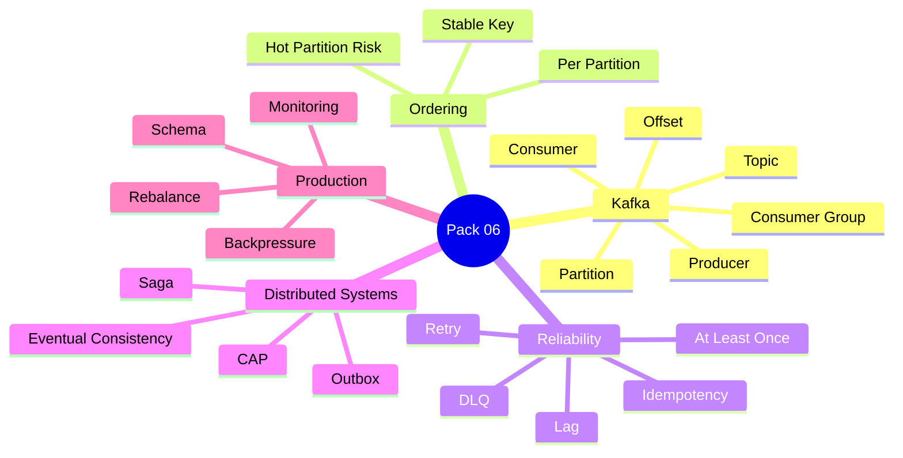

---

## 37. 90-Second Rapid Revision

```text
TOPIC
event stream

PARTITION
parallelism + per-partition ordering

PRODUCER
publishes event

CONSUMER
processes event

CONSUMER GROUP
shares partitions

OFFSET
position inside partition

ORDERING
only within partition

AT-LEAST-ONCE
duplicates possible

IDEMPOTENCY
same event must not create duplicate business effect

CONSUMER LAG
consumer falling behind producer

RETRY
only controlled/transient

DLQ
isolate repeated failures

EVENTUAL CONSISTENCY
services converge over time

CAP
during partition: consistency vs availability trade-off

SAGA
local transactions + compensation

OUTBOX
business DB change + event record in same transaction

KAFKA VS REST
async decoupling vs synchronous request-response

PRODUCTION
lag + retries + DLQ + rebalance + trace + schema
```

---

## 38. Candidate Answer Mapping

| Area | Safe Claim | Evidence / Mapping | Risk |
|---|---|---|---|
| Distributed systems | Supported | Resume competency | Low |
| Event-driven architecture | Supported as architecture competency | Resume | Low |
| Async processing | Supported | Consulting architecture | Low |
| Queue/messaging concepts | Supported broadly | Prior Azure/architecture context | Low |
| Production Kafka implementation | Not clearly established | Validate personally | High if claimed |
| Consumer lag incident | Validate actual experience | __________________ | Medium |
| DLQ implementation | Validate actual experience | __________________ | Medium |
| Saga implementation | Validate actual experience | __________________ | Medium |
| Outbox implementation | Validate actual experience | __________________ | Medium |
| Kafka exactly-once production use | Validate actual experience | __________________ | High if claimed |

---

## 39. Final Visualization

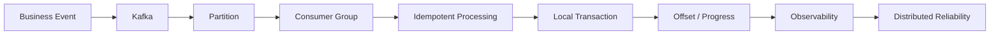

---

## Golden Rules

> **Partition design determines both parallelism and ordering.**

> **At-least-once delivery means duplicate handling is part of business correctness.**

> **A retry is not a recovery strategy unless the failure is transient and the operation is safe.**

> **Saga compensation is a business action, not a magical distributed rollback.**

> **Outbox solves the database-to-broker dual-write problem, not every consistency problem.**

> **Do not claim production Kafka ownership unless you can defend the real implementation.**

For a senior engineer:

> **Event → Partition → Delivery → Idempotency → Consistency → Recovery → Evidence**
