# VRIZE Interview Preparation — Pack 07
## React + JavaScript + TypeScript

**Target Role:** Senior Fullstack Developer — Round 1  
**Candidate:** Deepak Kumar  
**Priority:** P0 — Must Know  
**Timebox:** 80–90 minutes study + later practice  
**Approach:** KIS + DRY + SOLID | Mind-Friendly | Interview-First | Evidence-First | No Bluff  
**Depth:** Level 1 Must Know → Level 2 Follow-Up → Level 3 Engineering Deep Dive

---

## Readiness Gate

Before this pack is considered ready, you should be able to:

- Explain React's component model, props, state, and one-way data flow.
- Explain what causes a component to render.
- Explain `useState`, `useEffect`, `useRef`, `useMemo`, and `useCallback`.
- Explain when **not** to use an Effect.
- Explain controlled vs uncontrolled components.
- Explain keys, list rendering, state lifting, Context, and reducer-based state.
- Explain common causes of unnecessary re-rendering and practical optimization.
- Explain JavaScript scope, closure, hoisting, `this`, promises, `async/await`, and the event loop.
- Explain microtasks vs tasks/macrotasks at interview level.
- Explain TypeScript interfaces, type aliases, unions, generics, narrowing, and utility types.
- Explain frontend → REST API integration and error/loading states.
- Connect answers to your real React/TypeScript experience without inventing implementation details.

---

## 1. Objective

This pack answers:

> **“Can you build and reason about a modern frontend, or do you only know React syntax?”**

A senior interviewer may begin with:

> “What is `useEffect`?”

and quickly move to:

> “Why is this Effect running repeatedly?”

> “Why did the child component render again?”

> “When would you use `useMemo`?”

> “What is a JavaScript closure?”

> “Explain the event loop.”

> “Why would you use a TypeScript generic?”

The mental flow is:

```text
Component
→ State
→ Render
→ User interaction
→ Side effect
→ API
→ Type safety
→ Performance
```

---

## 2. Real-Life Analogy

Think of a **restaurant display board**.

### React Component

A component is one reusable section of the board.

Examples:

- order card,
- total panel,
- customer summary.

### Props

Props are information passed **into** a component.

Like:

> “Display Order #101 with status PAID.”

### State

State is information the component or React application needs to remember over time.

Like:

> “This panel is currently expanded.”

### Render

Rendering is React calculating what the UI should look like from the current props and state.

### Effect

An Effect is for synchronizing with something **outside React**.

Like:

- network connection,
- browser API,
- timer,
- external widget.

### TypeScript

TypeScript is the contract sheet that says:

> “An Order must contain these fields with these types.”

The analogy gives us the mental picture.

Now map it to engineering.

---

## 3. Visualization

### 3.1 React Data Flow

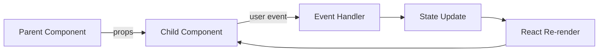

React's normal model is:

> **Data flows down; events communicate intent upward.**

---

### 3.2 Render Flow

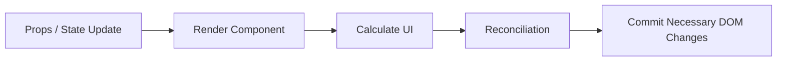

Do not think:

> “Every render rewrites the entire DOM.”

React calculates a new UI description and commits the required DOM changes.

---

### 3.3 Effect Flow


---

### 3.4 API Integration

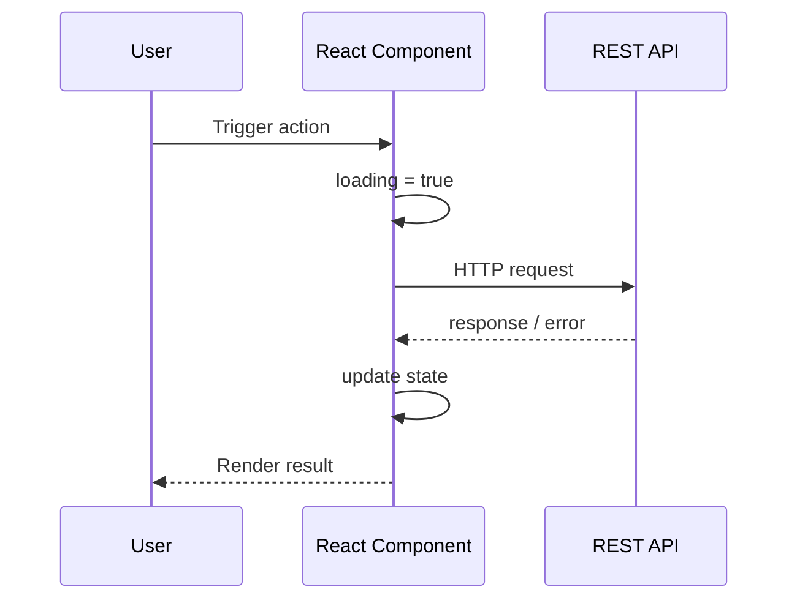

---

### 3.5 JavaScript Event Loop — Interview Model

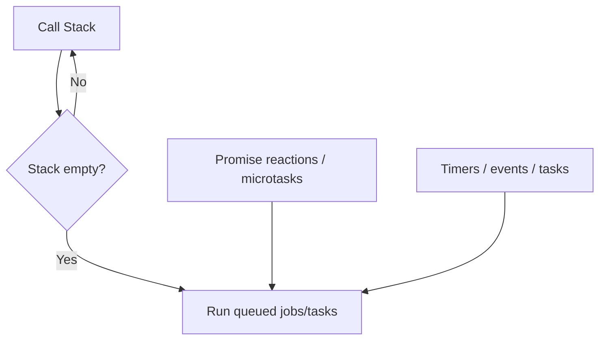

Important:

> Promise callbacks are queued differently from timer tasks and normally run before the next task once the current stack completes.

---

### 3.6 TypeScript Type Flow

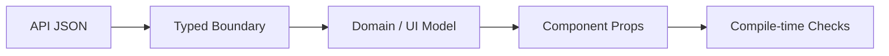

---

## 4. Mind Map

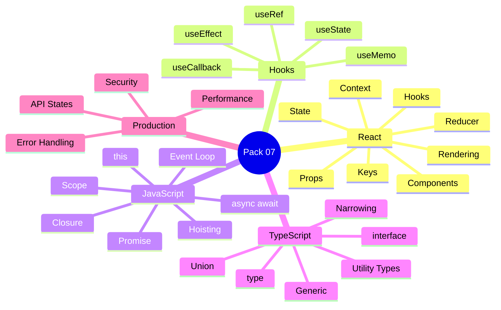

Five anchors:

> **State → Render → Effects → JavaScript Runtime → Type Safety**

---

## 5. React Fundamentals

## 5.1 Component

A React component is a reusable unit of UI behavior and rendering.

Example:

```tsx
type UserCardProps = {
  name: string;
};

function UserCard({ name }: UserCardProps) {
  return <h2>{name}</h2>;
}
```

A component should have a clear responsibility.

That aligns naturally with **KIS, DRY, and SOLID-style component design**.

---

## 5.2 Props

Props are inputs passed from a parent.

```tsx
<UserCard name="Deepak" />
```

Props should be treated as read-only inputs.

A child should not try to mutate the parent's data directly.

### Interview-Ready Answer

> Props are read-only inputs supplied to a component, while state represents data React needs to retain for that component's position in the UI tree. I use props for parent-to-child data flow and callbacks/events for child-to-parent communication.

---

## 5.3 State

State lets React remember information between renders.

```tsx
const [count, setCount] = useState(0);
```

Update:

```tsx
setCount(count + 1);
```

A state update schedules another render.

### Important

Do not mutate state directly:

```tsx
user.name = "New"; // avoid mutating state object directly
```

Prefer:

```tsx
setUser({
  ...user,
  name: "New"
});
```

---

## 5.4 State Is Tied to UI Position

React associates state with where a component appears in the render tree.

This explains why changing:

- component type,
- key,
- tree position

can preserve or reset state differently.

### Interview Insight

A `key` is not only for removing console warnings.

It affects component identity during reconciliation.

---

## 5.5 What Causes a Component to Render?

Common triggers include:

- its own state update,
- parent rendering it again,
- consumed context changing,
- external store subscriptions depending on the architecture.

### Senior Precision

A render does not automatically mean:

> “expensive DOM update.”

Render and DOM commit are separate ideas.

---

## 6. Keys and Lists

Example:

```tsx
orders.map(order => (
  <OrderRow
    key={order.id}
    order={order}
  />
))
```

Use a key that is:

- stable,
- unique among siblings,
- tied to data identity.

Avoid array indexes when list order can change and component state identity matters.

### Interview-Ready Answer

> Keys help React identify items across renders. I use stable business identifiers where possible. Index keys can be acceptable for truly static lists, but they can produce incorrect state association when items are inserted, removed, or reordered.

---

## 7. Controlled vs Uncontrolled Components

## Controlled

React state is the source of truth.

```tsx
const [email, setEmail] = useState("");

<input
  value={email}
  onChange={e => setEmail(e.target.value)}
/>
```

## Uncontrolled

The DOM maintains the current value and React accesses it through a ref or form mechanism.

### Interview-Ready Answer

> Controlled inputs give React explicit control over the value and are useful when validation or UI behavior depends on current state. Uncontrolled inputs can be simpler when I do not need React to manage every value change. I choose according to the form behavior rather than assuming one style is always better.

---

## 8. Lifting State Up

When two components must stay synchronized:

> move the shared state to their nearest common owner.

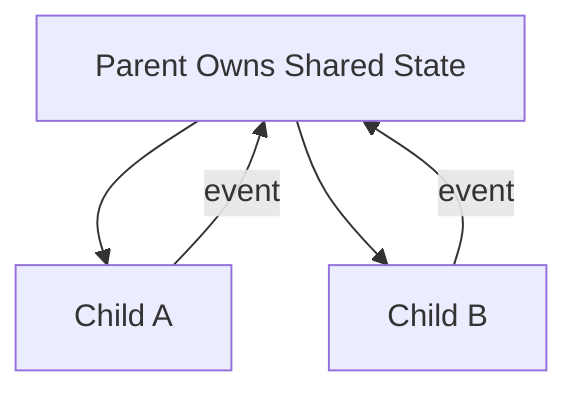

This creates a single source of truth for that shared state.

---

## 9. `useState`

Use for state that affects rendering.

```tsx
const [status, setStatus] =
  useState<"idle" | "loading" | "success" | "error">("idle");
```

### Functional Update

When next state depends on previous state:

```tsx
setCount(current => current + 1);
```

This is safer than relying on a captured render value when multiple updates may be queued.

---

## 10. `useEffect`

This is one of the highest-probability React interview questions.

Official React guidance frames an Effect as a way to **synchronize a component with an external system**.

Examples:

- network connection,
- subscription,
- timer,
- browser API,
- third-party widget.

Example:

```tsx
useEffect(() => {
  const connection = connect(roomId);

  return () => {
    connection.disconnect();
  };
}, [roomId]);
```

---

## 10.1 Real-Life Analogy

Your component is a hotel room.

React controls what is inside the room.

An Effect is used when the room must coordinate with something **outside the room**:

- external air-conditioning controller,
- phone line,
- reservation system.

---

## 10.2 Dependency Array

```tsx
useEffect(() => {
  subscribe(userId);

  return () => unsubscribe(userId);
}, [userId]);
```

The dependencies describe reactive values used by the Effect.

Do not manipulate dependencies merely to silence lint warnings.

---

## 10.3 Cleanup

Cleanup is important for:

- subscriptions,
- timers,
- external connections,
- request cancellation patterns where appropriate.

```tsx
useEffect(() => {
  const timer = setInterval(refresh, 5000);

  return () => clearInterval(timer);
}, []);
```

---

## 10.4 When You May Not Need an Effect

Avoid an Effect when a value can simply be calculated during render.

Bad:

```tsx
const [fullName, setFullName] = useState("");

useEffect(() => {
  setFullName(firstName + " " + lastName);
}, [firstName, lastName]);
```

Simpler:

```tsx
const fullName =
  `${firstName} ${lastName}`;
```

### Golden Rule

> **Do not use an Effect to synchronize React state with other React state when a derived value will do.**

---

## Interview-Ready Answer

> I use `useEffect` to synchronize a component with something outside React, such as a subscription, timer, browser API, or external connection. I do not use it automatically for derived state. I also treat the dependency list as part of the correctness model and provide cleanup when the external resource requires it.

---

## 11. `useRef`

A ref stores a value that persists between renders without causing a render when changed.

Common uses:

- DOM access,
- mutable integration handle,
- timer ID,
- previous/external value where rendering does not depend on it.

Example:

```tsx
const inputRef =
  useRef<HTMLInputElement>(null);

function focusInput() {
  inputRef.current?.focus();
}
```

### State vs Ref

Use **state** when the value affects UI rendering.

Use **ref** when the value must persist but does not drive the UI.

---

## 12. `useMemo`

`useMemo` caches the result of a calculation between renders based on dependencies.

```tsx
const visibleOrders = useMemo(
  () => filterOrders(orders, filter),
  [orders, filter]
);
```

### Do Not Say

> “Use `useMemo` to improve performance everywhere.”

Memoization also has cost and complexity.

Use it when:

- calculation is meaningfully expensive,
- stable value identity matters,
- measurement or architecture shows value.

### Interview-Ready Answer

> `useMemo` caches a calculated value between renders while its dependencies remain unchanged. I use it as a performance optimization, not as a correctness mechanism, and only when there is a meaningful expensive calculation or identity-sensitive dependency.

---

## 13. `useCallback`

`useCallback` caches a function definition between renders based on dependencies.

```tsx
const handleSelect = useCallback(
  (id: string) => {
    setSelectedId(id);
  },
  []
);
```

### When Useful

Often relevant when:

- passing callback to memoized child,
- function identity is a dependency,
- integration requires stable function identity.

### Interview-Ready Answer

> `useCallback` preserves a function identity across renders while its dependencies are unchanged. I use it when function identity actually matters, for example with a memoized child or another Hook dependency. I do not wrap every event handler in `useCallback`.

---

## 14. `useMemo` vs `useCallback`

```text
useMemo
→ caches a calculated value

useCallback
→ caches a function definition
```

Memory hook:

> **Memo = value**  
> **Callback = function**

---

## 15. Context

Context lets components read shared information without passing the same prop through every intermediate level.

Examples:

- theme,
- locale,
- authenticated-user metadata,
- application-level configuration.

### Visualization

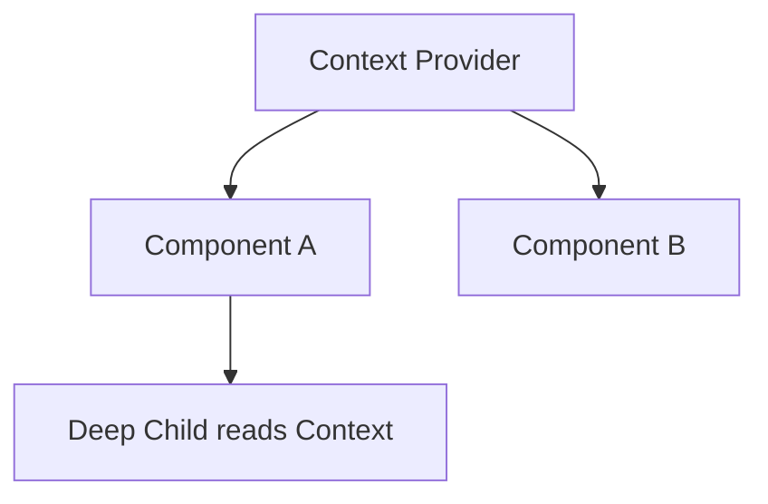

### Senior Insight

Do not turn one giant Context into a global dumping ground.

Large frequently changing context values can broaden re-render impact and increase coupling.

---

## 16. `useReducer`

Useful when state transitions are more structured or multiple state fields change through explicit actions.

```tsx
type State = {
  loading: boolean;
  error?: string;
};

type Action =
  | { type: "START" }
  | { type: "SUCCESS" }
  | { type: "ERROR"; message: string };
```

Reducer:

```tsx
function reducer(
  state: State,
  action: Action
): State {
  switch (action.type) {
    case "START":
      return { loading: true };

    case "SUCCESS":
      return { loading: false };

    case "ERROR":
      return {
        loading: false,
        error: action.message
      };
  }
}
```

### Interview-Ready Answer

> I use `useReducer` when state transitions benefit from being modeled explicitly as actions, especially when several related state values change together. For simple independent state, `useState` is usually clearer.

---

## 17. React Performance

Do not optimize because:

> “React re-renders.”

Re-rendering is normal.

Optimize when measurement identifies a problem.

---

## 17.1 Common Causes of Waste

- expensive calculations on every render,
- very large component tree updates,
- unstable object/function props sent to memoized children,
- oversized context updates,
- large lists,
- unnecessary Effects that trigger state updates.

---

## 17.2 Practical Tools

Possible techniques:

- split components by responsibility,
- keep state close to where it is used,
- avoid unnecessary lifted/global state,
- `memo` where useful,
- `useMemo`,
- `useCallback`,
- list virtualization for very large lists,
- lazy loading/code splitting,
- profile before/after.

---

## 17.3 Senior Answer

> My first performance strategy is good state ownership and component boundaries, not memoization everywhere. I identify what is actually re-rendering or expensive, then use profiling and targeted techniques such as memoization, virtualization, or code splitting only where they provide measurable value.

---

## 18. Error Boundaries — Concept

Error boundaries catch rendering errors in a component subtree and allow fallback UI.

They do not automatically catch every asynchronous or event-handler error.

Interview point:

> rendering failure strategy and API error strategy are different concerns.

---

## 19. Frontend API State

A production UI usually needs more than:

```text
data
```

Think:

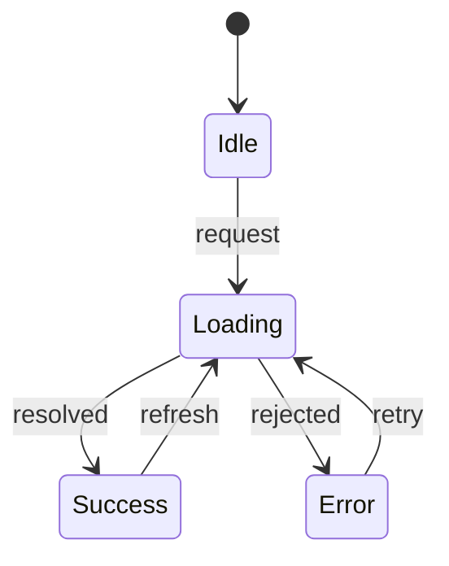

Model:

- idle,
- loading,
- success,
- empty,
- error,
- stale/refreshing where relevant.

This creates predictable UI behavior.

---

## 20. JavaScript Fundamentals

## 20.1 `var`, `let`, `const`

### `var`

- function-scoped,
- older declaration model,
- hoisted with initialization behavior that can surprise.

### `let`

- block-scoped,
- reassignment allowed.

### `const`

- block-scoped,
- reassignment not allowed.

### Important

`const` does not make an object immutable.

```js
const user = {
  name: "Deepak"
};

user.name = "Updated"; // allowed
```

The binding cannot be reassigned:

```js
user = {}; // not allowed
```

---

## 21. Scope

JavaScript commonly involves:

- global scope,
- function scope,
- block scope,
- lexical scope.

Example:

```js
function outer() {
  const name = "Deepak";

  function inner() {
    console.log(name);
  }

  inner();
}
```

`inner` can access variables from its lexical environment.

That leads directly to closures.

---

## 22. Closure

A closure is a function together with access to its surrounding lexical environment.

Example:

```js
function createCounter() {
  let count = 0;

  return function () {
    count++;
    return count;
  };
}

const counter = createCounter();

counter(); // 1
counter(); // 2
```

`count` remains accessible through the returned function.

### Real-Life Analogy

Imagine a worker leaving an office but carrying a locked notebook containing the environment they need.

The function still retains access to the variables from where it was created.

### Interview-Ready Answer

> A closure occurs when a function retains access to variables from its lexical environment even after the outer function has completed. Closures are fundamental to callbacks, encapsulation, event handlers, and many React patterns.

---

## 23. Hoisting

JavaScript declarations are processed before normal execution in ways commonly described as hoisting.

Avoid simplistic answers such as:

> “JavaScript moves declarations to the top.”

That is a learning model, not the literal runtime mechanism.

### Practical Interview View

Function declarations can often be called before their textual declaration.

`var` behaves differently from `let` and `const`.

`let` and `const` are not safely accessible before initialization because of the temporal dead zone.

---

## 24. `this`

`this` depends on **how a function is called**, not simply where it was written.

Example:

```js
const user = {
  name: "Deepak",

  printName() {
    console.log(this.name);
  }
};

user.printName();
```

Arrow functions do not create their own `this`; they use lexical `this` from the surrounding context.

### Interview Trap

Do not say:

> “`this` always points to the object.”

It depends on invocation form and execution context.

---

## 25. Promise

A Promise represents the eventual completion or failure of an asynchronous operation.

States:

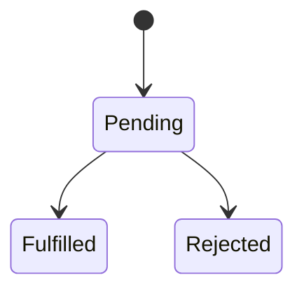

Example:

```js
fetch("/api/orders")
  .then(response => response.json())
  .then(data => console.log(data))
  .catch(error => console.error(error));
```

---

## 26. `async` / `await`

An `async` function returns a Promise.

`await` lets code wait for a Promise result within async flow while preserving Promise-based semantics.

```js
async function loadOrders() {
  const response =
    await fetch("/api/orders");

  return response.json();
}
```

Error:

```js
try {
  const orders = await loadOrders();
} catch (error) {
  // handle failure
}
```

### Interview-Ready Answer

> `async/await` is syntax over Promise-based asynchronous programming that makes sequential asynchronous logic easier to read. It does not make an operation synchronous and it does not block the JavaScript thread while a normal external asynchronous operation is waiting.

---

## 27. Event Loop

JavaScript code on the main browser execution context runs with a call stack.

Asynchronous callbacks are scheduled for later execution.

A simplified model:

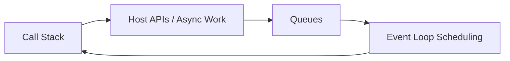

### Key Interview Point

Promise reactions use the microtask/job queue and normally execute before the next timer/event task after the current call stack completes.

---

## 28. Event Loop Example

```js
console.log("A");

setTimeout(() => {
  console.log("B");
}, 0);

Promise.resolve()
  .then(() => {
    console.log("C");
  });

console.log("D");
```

Typical output:

```text
A
D
C
B
```

Why?

1. synchronous stack runs first,
2. Promise reaction/microtask runs,
3. timer task runs afterward.

---

## 29. `Promise.all`

Use when independent async operations can run concurrently and all results are required.

```js
const [user, orders] =
  await Promise.all([
    loadUser(),
    loadOrders()
  ]);
```

### Senior Insight

Do not accidentally serialize independent operations:

```js
const user = await loadUser();
const orders = await loadOrders();
```

when they could safely run concurrently.

But also do not fan out unlimited requests without capacity considerations.

---

## 30. TypeScript Fundamentals

TypeScript adds static type checking on top of JavaScript development.

The type system primarily helps at development/compile time.

Do not say:

> “TypeScript validates API JSON automatically at runtime.”

It does not, unless runtime validation is implemented separately.

---

## 31. Interface

```ts
interface User {
  id: string;
  name: string;
}
```

Useful for describing object shapes and contracts.

---

## 32. Type Alias

```ts
type UserId = string;

type Status =
  | "idle"
  | "loading"
  | "success"
  | "error";
```

Type aliases can represent:

- primitives,
- unions,
- intersections,
- tuples,
- object types.

### Interface vs Type

Do not memorize:

> “Always interface for objects.”

Both can model object shapes.

Use the one that best communicates the design and team conventions.

---

## 33. Union Type

```ts
type Result =
  | { status: "success"; data: User }
  | { status: "error"; message: string };
```

This can create precise state modeling.

---

## 34. Discriminated Union

```ts
function render(result: Result) {
  if (result.status === "success") {
    return result.data.name;
  }

  return result.message;
}
```

TypeScript narrows the type based on the discriminant.

This is extremely useful for React UI state.

---

## 35. Narrowing

TypeScript can narrow a broad type through runtime checks.

Example:

```ts
function print(value: string | number) {
  if (typeof value === "string") {
    console.log(value.toUpperCase());
  } else {
    console.log(value.toFixed(2));
  }
}
```

---

## 36. Generics

Generics allow reusable code while preserving relationships between types.

Without generic:

```ts
function identity(value: unknown): unknown {
  return value;
}
```

With generic:

```ts
function identity<T>(value: T): T {
  return value;
}
```

The output type remains connected to the input type.

### React Example

```ts
type ApiResponse<T> = {
  data: T;
  traceId: string;
};
```

Then:

```ts
type UserResponse =
  ApiResponse<User>;
```

### Interview-Ready Answer

> Generics let me write reusable components or functions while preserving type relationships. Instead of falling back to `any`, I can express that an input and output or wrapper and contained value are related.

---

## 37. `unknown` vs `any`

## `any`

Effectively turns off many type-safety checks.

## `unknown`

Says:

> value may be anything, but prove what it is before using it.

Example:

```ts
function handle(value: unknown) {
  if (typeof value === "string") {
    console.log(value.toUpperCase());
  }
}
```

### Senior Rule

Prefer `unknown` at genuinely unknown boundaries and narrow safely.

---

## 38. Utility Types

Common examples:

```ts
Partial<T>
Required<T>
Readonly<T>
Pick<T, K>
Omit<T, K>
Record<K, T>
```

Example:

```ts
type UserUpdate =
  Partial<Pick<User, "name" | "email">>;
```

Use utilities to express intent.

Do not create unreadable type puzzles merely because TypeScript can.

---

## 39. React + TypeScript

Example props:

```tsx
type OrderCardProps = {
  order: Order;
  onSelect: (id: string) => void;
};

function OrderCard({
  order,
  onSelect
}: OrderCardProps) {
  return (
    <button
      onClick={() => onSelect(order.id)}
    >
      {order.id}
    </button>
  );
}
```

TypeScript improves:

- prop contracts,
- event handling,
- ref typing,
- API model clarity,
- refactoring safety.

---

## 40. API Boundary — TypeScript Reality

Suppose:

```ts
const response =
  await fetch("/api/user");

const data =
  await response.json();
```

A TypeScript annotation alone does not prove runtime JSON matches the declared type.

For untrusted/external data:

> runtime validation may still be necessary.

This is a strong senior-level distinction.

---

## 41. Frontend Security — Quick Awareness

This is not the main security pack, but a senior frontend engineer should remember:

- escape/render untrusted content safely,
- avoid unsafe HTML injection,
- do not expose secrets in frontend code,
- treat browser token storage carefully,
- enforce authorization on the backend,
- validate server responses/boundaries,
- keep dependencies maintained.

### Critical Rule

> Hiding a button is not authorization.

Backend must enforce access.

---

## 42. Project Mapping

This section follows **Evidence First**.

The résumé available to the interview panel explicitly supports recent experience with:

- React.js,
- TypeScript,
- Node.js,
- enterprise full-stack applications,
- REST APIs,
- architecture,
- performance optimization,
- code reviews,
- security remediation,
- production support.

The Bechtel section specifically lists React.js and TypeScript among the enterprise application stack.

The DEP platform also includes React.js and TypeScript in an end-to-end architecture.

### Safe Positioning

> React and TypeScript are part of my recent full-stack experience. At Bechtel and in the DEP platform, I worked in systems where React/TypeScript formed the web layer alongside backend APIs and cloud/data services. I can discuss component architecture, API integration, performance, quality, and maintainability from that experience.

Do not invent a specific Hook, state library, or performance incident unless it was actually used.

---

## Candidate Validation

| Topic | Real Project / Evidence |
|---|---|
| `useState` | __________________ |
| `useEffect` | __________________ |
| Context | __________________ |
| Redux / global state | __________________ |
| React performance issue | __________________ |
| Large list/table | __________________ |
| API integration | __________________ |
| Authentication UI | __________________ |
| TypeScript generics | __________________ |
| Frontend production bug | __________________ |

---

## 43. Interview-Ready Answers

## Q1. Props vs state?

> Props are read-only inputs provided by a parent, while state is information React retains for a component's position in the UI tree. Props support parent-to-child data flow, while state changes drive re-rendering.

---

## Q2. What causes a React component to render?

> A component renders when React schedules it due to changes such as its state, a parent render, or consumed context updates. Rendering means React executes the component to calculate UI; it does not necessarily mean every DOM node is rewritten.

---

## Q3. What is `useEffect`?

> I use `useEffect` to synchronize a component with an external system such as a subscription, timer, browser API, or connection. I avoid using it for values that can simply be derived during render, and I provide cleanup where the external resource requires it.

---

## Q4. `useRef` vs `useState`?

> State is for values that affect rendering. A ref persists across renders but changing it does not schedule a render, so it is useful for DOM references and mutable values that are not part of visible UI state.

---

## Q5. `useMemo` vs `useCallback`?

> `useMemo` caches a calculated value, while `useCallback` caches a function identity. Both are performance tools, not correctness tools, so I use them when measurement or component architecture shows that stable values or functions matter.

---

## Q6. Why are keys important?

> Keys let React match list items across renders and preserve the correct component identity. I prefer stable business identifiers. Using array indexes can cause state to become associated with the wrong item when the list changes order.

---

## Q7. Controlled vs uncontrolled component?

> A controlled input gets its value from React state, which is useful for validation and dynamic UI behavior. An uncontrolled input lets the DOM hold the current value. I choose based on how much React needs to coordinate the form state.

---

## Q8. Context vs props?

> Props are the clearest option for direct ownership relationships. Context is useful for values needed across a deeper subtree without repeatedly threading them through intermediate components. I avoid turning Context into one large global state container.

---

## Q9. How do you optimize React performance?

> I start with component boundaries and state ownership, then profile the real bottleneck. Depending on evidence, I may use memoization, stable callbacks, list virtualization, code splitting, or reduce unnecessary state/effects. I do not apply `useMemo` and `useCallback` everywhere.

---

## Q10. What is a closure?

> A closure is a function that retains access to variables from its lexical environment even after the outer scope has completed. Closures are fundamental to callbacks, encapsulation, event handlers, and React Hook behavior.

---

## Q11. Explain JavaScript event loop.

> JavaScript runs synchronous code on the call stack. Asynchronous operations schedule callbacks/jobs for later execution. After the current stack completes, queued microtasks such as Promise reactions normally run before the next timer or event task. That explains why a resolved Promise callback typically runs before a zero-delay timer.

---

## Q12. Does `await` block the browser thread?

> `await` pauses execution of that async function until the Promise settles, but it does not normally block the JavaScript thread while external asynchronous work is pending. Other work can continue through the event loop.

---

## Q13. `let` vs `const`?

> Both are block-scoped. `let` allows reassignment; `const` prevents reassignment of the binding. `const` does not make an object deeply immutable.

---

## Q14. Interface vs type in TypeScript?

> Both can model object shapes. Interfaces are especially natural for object contracts and extension patterns, while type aliases can also represent unions, intersections, primitives and other composed types. I choose based on clarity and team conventions rather than treating one as universally superior.

---

## Q15. Why generics?

> Generics let reusable code preserve type relationships. For example, an `ApiResponse<T>` can wrap any response type without falling back to `any`, while still ensuring the caller receives the correct contained type.

---

## Q16. `any` vs `unknown`?

> `any` disables much of TypeScript's checking for that value. `unknown` represents a value whose type is not yet known and requires narrowing before use, so I prefer `unknown` at genuinely untrusted or unknown boundaries.

---

## 44. Likely Follow-Ups

## React

- Render vs commit?
- Why can an Effect run more than expected in development?
- What is stale closure?
- Why should dependencies not be omitted?
- `memo` vs `useMemo`?
- Context performance?
- `useReducer` vs Redux?
- Server Components?
- Suspense?
- Error boundaries?
- Code splitting?
- Lazy loading?
- How would you optimize a 20,000-row table?

## JavaScript

- Temporal dead zone?
- `call`, `apply`, `bind`?
- Arrow function `this`?
- Prototype chain?
- Shallow vs deep copy?
- Promise chaining?
- `Promise.all` failure behavior?
- `Promise.allSettled`?
- Microtask starvation?
- Debounce vs throttle?

## TypeScript

- Structural typing?
- Intersection types?
- Type guard?
- `keyof`?
- `typeof` in type positions?
- Generic constraints?
- Mapped types?
- `Readonly`?
- Discriminated union?
- Why TypeScript does not validate runtime JSON?

Do not study all Level 3 questions equally unless the interviewer goes there.

---

## 45. Common Interview Traps

## Trap 1

> “`useEffect` is for any code after rendering.”

Too broad.

Use it primarily for synchronization with external systems.

---

## Trap 2

> “Empty dependency array means run once forever.”

Too simplistic.

Think in terms of dependencies and component lifecycle; development behavior can expose setup/cleanup issues.

---

## Trap 3

> “`useMemo` makes React fast.”

Wrong.

Memoization has cost and must solve a real problem.

---

## Trap 4

> “`useCallback` prevents the component from rendering.”

Wrong.

It stabilizes function identity.

---

## Trap 5

> “React key is only for removing warnings.”

Wrong.

It participates in identity/reconciliation.

---

## Trap 6

> “Closure means the outer function is still running.”

Wrong.

The inner function retains access to its lexical environment.

---

## Trap 7

> “`await` blocks JavaScript.”

Wrong in the normal async-I/O sense.

It suspends that async function's continuation.

---

## Trap 8

> “`const` means immutable.”

Wrong.

The binding cannot be reassigned; object contents may still mutate.

---

## Trap 9

> “TypeScript guarantees API data is valid at runtime.”

Wrong.

Runtime validation is separate.

---

## Trap 10

> “If the button is hidden, the user cannot perform the operation.”

Wrong.

Authorization belongs on the backend.

---

## 46. Interviewer Intent

| Question | What is really being tested |
|---|---|
| Props vs state | React fundamentals |
| Render trigger | React mental model |
| `useEffect` | Side-effect correctness |
| `useMemo` / `useCallback` | Performance judgment |
| Keys | Reconciliation understanding |
| Context | State architecture |
| React optimization | Senior frontend maturity |
| Closure | JavaScript depth |
| Event loop | Async runtime understanding |
| Promise / await | Async correctness |
| `this` | JavaScript execution model |
| Type unions | Modeling |
| Generics | Reusable type safety |
| `unknown` vs `any` | Type discipline |
| API typing | Runtime vs compile-time precision |

---

## 47. Practical / Mini Mock Content

This section is for later practice only.

## Level 1 — Must Know

1. Props vs state?
2. What causes a component to render?
3. Explain `useState`.
4. Explain `useEffect`.
5. When do you not need an Effect?
6. `useRef` vs state?
7. `useMemo` vs `useCallback`?
8. Why keys?
9. Controlled vs uncontrolled?
10. Context use case?
11. Explain closure.
12. `var` vs `let` vs `const`?
13. Explain Promise.
14. Explain async/await.
15. Explain event loop.
16. Interface vs type?
17. What is a union?
18. What is a generic?
19. `any` vs `unknown`?

## Level 2 — Follow-Up

20. Why can child render when props look unchanged?
21. What is stale closure?
22. Why can missing Effect dependencies cause bugs?
23. How would you optimize a large list?
24. When can Context become a performance issue?
25. Why use a reducer?
26. Why does Promise callback run before `setTimeout(..., 0)`?
27. Arrow `this` vs normal function `this`?
28. What is temporal dead zone?
29. What is Promise concurrency?
30. How do discriminated unions help React state?
31. Why is runtime validation still required with TypeScript?
32. How would you model loading/success/error state?

## Level 3 — Engineering Deep Dive

33. How would you debug repeated React rendering?
34. How would you find an expensive component?
35. How would you structure state in a large screen?
36. How would you avoid API race conditions in a UI?
37. How would you cancel/ignore stale requests?
38. How would you design a typed reusable data-fetching abstraction?
39. How do you prevent an unbounded frontend request fan-out?
40. How would you prove a frontend optimization actually helped?

---

## 48. Quick Revision

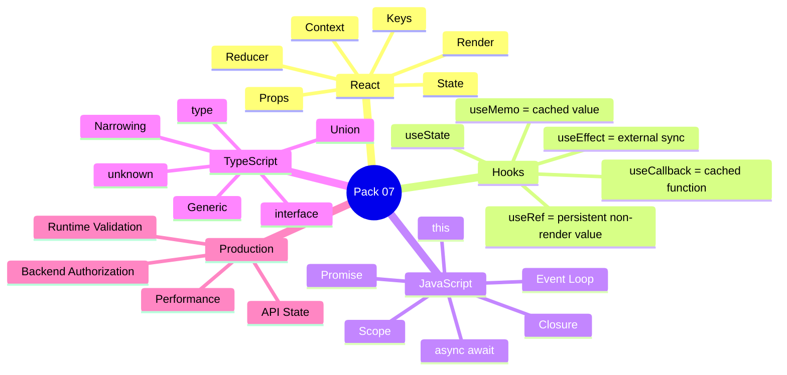

---

## 49. 90-Second Rapid Revision

```text
PROPS
read-only input

STATE
React remembers data

RENDER
calculate UI

KEY
stable identity

useState
render-driving state

useEffect
synchronize with external system

useRef
persistent value without render

useMemo
cache calculated value

useCallback
cache function identity

CONTEXT
shared subtree value

REDUCER
explicit state transitions

CLOSURE
function + lexical environment

const
binding cannot be reassigned; object may mutate

PROMISE
eventual async result

await
pause async function continuation, not normal thread blocking

EVENT LOOP
stack -> microtasks -> next task

INTERFACE / TYPE
model contracts

UNION
one of several types

GENERIC
reusable type relationship

unknown
narrow before using

TYPESCRIPT
compile-time safety, not automatic runtime validation

PERFORMANCE
measure -> target -> verify
```

---

## 50. Candidate Answer Mapping

| Area | Safe Claim | Evidence / Mapping | Risk |
|---|---|---|---|
| React.js | Supported, recent | Bechtel / DEP | Low |
| TypeScript | Supported, recent | Bechtel / DEP | Low |
| REST integration | Supported | Resume | Low |
| React architecture | Supported broadly | Bechtel architecture work | Low |
| Specific Redux implementation | Validate | __________________ | Medium |
| Specific Hook usage | Validate | __________________ | Medium |
| React performance metric | Validate | __________________ | Medium |
| Large-table virtualization | Validate | __________________ | Medium |
| TypeScript generics in production | Validate | __________________ | Medium |
| Frontend auth implementation | Validate | __________________ | Medium |

---

## 51. Final Visualization

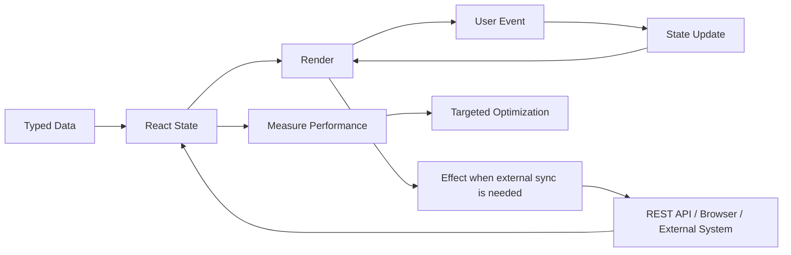

---

## Golden Rules

> **React state should model UI truth, not duplicate every derived value.**

> **Use Effects for external synchronization, not as a default place for application logic.**

> **A render is normal; optimize measured bottlenecks, not the existence of rendering.**

> **JavaScript closures and the event loop are foundational to understanding React behavior.**

> **TypeScript improves compile-time contracts but does not validate untrusted runtime data automatically.**

> **Do not claim a Redux, Hook, or performance implementation you cannot map to a real project.**

For a senior engineer:

> **State → Render → Effect → Runtime → Type Safety → Measurement**

---

## Reference Baseline

This pack was checked against current official documentation for the core concepts used here:

- React documentation — Hooks, state, Effects, list keys, and state sharing: https://react.dev/
- TypeScript Handbook — generics, narrowing, and utility types: https://www.typescriptlang.org/docs/
- ECMAScript language standard: https://tc39.es/ecma262/

The interview material intentionally avoids depending on framework-version trivia unless it materially improves senior-level understanding.
