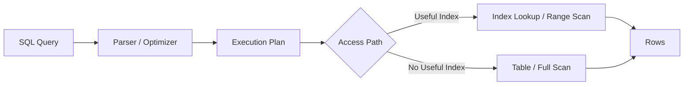
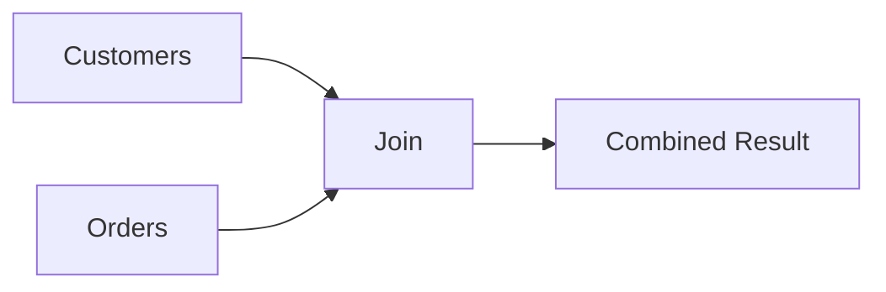
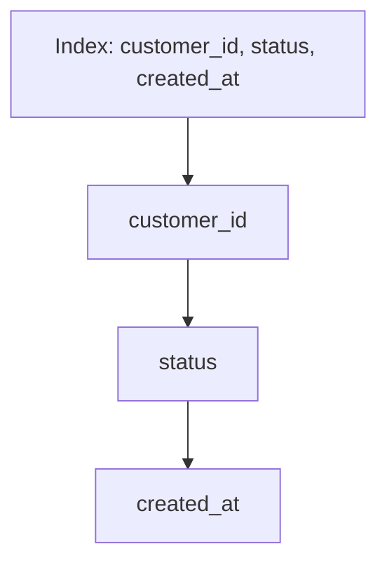
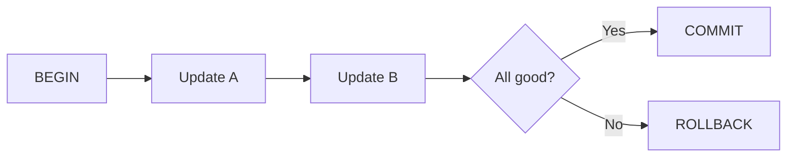
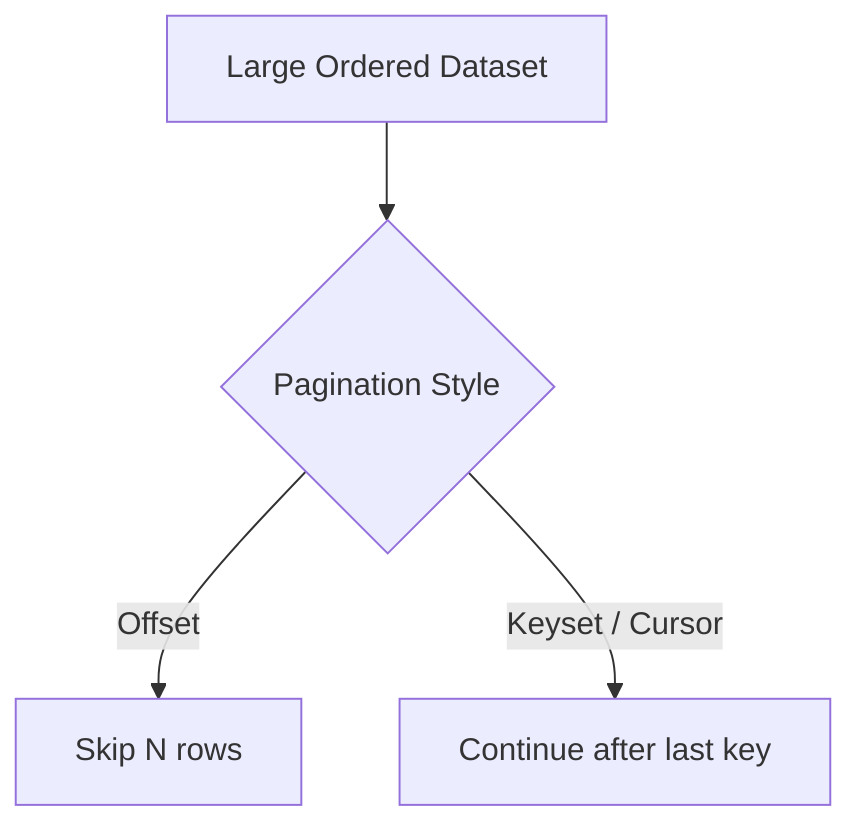
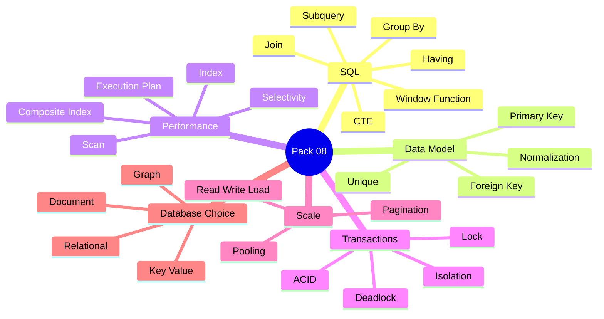
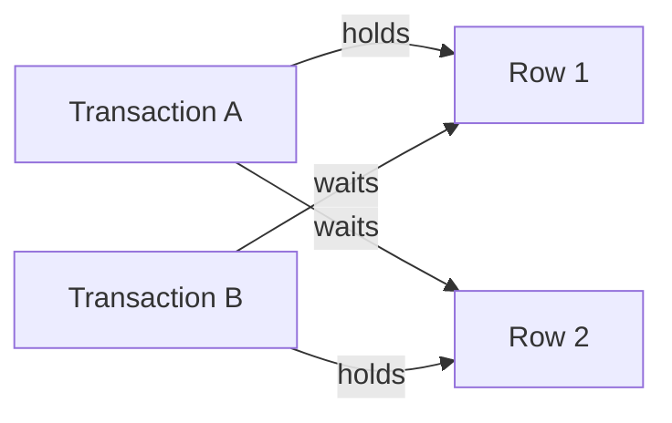
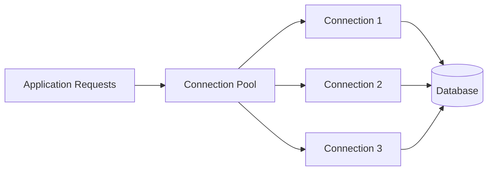
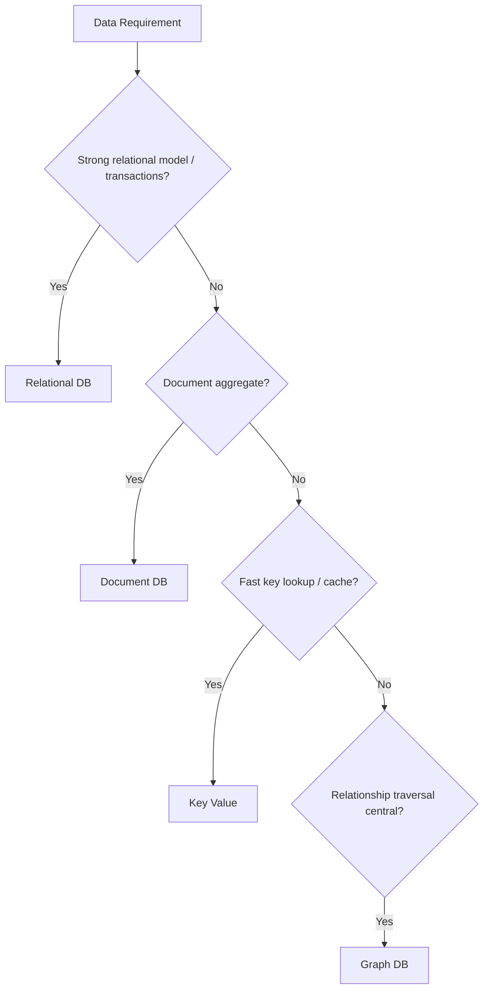
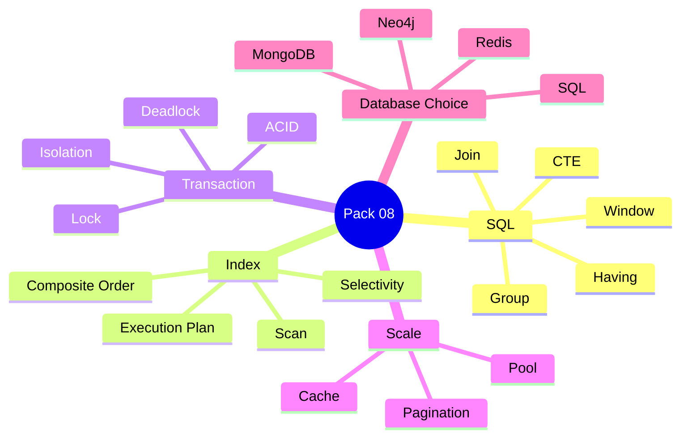

# VRIZE Interview Preparation — Pack 08
## SQL + Database Performance + Data Modeling

**Target Role:** Senior Fullstack Developer — Round 1  
**Candidate:** Deepak Kumar  
**Priority:** P0 — Must Know  
**Timebox:** 75–90 minutes study + later practice  
**Approach:** KIS + DRY + SOLID | Mind-Friendly | Interview-First | Evidence-First | No Bluff  
**Depth:** Level 1 Must Know → Level 2 Follow-Up → Level 3 Engineering Deep Dive

---

## Readiness Gate

Before this pack is considered ready, you should be able to:

- Explain joins, grouping, subqueries, CTEs, and window functions.
- Explain primary key, foreign key, unique constraint, and normalization.
- Explain ACID and transaction isolation at interview level.
- Explain what an index is and how it improves reads.
- Explain why indexes can also hurt writes.
- Explain composite-index ordering and the leftmost-prefix idea.
- Explain query execution plans, full scans, selectivity, and cardinality.
- Explain the N+1 problem from both ORM and SQL perspectives.
- Explain offset pagination vs keyset/cursor pagination.
- Explain connection pooling and why a bigger pool is not automatically better.
- Explain deadlocks and common prevention strategies.
- Explain when SQL vs document vs key-value vs graph databases may be appropriate.
- Connect database answers to real project experience only where the evidence is real.

---

## 1. Objective

This pack answers:

> **“Can you reason about data access and database performance, not just write SELECT statements?”**

A senior interviewer may start with:

> “Difference between WHERE and HAVING?”

and quickly move to:

> “Why is this query slow?”

> “Which index would you create?”

> “Why is the index not being used?”

> “What happens under concurrent updates?”

> “How would you paginate 50 million rows?”

The mental flow is:

```text
Data Model
→ Query
→ Index
→ Execution Plan
→ Transaction
→ Concurrency
→ Scale
```

---

## 2. Real-Life Analogy

Think of a large library.

- **Table** = shelf category.
- **Row** = one book record.
- **Primary Key** = unique accession number.
- **Foreign Key** = reference connecting one record to another.
- **Index** = library catalog.
- **Composite Index** = catalog sorted by multiple fields in a defined order.
- **Execution Plan** = librarian's chosen route to find the answer.
- **Transaction** = a set of related operations that should succeed or fail together.

Without an index:

> scan many records.

With a useful index:

> jump close to the required records.

The analogy is the memory hook. The engineering model comes next.

---

## 3. Visualization

### 3.1 Query Flow



### 3.2 Join Mental Model



### 3.3 Composite Index



### 3.4 Transaction



### 3.5 Pagination



---

## 4. Mind Map



Five anchors:

> **Query → Index → Plan → Transaction → Scale**

---

## 5. Keys and Constraints

### Primary Key

A primary key uniquely identifies a row.

```sql
CREATE TABLE users (
    id BIGINT PRIMARY KEY,
    email VARCHAR(255) NOT NULL
);
```

A good primary key is:

- unique,
- stable,
- not nullable.

### Foreign Key

A foreign key represents a relationship and can enforce referential integrity.

```sql
CREATE TABLE orders (
    id BIGINT PRIMARY KEY,
    customer_id BIGINT NOT NULL,
    CONSTRAINT fk_order_customer
        FOREIGN KEY (customer_id)
        REFERENCES customers(id)
);
```

### Unique Constraint

Use when a business field must remain unique.

```sql
ALTER TABLE users
ADD CONSTRAINT uq_users_email
UNIQUE (email);
```

Senior point:

> Application validation is useful, but a database constraint remains an important final correctness boundary under concurrency.

---

## 6. Normalization

Normalization reduces unnecessary duplication and update anomalies.

Bad conceptual design:

```text
orders
- order_id
- customer_name
- customer_email
- customer_address
```

Better:

```text
customers
orders → customer_id
```

### Senior Insight

Normalization is not a religion.

Read-heavy analytics/search workloads may deliberately denormalize selected data when the trade-off is measured and justified.

---

## 7. Joins

### INNER JOIN

Returns matching rows from both sides.

```sql
SELECT
    o.id,
    c.name
FROM orders o
JOIN customers c
    ON c.id = o.customer_id;
```

### LEFT JOIN

Keeps every row from the left side.

```sql
SELECT
    c.id,
    o.id AS order_id
FROM customers c
LEFT JOIN orders o
    ON o.customer_id = c.id;
```

Mental model:

```text
INNER JOIN
→ only matches

LEFT JOIN
→ keep everything on left
```

### Common Trap

This query:

```sql
SELECT *
FROM customers c
LEFT JOIN orders o
  ON o.customer_id = c.id
WHERE o.status = 'PAID';
```

can remove customers without matching orders because the `WHERE` predicate rejects NULL values from the right side.

Depending on the desired semantics, the filter may need to be part of the `ON` clause.

---

## 8. WHERE vs HAVING

`WHERE` filters rows before grouping.

`HAVING` filters aggregated groups.

```sql
SELECT
    customer_id,
    COUNT(*) AS order_count
FROM orders
WHERE status = 'PAID'
GROUP BY customer_id
HAVING COUNT(*) >= 5;
```

Memory flow:

```text
WHERE
→ GROUP BY
→ HAVING
```

---

## 9. GROUP BY

Use it when aggregating rows by a key.

```sql
SELECT
    department_id,
    AVG(salary)
FROM employees
GROUP BY department_id;
```

Typical aggregates:

```text
COUNT
SUM
AVG
MIN
MAX
```

---

## 10. Subquery

Example:

```sql
SELECT *
FROM employees
WHERE salary > (
    SELECT AVG(salary)
    FROM employees
);
```

Subqueries are not inherently bad.

Choose the clearest correct query and verify performance using the database's actual plan.

---

## 11. CTE

A Common Table Expression can make complex queries easier to structure.

```sql
WITH active_users AS (
    SELECT id, name
    FROM users
    WHERE active = true
)
SELECT *
FROM active_users;
```

Useful for:

- readability,
- decomposition,
- recursive queries where supported.

### Senior Precision

Do not claim:

> “CTE is always faster.”

Optimization behavior depends on the database engine and query.

---

## 12. Window Functions

A window function calculates across related rows without collapsing the original row set.

```sql
SELECT
    employee_id,
    department_id,
    salary,
    RANK() OVER (
        PARTITION BY department_id
        ORDER BY salary DESC
    ) AS salary_rank
FROM employees;
```

Key difference:

```text
GROUP BY
→ collapses rows

WINDOW FUNCTION
→ keeps rows + adds analytical value
```

### `ROW_NUMBER` vs `RANK` vs `DENSE_RANK`

For values:

```text
100
100
90
```

Conceptually:

```text
ROW_NUMBER → 1, 2, 3
RANK       → 1, 1, 3
DENSE_RANK → 1, 1, 2
```

---

## 13. Index

An index is an additional data structure maintained to speed selected lookup, join, filtering, or ordering patterns.

### Why Not Index Every Column?

Indexes cost:

- storage,
- insert time,
- update time,
- delete time,
- maintenance.

Senior rule:

> **Index for actual access patterns, not because a column exists.**

---

## 14. Tree-Based Index — Interview Level

Many relational indexes are implemented using tree-based structures suitable for:

- equality lookup,
- range queries,
- ordered traversal.

Simple mental model:

```text
root
→ branch
→ leaf
→ matching row/reference
```

Do not turn the answer into page-layout internals unless asked.

---

## 15. Composite Index

Example:

```sql
CREATE INDEX idx_orders_customer_status_created
ON orders(customer_id, status, created_at);
```

A query such as:

```sql
WHERE customer_id = ?
  AND status = ?
ORDER BY created_at
```

is naturally aligned with the index order.

A query only on:

```sql
WHERE created_at = ?
```

may not benefit in the same way.

### Leftmost-Prefix Mental Model

For:

```text
(A, B, C)
```

natural prefixes include:

```text
A
A, B
A, B, C
```

Exact optimizer behavior depends on the database, but leading-column order is a key design consideration.

---

## 16. Selectivity

Selectivity describes how strongly a condition narrows the dataset.

Example:

```text
status = ACTIVE
```

may match a large percentage of rows.

A unique email may match one row.

An index is generally more useful when it helps narrow the search meaningfully, though the final decision belongs to the optimizer.

---

## 17. Cardinality and Statistics

The optimizer estimates how many rows each operation may produce.

Those estimates influence:

- join order,
- index choice,
- scan choice,
- algorithm selection.

Poor/stale statistics can lead to poor plans.

Senior takeaway:

> execution plans are driven by estimated data shape, not only SQL text.

---

## 18. Execution Plan

When a query is slow, inspect the plan.

Depending on database:

```text
EXPLAIN
EXPLAIN ANALYZE
graphical execution plan
```

Look for:

- table/index scans,
- index access,
- joins,
- sorts,
- estimated vs actual rows,
- filters,
- expensive operators.

### Interview-Ready Answer

> I do not add indexes blindly. I first identify and measure the exact slow query, inspect its execution plan, compare estimated and actual row behavior, and check whether access paths, joins, filters, and sort operations match the existing indexes and data distribution.

---

## 19. Why an Index May Not Be Used

Possible reasons:

- low selectivity,
- query returns a large part of the table,
- function applied to indexed column,
- implicit type conversion,
- composite index does not match the predicate,
- stale statistics,
- optimizer estimates favor a scan,
- table is small enough that scanning is cheaper.

Example:

```sql
WHERE LOWER(email) = ?
```

may not use a normal index on `email` unless the database/index strategy supports that expression.

---

## 20. Covering Index — Concept

If an index contains all data required by a query, the engine may avoid additional base-table access.

Potential benefit:

- fewer reads.

Trade-off:

- wider index,
- more storage,
- more write maintenance.

Do not create very wide indexes without evidence.

---

## 21. N+1 Problem

ORM pattern:

```text
1 query → 100 orders
100 queries → customer for each order
```

Total:

```text
101 queries
```

Possible fixes:

- join/fetch join,
- projection,
- batching,
- explicit query,
- data shaping.

Senior rule:

> Measure the generated SQL. ORM abstraction does not remove database behavior.

---

## 22. ACID

### Atomicity

All transactional work succeeds or fails as one unit.

### Consistency

Defined constraints/invariants remain valid.

### Isolation

Concurrent transactions behave according to the chosen isolation guarantees.

### Durability

Committed data survives expected failures according to database guarantees.

### Interview-Ready Answer

> ACID gives the core transactional guarantees: all-or-nothing work, preservation of valid state, controlled interaction between concurrent transactions, and persistence of committed data.

---

## 23. Isolation Levels — Interview Model

Common conceptual levels:

- Read Uncommitted
- Read Committed
- Repeatable Read
- Serializable

Exact behavior can vary by database implementation.

### Dirty Read

Read another transaction's uncommitted data.

### Non-Repeatable Read

Read the same row twice and observe different committed values.

### Phantom Read

Repeat a range query and see a different set of matching rows.

### Senior Rule

Stronger isolation can improve correctness guarantees but may increase:

- blocking,
- conflicts,
- serialization cost.

Choose according to business requirements.

---

## 24. Optimistic vs Pessimistic Locking

### Optimistic

Assume conflicts are uncommon and detect stale updates.

Concept:

```text
read version 5
→ update WHERE version = 5
→ zero rows changed means conflict
```

### Pessimistic

Acquire a lock to block conflicting work.

Useful when conflicts are likely and waiting is preferable to retrying.

### Interview-Ready Answer

> Optimistic locking works well when conflicts are relatively rare because it allows concurrency and detects stale updates. Pessimistic locking is useful when contention is expected and the business prefers controlled blocking. I choose based on conflict probability and correctness behavior.

---

## 25. Deadlock

Two transactions can lock resources in opposite order.



Prevention:

- consistent lock ordering,
- short transactions,
- good indexes,
- minimal lock scope,
- safe retry when the database aborts one transaction.

---

## 26. Connection Pooling

A connection pool reuses a controlled set of database connections.



### Why Bigger Is Not Automatically Better

A huge pool can:

- overload database CPU,
- increase memory usage,
- increase lock contention,
- create bigger internal DB queues.

Pool size must reflect:

- application concurrency,
- query latency,
- database capacity,
- number of application instances.

---

## 27. Pagination

### Offset Pagination

```sql
SELECT *
FROM orders
ORDER BY id
LIMIT 50 OFFSET 500000;
```

Simple but deep offsets may require significant skipping/work.

### Keyset Pagination

```sql
SELECT *
FROM orders
WHERE id > :last_id
ORDER BY id
LIMIT 50;
```

Useful when:

- stable ordered key exists,
- sequential navigation is acceptable,
- deep-page performance matters.

### Interview-Ready Answer

> Offset pagination is simple and supports page-number navigation, but deep offsets can become expensive. Keyset pagination continues from the last seen ordered key and can scale better for large sequential datasets, though it does not naturally support arbitrary page jumps.

---

## 28. Read and Write Scaling

Before sharding, consider simpler levers:

- query optimization,
- indexes,
- caching,
- read replicas,
- connection management,
- denormalized read models where justified.

Write scaling is harder because consistency and coordination matter more.

Senior rule:

> **Do not jump to sharding before proving simpler approaches are insufficient.**

---

## 29. SQL vs NoSQL

Do not answer:

> “SQL is structured and NoSQL is unstructured.”

Too shallow.

Choose by:

- data model,
- relationship shape,
- consistency requirements,
- query pattern,
- scale,
- operational complexity.

### Relational Database

Good fit when:

- transactions matter,
- relationships matter,
- integrity constraints matter,
- flexible structured querying matters.

### Document Database

Good fit when:

- aggregate/document shape is natural,
- access pattern aligns with document retrieval,
- controlled schema flexibility is useful.

Example:

```text
MongoDB
```

### Key-Value Store

Good fit for:

- cache,
- sessions,
- fast lookup by key,
- counters.

Example:

```text
Redis
```

### Graph Database

Good fit when relationships and multi-hop traversal are central.

Example:

```text
Neo4j
```

---

## 30. Database Choice Visualization



This is a mental aid, not an absolute decision tree.

---

## 31. Production Scenario — Slow Query

Question:

> An API became slow because of SQL. What do you do?

Reasoning:

```text
identify exact query
→ reproduce
→ measure latency
→ inspect plan
→ compare row estimates
→ inspect indexes
→ inspect joins/filter/sort
→ inspect query count/N+1
→ fix
→ measure again
```

### Strong Answer

> I first identify the exact query and reproduce the issue under a comparable workload. Then I inspect the execution plan, row counts and estimates, index usage, join/filter/sort behavior, and whether the application is issuing repeated queries. I make the smallest justified change and measure the same workload again.

---

## 32. Production Scenario — Database CPU High

Possible causes:

- large scans,
- poor plans,
- missing/ineffective indexes,
- excessive queries,
- high connection count,
- traffic spike,
- repeated retries,
- large sorts/aggregations,
- contention.

Do not answer:

> “Scale the database.”

Find the cause first.

---

## 33. Project Mapping

This section follows **Evidence First**.

The résumé available to the interview panel supports experience with:

- SQL/MySQL,
- MongoDB,
- Neo4j,
- Redis,
- relational and NoSQL systems,
- performance optimization,
- data-access optimization,
- caching,
- production support.

The DEP platform explicitly includes MongoDB and Neo4j.

### Safe Positioning

> My database experience spans relational and non-relational systems, including SQL/MySQL, MongoDB, Neo4j, and Redis. In architecture and performance work I focus on access patterns, indexing, data ownership, caching, and choosing the datastore according to the problem rather than forcing every workload into one database.

Do not claim a specific index or execution-plan incident unless it is real and defensible.

### Candidate Validation

| Topic | Real Project / Evidence |
|---|---|
| Complex SQL query | __________________ |
| Index tuning | __________________ |
| Execution plan | __________________ |
| N+1 issue | __________________ |
| Transaction issue | __________________ |
| Deadlock | __________________ |
| Connection pool tuning | __________________ |
| MongoDB design | __________________ |
| Redis caching | __________________ |
| Neo4j graph use case | __________________ |

---

## 34. Interview-Ready Answers

### Q1. WHERE vs HAVING?

> `WHERE` filters rows before grouping, while `HAVING` filters grouped or aggregated results after `GROUP BY`.

### Q2. INNER JOIN vs LEFT JOIN?

> INNER JOIN returns only matching rows from both sides. LEFT JOIN preserves every row from the left side and returns matching right-side values where available.

### Q3. GROUP BY vs window function?

> `GROUP BY` collapses rows into aggregated groups. A window function performs calculations across related rows while preserving the original row-level result.

### Q4. What is an index?

> An index is an additional database structure used to speed selected lookup, join, filtering, and ordering patterns. It can significantly reduce reads, but it costs storage and write maintenance.

### Q5. Why not index every column?

> Every index must be stored and maintained on writes. Low-value indexes can slow inserts and updates without improving important queries. I index according to real access patterns and execution evidence.

### Q6. What is a composite index?

> A composite index contains multiple columns in a defined order. Leading-column order affects which query patterns can use it efficiently, so I choose the order based on predicates, selectivity, and sorting/access requirements.

### Q7. Why might an index not be used?

> The optimizer may prefer a scan if the filter is not selective, a large percentage of the table is required, an expression prevents effective index use, statistics are poor, or the composite index does not match the access pattern. I confirm it using the execution plan.

### Q8. What is an execution plan?

> It shows how the database intends to execute the query—scans, indexes, joins, sorts, and estimated rows. I use it to identify the expensive path and compare estimates with actual behavior where the database provides that information.

### Q9. Explain ACID.

> Atomicity is all-or-nothing work, consistency preserves valid state, isolation controls concurrent transaction behavior, and durability protects committed data.

### Q10. What is transaction isolation?

> Isolation defines how concurrent transactions can observe or interfere with one another. Stronger isolation can reduce anomalies but may increase conflicts or blocking, so I choose it according to business correctness.

### Q11. Optimistic vs pessimistic locking?

> Optimistic locking detects a conflict after concurrent work, often with a version field, and suits lower-contention cases. Pessimistic locking blocks conflicting access early and may suit high-contention operations where waiting is preferable to retrying.

### Q12. What is a deadlock?

> A deadlock occurs when transactions form a circular wait for locks. I reduce the risk through consistent lock order, short transactions, efficient queries and indexes, and safe retry when the database aborts one participant.

### Q13. What is connection pooling?

> A connection pool reuses a controlled set of database connections. Pool size must be matched to the database and workload; a larger pool can actually reduce performance by overwhelming the database.

### Q14. Offset vs keyset pagination?

> Offset pagination is simple but can become expensive for deep pages. Keyset pagination continues from the last seen ordered key and scales better for many large sequential datasets, but it gives up easy arbitrary page-number navigation.

### Q15. SQL vs NoSQL?

> I choose according to the data model and access pattern. Relational databases are strong for transactions, relationships, and constraints; document stores fit aggregate-shaped data; key-value systems fit fast keyed access and caching; graph databases fit relationship-heavy traversal.

### Q16. When would you use Neo4j?

> I would use a graph database when relationships and multi-hop traversal are central to the problem, such as dependency networks, connected entities, recommendation paths, or knowledge graphs. For straightforward transactional tabular data, a relational database may remain simpler.

---

## 35. Likely Follow-Ups

### SQL

- `UNION` vs `UNION ALL`?
- `EXISTS` vs `IN`?
- Correlated subquery?
- Recursive CTE?
- Find duplicate rows?
- Find second-highest salary?
- Running total?
- Top N per group?

### Indexing

- Clustered vs non-clustered?
- Covering index?
- Index selectivity?
- Cardinality?
- Statistics?
- Why composite index order matters?
- Why too many indexes hurt?

### Transactions

- Dirty read?
- Phantom read?
- Lost update?
- MVCC?
- Snapshot isolation?
- Deadlock graph?
- Optimistic concurrency?

### Scale

- Read replicas?
- Partitioning?
- Sharding?
- Hot partition?
- Cache invalidation?
- Pool exhaustion?

Do not study every deep topic equally unless the interviewer goes there.

---

## 36. Common Interview Traps

### Trap 1

> “Indexes always make queries faster.”

Wrong.

### Trap 2

> “More indexes are better.”

Wrong.

### Trap 3

> “CTE is always faster than subquery.”

Wrong.

### Trap 4

> “Serializable is always the best isolation.”

Wrong.

### Trap 5

> “Deadlock means database bug.”

Usually wrong.

### Trap 6

> “Bigger connection pool improves throughput.”

Wrong.

### Trap 7

> “NoSQL is faster than SQL.”

Meaningless without workload context.

### Trap 8

> “MongoDB means schema-free.”

Wrong.

Applications still need data-contract discipline.

### Trap 9

> “Graph DB replaces relational DB.”

Wrong.

Use it where graph traversal is central.

### Trap 10

> “ORM means SQL is handled for us.”

Wrong.

Generated SQL still determines database behavior.

---

## 37. Interviewer Intent

| Question | What is really being tested |
|---|---|
| JOIN | SQL fundamentals |
| GROUP BY / HAVING | Query reasoning |
| Window function | Intermediate SQL depth |
| Index | Performance fundamentals |
| Composite index | Access-path thinking |
| Execution plan | Production maturity |
| ACID | Transaction fundamentals |
| Isolation | Concurrency correctness |
| Deadlock | Troubleshooting |
| Pooling | Resource management |
| Pagination | Scale awareness |
| SQL vs NoSQL | Architecture judgment |
| Neo4j | Data-model fit |

---

## 38. Practical / Mini Mock Content

This section is for later practice only.

### Level 1 — Must Know

1. INNER JOIN vs LEFT JOIN?
2. WHERE vs HAVING?
3. GROUP BY?
4. CTE vs subquery?
5. Window function?
6. `ROW_NUMBER` vs `RANK` vs `DENSE_RANK`?
7. What is an index?
8. Why not index every column?
9. What is a composite index?
10. What is an execution plan?
11. Explain ACID.
12. Explain isolation.
13. Optimistic vs pessimistic locking?
14. What is deadlock?
15. What is connection pooling?
16. Offset vs keyset pagination?
17. SQL vs NoSQL?

### Level 2 — Follow-Up

18. Why may an index not be used?
19. What is selectivity?
20. How would you index `WHERE customer_id=? AND status=? ORDER BY created_at`?
21. Why can a function on an indexed column hurt index usage?
22. How do you investigate N+1?
23. How do you detect pool exhaustion?
24. What causes deadlocks?
25. How do you retry a deadlocked transaction safely?
26. Why can deep offset pagination be slow?
27. When would you denormalize?
28. When would you use Redis?
29. When would you use MongoDB?
30. When would you use Neo4j?

### Level 3 — Engineering Deep Dive

31. How do estimated vs actual rows affect a plan?
32. What happens when statistics are stale?
33. How can an index hurt writes?
34. How do you paginate when timestamps are duplicated?
35. How do you identify a hot tenant/query?
36. When would read replicas help?
37. When is sharding justified?
38. How do you avoid lost updates?
39. How do transaction scope and remote calls interact?
40. How do you prove a database optimization helped?

---

## 39. Quick Revision



---

## 40. 90-Second Rapid Revision

```text
PRIMARY KEY
unique row identity

FOREIGN KEY
relationship + integrity

WHERE
filter rows

HAVING
filter groups

GROUP BY
collapse into aggregates

WINDOW FUNCTION
analytics without collapsing rows

INDEX
faster access + write/storage cost

COMPOSITE INDEX
column order matters

SELECTIVITY
how strongly predicate narrows data

EXECUTION PLAN
how DB executes query

N+1
one parent query + repeated child queries

ACID
atomicity consistency isolation durability

ISOLATION
concurrent transaction behavior

OPTIMISTIC LOCK
detect conflict

PESSIMISTIC LOCK
block conflict

DEADLOCK
circular lock wait

POOL
reuse controlled DB connections

OFFSET
simple but deep pages can be expensive

KEYSET
continue after last ordered key

SQL VS NOSQL
choose by model + consistency + query pattern

PRODUCTION
measure -> plan -> fix -> measure again
```

---

## 41. Candidate Answer Mapping

| Area | Safe Claim | Evidence / Mapping | Risk |
|---|---|---|---|
| SQL | Supported | Resume competency | Low |
| MySQL | Supported | Resume | Low |
| MongoDB | Supported, recent | Bechtel / DEP | Low |
| Neo4j | Supported | DEP / certification | Low |
| Redis | Supported as competency | Resume | Low |
| Query optimization | Supported broadly | Performance/data-access work | Low |
| Specific execution-plan case | Validate | __________________ | Medium |
| Specific deadlock incident | Validate | __________________ | Medium |
| Specific index improvement | Validate | __________________ | Medium |
| Connection-pool tuning | Validate | __________________ | Medium |

---

## 42. Final Visualization


---

## Golden Rules

> **Do not add an index before understanding the query.**

> **Do not trust ORM abstraction without inspecting database behavior.**

> **Do not solve every performance issue by increasing hardware or pool size.**

> **Choose transaction isolation for business correctness, not maximum strictness by default.**

> **Choose the database by access pattern and data model, not technology fashion.**

> **A database optimization is complete only when the same workload is measured again.**

For a senior engineer:

> **Query → Plan → Index → Transaction → Concurrency → Evidence**
