# VRIZE Interview Preparation — Pack 09
## System Design + Scalability + Performance

**Target Role:** Senior Fullstack Developer — Round 1  
**Candidate:** Deepak Kumar  
**Priority:** P0 — Must Know  
**Timebox:** 80–90 minutes study + later practice  
**Approach:** KIS + DRY + SOLID | Mind-Friendly | Interview-First | Evidence-First | No Bluff  
**Depth:** Level 1 Must Know → Level 2 Follow-Up → Level 3 Engineering Deep Dive

---

## Readiness Gate

Before this pack is considered ready, you should be able to:

- Start system design with requirements instead of technology names.
- Separate functional and non-functional requirements.
- Estimate rough traffic, storage, and peak load.
- Explain horizontal vs vertical scaling.
- Explain stateless services and load balancing.
- Explain CDN, caching, database scaling, queues, and asynchronous processing.
- Explain latency, throughput, availability, reliability, and consistency.
- Explain timeout, retry, circuit breaker, bulkhead, rate limiting, and backpressure.
- Explain idempotency in distributed workflows.
- Explain database replication, partitioning, and sharding conceptually.
- Explain observability using logs, metrics, and traces.
- Walk through one medium-scale system design step by step.
- Connect architecture choices to real experience only when defensible.

---

## 1. Objective

This pack answers:

> **“Can you think like a senior engineer when the problem is larger than one API, one database query, or one class?”**

A weak system-design answer starts with:

> “I will use Kafka, Redis, Kubernetes, MongoDB…”

A strong answer starts with:

> “Let me clarify the core user flow, traffic, consistency, latency, availability, and data requirements.”

Use this sequence:

```text
Requirement
→ Scale
→ Architecture
→ Data
→ Critical Flow
→ Bottleneck
→ Failure Handling
→ Security
→ Observability
→ Trade-Off
```

---

## 2. Real-Life Analogy

Think of designing an airport.

You do not begin by choosing the number of gates.

You first ask:

- How many passengers?
- What is peak-hour traffic?
- Domestic or international?
- How much baggage?
- What are the security rules?
- What happens if one terminal is unavailable?

Only then do you decide:

- gates,
- security lanes,
- baggage systems,
- backup routes,
- staffing.

System design works the same way.

> **Requirements first. Components second.**

---

## 3. Visualization

### 3.1 Senior System-Design Flow

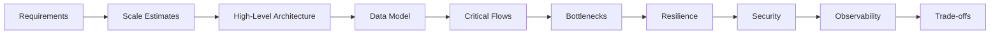

### 3.2 Typical Full-Stack Architecture

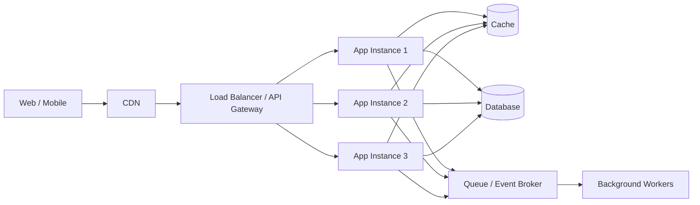

### 3.3 Scaling Decision

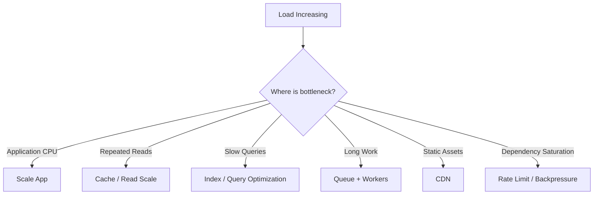

---

## 4. Mind Map

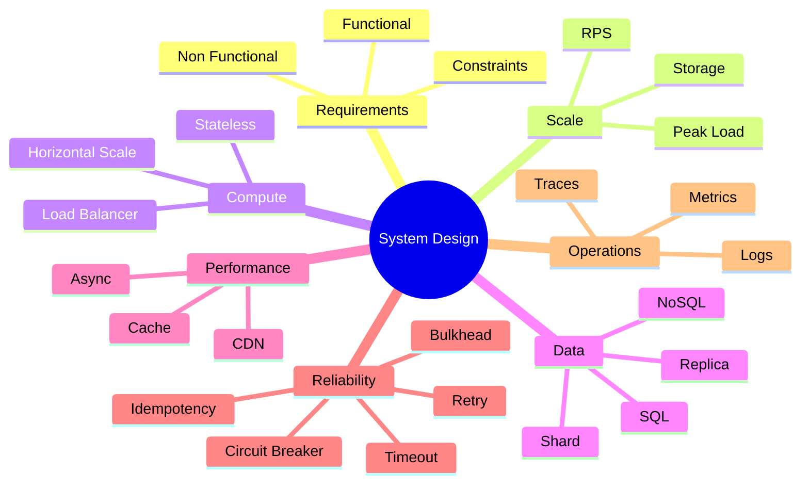

Seven anchors:

> **Requirements → Scale → Compute → Data → Performance → Reliability → Operations**

---

## 5. Requirements First

### Functional Requirements

What must the system do?

Example:

```text
Create order
Pay
Track order
Cancel eligible order
```

### Non-Functional Requirements

How well must it behave?

Examples:

```text
availability
latency
throughput
durability
security
consistency
scalability
```

### Interview-Ready Opening

> Before choosing the architecture, I would clarify the core user flows, expected traffic, data volume, latency target, availability expectation, and which operations require strong consistency. That gives us enough context to avoid overengineering.

---

## 6. Estimate Scale

Suppose:

```text
1,000,000 daily active users
10 requests/user/day
```

Then:

```text
10,000,000 requests/day
```

Average RPS:

```text
10,000,000 / 86,400 ≈ 116 RPS
```

But peak can be several times average.

So estimate:

```text
average
+ peak factor
+ read/write ratio
+ storage growth
```

Do not spend half the interview doing arithmetic.

The goal is order-of-magnitude reasoning.

---

## 7. Latency vs Throughput

### Latency

Time one operation takes.

Example:

```text
150 ms
```

### Throughput

Amount of work completed per unit time.

Example:

```text
5,000 requests/second
```

A system can have high throughput and poor latency.

Know the difference.

---

## 8. p95 and p99

Average latency can hide slow users.

Example:

```text
average = 100 ms
p95     = 300 ms
p99     = 1.5 sec
```

### Interview-Ready Answer

> I use percentile latency such as p95 and p99 in addition to averages because averages can hide tail latency. I also break latency down by endpoint and dependency so I can find the real bottleneck.

---

## 9. Availability vs Reliability

### Availability

Is the service usable when needed?

### Reliability

Does it consistently perform the intended operation correctly?

A reachable service can still be unreliable.

Do not use these terms as exact synonyms.

---

## 10. Vertical vs Horizontal Scaling

### Vertical

Increase one machine's CPU/memory.

Advantages:

- simple,
- low operational change.

Limitations:

- hardware ceiling,
- larger failure domain.

### Horizontal

Add more instances.

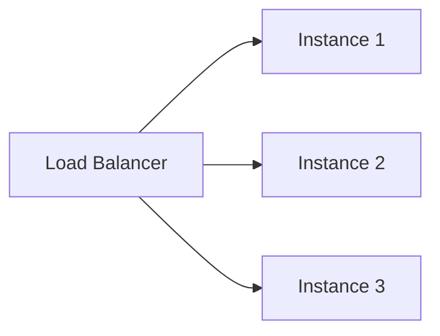

Benefits:

- scale-out,
- failover,
- rolling deployments.

But application state must be handled correctly.

---

## 11. Stateless Services

Bad:

```text
session stored only in Instance A memory
→ next request reaches Instance B
→ session missing
```

Better:

- token where suitable,
- shared session store,
- external state store.

### Interview-Ready Answer

> Stateless application instances are easier to scale horizontally because any healthy instance can process the request. State that must survive an instance change belongs in an appropriate external store or secure token rather than depending on one process's local memory.

---

## 12. Load Balancer

A load balancer distributes traffic across healthy instances.

Common responsibilities:

- routing,
- health-aware traffic distribution,
- TLS termination depending on architecture.

It does not fix:

- slow database queries,
- bad application logic,
- downstream saturation.

It distributes traffic.

---

## 13. CDN

A CDN is useful for content that can be served near users.

Examples:

- JavaScript bundles,
- CSS,
- images,
- public static files.

Benefits:

- lower latency,
- origin offload,
- global distribution.

---

## 14. Caching

Caching reduces repeated expensive work.

Possible layers:

```text
Browser
CDN
Gateway
Application
Distributed cache
Database
```

### Cache-Aside

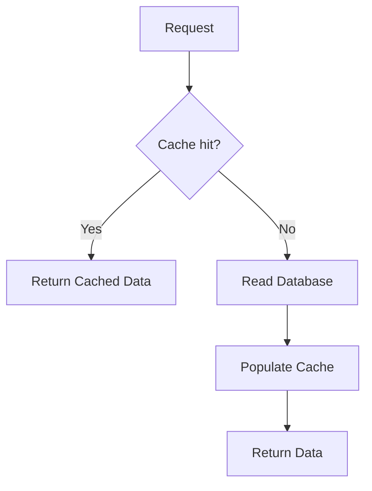

### Interview-Ready Answer

> In cache-aside, the application checks the cache first. On a miss it reads the source of truth, returns the result, and populates the cache. I also define TTL, invalidation, and failure behavior so caching does not introduce uncontrolled stale data.

---

## 15. Cache Invalidation

Ask:

- how stale can data be?
- when should cache expire?
- update cache or delete?
- event-driven invalidation?
- what happens when cache is unavailable?

### Golden Rule

> **Cache consistency must match business consistency requirements.**

---

## 16. Cache Stampede

A hot key expires.

Thousands of requests arrive.

All see a cache miss and query the database.

Possible mitigations:

- single-flight/request coalescing,
- staggered TTL,
- pre-warming,
- controlled lock,
- stale-while-refresh where appropriate.

---

## 17. Read Scaling

Before adding databases:

1. optimize SQL,
2. fix indexes,
3. remove unnecessary queries,
4. cache appropriate reads.

Then consider read replicas.

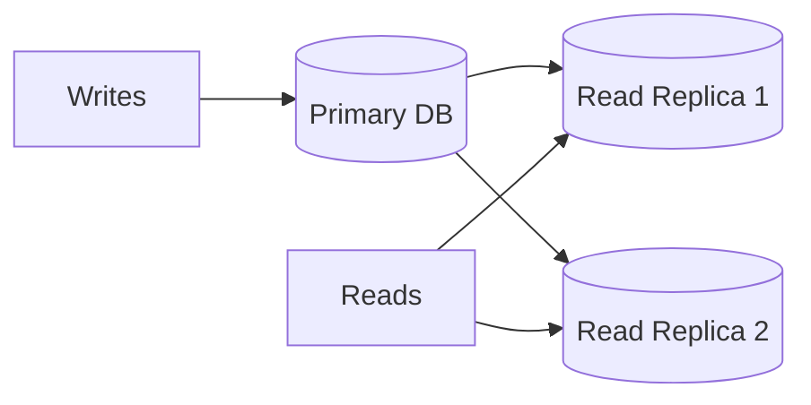

Trade-off:

> replicas may lag.

---

## 18. Partitioning and Sharding

Sharding splits data across database nodes.

Example:

```text
hash(customer_id)
→ shard 1
→ shard 2
→ shard 3
```

Benefits:

- spread storage,
- spread write load.

Costs:

- cross-shard queries,
- rebalancing,
- hot shards,
- harder transactions,
- operational complexity.

### Senior Rule

> **Sharding is not the first database optimization.**

---

## 19. Choosing a Shard Key

A good shard key should aim for:

- even distribution,
- stable routing,
- query locality,
- limited cross-shard work.

Bad key:

```text
country
```

if one country contains most users.

That can create a hot shard.

---

## 20. Synchronous vs Asynchronous

### Synchronous

Caller waits.

Good when:

- immediate response required,
- operation is quick,
- dependency is suitable.

### Asynchronous

Caller does not wait for final processing.

Example:

```text
POST /documents
→ 202 Accepted
→ queue processing
→ worker processes
→ status updated later
```

Use async when:

- work is long,
- buffering helps,
- fan-out is useful,
- immediate result is not required.

---

## 21. Queue

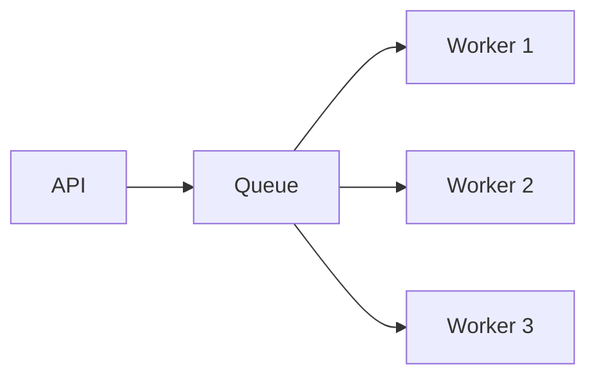

Benefits:

- absorb bursts,
- decouple producer/consumer timing,
- control worker concurrency,
- retries.

But:

> queue capacity is not infinite.

Monitor backlog.

---

## 22. Backpressure

If:

```text
incoming rate > processing capacity
```

the system needs control.

Options:

- bounded queues,
- rate limiting,
- rejection,
- load shedding,
- worker scaling,
- degrade non-critical work.

Do not let queues grow without bounds.

---

## 23. Timeout

Every remote dependency needs a finite timeout.

Without one:

```text
slow dependency
→ occupied resources
→ queue growth
→ caller timeout
→ cascading failure
```

---

## 24. Retry

Retry only when:

- failure may be transient,
- operation is safe,
- retry will not amplify overload.

Use:

- bounded attempts,
- exponential backoff,
- jitter where appropriate.

### Rule

> **Timeout first. Retry second.**

---

## 25. Circuit Breaker

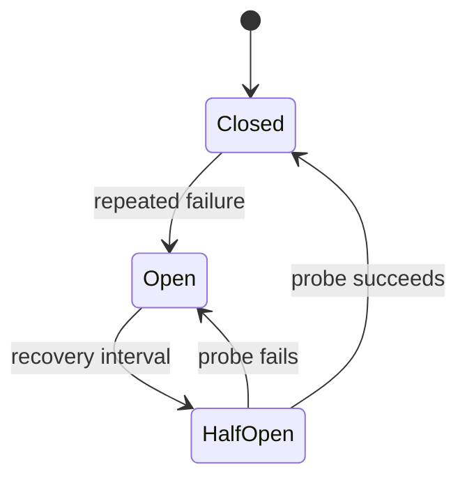

Purpose:

> protect callers from repeatedly hitting a failing dependency.

It does not fix the downstream service.

---

## 26. Bulkhead

A ship has separate compartments.

One compartment flooding should not sink everything.

Software equivalent:

- separate worker pools,
- separate queues,
- separate concurrency limits,
- isolated dependency resources.

### Interview-Ready Answer

> Bulkhead isolation prevents one failing or saturated dependency from consuming the entire application's resources. I use resource isolation when different workloads have different failure or capacity characteristics.

---

## 27. Idempotency

Distributed systems retry.

Example:

```text
payment request
→ server processes it
→ response lost
→ client retries
```

Without idempotency:

> duplicate charge.

With idempotency:

```text
same logical operation
→ same business effect
```

### Interview-Ready Answer

> Idempotency lets a repeated logical request produce the same intended business effect. It is especially important for operations such as payment or order creation because network timeouts and retries are normal.

---

## 28. Consistency

Strong consistency is not automatically better.

It can require more coordination and affect:

- latency,
- availability,
- scalability.

Eventual consistency is acceptable for some flows.

Example:

```text
Payment completed
→ notification updates a little later
```

The business decides which states require immediate consistency.

---

## 29. CAP — Practical Version

During a network partition, a distributed system must decide whether to prioritize:

- strong consistency,
- availability.

Do not explain CAP as:

> “choose any two out of three all the time.”

The partition case matters.

---

## 30. Single Point of Failure

For each critical component ask:

> “If this fails, what happens?”

Examples:

- application instance,
- primary database,
- message broker,
- gateway,
- cache.

Not every component needs maximum redundancy.

Criticality and availability target determine the solution.

---

## 31. Graceful Degradation

If a non-critical dependency fails:

> keep the primary journey alive when possible.

Example:

```text
Recommendation service down
→ product page still works
→ recommendation section unavailable
```

This prevents one optional feature from becoming a system-wide outage.

---

## 32. Observability

Production systems should answer:

- Is it healthy?
- Is it fast?
- Is it failing?
- Where is the bottleneck?
- Which request is affected?

Use:

```text
Logs
Metrics
Traces
```

---

## 33. Logs

Use structured logs for:

- errors,
- business events,
- request context,
- dependency failures.

Do not log:

- passwords,
- secrets,
- sensitive tokens.

---

## 34. Metrics

Useful examples:

- request count,
- error rate,
- p95/p99 latency,
- CPU/memory,
- queue depth,
- connection-pool usage,
- cache hit rate.

---

## 35. Distributed Tracing

One request may cross:

```text
Gateway
→ Order Service
→ Payment Service
→ Database
```

Tracing helps answer:

> where did time go?

Use correlation/trace context across boundaries.

---

## 36. Golden Signals

Useful production view:

```text
Latency
Traffic
Errors
Saturation
```

Do not monitor CPU alone.

Saturation may appear in:

- DB pool,
- thread pool,
- queue,
- downstream concurrency.

---

## 37. Security in System Design

Mention security where relevant:

- authentication,
- authorization,
- encryption in transit,
- secrets management,
- validation,
- least privilege,
- rate limiting,
- auditing.

### Rule

> Security belongs in architecture, not only at the end.

---

## 38. Deployment and Failure Domains

Consider:

- multiple instances,
- health checks,
- rolling deployment,
- rollback,
- backward-compatible API/database changes.

Do not introduce multi-region automatically.

Multi-region adds:

- cost,
- consistency complexity,
- operational complexity.

Use it only when requirements justify it.

---

## 39. Backward-Compatible Deployment

Old and new versions may run together.

Prefer:

- additive API changes,
- staged DB migration,
- old/new version compatibility during rollout.

Avoid destructive schema changes before old application versions are gone.

---

## 40. System Design Framework

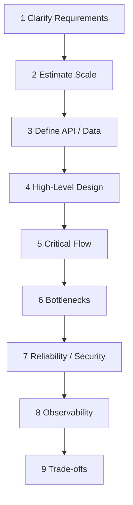

Use this sequence to stay structured.

---

## 41. Worked Design — URL Shortener

### Requirements

Functional:

- create short URL,
- redirect to original URL.

Non-functional:

- redirect should be fast,
- code must be unique,
- service should be available,
- reads likely dominate writes.

### API

Create:

```http
POST /urls
```

Response:

```json
{
  "code": "aB12x9"
}
```

Redirect:

```http
GET /aB12x9
```

### Architecture

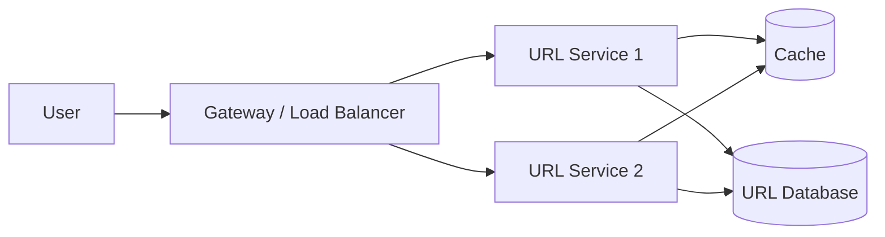

### Data

```text
short_code
original_url
created_at
expires_at optional
```

Access pattern:

```text
short_code → original_url
```

### Scaling

Start simple:

- stateless service,
- index by short code,
- cache hot redirects,
- multiple app instances.

Only later, if proven necessary:

- read scaling,
- partitioning.

---

## 42. Worked Design — Order Processing

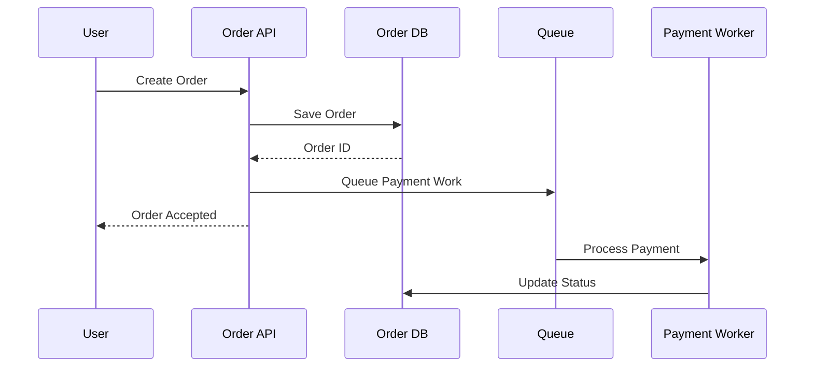

Ask:

- must payment complete before response?
- can order be PENDING?
- what if payment fails?
- what if request is retried?
- how is inventory handled?

Patterns such as idempotency, outbox, saga, or queueing are introduced only when requirements justify them.

---

## 43. Performance Investigation

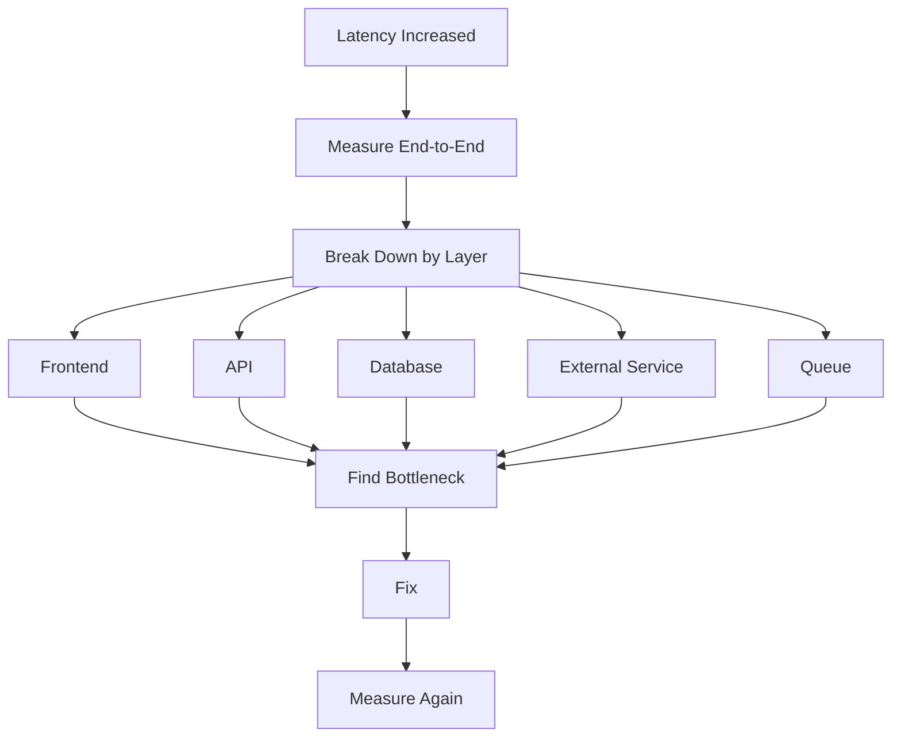

Do not optimize the wrong layer.

---

## 44. Common Bottlenecks

### Frontend

- large bundles,
- excessive API calls,
- unnecessary rendering,
- huge lists.

### Backend

- CPU-heavy code,
- blocking work,
- thread-pool saturation,
- lock contention.

### Database

- bad SQL,
- missing/ineffective index,
- N+1,
- pool exhaustion.

### Integration

- slow dependency,
- retry storm,
- large payload,
- network latency.

### Cache

- low hit ratio,
- stampede,
- hot key.

---

## 45. Project Mapping

This section follows **Evidence First**.

The résumé available to the interview panel supports experience in:

- solution architecture,
- distributed systems,
- scalable platforms,
- caching,
- asynchronous processing,
- resilient integration,
- performance tuning,
- Kubernetes,
- CI/CD,
- security,
- observability,
- production support.

It also includes quantitative claims around:

- availability,
- latency reduction,
- response-time improvement.

### Safe Positioning

> My architecture experience grew from hands-on engineering. I start with requirements and production constraints, then make decisions around APIs, data, caching, asynchronous work, security, observability, deployment, and failure handling. I prefer measurable improvements rather than introducing complexity without evidence.

### Evidence Boundary

Before using a metric such as:

```text
99.9% availability
30% latency reduction
<200ms response time
```

personally validate:

- which system,
- metric definition,
- before state,
- after state,
- measurement tool,
- measurement period,
- your direct contribution.

---

## 46. Candidate Validation

| Topic | Real Project / Evidence |
|---|---|
| Horizontal scaling | __________________ |
| Load balancing | __________________ |
| Cache / Redis | __________________ |
| Async processing | __________________ |
| Queue / service bus | __________________ |
| 99.9% availability | __________________ |
| 30% latency reduction | __________________ |
| <200ms response | __________________ |
| Kubernetes scaling | __________________ |
| Observability | __________________ |
| Production incident | __________________ |

---

## 47. Interview-Ready Answers

### Q1. How do you start a system-design problem?

> I first clarify the critical user flows and non-functional requirements such as traffic, latency, availability, consistency, security, and expected data size. Then I estimate scale, define the main API/data boundaries, draw a simple high-level design, and deep-dive into the parts that drive the key trade-offs.

### Q2. Horizontal vs vertical scaling?

> Vertical scaling gives one machine more resources and is simple, but has hardware and failure-domain limits. Horizontal scaling adds instances and improves scale-out and resilience, but the application must avoid relying on local instance state.

### Q3. Why stateless services?

> Stateless services allow any healthy instance to handle a request, which simplifies load balancing, failover, and rolling deployment. Persistent or shared state should be externalized appropriately.

### Q4. When would you add a cache?

> I add caching when repeated reads or expensive computation are a measured bottleneck and the business can define acceptable freshness. I define key design, TTL, invalidation, failure behavior, and how I will verify the hit-rate and latency improvement.

### Q5. What is cache-aside?

> The application checks the cache first. On a miss it reads the source of truth and populates the cache. It is simple and common, but TTL, invalidation, and stampede behavior still need deliberate design.

### Q6. How do you scale a database?

> I start with query/index optimization and reducing unnecessary work. Then I consider caching, read replicas, workload separation, partitioning, or sharding according to the actual bottleneck. I avoid sharding as a first move because it introduces major complexity.

### Q7. What is backpressure?

> Backpressure is how the system controls overload when incoming work exceeds processing capacity. Instead of allowing queues and resource usage to grow without limit, I use bounded queues, rate limits, worker limits, rejection, or load shedding.

### Q8. Retry vs circuit breaker?

> Retry is for selected transient failures and should be bounded and safe. A circuit breaker stops repeated calls to an already failing dependency for a period so caller resources are protected. They solve different problems.

### Q9. What is a bulkhead?

> Bulkhead isolation separates resources so one failing dependency or workload cannot consume the entire application's capacity. It can be implemented through separate pools, queues, or concurrency limits.

### Q10. How do you design for high availability?

> I remove critical single points of failure according to the availability target: multiple app instances, health-aware routing, suitable database failover/replication, durable messaging where required, safe deployment, monitoring, and graceful degradation.

### Q11. How do you reduce API latency?

> I break latency down by layer—application, database, cache, network, and downstream services—then optimize the measured bottleneck. I verify the result using comparable load and percentile latency rather than relying only on averages.

### Q12. How do you prevent cascading failure?

> I use finite timeouts, controlled retries only where safe, circuit breakers, resource isolation, bounded queues, rate limiting, and graceful degradation for non-critical dependencies.

### Q13. How do you monitor a distributed system?

> I combine structured logs, metrics, distributed traces, health signals, and alerts. I watch latency, traffic, errors, saturation, dependency behavior, queue depth, database pool usage, and correlation across service boundaries.

### Q14. When do you use asynchronous processing?

> I use asynchronous processing when the caller does not need the result immediately, the work is long-running, buffering helps, or multiple consumers need to react. I keep synchronous request-response where immediate results are required and messaging complexity is not justified.

### Q15. What is idempotency?

> Idempotency means repeated execution of the same logical request does not create duplicate business effects. It is critical for retried operations such as payment or order creation.

---

## 48. Likely Follow-Ups

### Scale

- How do you estimate RPS?
- How do you estimate storage?
- What is peak factor?
- When do you shard?
- What is a hot shard?

### Caching

- TTL?
- Cache invalidation?
- Cache stampede?
- Hot key?
- Distributed cache?
- What if cache is unavailable?

### Reliability

- Timeout budget?
- Backoff?
- Jitter?
- Circuit breaker?
- Bulkhead?
- Load shedding?
- Rate limiting?

### Data

- Read-replica lag?
- Partition key?
- Strong vs eventual consistency?
- Cross-shard transaction?

### Operations

- p95 vs p99?
- SLI/SLO/SLA?
- Health checks?
- Tracing?
- What would you dashboard?

---

## 49. Common Interview Traps

### Trap 1

> “Start by choosing technology.”

Wrong.

### Trap 2

> “Microservices automatically make systems scalable.”

Wrong.

### Trap 3

> “Add Redis to improve performance.”

Only after identifying the access pattern and consistency requirement.

### Trap 4

> “Add more servers when latency is high.”

Wrong if the database or dependency is the bottleneck.

### Trap 5

> “Retry every failure.”

Wrong.

### Trap 6

> “High availability means multiple app servers.”

Incomplete.

### Trap 7

> “Sharding is the default solution for a large database.”

Wrong.

### Trap 8

> “Queues absorb unlimited traffic.”

Wrong.

### Trap 9

> “Average response time is enough.”

Wrong.

### Trap 10

> “Observability means logs.”

Incomplete.

---

## 50. Interviewer Intent

| Question | What is really being tested |
|---|---|
| Requirements first | Structured thinking |
| Scale estimate | Capacity awareness |
| Horizontal scaling | Architecture fundamentals |
| Statelessness | Scale-out maturity |
| Cache | Performance trade-offs |
| Read replica | Data scaling |
| Sharding | Advanced judgment |
| Queue | Async design |
| Retry/circuit breaker | Failure engineering |
| Bulkhead | Resource isolation |
| Idempotency | Distributed correctness |
| p95/p99 | Production maturity |
| Observability | Operations |
| Graceful degradation | Reliability |
| Full design walkthrough | Senior structure |

---

## 51. Practical / Mini Mock Content

This section is for later practice only.

### Level 1 — Must Know

1. How do you start system design?
2. Functional vs non-functional requirements?
3. Latency vs throughput?
4. Horizontal vs vertical scaling?
5. Why stateless services?
6. What does a load balancer do?
7. When would you use CDN?
8. What is cache-aside?
9. Why is cache invalidation difficult?
10. What is a read replica?
11. When would you shard?
12. Sync vs async?
13. What is backpressure?
14. Timeout vs retry?
15. What is a circuit breaker?
16. What is a bulkhead?
17. What is idempotency?
18. Logs vs metrics vs traces?

### Level 2 — Follow-Up

19. How would you handle 10x traffic?
20. What if one app instance dies?
21. What if cache goes down?
22. What is cache stampede?
23. How do you choose TTL?
24. What is replica lag?
25. How do you choose shard key?
26. How do you prevent retry storms?
27. How do timeout budgets work?
28. How do you degrade gracefully?
29. p95 vs p99?
30. How do you detect saturation?

### Level 3 — Engineering Deep Dive

31. Design URL shortener.
32. Design order-processing system.
33. Design notification service.
34. Design document-processing pipeline.
35. Scale from 100 RPS to 10,000 RPS.
36. Prevent duplicate payment.
37. Recover from database failover.
38. Prove a 30% latency improvement.
39. Design multi-tenant architecture.
40. When is multi-region justified?

---

## 52. Quick Revision

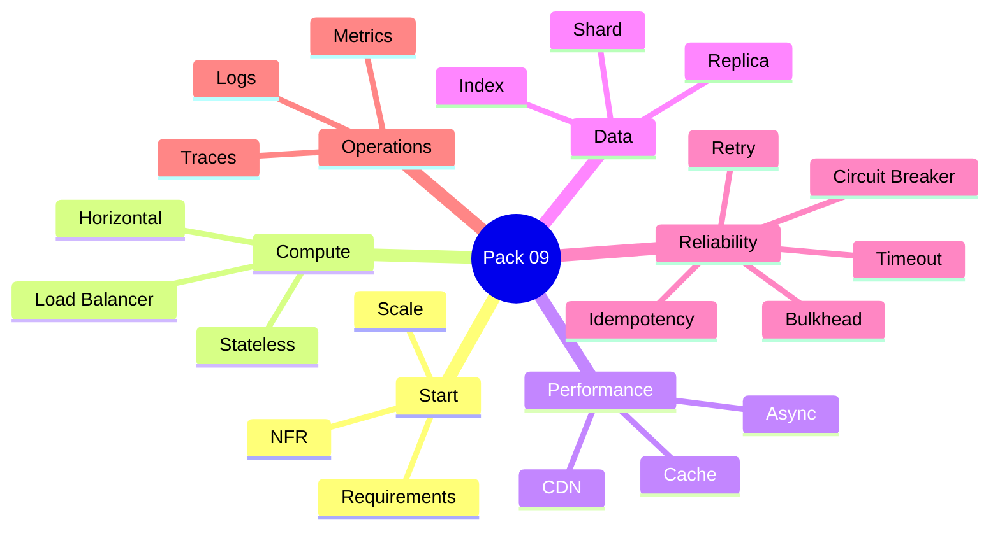

---

## 53. 90-Second Rapid Revision

```text
START
requirements first

FUNCTIONAL
what system does

NON-FUNCTIONAL
how well it behaves

SCALE
average + peak

LATENCY
time per operation

THROUGHPUT
work per time

HORIZONTAL SCALE
add instances

STATELESS
any instance can serve request

LOAD BALANCER
distribute traffic

CDN
serve cacheable content near users

CACHE-ASIDE
cache -> DB on miss -> populate

READ REPLICA
scale reads; possible lag

SHARD
split data; major complexity

ASYNC
queue work when caller need not wait

BACKPRESSURE
control overload

TIMEOUT
stop waiting

RETRY
safe transient failure only

CIRCUIT BREAKER
stop hammering failing dependency

BULKHEAD
isolate resource failure

IDEMPOTENCY
retry without duplicate effect

OBSERVABILITY
logs + metrics + traces

PERFORMANCE
measure -> change -> measure again
```

---

## 54. Candidate Answer Mapping

| Area | Safe Claim | Evidence / Mapping | Risk |
|---|---|---|---|
| Solution architecture | Supported | Resume | Low |
| Distributed systems | Supported | Resume | Low |
| Performance optimization | Supported | Resume | Low |
| Caching | Supported | Resume | Low |
| Async processing | Supported | Resume | Low |
| Kubernetes | Supported | Resume | Low |
| Observability | Supported | Resume | Low |
| 99.9% availability | Validate measurement | __________________ | Medium |
| 30% latency reduction | Validate baseline | __________________ | Medium |
| <200ms response | Validate metric | __________________ | Medium |
| Multi-region design | Validate real experience | __________________ | High if invented |
| Production sharding | Validate real experience | __________________ | Medium |

---

## 55. Final Visualization

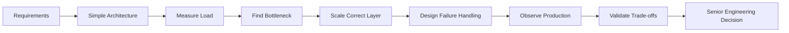

---

## Golden Rules

> **Start with requirements, not technology names.**

> **Scale the bottleneck, not the diagram.**

> **Do not add distributed complexity before the requirement justifies it.**

> **Timeouts, retries, idempotency, and backpressure belong in the design.**

> **Availability claims need a measurement definition.**

> **Performance improvements need a baseline and comparable after-state.**

For a senior engineer:

> **Requirement → Scale → Bottleneck → Trade-Off → Failure → Evidence**
