# VRIZE Interview Preparation — Pack 10
## Docker + Kubernetes + CI/CD + Cloud + Observability

**Target Role:** Senior Fullstack Developer — Round 1  
**Candidate:** Deepak Kumar  
**Priority:** P1 — High Value Senior Follow-Up  
**Timebox:** 75–90 minutes study + later practice  
**Approach:** KIS + DRY + SOLID | Mind-Friendly | Interview-First | Evidence-First | No Bluff  
**Depth:** Level 1 Must Know → Level 2 Follow-Up → Level 3 Engineering Deep Dive

---

## Readiness Gate

Before this pack is considered ready, you should be able to:

- Explain container vs virtual machine.
- Explain image, container, registry, Dockerfile, layer, volume, and network.
- Explain why multi-stage builds are useful.
- Explain Kubernetes Pod, Deployment, ReplicaSet, Service, Ingress, ConfigMap, Secret, and Namespace.
- Explain readiness vs liveness probes.
- Explain CPU/memory requests vs limits.
- Explain rolling deployment, rollback, blue-green, and canary at interview level.
- Explain CI vs Continuous Delivery vs Continuous Deployment.
- Explain a practical build-to-production pipeline.
- Explain configuration and secret separation.
- Explain logs, metrics, traces, health checks, alerts, and correlation IDs.
- Explain common production symptoms such as CrashLoopBackOff, OOMKilled, failing readiness probes, and high latency.
- Explain why scaling Pods does not solve every bottleneck.
- Connect Docker/Kubernetes/CI/CD/cloud answers to real evidence only where defensible.

---

## 1. Objective

This pack answers:

> **“Can you take an application from source code to a reliable production deployment?”**

A senior full-stack engineer is expected to understand more than:

```text
write code
→ push code
```

A realistic interviewer may move through:

```text
Docker
→ Kubernetes
→ CI/CD
→ Cloud
→ Health
→ Observability
→ Failure Recovery
```

The mental model is:

```text
Code
→ Build
→ Test
→ Package
→ Deploy
→ Run
→ Observe
→ Recover
```

---

## 2. Real-Life Analogy

Think of shipping a product globally.

- **Docker Image** = standardized sealed package.
- **Container** = one running instance of that package.
- **Registry** = warehouse storing approved packages.
- **Kubernetes** = logistics control center deciding how many packages should run and where.
- **Service** = stable delivery address.
- **Ingress/Gateway** = front gate routing visitors.
- **CI/CD** = automated factory line that builds, inspects, packages, and releases.
- **Observability** = sensors and dashboards showing whether the system is healthy.

The analogy is only the memory hook.

---

## 3. Visualization

### 3.1 Source to Production

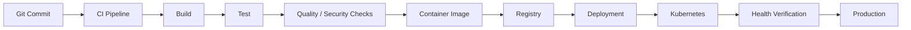

### 3.2 Docker Model

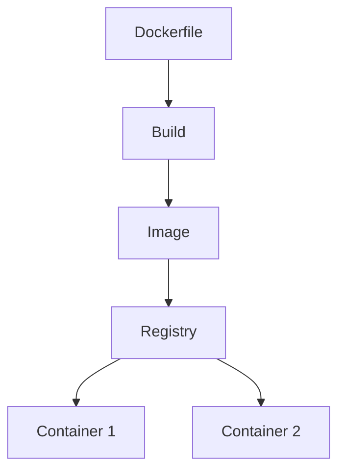

### 3.3 Kubernetes Request Flow

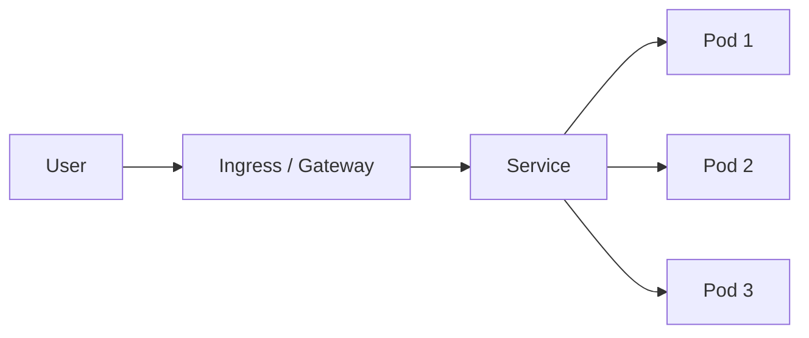

### 3.4 Deployment Ownership

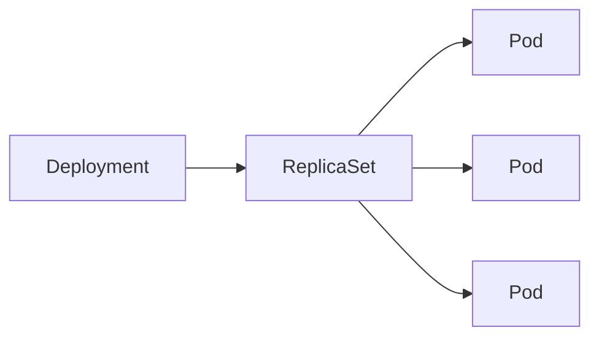

### 3.5 Observability

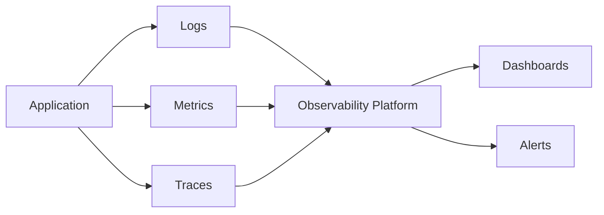

---

## 4. Mind Map

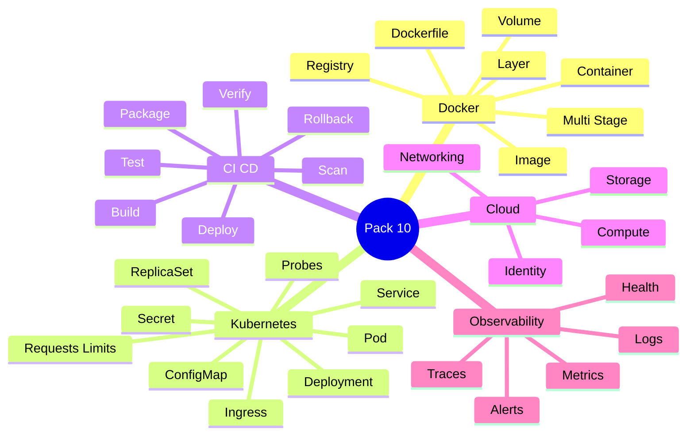

Five anchors:

> **Package → Orchestrate → Deliver → Configure → Observe**

---

## 5. Container vs Virtual Machine

### Virtual Machine

A VM typically includes:

- virtualized hardware,
- guest operating system,
- application,
- dependencies.

### Container

A container packages:

- application,
- user-space dependencies,

while sharing the host kernel.

### Interview-Ready Answer

> A virtual machine virtualizes hardware and normally includes a guest operating system, while a container isolates the application and its user-space dependencies while sharing the host kernel. Containers are generally lighter and faster to start, which makes them useful for repeatable packaging and horizontal deployment.

---

## 6. Image vs Container

**Image**

Immutable packaged artifact/template.

**Container**

Running instance of an image.

Mental model:

```text
Image = template
Container = running instance
```

---

## 7. Dockerfile

Example:

```dockerfile
FROM eclipse-temurin:21-jre

WORKDIR /app

COPY app.jar app.jar

ENTRYPOINT ["java", "-jar", "app.jar"]
```

A Dockerfile describes how the image is built.

---

## 8. Image Layers

Images are built in layers.

Conceptually:

```text
base image
→ dependencies
→ application files
→ metadata
```

Layer caching can speed builds.

Poor Dockerfile ordering can invalidate reusable layers unnecessarily.

---

## 9. Multi-Stage Build

Example:

```dockerfile
FROM maven:3-eclipse-temurin-21 AS build

WORKDIR /src
COPY . .
RUN mvn clean package -DskipTests

FROM eclipse-temurin:21-jre

WORKDIR /app
COPY --from=build /src/target/app.jar app.jar

ENTRYPOINT ["java", "-jar", "app.jar"]
```

### Why It Matters

Build tools stay in the build stage.

Runtime image contains only what is needed to run.

Benefits:

- smaller image,
- fewer unnecessary packages,
- lower attack surface,
- faster transfer.

### Interview-Ready Answer

> I use multi-stage builds to separate build-time dependencies from runtime dependencies. The final image contains only what the application needs to run, which usually reduces image size and attack surface.

---

## 10. `.dockerignore`

Exclude files that should not enter the build context:

```text
.git
target/
node_modules/
local logs
IDE files
secrets
```

Do not send the entire working directory blindly.

---

## 11. Configuration and Secrets

Do not bake environment-specific secrets into images.

Bad:

```dockerfile
ENV DB_PASSWORD=production-secret
```

Better:

> inject configuration and secrets at deployment/runtime.

Ideal principle:

```text
same image
→ different environment configuration
```

---

## 12. Container Logging

Containers are replaceable.

Avoid depending on application log files that exist only inside one disposable container.

Prefer platform-compatible collection from standard output/error where appropriate.

---

## 13. Volume

A container's writable filesystem is generally treated as ephemeral.

Use persistent storage when data must survive replacement.

Examples:

- database files,
- selected durable files.

For stateless application services:

> keep durable state outside the application container whenever practical.

---

## 14. Container Networking

Inside a container:

```text
localhost
```

means that container itself.

Do not use localhost to reach another container unless the architecture specifically shares a network namespace.

Use service/container DNS names according to the runtime/orchestrator.

---

## 15. Docker Security

Practical rules:

- use trusted/minimal base images,
- patch base images,
- avoid root where possible,
- never bake secrets into image,
- scan dependencies/images,
- remove unnecessary tools/packages,
- pin versions deliberately.

### Senior Insight

A container is not a complete security strategy.

Security includes:

- image,
- host,
- runtime,
- network,
- secrets,
- identity,
- application.

---

## 16. Why Kubernetes?

When many container instances must run reliably, orchestration helps manage:

- scheduling,
- desired replicas,
- restart/recovery,
- service discovery,
- rolling updates,
- configuration,
- scaling.

### Interview-Ready Answer

> Kubernetes is a container orchestration platform. It manages desired state around workloads, scheduling, scaling, service discovery, configuration, rolling updates, and recovery rather than requiring teams to manage individual container instances manually.

---

## 17. Pod

A Pod is Kubernetes' smallest deployable unit.

A Pod can contain one or more tightly coupled containers sharing:

- network,
- selected storage.

Typical model:

> one main application container per Pod, with sidecars only when justified.

---

## 18. Deployment

A Deployment manages application rollout and desired replica state.

If:

```text
replicas = 3
```

the platform works to maintain three matching Pod replicas.

---

## 19. ReplicaSet

A ReplicaSet maintains a desired number of matching Pods.

Usually, you manage it through a Deployment.

Memory map:

```text
Deployment
→ ReplicaSet
→ Pods
```

---

## 20. Service

Pods are ephemeral and their IP addresses can change.

A Service provides a stable network abstraction.

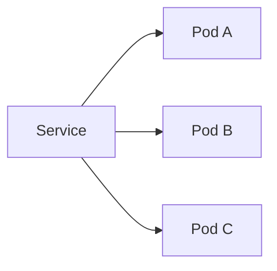

### Interview-Ready Answer

> A Service gives clients a stable way to reach a dynamic set of Pods. The Pods can be replaced and receive new IPs while the Service remains the stable network abstraction.

---

## 21. Ingress

Ingress commonly provides HTTP/HTTPS routing into cluster services through an ingress controller or equivalent gateway.

Example:

```text
/api/orders
→ order-service

/api/users
→ user-service
```

Do not confuse Ingress with Service.

---

## 22. ConfigMap

Use for non-sensitive configuration.

Examples:

- feature settings,
- endpoint names,
- non-secret environment properties.

---

## 23. Secret

Use for sensitive configuration.

Examples:

- credentials,
- tokens,
- certificates.

### Senior Precision

A Kubernetes Secret is not automatically “fully secure” merely because of its name.

Security also depends on:

- RBAC,
- encryption configuration,
- access control,
- secret-management architecture.

---

## 24. Namespace

Namespaces provide logical separation.

Typical use:

- teams,
- environments,
- workload grouping.

A namespace alone is not a complete security boundary.

---

## 25. Readiness Probe

Question:

> **Can this Pod receive traffic now?**

If readiness fails:

> remove it from normal service traffic.

Example uses:

- application is still starting,
- initialization incomplete,
- temporarily unable to serve.

---

## 26. Liveness Probe

Question:

> **Is the application unhealthy enough that restarting it may help?**

If liveness fails repeatedly:

> Kubernetes may restart the container.

---

## 27. Startup Probe

Useful for applications that legitimately take a long time to start.

It prevents startup delay from being incorrectly treated as liveness failure.

---

## 28. Readiness vs Liveness

### Interview-Ready Answer

> Readiness controls whether a Pod should receive traffic, while liveness determines whether the container should be restarted. I keep them separate because using a dependency problem as a liveness failure can create an unnecessary restart loop.

---

## 29. Requests vs Limits

### Request

Used by the scheduler to understand expected resource need.

### Limit

Caps resource use according to resource type/runtime behavior.

Poor settings can cause:

- bad scheduling,
- CPU throttling,
- OOM termination,
- wasted capacity.

### Interview-Ready Answer

> Requests represent expected resources for scheduling, while limits cap usage. I derive them from measured workload behavior instead of arbitrary numbers because under-sizing can destabilize the application and over-sizing wastes cluster capacity.

---

## 30. OOMKilled

A container may be terminated after exceeding its memory boundary.

Do not immediately answer:

> “Increase memory.”

Investigate:

- heap/native memory,
- memory leak,
- payload size,
- cache growth,
- traffic change,
- container limit,
- JVM settings.

---

## 31. CrashLoopBackOff

The container repeatedly starts and fails, so restart attempts are delayed.

Possible causes:

- application crash,
- missing config,
- missing secret,
- invalid command,
- failing startup dependency,
- aggressive liveness probe.

Troubleshooting sequence:

```text
Pod status/events
→ container logs
→ exit code
→ probes
→ configuration
→ dependencies
```

---

## 32. Rolling Update

A Deployment can gradually replace old Pods with new Pods.

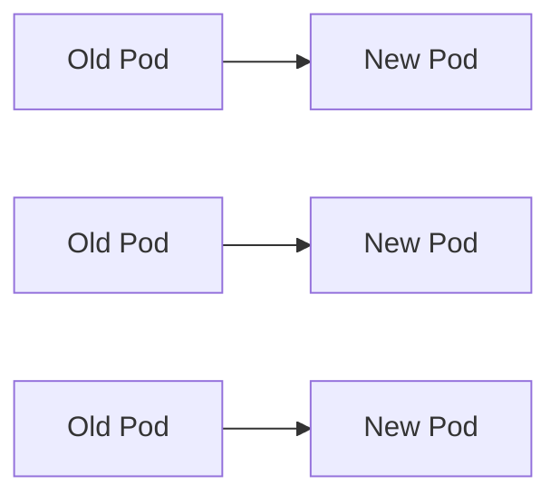

Safe rollout also requires:

- readiness,
- backward-compatible API,
- database compatibility,
- health verification.

---

## 33. Rollback

If the new deployment causes user impact, restore a known-good version where safe.

A rollback strategy should exist before deployment.

Database migrations complicate rollback, especially if destructive.

---

## 34. Horizontal Pod Autoscaling — Concept

Autoscaling can adjust replicas based on metrics.

Possible signals:

- CPU,
- memory,
- custom/external metric.

### Senior Insight

CPU is not always the correct signal.

For some workloads:

- queue depth,
- request concurrency,
- custom application metric

may match demand better.

---

## 35. More Pods Are Not Always Better

If the database is saturated:

```text
more Pods
→ more DB connections
→ more pressure
→ worse performance
```

Golden rule:

> **Scale the bottleneck, not the Pod count.**

---

## 36. CI — Continuous Integration

CI means changes are integrated frequently and validated automatically.

Typical checks:

- build,
- unit tests,
- static analysis,
- integration tests,
- security checks.

---

## 37. Continuous Delivery vs Continuous Deployment

### Continuous Delivery

Application remains in a deployable/releasable state and production release can involve a controlled/manual decision.

### Continuous Deployment

Successful changes automatically reach production.

### Interview-Ready Answer

> Continuous Integration validates changes frequently. Continuous Delivery keeps validated software ready for production, while Continuous Deployment automatically releases validated changes to production without a manual release decision.

---

## 38. Production Pipeline

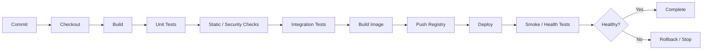

---

## 39. Pipeline Quality Gates

Possible gates:

- compilation,
- unit tests,
- integration tests,
- code quality,
- dependency vulnerability scan,
- image scan,
- policy checks.

Balance:

> confidence vs feedback time.

A very slow pipeline can reduce developer throughput.

---

## 40. Immutable Artifact Promotion

Build once.

Promote the same artifact/image.

Good:

```text
same image digest
→ test
→ staging
→ production
```

Avoid rebuilding separately for each environment.

Why?

> different builds can produce different bits.

---

## 41. Deployment Strategies

### Rolling

Gradually replace old instances.

Good default for many services.

### Blue-Green

Two environments:

```text
Blue = current
Green = new
```

Switch traffic after validation.

Benefit:

- quick traffic rollback.

Cost:

- duplicate capacity.

### Canary

Send limited traffic first:

```text
5%
→ 20%
→ 50%
→ 100%
```

Expand only when health signals remain good.

---

## 42. Database Migration During Deployment

Safe deployment must consider old and new app versions running together.

Safer sequence:

```text
1. Add compatible DB change
2. Deploy code supporting both states
3. Backfill if required
4. Switch behavior
5. Remove old schema later
```

Avoid destructive DB change before old application versions are gone.

---

## 43. Secrets Management

Never put secrets in:

- source code,
- Dockerfile,
- public repo,
- frontend bundle,
- logs.

Use appropriate platform/cloud secret management.

Where available, prefer identity-based access and short-lived credentials over long-lived distributed secrets.

---

## 44. Cloud Fundamentals

Do not answer cloud questions only by naming products.

Think in categories:

```text
Compute
Networking
Storage
Database
Messaging
Identity
Security
Observability
```

Then map to Azure/AWS services only when needed.

---

## 45. IaaS vs PaaS vs SaaS

### IaaS

You manage more infrastructure.

Example concept:

```text
Virtual machine
```

### PaaS

Provider manages more of the runtime/platform.

Example concepts:

```text
managed app hosting
managed database
```

### SaaS

Ready application consumed as a service.

### Senior Trade-Off

More managed service often means:

- less infrastructure management,
- faster delivery,

but may add:

- platform constraints,
- provider coupling,
- cost considerations.

---

## 46. Why Not Kubernetes for Everything?

Kubernetes provides control, but also operational complexity.

A managed application platform or serverless solution may be better when:

- workload is simple,
- team is small,
- orchestration benefits are limited.

### Interview-Ready Answer

> I use Kubernetes when workload scale, deployment control, portability, orchestration, or platform requirements justify the operational complexity. For simpler workloads, a managed application platform may provide better value.

---

## 47. Observability

Observability helps infer internal behavior from system signals.

Core signals:

```text
Logs
Metrics
Traces
```

---

## 48. Logs

Structured logs are easier to search and correlate.

Concept:

```json
{
  "level": "ERROR",
  "service": "order-service",
  "traceId": "abc123",
  "message": "Payment failed"
}
```

Avoid sensitive data.

---

## 49. Metrics

Examples:

```text
request_count
error_rate
p95_latency
CPU
memory
queue_depth
DB_pool_usage
cache_hit_ratio
```

Metrics answer:

> how much, how often, how fast?

---

## 50. Traces

Distributed traces show one request across components.

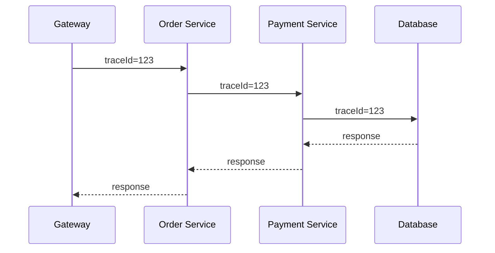

Useful for:

- dependency latency,
- cross-service failure,
- critical path.

---

## 51. Health Checks

Health is not only:

```text
process exists
```

Think:

- startup,
- readiness,
- liveness,
- critical dependency state.

Do not make liveness fail every time an optional downstream dependency is unavailable.

That can create restart storms.

---

## 52. Alerting

Good alerts should be:

- actionable,
- related to user/system impact,
- low-noise.

Better signals include:

- sustained error rate,
- latency target violation,
- queue lag,
- resource saturation,
- availability.

---

## 53. SLI, SLO, SLA

### SLI

Measured indicator.

Example:

```text
successful request percentage
```

### SLO

Target/objective.

Example:

```text
99.9% successful requests in defined window
```

### SLA

Formal agreement/commitment, often with business consequences.

### Important

Do not describe any résumé metric as an SLA or SLO unless that was actually its meaning.

---

## 54. Production Scenario — New Deployment Failing

Reasoning:

```text
deployment status
→ readiness/liveness
→ Pod events
→ container logs
→ config/secrets
→ image/version
→ dependency state
→ rollback if needed
```

Protect production before spending too long debugging live impact.

---

## 55. Production Scenario — Pod Running but No Traffic

Check:

- readiness,
- Service selector,
- labels,
- ports,
- Ingress/Gateway route,
- network policy,
- application listener.

Reasoning beats random restarts.

---

## 56. Production Scenario — Latency Increased After Deployment

Check:

- application change,
- DB query change,
- downstream calls,
- CPU throttling,
- memory/GC,
- cache behavior,
- connection pool,
- retries,
- replica count.

Compare:

```text
before
vs
after
```

---

## 57. Production Scenario — OOMKilled

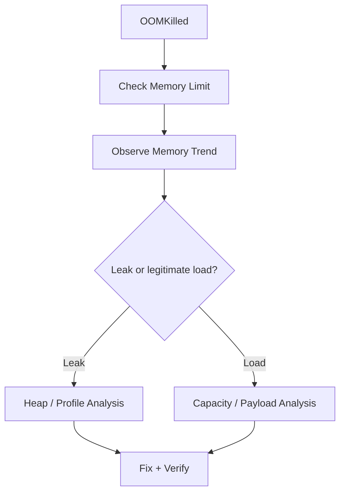

Do not blindly increase memory.

---

## 58. Project Mapping

This section follows **Evidence First**.

The résumé available to the interview panel supports:

- Docker,
- Kubernetes,
- CI/CD,
- Azure,
- AWS,
- Prometheus,
- Grafana,
- production support,
- security remediation,
- deployment automation,
- observability,
- release-cycle improvement claims.

### Safe Positioning

> My recent architecture and consulting work includes Docker/Kubernetes-based deployments, CI/CD, cloud infrastructure, security, observability, and production troubleshooting. I treat delivery and production behavior as part of engineering rather than something separate from application development.

### Evidence Boundary

Before quoting metrics such as:

```text
60% faster release cycles
35% fewer incidents
99.9% availability
```

personally validate:

- baseline,
- time period,
- measurement source,
- what changed,
- your direct contribution.

---

## 59. Candidate Validation

| Topic | Real Project / Evidence |
|---|---|
| Dockerfile | __________________ |
| Multi-stage build | __________________ |
| Kubernetes Deployment | __________________ |
| Service | __________________ |
| Readiness/Liveness | __________________ |
| ConfigMap/Secret | __________________ |
| CI/CD pipeline | __________________ |
| Rollback | __________________ |
| Prometheus | __________________ |
| Grafana | __________________ |
| Azure deployment | __________________ |
| Kubernetes scaling | __________________ |

---

## 60. Interview-Ready Answers

### Q1. Container vs VM?

> A VM virtualizes hardware and includes a guest operating system, while a container isolates the application and its user-space dependencies while sharing the host kernel. Containers are generally lighter and faster to start.

### Q2. Image vs container?

> An image is an immutable packaged artifact used as a template; a container is a running instance created from that image.

### Q3. Why multi-stage build?

> It separates build-time dependencies from runtime dependencies, producing a smaller and cleaner runtime image with fewer unnecessary packages and lower attack surface.

### Q4. What is a Pod?

> A Pod is Kubernetes' smallest deployable unit. It contains one or more tightly coupled containers sharing networking and potentially storage.

### Q5. Deployment vs Service?

> A Deployment manages desired Pod replicas and rollout, while a Service provides stable networking and routes to matching Pods.

### Q6. Readiness vs liveness?

> Readiness determines whether the Pod should receive traffic. Liveness determines whether the container should be restarted because it is unhealthy.

### Q7. Requests vs limits?

> Requests guide scheduler placement based on expected resources, while limits cap usage. I base them on measured workload behavior rather than arbitrary values.

### Q8. What is CrashLoopBackOff?

> It means the container repeatedly starts and fails, so Kubernetes delays subsequent restart attempts. I inspect events, logs, exit code, probes, configuration, and dependencies to find the root cause.

### Q9. CI vs CD?

> CI validates integrated changes frequently. Continuous Delivery keeps validated software releasable through an automated pipeline, while Continuous Deployment automatically releases successful changes to production.

### Q10. What should a production pipeline contain?

> Reproducible build, tests, appropriate security/quality checks, immutable artifact creation, deployment, health verification, and a rollback path.

### Q11. Blue-green vs canary?

> Blue-green maintains two environments and switches traffic after validation. Canary sends a small percentage of real traffic to the new version and expands gradually based on health.

### Q12. Where should secrets live?

> Not in source code, images, frontend bundles, or logs. I use platform/cloud secret management and identity-based access where available.

### Q13. Logs vs metrics vs traces?

> Logs provide detailed event context, metrics show aggregated system behavior, and traces show one request's path across components.

### Q14. What is 99.9% availability?

> It means the service met a defined availability indicator 99.9% of the measured time. I would clarify the measurement window, what counted as available, and whether that number was observed availability, an SLO, or an SLA.

### Q15. Why not Kubernetes for everything?

> Kubernetes provides powerful orchestration but also operational complexity. I use it when the workload and team benefit from that control; simpler managed platforms can be a better choice for simpler workloads.

---

## 61. Likely Follow-Ups

### Docker

- `CMD` vs `ENTRYPOINT`?
- Layer caching?
- Volume vs bind mount?
- Why not root?
- Image scan?
- Image digest?

### Kubernetes

- Deployment vs StatefulSet?
- Service types?
- Ingress vs Service?
- HPA?
- Pod Pending?
- Node failure?
- Rolling strategy?
- OOMKilled?
- Affinity/anti-affinity?
- Taints/tolerations?

### CI/CD

- Artifact promotion?
- Feature flags?
- GitHub Actions vs Azure DevOps/Jenkins?
- DB migration rollback?
- Canary metrics?
- Automated rollback?

### Observability

- Prometheus?
- Grafana?
- SLI/SLO/SLA?
- p95/p99?
- Correlation ID?
- Alert fatigue?
- What should a dashboard show?

Do not study every Level 3 topic equally unless the interviewer goes deeper.

---

## 62. Common Interview Traps

### Trap 1

> “Container is a lightweight VM.”

Incomplete.

### Trap 2

> “Service creates Pods.”

Wrong.

### Trap 3

> “Liveness means ready for traffic.”

Wrong.

### Trap 4

> “OOMKilled means increase memory.”

Not necessarily.

### Trap 5

> “More Pods always improve performance.”

Wrong.

### Trap 6

> “Kubernetes Secret is automatically fully secure.”

Wrong.

### Trap 7

> “CI/CD means Jenkins.”

Wrong.

### Trap 8

> “Continuous Delivery and Continuous Deployment are the same.”

Wrong.

### Trap 9

> “Logs are enough for production.”

Wrong.

### Trap 10

> “99.9% availability explains itself.”

Wrong.

---

## 63. Interviewer Intent

| Question | What is really being tested |
|---|---|
| Container vs VM | Deployment fundamentals |
| Multi-stage build | Production packaging |
| Pod | Kubernetes fundamentals |
| Deployment vs Service | Orchestration model |
| Readiness/liveness | Runtime correctness |
| Requests/limits | Resource awareness |
| OOMKilled | Troubleshooting |
| CI/CD | Delivery maturity |
| Canary/blue-green | Release risk |
| Secrets | Security |
| Logs/metrics/traces | Operations |
| SLO/availability | Measurement maturity |
| Kubernetes trade-off | Architectural judgment |

---

## 64. Practical / Mini Mock Content

This section is for later practice only.

### Level 1 — Must Know

1. Container vs VM?
2. Image vs container?
3. What is Dockerfile?
4. Why multi-stage build?
5. What is Kubernetes?
6. What is a Pod?
7. Deployment vs ReplicaSet?
8. Deployment vs Service?
9. Readiness vs liveness?
10. ConfigMap vs Secret?
11. Requests vs limits?
12. What is CI?
13. Continuous Delivery vs Deployment?
14. What should a pipeline contain?
15. Rolling vs blue-green vs canary?
16. Logs vs metrics vs traces?
17. What is an SLO?

### Level 2 — Follow-Up

18. Why can a Pod stay Pending?
19. What causes CrashLoopBackOff?
20. What causes OOMKilled?
21. How would you size Pod resources?
22. Why can more Pods hurt a database?
23. How would you manage secrets?
24. How would you roll back safely?
25. How do DB migrations affect rolling deployment?
26. Why build an artifact once?
27. How would you verify a deployment?
28. How would you monitor a service?
29. What would you alert on?
30. How would you troubleshoot latency after deployment?

### Level 3 — Engineering Deep Dive

31. Design CI/CD for Spring Boot + React.
32. Design safe Kubernetes rollout.
33. Diagnose failing readiness.
34. Diagnose memory growth in a Pod.
35. Choose HPA signal.
36. Keep DB migrations backward compatible.
37. Secure service-to-service access.
38. Prove release-time improvement.
39. When would you avoid Kubernetes?
40. How would you design rollback with a DB migration?

---

## 65. Quick Revision

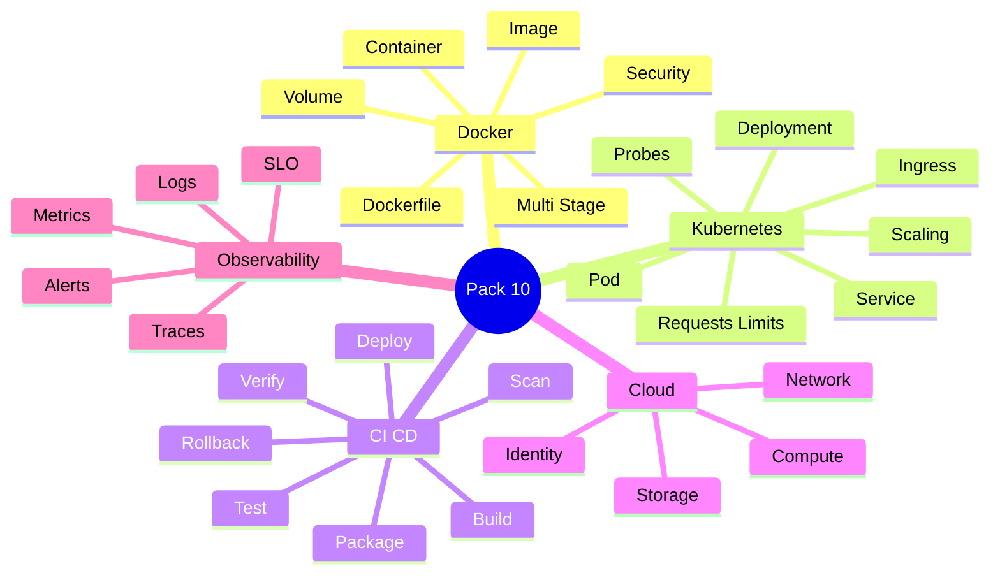

---

## 66. 90-Second Rapid Revision

```text
IMAGE
immutable package

CONTAINER
running image

MULTI-STAGE
build tools out of runtime image

POD
smallest Kubernetes deployable unit

DEPLOYMENT
replicas + rollout

SERVICE
stable networking

INGRESS
HTTP routing

READINESS
receive traffic?

LIVENESS
restart needed?

REQUEST
scheduler expectation

LIMIT
resource cap

OOMKILLED
memory boundary exceeded

CI
automated integration validation

CONTINUOUS DELIVERY
ready to release

CONTINUOUS DEPLOYMENT
auto production release

PIPELINE
build -> test -> scan -> image -> deploy -> verify

ROLLING
gradual replacement

BLUE-GREEN
switch environments

CANARY
small traffic first

SECRETS
not in source/image/log

OBSERVABILITY
logs + metrics + traces

SLO
measured target

PRODUCTION
deploy -> verify -> observe -> recover
```

---

## 67. Candidate Answer Mapping

| Area | Safe Claim | Evidence / Mapping | Risk |
|---|---|---|---|
| Docker | Supported | Resume | Low |
| Kubernetes | Supported | Resume | Low |
| CI/CD | Supported | Resume | Low |
| Azure | Supported | Resume | Low |
| AWS | Supported | Resume | Low |
| Prometheus | Supported | Resume | Low |
| Grafana | Supported | Resume | Low |
| Release-cycle improvement | Validate metric | __________________ | Medium |
| Kubernetes scaling incident | Validate real use | __________________ | Medium |
| Canary deployment | Validate real use | __________________ | Medium |
| Blue-green deployment | Validate real use | __________________ | Medium |
| Specific SLO/SLA ownership | Validate | __________________ | High if invented |

---

## 68. Final Visualization

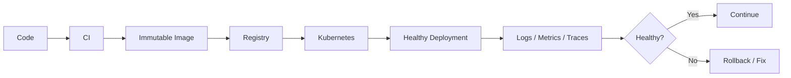

---

## Golden Rules

> **Build once; promote the same artifact.**

> **Containers should be replaceable; durable state belongs outside when practical.**

> **Readiness decides traffic. Liveness decides restart.**

> **Do not scale Pods when the real bottleneck is the database or downstream system.**

> **A CI/CD pipeline must provide both confidence and fast enough feedback.**

> **Observability is part of production design, not decoration.**

> **Do not quote reliability or delivery metrics unless you can explain how they were measured.**

For a senior engineer:

> **Build → Package → Deploy → Verify → Observe → Recover → Evidence**
