# VRIZE Interview Preparation — Pack 11
## Kotlin + Coroutines + KMP + Android

**Target Role:** Senior Fullstack Developer — Round 1  
**Candidate:** Deepak Kumar  
**Priority:** P0 — Role-Specific Must Know  
**Timebox:** 80–90 minutes study + later practice  
**Approach:** KIS + DRY + SOLID | Mind-Friendly | Interview-First | Evidence-First | No Bluff  
**Depth:** Level 1 Must Know → Level 2 Follow-Up → Level 3 Engineering Deep Dive

---

## Readiness Gate

Before this pack is considered ready, you should be able to:

- Explain the main differences between Java and Kotlin.
- Explain nullable vs non-null types and safe null handling.
- Explain `val`, `var`, `lateinit`, and `lazy`.
- Explain data classes, sealed classes/interfaces, object declarations, and companion objects.
- Explain extension functions and higher-order functions.
- Explain `let`, `run`, `apply`, `also`, and `with` without using them randomly.
- Explain Kotlin collections and Sequence trade-offs.
- Explain what a coroutine is and why it is not simply a thread.
- Explain `suspend`, `launch`, `async`, `await`, `withContext`, `coroutineScope`, and structured concurrency.
- Explain `Dispatchers.Main`, `IO`, and `Default`.
- Explain cancellation, exception propagation, supervision, and shared mutable state.
- Explain Flow, StateFlow, and SharedFlow at interview level.
- Explain Android app architecture using UI, data, and optional domain layers.
- Explain ViewModel, lifecycle-aware collection, repository, and data boundaries conceptually.
- Explain Kotlin Multiplatform shared vs platform-specific code.
- Explain `expect`/`actual` conceptually and when KMP is a good or poor fit.
- Explain KMP vs Compose Multiplatform without mixing them up.
- Connect Kotlin/Android answers to real earlier mobile experience without inventing a KMP production implementation.

---

## 1. Objective

The VRIZE opportunity shown with the interview invite includes Kotlin, Java, React, KMP, mobile development, Node.js, Python, PHP, and Laravel.

That makes Kotlin and KMP role-specific, even though your most recent enterprise stack is stronger around Node.js, TypeScript, React, MongoDB, and Azure.

This pack answers:

> **“Can you still reason confidently about Kotlin, mobile engineering, coroutines, and cross-platform architecture?”**

The mental flow is:

```text
Kotlin Language
→ Null Safety
→ Functional Constructs
→ Coroutines
→ Flow
→ Android Architecture
→ KMP
→ Production Trade-offs
```

---

## 2. Real-Life Analogy

Think of Kotlin as a modern workshop built beside a large Java factory.

The Java factory already has:

- machines,
- libraries,
- workers,
- proven processes.

Kotlin does not throw the factory away. It provides safer and more expressive tools while keeping access to the Java ecosystem.

KMP then asks:

> **Can we share business machinery across platforms while keeping native equipment where each platform needs it?**

That is the core idea.

---

## 3. Visualization

### 3.1 Kotlin on JVM


### 3.2 Coroutine Mental Model

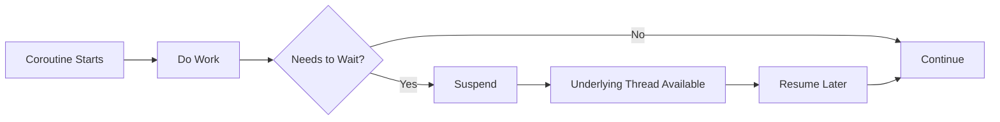

### 3.3 Android Architecture

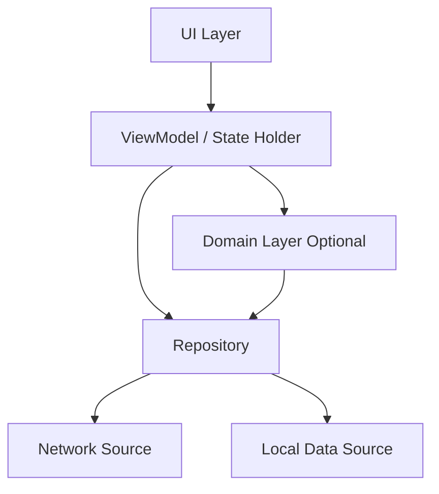

### 3.4 KMP Architecture

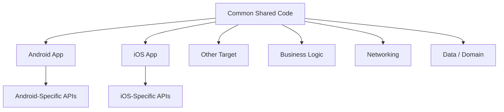

### 3.5 Flow

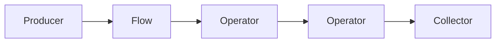

---

## 4. Mind Map

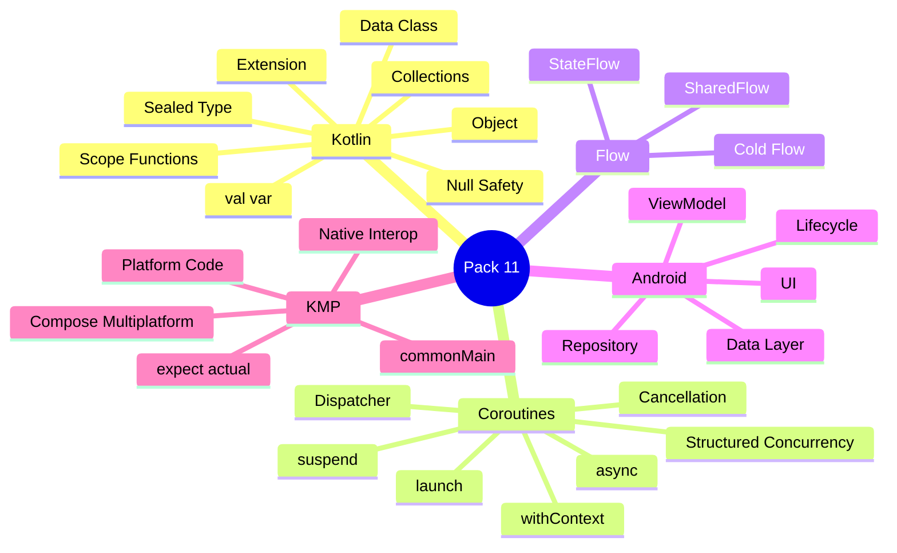

Five anchors:

> **Language → Coroutines → Flow → Android → KMP**

---

## 5. Kotlin vs Java

Do not answer:

> “Kotlin is shorter Java.”

Kotlin introduces important language-level differences:

- null safety,
- concise data modeling,
- extension functions,
- higher-order functions,
- coroutines,
- sealed hierarchies,
- smart casts,
- expression-oriented syntax,
- Java interoperability.

### Interview-Ready Answer

> Kotlin works very well with the Java ecosystem but adds language features that improve safety and expressiveness, especially null safety, concise data modeling, higher-order functions, sealed types, extension functions, and coroutine-based asynchronous programming. I see it as interoperable with Java rather than as a replacement for the Java ecosystem.

---

## 6. `val` vs `var`

### `val`

Read-only reference.

```kotlin
val name = "Deepak"
```

Cannot be reassigned.

### `var`

Mutable reference.

```kotlin
var status = "NEW"
status = "DONE"
```

### Important Trap

`val` does not make the referenced object deeply immutable.

```kotlin
val users = mutableListOf<String>()
users.add("A")
```

Prefer `val` by default and mutation deliberately.

---

## 7. Null Safety

Kotlin distinguishes:

```kotlin
String
```

from:

```kotlin
String?
```

Nullable:

```kotlin
var name: String? = null
```

### Safe Call

```kotlin
val length = name?.length
```

### Elvis

```kotlin
val displayName = name ?: "Unknown"
```

### Not-Null Assertion

```kotlin
val length = name!!.length
```

If `name` is null, this fails at runtime.

### Senior Rule

Frequent `!!` usually means the nullability model is being bypassed.

### Interview-Ready Answer

> Kotlin's nullable type system makes potential absence explicit. I normally use safe calls, Elvis, early validation, or better domain modeling. I use `!!` only where a non-null invariant is genuinely established and cannot be expressed more safely.

---

## 8. Smart Cast

```kotlin
fun printLength(value: Any) {
    if (value is String) {
        println(value.length)
    }
}
```

Inside the checked branch, Kotlin can treat `value` as a String.

---

## 9. Data Class

```kotlin
data class User(
    val id: Long,
    val name: String
)
```

Useful generated behavior includes:

- `equals`,
- `hashCode`,
- `toString`,
- `copy`,
- component functions.

Example:

```kotlin
val updated = user.copy(name = "Updated")
```

Use data classes when value-like semantics fit the model.

---

## 10. Sealed Class / Interface

Use when the allowed variants are intentionally controlled.

```kotlin
sealed interface ApiResult {
    data class Success(
        val data: String
    ) : ApiResult

    data class Error(
        val message: String
    ) : ApiResult

    data object Loading : ApiResult
}
```

Useful for:

- UI state,
- domain outcomes,
- workflow states.

### Interview-Ready Answer

> Sealed types are useful for modeling a controlled finite hierarchy. They make state transitions clearer and allow exhaustive `when` handling, which helps reduce invalid or forgotten states.

---

## 11. Object and Companion Object

### Object Declaration

```kotlin
object IdGenerator {
    fun next(): String = "..."
}
```

Singleton-style object.

Avoid global mutable state.

### Companion Object

```kotlin
class User private constructor(
    val name: String
) {
    companion object {
        fun create(name: String): User =
            User(name)
    }
}
```

Useful for class-associated factories/constants/behavior.

---

## 12. Extension Function

```kotlin
fun String.initials(): String =
    split(" ")
        .mapNotNull { it.firstOrNull()?.toString() }
        .joinToString("")
```

Extension functions do not modify the original class and are statically resolved.

### Interview-Ready Answer

> Extension functions let me add domain-friendly callable behavior around an existing type without modifying or inheriting from it. They are statically resolved, so I do not treat them as runtime polymorphic overrides.

---

## 13. Higher-Order Function

```kotlin
fun calculate(
    a: Int,
    b: Int,
    operation: (Int, Int) -> Int
): Int = operation(a, b)
```

Usage:

```kotlin
calculate(10, 20) { x, y -> x + y }
```

A higher-order function accepts or returns function values.

---

## 14. Scope Functions

Kotlin provides:

```text
let
run
with
apply
also
```

Use two questions:

1. Is receiver accessed as `it` or `this`?
2. Does the function return the receiver or the lambda result?

### `let`

Good for scoped transformation or nullable value use.

```kotlin
user?.let {
    sendEmail(it)
}
```

### `apply`

Configure and return the receiver.

```kotlin
val user = UserBuilder().apply {
    name = "Deepak"
    active = true
}
```

### `also`

Side action while returning the same object.

```kotlin
val user = createUser()
    .also { logger.info("Created ${it.id}") }
```

### Senior Rule

Do not chain scope functions until the code becomes a puzzle.

---

## 15. Collections

Kotlin collection interfaces include:

```text
List / MutableList
Set / MutableSet
Map / MutableMap
```

A read-only interface is not automatically deep immutability.

Example pipeline:

```kotlin
val names =
    users
        .filter { it.active }
        .map { it.name }
        .sorted()
```

---

## 16. Collection vs Sequence

A Sequence evaluates lazily.

```kotlin
val result =
    users
        .asSequence()
        .filter { it.active }
        .map { it.name }
        .take(10)
        .toList()
```

Do not say:

> “Sequence is always faster.”

Use when the lazy pipeline provides value, especially for larger/chained/short-circuiting workloads, and measure when performance matters.

---

## 17. `lateinit` vs `lazy`

### `lateinit`

Used for a non-null mutable property initialized later.

```kotlin
lateinit var repository: Repository
```

Access before initialization fails.

### `lazy`

Computes a `val` on first access.

```kotlin
val client by lazy {
    createClient()
}
```

### Interview-Ready Answer

> `lateinit` is for a mutable non-null property whose initialization is delayed, while `lazy` is a delegated read-only value initialized on first access. I prefer constructor initialization when possible because it makes object validity clearer.

---

## 18. Equality: `==` vs `===`

In Kotlin:

```text
==
→ structural equality via equals semantics

===
→ referential identity
```

Do not import Java's exact operator semantics into Kotlin.

---

## 19. Coroutines

Official Kotlin documentation describes a coroutine as a **suspendable computation**.

A coroutine can:

- suspend,
- resume later,
- run in a coroutine context,
- use threads according to its dispatcher,
- participate in structured concurrency.

### Key Point

> A coroutine is not a thread.

---

## 20. `suspend`

```kotlin
suspend fun loadUser(): User {
    return api.getUser()
}
```

`suspend` means the function may suspend during coroutine execution.

### Critical Trap

`suspend` does not automatically make blocking code non-blocking.

If it calls a blocking API, the thread can still block.

---

## 21. `launch`

```kotlin
scope.launch {
    syncData()
}
```

Returns:

```text
Job
```

Use when no result value is required.

---

## 22. `async`

```kotlin
val user = async { loadUser() }
val orders = async { loadOrders() }

val result =
    user.await() to orders.await()
```

Returns:

```text
Deferred<T>
```

Use when an asynchronous result is needed.

### Interview-Ready Answer

> `launch` returns a Job and is appropriate when I do not need a result. `async` returns Deferred and is used when I need a result through `await`. I keep both inside controlled scopes so lifecycle and failure remain structured.

---

## 23. `withContext`

```kotlin
suspend fun loadFile(): String =
    withContext(Dispatchers.IO) {
        file.readText()
    }
```

Use when you want to execute a block in another context and wait for its result.

---

## 24. Dispatchers

### Main

UI/main-thread work on supported UI platforms such as Android.

### IO

Blocking I/O workloads.

### Default

CPU-intensive work.

### Senior Rule

Choose dispatcher by workload, not by habit.

---

## 25. Structured Concurrency

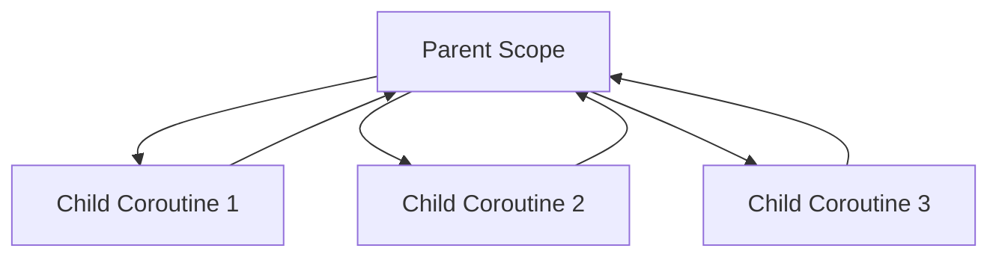

Benefits:

- controlled lifetime,
- cancellation propagation,
- predictable failure behavior,
- fewer orphan tasks.

### Interview-Ready Answer

> Structured concurrency means asynchronous work belongs to an explicit scope so child lifetime, cancellation, and failure behavior are governed by the parent. I avoid unstructured global work because it becomes difficult to cancel, test, and reason about.

---

## 26. `coroutineScope`

```kotlin
suspend fun loadDashboard() =
    coroutineScope {
        val profile =
            async { loadProfile() }

        val orders =
            async { loadOrders() }

        Dashboard(
            profile.await(),
            orders.await()
        )
    }
```

The scope waits for its children and follows structured failure/cancellation rules.

---

## 27. Cancellation

Coroutine cancellation is cooperative.

For long CPU work, code may need to observe cancellation.

```kotlin
while (isActive) {
    doWorkChunk()
}
```

Cancellation prevents:

- wasted work,
- stale updates,
- leaked requests,
- unnecessary resource use.

---

## 28. Exception Propagation and Supervision

Failure behavior depends on:

- builder,
- parent-child relationship,
- scope,
- supervision.

Sometimes one child failure should not cancel independent siblings.

Example:

```text
Dashboard
├── Profile succeeds
├── Weather fails
└── Notifications succeed
```

Use supervision where independence is part of the requirement.

---

## 29. Shared Mutable State

Coroutines do not eliminate concurrency problems.

Unsafe:

```kotlin
var count = 0

repeat(1000) {
    launch(Dispatchers.Default) {
        count++
    }
}
```

Possible strategies:

- immutable state,
- atomic operations,
- Mutex,
- confinement,
- message/state ownership.

### Senior Rule

> Concurrency model changes; correctness requirements do not.

---

## 30. Coroutine vs Thread

### Thread

Execution resource.

### Coroutine

Suspendable computation scheduled onto execution resources.

### Interview-Ready Answer

> A thread is an execution resource, while a coroutine is a suspendable computation that runs on threads according to its context. A suspended coroutine can release the thread for other work and resume later, which makes high-concurrency asynchronous workloads more efficient than blocking one thread per operation.

---

## 31. Flow

A Flow can emit multiple asynchronous values over time.

Suspend function:

```text
one asynchronous result
```

Flow:

```text
multiple values
```

Example:

```kotlin
fun observeUsers(): Flow<List<User>> =
    repository.observeUsers()
```

---

## 32. Cold Flow

A normal Flow is generally cold.

Upstream work starts separately for each collector.

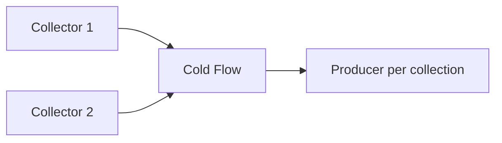

---

## 33. Flow Operators

Examples:

```text
map
filter
combine
debounce
distinctUntilChanged
catch
flowOn
```

Use operators when they make the pipeline clearer.

---

## 34. StateFlow

StateFlow represents observable state and always has a current value.

```kotlin
private val _uiState =
    MutableStateFlow(UiState())

val uiState: StateFlow<UiState> =
    _uiState
```

Mental model:

> **current state + updates**

---

## 35. SharedFlow

SharedFlow is a hot shared stream with configurable replay/buffering behavior.

Mental model:

> **shared emissions**

### StateFlow vs SharedFlow

> StateFlow is naturally suited to current state. SharedFlow is a more general shared hot stream. Choose based on semantics, not naming convention alone.

---

## 36. Android Architecture

Current Android architecture guidance emphasizes separation into clear layers and unidirectional data flow.

Common structure:

```text
UI Layer
→ Data Layer

Optional:
UI
→ Domain
→ Data
```

---

## 37. UI Layer

Responsible for:

- displaying state,
- reacting to user input,
- delegating logic to state holders.

Avoid putting database/network implementation directly in UI components.

---

## 38. ViewModel

ViewModel acts as a screen-level state holder and coordinator.

Typical responsibilities:

- invoke repository/use cases,
- expose UI state,
- survive configuration changes within lifecycle semantics.

Do not place direct View objects inside ViewModel.

---

## 39. Repository

Repository provides a data boundary.

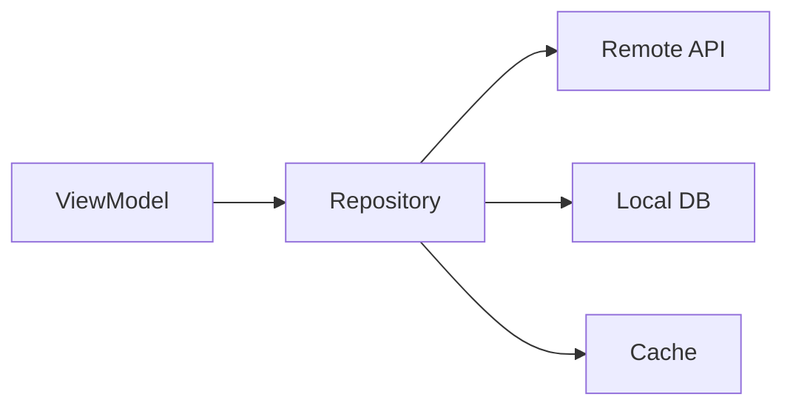

Repository may coordinate:

- network,
- local storage,
- cache,
- business data rules.

It is not merely one class per table.

---

## 40. Domain Layer

Optional.

Useful when:

- business logic is complex,
- logic is reused across screens,
- use cases deserve explicit boundaries.

Do not add a domain layer only to satisfy a diagram.

---

## 41. Lifecycle-Aware Coroutines

Android provides lifecycle-aware coroutine scopes such as `viewModelScope`.

```kotlin
viewModelScope.launch {
    repository.refresh()
}
```

Important principle:

> screen-related async work needs a lifecycle owner.

---

## 42. UI State Modeling

```kotlin
sealed interface UserScreenState {
    data object Loading : UserScreenState

    data class Success(
        val user: User
    ) : UserScreenState

    data class Error(
        val message: String
    ) : UserScreenState
}
```

This is often clearer than conflicting boolean flags.

---

## 43. Main-Safe Functions

A suspend function called from UI code should not unexpectedly block the main thread.

The responsible data layer should move blocking work to an appropriate execution context.

---

## 44. Offline-First — Concept

Offline-first can treat local persisted data as the primary user-facing source while remote synchronization happens separately.

Useful when:

- connectivity is unreliable,
- app must remain usable offline.

Costs:

- synchronization,
- conflicts,
- stale data,
- retry/reconciliation complexity.

Use only when the product needs it.

---

## 45. Android Production Troubleshooting

### UI Freeze / ANR

Investigate:

- blocking main thread,
- heavy computation,
- synchronous I/O,
- lock contention.

### Memory Growth

Investigate:

- retained Activity/Fragment/View,
- callback/listener leaks,
- long-lived coroutine scope,
- cache growth,
- large resources.

### Duplicate Requests

Investigate:

- repeated collection,
- lifecycle triggers,
- state ownership,
- retries,
- multiple subscriptions.

---

## 46. Kotlin Multiplatform

Kotlin Multiplatform allows Kotlin code sharing across targets while preserving platform-specific implementation where needed.

Possible targets include:

- Android,
- iOS,
- desktop,
- web,
- server.

KMP does not require sharing everything.

---

## 47. What to Share

Often good candidates:

- domain models,
- validation,
- networking,
- repositories,
- business logic,
- use cases.

Often platform-specific:

- permissions,
- platform notifications,
- platform keychain/keystore,
- OS APIs,
- native UI if chosen.

---

## 48. KMP Source Sets

Conceptual source sets:

```text
commonMain
androidMain
iosMain
```

Shared code lives in common source sets when it does not directly require target-specific APIs.

---

## 49. KMP Visualization

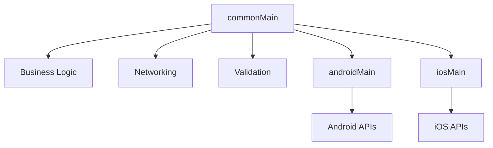

---

## 50. `expect` / `actual`

Use when common code needs a declaration with platform-specific implementations.

Concept:

```kotlin
// common
expect fun platformName(): String
```

Platform:

```kotlin
actual fun platformName(): String = "Android"
```

Do not use `expect`/`actual` for every abstraction.

Use normal interfaces/common abstractions when they are simpler.

---

## 51. Native Interoperability

KMP retains access to native/platform ecosystems.

That means shared code can coexist with:

- Java/Kotlin libraries on Android,
- Swift/Objective-C-facing code on Apple platforms,
- platform APIs through target-specific code.

---

## 52. KMP vs Compose Multiplatform

### KMP

Cross-platform Kotlin code sharing.

### Compose Multiplatform

Optional declarative UI framework for sharing UI on supported targets.

### Interview-Ready Answer

> Kotlin Multiplatform is the broader code-sharing technology. Compose Multiplatform is an optional UI framework. A KMP application can still use fully native Android and iOS UIs while sharing business and data logic.

---

## 53. When KMP Is a Good Fit

Consider KMP when:

- meaningful business/data logic is duplicated,
- Kotlin expertise exists,
- native integration still matters,
- incremental sharing is valuable,
- platform teams can own the shared module collaboratively.

---

## 54. When KMP May Be a Poor Fit

Potential concerns:

- little logic worth sharing,
- very small app,
- team lacks Kotlin/native experience,
- platform implementations diverge heavily,
- critical dependencies are target-specific,
- shared ownership creates organizational friction.

### Senior Rule

> Do not choose KMP simply because “one codebase sounds cheaper.”

---

## 55. Android + iOS KMP Scenario

Shopping app.

Shared:

```text
Product model
Cart calculation
Validation
Networking
Repository
Domain use cases
```

Platform-specific:

```text
Android permissions
iOS secure storage APIs
Platform notifications
Native UI if retained
```

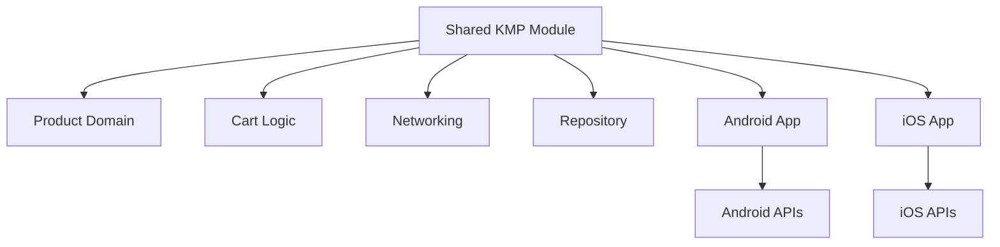

---

## 56. Performance and Coroutines

Do not say:

> “Coroutines make everything faster.”

Coroutines improve asynchronous structure and can reduce the cost of blocking-style concurrency for suitable work.

Bad design can still create:

- excessive concurrency,
- blocked dispatcher threads,
- duplicate requests,
- memory growth,
- overcomplicated Flow chains.

Measure.

---

## 57. Testing Coroutines

Key goal:

> control coroutine execution and time in tests.

Test:

- success,
- failure,
- cancellation,
- state transitions,
- ordering where required.

Avoid global uncontrolled scopes.

---

## 58. Project Mapping

This section follows **Evidence First**.

The submitted résumé supports earlier experience with:

- Java,
- Kotlin,
- Android,
- MVP,
- Retrofit,
- Gson,
- geolocation,
- push notifications,
- barcode features,
- automated testing.

It also supports review/architecture discussions involving:

- MVVM,
- dependency injection,
- Hilt,
- Dagger,
- Android performance.

### Safe Positioning

> Kotlin and Android are long-standing parts of my engineering background. Earlier application roles involved Java/Kotlin Android development, REST integration, architecture patterns, networking, location, and notification features. In later senior roles I also reviewed mobile architecture and dependency-injection approaches, while my most recent full-stack implementation shifted more toward React, Node.js, TypeScript, Azure, and distributed systems.

### Evidence Boundary

The submitted material does **not** establish a production KMP implementation.

**Safe:**

> I understand KMP architecture and where shared versus platform-specific code belongs.

**Do not claim unless personally true:**

> I delivered a production KMP application across Android and iOS.

---

## 59. Candidate Validation

| Topic | Real Project / Evidence |
|---|---|
| Kotlin Android implementation | __________________ |
| Coroutines production use | __________________ |
| Flow / StateFlow | __________________ |
| Retrofit | Earlier mobile résumé evidence |
| MVVM | Review/architecture evidence |
| Hilt / Dagger | Review/mentoring evidence |
| Android performance issue | __________________ |
| ANR / memory issue | __________________ |
| KMP implementation | __________________ |
| iOS interoperability | __________________ |

---

## 60. Interview-Ready Answers

### Q1. Why Kotlin over Java?

> Kotlin integrates with the Java ecosystem while adding language-level safety and expressiveness, especially null safety, concise data modeling, higher-order functions, sealed types, extension functions, and coroutines. I choose it when those features improve maintainability rather than treating Java and Kotlin as competing ecosystems.

### Q2. `val` vs `var`?

> `val` is a read-only reference and cannot be reassigned, while `var` can be reassigned. A `val` may still refer to a mutable object, so it does not mean deep immutability.

### Q3. Why is `!!` risky?

> `!!` asserts that a nullable value is non-null and fails at runtime if that assumption is wrong. Frequent use usually means we are bypassing Kotlin's type safety. I prefer safe calls, Elvis, validation, or stronger domain modeling.

### Q4. Data class vs normal class?

> A data class is useful for value-like data and automatically provides equality, hashing, copy, string representation, and destructuring behavior. I use a normal class where identity, lifecycle, or behavior is the stronger concern.

### Q5. Why sealed types?

> Sealed types model a controlled set of variants and allow exhaustive handling. They are particularly useful for UI state and domain outcomes.

### Q6. What is an extension function?

> It lets me define callable behavior for an existing type without modifying or inheriting from that type. Extension functions are statically resolved.

### Q7. What is a coroutine?

> A coroutine is a suspendable computation. It runs on threads according to its context and can suspend without holding a thread blocked for the whole wait. It does not eliminate concurrency issues such as shared-state races.

### Q8. What does `suspend` mean?

> A suspend function can suspend and resume within coroutine execution. The keyword does not automatically make blocking work non-blocking or move it to a background thread.

### Q9. `launch` vs `async`?

> `launch` returns a Job and is appropriate when no result value is required. `async` returns Deferred and is used when a result is required through `await`. Both should live inside a controlled scope.

### Q10. `withContext` vs `launch`?

> `withContext` executes a block in another coroutine context and returns its result while preserving the structured flow. `launch` starts a child coroutine and returns a Job.

### Q11. `Dispatchers.IO` vs `Default`?

> `IO` is intended for blocking I/O workloads, while `Default` is intended for CPU-intensive work. I choose based on the actual workload.

### Q12. Structured concurrency?

> It means child asynchronous work belongs to a defined scope so lifetime, cancellation, and failure are predictable. This prevents orphan background work.

### Q13. Flow vs suspend function?

> A suspend function generally returns one asynchronous result, while Flow can emit multiple values over time.

### Q14. StateFlow vs SharedFlow?

> StateFlow represents current state and always has a current value. SharedFlow is a more general hot shared stream with configurable replay and buffering.

### Q15. Android architecture?

> I keep UI rendering and user interaction in the UI layer, expose screen state through ViewModel/state holders, and keep data operations behind repositories. A domain layer is optional and useful for complex reusable business logic.

### Q16. What is KMP?

> Kotlin Multiplatform lets teams share Kotlin code across targets such as Android and iOS while keeping platform-specific implementations where required. I normally think first about sharing domain, networking, validation, and data logic.

### Q17. KMP vs Compose Multiplatform?

> KMP is the broader cross-platform code-sharing technology. Compose Multiplatform is an optional shared UI framework. A KMP project can retain native UIs.

### Q18. When would you choose KMP?

> I would choose KMP when there is meaningful logic to share, Kotlin capability exists, and native integration still matters. I would not add it to a small app with little shared logic just for architectural fashion.

---

## 61. Likely Follow-Ups

### Kotlin

- `lateinit` vs `lazy`?
- `==` vs `===`?
- `object` vs companion object?
- Sequence?
- delegation?
- inline/reified?
- Java interoperability?
- platform types?

### Coroutines

- Job vs Deferred?
- `coroutineScope` vs `supervisorScope`?
- SupervisorJob?
- cancellation?
- CoroutineExceptionHandler?
- Mutex?
- Channel?
- Flow backpressure?
- `flowOn`?
- `collectLatest`?

### Android

- ViewModel lifecycle?
- lifecycle-aware Flow collection?
- Room?
- WorkManager?
- Hilt?
- configuration changes?
- ANR?
- memory leaks?

### KMP

- source sets?
- `expect`/`actual`?
- native UI vs shared UI?
- Ktor?
- data storage?
- dependency selection?
- test strategy?

Do not study every Level 3 topic equally unless the interviewer goes deeper.

---

## 62. Common Interview Traps

### Trap 1

> “Kotlin is just concise Java.”

Too shallow.

### Trap 2

> “`val` means immutable.”

Wrong.

### Trap 3

> “`!!` should never be used.”

Too absolute.

### Trap 4

> “Coroutine is a thread.”

Wrong.

### Trap 5

> “`suspend` means background thread.”

Wrong.

### Trap 6

> “Coroutines eliminate race conditions.”

Wrong.

### Trap 7

> “Flow is a List.”

Wrong.

### Trap 8

> “StateFlow is only for Android.”

Wrong.

### Trap 9

> “KMP means one UI for Android and iOS.”

Wrong.

### Trap 10

> “KMP eliminates platform-specific code.”

Wrong.

---

## 63. Interviewer Intent

| Question | What is really being tested |
|---|---|
| Kotlin vs Java | Language judgment |
| Null safety | Kotlin fundamentals |
| Data/sealed classes | Modeling |
| Extension functions | Idiomatic Kotlin |
| Coroutines | Modern Kotlin depth |
| `launch` vs `async` | Async precision |
| Dispatcher choice | Performance judgment |
| Structured concurrency | Lifecycle correctness |
| Flow | Async stream understanding |
| StateFlow | State modeling |
| Android architecture | Mobile maturity |
| ViewModel/repository | Separation of concerns |
| KMP | Role-specific architecture |
| KMP trade-offs | Senior judgment |

---

## 64. Practical / Mini Mock Content

This section is for later practice only.

### Level 1 — Must Know

1. Kotlin vs Java?
2. `val` vs `var`?
3. Nullable vs non-null?
4. `?.`, `?:`, `!!`?
5. Data class?
6. Sealed class/interface?
7. Extension function?
8. Scope functions?
9. Collection vs Sequence?
10. What is a coroutine?
11. What does `suspend` mean?
12. `launch` vs `async`?
13. `IO` vs `Default`?
14. Structured concurrency?
15. Flow?
16. StateFlow vs SharedFlow?
17. Android architecture?
18. ViewModel?
19. KMP?
20. KMP vs Compose Multiplatform?

### Level 2 — Follow-Up

21. `lateinit` vs `lazy`?
22. `==` vs `===`?
23. Why can scope functions hurt readability?
24. What happens during cancellation?
25. What if blocking I/O runs on Main?
26. `coroutineScope` vs `supervisorScope`?
27. Can coroutines race?
28. How do you protect shared state?
29. Why is normal Flow cold?
30. What should ViewModel expose?
31. Why use repository?
32. What belongs in `commonMain`?
33. When do you use `expect`/`actual`?
34. Native UI vs shared UI?
35. When should KMP be rejected?

### Level 3 — Engineering Deep Dive

36. Diagnose coroutine leak.
37. Diagnose duplicate API calls.
38. Design StateFlow screen state.
39. Design offline-first data flow.
40. Design Android + iOS KMP shared module.
41. Decide what stays platform-specific.
42. Test coroutines deterministically.
43. Prevent main-thread blocking.
44. Migrate Java Android toward Kotlin safely.
45. Defend KMP vs native-only architecture.

---

## 65. Quick Revision

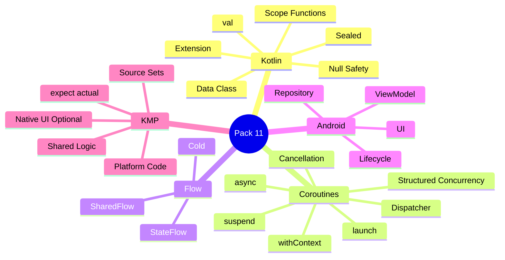

---

## 66. 90-Second Rapid Revision

```text
KOTLIN
JVM interoperability + safer expressive language

val
read-only reference

var
reassignable reference

NULL SAFETY
String vs String?

?.
safe call

?:
fallback

!!
assert non-null carefully

DATA CLASS
value-style data model

SEALED
controlled hierarchy

EXTENSION
static extension-style behavior

COROUTINE
suspendable computation

suspend
may suspend; not automatically background

launch
Job

async
Deferred result

withContext
change context and return result

IO
blocking I/O

Default
CPU work

STRUCTURED CONCURRENCY
scope owns child work

FLOW
multiple async values

STATEFLOW
current state + updates

SHAREDFLOW
shared hot stream

ANDROID
UI -> ViewModel -> Repository -> Sources

KMP
share Kotlin logic across platforms

COMPOSE MULTIPLATFORM
optional shared UI

RULE
share where valuable; keep native code where required
```

---

## 67. Candidate Answer Mapping

| Area | Safe Claim | Evidence / Mapping | Risk |
|---|---|---|---|
| Kotlin | Supported, earlier hands-on | Mobile roles | Low |
| Android | Supported | Mobile roles | Low |
| Retrofit/Gson | Supported | Resume | Low |
| MVVM | Supported in review/architecture context | Resume | Low |
| Hilt/Dagger | Supported in review/mentoring context | Resume | Low |
| Coroutines production depth | Validate personally | __________________ | Medium |
| Flow/StateFlow | Validate personally | __________________ | Medium |
| KMP knowledge | Role-aligned knowledge | Current preparation | Low if framed as knowledge |
| Production KMP delivery | Not established | __________________ | High if claimed |
| iOS KMP implementation | Not established | __________________ | High if claimed |

---

## 68. Final Visualization

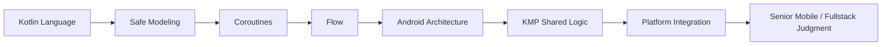

---

## Golden Rules

> **Prefer Kotlin's type system over bypassing it with `!!`.**

> **A coroutine is a suspendable computation, not a thread.**

> **`suspend` does not automatically make blocking code non-blocking.**

> **Structured concurrency gives asynchronous work an owner and lifetime.**

> **Model UI state explicitly instead of combining conflicting booleans.**

> **KMP shares code where it creates value; it does not eliminate native platform engineering.**

> **Do not claim production KMP experience unless you can defend the real implementation.**

For a senior engineer:

> **Type Safety → Structured Concurrency → State → Architecture → Platform Trade-Off → Evidence**

---

## Reference Baseline — Official Sources Checked 19 August 2026

- Kotlin Coroutines overview: https://kotlinlang.org/docs/coroutines-overview.html
- Kotlin Coroutines basics: https://kotlinlang.org/docs/coroutines-basics.html
- Kotlin Flow documentation: https://kotlinlang.org/docs/coroutines-flow.html
- Kotlin Multiplatform overview: https://kotlinlang.org/docs/multiplatform/kmp-overview.html
- Kotlin Multiplatform project structure: https://kotlinlang.org/docs/multiplatform/multiplatform-discover-project.html
- Android Kotlin coroutines: https://developer.android.com/kotlin/coroutines
- Android coroutine best practices: https://developer.android.com/kotlin/coroutines/coroutines-best-practices
- Android app architecture: https://developer.android.com/topic/architecture
- Android architecture recommendations: https://developer.android.com/topic/architecture/recommendations
- Android lifecycle-aware coroutines: https://developer.android.com/topic/libraries/architecture/coroutines

This pack deliberately avoids unsupported claims about a production KMP implementation.
