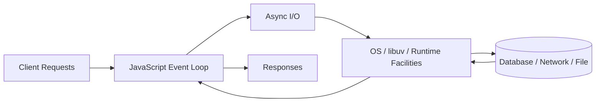
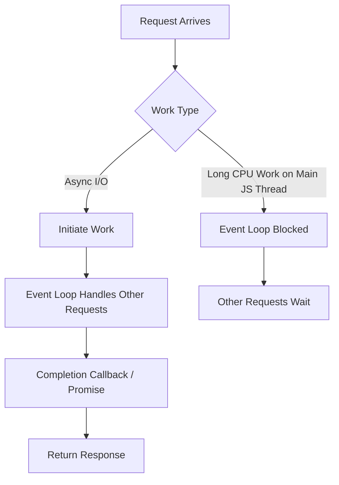
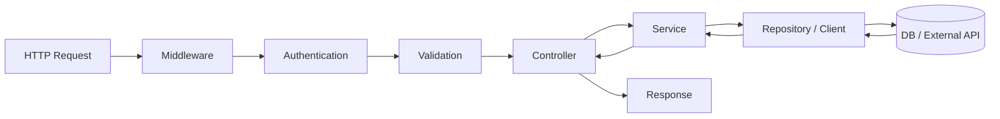
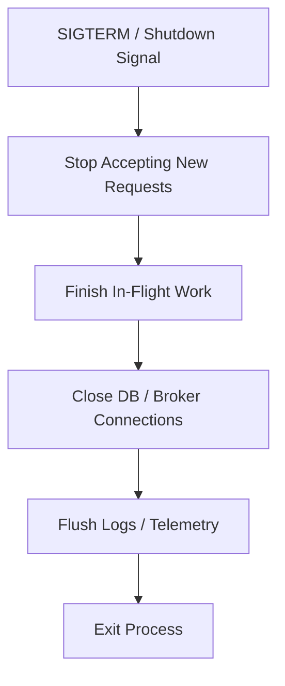
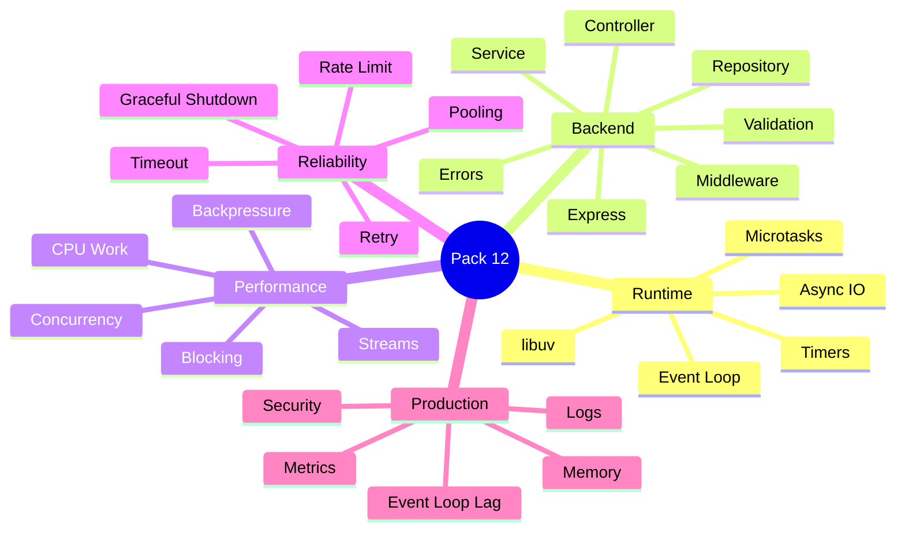
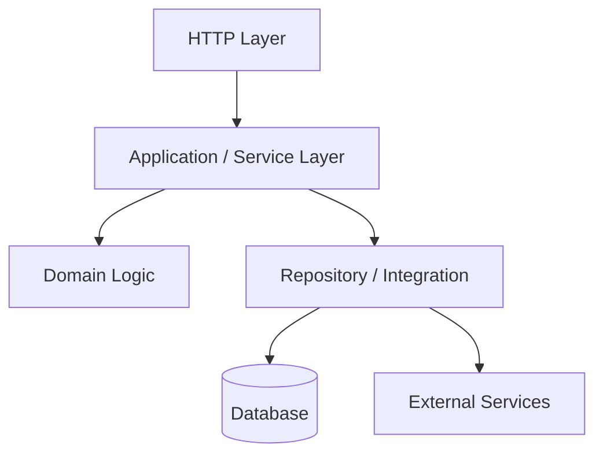
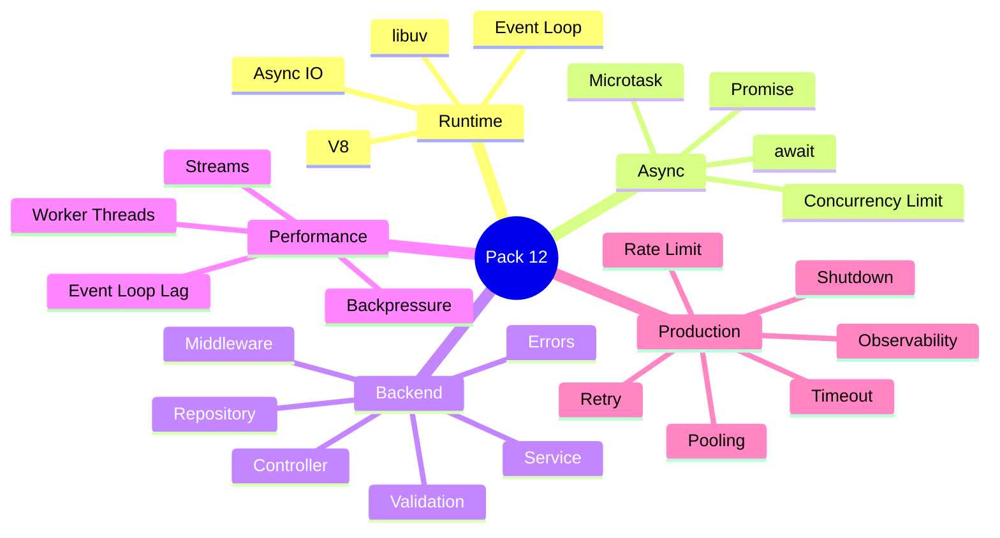
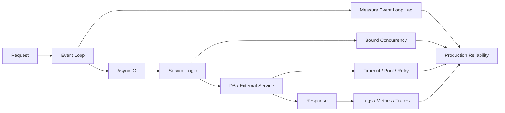

# VRIZE Interview Preparation — Pack 12
## Node.js + TypeScript Backend + Express + Production Engineering

**Target Role:** Senior Fullstack Developer — Round 1  
**Candidate:** Deepak Kumar  
**Priority:** P0 — Must Know  
**Timebox:** 80–90 minutes study + later practice  
**Approach:** KIS + DRY + SOLID | Mind-Friendly | Interview-First | Evidence-First | No Bluff  
**Depth:** Level 1 Must Know → Level 2 Follow-Up → Level 3 Engineering Deep Dive

---

## Readiness Gate

Before this pack is considered ready, you should be able to:

- Explain what Node.js is and what it is not.
- Explain the event loop without saying “Node is single-threaded” as the complete answer.
- Explain blocking vs non-blocking work.
- Explain the role of libuv at interview level.
- Explain the difference between I/O-bound and CPU-bound workloads.
- Explain callbacks, Promises, `async/await`, microtasks, and event-loop phases at senior-interview level.
- Explain streams and backpressure.
- Explain why unbounded concurrency can damage a backend service.
- Explain Express middleware and request flow.
- Explain controller/service/repository layering for Node.js backends.
- Explain validation, centralized error handling, logging, security, and graceful shutdown.
- Explain connection pooling, timeout, retry, rate limiting, and caching.
- Explain worker threads vs process-level scaling conceptually.
- Explain common Node.js production problems such as memory growth, event-loop blocking, request pile-up, and unhandled failures.
- Connect answers to recent Node.js/TypeScript experience without inventing unsupported tools or incidents.

---

## 1. Objective

Node.js is one of the strongest recent technologies on the résumé available to the panel.

This makes Pack 12 especially important because it gives you a place to demonstrate:

- current hands-on depth,
- backend engineering maturity,
- production thinking,
- performance awareness.

The interviewer may start with:

> “Why Node.js?”

and quickly move to:

> “If Node.js uses one JavaScript thread, how does it handle thousands of requests?”

> “What blocks the event loop?”

> “What is the difference between `setImmediate`, Promise callbacks, and timers?”

> “How do streams help?”

> “How do you structure an Express application?”

> “How would you gracefully shut down a service?”

The mental flow is:

```text
Request
→ Event Loop
→ Async I/O
→ Application Layers
→ Database / External API
→ Response
→ Observability
→ Production Failure Handling
```

---

## 2. Real-Life Analogy

Think of Node.js as a highly efficient restaurant manager.

The manager does not personally cook every meal.

Instead:

1. receives an order,
2. sends work to the right station,
3. continues accepting other orders,
4. gets notified when work completes,
5. sends the result back.

That works extremely well when workers spend time waiting on:

- database,
- network,
- file system,
- external APIs.

But if the manager personally starts doing a 30-second calculation at the front desk:

> the entire queue stops moving.

That is the core Node.js performance mental model.

---

## 3. Visualization

### 3.1 Node.js Request Model



---

### 3.2 Blocking vs Non-Blocking



---

### 3.3 Express Request Flow



---

### 3.4 Stream Pipeline


---

### 3.5 Graceful Shutdown



---

## 4. Mind Map



Five anchors:

> **Runtime → Application Structure → Performance → Reliability → Production**

---

## 5. What Is Node.js?

Node.js is a JavaScript runtime built around the V8 engine and an event-driven, non-blocking I/O model.

It is particularly effective for:

- APIs,
- real-time services,
- I/O-heavy backend systems,
- gateways,
- integration services,
- streaming applications.

### Do Not Say

> “Node.js is a framework.”

It is a runtime.

Express is a web framework/library commonly used on top of Node.js.

---

## 6. Is Node.js Single-Threaded?

This is a classic trap.

Better answer:

> JavaScript execution in a normal Node.js process primarily runs on one main event-loop thread, but the Node runtime is not limited to one thread internally. The OS, libuv thread pool, worker threads, and other runtime components can perform work outside that JavaScript thread.

### Interview-Ready Answer

> Node.js executes normal JavaScript on the main event-loop thread, but its runtime uses operating-system async facilities and libuv, including a thread pool for selected operations. That lets one process handle many concurrent I/O operations without one JavaScript thread blocking per request.

---

## 7. Event Loop — Simple Model

The event loop coordinates execution of JavaScript callbacks associated with completed asynchronous work.

Mental model:

```text
run current JavaScript
→ handle queued work
→ process completed I/O callbacks
→ continue
```

### Important

Do not treat the event loop as:

> “an infinite while loop that simply reads a queue.”

That analogy is useful, but the real runtime has phases and separate scheduling mechanisms.

---

## 8. libuv — Interview Level

libuv provides cross-platform asynchronous I/O infrastructure used by Node.js.

It supports:

- event-loop implementation,
- asynchronous networking integration,
- thread-pool-backed operations for selected work,
- timers and platform abstractions.

### Important

Not every asynchronous Node operation uses the libuv thread pool.

Network I/O often relies on OS asynchronous facilities.

Selected operations such as some filesystem, DNS, crypto, and compression work may use the thread pool.

---

## 9. Blocking vs Non-Blocking

### Non-Blocking I/O

```ts
const data = await fs.promises.readFile("file.txt");
```

The event loop can continue serving other work while the I/O is pending.

### Blocking Work

```ts
const result = expensiveCpuLoop();
```

If this takes 5 seconds on the main JavaScript thread:

> other JavaScript callbacks wait.

### Interview-Ready Answer

> Node.js performs very well when requests spend significant time waiting on I/O. The main risk is long synchronous or CPU-heavy work on the JavaScript thread because that blocks the event loop and delays unrelated requests.

---

## 10. I/O-Bound vs CPU-Bound

### I/O-Bound

Time spent waiting on:

- database,
- network,
- file,
- remote service.

Node.js is naturally strong here.

### CPU-Bound

Time spent computing:

- compression,
- image processing,
- encryption-heavy custom workload,
- large transformations,
- complex calculations.

For CPU-heavy work consider:

- worker threads,
- separate service/process,
- job queue,
- native/managed specialized service.

Do not force CPU-heavy work onto the request event loop.

---

## 11. Promise and `async/await`

Promise represents eventual completion/failure.

```ts
async function loadUser(id: string) {
  const user = await repository.findById(id);
  return user;
}
```

### Senior Rule

`async/await` improves readability.

It does **not** automatically:

- add parallelism,
- remove blocking,
- control concurrency.

---

## 12. Sequential vs Concurrent Await

Sequential:

```ts
const user = await loadUser();
const orders = await loadOrders();
```

If independent, this may unnecessarily serialize work.

Concurrent:

```ts
const [user, orders] = await Promise.all([
  loadUser(),
  loadOrders()
]);
```

### But Be Careful

Do not run:

```ts
await Promise.all(
  millionItems.map(processItem)
);
```

without thinking.

That may create huge concurrency and overload:

- database,
- remote API,
- memory,
- socket pool.

### Senior Rule

> **Concurrency needs a limit.**

---

## 13. Microtasks

Promise continuation callbacks are scheduled as microtasks.

Example:

```ts
console.log("A");

setTimeout(() => {
  console.log("timer");
}, 0);

Promise.resolve()
  .then(() => {
    console.log("promise");
  });

console.log("B");
```

Typical result:

```text
A
B
promise
timer
```

### Interview Point

Microtasks run after the current JavaScript execution completes and before the next normal task/timer opportunity.

Avoid diving into every Node-specific queue unless asked.

---

## 14. `process.nextTick`

Node.js also has a `process.nextTick` queue.

It is processed with very high priority relative to normal event-loop progression.

### Risk

Recursive/excessive `nextTick` scheduling can starve the event loop.

Senior answer:

> Use it carefully; it is not a general performance optimization.

---

## 15. `setTimeout` vs `setImmediate`

Do not memorize an absolute universal ordering.

In Node.js, ordering can depend on the context in which they are scheduled.

### Safe Interview Answer

> `setTimeout` schedules work through the timer mechanism after at least the specified delay, while `setImmediate` schedules work for a later event-loop phase intended for immediate continuation after I/O-related processing. I avoid claiming one always runs before the other because ordering depends on context.

---

## 16. Error Handling with `async/await`

```ts
try {
  const user = await service.getUser(id);
  return user;
} catch (error) {
  throw mapToApplicationError(error);
}
```

Do not scatter ad hoc HTTP error responses throughout all layers.

Use a consistent error model.

---

## 17. Express Middleware

Middleware functions participate in request processing.

Examples:

- request logging,
- authentication,
- authorization,
- validation,
- rate limiting,
- correlation IDs,
- error handling.

### Visualization


---

## 18. Middleware Order Matters

Example:

```text
correlation ID
→ request logging
→ authentication
→ validation
→ route
→ error handler
```

If error middleware or auth is placed incorrectly:

> behavior can become inconsistent.

Express architecture is partly about controlled middleware ordering.

---

## 19. Controller

Controller should mainly handle:

- HTTP input,
- request mapping,
- service call,
- HTTP response.

Avoid large controllers containing:

- SQL,
- business rules,
- external API orchestration,
- data transformation chaos.

---

## 20. Service Layer

Service layer contains application/business use-case behavior.

Example:

```ts
class OrderService {
  constructor(
    private readonly orderRepo: OrderRepository,
    private readonly paymentClient: PaymentClient
  ) {}

  async create(command: CreateOrderCommand) {
    // business flow
  }
}
```

This supports:

- testability,
- separation of concerns,
- clearer orchestration.

---

## 21. Repository / Data Client

Repository hides data-access details from business logic.

But do not create meaningless wrappers that add no abstraction.

A useful repository expresses:

> domain/application data operations.

Not merely:

```text
one method for every raw SQL statement
```

---

## 22. Dependency Injection

Node.js/TypeScript applications benefit from explicit dependency construction.

Example:

```ts
const repository =
  new PostgresOrderRepository(db);

const service =
  new OrderService(repository, paymentClient);

const controller =
  new OrderController(service);
```

Framework-based DI is optional.

The engineering principle matters:

> business classes should not silently construct every dependency themselves.

---

## 23. Validation

Never trust request input.

Validate:

- required fields,
- types,
- format,
- ranges,
- enum values,
- business rules.

### Boundary vs Business Validation

Boundary:

```text
email is required
amount must be positive
```

Business:

```text
account is active
inventory is available
```

Keep the distinction clear.

---

## 24. Centralized Error Handling

Desired error contract:

```json
{
  "code": "ORDER_NOT_FOUND",
  "message": "Order not found",
  "traceId": "abc-123"
}
```

Avoid exposing:

- stack trace,
- database error,
- internal hostnames,
- secret values.

### Interview-Ready Answer

> I map internal errors to a consistent application error model and handle HTTP translation centrally. That keeps controllers simple and gives clients predictable status codes and error codes while preserving internal diagnostics in logs.

---

## 25. Streams

Streams process data incrementally instead of loading everything into memory.

Use cases:

- file upload/download,
- large export,
- proxying large payload,
- compression,
- data transformation.

### Bad

```text
read 2 GB file entirely into memory
→ transform
→ send
```

### Better

```text
read chunk
→ transform chunk
→ write chunk
```

---

## 26. Stream Types

Conceptually:

- Readable,
- Writable,
- Duplex,
- Transform.

Do not turn the interview into API memorization.

Understand the pipeline.

---

## 27. Backpressure

Backpressure prevents a fast producer from overwhelming a slower consumer.

Example:

```text
file reads fast
network writes slowly
```

Without control:

> memory buffers can grow.

Node streams support backpressure mechanisms.

### Interview-Ready Answer

> Backpressure is the mechanism for slowing or pausing producers when consumers cannot keep up. It is especially important in streams and queues because buffering is finite. A scalable system controls the rate rather than allowing memory to grow indefinitely.

---

## 28. Buffer

Node.js `Buffer` represents binary data.

Common uses:

- network protocols,
- files,
- encryption/compression,
- binary payloads.

Senior concern:

> large Buffers can create significant memory pressure outside normal JavaScript object patterns.

---

## 29. EventEmitter

EventEmitter implements in-process publish/subscribe behavior.

Useful for:

- internal application events,
- decoupled module notifications.

Do not confuse it with durable messaging.

If the process crashes:

> in-memory events are not a durable event broker.

---

## 30. Memory Model — Practical

Node/V8 memory includes more than only:

```text
JavaScript heap
```

Production memory may include:

- V8 heap,
- Buffers,
- native allocations,
- runtime structures.

### Important

A container can be OOM-killed even when the V8 heap alone does not explain all process memory.

---

## 31. Common Node.js Memory Leak Sources

Examples:

- unbounded Map/cache,
- event listeners never removed,
- timers retained,
- global collections,
- closure retaining large object graph,
- unresolved long-lived references,
- request data stored globally.

### Investigation

```text
memory trend
→ heap snapshots
→ retained objects
→ allocation profiling
→ reproduce
→ fix
→ verify
```

---

## 32. Event-Loop Lag

If event loop is blocked:

- requests become slow,
- timers fire late,
- health checks may degrade.

Possible causes:

- CPU-heavy loop,
- huge JSON transformation,
- synchronous crypto,
- synchronous filesystem calls,
- enormous serialization.

### Interview-Ready Answer

> Event-loop lag is a useful signal for Node.js responsiveness. If CPU is high and latency increases, I look for synchronous or CPU-heavy JavaScript work before assuming the system simply needs more instances.

---

## 33. Worker Threads

Worker threads allow JavaScript to execute CPU-heavy work in separate threads within a process.

Use for:

- CPU-bound JavaScript computation.

Not the default answer for:

- normal database/network I/O.

### Interview-Ready Answer

> Worker threads are useful when CPU-heavy JavaScript would otherwise block the main event loop. They are not required for normal async I/O, which Node already handles efficiently through its event-driven runtime.

---

## 34. Multi-Process Scaling

Multiple Node.js processes/containers can be used to utilize multiple CPU cores and increase resilience.

Modern production environments often scale through:

- containers,
- process managers,
- orchestration platforms.

### Senior Rule

Prefer stateless processes and externalize shared state.

---

## 35. Database Connection Pooling

A Node service should normally reuse a controlled pool of DB connections.

Do not open a new physical connection per request.

### Why Pool Size Matters

Too small:

- requests wait.

Too large:

- DB becomes overloaded.

### Interview-Ready Answer

> I size the pool according to application concurrency, query latency, number of instances, and database capacity. Increasing pool size blindly can make database contention worse.

---

## 36. External HTTP Clients

For every downstream call define:

- timeout,
- error mapping,
- retry policy,
- connection reuse,
- observability.

Avoid:

```text
infinite wait
```

---

## 37. Retry

Retry only if:

- failure is transient,
- operation is safe/idempotent,
- retry will not amplify overload.

Use:

- bounded attempts,
- backoff,
- jitter when appropriate.

Do not retry 4xx validation/auth errors blindly.

---

## 38. Rate Limiting

Rate limiting protects:

- service capacity,
- downstream dependencies,
- fairness,
- abuse.

Possible dimensions:

- IP,
- user,
- API key,
- tenant,
- endpoint.

Do not apply one simplistic global number to every workload unless it matches the requirement.

---

## 39. Caching

Node backends often use cache for:

- repeated reads,
- session/state patterns,
- expensive computed data.

Possible store:

```text
Redis
```

But first define:

- cache key,
- TTL,
- invalidation,
- consistency,
- failure fallback.

---

## 40. Security

Senior Node.js backend checklist:

- validate input,
- authenticate,
- authorize,
- parameterize DB queries,
- protect secrets,
- set secure headers as appropriate,
- limit payload size,
- rate limit where needed,
- keep dependencies patched,
- avoid unsafe dynamic execution,
- avoid sensitive logging.

### Critical Rule

> TypeScript types do not validate runtime HTTP input.

Runtime validation is still required.

---

## 41. CORS

CORS is browser cross-origin policy.

It is not:

- authentication,
- authorization,
- API security by itself.

Configure only required origins/methods/headers.

---

## 42. Graceful Shutdown

In orchestration environments the process may receive a termination signal.

Do not immediately exit.

Better:

1. stop taking new traffic,
2. finish in-flight work within deadline,
3. close DB/broker resources,
4. flush telemetry,
5. exit.

### Example Concept

```ts
process.on("SIGTERM", async () => {
  server.close(async () => {
    await db.close();
    process.exit(0);
  });
});
```

Production implementation needs:

- timeout/deadline,
- failure handling,
- correct health/readiness transition.

---

## 43. Unhandled Failures

Do not rely on a process continuing safely after unknown corrupted application state.

Production policy should be deliberate around:

- `uncaughtException`,
- `unhandledRejection`,
- process termination,
- supervisor/orchestrator restart.

### Senior Principle

> fail predictably and recover through process supervision where the state may be unsafe.

---

## 44. Health Checks

Useful separation:

### Liveness

Is the process fundamentally alive?

### Readiness

Can it serve traffic now?

Do not make liveness depend on every external service.

Otherwise one dependency outage can restart every application instance.

---

## 45. Logging

Use structured logging.

Useful fields:

```text
timestamp
service
environment
level
traceId
requestId
route
status
duration
errorCode
```

Do not log:

- password,
- access token,
- secret,
- full sensitive payload.

---

## 46. Correlation ID

A request ID/trace ID helps connect:

```text
gateway log
→ Node API log
→ downstream service
→ database trace
```

Essential for distributed troubleshooting.

---

## 47. Metrics

Useful Node/backend metrics:

- request rate,
- error rate,
- p95/p99 latency,
- CPU,
- memory,
- event-loop lag,
- active handles/connections,
- DB pool usage,
- cache hit rate,
- downstream latency,
- queue depth.

---

## 48. Production Scenario — API Suddenly Slow

Reasoning:

```text
latency endpoint
→ event-loop lag
→ CPU
→ DB latency
→ downstream latency
→ pool saturation
→ retry increase
→ memory/GC
```

Do not immediately add more Pods.

Find the bottleneck.

---

## 49. Production Scenario — Memory Keeps Growing

Reasoning:

```text
RSS / heap trend
→ heap snapshot
→ retained objects
→ Buffer/native memory
→ unbounded cache/listeners/timers
→ reproduce
→ fix
→ compare after-state
```

---

## 50. Production Scenario — High CPU

Possible causes:

- CPU-heavy JS,
- JSON serialization,
- regex/pathological input,
- encryption/compression,
- tight loop,
- excessive logging,
- retry storm.

Strong answer:

> profile first.

---

## 51. Production Scenario — DB Exhausted

Check:

- pool size per instance,
- number of replicas,
- connection leak,
- long query,
- transaction duration,
- traffic increase,
- autoscaling effect.

Example:

```text
20 Pods × 50 connections
= up to 1,000 DB connections
```

Scaling app replicas can overload DB.

---

## 52. TypeScript Backend Modeling

Use types to make contracts explicit.

Example:

```ts
type CreateOrderCommand = {
  customerId: string;
  items: Array<{
    productId: string;
    quantity: number;
  }>;
};
```

Use unions for controlled states:

```ts
type OrderResult =
  | { type: "created"; orderId: string }
  | { type: "rejected"; reason: string };
```

This reduces invalid state.

---

## 53. `unknown` at Runtime Boundaries

External errors/data may be unknown.

```ts
catch (error: unknown) {
  if (error instanceof Error) {
    logger.error(error.message);
  }
}
```

Prefer `unknown` over `any` where type is genuinely not established.

---

## 54. Runtime Validation vs TypeScript

This is important.

TypeScript disappears at runtime.

This:

```ts
const body = req.body as CreateOrderCommand;
```

does not prove the client sent valid data.

Use runtime validation.

### Interview-Ready Answer

> TypeScript protects developer contracts at compile time, but HTTP input exists at runtime and can be invalid or malicious. I validate external input before treating it as a trusted application type.

---

## 55. Layered Backend Architecture



### Senior Rule

Layers are boundaries, not bureaucracy.

Do not create ten empty abstraction layers for a small endpoint.

---

## 56. When Node.js Is a Good Fit

Good fit:

- high-concurrency I/O,
- APIs,
- gateways,
- real-time systems,
- JavaScript/TypeScript full-stack teams,
- integration services.

---

## 57. When Node.js May Not Be the Best Fit

Potential concerns:

- sustained CPU-heavy workloads,
- workloads better served by specialized runtime/language,
- strict real-time computation,
- existing platform ecosystem strongly favors another stack.

### Senior Rule

Choose based on workload and team—not fashion.

---

## 58. Project Mapping

This section follows **Evidence First**.

The résumé available to the interview panel strongly supports recent experience with:

- Node.js,
- TypeScript,
- React.js,
- MongoDB,
- Azure,
- enterprise applications,
- architecture,
- performance optimization,
- security remediation,
- CI/CD,
- production support,
- observability.

It also supports recent consulting work involving:

- APIs,
- distributed platforms,
- caching,
- asynchronous processing,
- performance,
- Docker/Kubernetes.

### Safe Positioning

> Node.js and TypeScript are among my strongest recent hands-on technologies. At Bechtel and in consulting work, I used them in enterprise full-stack/backend systems involving APIs, MongoDB/Azure integration, performance, security, code quality, deployment, and production support.

### Evidence Boundary

Do not invent:

- exact Express version,
- exact Node version,
- worker-thread use,
- a specific memory-leak incident,
- a particular rate-limiter library,
- a specific tracing product

unless you actually used them.

---

## 59. Candidate Validation

| Topic | Real Project / Evidence |
|---|---|
| Node.js API | Recent résumé evidence |
| TypeScript backend | Recent résumé evidence |
| Express | __________________ |
| Event-loop issue | __________________ |
| Stream usage | __________________ |
| Rate limiting | __________________ |
| Redis caching | __________________ |
| DB pool tuning | __________________ |
| Graceful shutdown | __________________ |
| Memory issue | __________________ |
| Worker thread | __________________ |
| Production incident | __________________ |

---

## 60. Interview-Ready Answers

### Q1. What is Node.js?

> Node.js is a JavaScript runtime built on V8 with an event-driven, non-blocking I/O model. It is especially effective for APIs and I/O-heavy backend workloads where many requests spend time waiting on databases, networks, or external services.

---

### Q2. Is Node.js single-threaded?

> Normal JavaScript execution primarily runs on one event-loop thread, but the Node runtime itself is not limited to one thread. It uses operating-system async facilities, libuv, a thread pool for selected operations, and optional worker threads.

---

### Q3. How does Node handle many concurrent requests?

> It avoids dedicating one blocked JavaScript thread to every I/O request. The event loop initiates asynchronous operations, continues processing other work, and runs the completion callbacks when results are ready. That model is efficient as long as we do not block the main JavaScript thread with long synchronous work.

---

### Q4. What blocks the event loop?

> Long synchronous JavaScript or CPU-heavy work, such as large calculations, synchronous file operations, huge serialization tasks, or other expensive functions. When the event loop is blocked, unrelated requests wait.

---

### Q5. `async/await` vs Promise?

> `async/await` is syntax built on Promises that makes asynchronous control flow easier to read. It does not create automatic parallelism or make blocking code non-blocking.

---

### Q6. Sequential await vs `Promise.all`?

> Sequential await is appropriate when one operation depends on another. For independent operations, `Promise.all` can reduce latency by running them concurrently. I still control concurrency so I do not overload downstream systems.

---

### Q7. What are streams?

> Streams process data incrementally rather than loading the full payload into memory. They are useful for large files, uploads/downloads, transformations, and proxying data while supporting backpressure.

---

### Q8. What is backpressure?

> Backpressure controls a fast producer when the consumer cannot keep up. Without it, buffers can grow and create memory pressure. Node streams provide mechanisms to pause/resume flow so processing stays within resource capacity.

---

### Q9. What is Express middleware?

> Middleware is a function in the HTTP request pipeline that can inspect or modify the request/response or delegate to the next stage. I use it for cross-cutting concerns such as authentication, validation, logging, correlation IDs, and centralized error handling.

---

### Q10. How do you structure a Node backend?

> I keep HTTP concerns in controllers/routes, business use cases in services, and database/external integration behind repositories or clients. I introduce abstractions only where they create a meaningful boundary, keeping the design simple enough to test and maintain.

---

### Q11. How do you handle errors?

> I use typed/application-level errors internally and translate them to a consistent HTTP error contract in centralized middleware. Internal diagnostics go to structured logs while client responses avoid stack traces or sensitive implementation details.

---

### Q12. When would you use worker threads?

> For CPU-heavy JavaScript work that would otherwise block the event loop. I would not use worker threads for normal asynchronous database or network I/O because Node already handles that efficiently.

---

### Q13. How do you gracefully shut down a Node service?

> I stop accepting new traffic, allow in-flight requests to complete within a deadline, close database and messaging resources, flush telemetry where needed, then exit. In Kubernetes I coordinate that with readiness and termination behavior.

---

### Q14. How do you diagnose Node memory growth?

> I first confirm the memory trend and whether growth is in the JavaScript heap or broader process memory. Then I use heap snapshots/allocation profiling and inspect common retention sources such as unbounded caches, listeners, timers, closures, or Buffers. After fixing it I compare the same workload again.

---

### Q15. How do you prevent Node API overload?

> I combine bounded concurrency, rate limiting, finite timeouts, connection-pool limits, backpressure/queues where appropriate, controlled retries, and autoscaling only when the bottleneck can actually scale horizontally.

---

## 61. Likely Follow-Ups

### Runtime

- Event-loop phases?
- libuv thread pool?
- `process.nextTick`?
- `setImmediate`?
- What uses thread pool?
- Event-loop lag?
- V8 heap?

### Async

- Promise.all failure behavior?
- Promise.allSettled?
- Concurrency limiting?
- AbortController?
- Unhandled rejection?
- Timeout implementation?

### Express

- Middleware order?
- Error middleware signature?
- Router?
- Validation library?
- Async error propagation?
- Security headers?
- CORS?

### Production

- Worker threads vs cluster/processes?
- Memory leak?
- CPU profiling?
- Graceful shutdown?
- Kubernetes termination?
- Connection pool?
- Retry storm?
- Rate limit?
- Circuit breaker?

Do not study every deep topic equally unless the interviewer drills there.

---

## 62. Common Interview Traps

### Trap 1

> “Node.js is single-threaded.”

Incomplete.

### Trap 2

> “Async means multithreaded.”

Wrong.

### Trap 3

> “`async/await` makes code non-blocking.”

Only if underlying operation is non-blocking/suspending.

### Trap 4

> “`Promise.all` is always faster.”

Can overload dependencies.

### Trap 5

> “Streams are only for files.”

Wrong.

They model incremental data flow.

### Trap 6

> “Express middleware order does not matter.”

Wrong.

### Trap 7

> “TypeScript validates API input.”

Wrong.

### Trap 8

> “More Node processes always improve throughput.”

Not if DB/downstream is bottleneck.

### Trap 9

> “Memory leak means only V8 heap.”

Incomplete.

### Trap 10

> “A process should always keep running after uncaught failure.”

Unsafe as a blanket rule.

---

## 63. Interviewer Intent

| Question | What is really being tested |
|---|---|
| What is Node.js? | Runtime fundamentals |
| Single-thread question | Depth/precision |
| Event loop | Async model |
| Blocking | Performance awareness |
| Promise concurrency | Resource judgment |
| Streams/backpressure | Scale |
| Express middleware | Backend structure |
| Error handling | Production API quality |
| Worker threads | CPU-bound strategy |
| Pooling | Database resource control |
| Graceful shutdown | Production maturity |
| Memory leak | Troubleshooting |
| TypeScript runtime boundary | Type-system maturity |

---

## 64. Practical / Mini Mock Content

This section is for later practice only.

### Level 1 — Must Know

1. What is Node.js?
2. Is Node.js single-threaded?
3. Explain event loop.
4. What is libuv?
5. Blocking vs non-blocking?
6. I/O-bound vs CPU-bound?
7. Promise vs `async/await`?
8. Sequential await vs `Promise.all`?
9. What is middleware?
10. How do you structure Express backend?
11. What are streams?
12. What is backpressure?
13. What are worker threads?
14. How do you handle errors centrally?
15. How do you gracefully shut down a service?
16. Why validate runtime input with TypeScript?

### Level 2 — Follow-Up

17. What blocks event loop?
18. `setImmediate` vs `setTimeout`?
19. What is `process.nextTick`?
20. Why can `Promise.all` hurt production?
21. How do you limit concurrency?
22. What is EventEmitter?
23. How do you diagnose memory growth?
24. What is event-loop lag?
25. How do you size DB pool?
26. How do retries cause overload?
27. How do you rate limit?
28. How do you handle SIGTERM in Kubernetes?
29. How do you trace one request?
30. How do you protect secrets?

### Level 3 — Engineering Deep Dive

31. Diagnose 100% CPU in Node API.
32. Diagnose memory leak.
33. Design large file streaming endpoint.
34. Design bounded parallel downstream calls.
35. Design graceful shutdown in Kubernetes.
36. Explain process scaling across cores.
37. Explain worker-thread architecture.
38. Prevent DB exhaustion during autoscaling.
39. Prove a latency improvement.
40. Design production Node API observability.

---

## 65. Quick Revision



---

## 66. 90-Second Rapid Revision

```text
NODE
JavaScript runtime

JS EXECUTION
main event-loop thread

RUNTIME
OS + libuv + thread pool + optional workers

EVENT LOOP
coordinate async completions and JS callbacks

BLOCKING
long sync/CPU work delays all callbacks

I/O BOUND
Node strength

CPU BOUND
worker thread / separate processing if needed

async/await
Promise syntax, not automatic parallelism

Promise.all
concurrent independent work — limit fan-out

MIDDLEWARE
cross-cutting request pipeline

CONTROLLER
HTTP

SERVICE
business/use case

REPOSITORY
data/integration boundary

STREAM
incremental data processing

BACKPRESSURE
slow producer when consumer cannot keep up

WORKER THREAD
CPU-heavy JS work

POOL
reuse limited DB connections

TIMEOUT
finite wait

RETRY
safe transient failure only

GRACEFUL SHUTDOWN
stop traffic -> drain -> close resources -> exit

TYPESCRIPT
compile-time safety

RUNTIME VALIDATION
still required

PRODUCTION
measure event loop + CPU + memory + DB + downstream
```

---

## 67. Candidate Answer Mapping

| Area | Safe Claim | Evidence / Mapping | Risk |
|---|---|---|---|
| Node.js | Strong recent | Bechtel / consulting | Low |
| TypeScript backend | Strong recent | Bechtel / consulting | Low |
| REST APIs | Supported | Resume | Low |
| MongoDB/Azure backend | Supported | Bechtel | Low |
| Performance/security | Supported | Resume | Low |
| Express | Validate exact use | __________________ | Medium |
| Streams production use | Validate | __________________ | Medium |
| Worker threads | Validate | __________________ | Medium |
| Node memory incident | Validate | __________________ | Medium |
| Rate limiter implementation | Validate | __________________ | Medium |
| Specific tracing library | Validate | __________________ | Medium |

---

## 68. Final Visualization



---

## Golden Rules

> **Node.js is fast when you keep the event loop free to coordinate work.**

> **Async code can still overload a downstream system if concurrency is unbounded.**

> **Streams solve memory/flow problems only when backpressure is respected.**

> **TypeScript protects compile-time contracts; external HTTP data still requires runtime validation.**

> **More application replicas can make a saturated database worse.**

> **Graceful shutdown is part of correctness in containerized production systems.**

> **Do not claim an Express, worker-thread, or production incident story you cannot defend.**

For a senior engineer:

> **Event Loop → Controlled Concurrency → Clean Boundaries → Failure Handling → Observability → Evidence**
