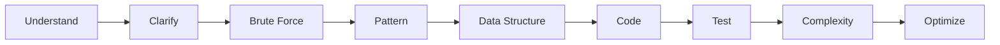
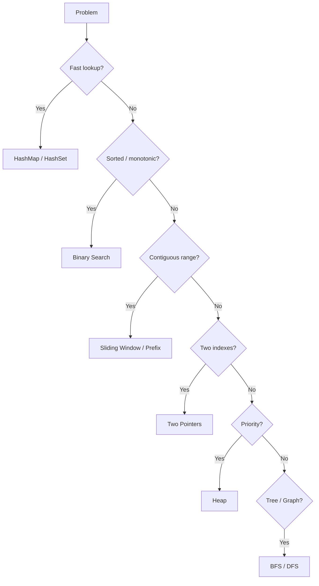
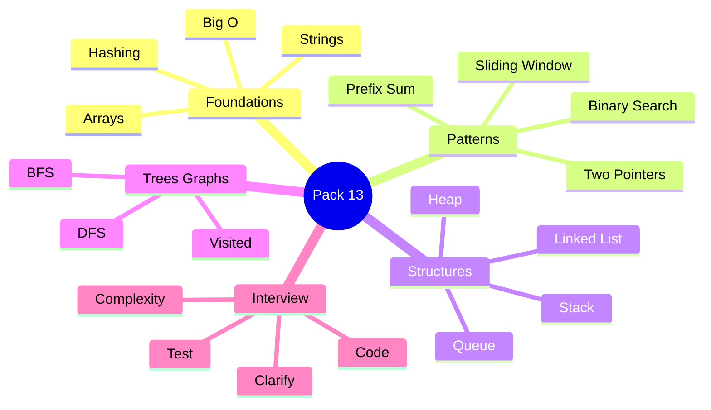
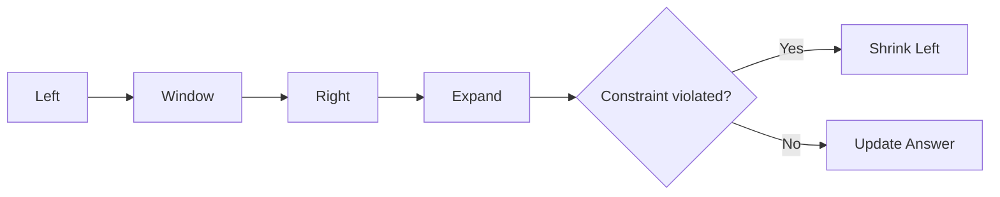
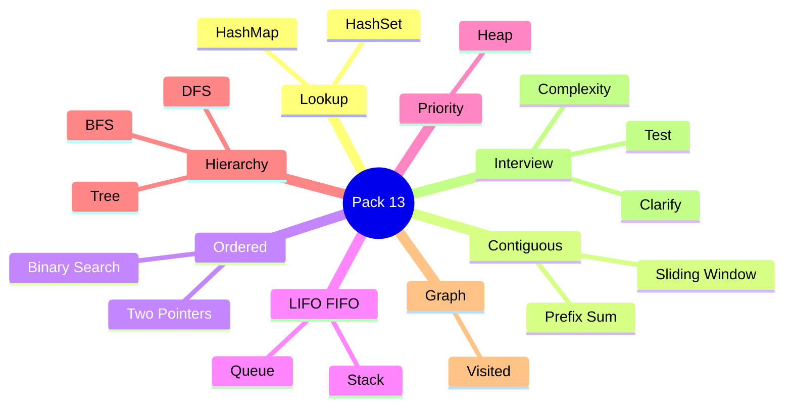
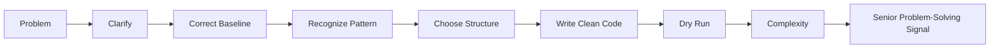

# VRIZE Interview Preparation — Pack 13
## Coding + DSA + Problem-Solving Patterns

**Target Role:** Senior Fullstack Developer — Round 1  
**Candidate:** Deepak Kumar  
**Priority:** P0 — Must Know  
**Timebox:** 80–90 minutes study + later coding practice  
**Approach:** KIS + DRY + SOLID | Mind-Friendly | Interview-First | No Bluff  
**Depth:** Level 1 Must Know → Level 2 Follow-Up → Level 3 Optimization

---

## Readiness Gate

You should be able to:

- Clarify constraints before coding.
- Give a correct baseline solution before optimizing.
- Explain time and space complexity.
- Recognize HashMap/HashSet, two-pointer, sliding-window, binary-search, stack, queue, heap, tree, and graph patterns.
- Write clean Java code and translate core patterns to Kotlin if requested.
- Test normal and edge cases manually.
- Defend “Why this data structure?”, “Can you optimize it?”, and “What is the complexity?”
- Stay calm and narrate reasoning when a bug appears.

---

## 1. Objective

Coding rounds are not only tests of memory.

A senior interviewer is watching this flow:

```text
Understand
→ Clarify
→ Baseline
→ Pattern
→ Data Structure
→ Code
→ Test
→ Complexity
→ Improve
```

Weak:

> “I remember this. It is sliding window.”

Strong:

> “A brute-force solution is O(n²). Since I repeatedly need membership lookup, a HashMap removes that repeated scan and gives average O(n) time with O(n) extra space.”

That reasoning is the goal.

---

## 2. Real-Life Analogy

Algorithms are like choosing the right vehicle.

- **HashMap** = instant address directory.
- **Stack** = plates: last in, first out.
- **Queue** = ticket line: first in, first out.
- **Heap** = always surface the highest/lowest priority.
- **Two pointers** = inspect from both ends.
- **Sliding window** = move a bounded inspection frame.
- **Binary search** = eliminate half the search space.
- **BFS** = explore level by level.
- **DFS** = go deep and backtrack.

Choose the vehicle after understanding the route.

---

## 3. Visualization





---

## 4. Mind Map



Five anchors:

> **Complexity → Pattern → Structure → Correctness → Communication**

---

## 5. Big-O Fundamentals

| Complexity | Meaning | Typical Example |
|---|---|---|
| `O(1)` | constant | HashMap lookup average case |
| `O(log n)` | halve search space | binary search |
| `O(n)` | one pass | scan array |
| `O(n log n)` | common comparison sorting | sort + scan |
| `O(n²)` | pairwise/nested work | compare every pair |

Also state **space complexity**.

A HashSet that stores up to n values:

```text
Space = O(n)
```

Time-space trade-offs are normal engineering decisions.

---

## 6. Coding Interview Script

Use this sequence:

```text
1. Restate problem
2. Clarify constraints
3. Give simple solution
4. State its complexity
5. Identify repeated work
6. Choose better pattern
7. Code
8. Dry-run
9. Test edge case
10. State final complexity
```

Example:

> I’ll confirm whether duplicates are allowed and whether I return indices or values. Brute force checks every pair in O(n²). Since I need fast complement lookup, I can use a HashMap and reduce average time to O(n) with O(n) extra space.

---

## 7. Arrays and Strings

Arrays are strong for:

- indexed access,
- sequential scanning,
- two pointers,
- prefix sums,
- sliding windows,
- binary search.

Strings commonly reduce to:

- frequency counting,
- palindrome,
- anagram,
- substring,
- parsing.

For repeated string mutation in Java:

```java
StringBuilder builder = new StringBuilder();
```

---

## 8. HashMap / HashSet Pattern

Mental triggers:

> “Have I seen this before?” → `HashSet`

> “What information belongs to this key?” → `HashMap`

Typical uses:

- duplicate detection,
- frequency counting,
- complement lookup,
- grouping,
- indexing.

---

## 9. Problem — Two Sum

```java
public static int[] twoSum(
        int[] nums,
        int target) {

    Map<Integer, Integer> indexByValue =
            new HashMap<>();

    for (int i = 0; i < nums.length; i++) {
        int needed = target - nums[i];

        if (indexByValue.containsKey(needed)) {
            return new int[] {
                    indexByValue.get(needed),
                    i
            };
        }

        indexByValue.put(nums[i], i);
    }

    return new int[] {-1, -1};
}
```

Complexity:

```text
Time: O(n) average
Space: O(n)
```

Follow-up:

> Why check before insert?

To avoid reusing the same index.

---

## 10. Problem — Contains Duplicate

```java
public static boolean containsDuplicate(
        int[] nums) {

    Set<Integer> seen = new HashSet<>();

    for (int value : nums) {
        if (!seen.add(value)) {
            return true;
        }
    }

    return false;
}
```

Complexity:

```text
Time: O(n) average
Space: O(n)
```

KIS:

> `Set.add` already tells whether insertion was new.

---

## 11. Frequency Map

```java
Map<String, Integer> frequency =
        new HashMap<>();

for (String item : items) {
    frequency.merge(item, 1, Integer::sum);
}
```

Applications:

- anagrams,
- Top-K,
- logs,
- votes,
- duplicate counts.

---

## 12. Problem — Valid Anagram

If the character domain is general, use a map.

If character domain is small and known, a fixed array can be simpler.

Senior point:

> constraints determine the best representation.

---

## 13. Two-Pointer Pattern

Use when:

- data is sorted,
- compare from both ends,
- palindrome,
- pair search,
- in-place compaction.

Mental model:

```text
L → [ data data data data ] ← R
```

---

## 14. Problem — Valid Palindrome

```java
public static boolean isPalindrome(
        String input) {

    int left = 0;
    int right = input.length() - 1;

    while (left < right) {
        while (left < right
                && !Character.isLetterOrDigit(
                        input.charAt(left))) {
            left++;
        }

        while (left < right
                && !Character.isLetterOrDigit(
                        input.charAt(right))) {
            right--;
        }

        char a =
            Character.toLowerCase(
                input.charAt(left));

        char b =
            Character.toLowerCase(
                input.charAt(right));

        if (a != b) {
            return false;
        }

        left++;
        right--;
    }

    return true;
}
```

Complexity:

```text
Time: O(n)
Space: O(1)
```

---

## 15. Sliding Window

Use for contiguous ranges:

- longest substring,
- max sum of size k,
- minimum-length subarray,
- frequency constraints.



---

## 16. Fixed Window — Maximum Sum of K

```java
public static int maxWindowSum(
        int[] nums,
        int k) {

    if (k <= 0 || k > nums.length) {
        throw new IllegalArgumentException();
    }

    int sum = 0;

    for (int i = 0; i < k; i++) {
        sum += nums[i];
    }

    int best = sum;

    for (int right = k;
         right < nums.length;
         right++) {

        sum += nums[right];
        sum -= nums[right - k];

        best = Math.max(best, sum);
    }

    return best;
}
```

Complexity:

```text
Time: O(n)
Space: O(1)
```

---

## 17. Problem — Longest Substring Without Repeating Characters

```java
public static int longestUniqueSubstring(
        String s) {

    Map<Character, Integer> lastSeen =
            new HashMap<>();

    int left = 0;
    int best = 0;

    for (int right = 0;
         right < s.length();
         right++) {

        char ch = s.charAt(right);

        if (lastSeen.containsKey(ch)) {
            left = Math.max(
                    left,
                    lastSeen.get(ch) + 1
            );
        }

        lastSeen.put(ch, right);

        best = Math.max(
                best,
                right - left + 1
        );
    }

    return best;
}
```

Complexity:

```text
Time: O(n)
Space: O(min(n, charset))
```

---

## 18. Prefix Sum

Useful for repeated range-sum queries.

```java
int[] prefix = new int[nums.length + 1];

for (int i = 0; i < nums.length; i++) {
    prefix[i + 1] =
        prefix[i] + nums[i];
}

int rangeSum =
    prefix[right + 1] - prefix[left];
```

Build:

```text
O(n)
```

Each range query:

```text
O(1)
```

---

## 19. Binary Search

```java
public static int binarySearch(
        int[] nums,
        int target) {

    int left = 0;
    int right = nums.length - 1;

    while (left <= right) {
        int mid =
            left + (right - left) / 2;

        if (nums[mid] == target) {
            return mid;
        }

        if (nums[mid] < target) {
            left = mid + 1;
        } else {
            right = mid - 1;
        }
    }

    return -1;
}
```

Complexity:

```text
Time: O(log n)
Space: O(1)
```

Senior trigger:

> binary search can also work on a monotonic **answer space**, not only on an array element.

---

## 20. Stack

LIFO:

```text
Last In
First Out
```

Use:

- parentheses,
- expression parsing,
- DFS iterative,
- monotonic-stack problems.

In modern Java, typically use:

```java
Deque<T>
```

with:

```java
ArrayDeque<T>
```

---

## 21. Problem — Valid Parentheses

```java
public static boolean validParentheses(
        String s) {

    Deque<Character> stack =
            new ArrayDeque<>();

    for (char ch : s.toCharArray()) {
        if (ch == '(') {
            stack.push(')');
        } else if (ch == '[') {
            stack.push(']');
        } else if (ch == '{') {
            stack.push('}');
        } else {
            if (stack.isEmpty()
                    || stack.pop() != ch) {
                return false;
            }
        }
    }

    return stack.isEmpty();
}
```

Complexity:

```text
Time: O(n)
Space: O(n)
```

---

## 22. Queue

FIFO:

```text
First In
First Out
```

Use:

- BFS,
- level-order traversal,
- job processing.

Java:

```java
Queue<TreeNode> queue =
        new ArrayDeque<>();
```

---

## 23. Linked List

Strength:

> cheap insertion/removal once the node location is known.

Weakness:

- no O(1) indexed access,
- pointer overhead,
- poor locality compared with arrays.

Trap:

> LinkedList insertion is not automatically O(1) if you first need O(n) traversal to find the location.

---

## 24. Problem — Reverse Linked List

```java
static class ListNode {
    int value;
    ListNode next;

    ListNode(int value) {
        this.value = value;
    }
}

public static ListNode reverse(
        ListNode head) {

    ListNode previous = null;
    ListNode current = head;

    while (current != null) {
        ListNode next = current.next;

        current.next = previous;
        previous = current;
        current = next;
    }

    return previous;
}
```

Complexity:

```text
Time: O(n)
Space: O(1)
```

---

## 25. Fast and Slow Pointers

Use for:

- cycle detection,
- middle element,
- linked-list problems.

Concept:

```text
slow = 1 step
fast = 2 steps
```

If a cycle exists, they eventually meet.

---

## 26. Heap / Priority Queue

Use when repeatedly needing:

- smallest,
- largest,
- Top-K,
- next-priority element.

Java min-heap:

```java
PriorityQueue<Integer> heap =
        new PriorityQueue<>();
```

---

## 27. Problem — Kth Largest

Maintain a min-heap of size k.

```java
public static int kthLargest(
        int[] nums,
        int k) {

    PriorityQueue<Integer> heap =
            new PriorityQueue<>();

    for (int value : nums) {
        heap.offer(value);

        if (heap.size() > k) {
            heap.poll();
        }
    }

    return heap.peek();
}
```

Complexity:

```text
Time: O(n log k)
Space: O(k)
```

---

## 28. Trees

Binary tree node:

```java
class TreeNode {
    int value;
    TreeNode left;
    TreeNode right;
}
```

Patterns:

- DFS,
- BFS,
- depth/height,
- BST ordering.

---

## 29. DFS

```java
void dfs(TreeNode node) {
    if (node == null) {
        return;
    }

    System.out.println(node.value);

    dfs(node.left);
    dfs(node.right);
}
```

For n nodes:

```text
Time: O(n)
Space: O(h)
```

where h is tree height.

Skewed tree:

```text
h = n
```

---

## 30. BFS

```java
public static void bfs(
        TreeNode root) {

    if (root == null) {
        return;
    }

    Queue<TreeNode> queue =
            new ArrayDeque<>();

    queue.offer(root);

    while (!queue.isEmpty()) {
        TreeNode node = queue.poll();

        System.out.println(node.value);

        if (node.left != null) {
            queue.offer(node.left);
        }

        if (node.right != null) {
            queue.offer(node.right);
        }
    }
}
```

Use for:

- level order,
- shortest path in unweighted graph,
- minimum-depth style problems.

---

## 31. Binary Search Tree

Typical property:

```text
left < node < right
```

Search:

```text
Average/balanced: O(log n)
Worst skewed: O(n)
```

Do not say BST search is always O(log n).

---

## 32. Graphs

A graph has:

- vertices,
- edges.

Common representation:

```java
Map<Integer, List<Integer>>
```

for adjacency lists.

Critical rule:

> maintain visited state.

Without it, cycles can create repeated/infinite traversal.

---

## 33. BFS vs DFS

### BFS

- level-by-level,
- unweighted shortest path,
- queue.

### DFS

- depth-first,
- connectivity,
- recursive structure,
- backtracking,
- stack/recursion.

Interview-Ready:

> I choose BFS when level/shortest-edge distance matters and DFS when deep traversal, connectivity, or recursive decomposition is more natural.

---

## 34. Recursion

Needs:

- base case,
- progress.

Example:

```java
long factorial(int n) {
    if (n <= 1) {
        return 1;
    }

    return n * factorial(n - 1);
}
```

Remember:

> recursive calls consume stack space.

Deep recursion can cause StackOverflowError.

---

## 35. Backtracking

Pattern:

```text
choose
→ explore
→ undo
```

Used for:

- permutations,
- combinations,
- subsets,
- search problems.

P2 for this Round 1 unless interviewer goes deeper into DSA.

---

## 36. Sorting

Comparison sorting is typically:

```text
O(n log n)
```

Sorting can simplify:

- interval merging,
- duplicate detection,
- pair problems,
- ranking.

Trade-off:

```text
sorting time
vs
HashMap memory
```

---

## 37. Problem — Merge Intervals

Pattern:

1. sort by start,
2. scan,
3. merge overlaps.

```java
public static int[][] merge(
        int[][] intervals) {

    if (intervals.length <= 1) {
        return intervals;
    }

    Arrays.sort(
        intervals,
        Comparator.comparingInt(a -> a[0])
    );

    List<int[]> result =
            new ArrayList<>();

    int[] current = intervals[0];

    for (int i = 1;
         i < intervals.length;
         i++) {

        int[] next = intervals[i];

        if (next[0] <= current[1]) {
            current[1] =
                Math.max(
                    current[1],
                    next[1]
                );
        } else {
            result.add(current);
            current = next;
        }
    }

    result.add(current);

    return result.toArray(
        new int[result.size()][]
    );
}
```

Complexity:

```text
Time: O(n log n)
Space: O(n) result
```

---

## 38. Top-K Frequent Pattern

Combine:

```text
HashMap
+
Heap
```

Steps:

1. count frequencies,
2. keep best k in heap.

This is a high-value multi-pattern problem.

---

## 39. Kotlin Translation — Two Sum

```kotlin
fun twoSum(
    nums: IntArray,
    target: Int
): IntArray {

    val indexByValue =
        mutableMapOf<Int, Int>()

    for (i in nums.indices) {
        val needed =
            target - nums[i]

        val existing =
            indexByValue[needed]

        if (existing != null) {
            return intArrayOf(
                existing,
                i
            )
        }

        indexByValue[nums[i]] = i
    }

    return intArrayOf(-1, -1)
}
```

Rule:

> clarity is more valuable than clever Kotlin one-liners during an interview.

---

## 40. Edge Cases

Before saying “done”, consider relevant cases:

```text
empty input
single item
duplicates
negative values
all same
already sorted
reverse sorted
boundary index
large input
overflow
null if allowed
```

Do not handle cases outside stated constraints unless useful.

---

## 41. Integer Overflow

Safer binary-search midpoint:

```java
int mid =
    left + (right - left) / 2;
```

For large sums:

```java
long
```

may be safer than `int`.

---

## 42. Clean Code

Prefer:

```java
int left;
int right;
Map<Integer, Integer> indexByValue;
```

over meaningless names.

But do not over-engineer a small coding problem with unnecessary factories and patterns.

Coding round priorities:

> correctness + clarity + complexity.

---

## 43. Communication Under Pressure

If stuck, narrate:

> I have a correct O(n²) approach. I am looking for repeated work. Since each element repeatedly scans for a complement, a HashMap can turn that lookup into average O(1).

If you find a bug:

> I see an off-by-one issue at the right boundary. I’ll correct it and dry-run the smallest case.

Calm debugging is a positive senior signal.

---

## 44. Project Mapping

DSA rarely needs résumé stories.

But the thinking maps to production:

- HashMap → caching/frequency/indexing.
- Queue → asynchronous processing.
- Heap → priority/top-K.
- Graph → Neo4j/relationship traversal.
- Complexity → scaling decisions.

### Safe Positioning

> I use DSA primarily as a way to reason about computational cost and data access. In production I still optimize for clarity and system constraints, but complexity analysis helps identify when an implementation will fail as data volume grows.

Do not invent a production story for a textbook algorithm.

---

## 45. Interview-Ready Answers

### Q1. Array vs LinkedList?

> Arrays provide O(1) indexed access and good locality. Linked lists provide cheap insertion/removal once the node position is known, but locating an index is O(n). I choose based on access and modification patterns.

### Q2. HashMap vs TreeMap?

> HashMap provides average O(1) lookup without sorted-key order. TreeMap maintains sorted keys with O(log n) operations. I choose TreeMap when ordered-key operations matter.

### Q3. HashSet use case?

> Fast membership and duplicate detection when no associated value is needed.

### Q4. Two pointers vs sliding window?

> Two pointers is a broad pattern using two indexes. Sliding window specifically maintains a contiguous range whose boundaries expand or shrink under a constraint.

### Q5. BFS vs DFS?

> BFS explores level by level and is useful for unweighted shortest paths and level order. DFS explores deeply and is useful for connectivity, recursion, and backtracking.

### Q6. Why heap for Top-K?

> A size-k heap maintains only the best k elements in O(n log k), which can be better than sorting all n values when k is small.

### Q7. Why is binary search O(log n)?

> Each comparison eliminates roughly half of the remaining search space.

### Q8. Recursion space complexity?

> Recursive calls consume stack space. Tree recursion typically uses O(h) stack space where h is tree height, which can become O(n) for a skewed tree.

### Q9. How do you optimize brute force?

> I identify the repeated expensive operation and ask whether hashing, sorting, prefix computation, two pointers, a heap, or a monotonic property can eliminate it.

### Q10. How do you test coding solutions?

> I dry-run a normal case, then one or two high-value edge cases based on constraints, and verify both time and space complexity before finishing.

---

## 46. Likely Follow-Ups

### Arrays / Strings

- Group Anagrams
- Product Except Self
- Maximum Subarray
- Move Zeroes
- Longest Common Prefix

### Linked List

- Detect Cycle
- Find Middle
- Merge Sorted Lists
- Remove Nth from End

### Trees

- Max Depth
- Validate BST
- Lowest Common Ancestor
- Level Order

### Graphs

- Number of Islands
- Connected Components
- Cycle Detection
- Topological Sort

### Heap

- Top K Frequent
- Merge K Sorted Lists
- Median Stream

Do not expand into 100 problems before Round 1.

---

## 47. Common Interview Traps

1. Coding before clarifying.
2. Optimizing before correctness.
3. Saying HashMap is always O(1) without average-case qualification.
4. Saying LinkedList insertion is always O(1).
5. Saying BST search is always O(log n).
6. Forgetting recursion stack space.
7. Not testing edge cases.
8. Clever one-liners that are hard to explain.
9. Giving complexity without defining n.
10. Going silent when stuck.

---

## 48. Interviewer Intent

| Question | What is really being tested |
|---|---|
| Big-O | Complexity thinking |
| Two Sum | Hashing recognition |
| Palindrome | Two pointers |
| Longest substring | Sliding window |
| Binary search | Boundary correctness |
| Parentheses | Stack |
| Reverse list | Pointer manipulation |
| Kth largest | Heap |
| Tree traversal | DFS/BFS |
| Graph traversal | Visited-state reasoning |
| Edge cases | Engineering discipline |
| Optimization | Problem-solving maturity |
| Narration | Collaboration |

---

## 49. Practical / Mini Mock Content

This section is for later practice only.

### Level 1 — Must Know

1. Two Sum
2. Contains Duplicate
3. Valid Anagram
4. Valid Palindrome
5. Binary Search
6. Valid Parentheses
7. Reverse Linked List
8. Maximum Fixed-Window Sum
9. Longest Substring Without Repeating
10. Tree Max Depth
11. BFS Level Order
12. Kth Largest

### Level 2 — Follow-Up

13. Merge Intervals
14. Top K Frequent Elements
15. Linked List Cycle
16. Product Except Self
17. Maximum Subarray
18. Group Anagrams
19. Rotated Array Search
20. Validate BST
21. Number of Islands
22. Lowest Common Ancestor

### Level 3 — Only If Needed

23. Topological Sort
24. Merge K Sorted Lists
25. LRU Cache
26. Trie
27. Combination Sum
28. Word Search
29. Median from Data Stream
30. Binary Search on Answer

---

## 50. Quick Revision



---

## 51. 90-Second Rapid Revision

```text
O(1)
constant

O(log n)
halve search space

O(n)
one pass

O(n log n)
sorting class

O(n²)
pairwise work

HASHMAP
lookup / frequency / complement

HASHSET
membership / duplicates

TWO POINTERS
two indexes

SLIDING WINDOW
contiguous range with maintained constraint

PREFIX SUM
precompute range totals

BINARY SEARCH
sorted or monotonic space

STACK
LIFO

QUEUE
FIFO / BFS

HEAP
priority / Top-K

DFS
deep traversal

BFS
level traversal / unweighted shortest path

GRAPH
visited prevents cycles/rework

RECURSION
include call-stack space

INTERVIEW
clarify -> baseline -> optimize -> code -> test -> complexity
```

---

## 52. Candidate Answer Mapping

| Area | Safe Claim | Evidence / Mapping | Risk |
|---|---|---|---|
| Java coding | Supported broadly | Resume / preparation | Low |
| Kotlin coding | Supported earlier | Mobile roles | Low |
| Graph concepts | Supported through Neo4j background | Resume | Low |
| Specific LeetCode count | Not established | Do not claim | High |
| Competitive programming background | Not established | Do not claim | High |
| Specific algorithm production story | Validate first | __________________ | Medium |

---

## 53. Final Visualization



---

## Golden Rules

> **Correct first. Optimize second.**

> **Say your reasoning aloud.**

> **Use the simplest data structure that removes the actual bottleneck.**

> **Every recursive solution has stack cost.**

> **Every optimization needs a complexity explanation.**

> **Do not hide behind clever syntax.**

> **A senior candidate should debug calmly when the first draft is imperfect.**

For the interview:

> **Clarify → Baseline → Pattern → Code → Test → Complexity**
