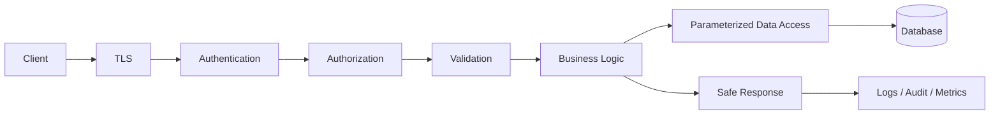
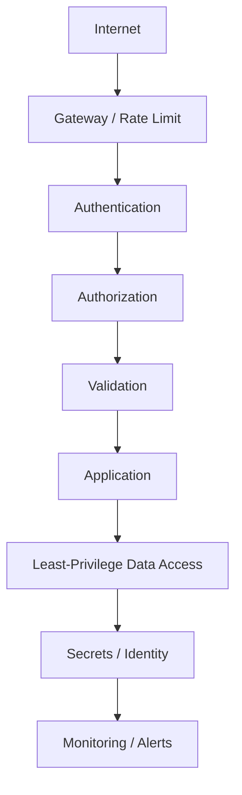
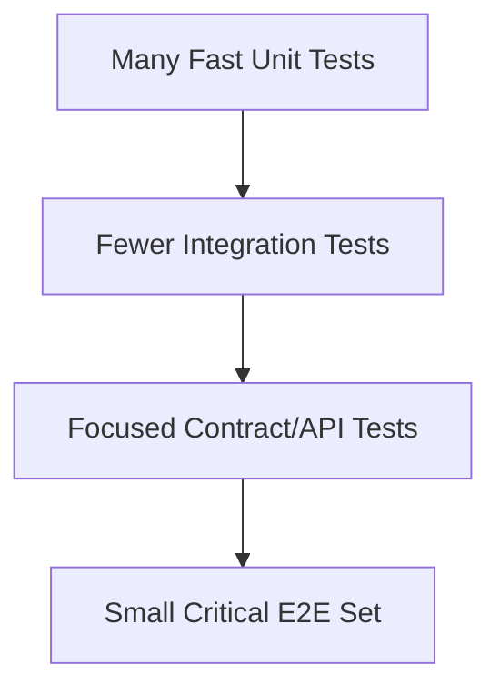
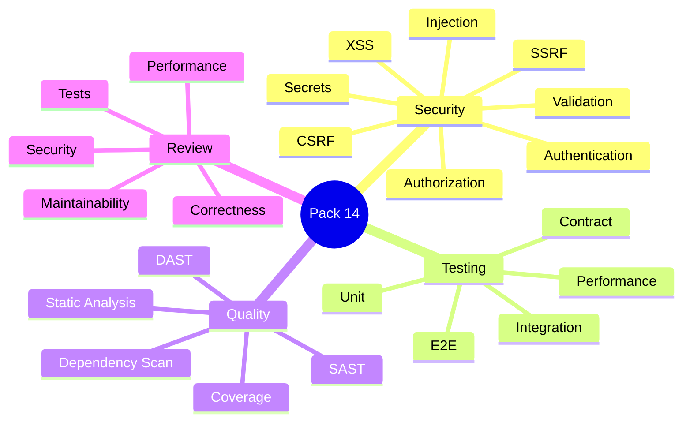
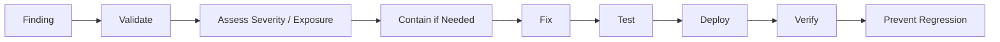
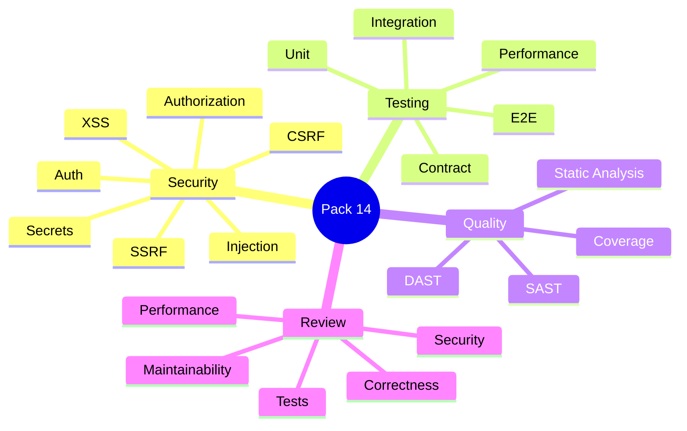
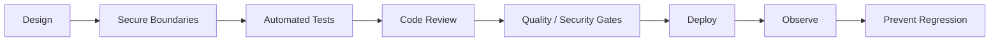

# VRIZE Interview Preparation — Pack 14
## Security + Testing + Code Quality + Code Review

**Target Role:** Senior Fullstack Developer — Round 1  
**Candidate:** Deepak Kumar  
**Priority:** P0 — Must Know  
**Timebox:** 75–90 minutes study + later practice  
**Approach:** KIS + DRY + SOLID | Interview-First | Evidence-First | No Bluff  
**Depth:** L1 Must Know → L2 Follow-Up → L3 Engineering Deep Dive

---

## Readiness Gate

You should be able to:

- Explain authentication vs authorization.
- Explain broken access control and object-level authorization.
- Explain SQL injection, XSS, CSRF, CORS, SSRF, path traversal, and file-upload risks.
- Explain secure password storage and the difference between hashing and encryption.
- Explain JWT risks and safe token-handling principles.
- Explain input validation, output encoding, parameterized queries, TLS, secrets, and least privilege.
- Explain unit, integration, contract, E2E, regression, load, stress, soak, and spike testing.
- Explain mocks, stubs, fakes, and why excessive mocking can be harmful.
- Explain test coverage vs test quality.
- Explain code-review priorities.
- Explain SAST, DAST, dependency scanning, static analysis, and CI quality gates.
- Explain production vulnerability response.
- Connect answers to real résumé evidence only where supported.

---

## 1. Objective

The target Senior Fullstack Developer responsibilities include code reviews, testing, debugging, performance, security, scalability, and engineering best practices.

This pack answers:

> **Can you protect and improve a production system, not just write features?**

The mental flow is:

```text
Threat
→ Boundary
→ Prevention
→ Detection
→ Test
→ Review
→ Release Gate
→ Production Verification
```

---

## 2. Real-Life Analogy

Think of a secure office building:

- Authentication = prove identity at reception.
- Authorization = determine which rooms you may enter.
- Validation = security checks what enters the building.
- Least privilege = only required access is granted.
- Testing = drills before real incidents.
- Code review = another engineer inspects the construction.
- CI security gate = automated inspection before deployment.
- Audit logs = record important activity.

Security is layered control, not one lock.

---

## 3. Visualization







---

## 4. Mind Map



Five anchors:

> **Protect → Verify → Review → Automate → Observe**

---

## 5. Authentication vs Authorization

Authentication answers:

> **Who are you?**

Authorization answers:

> **What may you do?**

### Interview-Ready Answer

> Authentication establishes identity. Authorization decides whether that identity may perform a specific action on a specific resource. A correctly authenticated user can still be unauthorized for an operation.

---

## 6. Broken Access Control

A user is logged in and requests:

```text
GET /orders/123
```

If the server checks only that the user is authenticated but does not verify permission on order 123, data may be exposed.

### Rule

> Server-side authorization must be enforced at the resource/action boundary.

Do not rely on:

- hidden UI buttons,
- disabled controls,
- unpredictable IDs,
- frontend route guards.

---

## 7. Object-Level Authorization

Example:

```text
/users/1001
/users/1002
```

Changing the ID must not expose another user's data.

Correct decision:

```text
authenticated principal
+
requested resource
+
ownership / permission policy
→ allow or deny
```

---

## 8. Input Validation

Treat these as untrusted:

- request body,
- query parameter,
- path parameter,
- headers,
- uploaded file,
- queue/event payload,
- external API response.

Boundary validation includes:

- required values,
- ranges,
- length,
- format,
- enum membership.

Business validation includes:

- account active,
- order cancellable,
- payment amount matches order.

Both matter.

---

## 9. SQL Injection

Unsafe idea:

```java
String sql =
    "SELECT * FROM users WHERE email = '" +
    email +
    "'";
```

Safe principle:

> Use parameterized queries or safe ORM binding.

### Interview-Ready Answer

> SQL injection happens when untrusted input becomes executable SQL syntax. I prevent it primarily with parameterized queries or safe ORM binding and combine that with validation and least-privilege database access.

---

## 10. Injection Beyond SQL

The same general risk applies to:

- OS commands,
- templates,
- NoSQL/query languages,
- LDAP-like query systems.

Rule:

> Do not concatenate untrusted data into executable syntax.

Prefer structured APIs, allowlists, and parameterization.

---

## 11. XSS

Cross-Site Scripting occurs when untrusted content is rendered so that it executes in another user's browser.

Defenses:

- framework-safe rendering,
- context-aware output encoding,
- avoid unsafe raw HTML,
- sanitize rich HTML only when required,
- content-security controls where appropriate.

React normally escapes rendered text, but unsafe raw-HTML APIs can bypass that protection.

---

## 12. CSRF

CSRF causes a browser to perform an unwanted authenticated action when credentials are automatically attached.

Especially relevant to cookie/session authentication.

Possible controls:

- anti-CSRF token,
- SameSite cookie policy,
- origin validation,
- suitable authentication architecture.

---

## 13. CORS

CORS is a browser cross-origin policy mechanism.

It is not:

- authentication,
- authorization,
- API security by itself.

A non-browser client does not depend on browser CORS enforcement.

---

## 14. SSRF

Server-Side Request Forgery occurs when user-controlled input causes the server to access unintended destinations.

Risky feature:

```text
POST /preview-url
{
  "url": "..."
}
```

Possible targets:

- private network,
- localhost,
- cloud metadata endpoints,
- internal services.

Controls:

- allowlist destinations where possible,
- strict URL parsing,
- block internal/private address ranges where appropriate,
- egress controls,
- least privilege.

---

## 15. Path Traversal

Risk:

```text
../../../../sensitive-file
```

Controls:

- avoid directly joining untrusted paths,
- normalize and validate,
- use controlled identifiers,
- isolate storage roots.

---

## 16. File Upload Security

Validate:

- maximum size,
- allowed file types,
- real content where required,
- safe filenames,
- storage location,
- malware scanning when business risk requires it,
- download/access permissions.

Do not trust only the file extension or client-provided content type.

---

## 17. Password Storage

Passwords should not normally be stored as:

```text
plaintext
reversible application encryption
```

Use an adaptive password-hashing algorithm with salt.

Conceptual examples:

- bcrypt,
- scrypt,
- Argon2.

### Hash vs Encryption

Hash:

> one-way verification.

Encryption:

> reversible with a key.

Authentication systems generally need password verification, not password recovery.

---

## 18. Secrets

Secrets include:

- DB password,
- API key,
- signing key,
- private key,
- access token.

Never put secrets in:

- source control,
- frontend bundle,
- Dockerfile/image,
- logs,
- public screenshots.

Use platform/cloud secret management and identity-based access where practical.

---

## 19. Least Privilege

Grant only required access.

Examples:

- application DB account does not need schema-admin rights,
- reporting service can be read-only,
- one workload does not receive every cloud permission.

### Interview-Ready Answer

> Least privilege limits blast radius. I scope database, service, and cloud permissions to the minimum actions required and separate workload identities when practical.

---

## 20. TLS / HTTPS

TLS provides data-in-transit confidentiality, integrity, and server identity through certificates.

HTTPS does not replace:

- authentication,
- authorization,
- validation,
- secure business logic.

---

## 21. JWT Security

Remember:

- bearer tokens must be protected,
- validate signature,
- validate issuer/audience/expiry as appropriate,
- avoid excessive lifetime,
- do not put unnecessary sensitive data in claims,
- signing keys require secure management.

### Trap

> A signed JWT is not automatically encrypted.

---

## 22. Secure Logging

Never log:

- passwords,
- access/refresh tokens,
- secrets,
- private keys,
- sensitive full payloads.

Useful safe context:

- trace ID,
- request ID,
- safe resource ID,
- route,
- error code,
- outcome.

---

## 23. Dependency Security

Third-party libraries are part of the attack surface.

Controls:

- keep dependencies maintained,
- vulnerability scanning,
- lockfiles,
- remove unused libraries,
- trusted repositories,
- review high-risk upgrades.

### Senior Rule

A scanner finding is a signal.

Assess:

```text
severity
+
reachability
+
exposure
+
exploitability
+
fix risk
```

---

## 24. SAST vs DAST

SAST:

> analyzes code/artifacts without requiring the full running system.

Useful for:

- suspicious code patterns,
- selected injection risks,
- insecure APIs.

DAST:

> tests a running application from the outside.

Useful for:

- runtime HTTP exposure,
- configuration,
- externally visible flaws.

They complement each other.

---

## 25. Threat Modeling

Ask:

```text
What are we protecting?
Who can attack?
Where are the trust boundaries?
What can go wrong?
What control reduces the risk?
```

For payment:

- amount tampering,
- duplicate request,
- unauthorized access,
- leaked token,
- auditability.

Threat modeling belongs during design, not only after implementation.

---

## 26. Unit Testing

A unit test checks focused logic with controlled dependencies.

Strengths:

- fast,
- isolated,
- easy diagnosis.

Limitation:

> does not prove the real integration works.

---

## 27. Integration Testing

Tests real interaction between components.

Examples:

- service + database,
- framework + persistence,
- API + repository,
- application + broker.

It catches configuration and integration errors unit tests cannot.

---

## 28. Contract Testing

Verifies producer/consumer agreement.

Examples:

- REST response shape,
- event schema,
- required fields.

Useful in distributed systems where independently deployed services must remain compatible.

---

## 29. End-to-End Testing

Tests a complete journey.

Example:

```text
login
→ create order
→ pay
→ verify confirmation
```

Strength:

> high business confidence.

Costs:

- slower,
- more setup,
- harder failure diagnosis,
- greater flakiness risk.

Keep E2E focused on critical journeys.

---

## 30. Regression Testing

When a bug is fixed, create a test that would have failed before the fix.

That converts an incident into future protection.

---

## 31. Performance Testing

Common forms:

- load,
- stress,
- soak,
- spike.

Load:

> expected traffic.

Stress:

> beyond expected capacity.

Soak:

> sustained load over time.

Spike:

> sudden traffic burst.

---

## 32. Testing Pyramid

Mental model:

```text
many fast focused tests
→ fewer integration tests
→ smaller critical E2E set
```

It is a heuristic, not a law.

The correct mix depends on:

- architecture,
- risk,
- integration surface,
- release frequency,
- UI complexity.

---

## 33. Mock vs Stub vs Fake

Terminology varies by framework, but useful distinctions are:

Stub:

> provides controlled answers.

Mock:

> verifies expected interactions.

Fake:

> simplified working implementation, such as in-memory repository.

### Senior Rule

Excessive mocking can make tests verify implementation details instead of behavior.

---

## 34. Over-Mocking

Brittle test:

```text
verify A called B
verify B called C
verify C called D
```

A harmless refactor breaks everything.

Prefer verifying observable business behavior unless the interaction itself is the requirement.

---

## 35. Test Coverage vs Test Quality

Coverage tells:

> which code was executed during tests.

It does not prove:

- assertions are meaningful,
- edge cases are covered,
- business rules are correct.

### Interview-Ready Answer

> Coverage is a useful signal for untested areas, but I do not treat it as a quality score. I prioritize business rules, boundary conditions, failure paths, security checks, and regression scenarios over maximizing a percentage mechanically.

---

## 36. High-Value Test Targets

Prioritize:

- money-changing operations,
- data-changing operations,
- business invariants,
- authorization,
- validation,
- failure paths,
- concurrency-sensitive logic,
- critical integrations,
- bug regressions.

---

## 37. Deterministic Tests

Avoid uncontrolled:

- wall-clock time,
- real external network,
- random data,
- race-prone shared state,
- environment-specific state.

Control/inject:

- clock,
- IDs/randomness,
- external clients,
- test DB/data.

---

## 38. Flaky Tests

Common causes:

- timing assumptions,
- race conditions,
- shared test state,
- external service,
- incomplete cleanup,
- order dependence.

### Rule

> Do not normalize flaky tests.

Ignored flaky suites eventually stop protecting releases.

---

## 39. Code Review Mindset

A senior review is not:

> “Looks good.”

Use this sequence:

```text
Correctness
→ Security
→ Data Integrity
→ Tests
→ Reliability
→ Performance
→ Maintainability
→ Operations
```

Style should be automated where possible.

---

## 40. Correctness Review

Check:

- requirement satisfied?
- edge cases?
- error paths?
- nullability?
- concurrency?
- state transitions?
- transactional behavior?

---

## 41. Security Review

Check:

- authentication,
- authorization,
- input validation,
- injection,
- secret leakage,
- unsafe logging,
- dependency risk,
- resource-level access control.

---

## 42. Performance Review

Check:

- N+1,
- repeated remote calls,
- unbounded loop,
- unbounded concurrency,
- large in-memory loading,
- inefficient serialization,
- missing pagination,
- unnecessary database work.

---

## 43. Operational Review

Check:

- logs,
- trace/correlation ID,
- metrics,
- feature flags if needed,
- migration compatibility,
- rollback impact,
- alerting implications.

---

## 44. Review Tone

Good:

> This endpoint verifies authentication, but I do not see resource-level authorization for `orderId`. Could we verify ownership or permission before returning the order?

Avoid:

> Wrong.

Senior review should protect the system and help the engineer.

---

## 45. DRY vs Over-Abstraction

DRY means:

> avoid duplicated knowledge and logic.

It does not mean:

> every two similar lines require a generic framework.

Sometimes small duplication is safer than a premature abstraction.

---

## 46. KIS

Keep It Simple.

Prefer:

- explicit flow,
- clear names,
- focused methods,
- understandable conditions.

Avoid cleverness that saves lines but increases cognitive load.

---

## 47. SOLID in Review

Use SOLID as reasoning tools.

Ask:

- Does this component have too many responsibilities?
- Are dependencies explicit?
- Is the abstraction stable?
- Does one change force unrelated changes?
- Can behavior be tested without constructing the world?

Do not reject code merely by naming a SOLID letter.

---

## 48. Static Analysis

Automation can catch:

- formatting,
- common bugs,
- nullability issues,
- style,
- selected security smells.

Human review should focus more on:

- intent,
- business rules,
- architecture,
- production risk,
- security context.

---

## 49. CI Quality Gates

A practical pipeline may include:

```text
build
→ unit tests
→ integration tests
→ static analysis
→ dependency scan
→ security scan
→ package
→ deploy
→ smoke/health verification
```

Do not let low-confidence noise block delivery indefinitely.

Use severity and risk-based policy.

---

## 50. Vulnerability Response



### Interview-Ready Answer

> I first validate the vulnerability and whether the affected path is reachable and exposed. For serious issues I contain risk if needed, implement the smallest safe fix, add regression/security tests, deploy through the controlled path, verify the issue is closed, and improve preventive controls when the pattern could recur.

---

## 51. Production Bug Workflow

Use:

```text
Observe
→ Reproduce
→ Evidence
→ Root Cause
→ Small Fix
→ Test
→ Deploy
→ Verify
→ Regression Prevention
```

Avoid random production changes.

---

## 52. Project Mapping

The résumé available to the panel supports:

- vulnerability remediation,
- code reviews,
- automated testing,
- test-coverage improvement,
- production defect handling,
- security/performance discussions,
- CI/CD,
- production support.

### Safe Positioning

> Security, testing, and code review have been recurring parts of my senior engineering work. In Bechtel-era work I was involved in vulnerability remediation, code reviews, testing improvements, production defect handling, and technical design discussions. I treat security and quality as part of normal delivery.

### Evidence Boundary

Before quoting:

```text
60% → 90% coverage
40% fewer production defects
120+ code reviews per month
95% high-priority defects within 24 hours
```

personally validate:

- scope,
- timeframe,
- measurement method,
- team vs individual ownership,
- your contribution.

---

## 53. Candidate Validation

| Topic | Real Project / Evidence |
|---|---|
| Vulnerability remediation | __________________ |
| Authorization defect | __________________ |
| SAST/security finding | __________________ |
| Test coverage improvement | __________________ |
| Regression test | __________________ |
| Integration testing | __________________ |
| Code review example | __________________ |
| Performance issue in PR | __________________ |
| Security issue in PR | __________________ |
| Production RCA | __________________ |

---

## 54. Interview-Ready Answers

### Q1. How do you secure a REST API?

> I use layered controls: TLS, authentication, server-side authorization, strict input validation, parameterized data access, safe secret management, least-privilege identities, rate limiting where appropriate, safe error responses, dependency management, and observability. I also test negative authorization paths because many serious API vulnerabilities are business-logic access-control failures.

### Q2. Authentication vs authorization?

> Authentication establishes identity. Authorization decides whether that identity may perform a specific action on a specific resource.

### Q3. Prevent SQL injection?

> Use parameterized queries or safe ORM binding, not string concatenation. Combine this with validation and least-privilege database access.

### Q4. What is XSS?

> XSS occurs when attacker-controlled content is rendered in a way that executes script in another user's browser. I rely on safe framework rendering, context-aware encoding, and avoid unsafe raw HTML.

### Q5. CORS vs CSRF?

> CORS controls permitted cross-origin browser requests. CSRF is an attack that causes a browser to perform an unwanted authenticated action, especially when credentials are attached automatically.

### Q6. Password storage?

> Use a strong adaptive salted password hash. Passwords need verification, not reversible recovery, so plaintext or ordinary reversible encryption is inappropriate.

### Q7. Unit vs integration test?

> Unit tests validate focused logic quickly with controlled dependencies. Integration tests validate real collaboration between components such as service, database, framework, or external boundary.

### Q8. Testing strategy?

> I emphasize fast tests around business rules and failures, focused integration tests around data/API boundaries, contract tests where independently deployed services interact, and a smaller E2E suite for critical journeys. The mix follows risk rather than a rigid percentage.

### Q9. Is 90% coverage good?

> It is useful only with context. I want to know whether important behavior, failures, security boundaries, and regressions are tested. High coverage with weak assertions can still provide false confidence.

### Q10. What do you review in a PR?

> Correctness, security, data integrity, tests, reliability, performance, maintainability, and operational impact. I automate style wherever practical.

### Q11. How do you handle a vulnerability in production?

> Validate, assess exposure and severity, contain if needed, implement the smallest safe fix, add regression/security tests, deploy through a controlled path, verify closure, and improve preventive controls.

### Q12. DRY vs KIS?

> DRY avoids duplicated knowledge; KIS protects simplicity. I do not remove small duplication by creating an abstraction that is harder to understand than the duplication itself.

### Q13. SAST vs DAST?

> SAST analyzes code/artifacts for risky patterns. DAST evaluates the behavior of a running application from the outside. They complement one another.

### Q14. How do you reduce flaky tests?

> Remove uncontrolled timing, external dependencies, shared state, race conditions, and order assumptions. Use deterministic clocks/test data, reliable cleanup, and controlled async execution.

### Q15. What makes a good senior code review?

> A good review identifies production risk while helping the author improve the change. I explain the concern, distinguish blockers from suggestions, and focus on behavior and risk rather than personal preference.

---

## 55. Likely Follow-Ups

### Security

- OAuth2 vs JWT?
- Access vs refresh token?
- RBAC vs ABAC?
- SameSite cookies?
- CSP?
- SSRF?
- File upload?
- Secret rotation?
- Dependency vulnerabilities?

### Testing

- Mock vs stub vs fake?
- Contract testing?
- Testcontainers?
- Load vs stress vs soak?
- Mutation testing?
- Snapshot testing?
- Test-data isolation?

### Review

- What blocks approval?
- How large should a PR be?
- How handle disagreement?
- How review DB migration?
- How review concurrent code?
- Which checks belong in CI?

---

## 56. Common Interview Traps

1. “JWT means secure authentication.”
2. “CORS protects my API.”
3. “Hidden button means protected action.”
4. “Validation alone prevents SQL injection.”
5. “HTTPS makes the API secure.”
6. “100% coverage means no bugs.”
7. “Every dependency should be mocked.”
8. “More E2E tests always mean better quality.”
9. “Code review is style checking.”
10. “Every scanner finding must block release.”

---

## 57. Interviewer Intent

| Question | What is really being tested |
|---|---|
| Auth vs authorization | Security fundamentals |
| Broken access control | API maturity |
| SQL injection | Secure coding |
| XSS | Frontend security |
| CORS/CSRF | Web-security precision |
| Password storage | Security fundamentals |
| Testing strategy | Engineering quality |
| Coverage | Judgment |
| Mocks | Testing maturity |
| Code review | Senior ownership |
| SAST/DAST | Pipeline awareness |
| Vulnerability response | Production leadership |

---

## 58. Practical / Mini Mock Content

This section is for later practice only.

### Level 1

1. Authentication vs authorization.
2. Secure REST API.
3. SQL injection.
4. XSS.
5. CSRF.
6. CORS.
7. Password hashing.
8. Least privilege.
9. Unit vs integration.
10. Contract testing.
11. E2E testing.
12. Coverage vs quality.
13. Code-review checklist.
14. SAST vs DAST.
15. Vulnerability response.

### Level 2

16. Object-level authorization.
17. SSRF.
18. File-upload security.
19. JWT risks.
20. Secret rotation.
21. Mock vs stub vs fake.
22. Flaky tests.
23. Testing authorization.
24. Reviewing DB migration.
25. Reviewing async/concurrent code.
26. CI quality gates.

### Level 3

27. Threat-model a payment API.
28. Review an insecure order endpoint.
29. Design multi-tenant authorization.
30. Design security testing in CI/CD.
31. Respond to a critical dependency vulnerability.
32. Design secure file upload.
33. Improve a flaky test suite.
34. Defend coverage improvement.
35. Explain defect-reduction measurement.
36. Handle code-review disagreement.

---

## 59. Quick Revision



---

## 60. 90-Second Rapid Revision

```text
AUTHENTICATION
who are you?

AUTHORIZATION
what may you do?

BROKEN ACCESS CONTROL
authenticated != authorized

SQL INJECTION
parameterized queries

XSS
untrusted browser content executes

CSRF
unwanted authenticated browser action

CORS
browser cross-origin policy

SSRF
server makes unintended request

PASSWORD
adaptive salted hash

SECRET
never source/image/log

LEAST PRIVILEGE
minimum required access

UNIT
focused logic

INTEGRATION
components together

CONTRACT
producer/consumer agreement

E2E
critical journey

COVERAGE
signal, not quality guarantee

CODE REVIEW
correctness -> security -> tests -> reliability -> performance -> maintainability

SAST
static analysis

DAST
running-system testing

VULNERABILITY
validate -> assess -> contain -> fix -> test -> deploy -> verify
```

---

## 61. Candidate Answer Mapping

| Area | Safe Claim | Evidence / Mapping | Risk |
|---|---|---|---|
| Vulnerability remediation | Supported | Bechtel résumé | Low |
| Code reviews | Strongly supported | Bechtel résumé | Low |
| Automated testing | Supported | Résumé | Low |
| Security/performance review | Supported | Résumé | Low |
| Coverage improvement | Validate metric | __________________ | Medium |
| Defect reduction | Validate metric | __________________ | Medium |
| Specific exploit found | Validate real incident | __________________ | Medium |
| DAST ownership | Validate | __________________ | Medium |
| Security architecture ownership | Validate scope | __________________ | Medium |

---

## 62. Final Visualization



---

## Golden Rules

> **Authentication is not authorization.**

> **Never trust client-side access control.**

> **Validate input, parameterize executable queries, and encode output for its context.**

> **Coverage is a signal; behavior and failure-path confidence matter more.**

> **Human review should focus on production risk that automation cannot understand well.**

> **A vulnerability fix is incomplete until verified and protected against regression.**

> **Do not quote quality metrics unless you can explain the measurement and your contribution.**

For a senior engineer:

> **Protect → Test → Review → Automate → Verify → Learn**
