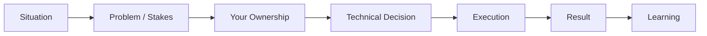
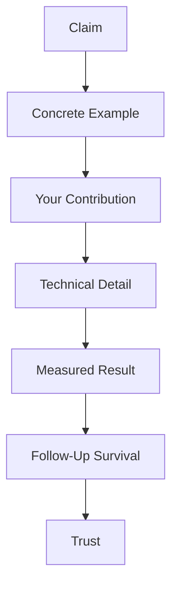
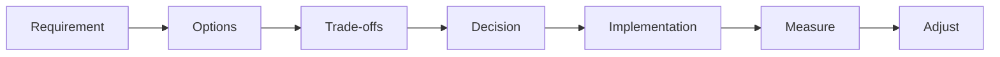
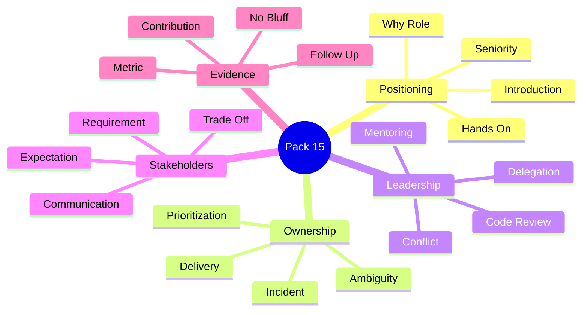
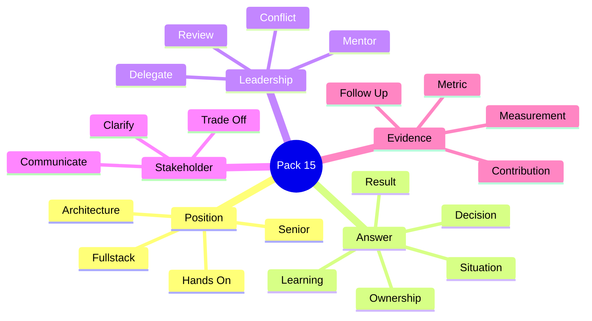
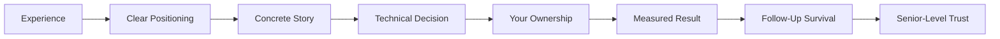

# VRIZE Interview Preparation — Pack 15
## Leadership + Behavioral + Stakeholder Management + Senior Ownership

**Target Role:** Senior Fullstack Developer — Round 1  
**Candidate:** Deepak Kumar  
**Priority:** P0 — Senior-Level Must Know  
**Timebox:** 70–85 minutes study + later mock practice  
**Approach:** KIS + DRY + Evidence-First | Interview-First | No Bluff  
**Depth:** L1 Must Know → L2 Follow-Up → L3 Senior Ownership

---

## Readiness Gate

You should be able to:

- Give a confident 60–90 second senior-level introduction.
- Explain why you still fit a hands-on Senior Fullstack Developer role despite architecture/leadership experience.
- Explain your career progression without sounding overqualified or disconnected from coding.
- Answer “Tell me about a difficult technical problem.”
- Answer “Tell me about a production incident.”
- Answer “Tell me about a disagreement with another engineer.”
- Answer “Tell me about a stakeholder conflict.”
- Explain mentoring and code-review philosophy.
- Explain how you prioritize competing tasks.
- Explain how you handle ambiguous requirements.
- Explain a failure or mistake and what changed afterward.
- Explain how you make technical decisions using trade-offs.
- Explain how you balance delivery speed with quality.
- Explain why VRIZE and why this role.
- Defend résumé metrics only when you can explain how they were measured.
- Survive at least two follow-up questions without inventing details.

---

## 1. Objective

For a senior candidate, behavioral questions are technical questions in disguise.

The interviewer is checking:

```text
Ownership
→ Judgment
→ Communication
→ Leadership
→ Technical Depth
→ Conflict Handling
→ Delivery
→ Evidence
```

A weak answer says:

> “We had a problem, I coordinated with the team, and we solved it.”

A senior answer explains:

```text
What happened?
Why did it matter?
What did YOU own?
What technical decision did you make?
What trade-off did you accept?
What was the result?
What did you learn?
```

---

## 2. Real-Life Analogy

Think of a senior engineer as the captain of a ship who still understands the engine room.

A captain must:

- understand destination,
- communicate with stakeholders,
- prioritize risk,
- coordinate people,
- make decisions under pressure.

But when something critical happens, the captain must also understand:

- which system failed,
- what evidence exists,
- what safe action to take,
- how to recover.

That is the positioning for this interview:

> **Senior engineer with architecture and leadership maturity who remains technically hands-on.**

---

## 3. Visualization

### 3.1 Senior Behavioral Answer Flow



### 3.2 Interviewer Trust Model



### 3.3 Decision Model



---

## 4. Mind Map



Five anchors:

> **Own → Decide → Communicate → Deliver → Prove**

---

## 5. Core Answer Framework — STAR+

Use:

```text
S — Situation
T — Task
A — Action
R — Result
+ — Technical decision / learning / trade-off
```

### Why the “+” Matters

Senior interviews often fail when the answer sounds like generic project management.

Add:

- architecture decision,
- debugging approach,
- trade-off,
- measurement,
- lesson.

---

## 6. PCDIR Framework

For technical stories:

```text
P — Problem
C — Context
D — Decision
I — Implementation
R — Result
```

This is especially useful for:

- performance,
- architecture,
- security,
- production incidents.

---

## 7. S.T.A.R.C.H. Framework

Use for deeper senior answers:

```text
S — Story
T — Technology
A — Architecture
R — Reality / Constraints
C — Coding / Contribution
H — Human Leadership
```

This helps you avoid answers that are only managerial or only technical.

---

## 8. Candidate Positioning

Your strongest positioning is:

> **A senior full-stack engineer whose hands-on engineering experience expanded into architecture, technical leadership, code review, mentoring, performance, security, and production ownership.**

Do not position yourself as:

> “I am mainly an architect now.”

That can create a role-fit concern for a Senior Fullstack Developer interview.

---

## 9. 60–90 Second Introduction

### Interview-Ready Version

> I’m a senior full-stack and solution engineering professional with broad experience across backend, frontend, mobile, cloud, and distributed systems. My recent work has been strongly hands-on with Node.js, TypeScript, React, MongoDB, Azure, Docker, Kubernetes, APIs, performance, security, and production support, while my earlier background also includes Java, Kotlin, and Android. Over time my role expanded into architecture, code reviews, mentoring, stakeholder discussions, and delivery ownership, but I have remained close to implementation and troubleshooting. What interests me in this role is the combination of strong engineering depth, full-stack ownership, and the opportunity to contribute at senior level while still being hands-on.

---

## 10. “Are You Overqualified?”

This question may not be asked directly.

It may appear as:

- “Why Senior Developer?”
- “You have architect experience. Why this role?”
- “Will you be comfortable coding?”
- “Are you looking for management?”

### Strong Answer

> My seniority has expanded my scope, but it has not moved me away from engineering. I still enjoy hands-on design, coding, debugging, performance work, reviews, and production problem-solving. I see a senior full-stack role as a strong fit because I can contribute directly in implementation while also bringing architecture and mentoring maturity when the team needs it.

---

## 11. “Are You Still Hands-On?”

### Strong Answer

> Yes. My recent work has included hands-on backend and full-stack engineering with Node.js, TypeScript, React, APIs, MongoDB, Azure, Docker/Kubernetes, performance tuning, security remediation, CI/CD, and production troubleshooting. My architecture responsibilities grew around that engineering work rather than replacing it.

### Follow-Up Risk

Be ready for:

- last code you wrote,
- last API you changed,
- last bug you debugged,
- last performance issue,
- last code review,
- last deployment issue.

Use only real examples.

---

## 12. Why VRIZE?

Keep this concise and role-focused.

### Interview-Ready Answer

> The role aligns well with the combination I bring: senior full-stack engineering, Java/Kotlin background, React and Node.js experience, API and database work, and architecture-level thinking. I also like that VRIZE works across digital platforms, customer experience, data/AI, quality engineering, and enterprise transformation, because that environment values engineers who can think beyond one isolated layer.

Do not oversell company knowledge beyond what has been verified.

---

## 13. Why This Role?

> I want a role where seniority means stronger engineering ownership rather than moving away from technology. This position combines backend, frontend, APIs, databases, mobile-related technologies, and architecture decisions, which fits both my recent full-stack experience and my earlier Java/Kotlin background.

---

## 14. Why Should We Hire You?

### Strong Structure

```text
Depth
+
Breadth
+
Production ownership
+
Leadership
+
Hands-on capability
```

### Interview-Ready Answer

> I bring a combination of hands-on full-stack depth and senior engineering judgment. I can work across API design, backend implementation, React/TypeScript, databases, cloud, containers, performance, security, testing, and production troubleshooting. At the same time, I can contribute through code reviews, mentoring, architecture discussions, and stakeholder communication. That lets me solve the immediate engineering problem while also improving how the team delivers.

---

## 15. Strengths

Choose strengths that the résumé can support.

Strong options:

- problem decomposition,
- production troubleshooting,
- architecture + implementation bridge,
- code review,
- mentoring,
- performance optimization,
- stakeholder translation,
- broad stack adaptability.

### Interview-Ready Answer

> One of my strongest areas is connecting architecture decisions to implementation reality. I’m comfortable discussing the system-level design, but I also go down into API behavior, data access, code quality, performance, deployment, and production diagnostics. That helps me make decisions that are practical rather than only diagram-level.

---

## 16. Weakness

Avoid fake strengths such as:

> “I work too hard.”

Choose something real but controlled.

### Safe Example

> Because I have worked across many technologies, there are times when I initially go too deep into solution options before enough constraints are clear. I’ve become more disciplined about clarifying the business priority, scale, and decision criteria first, then going deep only where it affects the outcome.

This weakness demonstrates improvement without undermining the role.

---

## 17. Difficult Technical Problem

Use PCDIR:

```text
Problem
→ Context
→ Decision
→ Implementation
→ Result
```

Possible real categories from your background:

- latency,
- production defects,
- integration issue,
- security vulnerability,
- distributed workflow,
- release pipeline.

### Safe Answer Skeleton

> We had a production issue where [real symptom]. My responsibility was [your ownership]. I first gathered evidence from [real logs/metrics/tools], rather than changing code immediately. The main issue was [real root cause]. I chose [real fix] because [trade-off]. After deployment we measured [real result]. The main lesson was [technical learning].

Do not fill placeholders with invented details.

---

## 18. Production Incident

A senior answer should include:

```text
Containment
→ Evidence
→ Root Cause
→ Fix
→ Verification
→ Prevention
```

### Interview-Ready Structure

> My first priority is protecting users and stabilizing the system. If a safe rollback or feature disable is available, I use that before doing extended live debugging. Then I use logs, metrics, traces, deployment changes, and dependency behavior to isolate the cause. After the fix, I verify the same production signal and add a regression or operational control so the issue is less likely to repeat.

---

## 19. Performance Improvement Story

Your résumé contains performance metrics.

Use only if you can explain:

- baseline,
- metric,
- workload,
- bottleneck,
- change,
- result.

### Strong Flow

```text
Observed latency
→ Measured bottleneck
→ Changed one layer
→ Compared same workload
→ Confirmed improvement
```

### Follow-Ups

Expect:

- p95 or average?
- how measured?
- before/after?
- traffic level?
- what did you personally change?
- why that solution?
- trade-off?

---

## 20. Security Vulnerability Story

Use:

```text
Finding
→ Validate
→ Exposure
→ Contain
→ Fix
→ Test
→ Deploy
→ Verify
```

Avoid saying:

> “I fixed OWASP vulnerabilities.”

without a concrete example you can defend.

---

## 21. Failure / Mistake

A good failure answer is not a disaster story.

It should show:

- ownership,
- learning,
- changed behavior.

### Framework

```text
Decision
→ What went wrong
→ What I owned
→ How I corrected it
→ What process/design changed
```

### Safe Example Pattern

> In one situation I moved too quickly toward a technical solution before all stakeholder constraints were explicit. The implementation was technically sound but created avoidable rework when a requirement changed. I owned that gap and changed my approach: for high-impact features I now confirm acceptance criteria, non-functional constraints, and decision assumptions before implementation begins.

Use only if it feels true to your experience.

---

## 22. Disagreement with Engineer

Do not say:

> “I convinced them.”

Use:

```text
Understand concern
→ Agree on decision criteria
→ Compare options
→ Use evidence
→ Decide
→ Commit as team
```

### Interview-Ready Answer

> I try to move a disagreement away from personal preference and toward decision criteria: correctness, maintainability, performance, delivery risk, and operational cost. If both options are viable, I prefer a small experiment or measurable evidence. Once the team decides, I support the decision even if my original option was not selected.

---

## 23. Conflict with Stakeholder

Stakeholder may prioritize:

```text
speed
```

Engineering may prioritize:

```text
quality / security / maintainability
```

Senior job:

> make trade-offs explicit.

### Strong Answer

> I first understand the business outcome and deadline rather than responding only from the technical side. Then I explain the risk in business terms and offer options—for example a smaller safe scope now versus a broader change later. That usually turns the discussion from “engineering says no” into a decision about cost, risk, and value.

---

## 24. Ambiguous Requirement

Use:

```text
clarify outcome
→ identify unknowns
→ define assumptions
→ prototype / spike if needed
→ confirm acceptance criteria
```

### Interview-Ready Answer

> I do not hide ambiguity inside implementation. I identify what affects architecture or acceptance, write down assumptions, confirm high-risk points with the stakeholder, and use a small technical spike where uncertainty is technical rather than business-related.

---

## 25. Prioritization

When everything is urgent:

Rank by:

```text
Production/User Impact
→ Security/Data Integrity
→ Dependency / Blocking Impact
→ Business Deadline
→ Effort / Reversibility
```

### Strong Answer

> I prioritize production impact, security and data integrity first, then work that blocks other teams or critical business commitments. I make the trade-off visible so stakeholders understand what is being delayed and why.

---

## 26. Delivery vs Quality

Wrong:

> “Quality should never be compromised.”

Real systems have deadlines.

Better:

> separate essential quality from optional perfection.

### Non-Negotiable

- correctness,
- security,
- data integrity,
- minimum test confidence,
- recoverability.

### Negotiable

- optional refactoring,
- low-value abstraction,
- non-critical polish.

---

## 27. Mentoring

Senior mentoring is not:

> giving juniors the answer.

Use:

```text
Context
→ Ask reasoning
→ Guide
→ Review
→ Feedback
→ Increasing ownership
```

### Interview-Ready Answer

> I mentor by making the engineer explain their reasoning first. I then guide them on trade-offs, code structure, testing, and production impact rather than rewriting the solution myself. The goal is that the next similar problem requires less help.

---

## 28. Code Review Leadership

Your résumé strongly supports code-review experience.

### Senior Review Priorities

```text
Correctness
→ Security
→ Data Integrity
→ Tests
→ Reliability
→ Performance
→ Maintainability
→ Style
```

### Interview-Ready Answer

> I treat code review as risk management and knowledge sharing. I focus first on correctness, security, tests, reliability, performance, and maintainability. Style should mostly be automated. I also explain why a change is needed so the review improves future engineering decisions rather than only fixing the current PR.

---

## 29. Delegation

Delegation is not:

> “I was too busy, so I assigned it.”

Good delegation includes:

- clear outcome,
- context,
- ownership,
- decision boundaries,
- checkpoints proportional to risk.

### Senior Insight

Delegate ownership, not just tasks.

---

## 30. Technical Decision-Making

Use:

```text
Requirement
→ Constraints
→ Options
→ Trade-offs
→ Decision
→ Measurement
```

### Example Decision Criteria

- complexity,
- delivery speed,
- scalability,
- security,
- operability,
- team skill,
- cost,
- reversibility.

---

## 31. Build vs Buy

Interviewers may ask:

> “Would you build this internally?”

Evaluate:

- differentiation,
- time-to-market,
- operational ownership,
- security/compliance,
- integration,
- cost,
- lock-in.

Senior answer:

> default to solving business problem, not proving engineering capability.

---

## 32. Reversible vs Irreversible Decisions

Some decisions are easy to change:

```text
library wrapper
internal API detail
```

Some are expensive:

```text
public contract
data model
database choice
cross-team protocol
```

Spend more analysis on expensive-to-reverse decisions.

This is strong architecture maturity.

---

## 33. Working with Product / Business

Translate:

```text
technical constraint
```

into:

```text
user impact
delivery risk
cost
time
```

Example:

Instead of:

> “The database needs refactoring.”

Say:

> “At the current growth rate this query will increase checkout latency. We can make a targeted index/query change now, then redesign the broader reporting model separately.”

---

## 34. Handling Pressure

Senior behavior:

```text
stabilize
→ communicate
→ evidence
→ decide
→ update
```

Avoid:

- silent heroics,
- random fixes,
- blaming another team.

---

## 35. Saying “I Don’t Know”

A senior candidate does not need to know everything.

Good answer:

> I haven’t used that specific technology in production. I understand the underlying concept, and I would approach it by comparing its execution model, operational requirements, and integration constraints with technologies I have used.

This is stronger than bluffing.

---

## 36. Technology Gap

If asked about:

- KMP production,
- Laravel/PHP,
- a specific Spring feature,
- Kafka implementation,

where production experience is not confirmed:

Use:

```text
Acknowledge
→ Explain adjacent knowledge
→ Explain concept
→ Show learning ability
```

### Example

> I have not delivered a production KMP application, so I would not claim that experience. My background is strong in Kotlin/Android and cross-platform/full-stack architecture, and I understand KMP's shared-code model, platform source sets, and trade-offs. I would be comfortable ramping from that foundation.

---

## 37. “Why Did You Leave?”

Keep it:

- neutral,
- future-focused,
- short.

Avoid:

- criticism,
- emotional detail,
- confidential information.

### Safe Structure

> I reached a point where I wanted broader engineering and architecture ownership and the flexibility to work across consulting and product opportunities. I’m now looking for the right long-term role where I can combine hands-on full-stack work with senior technical ownership.

Use only if accurate.

---

## 38. Compensation / Seniority Question

If asked why your expected compensation is high:

Focus on value:

- experience,
- engineering breadth,
- architecture,
- production ownership,
- mentoring,
- speed to impact.

Do not turn technical interview into compensation negotiation unless interviewer asks.

---

## 39. Resume Metrics — Evidence Rule

For every metric:

```text
Metric
→ Baseline
→ Change
→ Measurement Method
→ Timeframe
→ Your Contribution
```

If you cannot explain all of those:

> avoid leading with the number.

---

## 40. Metric Defense — 99.9% Availability

Be prepared for:

- What system?
- What period?
- What counts as downtime?
- How monitored?
- Was it SLA, SLO, or observed availability?
- What did you change?

Never invent an answer.

---

## 41. Metric Defense — 30% Latency Reduction

Be prepared for:

- endpoint/workload?
- average or percentile?
- baseline?
- measurement tool?
- caching/query/async contribution?
- same traffic conditions?
- how did you isolate improvement?

---

## 42. Metric Defense — 60% Faster Release

Be prepared for:

- before frequency/time?
- after?
- what pipeline change?
- CI/CD?
- automation?
- environment setup?
- team metric or personal metric?

---

## 43. Metric Defense — 60% → 90% Coverage

Be prepared for:

- line/branch coverage?
- tool?
- module/team scope?
- why did it matter?
- did defects improve?
- did test time increase?

Coverage is not the result by itself.

---

## 44. “Tell Me About Bechtel”

Safe summary based on résumé evidence:

> At Bechtel I worked as a senior software specialist on enterprise applications using Node.js, TypeScript, React, MongoDB, Azure, and related engineering practices. My responsibilities included implementation, design discussions, code reviews, testing, security/performance work, production defect handling, stakeholder requirements, and mentoring.

Do not add Spring Boot to Bechtel unless personally verified.

---

## 45. “Tell Me About Your Current Consulting”

Safe summary:

> My consulting work has involved AI/cloud/backend/full-stack engagements where I contribute architecture blueprints, backend and integration design, performance, containerized deployment, CI/CD, and observability. Because the engagements vary, I keep examples specific to the actual project being discussed rather than presenting every technology as if it were used in every engagement.

---

## 46. Career Progression

Use:

```text
Developer
→ Senior Engineer
→ Technical Ownership
→ Architecture
→ Mentoring / Stakeholder Ownership
```

### Interview-Ready Answer

> My career progression has been additive rather than a move away from engineering. I started with implementation-heavy roles, then took ownership of architecture, quality, production, mentoring, and stakeholder communication as my scope increased. I still see hands-on engineering as the foundation of my seniority.

---

## 47. Leadership Without Formal Authority

You can lead through:

- design clarity,
- review quality,
- mentoring,
- evidence,
- incident ownership,
- documentation,
- facilitation.

### Interview-Ready Answer

> I do not depend on title to lead technical work. If I can clarify a problem, make trade-offs visible, help another engineer improve a solution, or drive an incident to resolution, that is technical leadership.

---

## 48. Handling Underperformance

If asked about someone struggling:

```text
clarify expectation
→ understand cause
→ provide support
→ define short checkpoints
→ give direct feedback
→ escalate only when needed
```

Avoid:

> “I would just replace them.”

---

## 49. Handling a Missed Deadline

Strong flow:

```text
Identify cause
→ Communicate early
→ Re-scope
→ Protect critical path
→ Learn
```

Do not hide schedule risk until final day.

---

## 50. Stakeholder Requirement Change

When requirements change late:

Ask:

- reason,
- urgency,
- impact,
- compatibility,
- release risk.

Then offer options:

```text
Option A: smaller safe change now
Option B: full redesign later
```

This demonstrates senior judgment.

---

## 51. Architecture Disagreement

Example answer structure:

> We had two technically valid approaches. Instead of debating preference, I aligned the team on decision criteria—delivery time, operational complexity, expected load, and maintainability. We compared the options against those constraints, selected the lower-risk approach, and documented what condition would justify revisiting it.

No invented project details required.

---

## 52. Incident Communication

During incident:

Communicate:

- user impact,
- current status,
- containment,
- next checkpoint.

Avoid sending speculative root cause as fact.

### Senior Rule

> Separate what we know from what we suspect.

---

## 53. Post-Incident Review

A good review asks:

- what happened?
- why did controls not catch it?
- how was detection?
- how was response?
- what preventive action is worth doing?

Avoid blame.

Focus on system/process improvement.

---

## 54. “What Would Your Team Say About You?”

Safe answer:

> They would probably say I am structured in problem-solving, strong in reviews and troubleshooting, and willing to go deep when a production or design issue needs it. They would also say I expect technical reasoning rather than just accepting a solution because it works locally.

---

## 55. “What Are You Looking For?”

> I’m looking for a senior engineering role with meaningful hands-on ownership, challenging backend/full-stack problems, and enough scope to contribute architecture and mentoring without moving away from implementation.

---

## 56. Project Mapping

The résumé supports strong evidence for:

- code review,
- mentoring,
- stakeholder requirements,
- multiple project delivery,
- architecture,
- production support,
- security/performance work,
- quality improvement,
- technical leadership.

### Strong Safe Stories to Prepare

1. **Performance improvement**
2. **Production defect**
3. **Security remediation**
4. **Code review / design correction**
5. **Stakeholder requirement**
6. **Mentoring**
7. **Delivery under pressure**
8. **Architecture decision**

Do not invent missing details.

---

## 57. Candidate Story Bank

Fill these before live mock practice.

| Story | Situation | Your Action | Result | Follow-Up Risk |
|---|---|---|---|---|
| Performance | __________ | __________ | __________ | High |
| Security | __________ | __________ | __________ | High |
| Production Incident | __________ | __________ | __________ | High |
| Stakeholder Conflict | __________ | __________ | __________ | Medium |
| Engineer Disagreement | __________ | __________ | __________ | Medium |
| Mentoring | __________ | __________ | __________ | Low |
| Missed/At-Risk Delivery | __________ | __________ | __________ | Medium |
| Architecture Decision | __________ | __________ | __________ | High |
| Failure / Learning | __________ | __________ | __________ | Medium |

---

## 58. Interview-Ready Answers

### Q1. Tell me about yourself.

> I’m a senior full-stack and solution engineering professional with experience across backend, frontend, mobile, cloud, and distributed systems. My recent hands-on work has been strong in Node.js, TypeScript, React, MongoDB, Azure, Docker/Kubernetes, APIs, performance, security, and production support, while my earlier background includes Java, Kotlin, and Android. As my scope grew, I also took ownership of architecture, code reviews, mentoring, stakeholder discussions, and delivery. I’m now looking for a senior role where I can combine direct engineering contribution with that broader technical ownership.

### Q2. Why a Senior Developer role after architecture work?

> My architecture experience grew from hands-on engineering and I have not wanted to move away from implementation. I enjoy coding, design, troubleshooting, performance, reviews, and production work. A senior developer role gives me that direct engineering ownership while still letting me contribute architecture and mentoring when useful.

### Q3. How do you handle conflict?

> I move the discussion from personal preference to decision criteria such as correctness, maintainability, performance, delivery risk, and operational cost. If evidence can resolve the disagreement, I prefer a small experiment. Once the team decides, I support the decision.

### Q4. How do you handle ambiguous requirements?

> I identify the assumptions that can affect architecture or acceptance, clarify those with the stakeholder, and use a technical spike where uncertainty is technical rather than business-related. I avoid silently embedding assumptions in code.

### Q5. How do you prioritize?

> Production impact, security and data integrity come first, then blocking dependencies and critical business commitments. I make the trade-off visible so stakeholders know what is delayed and why.

### Q6. How do you mentor?

> I first ask the engineer to explain their reasoning. Then I guide them through trade-offs, code quality, testing, and production impact rather than rewriting the solution. The goal is increasing independent ownership.

### Q7. How do you balance speed and quality?

> I protect non-negotiables such as correctness, security, data integrity, minimum test confidence, and rollback safety. Under deadline pressure I reduce scope or defer low-value refactoring rather than sacrificing those controls.

### Q8. Tell me about a failure.

> I focus on a real decision where my approach created avoidable rework or risk, explain what I owned, how I corrected it, and what behavior changed afterward. I avoid presenting a disguised strength as a failure.

### Q9. How do you make architecture decisions?

> I start with requirements and constraints, compare a small number of viable options, make the trade-offs explicit, choose the simplest option that meets the need, and define how we will know if the decision is working.

### Q10. What do you do when you do not know a technology?

> I say so clearly. Then I map it to concepts I do know, identify the gap, and explain how I would validate or learn it. I would rather be precise about adjacent experience than claim production depth I do not have.

---

## 59. Likely Follow-Ups

### Introduction

- What are you doing currently?
- What was your exact Bechtel role?
- How much coding do you do?
- Why did you leave?
- Why VRIZE?

### Leadership

- Team size?
- How many people did you mentor?
- What did you delegate?
- How did you handle underperformance?
- Give a disagreement example.

### Metrics

- How was 99.9% measured?
- How did you reduce latency 30%?
- What caused the 40% defect reduction?
- How did CI/CD reduce release time?

### Incidents

- What was the root cause?
- What did YOU do?
- Why was it not caught earlier?
- What prevented recurrence?

### Stakeholders

- What if business disagrees?
- What if deadline cannot move?
- What if requirements change after implementation?

Prepare evidence, not generic theory.

---

## 60. Common Interview Traps

1. Saying “we” for every contribution.
2. Claiming architecture but avoiding code detail.
3. Claiming hands-on work but being unable to name a recent implementation.
4. Using vague phrases such as “improved performance significantly.”
5. Giving a failure that is actually a fake strength.
6. Blaming another team.
7. Turning disagreement into “I convinced them.”
8. Saying quality can never be compromised without acknowledging scope trade-offs.
9. Quoting metrics without a measurement story.
10. Claiming technologies that are not tied to a real project.

---

## 61. Interviewer Intent

| Question | What is really being tested |
|---|---|
| Tell me about yourself | Positioning |
| Why this role | Motivation / fit |
| Still hands-on? | Role risk |
| Difficult problem | Technical ownership |
| Incident | Production maturity |
| Conflict | Collaboration |
| Stakeholder disagreement | Communication |
| Mentoring | Leadership |
| Failure | Self-awareness |
| Prioritization | Judgment |
| Metrics | Evidence |
| Technology gap | Integrity / learning |

---

## 62. Practical / Mini Mock Content

This section is for later mock execution only.

### Level 1 — Must Know

1. Tell me about yourself.
2. Why VRIZE?
3. Why this role?
4. Are you still hands-on?
5. Why should we hire you?
6. What is your strength?
7. What is your weakness?
8. Tell me about a difficult technical problem.
9. Tell me about a production incident.
10. Tell me about a conflict.
11. Tell me about mentoring.
12. Tell me about a failure.
13. How do you prioritize?
14. How do you handle ambiguous requirements?
15. How do you balance speed and quality?

### Level 2 — Follow-Up

16. Why did you leave your last role?
17. Why not architect role?
18. What was your last hands-on code change?
19. What metric are you most confident defending?
20. Give a security issue example.
21. Give a performance issue example.
22. Give a stakeholder disagreement example.
23. Give a code-review disagreement example.
24. How do you handle missed deadlines?
25. How do you delegate?
26. How do you handle underperformance?
27. How do you communicate during incidents?

### Level 3 — Pressure Questions

28. Your résumé says 99.9% availability—prove it.
29. You say 30% latency reduction—how measured?
30. You list Spring Boot—where did you use it recently?
31. You list Kotlin—when did you last write it?
32. Have you used KMP in production?
33. Why should we choose you over a developer with recent Java-only experience?
34. Are you overqualified?
35. Will you stay in a Senior Developer role?
36. What if you disagree with the architect?
37. What if your technical recommendation is rejected?
38. What is one decision you would make differently today?

---

## 63. Quick Revision



---

## 64. 90-Second Rapid Revision

```text
POSITION
senior full-stack engineer + architecture maturity

INTRO
recent stack + earlier Java/Kotlin + ownership

STAR+
situation -> task -> action -> result -> technical learning

PCDIR
problem -> context -> decision -> implementation -> result

CONFLICT
criteria -> evidence -> decision -> commit

STAKEHOLDER
business outcome -> risk -> options -> decision

MENTOR
ask reasoning -> guide -> review -> grow ownership

PRIORITY
production -> security/data -> blocker -> business

QUALITY
protect correctness/security; negotiate scope

FAILURE
own -> correct -> change behavior

METRIC
baseline -> change -> measurement -> timeframe -> contribution

TECH GAP
acknowledge -> adjacent knowledge -> concept -> learn

NO BLUFF
unsupported detail is more dangerous than saying “I have not used that in production”
```

---

## 65. Candidate Answer Mapping

| Area | Safe Claim | Evidence / Mapping | Risk |
|---|---|---|---|
| Code reviews | Strongly supported | Bechtel résumé | Low |
| Mentoring | Supported | Bechtel résumé | Low |
| Stakeholder work | Supported | Bechtel résumé | Low |
| Architecture | Strongly supported | Resume | Low |
| Production support | Supported | Resume | Low |
| Security/performance | Supported | Resume | Low |
| 99.9% availability | Validate measurement | __________ | Medium |
| 30% latency reduction | Validate measurement | __________ | Medium |
| 60% release improvement | Validate measurement | __________ | Medium |
| Recent Spring Boot project | Not established | __________ | High if invented |
| Production KMP | Not established | __________ | High if invented |

---

## 66. Final Visualization



---

## Golden Rules

> **Use “I” for your contribution and “we” for team outcome.**

> **Every senior story needs a technical decision, not only coordination.**

> **Every metric needs a measurement story.**

> **Conflict answers should show decision quality, not dominance.**

> **Leadership means increasing team capability, not taking every difficult task yourself.**

> **Your architecture experience should strengthen—not replace—your hands-on positioning.**

> **Never bluff a technology, project, client, team size, or metric.**

For the interview:

> **Own → Decide → Communicate → Deliver → Prove**
