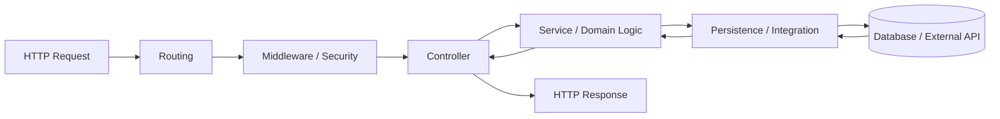
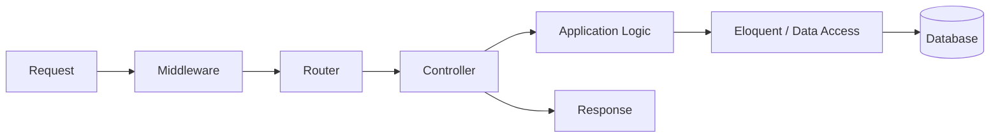
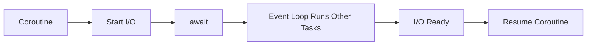
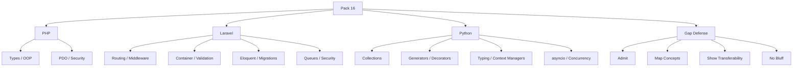
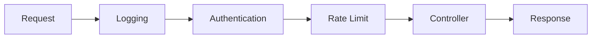
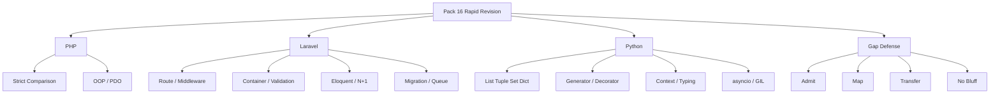

# VRIZE Interview Preparation — Pack 16
## PHP + Laravel + Python Backend Fundamentals + Role-Specific Gap Defense

**Target Role:** Senior Fullstack Developer — Round 1  
**Candidate:** Deepak Kumar  
**Priority:** P1 — Role-Specific Coverage / Gap Defense  
**Timebox:** 75–90 minutes study + later practice  
**Approach:** KIS + DRY + SOLID | Interview-First | Evidence-First | No Bluff  
**Depth:** L1 Must Know → L2 Follow-Up → L3 Architecture / Production Trade-Off

---

## Readiness Gate

You should be able to:

- Explain PHP request processing, strict comparison, classes, interfaces, traits, exceptions, namespaces, Composer, and PDO prepared statements.
- Explain Laravel routing, middleware, controllers, validation, service container, Eloquent, migrations, transactions, queues, caching, authentication, and authorization.
- Explain Laravel/Eloquent N+1 and eager-loading trade-offs.
- Explain Python lists, tuples, sets, dicts, generators, decorators, context managers, typing, `asyncio`, and concurrency vs parallelism.
- Explain the Python GIL carefully without using outdated absolute statements.
- Compare Java/Spring, Node.js/TypeScript, Laravel, and Python using engineering trade-offs.
- Answer truthfully if asked about PHP/Laravel production experience.
- Show transferable backend depth without converting preparation knowledge into false experience.

---

## 1. Objective

The role listing associated with the interview includes:

```text
Kotlin
React
Java
PHP
Laravel
Web Development
Mobile Development
KMP
Python
Node.js
```

Your strongest submitted evidence is around Java/Kotlin, React, Node.js/TypeScript, APIs, databases, cloud, distributed systems, and architecture.

The submitted evidence does **not clearly establish a recent production Laravel project**.

This pack therefore has two goals:

```text
Technical Coverage
+
Safe Gap Defense
```

The target answer is not:

> “I am a Laravel expert.”

It is:

> “I understand the architecture, I can map it to backend concepts I already use, and I will not bluff production experience.”

---

## 2. Real-Life Analogy

Imagine moving from one hotel chain to another.

The names change:

```text
Spring Controller
Laravel Controller

Spring DI Container
Laravel Service Container

JPA / Hibernate
Eloquent ORM

Spring Filter
Laravel Middleware
```

But the engineering flow is still:

```text
Request
→ Route
→ Security
→ Validation
→ Business Logic
→ Database / Integration
→ Response
→ Logging / Monitoring
```

Framework syntax changes.

Backend engineering principles transfer.

---

## 3. Visualization

### 3.1 Cross-Stack Backend Flow



### 3.2 Laravel Request Flow



### 3.3 Python Async Flow



---

## 4. Mind Map



Five anchors:

> **Language → Framework → Data → Async → Transferability**

---

## 5. PHP Fundamentals

PHP is a general-purpose language widely used for server-side web applications and APIs.

Modern PHP supports:

- explicit parameter/return types,
- classes,
- interfaces,
- traits,
- namespaces,
- exceptions,
- attributes,
- enums in modern versions,
- Composer-based dependency management.

Do not reduce PHP to:

> “HTML scripting.”

---

## 6. PHP Types and Functions

```php
function add(int $a, int $b): int
{
    return $a + $b;
}
```

Common types include:

- string,
- int,
- float,
- bool,
- array,
- object,
- null.

For interview purposes, focus on correctness and architecture rather than syntax trivia.

---

## 7. PHP Arrays

PHP arrays are flexible ordered maps.

```php
$user = [
    'id' => 1,
    'name' => 'Deepak'
];
```

List-style:

```php
$values = [10, 20, 30];
```

Do not map PHP array mentally to only a Java `ArrayList`.

---

## 8. `==` vs `===`

### `==`

Loose comparison with coercion rules.

### `===`

Strict comparison:

```text
value
+
type
```

Example:

```php
0 == "0"
0 === "0"
```

For backend code, strict comparison is usually safer when coercion is not intentional.

---

## 9. Classes and Interfaces

```php
interface PaymentGateway
{
    public function charge(int $amount): PaymentResult;
}
```

```php
class PaymentService
{
    public function __construct(
        private PaymentGateway $gateway
    ) {}

    public function pay(int $amount): PaymentResult
    {
        return $this->gateway->charge($amount);
    }
}
```

The same SOLID principle applies:

> depend on meaningful abstractions where they reduce coupling.

---

## 10. Traits

Traits provide implementation reuse across classes.

```php
trait Auditable
{
    public function audit(string $message): void
    {
        // ...
    }
}
```

Senior caution:

> traits can help reuse, but excessive trait composition can make behavior difficult to understand.

---

## 11. Exceptions

```php
try {
    $order = $service->create($request);
} catch (DomainException $e) {
    // map to safe application response
}
```

Do not expose raw internal stack traces to API clients.

---

## 12. Composer

Composer is PHP's dependency-management ecosystem.

Conceptual comparison:

```text
Maven / Gradle
npm
Composer
```

The exact commands differ, but the engineering role is similar:

- dependencies,
- versions,
- autoloading.

---

## 13. PDO and Prepared Statements

Safe concept:

```php
$stmt = $pdo->prepare(
    'SELECT * FROM users WHERE email = :email'
);

$stmt->execute([
    'email' => $email
]);
```

### Interview-Ready Answer

> I would use PDO prepared statements or safe ORM parameter binding instead of concatenating untrusted input into SQL. The security principle is the same across PHP, Java, and Node.js.

---

## 14. Laravel Mental Model

Laravel is a PHP web application framework with support for:

- routing,
- middleware,
- controllers,
- dependency injection/service container,
- validation,
- Eloquent ORM,
- migrations,
- queues,
- caching,
- authentication,
- authorization.

The interview goal is to understand how those pieces connect.

---

## 15. Routing

Concept:

```php
Route::get(
    '/users/{id}',
    [UserController::class, 'show']
);
```

Route responsibility:

> map HTTP method/path to application action.

Do not place large business workflows directly in route files.

---

## 16. Controller

```php
class UserController extends Controller
{
    public function show(
        int $id,
        UserService $service
    ) {
        return $service->find($id);
    }
}
```

Controller should primarily handle:

- HTTP request mapping,
- application service invocation,
- HTTP response.

Keep business logic out of large controllers.

---

## 17. Middleware

Middleware forms HTTP processing layers.

Typical uses:

- authentication,
- authorization,
- rate limiting,
- logging,
- request transformation,
- CORS.



Middleware ordering matters.

---

## 18. Service Container

Laravel's service container resolves dependencies and supports dependency injection.

Conceptual mapping:

```text
Spring IoC Container
↔
Laravel Service Container
```

Main benefit:

> business/application classes do not need to construct every dependency internally.

---

## 19. Validation

Concept:

```php
$request->validate([
    'email' => ['required', 'email'],
    'name' => ['required']
]);
```

Separate:

### Boundary Validation

- required,
- format,
- range,
- type.

### Business Validation

- account active,
- order cancellable,
- inventory available.

Framework validation does not replace business rules.

---

## 20. Eloquent ORM

Eloquent is Laravel's ORM.

Concept:

```php
$user = User::find($id);
```

ORM convenience does not remove the need to understand:

- SQL,
- indexes,
- transactions,
- query count,
- N+1,
- pagination.

---

## 21. N+1 Problem

Concept:

```text
1 query → users
N queries → orders for each user
```

Possible mitigation:

- eager loading,
- projection/query redesign,
- aggregate-specific queries.

Conceptual Laravel example:

```php
$users = User::with('orders')->get();
```

### Interview-Ready Answer

> Eloquent can create N+1 behavior when relationships are fetched repeatedly per model. I would inspect the query pattern and use appropriate eager loading or query redesign rather than assuming ORM-generated access is efficient.

---

## 22. Lazy vs Eager Loading

Lazy:

> fetch related data when accessed.

Risk:

> N+1.

Eager:

> load required relationship data up front.

Risk:

> over-fetching.

Same trade-off exists in JPA/Hibernate.

---

## 23. Migrations

Migrations version database schema changes.

Examples:

- add table,
- add index,
- add column,
- change constraint.

Senior production concerns:

- rolling-deployment compatibility,
- large-table migration cost,
- rollback feasibility,
- old/new application version overlap.

A migration file is not automatically a safe production migration.

---

## 24. Transactions

Use a DB transaction when related database changes must remain consistent.

But avoid unnecessarily holding a DB transaction open while waiting on slow remote services.

The same transaction-design rules apply across frameworks.

---

## 25. Queues

Good queue candidates:

- email,
- report generation,
- image/file processing,
- long integrations,
- delayed notifications.


Queueing introduces responsibilities:

- retry,
- duplicate delivery,
- idempotency,
- failed jobs,
- monitoring,
- backlog.

---

## 26. Laravel Authentication and Authorization

Authentication:

> Who is the user?

Authorization:

> May the user perform this action?

Laravel offers framework mechanisms around authentication and policies/gates.

Do not turn this into API memorization unless the interviewer drills into Laravel specifically.

---

## 27. Laravel Caching

Same design questions as Redis/cache elsewhere:

```text
What is cached?
What is the key?
What is TTL?
How stale may data be?
How is invalidation handled?
What happens if cache fails?
```

Do not add caching merely because the framework makes it easy.

---

## 28. Strong Laravel Architecture Answer

> I would keep controllers thin, use middleware for cross-cutting HTTP concerns, validate at the boundary, place business logic in focused application/domain services, and use Eloquent or repository abstractions where they create a meaningful boundary. I would still inspect SQL, transaction scope, queue behavior, caching, authorization, and observability rather than relying blindly on framework defaults.

---

## 29. Python Fundamentals

Python is widely used for:

- backend services,
- automation,
- AI/data,
- scripting,
- tooling.

For this role, focus on:

```text
collections
→ functions
→ generators
→ typing
→ async
→ concurrency
```

---

## 30. List, Tuple, Set, Dict

### List

Mutable ordered sequence.

```python
users = ["A", "B", "C"]
```

### Tuple

Immutable sequence.

```python
point = (10, 20)
```

### Set

Unique membership.

```python
seen = {1, 2, 3}
```

### Dict

Key-value mapping.

```python
user = {
    "id": 1,
    "name": "Deepak"
}
```

---

## 31. List Comprehension

```python
active_names = [
    user.name
    for user in users
    if user.active
]
```

Use when readable.

Do not compress complex business rules into a one-line puzzle.

---

## 32. Generator

```python
def read_ids():
    for value in range(1_000_000):
        yield value
```

A generator produces values lazily.

Useful for:

- large datasets,
- pipelines,
- streaming-style iteration.

### Interview-Ready Answer

> A generator lets me produce values incrementally with `yield`, which can avoid materializing a large sequence in memory.

---

## 33. Mutable Default Argument Trap

Bad:

```python
def add_item(item, items=[]):
    items.append(item)
    return items
```

The default list is reused.

Safer:

```python
def add_item(item, items=None):
    if items is None:
        items = []

    items.append(item)
    return items
```

Classic Python interview question.

---

## 34. Exceptions

```python
try:
    process()
except ValueError as exc:
    handle(exc)
finally:
    cleanup()
```

Catch errors you can handle.

Do not silently swallow unknown failures.

---

## 35. Context Manager

```python
with open("file.txt") as file:
    data = file.read()
```

Purpose:

> controlled setup and cleanup.

Conceptual mapping:

```text
Python with
↔
Java try-with-resources
```

---

## 36. Decorator

A decorator wraps/transforms behavior.

```python
def log_call(func):
    def wrapper(*args, **kwargs):
        print("calling")
        return func(*args, **kwargs)

    return wrapper
```

Frameworks may use decorators for:

- routes,
- authentication,
- instrumentation,
- registration.

---

## 37. Type Hints

```python
def find_user(user_id: int) -> User | None:
    ...
```

Benefits:

- readability,
- IDE support,
- static analysis.

### Important

Type hints do not automatically validate untrusted runtime HTTP data.

Runtime validation remains separate.

---

## 38. `asyncio`

Python's `asyncio` supports concurrent code using `async` / `await`.

Example:

```python
import asyncio

async def load_user():
    await asyncio.sleep(1)
    return "user"

async def main():
    user = await load_user()
    print(user)

asyncio.run(main())
```

Good fit:

- many concurrent I/O operations,
- async web/network services.

---

## 39. Coroutine and `await`

`async def` defines coroutine-based asynchronous code.

`await` allows the coroutine to suspend while the event loop progresses other work.

Do not say:

> "`await` gives CPU parallelism."

It does not.

---

## 40. Concurrency vs Parallelism

Concurrency:

> multiple tasks make progress over overlapping time.

Parallelism:

> tasks execute simultaneously on separate compute resources.

`asyncio` is primarily a concurrency mechanism.

---

## 41. Python GIL — Safe Answer

Avoid:

> “Python cannot use threads.”

Safe answer:

> In standard CPython, the Global Interpreter Lock has historically limited simultaneous execution of Python bytecode by multiple threads within one interpreter, which matters for CPU-bound threading. Threads can still be useful for I/O workloads, and process-based approaches can provide CPU parallelism. Python is also evolving free-threaded capabilities, so I avoid making absolute version-independent claims.

---

## 42. Threads vs Processes vs Async

### Threads

Useful for selected blocking I/O and libraries that can benefit from threading.

### Processes

Useful for CPU parallelism and process isolation.

Trade-off:

- startup/IPC/memory cost.

### Async

Useful for large numbers of concurrent I/O operations.

Choose based on workload.

---

## 43. Cross-Stack Concept Mapping

| Concern | Java / Spring | Node / TypeScript | PHP / Laravel | Python |
|---|---|---|---|---|
| Routing | Spring MVC | Express Router | Laravel Routes | Framework dependent |
| Controller | `@RestController` | Controller/handler | Controller | Framework dependent |
| DI | Spring container | Manual/framework DI | Service container | Manual/framework DI |
| ORM | JPA/Hibernate | ORM/driver | Eloquent | ORM/driver |
| Validation | Bean Validation | Runtime validator | Laravel validation | Runtime/framework validator |
| Async | Future/reactive/messaging | Promise/queues | Queues/events | `asyncio`/queues |
| Migration | Flyway/Liquibase etc. | Tool-specific | Laravel migrations | Tool-specific |

### Senior Insight

Vocabulary changes.

Core engineering concerns remain.

---

## 44. Technology Comparison

Do not say:

```text
Node is fast.
Python is slow.
Laravel is easy.
Java is enterprise.
```

Too shallow.

Compare:

```text
workload
team capability
ecosystem
runtime model
operational maturity
performance
delivery speed
existing architecture
```

---

## 45. Role-Specific Gap Defense

If asked:

> “How much Laravel experience do you have?”

### Safe Answer

> Laravel is not one of my strongest recent production frameworks, so I would not position myself as a long-term Laravel specialist. My strongest recent backend work has been Node.js/TypeScript, with Java/Spring Boot in my broader backend background. I understand Laravel's routing, middleware, service container, validation, Eloquent, migrations, queues, caching, and authorization model, and those concepts map closely to backend concerns I already work with. I would expect framework-specific ramp-up to be much smaller than the underlying backend-engineering ramp-up.

---

## 46. If Asked About PHP Experience

If you do not have meaningful production PHP experience:

> I have familiarity with PHP/Laravel concepts, but I would not claim recent production ownership. My recent backend depth is stronger in Node.js/TypeScript, with Java/Spring Boot experience as well. I am comfortable mapping the same API, DI, persistence, validation, transaction, queue, security, and deployment concerns into Laravel.

Do not upgrade “familiarity” to “production expertise.”

---

## 47. Why the Role Lists Many Languages

Strong answer:

> The role appears broader than one fixed stack because it includes Java/Kotlin, Node.js, React, PHP/Laravel, Python, mobile, and KMP. I interpret that as valuing engineers who can work across application layers and technology families. I would contribute most deeply in the areas where I have stronger evidence and ramp on framework-specific gaps from established engineering fundamentals.

---

## 48. Project Mapping

### Strongly Supported

- Node.js/TypeScript backend,
- Java/Kotlin,
- React,
- APIs,
- databases,
- cloud,
- distributed systems,
- security,
- performance,
- architecture.

### Requires Personal Validation

- production Python backend depth,
- Python async production use,
- PHP production work.

### Not Established in Submitted Evidence

- recent named Laravel production project,
- Eloquent production tuning,
- Laravel queue production ownership.

Treat Laravel as:

> **role-specific knowledge coverage**

unless you personally validate real experience.

---

## 49. Candidate Validation

| Topic | Real Experience / Evidence |
|---|---|
| PHP project | __________________ |
| Laravel project | __________________ |
| Eloquent | __________________ |
| Laravel middleware | __________________ |
| Laravel queue | __________________ |
| Python backend | __________________ |
| Python async | __________________ |
| Python automation | __________________ |
| Python production service | __________________ |
| Framework ramp-up example | __________________ |

---

## 50. Interview-Ready Answers

### Q1. What is Laravel?

> Laravel is a PHP web application framework that provides structured support for routing, middleware, controllers, dependency injection through its service container, validation, Eloquent ORM, migrations, queues, caching, authentication, and authorization.

### Q2. What is Laravel middleware?

> Middleware participates in the HTTP request pipeline and is used for cross-cutting concerns such as authentication, authorization, rate limiting, logging, request transformation, and CORS.

### Q3. What is the service container?

> It is Laravel's dependency-resolution and injection mechanism, conceptually similar to an IoC container such as Spring's.

### Q4. What is Eloquent?

> Eloquent is Laravel's ORM. It provides model and relationship abstractions over database access, but I would still inspect SQL, indexing, transaction boundaries, query count, and N+1 behavior.

### Q5. What is N+1?

> One query loads the parent collection and then additional queries are executed for each relationship. Appropriate eager loading or query redesign can remove those repeated round trips.

### Q6. Why use queues?

> Use queues when work does not need to complete in the synchronous request path or when buffering and worker isolation are valuable. But queue design also requires retry, idempotency, monitoring, and failed-job handling.

### Q7. `==` vs `===` in PHP?

> `==` performs loose comparison with coercion, while `===` requires both value and type to match.

### Q8. Prevent SQL injection in PHP?

> Use prepared statements such as PDO prepared queries or safe ORM parameter binding instead of SQL string concatenation.

### Q9. Python list vs tuple?

> A list is mutable while a tuple is immutable. I use a tuple for fixed value groups and a list when the sequence needs mutation.

### Q10. What is a generator?

> A generator produces values lazily with `yield`, which is useful for processing large or computed sequences without materializing everything in memory.

### Q11. What is a decorator?

> A decorator wraps or transforms function/class behavior. Frameworks commonly use decorators for routing, security, registration, or instrumentation.

### Q12. What is a context manager?

> It manages setup and cleanup around a block using `with`, similar in spirit to Java try-with-resources.

### Q13. What are type hints?

> Type hints improve developer and static-analysis contracts, but they do not automatically validate external runtime input.

### Q14. What is `asyncio`?

> `asyncio` is Python's event-loop-based library for concurrent asynchronous code with `async` and `await`, especially useful for I/O-heavy workloads.

### Q15. What is the GIL?

> In standard CPython it has historically limited simultaneous execution of Python bytecode by multiple threads in one interpreter, affecting CPU-bound threading. Threads still have useful I/O cases, while processes or evolving free-threaded approaches address other parallelism needs.

### Q16. How fast can you ramp on Laravel?

> The framework-specific syntax is the smaller gap. HTTP design, DI, validation, SQL/ORM behavior, transactions, queues, security, caching, testing, observability, and deployment are already part of my backend background. I would focus the ramp-up on Laravel conventions and APIs.

---

## 51. Likely Follow-Ups

### PHP

- Interface vs trait?
- Composer?
- namespaces?
- strict comparison?
- nullable types?
- PHP-FPM?

### Laravel

- route vs controller?
- middleware?
- service provider?
- container binding?
- eager loading?
- migrations?
- queues?
- failed jobs?
- policies/gates?
- caching?
- Artisan?

### Python

- list vs tuple?
- dict vs set?
- `*args` / `**kwargs`?
- mutable default argument?
- generators?
- decorators?
- context managers?
- type hints?
- `asyncio`?
- GIL?
- threading vs multiprocessing?

---

## 52. Common Interview Traps

1. “PHP is only for simple websites.”
2. “Laravel controllers should contain all business logic.”
3. “Eloquent means SQL knowledge is unnecessary.”
4. “Eager loading is always better.”
5. “Queue means work is automatically guaranteed.”
6. “Python list and tuple are basically the same.”
7. “Generators are arrays.”
8. “`asyncio` provides CPU parallelism.”
9. “Threads are useless in Python because of the GIL.”
10. Claiming Laravel production expertise after only studying it.

---

## 53. Interviewer Intent

| Question | What is really being tested |
|---|---|
| PHP `===` | Language fundamentals |
| PDO | DB/security basics |
| Laravel routing | Framework fundamentals |
| Middleware | HTTP architecture |
| Service container | DI understanding |
| Eloquent | ORM knowledge |
| N+1 | Production maturity |
| Queues | Async design |
| Python generator | Language depth |
| Context manager | Resource safety |
| `asyncio` | Concurrency |
| GIL | Runtime knowledge |
| Laravel experience | Integrity / adaptability |
| Cross-stack mapping | Transferable seniority |

---

## 54. Practical / Mini Mock Content

This section is for later practice only.

### Level 1

1. What is PHP?
2. `==` vs `===`?
3. Interface vs trait?
4. PDO prepared statement?
5. What is Laravel?
6. Route vs controller?
7. Middleware?
8. Service container?
9. Eloquent?
10. N+1?
11. Migration?
12. Queue?
13. Python list vs tuple?
14. dict vs set?
15. generator?
16. decorator?
17. context manager?
18. type hints?
19. `asyncio`?
20. GIL?

### Level 2

21. Lazy vs eager loading?
22. Laravel transaction?
23. Laravel authorization?
24. What belongs in controller?
25. Queue retry and duplicates?
26. Python mutable default argument?
27. Threads vs processes?
28. Async vs threads?
29. Why runtime validation with type hints?
30. How do you ramp on a new backend framework?

### Level 3

31. Design a Laravel REST API.
32. Avoid Eloquent N+1.
33. Design queued report generation.
34. Design Python async integration service.
35. Compare Node event loop with Python `asyncio`.
36. Compare Spring DI with Laravel container.
37. Compare JPA with Eloquent.
38. Defend a one-week Laravel ramp-up.
39. Explain transferable backend skills.
40. Answer: “You do not have recent Laravel—why should we hire you?”

---

## 55. Quick Revision



---

## 56. 90-Second Rapid Revision

```text
PHP
server-side general-purpose language

==
loose comparison

===
strict comparison

PDO
prepared statements for safe parameter binding

LARAVEL
PHP web framework

ROUTE
request mapping

MIDDLEWARE
HTTP cross-cutting pipeline

CONTROLLER
HTTP boundary

SERVICE CONTAINER
dependency resolution

ELOQUENT
Laravel ORM

N+1
one parent query + repeated relationship queries

MIGRATION
version database schema changes

QUEUE
background processing + retry/idempotency concerns

PYTHON LIST
mutable sequence

TUPLE
immutable sequence

SET
unique membership

DICT
key-value mapping

GENERATOR
lazy values with yield

DECORATOR
wrap behavior

CONTEXT MANAGER
setup/cleanup with with

TYPE HINT
developer/static contract

ASYNCIO
event-loop I/O concurrency

GIL
runtime detail; avoid absolute claims

GAP
admit -> map concepts -> demonstrate transferability -> no bluff
```

---

## 57. Candidate Answer Mapping

| Area | Safe Claim | Evidence | Risk |
|---|---|---|---|
| Backend architecture | Strong | Résumé | Low |
| Node.js/TypeScript | Strong recent | Résumé | Low |
| Java/Spring concepts | Supported broadly | Résumé | Low/Medium by project |
| Python familiarity | Broader competency | Résumé | Medium for production depth |
| PHP familiarity | Validate personally | __________ | Medium |
| Laravel knowledge | Preparation-level if no project | This pack | Low if framed correctly |
| Laravel production delivery | Not established | __________ | High if invented |
| Eloquent production tuning | Not established | __________ | High if invented |
| Python async production | Validate | __________ | Medium |

---

## 58. Final Visualization


---

## Golden Rules

> **Framework names change; backend engineering principles transfer.**

> **Do not let ORM convenience replace SQL understanding.**

> **Queues introduce reliability responsibilities, not only background execution.**

> **Python async is primarily a concurrency model for appropriate I/O workloads.**

> **Do not make version-independent absolute claims about the GIL.**

> **Laravel knowledge is not Laravel production experience.**

> **An admitted gap with strong transferable engineering depth is safer than a bluff that fails one follow-up later.**

For this role:

> **Acknowledge → Map → Explain → Demonstrate Transferability → No Bluff**

---

## Reference Baseline — Official Documentation Checked 19 August 2026

- Laravel Controllers: https://laravel.com/docs/13.x/controllers
- Laravel Routing: https://laravel.com/docs/13.x/routing
- Laravel Middleware: https://laravel.com/docs/13.x/middleware
- Laravel Service Container: https://laravel.com/docs/13.x/container
- Laravel Queues: https://laravel.com/docs/13.x/queues
- PHP PDO Prepared Statements: https://www.php.net/manual/en/pdo.prepared-statements.php
- PHP PDO `prepare`: https://www.php.net/manual/en/pdo.prepare.php
- Python `asyncio`: https://docs.python.org/3/library/asyncio.html
- Python Type Hints: https://docs.python.org/3/library/typing.html
- Python Context Managers: https://docs.python.org/3/library/contextlib.html

Version-specific trivia was intentionally minimized in favor of durable interview concepts.
