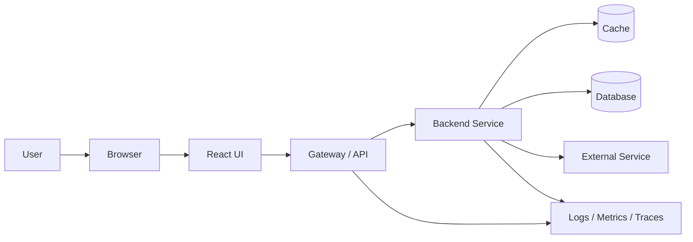
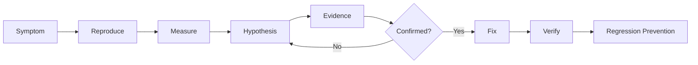
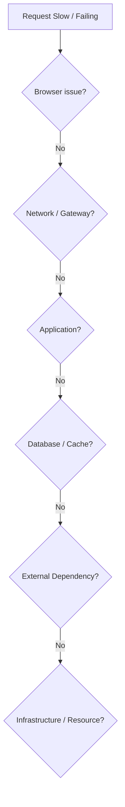
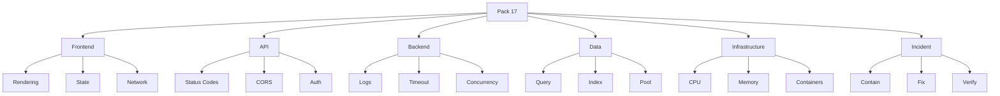
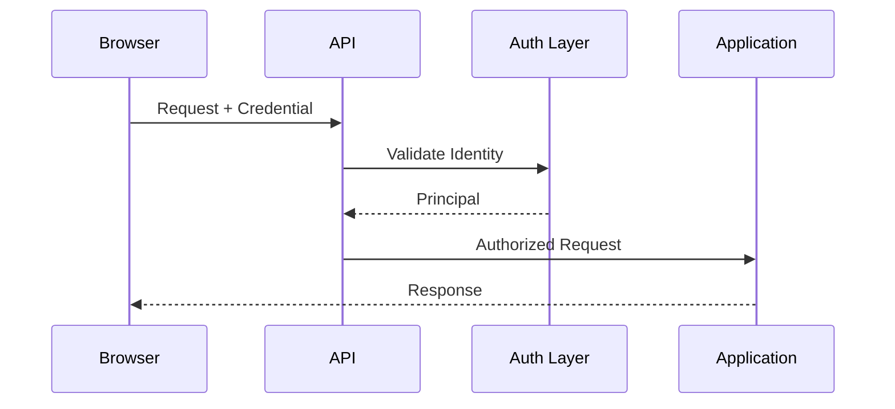
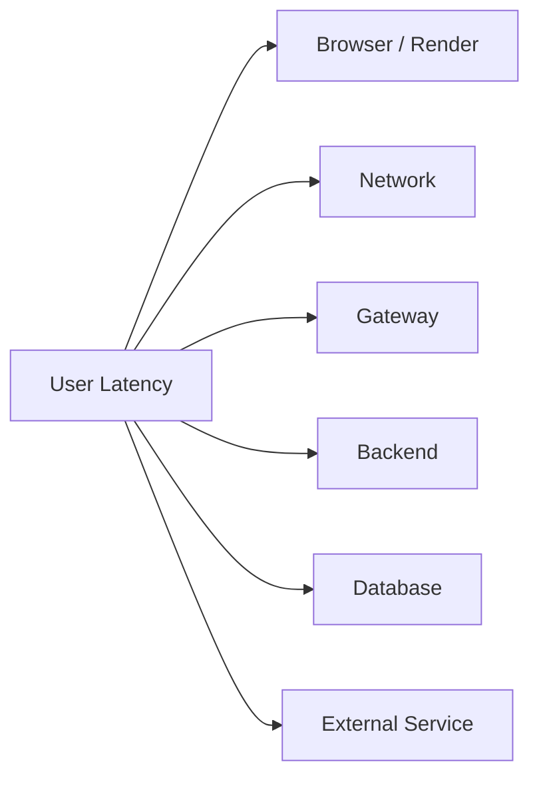
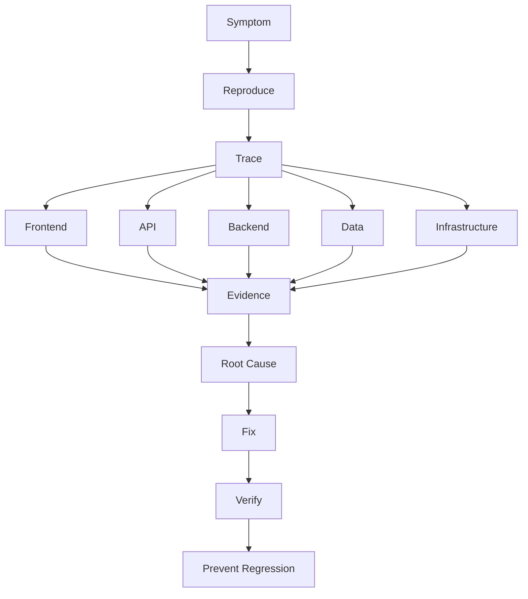
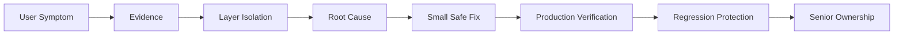

# VRIZE Interview Preparation — Pack 17
## Full-Stack Integration + Debugging + Production Troubleshooting

**Target Role:** Senior Fullstack Developer — Round 1  
**Candidate:** Deepak Kumar  
**Priority:** P0 — Must Know  
**Timebox:** 75–90 minutes study + later scenario practice  
**Approach:** KIS + DRY + Evidence-First | Interview-First | No Bluff  
**Depth:** L1 Must Know → L2 Follow-Up → L3 Production Diagnosis

---

## Readiness Gate

You should be able to:

- Debug an issue across browser, React, API, service, database, cache, and infrastructure layers.
- Explain a structured production-troubleshooting approach.
- Distinguish symptom, signal, hypothesis, evidence, root cause, and fix.
- Explain how to troubleshoot HTTP 400, 401, 403, 404, 409, 429, and 500 errors.
- Explain frontend-to-backend integration failure modes.
- Explain CORS failures accurately.
- Explain how to trace one request across services.
- Explain timeout, retry, circuit-breaker, and connection-pool symptoms.
- Explain how to diagnose slow APIs without optimizing blindly.
- Explain how to isolate frontend rendering issues from backend latency.
- Explain how to investigate database slowness and N+1 behavior.
- Explain how to investigate memory, CPU, event-loop, JVM, or container-level issues conceptually.
- Explain production incident containment, rollback, verification, and regression prevention.
- Connect troubleshooting answers to real production-support experience without inventing incidents.

---

## 1. Objective

The target role explicitly values engineers who can:

- debug and resolve issues across the application stack,
- optimize performance,
- integrate frontend and backend,
- maintain reliability,
- participate in testing and code review.

This pack answers:

> **Can you find the real fault when the symptom appears in a different layer?**

A senior engineer does not treat every production problem as:

```text
frontend bug
backend bug
database bug
DevOps bug
```

Instead:

```text
User Symptom
→ Reproduce
→ Trace Request
→ Identify Failing Layer
→ Gather Evidence
→ Test Hypothesis
→ Fix
→ Verify
→ Prevent Regression
```

---

## 2. Real-Life Analogy

Think of a water supply system.

A user says:

> “No water is coming from my kitchen tap.”

Possible causes:

- tap blocked,
- local pipe blocked,
- building valve closed,
- pump failed,
- main supply unavailable.

The symptom appears at the tap.

The root cause may be far away.

Full-stack debugging works the same way.

> **Follow the flow. Do not guess the layer.**

---

## 3. Visualization

### 3.1 End-to-End Request Path



### 3.2 Troubleshooting Loop



### 3.3 Layer Isolation



---

## 4. Mind Map



Five anchors:

> **Reproduce → Trace → Isolate → Fix → Verify**

---

## 5. Symptom vs Root Cause

A symptom is what is observed.

Examples:

```text
page slow
500 error
button not working
timeout
database CPU high
Pod restarting
```

The root cause is the actual underlying failure.

Example:

```text
Page slow
→ API slow
→ DB query slow
→ missing effective index
```

Senior rule:

> Do not stop at the first visible failing component.

---

## 6. Evidence Before Hypothesis

Weak approach:

> “It must be the database.”

Strong approach:

```text
frontend timing
API latency
trace
service log
DB plan
resource metrics
```

Then conclude.

### Interview-Ready Answer

> I start with the user-visible symptom and reproduce it if possible. Then I trace the request across layers using browser/network timing, application logs, metrics, traces, and database evidence. I form hypotheses from data and test them rather than changing multiple components at once.

---

## 7. Browser-Side Debugging

Useful browser evidence:

- console errors,
- network tab,
- request payload,
- response status,
- response body,
- timing,
- failed asset,
- CORS message,
- JavaScript exception.

First question:

> Did the browser send the request?

That immediately separates:

```text
UI / JavaScript problem
```

from:

```text
network / backend problem
```

---

## 8. React Issue — UI Not Updating

Possible causes:

- state not changed,
- state mutated in place,
- stale closure,
- wrong dependency array,
- memoization hides update,
- wrong key,
- component not mounted,
- async response ignored.

Troubleshooting:

```text
event fired?
→ state update called?
→ new state reference?
→ component rendered?
→ expected value present?
```

Do not start by adding `useEffect` randomly.

---

## 9. React Issue — Duplicate API Calls

Possible causes:

- effect executed more than expected,
- dependency changes,
- duplicate event handler,
- multiple component mounts,
- retry logic,
- development behavior,
- state ownership issue.

Check:

```text
browser network
→ call stack / trigger
→ component lifecycle
→ effect dependencies
→ retry layer
```

---

## 10. Frontend vs Backend Latency

Suppose user sees:

```text
4 second page load
```

Break it down:

```text
bundle/network
render
API request
backend processing
database
external service
```

Do not assume backend because API is involved.

Do not assume React because screen is slow.

Measure.

---

## 11. HTTP 400

Usually means:

> request is invalid according to API contract.

Check:

- body shape,
- type,
- required field,
- query/path parameter,
- content type,
- validation error.

Senior response:

> Compare actual request with API contract before debugging business logic.

---

## 12. HTTP 401

Usually means:

> authentication is missing or invalid.

Check:

- token/cookie present?
- expired?
- signature?
- issuer/audience?
- auth middleware?
- clock skew where relevant?

Do not confuse with 403.

---

## 13. HTTP 403

Usually means:

> identity is known but action is not permitted.

Check:

- role,
- permission,
- ownership,
- policy,
- tenant boundary.

Memory rule:

```text
401
→ Who are you?

403
→ You are known, but not allowed
```

---

## 14. HTTP 404

Possible causes:

- wrong route,
- wrong ID,
- resource absent,
- routing/gateway mismatch,
- authorization strategy intentionally hides resource existence.

Check contract and routing before assuming DB issue.

---

## 15. HTTP 409

Useful for business/resource conflict.

Examples:

- optimistic-lock conflict,
- duplicate resource,
- state transition conflict.

Do not use 500 for expected business conflicts.

---

## 16. HTTP 429

Too Many Requests.

Possible causes:

- client exceeds rate policy,
- tenant quota,
- protective throttling.

Check:

- rate-limit headers where available,
- retry-after guidance,
- accidental request loop.

---

## 17. HTTP 500

Server failed unexpectedly.

Do not show raw stack trace to user.

Troubleshooting:

```text
trace/request ID
→ application log
→ exception type
→ failing dependency
→ recent change
→ reproduce
```

500 is the starting point, not the root cause.

---

## 18. CORS Failure

Browser may show a CORS error even when the backend returned a response.

Check:

- requesting origin,
- allowed origins,
- method,
- headers,
- preflight,
- credentials,
- gateway/proxy configuration.

### Important

CORS is browser policy.

It is not:

- server authentication,
- authorization.

---

## 19. Preflight Request

For some cross-origin requests, browser sends:

```text
OPTIONS
```

before actual request.

Server/gateway must respond with appropriate CORS headers.

Common bug:

```text
OPTIONS blocked by auth middleware
```

or required header not allowed.

---

## 20. Authentication Integration Failure

Flow:



Troubleshoot:

- credential created?
- browser stores/sends it?
- proxy preserves it?
- API parses it?
- identity valid?
- authorization succeeds?

---

## 21. Trace / Correlation ID

A trace/correlation ID helps connect one request across layers.

Example:

```text
Browser request ID
→ Gateway
→ API
→ Service
→ DB/external call
```

### Interview-Ready Answer

> For distributed debugging I want a trace or correlation identifier propagated through service boundaries so logs and traces for one user request can be reconstructed without searching only by timestamp.

---

## 22. Logging Strategy

Good diagnostic log includes:

- timestamp,
- service,
- environment,
- trace ID,
- route/operation,
- error code,
- duration,
- safe identifiers.

Avoid:

- secrets,
- tokens,
- passwords,
- full sensitive data.

---

## 23. Structured Logs

Better:

```json
{
  "level": "ERROR",
  "traceId": "abc123",
  "service": "order-api",
  "operation": "createOrder",
  "errorCode": "PAYMENT_TIMEOUT"
}
```

than:

```text
something went wrong
```

Structured logs are easier to search and aggregate.

---

## 24. Metrics

Core troubleshooting metrics:

```text
request rate
error rate
p95 / p99 latency
CPU
memory
DB pool usage
queue depth
cache hit rate
downstream latency
```

Use metrics to answer:

> Is this one request or a system-wide pattern?

---

## 25. Distributed Tracing

Tracing reveals where latency is spent.

Example:

```text
API total: 900ms
service logic: 30ms
DB: 120ms
payment API: 720ms
```

Now optimization target is clear.

---

## 26. Slow API Investigation

Use:

```text
endpoint
→ percentile latency
→ trace
→ application CPU
→ DB
→ external services
→ serialization
→ network
```

### Interview-Ready Answer

> I break end-to-end latency into components rather than optimizing the API as one black box. Once I know whether time is in application code, database, cache, network, or downstream service, I optimize the actual bottleneck and compare the same workload afterward.

---

## 27. Database Slowness

Check:

- exact query,
- execution plan,
- row counts,
- selectivity,
- indexes,
- joins,
- sorts,
- N+1,
- lock waits,
- pool usage.

Do not immediately add an index.

Do not immediately scale the DB.

---

## 28. N+1 from Full-Stack Perspective

Symptom:

```text
one page load
→ hundreds of DB queries
```

Possible origin:

- ORM lazy loading,
- backend loops,
- frontend calls one endpoint per item.

Fix can be at different layers:

- bulk API,
- join/projection,
- eager/batch loading,
- data-shape redesign.

---

## 29. Connection-Pool Exhaustion

Symptoms:

- requests waiting,
- timeout,
- DB appears under moderate CPU,
- many active/waiting connections.

Causes:

- connections not released,
- long transactions,
- pool too small,
- too many app instances,
- slow DB queries.

### Senior Rule

Pool sizing is system-wide:

```text
pool per instance
× instance count
≤ database capacity
```

---

## 30. Timeout

Symptoms:

- request reaches timeout threshold,
- dependency may still be processing,
- resource held too long.

Investigate:

- which hop timed out?
- client?
- gateway?
- backend?
- DB?
- external service?

Timeout budgets must align across layers.

---

## 31. Retry Storm

Failure:

```text
dependency slows
→ clients retry
→ traffic multiplies
→ dependency slows more
```

Controls:

- bounded retries,
- backoff,
- jitter,
- circuit breaker,
- rate limiting,
- idempotency.

Do not retry every failure.

---

## 32. Circuit Breaker Symptom

When circuit opens:

- calls fail fast,
- fallback/degraded mode may appear,
- downstream pressure is reduced.

Troubleshooting asks:

> Why did it open?

Not:

> “How do I force it closed?”

Find downstream failure first.

---

## 33. Cache Issue

Possible symptoms:

- stale data,
- low hit rate,
- cache stampede,
- hot key,
- serialization problem,
- cache unavailable.

Check:

```text
hit/miss
TTL
invalidation
key design
fallback
load on DB
```

---

## 34. Node.js Event-Loop Blocking

Symptoms:

- rising latency,
- CPU high,
- timers delayed,
- requests pile up.

Possible causes:

- large synchronous calculation,
- huge JSON transformation,
- synchronous I/O,
- expensive regex,
- excessive logging.

Use profiling/evidence.

Do not simply add more instances without understanding cause.

---

## 35. JVM / Java Service Slow

Possible causes:

- DB/downstream latency,
- thread-pool exhaustion,
- blocking,
- lock contention,
- excessive allocation,
- GC pressure,
- CPU hotspot.

Investigation:

```text
request metrics
→ thread behavior
→ GC / memory
→ CPU profile
→ DB/downstream
```

Do not say:

> “Java is slow because of GC.”

GC is only one possible factor.

---

## 36. Memory Growth

Across runtimes, check:

- process memory trend,
- heap,
- caches,
- retained objects,
- buffers/native memory,
- listeners/subscriptions,
- large payloads.

A memory symptom can be:

```text
application leak
or
legitimate increased working set
```

Measure before deciding.

---

## 37. Container Restart

Common reasons:

- process crash,
- OOM,
- failing liveness,
- bad configuration,
- missing secret,
- dependency during startup.

Check:

```text
container exit code
Pod events
logs
resource limits
probe results
deployment change
```

---

## 38. Readiness Failure

Pod exists but gets no traffic.

Check:

- readiness endpoint,
- dependency initialization,
- wrong port/path,
- slow startup,
- configuration.

Do not convert every readiness problem into liveness restart.

---

## 39. Deployment Regression

If problem begins immediately after release:

```text
compare version
→ config diff
→ DB migration
→ dependency version
→ feature flag
```

If user impact is serious and rollback is safe:

> rollback first, debug second.

---

## 40. Database Migration Regression

Possible issues:

- old app incompatible with new schema,
- index build locks,
- expensive backfill,
- changed nullability,
- query-plan change.

Production deployment must consider overlapping old/new versions.

---

## 41. External Service Failure

Symptoms:

- timeout,
- 5xx,
- rate limit,
- changed response contract,
- DNS/network issue.

Your service should have:

- timeout,
- safe retry policy,
- error mapping,
- observability,
- fallback if business permits.

---

## 42. Frontend Error Boundaries / Failure UX

A frontend failure should not necessarily blank the entire application.

Design:

- loading state,
- empty state,
- recoverable error,
- retry action,
- graceful degradation.

Senior full-stack engineers care about user behavior during failure.

---

## 43. API Contract Mismatch

Classic integration failure:

Frontend expects:

```json
{
  "userName": "A"
}
```

Backend sends:

```json
{
  "name": "A"
}
```

Prevent with:

- clear contract,
- typed clients,
- schema/contract tests,
- backward-compatible changes.

---

## 44. Serialization / Date Issues

Common cross-stack problems:

- timezone mismatch,
- date format,
- numeric precision,
- nullable fields,
- enum changes,
- casing differences.

Senior rule:

> Define wire contracts explicitly.

Do not expose internal entity shape accidentally.

---

## 45. Pagination Mismatch

Frontend thinks:

```text
page starts at 1
```

Backend thinks:

```text
page starts at 0
```

Or sort order changes between pages.

Result:

- duplicates,
- missing rows.

Define:

- page semantics,
- stable sort,
- cursor/offset contract.

---

## 46. Race Condition in UI + API

Example:

User clicks submit twice.

Possible result:

```text
two POST requests
→ duplicate order
```

Controls:

- disable repeated action where appropriate,
- client request state,
- server idempotency,
- uniqueness constraints.

Backend correctness must not depend solely on UI behavior.

---

## 47. Full-Stack Performance Model



Total user latency is the sum/interaction of multiple layers.

Optimize the largest meaningful contributor first.

---

## 48. Incident Severity

Not every bug is equal.

Prioritize by:

```text
user impact
security
data integrity
revenue/business impact
scope
recoverability
```

This helps decide:

- immediate rollback,
- hotfix,
- normal release.

---

## 49. Incident Containment

Examples:

- rollback,
- disable feature flag,
- rate limit,
- isolate bad worker,
- switch to degraded mode.

Containment is about:

> reducing harm before root-cause work is complete.

---

## 50. Root Cause Analysis

Avoid:

> “Developer forgot null check.”

Ask deeper:

- why was invalid state possible?
- why did tests miss it?
- why did monitoring detect it late?
- why did deployment allow it?
- what control is worth adding?

Good RCA improves the system.

---

## 51. Regression Prevention

After fixing:

- unit/integration regression test,
- contract test,
- monitoring,
- alert,
- validation,
- deployment check,
- documentation/runbook.

Do not add ten controls for every small bug.

Add the smallest high-value prevention.

---

## 52. Debugging Communication

During an incident, communicate:

```text
What we know
What we do not know
User impact
Containment
Next action
Next update
```

Avoid presenting hypothesis as confirmed root cause.

---

## 53. Project Mapping

The submitted résumé strongly supports:

- production support,
- debugging,
- vulnerability remediation,
- performance optimization,
- code review,
- backend/frontend integration,
- Node.js/TypeScript/React/MongoDB/Azure,
- distributed systems,
- Docker/Kubernetes,
- observability.

### Safe Positioning

> Production troubleshooting has been a recurring part of my senior engineering work. I normally start from the user-visible symptom, trace the request across application and dependency boundaries, gather logs/metrics/query evidence, isolate the bottleneck or failure, then verify the fix against the original signal.

### Evidence Boundary

Do not invent:

- exact outage duration,
- exact root cause,
- exact monitoring product,
- exact incident count,
- exact p95/p99 values

unless you can defend them from real experience.

---

## 54. Candidate Incident Bank

Fill before live mock execution.

| Incident Type | Real Example | Your Contribution | Evidence | Result |
|---|---|---|---|---|
| Frontend/API Integration | __________ | __________ | __________ | __________ |
| Slow API | __________ | __________ | __________ | __________ |
| Database Issue | __________ | __________ | __________ | __________ |
| Security Defect | __________ | __________ | __________ | __________ |
| Deployment Failure | __________ | __________ | __________ | __________ |
| Production Bug | __________ | __________ | __________ | __________ |
| Memory/CPU Issue | __________ | __________ | __________ | __________ |
| External Dependency | __________ | __________ | __________ | __________ |

---

## 55. Interview-Ready Answers

### Q1. How do you debug a full-stack issue?

> I start from the exact user-visible symptom and reproduce it if possible. Then I follow the request across browser/network, frontend, gateway, backend, database/cache, and external dependencies using timings, logs, metrics, traces, and query evidence. I isolate one failing layer, test the hypothesis, implement the smallest justified fix, and verify against the original signal.

### Q2. A React page is slow. What do you check?

> I separate frontend rendering time from API/network time first. I use browser profiling/network timing to see whether the delay is bundle/rendering/state work or a slow API. If it is API latency, I continue tracing into backend and dependencies rather than optimizing React blindly.

### Q3. API returns 500. What do you do?

> I capture the request/trace ID, inspect the server-side exception and dependency behavior, check recent deployment/config changes, reproduce if possible, and identify whether the failure is application logic, data, database, or downstream. I keep the client response safe and put diagnostic detail in internal logs.

### Q4. 401 vs 403?

> 401 means authentication is missing or invalid. 403 means the identity is known but does not have permission for the requested operation.

### Q5. How do you debug CORS?

> I inspect the browser request and preflight, compare the requesting origin, method, headers, credentials settings, and the API/gateway CORS configuration. I remember that CORS is browser policy and does not replace server-side authentication or authorization.

### Q6. How do you debug a slow API?

> I break total latency into application, database, cache, network, and downstream-service time using traces and metrics. Then I optimize the measured bottleneck and compare the same workload after the change.

### Q7. How do you identify N+1?

> I inspect query count for one business request. If loading a collection triggers repeated relationship queries, I change the data-access pattern using a bulk query, projection, eager/batch loading, or another access strategy appropriate to the ORM and use case.

### Q8. What causes connection-pool exhaustion?

> Common causes include long-running queries/transactions, leaked or unreleased connections, too-small pool, too many app replicas, or database saturation. I inspect pool wait metrics and calculate total possible connections across all application instances.

### Q9. How do you handle a failing deployment?

> If user impact is material and rollback is safe, I restore the known-good version quickly. Then I compare the new version's code, configuration, migration, dependencies, probes, and runtime signals to isolate the regression before redeploying.

### Q10. How do you prevent the same incident happening again?

> I add the smallest control that would have detected or prevented the exact failure—such as a regression test, contract check, validation, alert, deployment gate, or runbook update—rather than adding process for its own sake.

---

## 56. Likely Follow-Ups

### Frontend

- Stale closure?
- Wrong React key?
- Excessive re-render?
- Duplicate API calls?
- Race condition?
- Error boundary?

### API

- 400 vs 422?
- 401 vs 403?
- 409?
- 429?
- CORS preflight?
- Idempotency?

### Backend

- Thread/event-loop saturation?
- Deadlock?
- Retry storm?
- Circuit breaker?
- Memory leak?
- CPU hotspot?

### Database

- N+1?
- Full scan?
- Lock wait?
- Pool exhaustion?
- Replica lag?
- Slow query plan?

### Infra

- OOMKilled?
- CrashLoopBackOff?
- readiness/liveness?
- autoscaling?
- deployment rollback?

---

## 57. Common Interview Traps

1. Guessing the failing layer.
2. Treating HTTP status code as root cause.
3. Saying every 401/403 is an auth-token problem.
4. Calling CORS an API security mechanism.
5. Adding indexes without checking the plan.
6. Increasing connection pool without checking DB capacity.
7. Retrying every downstream error.
8. Adding Pods when DB is already saturated.
9. Debugging live production for too long when rollback is safe.
10. Fixing the bug without verifying the original symptom.

---

## 58. Interviewer Intent

| Question | What is really being tested |
|---|---|
| Full-stack debug | End-to-end thinking |
| Browser network tab | Frontend maturity |
| 401/403 | Security precision |
| CORS | Web integration |
| Trace ID | Distributed troubleshooting |
| Slow API | Performance maturity |
| N+1 | Data-access depth |
| Pool exhaustion | Resource awareness |
| Retry storm | Reliability |
| Deployment rollback | Production ownership |
| RCA | Senior learning mindset |
| Incident communication | Leadership |

---

## 59. Practical / Mini Mock Content

This section is for later practice only.

### Level 1

1. React page slow.
2. API returns 500.
3. Browser shows CORS failure.
4. 401 vs 403.
5. Slow SQL-backed API.
6. N+1.
7. Connection-pool exhaustion.
8. External API timeout.
9. Pod restarting.
10. Deployment regression.
11. Duplicate POST.
12. Stale cache.

### Level 2

13. Browser sends request but backend logs nothing.
14. Backend logs success but browser fails.
15. API p95 rises but CPU is low.
16. DB CPU rises after autoscaling.
17. Queue backlog grows.
18. Retry storm.
19. Memory grows slowly over hours.
20. React makes duplicate calls.
21. User gets old data after update.
22. Only one tenant is slow.
23. Only production fails, local works.
24. One deployment version fails.

### Level 3

25. Design a full incident-debugging walkthrough.
26. Trace one request across React → gateway → Node → DB.
27. Diagnose Java service latency with healthy DB.
28. Diagnose Node event-loop blocking.
29. Diagnose OOMKilled container.
30. Diagnose API contract mismatch.
31. Diagnose intermittent 403.
32. Diagnose duplicate order creation.
33. Diagnose deep-page pagination slowdown.
34. Design regression prevention after incident.
35. Communicate a Sev-1 incident update.

---

## 60. Quick Revision



---

## 61. 90-Second Rapid Revision

```text
DEBUG
symptom -> reproduce -> trace -> isolate -> fix -> verify

FRONTEND
console + network + render/state

400
bad request

401
authentication

403
authorization

409
conflict

429
rate limit

500
server failure; inspect trace/log

CORS
browser cross-origin policy

TRACE ID
connect one request across services

SLOW API
break latency by layer

N+1
one parent query + repeated child queries

POOL EXHAUSTION
wait for DB connections

TIMEOUT
find which hop timed out

RETRY STORM
failure creates more load

CACHE
hit/miss + TTL + invalidation

OOM
memory evidence first

DEPLOYMENT REGRESSION
rollback if safe, then compare

RCA
root cause + why controls failed

DONE
fix is complete only after original symptom is verified
```

---

## 62. Candidate Answer Mapping

| Area | Safe Claim | Evidence | Risk |
|---|---|---|---|
| Production troubleshooting | Strongly supported | Résumé | Low |
| Frontend/backend integration | Supported | Full-stack résumé | Low |
| Performance diagnosis | Supported | Résumé | Low |
| Security remediation | Supported | Résumé | Low |
| Node/React/Mongo/Azure troubleshooting | Strong recent mapping | Résumé | Low |
| Specific Sev-1 incident | Validate personally | __________ | Medium |
| Exact p95/p99 metric | Validate | __________ | Medium |
| Specific outage duration | Validate | __________ | High if invented |
| Exact root-cause story | Validate | __________ | Medium |

---

## 63. Final Visualization



---

## Golden Rules

> **Follow the request path; do not guess the layer.**

> **A status code is a symptom category, not the root cause.**

> **Measure before optimizing.**

> **Rollback can be the best debugging decision when user impact is high.**

> **Do not increase retries, pools, replicas, or memory blindly.**

> **Separate what you know from what you suspect during incidents.**

> **A fix is incomplete until the original symptom is verified.**

For a senior full-stack engineer:

> **Reproduce → Trace → Isolate → Fix → Verify → Prevent**
