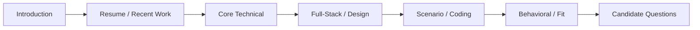
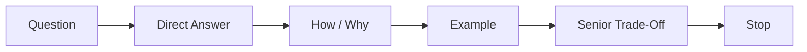
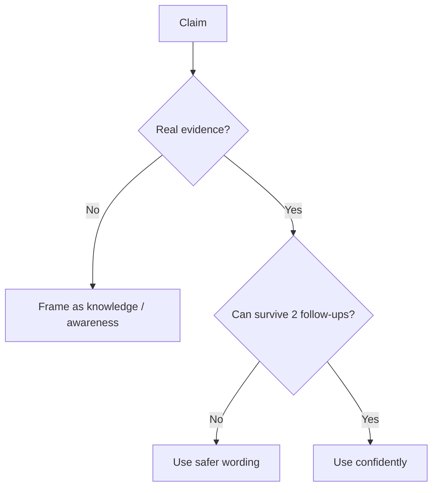
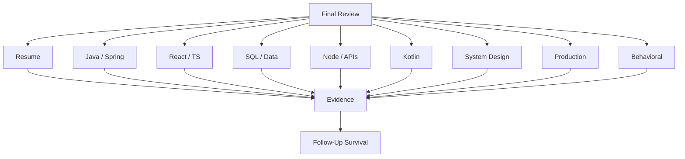
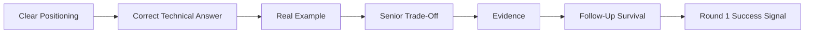

# VRIZE Interview Preparation — Pack 18
## Final Rapid Revision + 30-Minute Round 1 Strategy + High-Probability Question Bank

**Target Role:** Senior Fullstack Developer — Round 1  
**Candidate:** Deepak Kumar  
**Priority:** P0 — Final Consolidation  
**Timebox:** 90–120 minutes final review + later mock execution  
**Approach:** KIS + Evidence-First + High-Probability-First | No Bluff | No Last-Minute Overload  
**Mode:** Content Only — Live mock/scoring deferred until preparation packs are complete

---

## Readiness Gate

Before Round 1, you should be able to:

- Deliver your introduction in 60–90 seconds.
- Explain why you fit a hands-on Senior Fullstack Developer role despite architecture experience.
- Answer Java, Spring Boot, REST, React, SQL, Node.js, Kotlin, system design, security, testing, and debugging fundamentals.
- Handle at least two follow-ups on every claim you choose to make.
- Explain one real performance story, one production-debugging story, one security/quality story, and one leadership/stakeholder story.
- Write one clean coding solution while narrating your reasoning.
- Say “I have not used that in production” safely when appropriate.
- Defend résumé metrics only when you know the baseline, measurement method, timeframe, and your contribution.
- Keep answers concise enough for a 30-minute Round 1.

---

## 1. Objective

This pack consolidates Packs 01–17 into one final operating model.

The purpose is not to relearn everything.

The purpose is:

```text
Recall Faster
→ Answer Cleaner
→ Avoid Bluff
→ Survive Follow-Ups
→ Show Seniority
→ Protect Time
```

The interview is approximately 30 minutes, so the interviewer is likely trying to answer a small number of questions:

```text
Can he still code?
Is his Java/backend depth credible?
Can he work full stack?
Can he reason about production systems?
Does his résumé survive follow-ups?
Will he fit the role?
```

---

## 2. Real-Life Analogy

Think of the final interview as a qualifying lap.

You do not rebuild the engine on the starting grid.

You need:

- a stable machine,
- the right line,
- the right gear,
- no unnecessary risk.

Likewise, do not introduce a technology, metric, or project detail that creates five unnecessary follow-up questions.

Your best interview is:

```text
Clear Answer
+
Correct Depth
+
Real Evidence
+
Controlled Follow-Up
```

---

## 3. Visualization

### 3.1 Round 1 Flow



### 3.2 Senior Answer Flow



### 3.3 Evidence Filter



---

## 4. Final Concept Map

```mermaid
flowchart TD
    A[Round 1] --> B[Resume]
    A --> C[Backend]
    A --> D[Frontend]
    A --> E[Data]
    A --> F[Architecture]
    A --> G[Production]
    A --> H[Leadership]

    B --> B1[Introduction]
    B --> B2[Hands-On]
    B --> B3[Metrics]

    C --> C1[Java]
    C --> C2[Spring Boot]
    C --> C3[REST]
    C --> C4[Node.js]

    D --> D1[React]
    D --> D2[JavaScript]
    D --> D3[TypeScript]

    E --> E1[SQL]
    E --> E2[MongoDB]
    E --> E3[Redis / Neo4j]

    F --> F1[Microservices]
    F --> F2[System Design]
    F --> F3[Async / Kafka]

    G --> G1[Docker / Kubernetes]
    G --> G2[Security]
    G --> G3[Testing]
    G --> G4[Debugging]

    H --> H1[Code Review]
    H --> H2[Mentoring]
    H --> H3[Stakeholders]
```



---

## 5. 30-Minute Round 1 Strategy

A possible flow is:

```text
0–3 min
Introduction + recent work

3–10 min
Core technical depth

10–18 min
Full-stack/backend scenarios

18–24 min
Coding / design / debugging

24–28 min
Behavioral / fit / résumé follow-up

28–30 min
Your questions
```

This is not a guaranteed agenda.

It is a time-control model.

### Rule

> If a complete answer takes 40 seconds, do not turn it into four minutes.

---

## 6. Final 60–90 Second Introduction

> I’m a senior full-stack and solution engineering professional with broad experience across backend, frontend, mobile, cloud, and distributed systems. My recent hands-on work has been strongest in Node.js, TypeScript, React, MongoDB, Azure, APIs, Docker/Kubernetes, performance, security, CI/CD, and production support, while my earlier engineering background includes Java, Kotlin, Android, and broader backend technologies including Spring Boot. As my scope grew, I also took ownership of architecture, code reviews, mentoring, stakeholder discussions, and delivery, but I have remained close to implementation and troubleshooting. I’m now looking for a senior engineering role where I can combine hands-on full-stack contribution with that broader technical ownership.

Do not add unsupported recent Spring Boot, Kafka, KMP, or Laravel project claims.

---

## 7. “Are You Still Hands-On?”

> Yes. My recent work has included hands-on backend and full-stack engineering with Node.js, TypeScript, React, APIs, MongoDB, Azure, Docker/Kubernetes, performance tuning, security remediation, CI/CD, and production troubleshooting. My architecture responsibilities grew around that engineering work rather than replacing it.

Be ready for:

- last code change,
- last API change,
- last bug,
- last performance issue,
- last code review.

Use only real examples.

---

## 8. Why Senior Fullstack Developer?

> My seniority has expanded my scope, but it has not moved me away from engineering. I still enjoy implementation, design, debugging, performance work, code reviews, and production problem-solving. This role is a strong fit because I can contribute directly in full-stack delivery while also bringing architecture and mentoring maturity when needed.

---

## 9. Why VRIZE?

> The role aligns well with the combination I bring: senior full-stack engineering, Java/Kotlin background, React and Node.js experience, APIs, databases, cloud, production engineering, and architecture-level thinking. The broader digital-platform and engineering focus also suits my experience working across application layers rather than only one narrow technology.

Keep this concise.

---

## 10. Priority Matrix

### P0 — Must Answer Confidently

```text
Introduction
Java OOP / Collections
HashMap
equals / hashCode
Concurrency basics
Spring Boot / DI
REST
Microservices
React hooks
JavaScript async
TypeScript
SQL joins / indexes / transactions
Node.js event loop
System design
Kotlin fundamentals
Security
Testing
Debugging
Code review
```

### P1 — Strong Follow-Up Coverage

```text
Kafka
Kubernetes
CI/CD
Redis
MongoDB
Neo4j
Coroutines
KMP concepts
JPA
JVM
Caching
Circuit breaker
Observability
```

### P2 — Awareness / Gap Defense

```text
Laravel
deep KMP implementation
advanced Kafka internals
advanced Kubernetes scheduling
deep Python runtime internals
multi-region architecture
production sharding
```

---

## 11. Java Rapid Revision

```text
JDK
development kit

JVM
executes bytecode

OOP
encapsulation / abstraction / inheritance / polymorphism

COMPOSITION
often safer than deep inheritance

equals/hashCode
equal objects must produce same hashCode

IMMUTABILITY
stable object state

HASHMAP
hash -> bucket -> equality

ARRAYLIST
fast indexed access

LINKEDLIST
no O(1) indexed access

HASHSET
membership / uniqueness

COMPARABLE
natural order

COMPARATOR
custom order
```

High-probability questions:

1. HashMap internals?
2. `equals()` / `hashCode()` contract?
3. ArrayList vs LinkedList?
4. HashMap vs ConcurrentHashMap?
5. Why String immutable?
6. Checked vs unchecked exception?
7. Composition vs inheritance?
8. Interface vs abstract class?
9. SOLID?
10. Java pass-by-value?

---

## 12. Java Concurrency Rapid Revision

```text
THREAD
execution unit

RACE CONDITION
result depends on timing

synchronized
mutual exclusion + visibility semantics

volatile
visibility/order, not compound atomicity

ATOMIC
atomic operations for selected cases

EXECUTOR
managed task execution

DEADLOCK
circular resource wait

COMPLETABLEFUTURE
compose async stages
```

Golden trap:

```java
count++;
```

is not made atomic merely by declaring `count` volatile.

---

## 13. Spring Boot Rapid Revision

```text
SPRING
IoC / DI ecosystem

SPRING BOOT
conventions + auto-configuration

DI
dependencies supplied externally

BEAN
container-managed object

@RestController
HTTP endpoint layer

@Service
application/business layer

@Repository
persistence role

DTO
API contract

JPA
persistence abstraction

TRANSACTION
atomic DB unit of work

SECURITY
authentication + authorization
```

High-probability questions:

1. Spring vs Spring Boot?
2. IoC / DI?
3. Constructor injection?
4. Bean?
5. `@RestController`?
6. DTO vs entity?
7. Lazy vs eager?
8. N+1?
9. `@Transactional`?
10. 401 vs 403?

Evidence rule:

> Spring Boot is a broader competency; do not tie it to a recent named project unless validated.

---

## 14. REST + Microservices Rapid Revision

```text
GET
read

POST
create/action

PUT
idempotent replacement/update semantics

PATCH
partial change

DELETE
remove

200
success

201
created

204
success without body

400
invalid request

401
authentication

403
authorization

404
not found

409
conflict

429
rate limit

500
unexpected server failure
```

Microservices:

```text
clear boundaries
independent deployment
data ownership
sync / async communication
failure isolation
observability
```

Do not say:

> Microservices are always more scalable.

---

## 15. Kafka / Event-Driven Rapid Revision

```text
TOPIC
event stream category

PARTITION
ordering/scaling unit

PRODUCER
writes

CONSUMER
reads

CONSUMER GROUP
shares partitions

OFFSET
consumer position

AT-LEAST-ONCE
duplicates possible

IDEMPOTENT CONSUMER
duplicate delivery does not duplicate business effect

LAG
consumer falling behind
```

Evidence rule:

> Use Kafka as technical/architecture knowledge unless real production ownership is confirmed.

---

## 16. React Rapid Revision

```text
COMPONENT
UI unit

PROPS
parent input

STATE
changing local data

KEY
stable list identity

CONTROLLED INPUT
React state controls value

useState
local state

useEffect
synchronize with external systems

useRef
mutable ref without render

useMemo
memoize computed value

useCallback
memoize function identity

CONTEXT
shared dependency/state

useReducer
structured state transitions
```

Critical answer:

> I use `useEffect` to synchronize React with something outside React. I avoid using it for values that can be calculated during render.

---

## 17. JavaScript + TypeScript Rapid Revision

```text
let
block-scoped mutable binding

const
block-scoped non-reassignable binding

closure
function retains lexical environment

Promise
eventual async result

async/await
Promise syntax

microtask
Promise continuation scheduling

event loop
coordinates async callbacks/tasks
```

TypeScript:

```text
interface
object contract

type
general alias/composition

union
one of several types

generic
type parameter

unknown
must narrow

any
opts out of type safety
```

Golden rule:

> TypeScript does not validate runtime HTTP JSON.

---

## 18. Node.js Rapid Revision

```text
NODE
JavaScript runtime

V8
JavaScript engine

EVENT LOOP
coordinates JS callbacks/completions

libuv
async I/O/event-loop infrastructure

ASYNC I/O
event loop remains free while waiting

CPU HEAVY
can block main JS thread

Promise.all
concurrent independent work; control fan-out

STREAM
incremental data processing

BACKPRESSURE
producer slows for consumer

WORKER THREAD
CPU-heavy JS work

GRACEFUL SHUTDOWN
stop traffic -> drain -> close -> exit
```

High-probability questions:

1. Is Node single-threaded?
2. Event loop?
3. What blocks it?
4. Promise vs `async/await`?
5. `Promise.all`?
6. Streams?
7. Backpressure?
8. Worker threads?
9. Express middleware?
10. Memory leak diagnosis?

---

## 19. SQL Rapid Revision

```text
PRIMARY KEY
row identity

FOREIGN KEY
relationship/integrity

INNER JOIN
matching rows

LEFT JOIN
all left + matches

WHERE
filter rows

HAVING
filter groups

GROUP BY
aggregate groups

WINDOW FUNCTION
analytics without collapsing rows

INDEX
faster access + write/storage cost

COMPOSITE INDEX
column order matters

EXECUTION PLAN
database access strategy

ACID
transaction guarantees

ISOLATION
concurrent transaction behavior

DEADLOCK
circular lock wait

OFFSET
simple pagination

KEYSET
scalable sequential pagination
```

---

## 20. MongoDB + Redis + Neo4j Rapid Revision

### MongoDB

```text
document model
embed vs reference
indexes by access pattern
aggregation
schema discipline still matters
```

### Redis

```text
cache
TTL
invalidation
cache-aside
stampede
hot key
```

### Neo4j

```text
nodes
relationships
multi-hop traversal
relationship-heavy queries
```

Senior answer:

> Choose the datastore according to data shape, consistency requirements, access pattern, and operational cost.

---

## 21. Kotlin Rapid Revision

```text
val
read-only reference

var
reassignable

String?
nullable

?.
safe call

?:
fallback

!!
assert non-null carefully

data class
value-style model

sealed type
controlled hierarchy

coroutine
suspendable computation

suspend
may suspend; not automatically background

launch
Job

async
Deferred

withContext
switch context and return result

StateFlow
current state

SharedFlow
shared hot stream
```

KMP:

```text
share Kotlin logic
common source set
platform-specific source sets
expect / actual where appropriate
native UI can remain native
```

Do not claim production KMP unless real.

---

## 22. System Design Rapid Revision

Use:

```text
Requirements
→ Scale
→ API / Data
→ High-Level Design
→ Critical Flow
→ Bottleneck
→ Failure
→ Security
→ Observability
→ Trade-Off
```

Core terms:

```text
horizontal scaling
stateless service
load balancer
CDN
cache
read replica
queue
backpressure
timeout
retry
circuit breaker
bulkhead
idempotency
graceful degradation
```

Golden rule:

> Scale the bottleneck, not the diagram.

---

## 23. Docker + Kubernetes + CI/CD Rapid Revision

Docker:

```text
image
immutable package

container
running image

multi-stage
keep build tools out of runtime image
```

Kubernetes:

```text
Pod
deployable unit

Deployment
replicas + rollout

Service
stable networking

Ingress
HTTP routing

Readiness
receive traffic?

Liveness
restart needed?

Request
scheduler expectation

Limit
resource cap
```

CI/CD:

```text
build
test
scan
package
deploy
verify
rollback
```

Golden rule:

> Build once and promote the same artifact.

---

## 24. Security Rapid Revision

```text
AUTHENTICATION
who are you?

AUTHORIZATION
what may you do?

SQL INJECTION
parameterized query

XSS
untrusted content executes in browser

CSRF
unwanted authenticated browser action

CORS
browser cross-origin policy

SSRF
server tricked into unintended request

PASSWORD
adaptive salted hash

SECRET
not source / image / log

LEAST PRIVILEGE
minimum required access
```

---

## 25. Testing + Code Review Rapid Revision

Testing:

```text
UNIT
focused logic

INTEGRATION
components together

CONTRACT
producer/consumer agreement

E2E
critical journey

REGRESSION
bug should not return

LOAD
expected traffic

STRESS
beyond capacity

SOAK
sustained load
```

Coverage:

> Signal, not quality guarantee.

Review priority:

```text
Correctness
→ Security
→ Data Integrity
→ Tests
→ Reliability
→ Performance
→ Maintainability
→ Style
```

---

## 26. Debugging Rapid Revision

```text
Symptom
→ Reproduce
→ Trace
→ Isolate
→ Evidence
→ Root Cause
→ Fix
→ Verify
→ Prevent Regression
```

Layer path:

```text
Browser
→ React
→ Gateway
→ API
→ Service
→ Cache / DB
→ External Service
→ Infrastructure
```

Golden rule:

> A status code or slow page is a symptom, not the root cause.

---

## 27. Behavioral Rapid Revision

STAR+:

```text
Situation
Task
Action
Result
+ technical decision / learning
```

Conflict:

```text
understand
→ criteria
→ evidence
→ decide
→ commit
```

Stakeholder:

```text
business outcome
→ technical risk
→ options
→ trade-off
```

Mentoring:

```text
ask reasoning
→ guide
→ review
→ increase ownership
```

Failure:

```text
own
→ correct
→ learn
→ change behavior
```

---

## 28. Resume Metric Defense

For every metric, know:

```text
What system?
What baseline?
What changed?
How measured?
What period?
What did YOU do?
```

High-risk résumé metrics include:

```text
99.9% availability
30% latency reduction
<200ms response time
60% faster release
60% -> 90% coverage
40% fewer production defects
120+ reviews monthly
```

If you cannot defend a number:

> do not lead with it.

---

## 29. Red-Flag Technology Claims

| Claim | Safe Position |
|---|---|
| Spring Boot | Broader competency; validate recent named project |
| Kafka | Technical knowledge unless production ownership confirmed |
| KMP | Knowledge unless production implementation confirmed |
| Laravel | Framework familiarity unless real production experience |
| Python async | Validate production depth |
| Redis | Competency; validate exact real use case |
| Multi-region | Do not claim without evidence |
| Sharding | Conceptual unless real production ownership |

---

## 30. High-Probability Question Bank — Resume / Fit

1. Tell me about yourself.
2. What are you doing currently?
3. What was your role at Bechtel?
4. How hands-on are you?
5. Why Senior Fullstack Developer?
6. Why VRIZE?
7. Why did you leave?
8. Why not an architect role?
9. What is your strongest backend technology today?
10. What is your strongest frontend technology?
11. When did you last work with Java?
12. When did you last work with Kotlin?
13. Have you used Spring Boot recently?
14. Have you used KMP in production?
15. Have you used Laravel in production?
16. Which résumé metric can you defend best?
17. Difficult technical problem?
18. Production issue?
19. Performance improvement?
20. Security issue?

---

## 31. High-Probability Question Bank — Java / Spring

21. OOP?
22. Composition vs inheritance?
23. Interface vs abstract class?
24. `equals()` / `hashCode()`?
25. Why String immutable?
26. ArrayList vs LinkedList?
27. HashMap internals?
28. HashMap vs ConcurrentHashMap?
29. Comparable vs Comparator?
30. Checked vs unchecked exceptions?
31. `volatile`?
32. `synchronized`?
33. ExecutorService?
34. Spring vs Spring Boot?
35. IoC / DI?
36. Constructor injection?
37. Bean?
38. DTO vs entity?
39. Lazy vs eager?
40. N+1?
41. Transaction?
42. Spring Security?
43. 401 vs 403?

---

## 32. High-Probability Question Bank — React / JS / TS

44. Props vs state?
45. `useState`?
46. `useEffect`?
47. Cleanup?
48. `useMemo` vs `useCallback`?
49. `useRef`?
50. Controlled component?
51. Keys?
52. Context?
53. React performance?
54. Closure?
55. Promise?
56. Event loop?
57. `async/await`?
58. `Promise.all`?
59. `let` vs `const`?
60. interface vs type?
61. `unknown` vs `any`?
62. Generics?
63. Runtime validation?

---

## 33. High-Probability Question Bank — Data / Architecture

64. INNER vs LEFT JOIN?
65. WHERE vs HAVING?
66. Index?
67. Composite index?
68. Execution plan?
69. ACID?
70. Isolation?
71. Deadlock?
72. Offset vs keyset?
73. SQL vs NoSQL?
74. MongoDB embed vs reference?
75. Redis cache-aside?
76. Cache invalidation?
77. Neo4j use case?
78. Monolith vs microservices?
79. Sync vs async?
80. Eventual consistency?
81. Circuit breaker?
82. Idempotency?
83. API Gateway?
84. Kafka partition?
85. Consumer group?
86. Consumer lag?

---

## 34. High-Probability Question Bank — Production / Cloud

87. Docker vs VM?
88. Image vs container?
89. Multi-stage build?
90. Kubernetes Pod?
91. Deployment vs Service?
92. Readiness vs liveness?
93. OOMKilled?
94. CrashLoopBackOff?
95. CI vs CD?
96. Canary vs blue-green?
97. Logs vs metrics vs traces?
98. p95 vs p99?
99. Debug a slow API.
100. Debug CORS.
101. Debug 500.
102. Handle production incident.
103. Rollback strategy?
104. Secret management?
105. How do you scale?
106. What if DB is bottleneck?

---

## 35. High-Probability Question Bank — Kotlin / Mobile

107. Kotlin vs Java?
108. `val` vs `var`?
109. Null safety?
110. `?.`, `?:`, `!!`?
111. Data class?
112. Sealed class?
113. Extension function?
114. Coroutine?
115. `suspend`?
116. `launch` vs `async`?
117. `IO` vs `Default`?
118. Structured concurrency?
119. Flow?
120. StateFlow vs SharedFlow?
121. ViewModel?
122. Repository?
123. Android architecture?
124. KMP?
125. `expect` / `actual`?
126. KMP vs Compose Multiplatform?

---

## 36. High-Probability Question Bank — Leadership

127. Tell me about a disagreement.
128. Tell me about a failure.
129. Tell me about mentoring.
130. How do you review code?
131. How do you prioritize?
132. How do you handle ambiguity?
133. How do you balance delivery and quality?
134. How do you communicate risk?
135. How do you handle underperformance?
136. What would your team say about you?
137. What decision would you change today?
138. What do you do when your recommendation is rejected?

---

## 37. Coding Patterns — Final Recall

```text
FAST LOOKUP
HashMap / HashSet

PAIR / BOTH ENDS
Two pointers

CONTIGUOUS RANGE
Sliding window

RANGE SUM
Prefix sum

MONOTONIC SEARCH
Binary search

LIFO
Stack

FIFO / LEVEL
Queue / BFS

TOP K
Heap

TREE / GRAPH
DFS / BFS

CYCLE
Visited / slow-fast pointers
```

---

## 38. Coding Questions — Highest Value

Prioritize these:

1. Two Sum
2. Contains Duplicate
3. Valid Anagram
4. Valid Palindrome
5. Longest Substring Without Repeating Characters
6. Binary Search
7. Valid Parentheses
8. Reverse Linked List
9. Kth Largest
10. Merge Intervals
11. Tree Max Depth
12. BFS Level Order

For each, know:

```text
pattern
complexity
edge cases
clean Java implementation
```

---

## 39. Coding Interview Script

> I understand the problem as...

> Let me clarify...

> A simple solution is...

> That is O(...).

> The repeated work is...

> I can improve it using...

> I’ll code that now.

> Let me dry-run one case.

> One edge case is...

> Final complexity is...

Do not code silently.

---

## 40. Senior Follow-Up Traps

Be ready for:

1. How did you measure that?
2. What did **you** do?
3. Why did you choose that?
4. What alternative did you reject?
5. What went wrong?
6. What would you do differently now?
7. What if traffic becomes 10x?
8. What if dependency fails?
9. What if request is duplicated?
10. What if two users update the same data?
11. What if cache is stale?
12. What if Pod is running but not ready?
13. What if you do not know?
14. Where exactly did you use this technology?
15. Can you code it?

---

## 41. Answer Length Control

Definition question:

```text
20–40 seconds
```

Follow-up / trade-off:

```text
45–90 seconds
```

Project story:

```text
1.5–2.5 minutes
```

System design:

> expand only as interviewer asks.

Do not answer a 20-second question with a 5-minute lecture.

---

## 42. Core Answer Framework

Use:

```text
What
→ How / Why
→ Example
→ Senior Insight
→ Stop
```

Example:

> A circuit breaker stops repeatedly calling a failing dependency. It opens after repeated failures and fails fast for a period before probing recovery. In a payment-service outage, that protects caller resources from waiting for the same timeout repeatedly. I would combine it with finite timeout, controlled retry, and observability; the breaker does not fix the downstream service.

Then stop.

---

## 43. Evidence-Safe Language

Use:

> “In my recent work…”

only for recent evidence.

Use:

> “My broader backend experience includes…”

for broader competencies.

Use:

> “I understand the pattern…”

for knowledge.

Use:

> “I have not used that in production…”

when necessary.

Avoid:

> “We used everything.”

---

## 44. Technology Gap Script

> I have not used that specific technology deeply in production, so I would not overstate it. I understand the core architecture and can map it to technologies I have used. My ramp-up would mainly be framework-specific conventions rather than learning the underlying engineering problem from zero.

Useful for:

- KMP,
- Laravel,
- advanced Kafka,
- specialized cloud services.

---

## 45. Candidate Questions

Choose one or two.

### Question 1

> What would you expect the person in this role to own technically during the first three months?

### Question 2

> Is the current application stack primarily Java/Kotlin with React, or does the team move across several backend stacks depending on the project?

### Question 3

> For this senior role, how do you balance hands-on implementation, code review, and architecture responsibilities?

---

## 46. Final Story Bank

Fill before live mock execution.

| Story | Real Example | Metric / Evidence | Follow-Up Ready? |
|---|---|---|---|
| Introduction | Career progression | Résumé | ___ |
| Performance | __________ | __________ | ___ |
| Production Incident | __________ | __________ | ___ |
| Security | __________ | __________ | ___ |
| Code Review | __________ | __________ | ___ |
| Stakeholder | __________ | __________ | ___ |
| Mentoring | __________ | __________ | ___ |
| Failure / Learning | __________ | __________ | ___ |

Blank is safer than invented.

---

## 47. Final Red-Flag Checklist

Do not:

- claim Bechtel Spring Boot without validation,
- claim production KMP without validation,
- claim Kafka production ownership without validation,
- claim Laravel production ownership without validation,
- quote 99.9% without a measurement story,
- quote 30% latency reduction without before/after evidence,
- quote 60% release improvement without baseline,
- invent team size,
- invent Azure services,
- invent p95/p99,
- invent RPS,
- invent client names,
- invent production incidents.

---

## 48. Final Confidence Checklist

```text
I can explain my career in <90 sec

I can explain my current hands-on stack

I can answer P0 fundamentals

I can code one clean problem

I can explain one system design

I can debug one end-to-end scenario

I have four real stories

I can defend every metric I use

I can say “I don’t know” safely

I can stop when the answer is complete
```

---

## 49. Practical / Mini Mock Content

This section is for later execution only.

### Round 1 Simulation A

1. Tell me about yourself.
2. Are you still hands-on?
3. How does HashMap work?
4. Spring vs Spring Boot?
5. Explain `useEffect`.
6. Explain database index.
7. Node.js event loop?
8. Design a scalable API.
9. Tell me about a production issue.
10. Why VRIZE?

### Round 1 Simulation B

1. Tell me about your recent project.
2. Java concurrency?
3. JPA N+1?
4. REST idempotency?
5. React performance?
6. SQL isolation?
7. Docker/Kubernetes?
8. Debug a slow page.
9. Tell me about a disagreement.
10. What questions do you have?

### Pressure Set

1. Where exactly did you use Spring Boot?
2. Have you used Kafka in production?
3. Have you built KMP production apps?
4. Why does your résumé say 99.9%?
5. How did you calculate 30% latency reduction?
6. Why should we choose you over someone with very recent Java-only depth?
7. Are you overqualified?
8. Can you code now?
9. What technical decision do you regret?
10. What if we need Laravel next month?

---

## 50. Quick Revision



---

## 51. 2-Minute Ultra-Rapid Revision

```text
INTRO
senior full-stack + hands-on + architecture maturity

JAVA
OOP, HashMap, equals/hashCode, collections, concurrency

SPRING
DI, REST, JPA, transaction, security

REACT
state, effect, memoization, API state

JS/TS
event loop, Promise, closure, unknown vs any

SQL
join, index, plan, ACID, isolation

NODE
event loop, async I/O, streams, graceful shutdown

KOTLIN
null safety, coroutine, Flow, KMP concept

SYSTEM DESIGN
requirements -> scale -> bottleneck -> failure -> trade-off

K8S
Pod, Deployment, Service, readiness/liveness

SECURITY
authentication != authorization

TESTING
unit + integration + focused E2E; coverage != quality

DEBUGGING
reproduce -> trace -> isolate -> fix -> verify

BEHAVIORAL
ownership + decision + result + learning

EVIDENCE
no metric without measurement story

NO BLUFF
knowledge is not production experience
```

---

## 52. Candidate Answer Mapping

| Area | Interview Position | Risk |
|---|---|---|
| Node.js / TypeScript | Strong recent | Low |
| React | Strong recent | Low |
| MongoDB / Azure | Strong recent | Low |
| Java / Kotlin | Strong broader engineering background | Low |
| Spring Boot | Broader competency; named recent project must be validated | Medium |
| SQL | Strong competency | Low |
| System Design | Strong senior positioning | Low |
| Docker / Kubernetes / CI/CD | Supported | Low |
| Security / Code Review | Strong evidence | Low |
| Kafka | Knowledge unless production ownership confirmed | Medium |
| KMP | Knowledge unless production implementation confirmed | High if overclaimed |
| Laravel | Gap-defense / framework knowledge | High if overclaimed |
| 99.9% / 30% metrics | Use only with measurement story | Medium |

---

## 53. Final Visualization



---

## Golden Rules

> **Do not try to prove your entire career in 30 minutes.**

> **Answer the question that was asked.**

> **Start simple and go deeper only when invited.**

> **Every strong claim should survive “Why?”, “How?”, “What did you do?”, and “How measured?”**

> **Use architecture experience to strengthen hands-on credibility, not replace it.**

> **Do not bluff a framework, metric, project, client, team size, or production incident.**

> **If you do not know something, say so precisely and map it to what you do know.**

> **The goal is interviewer trust, not maximum vocabulary.**

For Round 1:

> **Clear → Correct → Concrete → Senior → Evidence**
