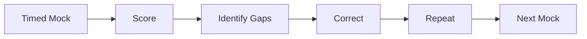
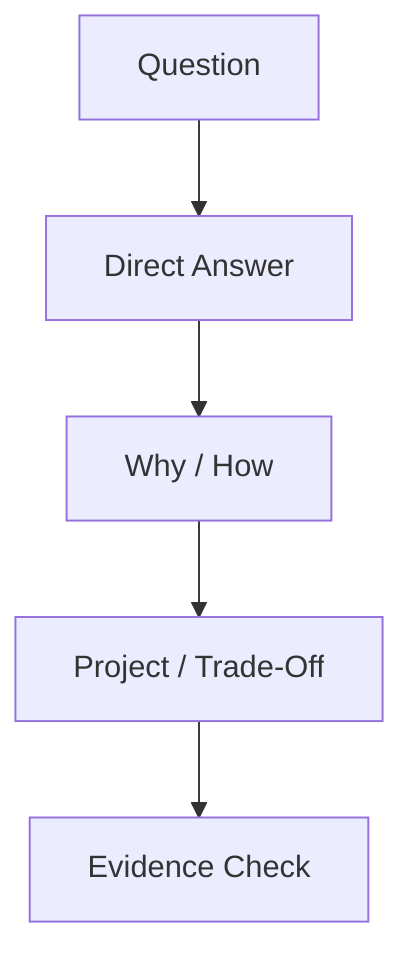
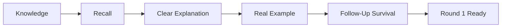
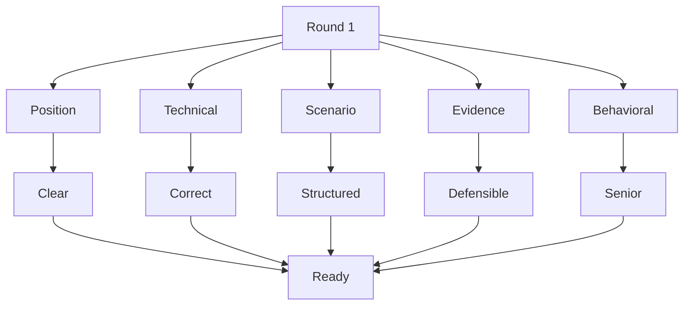
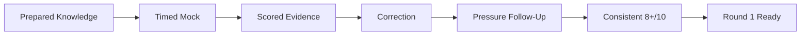

# VRIZE Interview Preparation — Pack 19
## Round 1 Mock Interview Scripts + Scoring Rubric + Readiness Gates

**Target Role:** Senior Fullstack Developer — Round 1  
**Candidate:** Deepak Kumar  
**Interview Duration:** ~30 minutes  
**Priority:** P0 — Execution Pack  
**Timebox:** 5 timed mocks × 30 minutes + correction cycles  
**Approach:** Evidence-First | Interviewer-Style | No Bluff | Follow-Up Survival  
**Mode:** Mock content prepared; live execution/scoring can be done separately

---

## Readiness Gate

A mock is considered **Round-1 Ready** only when you can:

- Introduce yourself in 60–90 seconds.
- Answer core P0 questions without notes.
- Keep normal technical answers under 90 seconds.
- Give project stories with clear personal ownership.
- Survive at least two follow-ups on strong claims.
- Avoid unsupported technology and metric claims.
- Write/explain one clean coding solution under pressure.
- Debug one production scenario structurally.
- Explain one architecture trade-off.
- Score at least **8/10 overall** with no red-flag category.

---

## 1. Objective

This pack moves preparation from:

```text
Knowledge
→ Recall
→ Interview Delivery
→ Follow-Up Survival
→ Readiness
```

A strong 30-minute Round 1 needs:

```text
Correctness
+
Clarity
+
Evidence
+
Seniority
+
Time Control
```

---

## 2. Real-Life Analogy

Reading interview content is like learning driving theory.

A mock is actual traffic.

It tests whether knowledge remains available when:

- time is short,
- the interviewer interrupts,
- follow-ups are unexpected,
- a weaker technology appears,
- a résumé metric is challenged.

---

## 3. Visualization







---

## 4. Scoring Model

Score each answer on five dimensions:

| Dimension | Score | Good Signal |
|---|---:|---|
| Technical Correctness | 0–2 | Correct, no contradiction |
| Clarity | 0–2 | Structured and concise |
| Senior Depth | 0–2 | Trade-offs and production awareness |
| Evidence | 0–2 | Real evidence when claimed |
| Follow-Up Survival | 0–2 | Handles probing safely |

Maximum:

```text
10
```

### Score Interpretation

```text
9–10  Strong Hire Signal
8     Round-1 Ready
6–7   Borderline
4–5   Weak
0–3   Red Flag
```

---

## 5. Automatic Red Flags

Mark the mock **Not Ready** if any of these occur:

- inventing production experience,
- contradicting the résumé,
- quoting a metric without measurement story,
- confusing authentication and authorization,
- saying Node.js is simply single-threaded,
- saying `volatile` makes `count++` atomic,
- saying microservices are always more scalable,
- saying CORS secures an API,
- saying Kubernetes Service creates Pods,
- claiming production KMP/Laravel/Kafka without validation,
- giving only managerial answers for a hands-on role.

---

## 6. Answer Scoring Template

For every answer record:

```text
Question:
Score:
Correctness:
Clarity:
Senior Depth:
Evidence:
Follow-Up Survival:
Correction:
```

---

## 7. Mock 1 — Resume + Java + Spring + React

**Duration:** 30 minutes

### Opening

1. Tell me about yourself.
2. What are you working on currently?
3. You have architecture experience. Why Senior Fullstack Developer?

### Java

4. How does HashMap work internally?
5. Explain the `equals()` / `hashCode()` contract.
6. ArrayList vs LinkedList?
7. `volatile` vs `synchronized`?

### Spring / REST

8. Spring vs Spring Boot?
9. Explain dependency injection.
10. DTO vs entity?
11. What is N+1?
12. PUT vs PATCH?
13. What is idempotency?

### React / TypeScript

14. Props vs state?
15. What exactly should `useEffect` be used for?
16. `useMemo` vs `useCallback`?
17. `unknown` vs `any`?
18. Why does TypeScript not validate HTTP input?

### Closing

19. Tell me about a recent production issue.
20. Why VRIZE?
21. What questions do you have?

### Pressure Follow-Ups

HashMap:

- What happens after collision?
- Why must equal objects have same hash code?
- What happens with a mutable key?

Spring:

- Why constructor injection?
- How does `@Transactional` work conceptually?
- Why can proxy/self-invocation matter?

React:

- What if effect dependencies are wrong?
- Why can an effect run more than expected?
- When can memoization hurt?

Résumé:

- What did **you** do?
- How was it measured?

---

## 8. Mock 2 — Node.js + SQL + Microservices + Production

**Duration:** 30 minutes

### Node.js

1. What is Node.js?
2. Is Node.js single-threaded?
3. Explain the event loop.
4. What blocks the event loop?
5. Sequential `await` vs `Promise.all`?
6. Streams?
7. Backpressure?

### SQL

8. INNER JOIN vs LEFT JOIN?
9. WHERE vs HAVING?
10. What is an index?
11. Why not index every column?
12. Composite index?
13. ACID?
14. What causes deadlock?

### Microservices

15. Monolith vs microservices?
16. Sync vs async?
17. Circuit breaker?
18. Why idempotency?
19. Eventual consistency?

### Production

20. An API becomes slow. How do you debug it?
21. DB saturates after adding app replicas. Why?
22. Tell me about a real performance improvement.

### Pressure Follow-Ups

- Does every async Node operation use the libuv thread pool?
- When would you use worker threads?
- What is event-loop lag?
- Why may an index not be used?
- Offset vs keyset?
- How do retries create overload?

---

## 9. Mock 3 — Kotlin + Android + KMP + System Design

**Duration:** 30 minutes

### Kotlin

1. Kotlin vs Java?
2. `val` vs `var`?
3. Nullable types?
4. Why is `!!` risky?
5. Data class?
6. Sealed type?

### Coroutines

7. What is a coroutine?
8. What does `suspend` mean?
9. `launch` vs `async`?
10. `Dispatchers.IO` vs `Default`?
11. Structured concurrency?

### Android / KMP

12. Android architecture?
13. ViewModel?
14. StateFlow?
15. What is KMP?
16. KMP vs Compose Multiplatform?
17. Have you used KMP in production?

### System Design

18. Design a document-processing service.
19. Sync vs async processing?
20. Where would caching help?
21. What if a dependency becomes slow?
22. How would you observe it?

### Safe KMP Gap Answer

> I have strong Kotlin/Android background and understand KMP architecture, including shared and platform-specific source sets. I would not claim a production KMP implementation unless discussing a project where I actually delivered it. My practical strength is that the underlying mobile architecture and Kotlin concepts are already familiar.

---

## 10. Mock 4 — Security + Testing + Debugging + Leadership

**Duration:** 30 minutes

### Security

1. Authentication vs authorization?
2. How do you secure REST APIs?
3. SQL injection?
4. XSS?
5. CORS vs CSRF?
6. Least privilege?

### Testing

7. Unit vs integration?
8. Contract testing?
9. What belongs in E2E tests?
10. Is 90% coverage necessarily good?
11. How do you handle flaky tests?

### Debugging

12. React page is slow. What do you check?
13. API returns 500. What do you do?
14. Browser reports CORS failure.
15. Connection pool exhausted.
16. New release increases latency.

### Leadership

17. Tell me about a disagreement.
18. How do you prioritize?
19. How do you mentor?
20. Tell me about a mistake.
21. How do you balance speed and quality?

---

## 11. Mock 5 — Final Pressure Round

**Duration:** 30 minutes

1. Are you overqualified?
2. When did you last write Java?
3. Where exactly did you use Spring Boot recently?
4. Have you used Kafka in production?
5. Have you built a production KMP application?
6. How much Laravel production experience do you have?
7. Your résumé says 99.9% availability. How was it measured?
8. You claim 30% latency reduction. What changed?
9. How did you prove the improvement?
10. Why hire you over someone with only recent Java/Spring depth?
11. What technical decision would you change today?
12. What is one weakness?
13. Can you still code daily?
14. What if your architecture recommendation is rejected?
15. What would your last team say about you?

---

## 12. Coding Drill — Two Sum

Expected flow:

```text
Clarify
→ O(n²) baseline
→ repeated complement lookup
→ HashMap
→ O(n) average
→ O(n) space
→ code
→ dry-run
```

Scoring:

- correct HashMap logic,
- no same-index reuse,
- complexity,
- edge cases,
- clear naming.

---

## 13. Coding Drill — Longest Unique Substring

Pattern:

```text
Sliding Window
+
Last Seen Index
```

Expected:

```text
Time: O(n)
Space: O(min(n, charset))
```

Follow-up:

> Why use `Math.max(left, lastSeen + 1)`?

Because the left boundary must never move backward.

---

## 14. Coding Drill — Valid Parentheses

Pattern:

```text
Stack / Deque
```

Expected:

```text
Time: O(n)
Space: O(n)
```

Follow-up:

> Why prefer `ArrayDeque` over legacy `Stack` in modern Java?

---

## 15. Coding Drill — Reverse Linked List

Pattern:

```text
previous
current
next
```

Expected:

```text
Time: O(n)
Space: O(1)
```

Follow-up:

> Recursive version still takes O(n) time but consumes O(n) stack in worst case.

---

## 16. System Design Drill — Scalable API

Prompt:

> Design a scalable API for a high-read application.

Expected:

```text
Requirements
→ Traffic / Latency
→ Stateless App
→ Load Balancer
→ Database
→ Cache
→ Read Scaling
→ Failure Handling
→ Observability
→ Trade-Off
```

Follow-ups:

- What if cache is unavailable?
- What if DB is bottleneck?
- What if traffic increases 10x?
- Why not shard immediately?
- What would you monitor?

---

## 17. System Design Drill — Document Processing

Prompt:

> A user uploads a document that may take 30 seconds to process.

Expected:

```text
Upload
→ Validate
→ Persist Metadata
→ Queue
→ Return Accepted / Status
→ Worker
→ Update State
→ Poll / Notify
```

Discuss:

- idempotency,
- retries,
- failed jobs,
- storage,
- observability.

---

## 18. Debugging Drill — Slow Page

Prompt:

> A React page takes five seconds to open.

Expected:

```text
Browser Network Timing
→ Render/Profile Timing
→ API Latency
→ Trace
→ Backend
→ DB / External Service
→ Fix Measured Bottleneck
```

Red flag:

> jumping directly to `useMemo`.

---

## 19. Debugging Drill — 500 After Deployment

Expected:

```text
Trace ID
→ Logs
→ Deployment Diff
→ Config / Secret
→ DB Migration
→ Dependency
→ Rollback if Needed
→ Root Cause
→ Regression Protection
```

---

## 20. Metric Defense Drill

For each metric:

```text
System
→ Baseline
→ Change
→ Measurement
→ Timeframe
→ Personal Contribution
→ Result
```

### 99.9% Availability

Ask:

- What period?
- What counted as unavailable?
- Observed result, SLO, or SLA?
- What monitoring supported it?

### 30% Latency Reduction

Ask:

- average or percentile?
- endpoint/workload?
- before/after?
- same conditions?
- what change mattered most?

### 60% Faster Release

Ask:

- deployment time or release lead time?
- before/after?
- what was automated?
- team or personal metric?

---

## 21. Follow-Up Survival Rule

For any strong claim, expect:

```text
Why?
How?
What did YOU do?
What alternative?
How measured?
What failed?
What would you change?
```

If the claim cannot survive these:

> simplify it before the real interview.

---

## 22. Answer Length Targets

| Question Type | Target |
|---|---:|
| Definition | 20–40 sec |
| Technical Explanation | 45–90 sec |
| Trade-Off | 45–90 sec |
| Project Story | 90–150 sec |
| System Design | Interactive expansion |
| Coding | Narrate continuously |

---

## 23. Interruption Handling

If interviewer interrupts:

> Stop and follow the new direction.

Do not insist on finishing a prepared speech.

Interruption often means the interviewer already heard enough.

---

## 24. Unknown Question Handling

Use:

> I have not used that specific feature deeply in production, so I would not overstate it. My understanding is [short correct concept]. The closest real experience I can map it to is [real adjacent concept].

---

## 25. Contradiction Check

Before making a project claim:

```text
Was this really my project?
Was this really the technology?
Was this really my contribution?
Was this really the metric?
```

If uncertain:

> use safer wording.

---

## 26. Round 1 Evaluation Sheet

| Category | Score /10 | Notes |
|---|---:|---|
| Introduction / Positioning | ___ | __________ |
| Java | ___ | __________ |
| Spring / REST | ___ | __________ |
| React / TypeScript | ___ | __________ |
| SQL / Data | ___ | __________ |
| Node.js | ___ | __________ |
| Kotlin / Mobile | ___ | __________ |
| System Design | ___ | __________ |
| Security / Testing | ___ | __________ |
| Debugging | ___ | __________ |
| Leadership | ___ | __________ |
| Evidence / Resume Defense | ___ | __________ |
| Time Control | ___ | __________ |

---

## 27. Overall Readiness Formula

Recommended weighting:

```text
Technical Correctness      30%
Evidence / Resume Defense  20%
Communication              15%
Senior Judgment            15%
Follow-Up Survival         10%
Time Control               10%
```

Round-1 Ready:

```text
Overall >= 8.0 / 10
AND
No red-flag category
AND
Evidence >= 8
AND
P0 Technical >= 8
```

---

## 28. Correction Cycle

After every mock:

```text
Identify
→ Correct
→ Repeat Without Notes
→ Pressure Test
```

Classify weak answers:

```text
Wrong
Vague
Too Long
Unsupported
Weak Example
Follow-Up Failure
```

Correction format:

```text
What
→ How / Why
→ Example
→ Senior Insight
```

---

## 29. Readiness Gates by Topic

### Resume

Ready when:

- introduction <90 sec,
- recent stack clear,
- architecture strengthens hands-on positioning,
- metrics defensible.

### Java

Ready when:

- HashMap,
- collections,
- OOP,
- concurrency,
- JVM basics

can be explained without notes.

### Spring

Ready when:

- DI,
- REST controllers,
- DTO,
- JPA,
- transactions,
- security

are clear and project mapping is safe.

### React

Ready when:

- state,
- effects,
- memoization,
- API integration,
- TypeScript

are clear.

### SQL

Ready when:

- joins,
- indexes,
- plans,
- transactions,
- isolation

are clear.

### Production

Ready when:

- debugging is evidence-driven,
- rollback/containment are understood,
- no blind scaling.

---

## 30. Final P0 Question Set

These 25 should be answerable immediately:

1. Tell me about yourself.
2. Are you still hands-on?
3. HashMap internals?
4. `equals()` / `hashCode()`?
5. ArrayList vs LinkedList?
6. `volatile` vs `synchronized`?
7. Spring vs Spring Boot?
8. Dependency injection?
9. N+1?
10. REST idempotency?
11. Props vs state?
12. `useEffect`?
13. `useMemo` vs `useCallback`?
14. `unknown` vs `any`?
15. Node.js event loop?
16. What blocks Node?
17. INNER vs LEFT JOIN?
18. Index?
19. ACID?
20. Kotlin null safety?
21. Coroutine?
22. Horizontal scaling?
23. Authentication vs authorization?
24. Unit vs integration testing?
25. How do you debug a slow API?

---

## 31. Final Evidence Questions

1. What was your exact recent role?
2. What did you personally code?
3. What production issue did you solve?
4. What security issue did you fix?
5. What performance improvement did you make?
6. What did you mentor someone on?
7. What architecture decision did you own?
8. How was 99.9% measured?
9. How was 30% latency reduction measured?
10. What would you do differently today?

---

## 32. Final Candidate Questions

Use one or two:

> What would you expect the person in this role to own technically during the first three months?

> Is the current stack mainly Java/Kotlin with React, or does the team move across several backend stacks depending on the project?

> How do you balance hands-on implementation, code review, and architecture responsibilities for this senior role?

---

## 33. Quick Revision



---

## 34. 90-Second Rapid Revision

```text
INTRO
<90 sec

ANSWER
What -> How -> Example -> Senior Insight -> Stop

P0
Java
Spring
REST
React
TypeScript
SQL
Node
Kotlin
System Design
Security
Testing
Debugging

EVIDENCE
real example
personal contribution
measurement

FOLLOW-UP
Why?
How?
What did you do?
How measured?

GAP
admit
map
explain
do not bluff

CODING
clarify
baseline
optimize
code
test
complexity

DEBUGGING
reproduce
trace
isolate
fix
verify

BEHAVIORAL
ownership
decision
result
learning

READY
>= 8/10
no red flags
```

---

## 35. Candidate Answer Mapping

| Area | Readiness Target | Evidence Risk |
|---|---:|---|
| Introduction | 9/10 | Low |
| Java | 8+/10 | Low |
| Spring Boot | 8+/10 conceptual | Medium project mapping |
| React / TS | 8+/10 | Low |
| Node.js | 9/10 | Low |
| SQL | 8+/10 | Low |
| Kotlin | 8+/10 | Low |
| System Design | 8+/10 | Low |
| Security / Testing | 8+/10 | Low |
| Debugging | 9/10 | Low |
| Leadership | 8+/10 | Low |
| Kafka | 7+/10 knowledge | Medium |
| KMP | 7+/10 knowledge | High if overclaimed |
| Laravel | 6–7/10 knowledge | High if overclaimed |
| Resume Metrics | 9/10 if used | High if unsupported |

---

## 36. Final Visualization



---

## Golden Rules

> **A mock is useful only when answers are timed and scored.**

> **Do not reward a technically correct answer that contradicts the résumé.**

> **Do not reward confident bluffing.**

> **A senior answer should contain judgment, not only definition.**

> **Follow-up survival is more important than memorizing long answers.**

> **Correct weak answers immediately and repeat them without notes.**

> **Round 1 readiness requires consistency, not one excellent mock.**

Execution principle:

> **Mock → Score → Correct → Repeat → Pressure Test → Ready**
