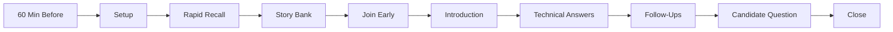
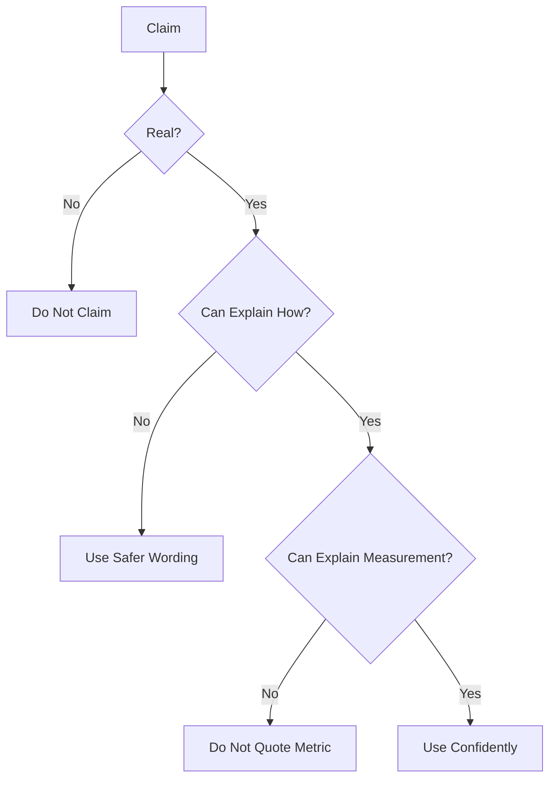
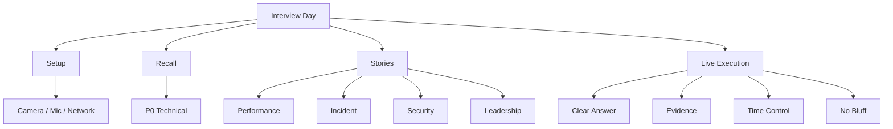
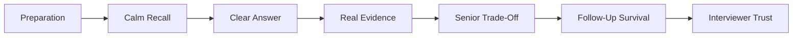

# VRIZE Interview Preparation — Pack 20
## Interview-Day War Room + Final 60-Minute Warm-Up + Live Answer Playbook

**Target Role:** Senior Fullstack Developer — Round 1  
**Candidate:** Deepak Kumar  
**Interview:** 20 August 2026 — 11:00 AM to 11:30 AM  
**Priority:** P0 — Final Execution  
**Timebox:** Final 60 minutes before interview + live 30-minute execution  
**Approach:** Calm Recall | KIS | Evidence-First | No Bluff | No Last-Minute Overload

---

## Readiness Gate

Before joining the interview:

- Laptop, charger, camera, microphone, browser, and meeting link are verified.
- Resume is open locally.
- Pack 20 is available for last-minute revision.
- Introduction is ready in under 90 seconds.
- One real performance story is ready.
- One real production-debugging story is ready.
- One real security/quality story is ready.
- One real leadership/stakeholder story is ready.
- Java, Spring, React, SQL, Node.js, Kotlin, system design, security, testing, and debugging P0 answers are recallable without notes.
- Any risky résumé metric you intend to mention has a measurement story.
- Unsupported Spring Boot/Kafka/KMP/Laravel claims are removed from your planned answers.
- You are ready to say: **“I have not used that deeply in production.”**

---

## 1. Objective

This pack is not for learning new topics.

Its job is:

```text
Stabilize
→ Recall
→ Position
→ Answer
→ Control Time
→ Protect Evidence
→ Close Strong
```

The final objective is interviewer trust.

Not maximum vocabulary.

---

## 2. Real-Life Analogy

The interview day is like deployment day.

You do not introduce a major new dependency ten minutes before production.

You:

- verify the build,
- check health,
- confirm rollback,
- monitor the critical path.

For the interview:

```text
Knowledge = Build
Resume = Release Artifact
Evidence = Health Check
Mock Practice = Staging
Interview = Production
```

Rule:

> **No last-minute architectural rewrite of your preparation.**

---

## 3. Visualization — Final Execution Flow



---

## 4. Final 60-Minute Plan

### T-60 to T-50 — Environment Check

Verify:

```text
Laptop power
Charger connected
Internet stable
Backup hotspot ready
Camera
Microphone
Earphones/headset
Meeting link
Browser permissions
Resume open
Notes minimized
Notifications off
Phone silent
```

Do not begin technical study yet.

---

### T-50 to T-40 — Resume Defense

Review only:

```text
Introduction
Current consulting
Bechtel
Virtusa
Java/Kotlin history
Recent Node/React/TypeScript work
Performance metric
Security story
Production story
Leadership story
```

Ask yourself:

```text
What did I do?
How did I do it?
How was it measured?
What follow-up can come next?
```

---

### T-40 to T-25 — P0 Technical Recall

Review only these anchors:

```text
Java
Spring Boot
REST
React
JavaScript / TypeScript
SQL
Node.js
Kotlin
System Design
Security
Testing
Debugging
```

Do not open deep Kafka, Laravel, or KMP notes unless there is a specific gap you already identified.

---

### T-25 to T-15 — Story Bank

Practice these four stories verbally:

1. Performance improvement.
2. Production issue.
3. Security / quality improvement.
4. Leadership / stakeholder decision.

Each story:

```text
Situation
→ Your Ownership
→ Technical Decision
→ Result
→ Learning
```

Maximum:

```text
90–120 seconds
```

---

### T-15 to T-10 — Coding Recall

Only mental patterns:

```text
HashMap
Two Pointers
Sliding Window
Binary Search
Stack
Queue / BFS
Heap
DFS
```

Do not solve a new hard problem.

---

### T-10 to T-5 — Ultra-Rapid Technical Recall

```text
HashMap
equals/hashCode
volatile vs synchronized
DI
N+1
REST idempotency
useEffect
Promise/event loop
SQL index
Node event loop
Kotlin null safety
coroutine
horizontal scaling
authentication vs authorization
unit vs integration
slow API debugging
```

---

### T-5 — Stop Studying

Do not read new material.

Open only:

```text
Meeting link
Resume
One-page rapid recall
```

Join early.

---

## 5. First 90 Seconds

### Greeting

Keep natural and short:

> Good morning. Thank you for the opportunity.

Do not begin a long speech until asked.

---

### Final Introduction

> I’m a senior full-stack and solution engineering professional with broad experience across backend, frontend, mobile, cloud, and distributed systems. My recent hands-on work has been strongest in Node.js, TypeScript, React, MongoDB, Azure, APIs, Docker/Kubernetes, performance, security, CI/CD, and production support, while my earlier engineering background includes Java, Kotlin, Android, and broader backend technologies including Spring Boot. As my scope grew, I also took ownership of architecture, code reviews, mentoring, stakeholder discussions, and delivery, but I have remained close to implementation and troubleshooting. I’m now looking for a senior engineering role where I can combine hands-on full-stack contribution with that broader technical ownership.

Stop.

Do not add a second introduction.

---

## 6. Answer Control Formula

Use:

```text
Direct Answer
→ Why / How
→ Example
→ Senior Trade-Off
→ Stop
```

Example:

**Question:** What is dependency injection?

> Dependency injection means an object receives its dependencies rather than constructing them internally. It reduces coupling and makes implementations easier to replace or test. In Spring, constructor injection is my default because dependencies are explicit and the object can be valid immediately after construction. I would still avoid creating abstractions where there is no real variation or testing benefit.

Stop.

---

## 7. Definition Question Rule

Target:

```text
20–40 seconds
```

Examples:

- What is HashMap?
- What is DI?
- What is CORS?
- What is coroutine?
- What is index?

Do not give project history unless asked.

---

## 8. Follow-Up Question Rule

Target:

```text
45–90 seconds
```

Use:

```text
Definition
→ Mechanism
→ Trade-Off
→ Example
```

---

## 9. Project Story Rule

Target:

```text
90–150 seconds
```

Use:

```text
Problem
→ Context
→ Your Decision
→ Your Implementation
→ Result
→ Learning
```

If the interviewer interrupts:

> Stop and follow the new direction.

---

## 10. If You Do Not Understand the Question

Use:

> Could you please clarify whether you mean the application-level behavior or the underlying runtime behavior?

or:

> Just to confirm, are you asking about the design trade-off or the implementation detail?

Clarification is better than answering the wrong question.

---

## 11. If You Need 5 Seconds to Think

Use:

> Let me structure that.

Then think:

```text
What?
How?
Example?
Trade-Off?
```

Do not fill silence with random technology names.

---

## 12. If You Do Not Know

Use:

> I have not used that specific feature deeply in production, so I would not overstate it. My understanding is that [short correct concept]. The closest experience I can map it to is [real adjacent technology or pattern].

This is a senior answer.

Not a failure.

---

## 13. Spring Boot Gap Defense

If asked:

> Where did you use Spring Boot recently?

Safe response:

> Spring Boot is part of my broader backend experience, but my most recent named enterprise work has been stronger in Node.js/TypeScript, React, MongoDB, and Azure. I am comfortable with Spring Boot architecture—DI, REST controllers, validation, JPA, transactions, security, and production patterns—but I would not attach it to a recent project unless that specific project actually used it.

---

## 14. Kafka Gap Defense

If asked:

> Have you used Kafka in production?

Use only the truth.

If not validated:

> I understand Kafka architecture including topics, partitions, consumer groups, offsets, delivery semantics, lag, idempotent consumers, retries, and event-driven trade-offs. I would not claim production Kafka ownership unless we are discussing a project where I actually implemented it.

---

## 15. KMP Gap Defense

> My background includes Kotlin and Android, and I understand KMP's shared-code model, source sets, platform-specific code, and the distinction between KMP and Compose Multiplatform. I would not claim a production KMP implementation unless I actually delivered one.

---

## 16. Laravel Gap Defense

> Laravel is not one of my strongest recent production frameworks. My backend depth is stronger in Node.js/TypeScript and Java/Spring concepts. I understand Laravel's routing, middleware, service container, validation, Eloquent, migrations, queues, and authorization model, so the main gap is framework-specific experience rather than backend fundamentals.

---

## 17. Metric Defense Formula

Never answer a metric only with the number.

Use:

```text
System
→ Baseline
→ Change
→ Measurement
→ Timeframe
→ My Contribution
```

---

## 18. 99.9% Availability Defense

Before using this metric, know:

```text
Which system?
What measurement window?
What counted as unavailable?
Observed availability or SLO/SLA?
Which monitoring source?
What did I change?
```

If not ready:

> Do not lead with the metric.

---

## 19. 30% Latency Reduction Defense

Know:

```text
Which endpoint/workload?
Before value?
After value?
Average / p95 / p99?
Same workload?
Measurement tool?
What technical change?
My contribution?
```

---

## 20. 60% Release Improvement Defense

Know:

```text
What was measured?
Deployment duration?
Lead time?
Release frequency?
Before?
After?
What automation changed?
Team contribution?
My contribution?
```

---

## 21. Java P0 Live Recall

### HashMap

> HashMap uses the key's hash to identify a bucket and then uses equality to locate the matching key inside that bucket. Average get/put is O(1) under good hash distribution. Correct `equals`/`hashCode` implementations are critical, and mutable keys can cause retrieval problems.

### `equals` / `hashCode`

> If two objects are equal according to `equals`, they must return the same hash code. Different objects may share a hash code.

### ArrayList vs LinkedList

> ArrayList provides O(1) indexed access and usually better locality. LinkedList has no O(1) indexed access; insertion is only O(1) after the node position is already known.

### `volatile` vs `synchronized`

> `volatile` provides visibility and ordering guarantees for the variable, but it does not make compound operations such as increment atomic. `synchronized` provides mutual exclusion and visibility around a critical section.

---

## 22. Spring P0 Live Recall

### Spring vs Spring Boot

> Spring is the broader framework ecosystem around IoC, DI, web, data, security, and other modules. Spring Boot adds conventions, auto-configuration, embedded runtime support, and production-friendly setup to reduce configuration overhead.

### Constructor Injection

> Constructor injection makes dependencies explicit, supports immutability, simplifies testing, and ensures the object receives required dependencies when created.

### N+1

> One query loads parent entities and then additional queries are triggered per entity for related data. I fix it using an appropriate fetch strategy, projection, batch/eager loading, or query redesign based on the use case.

---

## 23. React P0 Live Recall

### `useEffect`

> `useEffect` is for synchronizing React with external systems such as network subscriptions, timers, browser APIs, or other imperative systems. I avoid using it for values that can be derived during render.

### `useMemo` vs `useCallback`

> `useMemo` memoizes a calculated value; `useCallback` memoizes a function reference. I use them only when referential stability or expensive recalculation actually matters.

### Keys

> Keys provide stable identity for list elements so React can match previous and next elements correctly during reconciliation.

---

## 24. SQL P0 Live Recall

### Index

> An index is an auxiliary data structure that speeds selected reads by allowing the database to locate rows without scanning everything. It costs storage and write-maintenance overhead, so indexes should follow real access patterns.

### Composite Index

> A composite index covers multiple columns, and column order matters because the useful leading portion depends on query predicates and ordering.

### ACID

```text
Atomicity
Consistency
Isolation
Durability
```

### Deadlock

> A deadlock occurs when transactions wait on resources held by one another in a cycle. The database typically detects it and aborts one participant.

---

## 25. Node.js P0 Live Recall

### Event Loop

> Node.js executes normal JavaScript mainly on one event-loop thread, while asynchronous I/O is coordinated through the runtime, OS facilities, and libuv. It can handle high I/O concurrency efficiently as long as long CPU-heavy or synchronous work does not block the JavaScript thread.

### `Promise.all`

> Use it for independent operations that can run concurrently, but control fan-out because unbounded concurrency can overload databases or external services.

### Streams

> Streams process data incrementally rather than loading everything into memory, and backpressure controls producers when consumers cannot keep up.

---

## 26. Kotlin P0 Live Recall

### Null Safety

```text
String
→ non-null

String?
→ nullable

?.
→ safe call

?:
→ fallback

!!
→ assert non-null; risky if assumption is wrong
```

### Coroutine

> A coroutine is a suspendable computation. It runs on threads according to its context and can suspend and resume without requiring one blocked thread for the entire wait.

### `launch` vs `async`

> `launch` returns a Job for work without a result value; `async` returns Deferred for a value that is later awaited.

---

## 27. Security P0 Live Recall

### Authentication vs Authorization

```text
Authentication
→ Who are you?

Authorization
→ What may you do?
```

### SQL Injection

> Prevent it primarily with parameterized queries or safe ORM binding, not string concatenation.

### CORS

> Browser cross-origin policy, not an authentication or authorization mechanism.

---

## 28. Testing P0 Live Recall

### Unit vs Integration

> Unit tests validate focused logic with controlled dependencies. Integration tests validate that components such as the application, framework, database, or external boundary work together.

### Coverage

> Coverage is useful for finding untested code, but it is not a quality score. Important behavior, boundaries, failures, and regressions matter more than the percentage alone.

---

## 29. Debugging P0 Live Recall

Use:

```text
Symptom
→ Reproduce
→ Trace
→ Isolate
→ Evidence
→ Root Cause
→ Fix
→ Verify
```

### Slow API

> Break total latency into application, database, cache, network, and external-dependency time, then optimize the measured bottleneck.

---

## 30. System Design P0 Live Recall

Use:

```text
Requirements
→ Scale
→ API / Data
→ High-Level Components
→ Critical Flow
→ Bottleneck
→ Failure
→ Security
→ Observability
→ Trade-Off
```

Do not start drawing technologies before requirements.

---

## 31. Coding P0 Live Recall

Use:

```text
Clarify
→ Brute Force
→ Complexity
→ Pattern
→ Optimize
→ Code
→ Dry Run
→ Edge Case
→ Final Complexity
```

Core patterns:

```text
HashMap
Two Pointers
Sliding Window
Binary Search
Stack
Queue
Heap
DFS / BFS
```

---

## 32. Production Incident Answer

Use:

```text
Contain
→ Gather Evidence
→ Root Cause
→ Fix
→ Verify
→ Prevent Regression
```

Strong answer:

> My first goal is to stabilize user impact. If rollback or disabling the affected feature is safe, I do that before extended live debugging. Then I use logs, metrics, traces, deployment changes, and dependency behavior to isolate the cause. After the fix, I verify against the original production signal and add the smallest regression/prevention control that would have caught the issue earlier.

---

## 33. Leadership P0 Live Recall

### Conflict

> Move from personal preference to decision criteria: correctness, maintainability, performance, operational cost, and delivery risk.

### Mentoring

> Ask the engineer to explain the reasoning first, guide the trade-off, review the implementation, and increase independent ownership over time.

### Prioritization

```text
Production/User Impact
→ Security/Data Integrity
→ Blocking Dependency
→ Business Commitment
→ Remaining Work
```

---

## 34. If Interviewer Challenges Your Seniority

Question:

> Why should we hire you over someone with more recent Java-only experience?

Answer:

> A Java-only specialist may have deeper recency in one stack. My advantage is that I bring strong engineering breadth together with senior production judgment. I can work across backend, frontend, APIs, databases, cloud, containers, performance, security, testing, and troubleshooting, while still having a Java/Kotlin foundation. That lets me contribute not only to implementation but also to integration, production quality, code review, and architecture decisions.

Do not attack the hypothetical other candidate.

---

## 35. If Interviewer Says “Your Recent Work Is Node, Not Java”

> That is fair. My most recent named enterprise implementation has been stronger in Node.js/TypeScript and React. Java and Kotlin are part of my longer engineering background, and the underlying backend concerns—API design, concurrency, data access, testing, security, distributed-system behavior, and production troubleshooting—remain highly transferable. I am prepared to demonstrate the Java fundamentals directly rather than relying only on résumé wording.

---

## 36. If You Make a Technical Mistake

Do not defend the wrong answer.

Use:

> You’re right — let me correct that.

Then give the corrected answer.

This is stronger than arguing.

---

## 37. If You Forget a Term

Explain the concept.

Example:

> I’m not recalling the exact annotation name at the moment, but the concept is...

A temporary terminology gap is safer than inventing syntax.

---

## 38. If Coding Gets Stuck

Do not go silent.

Say:

> I have a correct O(n²) baseline. I’m looking for the repeated work that can be removed. Since I repeatedly need membership lookup, a HashMap should reduce that lookup to average O(1).

Keep reasoning visible.

---

## 39. If System Design Gets Too Broad

Ask:

> Which part would you like me to go deeper on — data model, scaling, failure handling, or API design?

This controls time.

---

## 40. If Interviewer Asks a Very Deep Topic

Use layers:

```text
Level 1
direct concept

Level 2
mechanism

Level 3
production trade-off
```

Do not jump directly to deepest internals.

---

## 41. Closing Question — Choose One

### Option 1

> What would you expect the person in this role to own technically during the first three months?

### Option 2

> Is the current application stack mainly Java/Kotlin with React, or does the team move across multiple backend technologies depending on the project?

### Option 3

> For this senior role, how do you balance hands-on implementation, code review, and architecture responsibility?

One strong question is enough if time is short.

---

## 42. Final Closing

Keep it natural:

> Thank you. The discussion gave me a good understanding of the role, and the engineering scope aligns well with the kind of hands-on senior work I’m looking for.

No long closing pitch.

---

## 43. Post-Interview Capture

Immediately after the call, write:

```text
Questions Asked
Answers I Gave
Questions I Struggled With
Technologies Mentioned
Interviewer Concerns
Next Round Clues
Corrections Needed
```

Do this while memory is fresh.

---

## 44. Do Not Do These During the Interview

- Do not read full answers from notes.
- Do not look away repeatedly.
- Do not answer before the question is complete.
- Do not dominate the conversation.
- Do not mention every technology in every answer.
- Do not invent a project.
- Do not invent a metric.
- Do not blame another team.
- Do not criticize previous employers.
- Do not turn every answer into architecture.
- Do not turn every answer into management.
- Do not apologize excessively for a technology gap.

---

## 45. Final Red-Flag Guard

Before saying a strong claim, run this mental check:



---

## 46. Final 10 Questions to Answer Without Notes

1. Tell me about yourself.
2. Are you still hands-on?
3. How does HashMap work?
4. Spring vs Spring Boot?
5. What is `useEffect` for?
6. What is a database index?
7. Explain Node.js event loop.
8. Explain Kotlin coroutine.
9. How do you debug a slow API?
10. Tell me about a real production issue.

If any answer is weak, revise that answer only.

Do not reopen the entire course.

---

## 47. Final 5 Evidence Questions

1. What did **you** personally do?
2. How was the result measured?
3. What was the baseline?
4. What alternative did you consider?
5. What would you change today?

These five questions protect the entire interview.

---

## 48. 2-Minute Final Warm-Up

```text
INTRO
senior full-stack + hands-on + architecture maturity

JAVA
HashMap + equals/hashCode + concurrency

SPRING
DI + REST + JPA + transaction

REACT
state + effect + memoization

TS
unknown != any

SQL
index + joins + ACID

NODE
event loop + async IO + streams

KOTLIN
null safety + coroutine

DESIGN
requirements -> scale -> bottleneck -> failure

SECURITY
authentication != authorization

TESTING
coverage != quality

DEBUG
reproduce -> trace -> isolate -> verify

BEHAVIORAL
ownership -> decision -> result -> learning

EVIDENCE
baseline -> action -> measurement -> result

NO BLUFF
knowledge != production experience
```

---

## 49. Quick Revision



---

## 50. Candidate Answer Mapping

| Area | Final Position | Risk |
|---|---|---|
| Introduction | Strong and concise | Low |
| Node.js / TypeScript | Strong recent | Low |
| React | Strong recent | Low |
| MongoDB / Azure | Strong recent | Low |
| Java / Kotlin | Strong broader background | Low |
| Spring Boot | Broader competency; recent project mapping must be safe | Medium |
| SQL | Strong competency | Low |
| System Design | Strong senior positioning | Low |
| Security / Code Review | Strong evidence | Low |
| Debugging / Production | Strong evidence | Low |
| Kafka | Knowledge unless real ownership confirmed | Medium |
| KMP | Knowledge unless real production delivery confirmed | High if overclaimed |
| Laravel | Framework familiarity unless real production delivery confirmed | High if overclaimed |
| 99.9% / 30% metrics | Use only with full measurement story | Medium |

---

## 51. Final Visualization



---

## Golden Rules

> **Do not learn new topics in the final hour.**

> **Do not prove your entire career in one answer.**

> **Answer directly, then stop.**

> **Architecture should strengthen hands-on credibility, not replace it.**

> **A truthful gap is safer than a false production claim.**

> **A metric without a measurement story is a liability.**

> **If you make a mistake, correct it cleanly.**

> **The interviewer is evaluating trust as much as knowledge.**

Final execution principle:

> **Calm → Clear → Correct → Concrete → Evidence**
