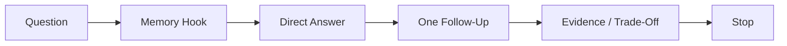
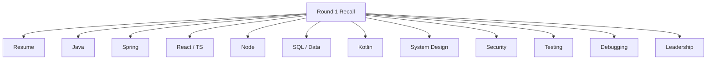
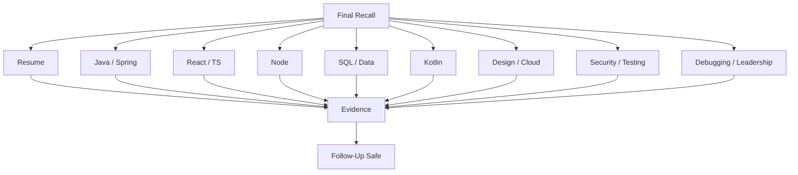
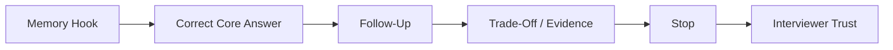

# VRIZE Interview Preparation — Pack 21
## Final Flashcards + One-Line Answers + Memory Hooks

**Target Role:** Senior Fullstack Developer — Round 1  
**Candidate:** Deepak Kumar  
**Priority:** P0 — Last-Mile Recall  
**Timebox:** 45–60 minutes  
**Approach:** KIS | Evidence-First | No Bluff | Rapid Recall  
**Mode:** Revision Only

---

## Readiness Gate

You should answer P0 flashcards in **15–30 seconds** and P1 flashcards in **30–60 seconds** without notes.

Goal:

```text
Trigger
→ Core Answer
→ Follow-Up
→ Evidence
→ Stop
```

---

## 1. Objective

This pack compresses the highest-value material from the earlier preparation packs into rapid-recall flashcards.

Use it for:

- last-day revision,
- five-minute recall sessions,
- answer tightening,
- memory reinforcement.

Do not use it to learn a topic for the first time.

---

## 2. Real-Life Analogy

This is your cockpit dashboard.

You already studied the engine. Now you need only the indicators that help you react quickly during the interview.

---

## 3. Visualization



---

## 4. Concept Map



---

## 5. Resume + Positioning Flashcards

### Flashcard 1 — Tell me about yourself

**Hook:** Recent Stack → Earlier Java/Kotlin → Senior Ownership → Hands-On Fit

> I’m a senior full-stack and solution engineering professional with experience across backend, frontend, mobile, cloud, and distributed systems. My recent hands-on work has been strongest in Node.js, TypeScript, React, MongoDB, Azure, APIs, Docker/Kubernetes, performance, security, CI/CD, and production support, while my earlier background includes Java, Kotlin, and Android. My scope has grown into architecture, code review, mentoring, stakeholder communication, and delivery, but I have remained close to implementation and troubleshooting.

### Flashcard 2 — Are you still hands-on?

> Yes. My recent work includes hands-on backend/full-stack engineering, APIs, React/TypeScript, Node.js, MongoDB, Azure, performance, security, CI/CD, containers, code review, and production troubleshooting.

### Flashcard 3 — Why Senior Fullstack Developer?

> I want senior engineering ownership without moving away from implementation. This role lets me contribute directly in coding, design, debugging, performance, review, and production while also bringing architecture and mentoring maturity.

### Flashcard 4 — Why VRIZE?

> The role aligns with my Java/Kotlin background, React and Node.js experience, APIs, databases, cloud, production engineering, and senior technical ownership.

### Flashcard 5 — Why should we hire you?

> I bring hands-on full-stack capability together with senior production judgment across backend, frontend, APIs, databases, cloud, security, performance, code review, and troubleshooting.

---

## 6. Java Flashcards

### Flashcard 6 — OOP

> Encapsulation, abstraction, inheritance, and polymorphism. In modern design I often prefer composition over deep inheritance.

### Flashcard 7 — Composition vs inheritance

> Inheritance creates an “is-a” relationship and tighter coupling; composition builds behavior from collaborating objects and is usually more flexible and testable.

### Flashcard 8 — `==` vs `equals()`

> `==` compares primitive values or object references. `equals()` represents logical equality when defined by the class.

### Flashcard 9 — `equals()` / `hashCode()` contract

> If two objects are equal according to `equals()`, they must return the same hash code.

### Flashcard 10 — Why String immutable?

> Immutability improves safety, thread-friendliness, hash stability, caching/interning behavior, and reliable use as map keys.

### Flashcard 11 — ArrayList vs LinkedList

> ArrayList gives O(1) indexed access and good locality. LinkedList has no O(1) indexed access; insertion is O(1) only after the node location is known.

### Flashcard 12 — HashMap internals

> HashMap computes a hash, finds a bucket, then uses equality to identify the exact key. Average get/put is O(1) with good distribution.

### Flashcard 13 — Mutable HashMap key danger

> If fields used in `equals()` or `hashCode()` change after insertion, retrieval can fail because the key may no longer map consistently.

### Flashcard 14 — HashMap vs ConcurrentHashMap

> HashMap is not designed for concurrent mutation. ConcurrentHashMap supports safe concurrent access with finer-grained concurrency control.

### Flashcard 15 — Comparable vs Comparator

> Comparable defines natural ordering; Comparator defines external/custom ordering.

### Flashcard 16 — `volatile`

> `volatile` provides visibility and ordering guarantees, but does not make compound operations such as `count++` atomic.

### Flashcard 17 — `synchronized`

> `synchronized` provides mutual exclusion around a critical section and memory-visibility guarantees.

### Flashcard 18 — Deadlock

> Threads wait indefinitely in a circular dependency for resources held by one another.

---

## 7. Spring Boot Flashcards

### Flashcard 19 — Spring vs Spring Boot

> Spring is the broader framework ecosystem. Spring Boot adds conventions, auto-configuration, embedded runtime support, and production-friendly setup.

### Flashcard 20 — IoC

> Inversion of Control means object creation and wiring are managed externally rather than by each object constructing everything itself.

### Flashcard 21 — Dependency Injection

> DI means an object receives dependencies from outside, reducing coupling and improving testability.

### Flashcard 22 — Why constructor injection?

> Dependencies are explicit, required dependencies exist at construction time, immutable fields are easier, and tests are simpler.

### Flashcard 23 — Bean

> A Spring bean is an object managed by the Spring container.

### Flashcard 24 — DTO vs entity

> DTO is an API/data-transfer contract; entity models persistence. I avoid exposing entities directly because API and DB models evolve differently.

### Flashcard 25 — JPA

> JPA is the Java persistence specification; Hibernate is a common implementation.

### Flashcard 26 — Lazy vs eager loading

> Lazy loads relationships when needed; eager loads immediately. Lazy can create N+1, while eager can over-fetch.

### Flashcard 27 — N+1

> One query loads parents, then additional queries run per parent for related data. Fix through fetch strategy, projection, joins, batching, or query redesign.

### Flashcard 28 — `@Transactional`

> Defines a transaction boundary so related DB operations succeed or fail atomically.

### Flashcard 29 — 401 vs 403

> 401 means authentication is missing/invalid. 403 means the user is authenticated but not authorized.

---

## 8. REST + Microservices Flashcards

### Flashcard 30 — REST

> REST is an architectural style that models resources and uses standard HTTP semantics for interaction.

### Flashcard 31 — PUT vs PATCH

> PUT generally represents idempotent replacement/complete update semantics; PATCH represents partial modification.

### Flashcard 32 — Idempotency

> Repeating the same request has the same intended effect as processing it once.

### Flashcard 33 — Monolith vs microservices

> Monoliths are simpler operationally. Microservices add independent deployment and boundaries but also network, data-consistency, observability, and operational complexity.

### Flashcard 34 — Sync vs async

> Synchronous calls give immediate response but couple latency/availability. Async decouples processing but introduces retries, duplicates, eventual consistency, and monitoring needs.

### Flashcard 35 — Circuit breaker

> Stops repeatedly calling a failing dependency, fails fast for a period, then probes recovery.

### Flashcard 36 — Retry rule

> Retry only transient failures, keep attempts bounded, use backoff, and ensure the operation is safe/idempotent.

---

## 9. React + TypeScript Flashcards

### Flashcard 37 — Props vs state

> Props are inputs from a parent. State is component-owned changing data that drives rendering.

### Flashcard 38 — `useEffect`

> `useEffect` synchronizes React with an external system such as a subscription, timer, browser API, or external service.

### Flashcard 39 — Effect cleanup

> Cleanup removes subscriptions, timers, listeners, or stale async work when dependencies change or the component unmounts.

### Flashcard 40 — `useMemo`

> Memoizes a computed value when recalculation or referential stability actually matters.

### Flashcard 41 — `useCallback`

> Memoizes a function reference, mainly when identity matters to children or hook dependencies.

### Flashcard 42 — `useRef`

> Stores a mutable value across renders without causing re-render and can reference DOM elements.

### Flashcard 43 — React key

> A key gives stable identity to list elements so React can match previous and next elements correctly.

### Flashcard 44 — Why not array index as key?

> Reordering/insertion/deletion can make React associate component state with the wrong item.

### Flashcard 45 — Closure

> A closure is a function retaining access to variables from its lexical scope after the outer function has returned.

### Flashcard 46 — Promise

> Represents eventual success or failure of an asynchronous operation.

### Flashcard 47 — `async/await`

> Syntax built on Promises that improves readability; it does not automatically make blocking work non-blocking.

### Flashcard 48 — `Promise.all`

> Runs independent Promise-based work concurrently and fails fast on rejection. Control fan-out to avoid overload.

### Flashcard 49 — `unknown` vs `any`

> `any` disables type safety. `unknown` requires narrowing before use and is safer for genuinely unknown data.

### Flashcard 50 — TypeScript runtime validation

> TypeScript types disappear at runtime, so HTTP/external input still requires runtime validation.

---

## 10. Node.js Flashcards

### Flashcard 51 — What is Node.js?

> A JavaScript runtime built on V8 with an event-driven, non-blocking I/O model.

### Flashcard 52 — Is Node single-threaded?

> Normal JavaScript primarily runs on one event-loop thread, but Node also uses OS async facilities, libuv, a thread pool for selected work, and optional worker threads.

### Flashcard 53 — What blocks Node?

> Long synchronous or CPU-heavy work on the main JavaScript thread blocks other callbacks.

### Flashcard 54 — Event loop

> Coordinates JavaScript execution with asynchronous completions and callbacks.

### Flashcard 55 — Streams

> Process data incrementally instead of loading the entire payload into memory.

### Flashcard 56 — Backpressure

> Slows/pauses the producer when the consumer cannot keep up, preventing unbounded buffering.

### Flashcard 57 — Worker threads

> Useful for CPU-heavy JavaScript that would otherwise block the event loop.

### Flashcard 58 — Express middleware

> Part of the HTTP request pipeline for cross-cutting concerns such as auth, validation, logging, rate limiting, and errors.

### Flashcard 59 — Graceful shutdown

> Stop new traffic, drain in-flight work within a deadline, close resources, flush telemetry, and exit.

---

## 11. SQL + Data Flashcards

### Flashcard 60 — INNER vs LEFT JOIN

> INNER returns matching rows; LEFT returns all left rows plus matches from the right.

### Flashcard 61 — WHERE vs HAVING

> WHERE filters rows before grouping; HAVING filters grouped/aggregated results.

### Flashcard 62 — Index

> An auxiliary data structure that speeds selected reads but adds storage and write-maintenance cost.

### Flashcard 63 — Why not index every column?

> Every index adds write cost, storage, maintenance, and optimizer complexity.

### Flashcard 64 — Composite index

> An index across multiple columns where column order matters for useful query access patterns.

### Flashcard 65 — Execution plan

> The database optimizer’s chosen strategy for table access, joins, indexes, sorts, and related operations.

### Flashcard 66 — ACID

```text
Atomicity
Consistency
Isolation
Durability
```

### Flashcard 67 — Deadlock

> Transactions wait on one another in a cycle; the DB typically aborts one participant.

### Flashcard 68 — Offset vs keyset pagination

> Offset is simple but can become slow and unstable at deep pages; keyset uses a stable cursor and is usually better for large sequential pagination.

### Flashcard 69 — MongoDB embed vs reference

> Embed when data is owned/read together; reference when data has separate lifecycle, growth, or shared access.

### Flashcard 70 — Redis cache-aside

> Check cache first, fall back to source on miss, then populate cache.

### Flashcard 71 — Neo4j use case

> Relationship-heavy data and multi-hop traversals where graph relationships are central to the query model.

---

## 12. Kotlin Flashcards

### Flashcard 72 — `val` vs `var`

> `val` is a read-only reference; `var` can be reassigned. A `val` can still point to a mutable object.

### Flashcard 73 — Null safety

> Kotlin distinguishes nullable and non-null types. Prefer safe calls, Elvis, validation, or better modeling over frequent `!!`.

### Flashcard 74 — Data class

> Designed for value-style data and provides generated equality, hash, copy, and string behavior.

### Flashcard 75 — Sealed type

> Models a controlled hierarchy and supports exhaustive state handling.

### Flashcard 76 — Coroutine

> A suspendable computation that runs on threads according to its context and can suspend/resume efficiently.

### Flashcard 77 — `suspend`

> Means a function may suspend within coroutine execution; it does not automatically move work to a background thread.

### Flashcard 78 — `launch` vs `async`

> `launch` returns Job for work without a result; `async` returns Deferred for a result that can be awaited.

### Flashcard 79 — Structured concurrency

> Child async work belongs to an explicit scope so lifetime, cancellation, and failure are predictable.

### Flashcard 80 — StateFlow vs SharedFlow

> StateFlow represents current observable state; SharedFlow is a more general hot shared stream.

### Flashcard 81 — KMP

> Shares Kotlin code across targets while retaining platform-specific implementations where needed.

---

## 13. System Design + Cloud Flashcards

### Flashcard 82 — Horizontal scaling

> Add instances and distribute load rather than only increasing one machine’s capacity.

### Flashcard 83 — Stateless service

> Request processing does not depend on local instance state between requests, so any healthy instance can handle the next request.

### Flashcard 84 — Load balancer

> Distributes traffic across healthy service instances.

### Flashcard 85 — Queue

> Buffers async work and decouples producers/consumers, while introducing retries, duplicates, backlog, and monitoring concerns.

### Flashcard 86 — Bulkhead

> Isolates resource pools/failure domains so one overloaded dependency does not consume all capacity.

### Flashcard 87 — Graceful degradation

> Keep essential functionality available when non-critical dependencies fail.

### Flashcard 88 — Pod

> Smallest deployable Kubernetes unit containing one or more tightly coupled containers.

### Flashcard 89 — Deployment

> Manages desired Pod replicas and rollout behavior.

### Flashcard 90 — Service

> Provides stable networking/access to a set of Pods.

### Flashcard 91 — Readiness vs liveness

> Readiness asks whether the instance can receive traffic; liveness asks whether it should be restarted.

---

## 14. Security + Testing Flashcards

### Flashcard 92 — Authentication vs authorization

> Authentication proves identity; authorization determines permitted actions/resources.

### Flashcard 93 — SQL injection

> Untrusted data becomes SQL syntax. Prevent primarily with parameterized queries or safe ORM binding.

### Flashcard 94 — XSS

> Attacker-controlled content executes in another user’s browser.

### Flashcard 95 — CORS

> Browser cross-origin policy, not authentication or authorization.

### Flashcard 96 — Unit vs integration test

> Unit tests focused logic with controlled dependencies; integration tests verify real component collaboration.

### Flashcard 97 — Coverage

> Coverage shows what code executed during tests; it does not prove assertion quality or business confidence.

### Flashcard 98 — Code review priority

```text
Correctness
→ Security
→ Data Integrity
→ Tests
→ Reliability
→ Performance
→ Maintainability
```

---

## 15. Debugging + Leadership Flashcards

### Flashcard 99 — Debugging sequence

```text
Symptom
→ Reproduce
→ Trace
→ Isolate
→ Evidence
→ Root Cause
→ Fix
→ Verify
```

### Flashcard 100 — Slow API

> Break total latency into application, DB, cache, network, and downstream-service time, then optimize the measured bottleneck.

### Flashcard 101 — Retry storm

> Dependency slows, retries multiply traffic, and dependency degrades further. Use bounded retries, backoff, jitter, idempotency, and circuit breaking where appropriate.

### Flashcard 102 — Conflict

> Move from personal preference to decision criteria such as correctness, maintainability, performance, delivery risk, and operational cost.

### Flashcard 103 — Mentoring

> Ask the engineer to explain reasoning, guide trade-offs, review implementation, and increase independent ownership over time.

### Flashcard 104 — Prioritization

```text
Production/User Impact
→ Security/Data Integrity
→ Blocking Dependency
→ Business Commitment
→ Remaining Work
```

### Flashcard 105 — Delivery vs quality

> Protect correctness, security, data integrity, minimum test confidence, and rollback safety; negotiate scope instead of essential quality.

---

## 16. Gap-Defense Flashcards

### Flashcard 106 — Spring Boot recent use

> Spring Boot is part of my broader backend competency, but my most recent named enterprise work has been stronger in Node.js/TypeScript, React, MongoDB, and Azure. I will not attach Spring Boot to a recent project unless that project actually used it.

### Flashcard 107 — Kafka

> I understand Kafka architecture and event-driven patterns. I would not claim production Kafka ownership unless I actually implemented it.

### Flashcard 108 — KMP

> I understand KMP architecture and have Kotlin/Android background. I would not claim production KMP delivery unless I actually delivered it.

### Flashcard 109 — Laravel

> Laravel is not one of my strongest recent production frameworks. I understand its core architecture and can map those concepts to backend patterns I already know.

### Flashcard 110 — “I don’t know”

> I have not used that specific feature deeply in production, so I would not overstate it. My understanding is [concept], and the closest real experience I can map it to is [adjacent experience].

---

## 17. Metric-Defense Flashcards

### Flashcard 111 — Metric formula

```text
System
→ Baseline
→ Change
→ Measurement
→ Timeframe
→ My Contribution
→ Result
```

### Flashcard 112 — 99.9%

Know:

```text
system
period
downtime definition
monitoring source
SLA / SLO / observed result
your contribution
```

### Flashcard 113 — 30% latency reduction

Know:

```text
endpoint
baseline
after
average / percentile
measurement tool
same workload
technical change
```

### Flashcard 114 — 60% faster release

Know:

```text
what was measured
before
after
pipeline change
time period
team vs individual contribution
```

---

## 18. Coding Pattern Flashcards

### Flashcard 115 — Fast lookup

```text
HashMap / HashSet
```

### Flashcard 116 — Pair / both ends

```text
Two Pointers
```

### Flashcard 117 — Contiguous range

```text
Sliding Window
```

### Flashcard 118 — Repeated range sum

```text
Prefix Sum
```

### Flashcard 119 — Sorted/monotonic search

```text
Binary Search
```

### Flashcard 120 — Top K

```text
Heap / PriorityQueue
```

### Flashcard 121 — Coding sequence

```text
Clarify
→ Baseline
→ Complexity
→ Pattern
→ Optimize
→ Code
→ Test
→ Final Complexity
```

---

## 19. Final 25 P0 Flashcards

These must be instant:

1. Tell me about yourself.
2. Are you still hands-on?
3. HashMap internals.
4. `equals()` / `hashCode()`.
5. ArrayList vs LinkedList.
6. `volatile` vs `synchronized`.
7. Spring vs Spring Boot.
8. Dependency injection.
9. N+1.
10. REST idempotency.
11. Props vs state.
12. `useEffect`.
13. `useMemo` vs `useCallback`.
14. `unknown` vs `any`.
15. Node event loop.
16. What blocks Node?
17. INNER vs LEFT JOIN.
18. Index.
19. ACID.
20. Kotlin null safety.
21. Coroutine.
22. Horizontal scaling.
23. Authentication vs authorization.
24. Unit vs integration.
25. Slow API debugging.

---

## 20. Quick Revision



---

## 21. 90-Second Ultra-Rapid Recall

```text
INTRO
senior full-stack + hands-on + architecture maturity

JAVA
HashMap + equals/hashCode + concurrency

SPRING
DI + REST + JPA + transaction

REACT
state + effect + memoization

TS
unknown != any

NODE
event loop + async I/O + streams

SQL
join + index + ACID

KOTLIN
null safety + coroutine

SYSTEM DESIGN
requirements -> bottleneck -> failure -> trade-off

SECURITY
authentication != authorization

TESTING
coverage != quality

DEBUGGING
reproduce -> trace -> isolate -> verify

LEADERSHIP
ownership -> decision -> result -> learning

EVIDENCE
baseline -> action -> measurement -> result

NO BLUFF
knowledge != production experience
```

---

## 22. Candidate Answer Mapping

| Area | Final Recall Target | Risk |
|---|---:|---|
| Resume Positioning | Instant | Low |
| Java | Instant | Low |
| Spring | Fast conceptual | Medium project mapping |
| React / TS | Instant | Low |
| Node.js | Instant | Low |
| SQL | Instant | Low |
| Kotlin | Fast | Low |
| System Design | Structured | Low |
| Security | Instant | Low |
| Testing | Instant | Low |
| Debugging | Structured | Low |
| Leadership | Story-based | Low |
| Kafka | Knowledge if unverified | Medium |
| KMP | Knowledge if unverified | High if overclaimed |
| Laravel | Gap defense | High if overclaimed |
| Metrics | Use only with measurement story | Medium |

---

## 23. Final Visualization



---

## Golden Rules

> **Flashcards are for recall, not robotic memorization.**

> **Start with the core answer and go deeper only when asked.**

> **Do not introduce unsupported technologies or metrics.**

> **If a claim cannot survive two follow-ups, make it safer.**

> **A concise correct answer is stronger than a long uncertain answer.**

Final memory formula:

> **Trigger → Core Answer → Follow-Up → Evidence → Stop**
