# Techlambda Resume Studio — Website Flow Diagrams

**Document Type:** Website Flow / UX Navigation Map  
**Product:** Techlambda Resume Studio  
**Release:** V1  
**Primary URL:** `techlambda.com/resume-services`  
**Career Intelligence Integration:** Not included in V1

---

# 1. Complete Website Flow

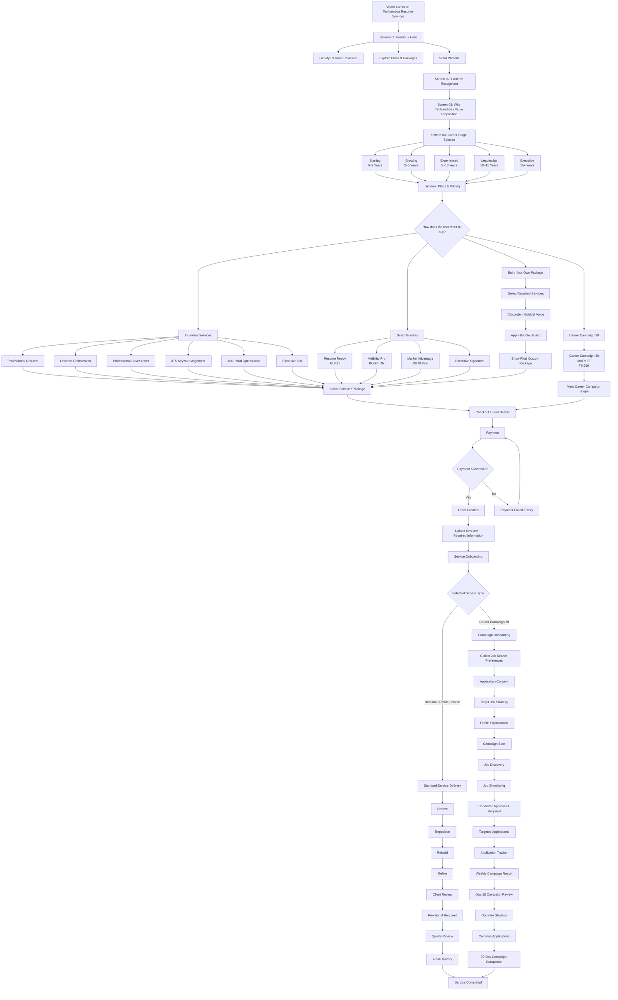

---

# 2. Public Website Screen Flow

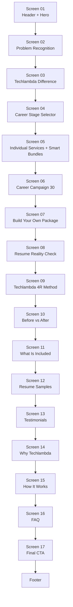

---

# 3. Header Navigation Flow

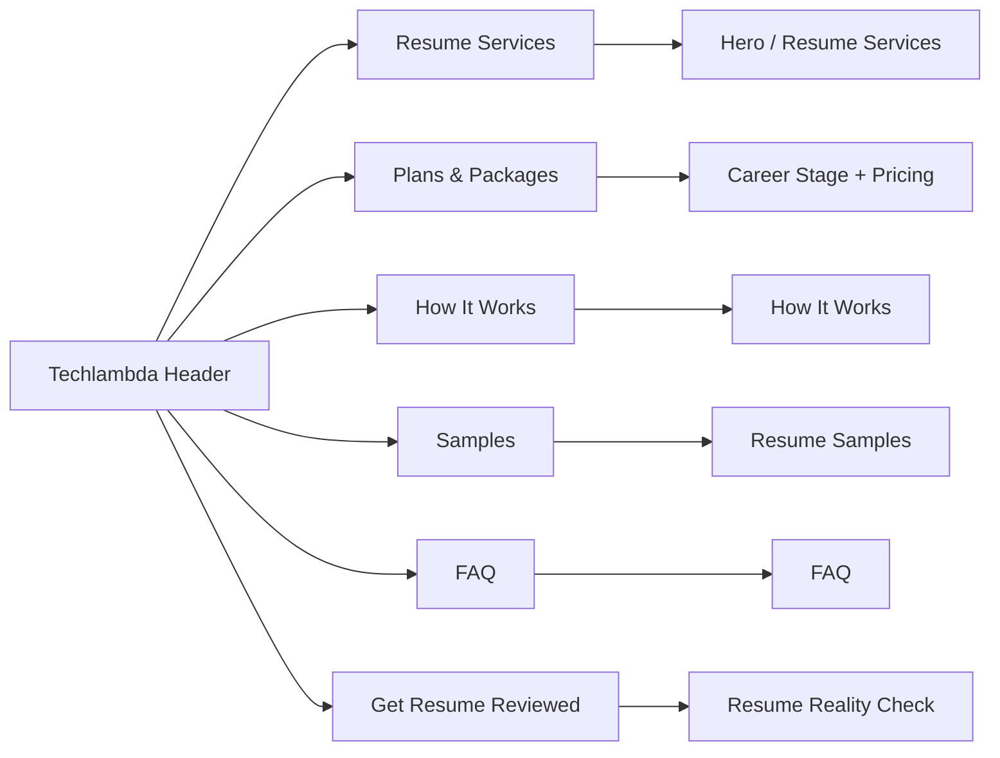

---

# 4. Resume Reality Check Flow

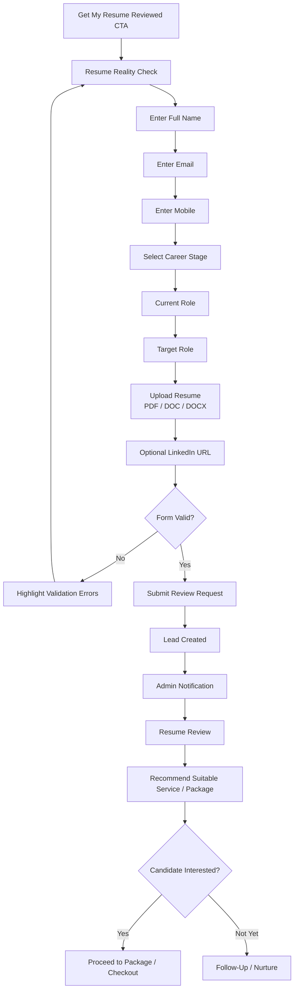

---

# 5. Career Stage & Dynamic Pricing Flow

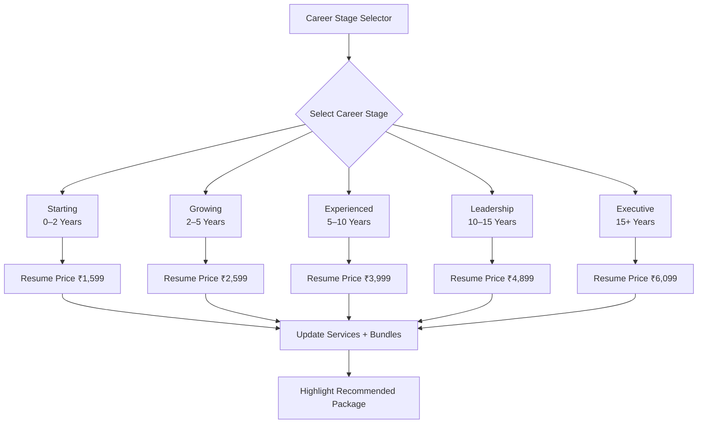

---

# 6. Package Progression

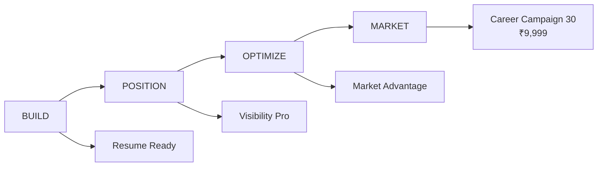

---

# 7. Individual Services Flow

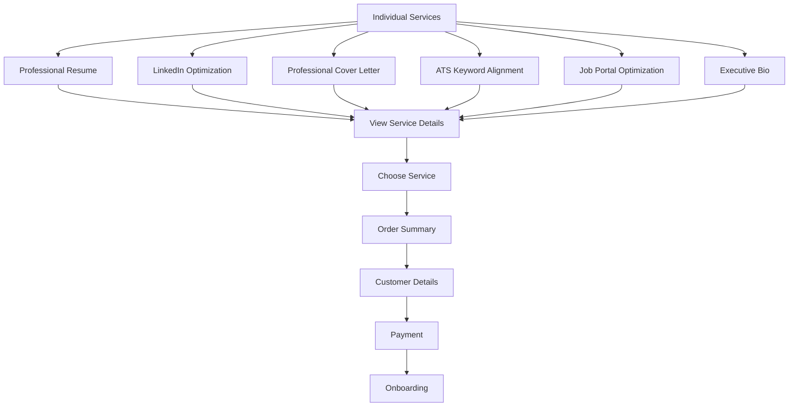

---

# 8. Smart Bundles Flow

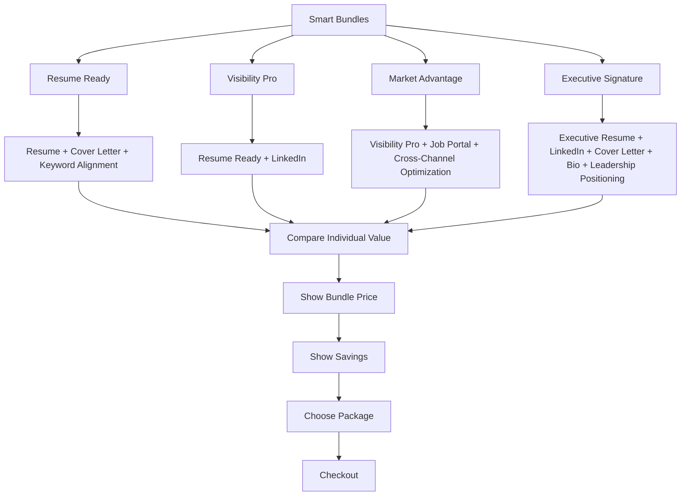

---

# 9. Build Your Own Package Flow

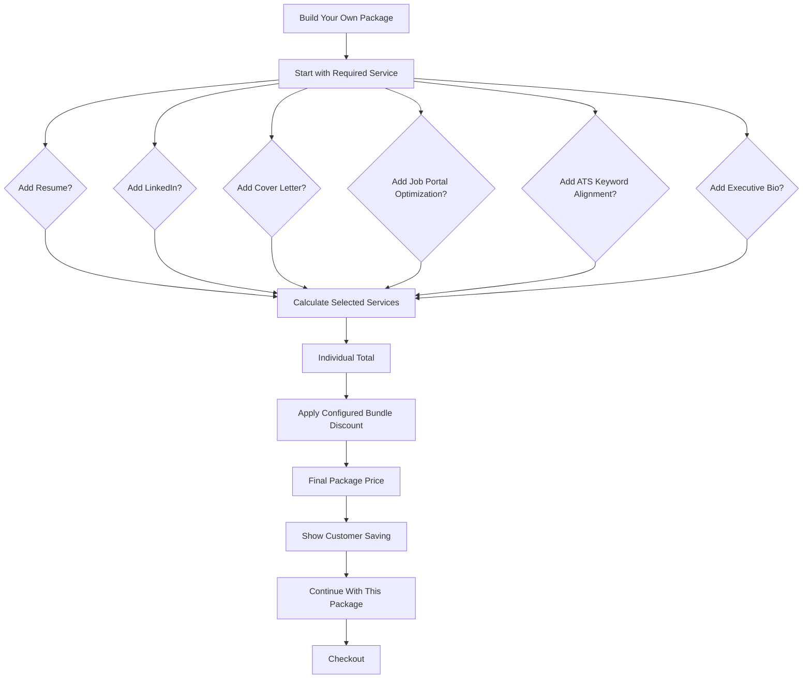

---

# 10. Career Campaign 30 — Complete Flow

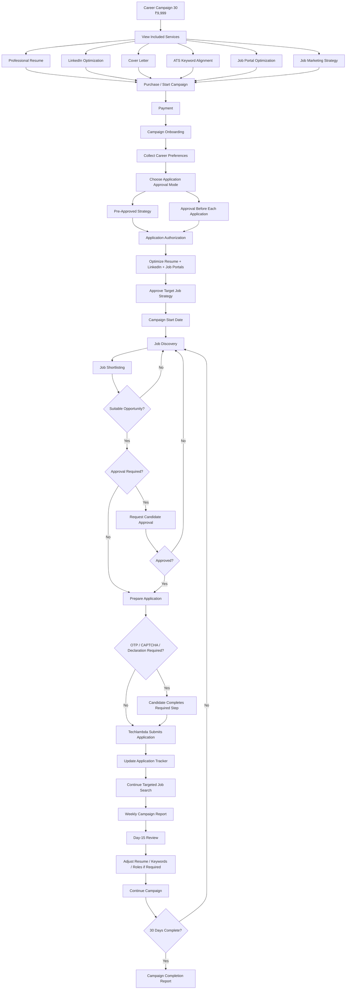

---

# 11. Career Campaign Application Status Flow

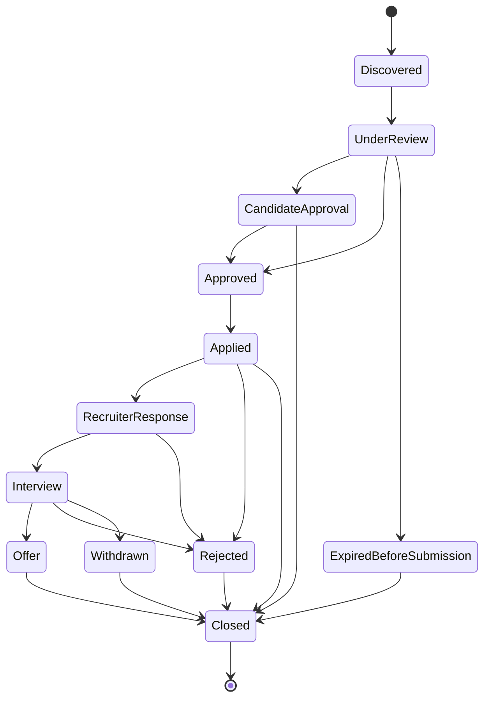

---

# 12. Standard Resume Service Delivery Flow — Techlambda 4R

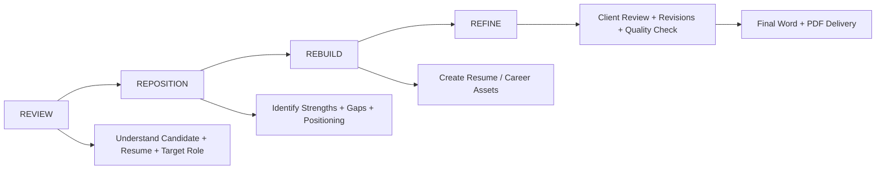

---

# 13. Checkout & Payment Flow

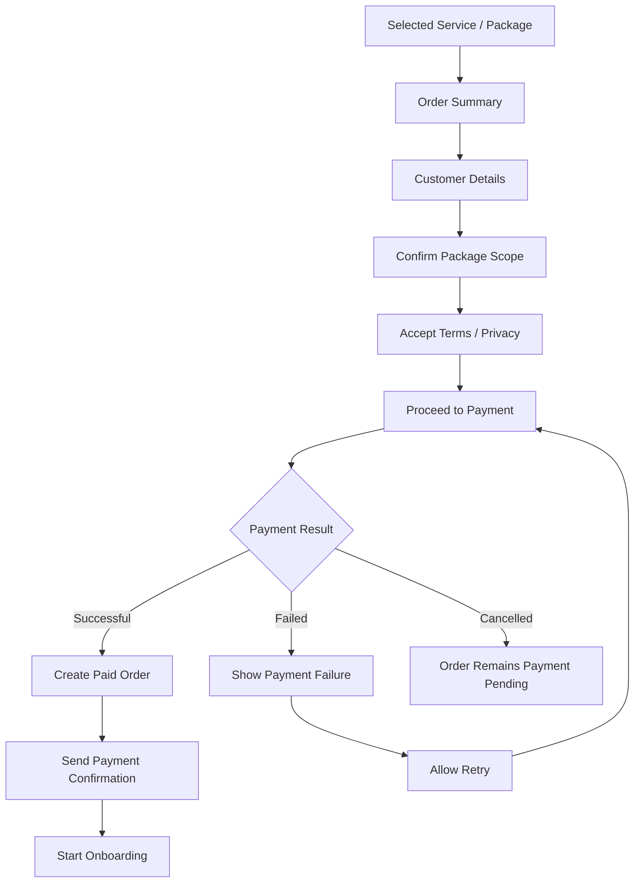

---

# 14. Admin / Operations Flow

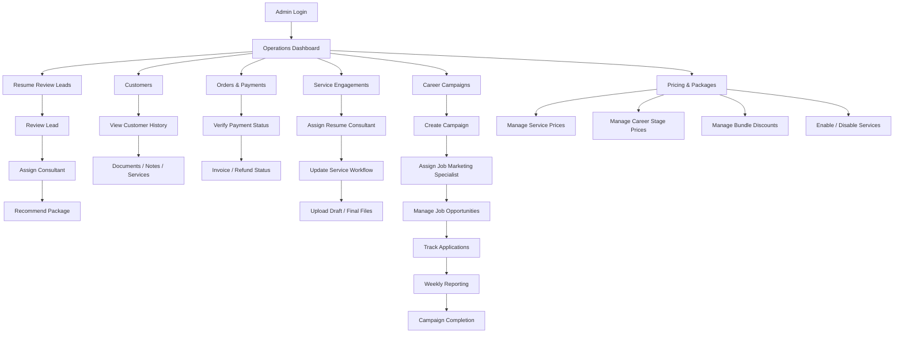

---

# 15. High-Level Business Funnel

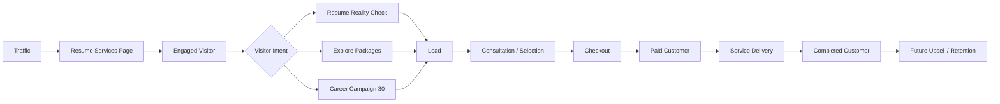

---

# 16. Screen-Wise Wireframe Roadmap

| Screen | Name | Primary Goal |
|---|---|---|
| 01 | Header + Hero | Explain offer and drive first CTA |
| 02 | Problem Recognition | Help visitor recognize resume/job-search pain |
| 03 | Techlambda Difference | Establish positioning and trust |
| 04 | Career Stage Selector | Personalize services and pricing |
| 05 | Individual Services & Smart Bundles | Main commercial selection |
| 06 | Career Campaign 30 | Sell ₹9,999 signature managed service |
| 07 | Build Your Own Package | Allow custom service combination |
| 08 | Resume Reality Check | Capture qualified leads |
| 09 | Techlambda 4R Method | Explain delivery methodology |
| 10 | Before vs After | Demonstrate professional transformation |
| 11 | What Is Included | Remove purchase uncertainty |
| 12 | Resume Samples | Demonstrate quality |
| 13 | Testimonials | Build social proof |
| 14 | Why Techlambda | Reinforce differentiation |
| 15 | How It Works | Explain customer journey |
| 16 | FAQ | Remove objections |
| 17 | Final CTA | Capture remaining visitors |
| 18 | Footer | Policies, navigation and company information |

---

# 17. Core Website Principle

The entire website should communicate this progression:

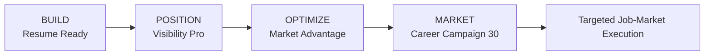

## Core Message

> **We don't stop at creating a stronger resume. For customers who choose Career Campaign 30, Techlambda helps take that professional profile into the job market through a structured, transparent and targeted 30-day campaign.**

---

# 18. V1 Boundary

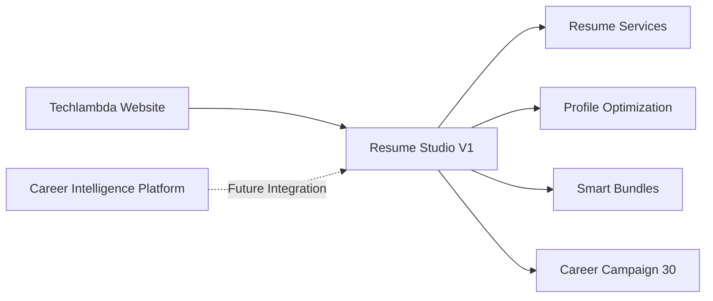

**Career Intelligence functionality is not exposed or required in V1.**

---

**Status:** Ready for screen-wise wireframing  
**Next:** Screen 02 — Problem Recognition + Value Proposition
